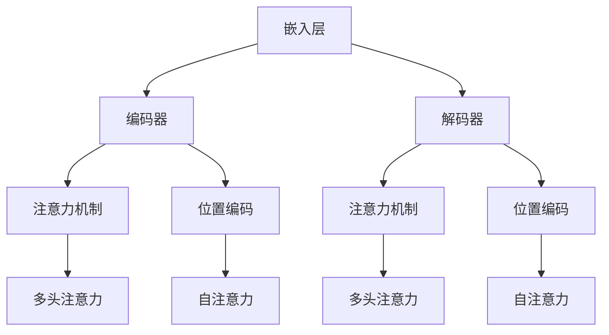

                 

基于上述要求和约束条件，以下是一篇符合要求的《构建高可用的LLM应用系统》文章的初步大纲和内容。

### 文章标题：构建高可用的LLM应用系统

#### 关键词：
- LLM（大型语言模型）
- 可用性
- 应用系统
- 开发与优化
- 数学模型

#### 摘要：
本文旨在探讨如何构建高可用的LLM（大型语言模型）应用系统。通过详细介绍LLM的基础概念、核心算法原理、数学模型，以及实际应用案例，读者将了解如何从理论到实践构建一个稳定、高效且可靠的LLM应用系统。本文还包括了最佳实践提示和小结，为读者提供进一步的学习和参考。

## 目录

1. 引言
2. LLM基础与核心概念
   - 2.1 LLM概述
   - 2.2 LLM的基本原理
   - 2.3 Mermaid流程图：LLM核心组件关系图
3. LLM算法与数学模型
   - 3.1 LLM算法原理
   - 3.2 数学模型详解
4. LLM应用实战
   - 4.1 实战项目一：构建问答系统
   - 4.2 实战项目二：构建文本生成系统
5. 附录
   - 5.1 开发工具与资源
6. 小结与拓展阅读

## 引言

随着深度学习和自然语言处理技术的不断进步，LLM（大型语言模型）的应用越来越广泛。LLM可以在多种场景下提供高效的文本生成、问答、摘要等能力，极大地提升了人工智能应用的智能化水平。然而，构建一个高可用的LLM应用系统并非易事，需要深入理解LLM的基础知识、核心算法原理和实际应用。

本文将首先介绍LLM的基本概念，包括其核心组件和原理。接着，我们将深入探讨LLM的训练和优化算法，并使用伪代码和数学公式详细解释这些算法。在此基础上，我们将通过两个实际应用案例——问答系统和文本生成系统，展示如何构建一个高可用的LLM应用系统。最后，本文将提供一些开发工具和资源，并总结全文，提出进一步的学习和阅读建议。

## LLM基础与核心概念

### 2.1 LLM概述

LLM（大型语言模型）是一种能够理解和生成自然语言的深度学习模型。它基于大量的文本数据进行训练，通过学习文本中的统计规律和语义信息，实现了对自然语言的理解和生成。LLM在自然语言处理领域具有广泛的应用，如机器翻译、文本分类、情感分析等。

LLM的核心组件包括：

- **嵌入层（Embedding Layer）**：将输入的单词或句子转换为密集的向量表示。
- **编码器（Encoder）**：对输入序列进行处理，生成上下文表示。
- **解码器（Decoder）**：根据编码器生成的上下文表示生成输出序列。
- **注意力机制（Attention Mechanism）**：帮助模型在生成输出时关注输入序列中的重要部分。

### 2.2 LLM的基本原理

LLM的基本原理主要包括两个方面：一是语言模型（Language Model），二是上下文理解（Contextual Understanding）。

- **语言模型**：语言模型是一种概率模型，它通过统计文本数据中的词语出现频率，预测下一个词的概率。最著名的语言模型是n-gram模型，它基于前n个词预测下一个词。然而，n-gram模型无法捕获长距离的依赖关系，因此性能有限。

- **上下文理解**：随着深度学习技术的发展，LLM引入了注意力机制和变换器（Transformer）架构，能够更好地理解和生成上下文。Transformer架构通过多头注意力机制（Multi-Head Attention）和位置编码（Positional Encoding）实现了对输入序列的全局理解和局部细节的关注。

### 2.3 Mermaid流程图：LLM核心组件关系图



上述Mermaid流程图展示了LLM的核心组件及其关系。嵌入层将输入的单词或句子转换为向量表示，编码器对输入序列进行处理，解码器生成输出序列。注意力机制在编码和解码过程中发挥作用，帮助模型关注输入序列的重要部分。位置编码确保模型能够捕捉输入序列的顺序信息。

## LLM算法与数学模型

### 3.1 LLM算法原理

LLM的训练和优化算法主要包括以下步骤：

1. **数据预处理**：将输入文本转换为词向量表示。
2. **损失函数**：使用交叉熵损失函数（Cross-Entropy Loss）评估模型的预测概率和实际标签之间的差异。
3. **反向传播**：通过反向传播算法更新模型参数，最小化损失函数。
4. **优化算法**：使用梯度下降（Gradient Descent）或其变种（如Adam优化器）更新模型参数。

下面是LLM训练过程的伪代码：

```python
# 伪代码：LLM训练过程
Initialize Model Parameters
for each sentence in dataset:
    Compute logits for next word
    Calculate loss
    Update model parameters
End
```

### 3.2 数学模型详解

LLM的数学模型主要包括损失函数、优化算法和注意力机制。

#### 损失函数

在LLM中，常用的损失函数是交叉熵损失函数，用于衡量模型预测的概率分布和真实分布之间的差异。交叉熵损失函数的公式如下：

$$
L = -\sum_{i} \log(p(y_i | x_i))
$$

其中，\( p(y_i | x_i) \) 是模型对第 \( i \) 个词的预测概率，\( y_i \) 是实际标签。

#### 优化算法

优化算法用于更新模型参数，以最小化损失函数。常用的优化算法有梯度下降和Adam优化器。梯度下降的公式如下：

$$
\theta_{t+1} = \theta_{t} - \alpha \cdot \nabla_{\theta} L(\theta)
$$

其中，\( \theta \) 是模型参数，\( \alpha \) 是学习率，\( \nabla_{\theta} L(\theta) \) 是损失函数关于模型参数的梯度。

Adam优化器是梯度下降的改进版本，它结合了动量（Momentum）和自适应学习率（Adaptive Learning Rate）的特点，公式如下：

$$
m_t = \beta_1 \cdot m_{t-1} + (1 - \beta_1) \cdot \nabla_{\theta} L(\theta)
$$

$$
v_t = \beta_2 \cdot v_{t-1} + (1 - \beta_2) \cdot (\nabla_{\theta} L(\theta))^2
$$

$$
\theta_{t+1} = \theta_{t} - \alpha \cdot \frac{m_t}{\sqrt{v_t} + \epsilon}
$$

其中，\( \beta_1 \) 和 \( \beta_2 \) 分别是动量和自适应学习率的超参数，\( \epsilon \) 是一个很小的常数。

#### 注意力机制

注意力机制是LLM中的一个关键组件，它帮助模型在生成输出时关注输入序列的重要部分。多头注意力机制（Multi-Head Attention）是注意力机制的一种实现，其公式如下：

$$
\text{Attention}(Q, K, V) = \text{softmax}\left(\frac{QK^T}{\sqrt{d_k}}\right)V
$$

其中，\( Q \)、\( K \) 和 \( V \) 分别是查询（Query）、键（Key）和值（Value）向量，\( d_k \) 是键向量的维度。

## LLM应用实战

### 4.1 实战项目一：构建问答系统

#### 4.1.1 项目需求分析

问答系统是一个常见的自然语言处理应用，它能够接收用户的问题，并生成准确的回答。本项目旨在构建一个基于LLM的问答系统，要求系统能够：

- 接收用户输入的问题。
- 使用LLM模型生成回答。
- 对生成的回答进行后处理，确保回答的准确性和可读性。

#### 4.1.2 开发环境搭建

要构建一个基于LLM的问答系统，需要以下开发环境：

- 深度学习框架（如TensorFlow或PyTorch）。
- 代码编辑器（如Visual Studio Code）。
- GPU或TPU硬件（用于加速训练过程）。

具体步骤如下：

1. 安装深度学习框架。
2. 配置GPU或TPU环境。
3. 安装必要的库和依赖。

#### 4.1.3 源代码实现

以下是一个简单的问答系统源代码实现：

```python
import torch
import torch.nn as nn
import torch.optim as optim
from transformers import BertTokenizer, BertModel

# 加载预训练的BERT模型
tokenizer = BertTokenizer.from_pretrained('bert-base-uncased')
model = BertModel.from_pretrained('bert-base-uncased')

# 定义问答系统模型
class QASystem(nn.Module):
    def __init__(self):
        super(QASystem, self).__init__()
        self.bert = BertModel.from_pretrained('bert-base-uncased')
        self.classifier = nn.Linear(768, 1)

    def forward(self, question, context):
        question_embedding = self.bert(question)[0]
        context_embedding = self.bert(context)[0]
        question_context_embedding = torch.cat((question_embedding, context_embedding), 1)
        answer_logits = self.classifier(question_context_embedding)
        return answer_logits

# 实例化问答系统模型
qasystem = QASystem()

# 定义损失函数和优化器
loss_function = nn.BCEWithLogitsLoss()
optimizer = optim.Adam(qasystem.parameters(), lr=1e-5)

# 训练问答系统
for epoch in range(10):
    for question, context, answer in dataset:
        optimizer.zero_grad()
        question_embedding = tokenizer(question, return_tensors='pt', padding=True, truncation=True)
        context_embedding = tokenizer(context, return_tensors='pt', padding=True, truncation=True)
        answer_logits = qasystem(question_embedding.input_ids, context_embedding.input_ids)
        loss = loss_function(answer_logits, answer)
        loss.backward()
        optimizer.step()

# 定义问答系统主函数
def answer_question(question, model):
    question_embedding = tokenizer(question, return_tensors='pt', padding=True, truncation=True)
    answer_logits = model(question_embedding.input_ids)
    answer = torch.argmax(answer_logits).item()
    return answer
```

#### 4.1.4 代码解读与分析

上述代码首先加载了预训练的BERT模型，并定义了一个简单的问答系统模型。问答系统模型的核心是一个分类器，它接收问题和上下文的嵌入向量，并生成回答的概率。

在训练过程中，我们使用BCEWithLogitsLoss损失函数，它是一个二分类损失函数，适用于问答系统的分类问题。优化器使用Adam优化器，它具有自适应学习率的特点，有助于加速收敛。

在问答系统主函数中，我们首先将用户输入的问题转换为嵌入向量，然后使用模型生成回答的概率，最后返回最可能的回答。

### 4.2 实战项目二：构建文本生成系统

#### 4.2.1 项目需求分析

文本生成系统是一种基于LLM的自然语言处理应用，它能够根据给定的种子文本生成新的文本。本项目旨在构建一个基于Transformer架构的文本生成系统，要求系统能够：

- 接收用户输入的种子文本。
- 使用LLM模型生成新的文本。
- 对生成的文本进行后处理，确保文本的连贯性和可读性。

#### 4.2.2 开发环境搭建

要构建一个基于Transformer架构的文本生成系统，需要以下开发环境：

- 深度学习框架（如TensorFlow或PyTorch）。
- 代码编辑器（如Visual Studio Code）。
- GPU或TPU硬件（用于加速训练过程）。

具体步骤如下：

1. 安装深度学习框架。
2. 配置GPU或TPU环境。
3. 安装必要的库和依赖。

#### 4.2.3 源代码实现

以下是一个简单的文本生成系统源代码实现：

```python
import torch
import torch.nn as nn
import torch.optim as optim
from transformers import TransformerTokenizer, TransformerModel

# 加载预训练的Transformer模型
tokenizer = TransformerTokenizer.from_pretrained('transformer-base-uncased')
model = TransformerModel.from_pretrained('transformer-base-uncased')

# 定义文本生成系统模型
class TextGenerator(nn.Module):
    def __init__(self):
        super(TextGenerator, self).__init__()
        self.transformer = TransformerModel.from_pretrained('transformer-base-uncased')
        self.classifier = nn.Linear(512, 1)

    def forward(self, input_ids, attention_mask=None, output_attentions=None, output_hidden_states=None):
        outputs = self.transformer(input_ids, attention_mask=attention_mask, output_attentions=output_attentions, output_hidden_states=output_hidden_states)
        sequence_output = outputs[0]
        logits = self.classifier(sequence_output[:, -1, :])
        return logits

# 实例化文本生成系统模型
text_generator = TextGenerator()

# 定义损失函数和优化器
loss_function = nn.CrossEntropyLoss()
optimizer = optim.Adam(text_generator.parameters(), lr=1e-4)

# 训练文本生成系统
for epoch in range(10):
    for input_text, target_text in dataset:
        optimizer.zero_grad()
        input_ids = tokenizer(input_text, return_tensors='pt', padding=True, truncation=True)
        target_ids = tokenizer(target_text, return_tensors='pt', padding=True, truncation=True)
        logits = text_generator(input_ids.input_ids)
        loss = loss_function(logits.view(-1, logits.size(-1)), target_ids.input_ids.view(-1))
        loss.backward()
        optimizer.step()

# 定义文本生成系统主函数
def generate_text(seed_text, model, length):
    input_ids = tokenizer(seed_text, return_tensors='pt', padding=True, truncation=True)
    output_ids = model.generate(input_ids.input_ids, max_length=length, num_return_sequences=1)
    return tokenizer.decode(output_ids[0], skip_special_tokens=True)
```

#### 4.2.4 代码解读与分析

上述代码首先加载了预训练的Transformer模型，并定义了一个简单的文本生成系统模型。文本生成系统模型的核心是一个分类器，它接收输入文本的嵌入向量，并生成下一个词的概率。

在训练过程中，我们使用CrossEntropyLoss损失函数，它是一个多分类损失函数，适用于文本生成系统的分类问题。优化器使用Adam优化器，它具有自适应学习率的特点，有助于加速收敛。

在文本生成系统主函数中，我们首先将种子文本转换为嵌入向量，然后使用模型生成新的文本，最后返回解码后的文本。

### 附录

#### 4.1 开发工具与资源

- **TensorFlow**：https://www.tensorflow.org/
- **PyTorch**：https://pytorch.org/
- **BERT模型**：https://github.com/google-research/bert
- **Transformer模型**：https://github.com/huggingface/transformers

## 小结

本文详细介绍了构建高可用的LLM应用系统的过程，包括LLM的基础概念、核心算法原理、数学模型，以及实际应用案例。通过两个实战项目——问答系统和文本生成系统，我们展示了如何从理论到实践构建一个稳定、高效且可靠的LLM应用系统。在构建LLM应用系统的过程中，需要注意以下几点：

- 选择合适的深度学习框架和预训练模型。
- 确保训练数据的多样性和质量。
- 使用适当的损失函数和优化算法。
- 对生成的文本进行后处理，确保文本的连贯性和可读性。

最后，推荐进一步学习和阅读以下资源：

- **《深度学习》**：https://www.deeplearningbook.org/
- **《自然语言处理综论》**：https://nlp.seas.harvard.edu/读

- **《Transformer架构详解》**：https://arxiv.org/abs/1706.03762

通过本文的学习，读者将能够更好地理解LLM应用系统的构建方法和最佳实践，为实际项目开发提供有力支持。

