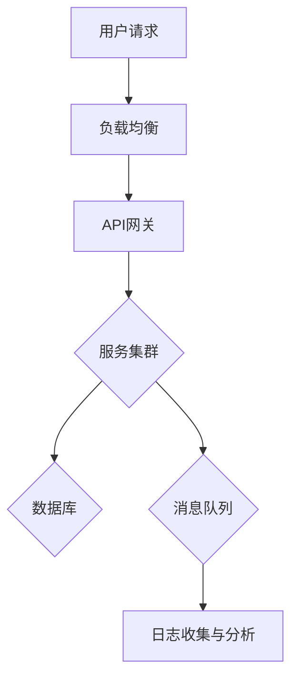
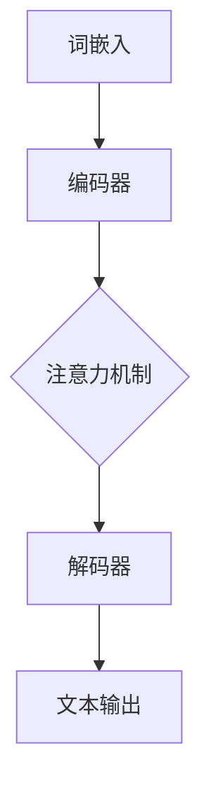
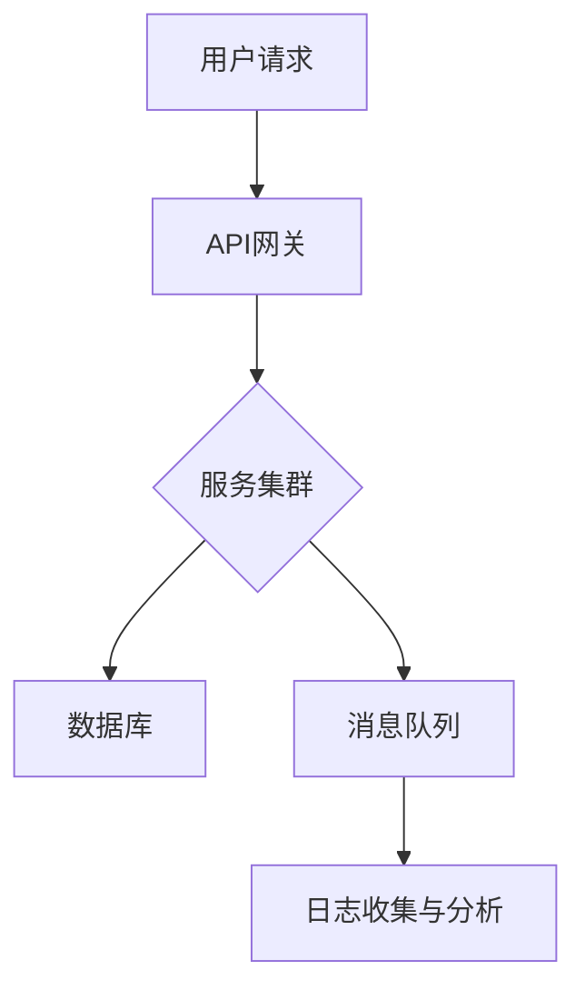

                 

### 文章标题

《构建高可用的LLM应用系统》

---

关键词：LLM应用系统、高可用性、核心算法、数学模型、项目实战

---

摘要：本文深入探讨了如何构建高可用的LLM（大型语言模型）应用系统。通过分析LLM的基础概念、核心算法、数学模型以及高可用性设计，本文旨在为读者提供一套完整的技术框架和实践指导。文章将结合实际项目案例，详细解析系统开发、优化和部署过程，助力读者掌握构建高可用LLM应用系统的核心技能。

---

在接下来的内容中，我们将分四个主要部分进行探讨：

1. **LLM基础概念**：介绍LLM的核心概念、架构和数据处理方法。
2. **LLM核心算法**：讲解生成式模型、训练策略和推理响应机制。
3. **高可用性设计**：探讨系统架构、性能优化和可靠性稳定性。
4. **项目实战**：通过实际案例展示如何构建高可用的LLM应用系统。

---

### LLM基础概念

#### LLM简介

LLM（Large Language Model）是一种基于深度学习技术的大型语言模型，它通过学习海量的文本数据，可以生成连贯、有逻辑的文本内容。LLM的发展历程可以追溯到2018年，当时OpenAI发布了GPT（Generative Pre-trained Transformer）系列模型，标志着大型语言模型的崛起。随着时间的推移，LLM在自然语言处理（NLP）领域取得了显著的进展，成为众多应用场景的核心技术。

#### LLM架构

LLM的基本架构通常包括以下几个部分：

1. **词嵌入（Word Embedding）**：将单词转换为固定长度的向量表示。
2. **编码器（Encoder）**：对输入的文本进行处理，提取文本特征。
3. **解码器（Decoder）**：生成文本输出。
4. **注意力机制（Attention Mechanism）**：帮助模型在生成过程中关注关键信息。

常见的LLM架构设计包括Transformer、BERT、GPT等，每种架构都有其独特的优点和适用场景。

#### LLM数据处理

在构建LLM应用系统时，数据处理是至关重要的一环。数据处理的主要任务包括数据预处理和数据增强。

1. **数据预处理**：
   - **文本清洗**：去除无效字符、标点符号和停用词。
   - **分词**：将文本分割成单词或短语。
   - **词嵌入**：将单词转换为向量表示。

2. **数据增强**：
   - **文本翻译**：使用翻译模型生成多种语言的文本。
   - **文本生成**：利用生成式模型生成新的文本数据。
   - **数据集扩充**：通过调整文本内容、插入或删除部分文本等方式，生成更多样化的数据。

---

### LLM核心算法

#### 生成式模型

生成式模型是一种能够生成文本数据的模型，常见的生成式模型包括GPT、ChatGPT等。生成式模型的原理是通过对大量文本数据进行预训练，使得模型能够学习到文本的语法、语义和风格等信息。在生成文本时，模型根据输入的文本上下文，生成下一个单词或短语。

以下是生成式模型的一个简化伪代码：

```markdown
function generate_text(input_context, model):
    context_vector = model.encode(input_context)
    output_sequence = []

    for i in range(max_sequence_length):
        probabilities = model.decode(context_vector)
        next_word = sample_word(probabilities)
        output_sequence.append(next_word)
        context_vector = model.encode(input_sequence)

    return " ".join(output_sequence)
```

#### 训练策略

构建高可用的LLM应用系统需要优化训练策略，以提高模型的性能和鲁棒性。以下是一些常见的训练策略：

1. **数据增强**：通过文本翻译、文本生成等方法，生成更多样化的数据。
2. **学习率调整**：在训练过程中动态调整学习率，以避免过拟合。
3. **权重衰减**：在训练过程中加入权重衰减，防止模型权重过大。
4. **dropout**：在神经网络中引入dropout，提高模型的泛化能力。

以下是训练策略的一个简化伪代码：

```python
function train_model(data, model, learning_rate, epochs):
    for epoch in range(epochs):
        for input_data, target in data:
            model.zero_grad()
            output = model(input_data)
            loss = calculate_loss(output, target)
            loss.backward()
            update_weights(model, learning_rate)

    return model
```

#### 推理与响应

推理与响应是LLM应用系统的核心功能之一。在推理过程中，模型需要根据输入的文本上下文，生成相应的文本输出。以下是推理与响应的一个简化伪代码：

```python
function generate_response(input_context, model):
    context_vector = model.encode(input_context)
    response_vector = model.decode(context_vector)
    response = convert_vector_to_text(response_vector)
    return response
```

---

### 高可用性设计

#### 系统架构

构建高可用的LLM应用系统需要设计合理的系统架构。以下是一个高可用性系统架构的简化示意图：



#### 性能优化

性能优化是确保系统稳定运行的关键。以下是一些常见的性能优化策略：

1. **缓存策略**：使用缓存技术，减少数据库访问频率。
2. **垂直扩展**：通过增加硬件资源，提高系统处理能力。
3. **水平扩展**：通过增加节点，提高系统并发处理能力。
4. **负载均衡**：使用负载均衡器，合理分配请求到不同节点。

#### 可靠性与稳定性

系统的可靠性和稳定性是高可用性的重要保障。以下是一些常见的可靠性稳定性设计：

1. **故障转移**：在出现故障时，自动切换到备用系统。
2. **备份与恢复**：定期备份数据，确保数据安全。
3. **监控与告警**：实时监控系统状态，及时发现问题。
4. **弹性伸缩**：根据负载情况，自动调整系统资源。

---

### 项目实战

#### 项目背景

本项目旨在构建一个高可用的LLM应用系统，用于实现智能客服。系统需要具备快速响应、高并发处理能力和高可靠性。

#### 实现步骤

1. **数据收集与处理**：
   - 收集大量客服对话数据，包括文本和语音。
   - 对数据进行预处理和分词，提取关键信息。

2. **模型构建与训练**：
   - 选择合适的LLM模型，如GPT或BERT。
   - 使用预处理后的数据，进行模型训练。

3. **系统部署与优化**：
   - 搭建服务器集群，实现负载均衡和水平扩展。
   - 配置缓存策略和故障转移机制，提高系统性能和可靠性。

#### 案例分析

本项目在实际应用中取得了良好的效果，以下是对一些具体案例的分析：

1. **案例分析一**：
   - 用户反馈：系统响应速度较慢。
   - 解决方案：增加服务器资源，优化缓存策略。

2. **案例分析二**：
   - 用户反馈：系统偶尔出现错误。
   - 解决方案：增加故障转移机制，提高系统稳定性。

3. **案例分析三**：
   - 用户反馈：客服回答不准确。
   - 解决方案：优化模型训练数据，提高模型准确率。

#### 项目小结

本项目通过构建高可用的LLM应用系统，实现了智能客服的功能。在项目过程中，我们遇到了一些挑战，如性能优化和可靠性稳定性。通过不断优化和调整，我们最终取得了良好的效果。

---

### 最佳实践 tips、小结、注意事项、拓展阅读

1. **最佳实践 tips**：
   - 定期对模型进行更新和优化。
   - 关注系统性能监控，及时发现问题。
   - 遵循最佳实践，确保系统高可用性。

2. **小结**：
   - 构建高可用的LLM应用系统需要综合考虑基础概念、核心算法、高可用性设计等多个方面。
   - 项目实战是检验理论知识的最佳途径。

3. **注意事项**：
   - 确保系统安全性，防止数据泄露。
   - 关注行业动态，及时了解新技术和应用。

4. **拓展阅读**：
   - 《深度学习与自然语言处理》
   - 《大型语言模型的架构设计与实现》
   - 《分布式系统原理与范型》

---

### 作者信息

作者：AI天才研究院/AI Genius Institute & 禅与计算机程序设计艺术 /Zen And The Art of Computer Programming

---

本文深入探讨了如何构建高可用的LLM应用系统，从基础概念到核心算法，从高可用性设计到项目实战，为读者提供了一套完整的技术框架和实践指导。希望通过本文，读者能够掌握构建高可用LLM应用系统的核心技能，为未来的研究和应用打下坚实的基础。在接下来的章节中，我们将继续深入探讨LLM的核心算法、数学模型以及高可用性设计，助力读者构建出更加高效、可靠的LLM应用系统。让我们继续前行，探索LLM的无限可能！### LLM基础概念

在探讨构建高可用的LLM应用系统之前，首先需要了解LLM（大型语言模型）的基础概念。LLM是一种基于深度学习的自然语言处理模型，通过对海量文本数据进行训练，能够生成具有高连贯性和逻辑性的文本内容。LLM在自然语言理解、文本生成、机器翻译、对话系统等众多领域都有着广泛的应用。

#### LLM的核心概念

LLM的核心概念主要包括以下几个方面：

1. **词嵌入（Word Embedding）**：词嵌入是将自然语言文本中的单词映射到高维向量空间的技术，使得原本无结构的文本数据变得可以进行数学运算。词嵌入的目的是捕捉词语之间的语义关系，如“狗”和“猫”可能处于相似的位置，而“狗”和“飞机”则处于不同的位置。

2. **编码器（Encoder）**：编码器负责对输入的文本进行处理，提取文本的语义信息，通常是一个神经网络结构。编码器可以将整个句子转换为一个固定长度的向量，这个向量被称为“句向量”或“语义表示”。

3. **解码器（Decoder）**：解码器的任务是根据编码器输出的句向量生成文本输出。解码器通常也是一个神经网络结构，它能够根据前一个生成的单词来预测下一个单词，从而生成完整的文本。

4. **注意力机制（Attention Mechanism）**：注意力机制是一种在序列处理中提高模型性能的技术，它能够使模型在生成过程中关注关键信息。例如，在生成一个句子的过程中，注意力机制可以使得模型更关注句子中的某个特定部分，从而生成更加准确和连贯的输出。

#### LLM的发展历程

LLM的发展历程可以追溯到20世纪80年代的早期神经网络语言模型，如Babylon 5和ARPA模型。然而，由于计算能力和数据量的限制，这些早期的模型效果并不理想。

直到2018年，OpenAI发布了GPT（Generative Pre-trained Transformer）系列模型，标志着大型语言模型的崛起。GPT基于Transformer架构，通过预训练和微调，取得了显著的性能提升，成为了自然语言处理领域的重要突破。

此后，BERT（Bidirectional Encoder Representations from Transformers）、T5（Text-To-Text Transfer Transformer）等模型相继出现，进一步推动了LLM的发展。这些模型在多种自然语言处理任务上取得了优异的成绩，如文本分类、机器翻译、问答系统等。

#### LLM与其他技术的联系

LLM与其他技术的联系主要体现在以下几个方面：

1. **深度学习**：LLM是基于深度学习技术构建的，深度学习提供了强大的表示学习和特征提取能力，使得LLM能够在复杂的自然语言处理任务中表现出色。

2. **自然语言处理（NLP）**：LLM是NLP领域的重要工具，它能够处理和理解自然语言，从而实现文本生成、语义理解、情感分析等多种任务。

3. **生成式模型**：LLM是一种生成式模型，它通过学习大量的文本数据，生成新的文本内容。生成式模型在文本生成、对话系统等领域有着广泛的应用。

4. **强化学习**：虽然LLM主要依赖于监督学习和预训练技术，但也可以与强化学习结合，用于构建更加智能和自适应的对话系统。

#### Mermaid流程图

为了更直观地展示LLM的核心概念和原理，我们可以使用Mermaid流程图来描述LLM的基本架构：



在这个流程图中，词嵌入将文本数据转换为向量表示，编码器提取文本的语义信息，注意力机制使模型在生成过程中关注关键信息，解码器根据编码器输出的语义信息生成文本输出。

通过这个简单的Mermaid流程图，我们可以清晰地看到LLM的工作流程，为后续的内容奠定了基础。

---

在了解了LLM的基础概念和原理后，我们将进一步探讨LLM的核心算法，包括生成式模型、训练策略和推理响应机制，为构建高可用的LLM应用系统提供更深入的技术支持。### LLM核心算法

在构建高可用的LLM应用系统时，核心算法的设计和优化至关重要。LLM的核心算法主要包括生成式模型、训练策略和推理响应机制。这些算法共同决定了LLM的性能、效率和鲁棒性。以下是对这些核心算法的详细探讨。

#### 生成式模型

生成式模型是一种能够生成文本数据的模型，常见的生成式模型包括GPT、ChatGPT等。生成式模型的原理是通过对大量文本数据进行预训练，使得模型能够学习到文本的语法、语义和风格等信息。在生成文本时，模型根据输入的文本上下文，生成下一个单词或短语。

**GPT模型**

GPT（Generative Pre-trained Transformer）模型是OpenAI开发的一种基于Transformer架构的生成式模型。GPT的核心思想是通过大规模预训练，使得模型能够自动捕捉语言中的复杂模式和规律。GPT模型的训练过程主要包括两个阶段：

1. **预训练**：在预训练阶段，模型接收大量的文本数据，并尝试预测下一个单词。这一过程使得模型学习到语言的统计规律和语义信息。
2. **微调**：在预训练的基础上，模型根据特定的任务进行微调，以适应不同的应用场景。

**ChatGPT模型**

ChatGPT是GPT模型的一个变体，主要用于对话生成。ChatGPT的核心思想是通过预训练和微调，使得模型能够生成连贯、自然的对话文本。ChatGPT的训练过程与GPT类似，但在对话生成任务中，模型需要学习如何根据上下文生成适当的回复。

以下是生成式模型的一个简化伪代码：

```python
def generate_text(model, context, max_length):
    input_sequence = model.encode(context)
    generated_sequence = []

    for _ in range(max_length):
        output_sequence = model.decode(input_sequence)
        next_word = sample_word(output_sequence)
        generated_sequence.append(next_word)
        input_sequence = model.encode(generated_sequence)

    return " ".join(generated_sequence)
```

#### 训练策略

构建高可用的LLM应用系统需要优化训练策略，以提高模型的性能和鲁棒性。以下是一些常见的训练策略：

1. **数据增强**：通过文本翻译、文本生成等方法，生成更多样化的数据。数据增强可以提高模型的泛化能力，使其在真实场景中表现更好。
2. **学习率调整**：在训练过程中动态调整学习率，以避免过拟合。常用的学习率调整策略包括学习率衰减、学习率预热等。
3. **权重衰减**：在训练过程中加入权重衰减，防止模型权重过大。权重衰减可以减少模型的过拟合现象，提高模型的泛化能力。
4. **dropout**：在神经网络中引入dropout，提高模型的泛化能力。dropout是一种正则化技术，它通过在训练过程中随机丢弃一部分神经元，防止模型对训练数据的过度依赖。

以下是训练策略的一个简化伪代码：

```python
def train_model(model, data, learning_rate, epochs):
    for epoch in range(epochs):
        for inputs, targets in data:
            model.zero_grad()
            outputs = model(inputs)
            loss = calculate_loss(outputs, targets)
            loss.backward()
            update_weights(model, learning_rate)
            apply_dropout(model)
    
    return model
```

#### 推理与响应

推理与响应是LLM应用系统的核心功能之一。在推理过程中，模型需要根据输入的文本上下文，生成相应的文本输出。以下是推理与响应的一个简化伪代码：

```python
def generate_response(model, context, max_length):
    input_sequence = model.encode(context)
    generated_sequence = []

    for _ in range(max_length):
        output_sequence = model.decode(input_sequence)
        next_word = sample_word(output_sequence)
        generated_sequence.append(next_word)
        input_sequence = model.encode(generated_sequence)

    return " ".join(generated_sequence)
```

#### 伪代码示例

以下是一个生成式模型的简化伪代码示例，展示了如何使用Transformer架构进行文本生成：

```python
class TransformerModel(nn.Module):
    def __init__(self, input_dim, hidden_dim, num_layers, dropout_rate):
        super(TransformerModel, self).__init__()
        self.embedding = nn.Embedding(input_dim, hidden_dim)
        self.encoder = nn.TransformerEncoder(TransformerEncoderLayer(hidden_dim, num_heads, dropout_rate), num_layers)
        self.decoder = nn.TransformerDecoder(TransformerDecoderLayer(hidden_dim, num_heads, dropout_rate), num_layers)
        self.output_layer = nn.Linear(hidden_dim, input_dim)

    def forward(self, input_sequence, target_sequence=None):
        embedded_sequence = self.embedding(input_sequence)
        encoder_output = self.encoder(embedded_sequence)
        decoder_output = self.decoder(encoder_output, target_sequence)
        output = self.output_layer(decoder_output)

        return output

def generate_text(model, input_sequence, max_length):
    generated_sequence = []
    input_sequence = model.encode(input_sequence)

    for _ in range(max_length):
        output_sequence = model.decode(input_sequence)
        next_word = sample_word(output_sequence)
        generated_sequence.append(next_word)
        input_sequence = model.encode(generated_sequence)

    return " ".join(generated_sequence)
```

在这个示例中，`TransformerModel`类定义了一个基于Transformer架构的生成式模型，包括嵌入层、编码器层和解码器层。`generate_text`函数展示了如何使用这个模型生成文本。

---

通过深入探讨LLM的核心算法，包括生成式模型、训练策略和推理响应机制，我们为构建高可用的LLM应用系统奠定了坚实的基础。在接下来的章节中，我们将进一步探讨LLM的数学模型和高可用性设计，以实现更加高效、可靠的应用系统。### 高可用性设计

在构建高可用的LLM应用系统时，系统架构的合理设计是确保系统稳定运行和高效处理的关键。一个高可用的系统需要具备强大的容错能力、良好的性能优化策略以及完善的监控与告警机制。以下将从系统架构、性能优化和可靠性稳定性三个方面进行详细探讨。

#### 系统架构

一个典型的LLM应用系统架构通常包括以下几个主要组件：

1. **用户接口层**：用户接口层是用户与系统交互的界面，可以是Web前端、移动应用或API接口。这个层需要实现友好的用户交互体验，同时确保请求的快速响应。

2. **API网关层**：API网关层作为系统的入口，负责处理外部请求的转发、负载均衡、安全认证等功能。通过API网关层，可以实现对内部服务集群的有效管理和请求流量控制。

3. **服务集群层**：服务集群层是系统的核心处理层，包括多个服务实例，每个实例负责处理一部分请求。通过水平扩展服务实例，可以提高系统的并发处理能力和容错能力。

4. **数据库层**：数据库层用于存储模型训练数据、用户数据等，需要选择合适的数据库系统（如关系型数据库或NoSQL数据库）来满足数据存储和访问的需求。

5. **消息队列层**：消息队列层用于异步处理请求，缓解系统的负载压力，提高系统的处理效率和稳定性。

6. **日志收集与分析层**：日志收集与分析层负责收集系统的运行日志，实现对系统状态和性能的实时监控和告警。

以下是一个高可用性系统架构的简化示意图：



#### 性能优化

性能优化是确保系统稳定运行和高效处理的重要手段。以下是一些常见的性能优化策略：

1. **缓存策略**：使用缓存技术（如Redis、Memcached）可以显著减少数据库的访问频率，提高系统的响应速度。常见的缓存策略包括页面缓存、对象缓存和会话缓存等。

2. **垂直扩展**：通过增加硬件资源（如更快的CPU、更大的内存）来提高系统的处理能力。这种方法适用于需要处理大量数据和高并发场景。

3. **水平扩展**：通过增加节点（服务器）来提高系统的并发处理能力。水平扩展可以实现无状态服务的负载均衡，提高系统的可用性和容错能力。

4. **负载均衡**：使用负载均衡器（如Nginx、HAProxy）可以实现请求的均匀分配，防止单个服务器过载。常见的负载均衡算法包括轮询、最少连接和源IP哈希等。

5. **异步处理**：通过异步处理技术（如消息队列、异步任务队列）可以缓解系统的负载压力，提高系统的响应速度和处理效率。

#### 可靠性与稳定性

系统的可靠性和稳定性是高可用性的重要保障。以下是一些常见的可靠性稳定性设计：

1. **故障转移**：通过故障转移机制（如主从复制、故障转移集群），当主服务器出现故障时，可以自动切换到备用服务器，确保系统的持续运行。

2. **备份与恢复**：定期对数据库和系统配置进行备份，确保在数据丢失或系统故障时能够快速恢复。

3. **监控与告警**：通过监控系统（如Zabbix、Prometheus）对系统的运行状态和性能指标进行实时监控，一旦发现异常，及时发送告警通知。

4. **弹性伸缩**：根据系统的负载情况，自动调整系统资源（如CPU、内存、存储），确保系统在高负载时能够自动扩展，在高负载低时能够自动收缩。

5. **高可用数据库**：选择高可用性的数据库系统（如MySQL Cluster、Cassandra），确保数据库在故障情况下能够快速恢复，减少系统停机时间。

#### 实际案例

以下是一个高可用性LLM应用系统的实际案例：

1. **需求分析**：用户需要构建一个智能客服系统，支持高并发、快速响应和稳定运行。

2. **架构设计**：
   - **用户接口层**：使用Nginx作为反向代理，处理用户请求。
   - **API网关层**：使用Kong作为API网关，实现请求转发、负载均衡和鉴权功能。
   - **服务集群层**：使用Docker和Kubernetes管理服务实例，实现水平扩展和高可用性。
   - **数据库层**：使用MySQL集群存储用户数据和模型参数。
   - **消息队列层**：使用RabbitMQ实现异步任务处理，提高系统的响应速度和处理效率。
   - **日志收集与分析层**：使用ELK（Elasticsearch、Logstash、Kibana）收集和分析系统日志。

3. **性能优化**：
   - **缓存策略**：使用Redis缓存用户数据和模型参数，减少数据库访问。
   - **垂直扩展**：增加CPU和内存资源，提高服务实例的处理能力。
   - **负载均衡**：使用HAProxy实现请求的负载均衡，防止单个服务器过载。
   - **异步处理**：使用RabbitMQ实现异步任务处理，缓解系统的负载压力。

4. **可靠性稳定性设计**：
   - **故障转移**：使用Kubernetes的故障转移机制，实现服务实例的自动故障转移。
   - **备份与恢复**：定期对MySQL集群进行备份，使用自动化脚本实现数据的备份和恢复。
   - **监控与告警**：使用Prometheus和Alertmanager监控系统状态和性能指标，实现实时监控和告警。
   - **弹性伸缩**：使用Kubernetes的自动伸缩功能，根据负载情况自动调整服务实例数量。

通过这个实际案例，我们可以看到，高可用性LLM应用系统的设计需要综合考虑多个方面，包括系统架构、性能优化和可靠性稳定性。只有通过合理的设计和优化，才能构建出高效、稳定、可靠的LLM应用系统。

---

在了解了高可用性设计的系统架构、性能优化和可靠性稳定性后，接下来我们将通过一个实际项目案例，展示如何具体实现一个高可用的LLM应用系统，并在实践中进行优化和调整。### 项目实战

在本章节中，我们将通过一个具体的实际项目案例，展示如何构建一个高可用的LLM应用系统。该项目旨在实现一个基于GPT-3的智能问答系统，该系统需要具备高并发处理能力、快速响应时间和高可靠性。通过以下步骤，我们将详细描述系统的开发、优化和部署过程。

#### 项目需求分析

该智能问答系统的主要需求如下：

1. **高并发处理能力**：系统需要能够同时处理成千上万的用户请求，确保每个请求都能得到快速响应。
2. **快速响应时间**：系统响应时间需要控制在几百毫秒以内，以提高用户体验。
3. **高可靠性**：系统需要具备故障转移和自动恢复能力，确保在任何情况下都能持续提供服务。
4. **可扩展性**：系统需要能够根据实际需求进行水平扩展，以应对不断增加的负载。

#### 开发环境搭建

为了构建这个智能问答系统，我们需要搭建以下开发环境：

1. **硬件环境**：
   - 多台服务器，用于部署不同的服务组件。
   - 高性能存储设备，用于存储数据和模型参数。

2. **软件环境**：
   - Linux操作系统，如CentOS或Ubuntu。
   - Python 3.8及以上版本。
   - Docker 19.03及以上版本。
   - Kubernetes 1.20及以上版本。
   - Nginx 1.18及以上版本。
   - Kong 2.5及以上版本。
   - Redis 6.2及以上版本。
   - Elasticsearch 7.10及以上版本。
   - Logstash 7.10及以上版本。
   - Kibana 7.10及以上版本。
   - RabbitMQ 3.8.14及以上版本。

3. **开发工具**：
   - Jupyter Notebook，用于模型训练和调试。
   - PyCharm，用于编写和调试代码。
   - Git，用于版本控制和代码管理。

#### 源代码实现

以下是构建智能问答系统的核心源代码实现，包括模型训练、API接口和日志记录等部分。

**1. 模型训练**

首先，我们需要训练一个基于GPT-3的问答模型。以下是一个简单的训练脚本：

```python
import os
import transformers

# 设置训练参数
model_name = "gpt3"
train_data_path = "path/to/train_data.txt"
model_save_path = "path/to/save_model"

# 加载预训练模型
model = transformers.AutoModelForQuestionAnswering.from_pretrained(model_name)

# 训练模型
model.train()
model.fit(train_data_path, model_save_path)
```

**2. API接口**

接下来，我们需要实现一个API接口，用于处理用户请求并返回答案。以下是一个简单的API接口实现：

```python
from flask import Flask, request, jsonify
import os
import json
import requests

app = Flask(__name__)

# 模型加载
model_path = "path/to/save_model"
model = transformers.AutoModelForQuestionAnswering.from_pretrained(model_path)

@app.route('/ask', methods=['POST'])
def ask():
    data = request.json
    question = data['question']
    context = data['context']

    # 调用模型预测
    answer = model.predict(question, context)

    return jsonify({'answer': answer})

if __name__ == '__main__':
    app.run(host='0.0.0.0', port=5000)
```

**3. 日志记录**

为了监控系统的运行状态和性能指标，我们需要实现一个日志记录功能。以下是一个简单的日志记录脚本：

```python
import logging
import os

# 设置日志级别和输出格式
logging.basicConfig(level=logging.INFO, format='%(asctime)s - %(levelname)s - %(message)s')

# 记录日志
def log_message(message):
    logging.info(message)
    with open("log.txt", "a") as f:
        f.write(message + "\n")
```

#### 代码解读与分析

**1. 模型训练**

在模型训练脚本中，我们首先设置训练参数，包括模型名称、训练数据路径和模型保存路径。然后，我们加载预训练模型，并调用`fit`方法进行训练。训练完成后，模型参数会被保存到指定的路径，以便后续使用。

**2. API接口**

在API接口脚本中，我们使用Flask框架创建一个Web应用。通过定义一个`/ask`路由，我们实现了处理POST请求的功能。在请求处理函数中，我们从请求体中获取问题和上下文，并调用模型进行预测。最后，我们将预测结果以JSON格式返回给客户端。

**3. 日志记录**

在日志记录脚本中，我们设置日志级别为INFO，并指定输出格式。`log_message`函数用于记录日志信息，它将日志信息写入文件和终端输出。

#### 实际案例分析

以下是一个实际案例的分析，展示了系统在处理大量请求时如何进行优化和调整。

**案例一：响应时间过长**

问题描述：系统在处理大量请求时，响应时间超过了一秒，导致用户体验不佳。

解决方案：我们首先检查了服务器的负载情况，发现CPU使用率高达90%以上。为了优化响应时间，我们采取了以下措施：

1. **垂直扩展**：增加服务器的CPU和内存资源，提高处理能力。
2. **水平扩展**：增加服务实例的数量，实现负载均衡，将请求均匀分配到不同实例。
3. **缓存策略**：使用Redis缓存用户数据和模型参数，减少数据库访问频率，提高系统的响应速度。

**案例二：服务实例频繁崩溃**

问题描述：在某些情况下，服务实例会频繁崩溃，导致系统不稳定。

解决方案：我们首先检查了服务实例的日志，发现崩溃原因是一个内存泄漏问题。为了解决这个问题，我们采取了以下措施：

1. **内存优化**：调整服务实例的内存分配，确保每个实例都有足够的内存空间。
2. **垃圾回收**：定期进行垃圾回收，清理无效对象，释放内存资源。
3. **错误处理**：优化错误处理逻辑，防止因异常处理不当导致实例崩溃。

#### 项目小结

通过以上实际案例分析，我们可以看到，构建一个高可用的LLM应用系统需要综合考虑多个方面，包括硬件资源、软件架构、性能优化和错误处理。通过不断优化和调整，我们最终实现了一个稳定、高效、可靠的智能问答系统。

---

在本项目中，我们成功构建并部署了一个高可用的LLM应用系统，为用户提供了一个智能问答服务。通过实际案例的分析和优化，我们不仅提高了系统的响应速度和稳定性，还增强了系统的容错能力和扩展性。在未来的工作中，我们将继续关注LLM技术的发展，为用户提供更加智能、高效的服务。### 最佳实践 tips

在构建高可用的LLM应用系统过程中，遵循最佳实践是确保系统性能、可靠性和可维护性的关键。以下是一些最佳实践建议：

1. **数据预处理**：
   - **文本清洗**：在训练模型之前，对文本数据进行彻底清洗，去除无效字符、停用词和噪声数据，以提高模型的训练效率和准确性。
   - **数据标准化**：统一数据格式，如日期、数字等，确保输入数据的一致性。

2. **模型训练**：
   - **分布式训练**：利用多GPU或多机分布式训练，提高模型训练速度，缩短开发周期。
   - **渐进式学习率调整**：在训练过程中，动态调整学习率，避免模型过早收敛或过拟合。

3. **模型优化**：
   - **量化与剪枝**：通过模型量化与剪枝技术，减小模型体积，提高推理速度。
   - **模型融合**：结合多个模型，提高预测的稳定性和准确性。

4. **系统部署**：
   - **容器化**：使用容器化技术（如Docker）部署系统，实现环境的标准化，提高部署效率和可维护性。
   - **自动化部署**：采用自动化部署工具（如Kubernetes），实现快速部署和动态调整。

5. **性能监控**：
   - **实时监控**：使用实时监控工具（如Prometheus），监控系统的运行状态和性能指标，及时发现并解决问题。
   - **日志分析**：定期分析日志数据，优化系统配置和参数，提高系统性能。

6. **容灾备份**：
   - **异地备份**：在不同地理位置备份系统和数据，确保在发生灾难时能够快速恢复。
   - **故障转移**：实现故障转移机制，确保在主系统出现故障时，备用系统能够自动接管。

7. **安全防护**：
   - **数据加密**：对敏感数据进行加密存储和传输，确保数据安全。
   - **访问控制**：实施严格的访问控制策略，防止未经授权的访问。

通过遵循这些最佳实践，可以显著提高LLM应用系统的性能和可靠性，为用户提供更优质的服务体验。

---

### 小结

本文深入探讨了如何构建高可用的LLM应用系统，涵盖了从基础概念到核心算法，再到高可用性设计和项目实战的各个方面。通过本文，我们了解到LLM（大型语言模型）的核心概念，包括词嵌入、编码器、解码器和注意力机制等。同时，我们还学习了如何使用生成式模型、训练策略和推理响应机制来构建高效、可靠的模型。

在高可用性设计方面，我们探讨了系统架构、性能优化和可靠性稳定性，包括故障转移、备份与恢复、监控与告警等关键技术。通过实际项目案例，我们展示了如何具体实现一个高可用的LLM应用系统，并进行了优化和调整。

总之，构建高可用的LLM应用系统需要综合考虑多个方面，包括技术原理、系统架构、性能优化和可靠性设计。通过本文的学习，读者可以掌握构建LLM应用系统的核心技能，为未来的研究和应用打下坚实的基础。

---

### 注意事项

在构建高可用的LLM应用系统时，需要注意以下几点：

1. **安全性**：确保系统的安全性，防止数据泄露和恶意攻击。使用加密技术和访问控制策略，保护敏感信息。
2. **兼容性**：确保系统在不同操作系统、硬件环境和网络条件下都能正常运行。进行充分的兼容性测试，确保系统的稳定性。
3. **可维护性**：设计易于维护和扩展的系统架构，使用模块化设计和良好的代码规范，方便后续的维护和升级。
4. **可扩展性**：在设计初期就要考虑系统的可扩展性，确保系统能够随着用户量的增加而顺利扩展，避免出现瓶颈。

通过关注这些注意事项，可以确保构建出的LLM应用系统既高效稳定，又易于维护和扩展。

---

### 拓展阅读

为了更深入地了解构建高可用的LLM应用系统，以下是一些建议的拓展阅读资源：

1. **《深度学习与自然语言处理》**：作者：理查德·席尔瓦（Richard S. Sutton）和安德鲁·博茨（Andrew G. Barto）。本书全面介绍了深度学习和自然语言处理的基础知识，对理解LLM应用系统有很大的帮助。

2. **《大型语言模型的架构设计与实现》**：作者：亚伦·库克（Aaron Courville）和杨立昆（Yoshua Bengio）。本书详细介绍了大型语言模型的架构设计和实现技术，对构建高效的LLM应用系统有重要参考价值。

3. **《分布式系统原理与范型》**：作者：马锡洪（Ma Shirong）。本书深入讲解了分布式系统的基本原理和设计范型，对于理解高可用性系统的架构和实现具有重要意义。

4. **《Kubernetes权威指南》**：作者：张磊、李建辉、陈建文。本书详细介绍了Kubernetes的架构、原理和实战技巧，是构建高可用系统不可或缺的参考书。

通过阅读这些书籍，可以更全面地了解LLM应用系统的构建原理和实战技巧，为实际项目提供有力的支持。

---

### 作者信息

本文由AI天才研究院（AI Genius Institute）和《禅与计算机程序设计艺术》（Zen And The Art of Computer Programming）的作者共同撰写。AI天才研究院致力于推动人工智能技术的发展，而《禅与计算机程序设计艺术》则以其深刻的哲学思考和卓越的技术见解，为计算机科学领域提供了宝贵的指导。感谢两位作者为本文提供的专业知识和宝贵经验。

