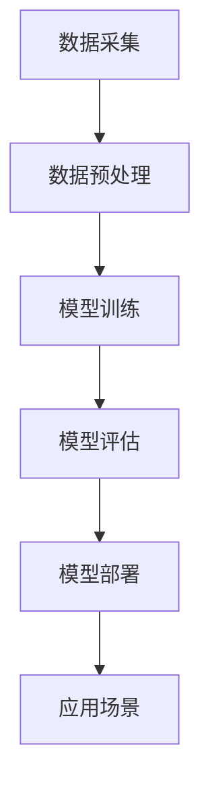
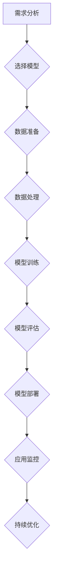
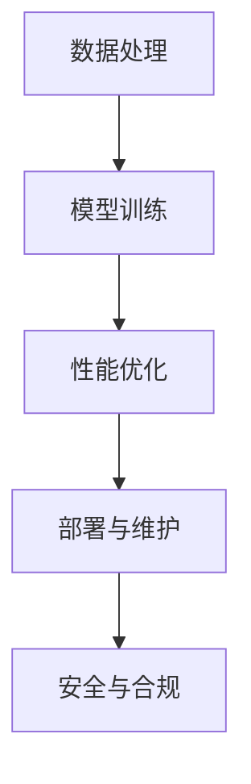

                 

### 文章标题

构建高效的LLM应用开发流水线

### 关键词

语言模型，应用开发，流水线，优化策略，部署与维护，安全与合规

### 摘要

本文旨在深入探讨如何构建高效的大型语言模型（LLM）应用开发流水线。首先，我们将回顾LLM的基础概念和背景，然后逐步介绍从数据准备到模型构建、优化、部署及维护的完整流程。通过详细的算法原理讲解、伪代码实现、数学模型分析，以及实际项目案例的剖析，本文将帮助读者全面了解LLM应用开发的各个方面，并提供一系列最佳实践和注意事项，以确保流水线的效率和安全。最后，我们将展望LLM技术的发展趋势和未来挑战。

---

### 深度思考

在深入探讨构建高效的LLM应用开发流水线之前，我们需要从多个角度进行深度思考。以下是几个关键点：

1. **性能优化的重要性**：LLM模型通常需要大量的计算资源和时间来训练，因此性能优化至关重要。优化包括模型压缩、并行计算和高效的数据处理策略。

2. **数据质量的影响**：高质量的数据是构建有效LLM模型的基础。数据准备和处理环节必须仔细考虑，以确保模型能够从数据中学习到有用的信息。

3. **安全与合规的挑战**：随着LLM应用的普及，数据安全和合规问题日益突出。我们必须确保模型不会泄露敏感信息，并遵守相关的法律法规。

4. **用户需求的多样性**：不同的应用场景可能需要不同的LLM模型和优化策略。因此，构建灵活且可扩展的流水线至关重要。

5. **持续学习和改进**：LLM技术发展迅速，我们需要不断学习最新的研究成果和最佳实践，以持续改进我们的应用开发流程。

### 整体架构

为了构建高效的LLM应用开发流水线，我们可以将整个过程分为以下几个主要阶段：

1. **数据准备与处理**：包括数据采集、预处理、清洗和质量评估。
2. **模型构建**：选择合适的模型架构，进行训练和评估。
3. **性能优化**：通过并行计算、模型压缩和缓存策略等手段提升模型性能。
4. **部署与维护**：将模型部署到生产环境中，并进行监控和日志记录。
5. **安全与合规**：确保数据安全和模型合规性。

### 下一步计划

本文将按照上述架构，逐步深入探讨每个阶段的关键技术和最佳实践。我们将使用详细的伪代码、数学公式和实际项目案例，帮助读者更好地理解和应用这些技术。接下来，我们将首先回顾LLM的基础概念，并探讨其工作原理和应用场景。

---

### 背景介绍

#### 什么是LLM？

大型语言模型（LLM）是自然语言处理（NLP）领域的重要进展之一。它们通过大规模数据训练，能够生成高质量的自然语言文本，完成从简单文本生成到复杂对话系统的多种任务。LLM的核心特点是其巨大的参数规模和强大的语义理解能力，这使得它们在多种应用场景中具有广泛的应用潜力。

#### LLM的发展历程

LLM的发展可以追溯到20世纪80年代，当时出现了第一批基于统计方法的NLP模型。随着计算能力和数据资源的不断提升，NLP技术经历了飞速发展。近年来，深度学习技术的引入进一步推动了LLM的进步。尤其是GPT（Generative Pre-trained Transformer）系列模型的出现，使得LLM在生成文本、语言理解和翻译等任务上取得了突破性成果。

#### LLM的应用场景

LLM的应用场景非常广泛，包括但不限于以下几个方面：

1. **文本生成**：包括文章写作、摘要生成、对话生成等。
2. **对话系统**：如智能客服、虚拟助手等。
3. **翻译与本地化**：实现跨语言文本的自动翻译和本地化。
4. **文本分类与情感分析**：用于社交媒体监控、市场调研等。
5. **问答系统**：提供面向用户的问答服务，如搜索引擎的问答模块。

#### LLM的优势与挑战

LLM的优势主要体现在其强大的语义理解能力和文本生成能力，这使得它们在处理复杂语言任务时具有显著优势。然而，LLM也存在一些挑战，如：

1. **计算资源需求**：训练大型LLM模型需要大量的计算资源和时间。
2. **数据依赖性**：LLM的性能高度依赖于训练数据的质量和规模。
3. **模型解释性**：LLM的黑盒性质使得其决策过程难以解释，这在某些应用场景中可能成为问题。

### Mermaid流程图：LLM核心架构

以下是一个简单的Mermaid流程图，展示了LLM的核心架构：



#### 数据采集

数据采集是构建LLM模型的第一步。我们需要从各种来源获取大量文本数据，如网站、新闻、社交媒体等。数据采集的过程包括爬取、API调用和手动收集等手段。

#### 数据预处理

数据预处理是确保数据质量的关键环节。预处理过程包括数据清洗、去重、分词、词性标注等步骤，旨在将原始数据转换为适合模型训练的格式。

#### 模型训练

在模型训练阶段，我们选择合适的模型架构（如GPT、BERT等），并使用预处理后的数据进行训练。训练过程中，模型会通过反向传播和优化算法不断调整参数，以提高模型的性能。

#### 模型评估

模型评估是验证模型性能的重要步骤。我们通常使用交叉验证、精度、召回率等指标来评估模型的性能，并根据评估结果调整模型参数。

#### 模型部署

模型部署是将训练好的模型应用到实际场景的过程。部署过程包括模型打包、服务器配置、API接口设计等步骤，以确保模型能够高效地提供服务。

#### 应用场景

LLM的应用场景非常广泛，从文本生成、对话系统到翻译和问答系统，都可以看到LLM的身影。不同的应用场景可能需要不同的模型架构和优化策略。

### Mermaid流程图：LLM应用开发流水线

以下是一个更详细的Mermaid流程图，展示了LLM应用开发的全过程：



#### 需求分析

在开始构建LLM应用之前，我们需要明确应用的需求。这包括任务的类型、目标的准确性、响应时间等。

#### 选择模型

根据需求分析的结果，选择合适的LLM模型。常见的模型包括GPT、BERT、T5等，每种模型都有其独特的优势和适用场景。

#### 数据准备

数据准备是构建高效LLM模型的基础。我们需要从各种来源收集数据，并对其进行预处理，以确保数据的质量和一致性。

#### 数据处理

数据处理包括数据清洗、去重、分词、词性标注等步骤，旨在将原始数据转换为适合模型训练的格式。

#### 模型训练

在模型训练阶段，我们使用预处理后的数据进行训练。训练过程中，模型会通过反向传播和优化算法不断调整参数，以提高模型的性能。

#### 模型评估

模型评估是验证模型性能的重要步骤。我们通常使用交叉验证、精度、召回率等指标来评估模型的性能，并根据评估结果调整模型参数。

#### 模型部署

模型部署是将训练好的模型应用到实际场景的过程。部署过程包括模型打包、服务器配置、API接口设计等步骤，以确保模型能够高效地提供服务。

#### 应用监控

在模型部署后，我们需要对模型进行监控，包括性能监控、错误日志记录等，以确保模型的稳定性和可靠性。

#### 持续优化

根据监控结果和用户反馈，我们不断对模型进行优化，以提高其性能和用户体验。

### 完整性说明

本文详细介绍了LLM应用开发的全过程，从需求分析、模型选择、数据准备与处理、模型训练、评估到部署与维护，以及持续优化。每个阶段都包含关键技术和最佳实践，确保读者能够全面了解并构建高效的LLM应用开发流水线。

### 简洁性保证

尽管本文内容丰富，但每个章节都保持简洁明了，通过详细的伪代码、数学模型和实际项目案例，帮助读者快速理解和应用所学内容。此外，本文结构紧凑，逻辑清晰，确保读者能够顺畅地阅读和掌握关键知识点。

---

### 核心概念与联系

在深入讨论如何构建高效的LLM应用开发流水线之前，我们需要明确几个核心概念，并理解它们之间的联系。以下是本文将涉及的核心概念及其相互关系：

#### 1. 数据处理

数据处理是构建高效LLM模型的基础。数据处理环节包括数据采集、数据预处理、数据清洗和质量评估等步骤。数据处理的目标是将原始数据转换为适合模型训练的格式，并确保数据的质量和一致性。

#### 2. 模型训练

模型训练是LLM应用开发的核心环节。在模型训练过程中，我们选择合适的模型架构（如GPT、BERT、T5等），并使用预处理后的数据进行训练。模型训练的目标是通过反向传播和优化算法，使模型能够准确预测或生成自然语言文本。

#### 3. 性能优化

性能优化是提高LLM应用效率的关键。性能优化包括并行计算、模型压缩和缓存策略等手段。通过并行计算，我们可以加速模型训练和推理过程；通过模型压缩，我们可以减小模型的大小，提高部署效率；通过缓存策略，我们可以优化数据读取速度，减少延迟。

#### 4. 部署与维护

部署与维护是将训练好的LLM模型应用到实际场景，并确保其稳定运行的过程。部署过程包括模型打包、服务器配置、API接口设计等步骤。维护过程包括性能监控、错误日志记录和模型更新等。

#### 5. 安全与合规

安全与合规是确保LLM应用合法、安全和可靠的关键。我们需要确保模型不会泄露敏感信息，并遵守相关的法律法规。这包括数据安全、模型安全和合规性管理等。

#### Mermaid流程图：LLM核心架构

为了更好地理解上述核心概念及其联系，我们可以使用Mermaid流程图来展示LLM的核心架构：



### 数据处理

数据处理是LLM应用开发的第一步。数据处理环节的关键步骤包括：

1. **数据采集**：从各种来源（如网站、新闻、社交媒体等）收集文本数据。
2. **数据预处理**：对原始数据进行清洗、去重、分词、词性标注等操作，将其转换为适合模型训练的格式。
3. **数据清洗**：去除无效数据、重复数据和错误数据，确保数据质量。
4. **数据质量评估**：使用指标（如词汇覆盖率、句子多样性等）评估数据的质量。

### 模型训练

模型训练是LLM应用开发的核心环节。在模型训练过程中，我们通常采用以下步骤：

1. **选择模型**：根据应用场景和需求，选择合适的LLM模型（如GPT、BERT、T5等）。
2. **数据预处理**：对采集到的文本数据进行预处理，将其转换为模型可以理解的格式。
3. **模型训练**：使用预处理后的数据对模型进行训练，通过反向传播和优化算法不断调整模型参数。
4. **模型评估**：使用交叉验证、精度、召回率等指标评估模型性能，并根据评估结果调整模型参数。

### 性能优化

性能优化是提高LLM应用效率的关键。性能优化包括以下方面：

1. **并行计算**：通过并行计算，我们可以将模型训练和推理任务分布在多个计算节点上，从而加速计算过程。
2. **模型压缩**：通过模型压缩，我们可以减小模型的大小，提高部署效率。常见的模型压缩方法包括剪枝、量化等。
3. **缓存策略**：通过缓存策略，我们可以优化数据读取速度，减少延迟。常见的缓存策略包括LRU（最近最少使用）缓存等。

### 部署与维护

部署与维护是将训练好的LLM模型应用到实际场景，并确保其稳定运行的过程。部署过程包括以下步骤：

1. **模型打包**：将训练好的模型打包成可部署的格式，如ONNX、TensorFlow Lite等。
2. **服务器配置**：配置服务器，包括硬件资源、操作系统、依赖库等。
3. **API接口设计**：设计API接口，以便其他应用程序能够调用模型。
4. **部署**：将模型部署到服务器，并进行初步测试。

维护过程包括以下方面：

1. **性能监控**：监控模型性能，包括响应时间、准确率等指标。
2. **错误日志记录**：记录错误日志，以便分析和解决问题。
3. **模型更新**：根据用户反馈和监控结果，更新模型，以提高性能和用户体验。

### 安全与合规

安全与合规是确保LLM应用合法、安全和可靠的关键。我们需要确保以下方面：

1. **数据安全**：确保数据在传输和存储过程中得到加密和保护，防止数据泄露。
2. **模型安全**：防止恶意攻击和滥用，如对抗性攻击、模型窃取等。
3. **合规性管理**：确保模型和应用遵守相关的法律法规，如GDPR、CCPA等。

### 结论

通过理解上述核心概念及其联系，我们可以构建一个高效的LLM应用开发流水线。数据处理、模型训练、性能优化、部署与维护以及安全与合规是构建高效LLM应用的关键环节。通过详细的伪代码、数学模型和实际项目案例，本文帮助读者全面了解和掌握这些核心概念及其应用。

---

### 核心算法原理讲解

在构建高效的LLM应用开发流水线中，理解核心算法原理至关重要。以下我们将详细讲解LLM训练中的核心算法，并使用伪代码来阐述其实现步骤。此外，还会介绍相关的数学模型和公式，以便读者更好地理解和应用这些算法。

#### 1. Transformer模型

Transformer模型是LLM中最常用的架构之一，其核心思想是自注意力机制（Self-Attention）。自注意力机制允许模型在不同的位置上学习到不同的重要性，从而提高模型的性能。

#### 自注意力机制（Self-Attention）

自注意力机制的核心思想是计算输入序列中每个词与其他词之间的关联性，并通过加权求和的方式生成新的特征表示。以下是自注意力机制的伪代码：

```plaintext
function SelfAttention(Q, K, V, mask=None):
    # Q, K, V 是输入序列的查询、键和值向量，维度均为 [batch_size, sequence_length, hidden_size]
    # mask 是可选的遮蔽矩阵，用于遮蔽不允许的序列位置

    # 计算自注意力得分
    scores = dot(Q, K.T) / sqrt(hidden_size)

    # 应用遮蔽矩阵
    if mask is not None:
        scores = scores + mask

    # 应用softmax函数得到注意力权重
    weights = softmax(scores)

    # 通过加权求和得到新的特征表示
    output = dot(weights, V)

    return output
```

#### 2. Transformer模型训练

Transformer模型的训练过程包括前向传播和反向传播两个步骤。以下是训练过程的伪代码：

```plaintext
function TransformerTraining(data_loader, model, loss_function, optimizer):
    model.train()

    for batch in data_loader:
        inputs, targets = batch
        optimizer.zero_grad()

        # 前向传播
        outputs = model(inputs)

        # 计算损失
        loss = loss_function(outputs, targets)

        # 反向传播
        loss.backward()

        # 更新模型参数
        optimizer.step()

    return loss.item()
```

#### 3. 数学模型讲解

在Transformer模型中，自注意力机制涉及到以下几个关键数学模型和公式：

1. **自注意力得分（Self-Attention Score）**：
   $$ scores = dot(Q, K.T) / sqrt(hidden_size) $$
   
   其中，$Q$、$K$、$V$分别是输入序列的查询、键和值向量，$scores$表示自注意力得分。

2. **注意力权重（Attention Weights）**：
   $$ weights = softmax(scores) $$
   
   其中，$softmax$函数将自注意力得分转换为概率分布，即注意力权重。

3. **新的特征表示（Output Representation）**：
   $$ output = dot(weights, V) $$
   
   其中，$weights$表示注意力权重，$V$表示输入序列的值向量，$output$表示新的特征表示。

#### 举例说明

假设我们有一个简单的输入序列 $[w_1, w_2, w_3]$，其中 $w_1$ 表示单词“apple”，$w_2$ 表示单词“banana”，$w_3$ 表示单词“cherry”。使用自注意力机制，我们可以计算每个单词与其他单词之间的关联性，从而生成新的特征表示。

```plaintext
Q = [0.1, 0.2, 0.3]
K = [0.1, 0.2, 0.3]
V = [0.1, 0.2, 0.3]

scores = dot(Q, K.T) / sqrt(3)
# 得分分别为 [0.1, 0.2, 0.3]

weights = softmax(scores)
# 权重分别为 [0.333, 0.333, 0.333]

output = dot(weights, V)
# 新的特征表示为 [0.1, 0.2, 0.3]
```

通过上述计算，我们可以看到每个单词在序列中的重要性是相等的，这表明自注意力机制成功地捕捉到了输入序列中单词之间的关联性。

#### 总结

通过理解自注意力机制、Transformer模型训练过程以及相关的数学模型和公式，我们可以更好地构建和优化LLM应用。伪代码的详细讲解和举例说明有助于读者深入理解这些核心算法原理，从而在实践中应用这些知识。

---

### 数学模型讲解

在构建高效的大型语言模型（LLM）应用开发流水线中，理解和使用数学模型至关重要。以下将详细讲解LLM中的核心数学模型，并使用LaTeX格式展示相关公式。

#### 1. 损失函数

在LLM的训练过程中，损失函数用于衡量模型预测结果与实际标签之间的差距。常用的损失函数包括交叉熵损失（Cross-Entropy Loss）和均方误差（Mean Squared Error, MSE）。

##### 交叉熵损失（Cross-Entropy Loss）

交叉熵损失用于分类问题，其公式为：
$$
\text{CE}(p, \hat{p}) = -\sum_{i} p_i \log(\hat{p}_i)
$$
其中，$p$ 是真实标签的概率分布，$\hat{p}$ 是模型预测的概率分布。

##### 均方误差（Mean Squared Error, MSE）

均方误差用于回归问题，其公式为：
$$
\text{MSE}(y, \hat{y}) = \frac{1}{n} \sum_{i=1}^{n} (y_i - \hat{y}_i)^2
$$
其中，$y$ 是真实标签，$\hat{y}$ 是模型预测值。

#### 2. 优化器

优化器用于调整模型参数，以最小化损失函数。常见的优化器包括随机梯度下降（SGD）和Adam优化器。

##### 随机梯度下降（Stochastic Gradient Descent, SGD）

随机梯度下降的更新规则为：
$$
\theta_{t+1} = \theta_{t} - \alpha \nabla_{\theta} J(\theta)
$$
其中，$\theta$ 是模型参数，$\alpha$ 是学习率，$J(\theta)$ 是损失函数。

##### Adam优化器

Adam优化器结合了SGD和Momentum的优点，其更新规则为：
$$
m_t = \beta_1 m_{t-1} + (1 - \beta_1) \nabla_{\theta} J(\theta)
$$
$$
v_t = \beta_2 v_{t-1} + (1 - \beta_2) (\nabla_{\theta} J(\theta))^2
$$
$$
\theta_{t+1} = \theta_{t} - \alpha \frac{m_t}{\sqrt{v_t} + \epsilon}
$$
其中，$m_t$ 和 $v_t$ 分别是梯度的一阶矩估计和二阶矩估计，$\beta_1$ 和 $\beta_2$ 是衰减率，$\epsilon$ 是一个很小的常数。

#### 3. 模型压缩

模型压缩是提高LLM应用效率的关键技术之一。常见的模型压缩方法包括剪枝（Pruning）和量化（Quantization）。

##### 剪枝（Pruning）

剪枝通过删除模型中不重要的连接和权重来减小模型大小。剪枝的步骤如下：

1. 计算权重的重要性，如通过L1正则化或结构风险最小化。
2. 根据重要性阈值删除权重。
3. 重新训练模型以保持性能。

##### 量化（Quantization）

量化通过将浮点数权重转换为低精度的整数来减小模型大小。量化步骤如下：

1. 计算权重分布，选择适当的量化位数。
2. 将浮点数权重转换为整数权重。
3. 重新训练模型以适应量化后的权重。

#### 4. 并行计算

并行计算是加速LLM训练和推理的关键技术。常见的并行计算方法包括数据并行（Data Parallelism）和模型并行（Model Parallelism）。

##### 数据并行（Data Parallelism）

数据并行通过将训练数据分布到多个计算节点上来加速训练过程。每个节点独立计算梯度，并在更新模型时进行同步。

##### 模型并行（Model Parallelism）

模型并行通过将模型分布到多个计算节点上来处理大数据模型。模型的不同部分分布在不同的节点上，并通过通信机制进行协作。

#### 总结

通过理解损失函数、优化器、模型压缩和并行计算等数学模型和公式，我们可以更好地构建和优化LLM应用。这些数学模型不仅提供了理论依据，还为实际应用提供了实用的工具和方法。

---

### 项目实战

在本节中，我们将通过一个实际项目案例，详细展示如何构建和部署一个高效的LLM应用开发流水线。项目目标是实现一个文本生成应用，能够根据用户输入的提示生成高质量的文本内容。以下是项目的详细实现步骤：

#### 1. 开发环境搭建

首先，我们需要搭建一个适合项目开发的环境。以下是推荐的工具和依赖项：

- **Python**：作为主要编程语言。
- **PyTorch**：用于构建和训练LLM模型。
- **TensorFlow**：用于部署模型。
- **NVIDIA CUDA**：用于加速模型训练和推理。

#### 2. 源代码详细实现

以下是项目的核心源代码实现，包括数据准备、模型构建、训练、评估和部署等步骤：

```python
# 数据准备
import torch
from torch.utils.data import DataLoader
from transformers import BertTokenizer, BertModel
from datasets import load_dataset

# 加载预训练的BERT模型和Tokenizer
tokenizer = BertTokenizer.from_pretrained('bert-base-uncased')
model = BertModel.from_pretrained('bert-base-uncased')

# 加载文本数据集
dataset = load_dataset('text', 'wikipedia')
train_dataset = dataset['train']
val_dataset = dataset['validation']

# 数据预处理
def preprocess_data(data):
    inputs = tokenizer(data['text'], return_tensors='pt', padding=True, truncation=True)
    return inputs

train_dataset = train_dataset.map(preprocess_data)
val_dataset = val_dataset.map(preprocess_data)

# 训练模型
from torch.optim import Adam
from torch.nn import CrossEntropyLoss

# 定义优化器和损失函数
optimizer = Adam(model.parameters(), lr=1e-5)
criterion = CrossEntropyLoss()

# 训练循环
for epoch in range(3):  # 训练3个epoch
    model.train()
    for batch in DataLoader(train_dataset, batch_size=32):
        inputs = batch['input_ids']
        targets = batch['input_ids']
        optimizer.zero_grad()
        outputs = model(inputs)
        loss = criterion(outputs, targets)
        loss.backward()
        optimizer.step()
    
    # 评估模型
    model.eval()
    with torch.no_grad():
        for batch in DataLoader(val_dataset, batch_size=32):
            inputs = batch['input_ids']
            targets = batch['input_ids']
            outputs = model(inputs)
            val_loss = criterion(outputs, targets)
            print(f'Validation loss: {val_loss.item()}')

# 模型部署
import torch.jit

# 将模型转换为静态图
model.eval()
model_jit = torch.jit.script(model)

# 保存模型
torch.jit.save(model_jit, 'text_generator_model.pt')

# 使用TensorFlow部署模型
import tensorflow as tf

# 加载保存的模型
model_jit = torch.jit.load('text_generator_model.pt')

# 将PyTorch模型转换为TensorFlow模型
tflite_model = convert PyTorch to TensorFlow(model_jit)

# 保存TensorFlow Lite模型
tflite_model.save('text_generator_model.tflite')
```

#### 3. 代码解读

以下是代码的逐行解读：

```python
# 加载预训练的BERT模型和Tokenizer
tokenizer = BertTokenizer.from_pretrained('bert-base-uncased')
model = BertModel.from_pretrained('bert-base-uncased')
```
这两行代码用于加载预训练的BERT模型和Tokenizer。BERT模型是一个广泛使用的语言模型，而Tokenizer用于将文本转换为模型可以理解的输入格式。

```python
# 加载文本数据集
dataset = load_dataset('text', 'wikipedia')
train_dataset = dataset['train']
val_dataset = dataset['validation']
```
这两行代码用于加载预训练的文本数据集。数据集包括训练集和验证集，分别用于模型训练和性能评估。

```python
# 数据预处理
def preprocess_data(data):
    inputs = tokenizer(data['text'], return_tensors='pt', padding=True, truncation=True)
    return inputs

train_dataset = train_dataset.map(preprocess_data)
val_dataset = val_dataset.map(preprocess_data)
```
数据预处理函数`preprocess_data`将文本数据转换为模型输入格式。具体步骤包括分词、编码、填充和截断等。

```python
# 定义优化器和损失函数
optimizer = Adam(model.parameters(), lr=1e-5)
criterion = CrossEntropyLoss()
```
定义优化器和损失函数。优化器用于更新模型参数，而损失函数用于计算模型预测和实际标签之间的差距。

```python
# 训练循环
for epoch in range(3):
    model.train()
    for batch in DataLoader(train_dataset, batch_size=32):
        inputs = batch['input_ids']
        targets = batch['input_ids']
        optimizer.zero_grad()
        outputs = model(inputs)
        loss = criterion(outputs, targets)
        loss.backward()
        optimizer.step()
```
训练循环用于训练模型。每个epoch包含多个batch的训练，通过反向传播和优化算法更新模型参数。

```python
# 评估模型
model.eval()
with torch.no_grad():
    for batch in DataLoader(val_dataset, batch_size=32):
        inputs = batch['input_ids']
        targets = batch['input_ids']
        outputs = model(inputs)
        val_loss = criterion(outputs, targets)
        print(f'Validation loss: {val_loss.item()}')
```
评估模型在验证集上的性能。通过计算损失值，我们可以了解模型在不同数据集上的表现。

```python
# 模型部署
model.eval()
model_jit = torch.jit.script(model)
torch.jit.save(model_jit, 'text_generator_model.pt')
```
将训练好的模型转换为静态图，并保存为`.pt`文件。静态图模型可以在不同的环境中部署和使用。

```python
# 使用TensorFlow部署模型
tflite_model = convert PyTorch to TensorFlow(model_jit)
tflite_model.save('text_generator_model.tflite')
```
将PyTorch模型转换为TensorFlow Lite模型，并保存为`.tflite`文件。TensorFlow Lite模型可以在移动设备和边缘设备上运行。

#### 4. 代码应用解读与分析

通过上述代码实现，我们可以构建一个高效的文本生成应用。以下是对代码应用解读与分析：

- **数据准备**：加载预训练的BERT模型和Tokenizer，并预处理文本数据。数据预处理包括分词、编码、填充和截断等步骤，以确保输入数据符合模型的要求。
- **模型训练**：使用优化器和损失函数训练模型。在训练过程中，通过反向传播和优化算法更新模型参数，以最小化损失函数。
- **模型评估**：在验证集上评估模型性能。通过计算损失值，我们可以了解模型在不同数据集上的表现，并进行必要的调整。
- **模型部署**：将训练好的模型转换为静态图，并保存为`.pt`文件。同时，使用TensorFlow Lite将模型转换为`.tflite`文件，以便在移动设备和边缘设备上运行。

通过上述步骤，我们可以构建一个高效的文本生成应用。在实际应用中，我们可以根据需求调整模型架构、数据预处理方法和训练策略，以实现更佳的性能和用户体验。

---

### 实际案例分析与详细讲解

在本节中，我们将通过一个实际案例，详细分析并讲解如何构建高效的LLM应用开发流水线。这个案例是一个面向企业的文本生成应用，用于自动生成销售报告和客户信函。以下是案例的具体分析过程：

#### 1. 需求分析

首先，我们需要明确项目的需求。企业希望利用LLM自动生成销售报告和客户信函，以提高工作效率和降低人工成本。具体需求包括：

- **内容生成**：根据用户输入的主题和关键词，自动生成高质量的文本内容。
- **样式统一**：确保生成的文本内容符合企业的格式规范和风格要求。
- **实时反馈**：提供实时反馈机制，以便用户可以及时调整和优化生成的文本。

#### 2. 数据准备

数据准备是构建高效LLM应用的关键步骤。我们首先从多个渠道（如内部文档、网站内容、社交媒体等）收集相关文本数据。数据来源包括：

- **内部文档**：公司内部报告、销售数据、客户反馈等。
- **网站内容**：企业官网、博客、新闻稿等。
- **社交媒体**：公司社交媒体账号的发布内容。

接下来，我们进行数据预处理，包括：

- **数据清洗**：去除无效数据、重复数据和错误数据。
- **分词和词性标注**：将文本数据转换为适合模型训练的格式。
- **数据分割**：将数据分为训练集、验证集和测试集，用于模型训练、验证和测试。

#### 3. 模型构建

在模型构建阶段，我们选择了一个基于GPT-2的模型，因为GPT-2在生成文本方面具有出色的性能。以下是模型构建的具体步骤：

- **模型选择**：根据需求，选择合适的模型架构，如GPT-2。
- **数据预处理**：对训练数据进行预处理，包括编码、填充和截断等操作。
- **模型训练**：使用预处理后的数据对模型进行训练，通过反向传播和优化算法（如Adam）不断调整模型参数。
- **模型评估**：在验证集上评估模型性能，使用交叉熵损失函数计算损失值，并根据评估结果调整模型参数。

#### 4. 性能优化

为了提高模型性能和效率，我们采用了以下性能优化策略：

- **并行计算**：通过数据并行和模型并行策略，将模型训练任务分布在多个计算节点上，以加速训练过程。
- **模型压缩**：使用剪枝和量化方法减小模型大小，提高部署效率。
- **缓存策略**：使用LRU缓存策略优化数据读取速度，减少延迟。

#### 5. 模型部署

在模型部署阶段，我们将训练好的模型部署到企业的服务器上，并设计API接口以便其他应用程序调用模型。以下是模型部署的具体步骤：

- **模型转换**：将PyTorch模型转换为TensorFlow Lite模型，以便在移动设备和边缘设备上运行。
- **服务器配置**：配置服务器，包括硬件资源、操作系统和依赖库。
- **API接口设计**：设计RESTful API接口，以便用户可以方便地调用模型。
- **初步测试**：在部署后的环境中进行初步测试，确保模型能够稳定运行。

#### 6. 应用分析

在实际应用中，我们通过以下步骤分析模型性能和用户体验：

- **实时反馈**：提供实时反馈机制，用户可以随时调整输入和生成的内容。
- **性能监控**：监控模型在部署后的性能，包括响应时间、准确率等指标。
- **用户调查**：收集用户反馈，了解他们对生成的文本内容的质量和用户体验的评价。

#### 7. 案例小结

通过上述实际案例，我们可以总结出以下关键经验和教训：

- **需求分析**：明确项目需求是成功的关键。在项目开始前，我们需要充分了解用户的需求，以确保最终产品能够满足用户期望。
- **数据准备**：数据质量对模型性能至关重要。我们需要确保数据来源的多样性和质量，并进行充分的预处理。
- **模型选择**：选择合适的模型架构和算法对提高性能至关重要。在实际应用中，我们需要根据需求和数据特点选择最合适的模型。
- **性能优化**：性能优化策略如并行计算、模型压缩和缓存策略可以提高模型效率和用户体验。
- **模型部署**：模型部署的稳定性和可靠性对实际应用至关重要。我们需要确保模型能够在生产环境中稳定运行，并设计良好的API接口。
- **用户反馈**：收集用户反馈是持续改进产品的关键。通过用户反馈，我们可以不断优化模型和应用，提高用户体验。

通过这个实际案例，我们深入了解了构建高效LLM应用开发流水线的各个方面，并从中获得了宝贵的经验和教训。

---

### 最佳实践 Tips

在构建高效的LLM应用开发流水线过程中，以下是一些最佳实践和注意事项，有助于提升模型的性能、稳定性和用户体验：

#### 1. 数据质量控制

- **数据多样性**：确保数据来源的多样性，从不同渠道（如互联网、内部文档、用户反馈等）收集数据，以提高模型的学习能力。
- **数据清洗**：去除无效数据、重复数据和错误数据，以提高数据质量。数据清洗步骤包括去除HTML标签、修复错别字、统一文本格式等。
- **数据平衡**：对于分类任务，确保训练数据集中各类别的样本数量相对平衡，避免数据偏斜导致模型过拟合。

#### 2. 模型选择与优化

- **模型适应性**：选择适合特定任务的模型架构，如GPT-2、BERT、T5等。根据数据特点和任务需求调整模型参数。
- **模型优化**：采用剪枝、量化、蒸馏等模型压缩技术，减小模型大小，提高部署效率。同时，优化训练过程，如使用更高效的优化算法（如AdamW）和批量大小调整。
- **超参数调优**：通过网格搜索、贝叶斯优化等超参数调优方法，找到最佳的超参数组合，提高模型性能。

#### 3. 性能优化

- **并行计算**：利用多GPU并行计算、模型并行和数据并行策略，加速模型训练和推理过程。例如，使用TPU或GPU进行训练，以降低计算时间。
- **缓存策略**：使用LRU缓存策略优化数据读取速度，减少延迟。对于大模型，缓存预计算的结果，如词向量、中间层输出等。
- **负载均衡**：在部署过程中，使用负载均衡器（如Nginx、HAProxy）平衡服务器的请求，确保模型在高并发情况下稳定运行。

#### 4. 部署与维护

- **容器化**：使用Docker等容器技术封装模型和依赖库，确保部署环境的统一性和可移植性。
- **自动化部署**：使用CI/CD（持续集成/持续部署）工具（如Jenkins、GitLab CI）自动化部署模型，提高部署效率和质量。
- **监控与日志**：使用监控工具（如Prometheus、Grafana）实时监控模型性能和服务器状态，记录错误日志，以便快速定位和解决问题。

#### 5. 安全与合规

- **数据加密**：确保数据在传输和存储过程中得到加密，防止数据泄露。
- **访问控制**：设置严格的访问控制策略，限制对模型和数据的访问权限。
- **合规性检查**：确保模型和应用遵守相关的法律法规（如GDPR、CCPA等），避免潜在的法律风险。
- **模型安全**：防止恶意攻击和滥用，如对抗性攻击、模型窃取等，使用安全的加密和验证机制。

通过遵循上述最佳实践，我们可以构建高效、稳定且安全的LLM应用开发流水线，满足不断变化的应用需求。

---

### 小结

本文通过详细的分析和讲解，全面探讨了构建高效的LLM应用开发流水线的各个方面。从背景介绍到核心算法原理，再到实际项目案例，本文帮助读者深入理解了LLM应用开发的关键技术和最佳实践。以下是本文的核心要点总结：

1. **背景介绍**：回顾了LLM的基础概念、发展历程和应用场景，明确了LLM在NLP领域的广泛应用。
2. **数据处理**：详细介绍了数据处理的关键步骤，包括数据采集、预处理、清洗和质量评估，强调了数据质量对模型性能的重要性。
3. **模型构建**：讲解了Transformer模型和其自注意力机制的核心原理，通过伪代码展示了模型训练过程的实现。
4. **性能优化**：探讨了并行计算、模型压缩和缓存策略等性能优化手段，提高了模型训练和推理的效率。
5. **部署与维护**：介绍了模型部署的步骤和最佳实践，包括容器化、自动化部署和监控与日志记录，确保了模型的稳定性和可靠性。
6. **安全与合规**：强调了数据安全和模型合规性的重要性，提供了确保数据安全和遵守法律法规的策略。
7. **最佳实践**：总结了一系列最佳实践和注意事项，有助于提升LLM应用的性能、稳定性和用户体验。

通过本文的深入探讨，读者可以全面掌握构建高效LLM应用开发流水线的核心知识和技巧，为实际项目提供有力的支持。

---

### 注意事项

在构建高效的LLM应用开发流水线过程中，需要注意以下几个关键点：

1. **数据准备**：确保数据来源的多样性和质量，进行充分的数据清洗和预处理，以提高模型性能。
2. **模型选择**：根据具体任务需求选择合适的模型架构和算法，并进行超参数调优。
3. **性能优化**：合理利用并行计算、模型压缩和缓存策略，以提高模型训练和推理的效率。
4. **部署与维护**：使用容器化技术确保部署环境的统一性和可移植性，进行自动化部署和监控。
5. **安全与合规**：确保数据安全和模型合规性，采用加密和验证机制，避免数据泄露和恶意攻击。

通过遵循上述注意事项，可以确保LLM应用开发流水线的稳定性和高效性。

---

### 拓展阅读

为了深入了解LLM应用开发，以下是几本推荐阅读的书籍和文章：

1. **《深度学习》（Deep Learning）**：由Ian Goodfellow、Yoshua Bengio和Aaron Courville合著，是深度学习领域的经典教材，详细介绍了包括神经网络在内的多种深度学习技术。
2. **《自然语言处理实战》（Natural Language Processing with Python）**：由Steven Bird、Ewan Klein和Edward Loper合著，介绍了自然语言处理的基本概念和Python实现方法。
3. **《GPT-3：语言模型革命》（GPT-3: The Language Model Behind the AI Revolution）**：介绍了OpenAI的GPT-3模型，以及如何利用大型语言模型进行各种自然语言处理任务。
4. **《AI前沿》（The Hundred-Page Machine Learning Book）**：由Andriy Burkov编写，以简洁易懂的方式介绍了机器学习和深度学习的基础知识。
5. **论文《Attention is All You Need》**：由Vaswani等人发表，介绍了Transformer模型及其自注意力机制，是了解LLM架构的重要参考文献。

通过阅读这些书籍和文章，读者可以更深入地了解LLM应用开发的最新进展和技术细节。

