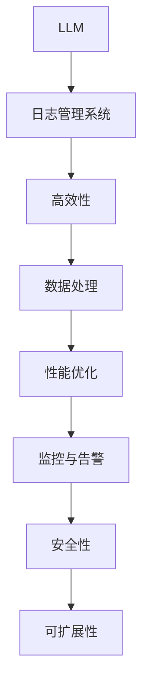

                 

### 文章标题：构建高效的LLM应用日志管理系统

在当今快速发展的技术世界中，大型语言模型（LLM）因其强大的语言理解和生成能力，正逐渐成为各行各业的重要工具。从智能客服到自然语言处理（NLP），LLM的应用场景广泛且不断扩展。然而，随着应用规模的扩大和复杂度的增加，如何构建一个高效的LLM应用日志管理系统成为了一个关键问题。本文将围绕这一主题，详细探讨构建高效LLM应用日志管理系统的方法、核心算法和项目实战。

### 文章关键词

- **大型语言模型（LLM）**
- **日志管理系统**
- **高效性**
- **应用场景**
- **数据处理算法**
- **性能优化**
- **监控与告警**
- **安全性**
- **可扩展性**

### 文章摘要

本文首先介绍了LLM及其应用日志管理系统的背景，随后通过一个Mermaid流程图，展示了核心概念之间的关系。接着，本文详细讲解了日志处理算法和数学模型，并使用伪代码和LaTeX格式进行了说明。然后，本文通过一个实际项目案例，展示了如何搭建高效的LLM应用日志管理系统，并对源代码进行了详细解读。最后，本文总结了最佳实践，并提出了一些注意事项和拓展阅读建议。

### 背景介绍

#### LLM简介

大型语言模型（LLM）是基于深度学习的自然语言处理技术，能够处理和理解复杂的语言结构，生成高质量的自然语言文本。LLM通过大量语料库的学习，能够自动生成文章、翻译文本、回答问题等，其在各种场景下的应用日益广泛。

#### 日志管理系统的作用

日志管理系统是一种用于记录、存储、分析和监控应用程序运行过程中产生的日志数据的系统。对于LLM应用来说，日志管理系统至关重要，因为它能够帮助：

1. **诊断问题**：通过分析日志，可以快速定位和诊断应用中的错误和异常。
2. **性能优化**：日志数据提供了应用性能的宝贵信息，有助于识别和解决性能瓶颈。
3. **安全监控**：日志记录了用户行为和系统事件，有助于发现潜在的安全威胁。
4. **合规性检查**：在许多行业，合规性要求记录和存储日志数据，以供审计和合规检查。

#### 高效性的重要性

高效性是构建LLM应用日志管理系统的核心目标。一个高效的日志管理系统不仅能够快速地处理和存储大量日志数据，还能提供实时监控和告警功能，确保系统在出现问题时能够迅速响应。

### 核心概念与联系

为了更好地理解LLM应用日志管理系统，我们首先需要明确几个核心概念，并探讨它们之间的关系。

#### 1.1 LLM

LLM是一种强大的自然语言处理工具，其核心是能够理解和生成自然语言。LLM的工作原理基于深度神经网络，通过训练大量语料库来学习语言的规律和结构。在LLM应用中，日志管理系统负责记录模型运行时产生的各种信息，包括训练过程中的错误、生成的文本质量等。

#### 1.2 日志管理系统

日志管理系统是一种负责记录、存储、管理和分析日志数据的系统。对于LLM应用，日志管理系统不仅需要高效地处理大量日志数据，还需要具备实时监控和告警功能，以便在系统出现问题时能够及时响应。

#### 1.3 高效性

高效性是构建LLM应用日志管理系统的核心目标。高效性包括数据处理速度、存储效率、分析能力等多个方面。一个高效的日志管理系统能够在保证数据准确性的同时，提供快速、可靠的日志处理和分析服务。

#### 1.4 应用场景

LLM应用日志管理系统广泛应用于各种场景，包括但不限于：

1. **企业级应用**：如智能客服系统、企业内部知识库等。
2. **云服务提供商**：提供日志记录和监控服务，帮助客户管理和优化其应用程序。
3. **开源社区项目**：开源项目通常依赖社区成员的贡献和反馈，日志管理系统可以帮助收集和分析这些信息。

#### 1.5 数据处理

数据处理是日志管理系统的一个重要组成部分。有效的数据处理算法能够提高日志处理的效率，减少存储空间的需求，同时确保数据的一致性和准确性。

#### 1.6 性能优化

性能优化是确保日志管理系统高效运行的关键。通过优化存储结构、数据处理流程和监控机制，可以显著提高系统的性能和可靠性。

#### 1.7 监控与告警

监控与告警是日志管理系统的重要功能，能够实时监测系统运行状态，并在发现问题时及时发出告警。这对于保证系统的稳定性和可靠性至关重要。

#### 1.8 安全性

安全性是构建LLM应用日志管理系统时不可忽视的一个方面。日志管理系统需要确保日志数据的安全性，防止未经授权的访问和篡改。

#### 1.9 可扩展性

随着LLM应用规模的扩大，日志管理系统的可扩展性变得至关重要。一个可扩展的日志管理系统能够适应不断增加的数据量和用户需求，保持高效运行。

#### Mermaid流程图

为了更好地展示上述概念之间的关系，我们可以使用Mermaid流程图来表示。



### 核心算法原理讲解

构建高效的LLM应用日志管理系统，核心算法原理的理解和实现至关重要。以下是几个关键算法的原理讲解。

#### 2.1 数据处理算法

数据处理算法是日志管理系统的核心。以下是处理日志数据的常见步骤和算法：

```pseudo
// 日志数据预处理算法
function preprocess_log_data(log_data):
    # 初始化预处理结果
    processed_data = []
    
    for log_entry in log_data:
        # 提取日志信息
        log_info = extract_log_info(log_entry)
        
        # 数据清洗
        log_info = clean_data(log_info)
        
        # 数据转换
        log_info = transform_data(log_info)
        
        # 数据标准化
        log_info = standardize_data(log_info)
        
        # 存储预处理结果
        processed_data.append(log_info)
    
    return processed_data
```

#### 2.2 异常检测算法

异常检测算法用于识别和标记异常日志数据，帮助用户快速发现潜在问题。常见的异常检测算法包括基于统计的方法和基于机器学习的方法。

```pseudo
// 基于统计的异常检测算法
function detect_anomalies(statistical_data):
    # 计算均值和标准差
    mean = calculate_mean(statistical_data)
    std_dev = calculate_std_dev(statistical_data)
    
    # 设定阈值
    threshold = config['anomaly_threshold']
    
    # 标记异常
    anomalies = []
    for data_point in statistical_data:
        if abs(data_point - mean) > threshold * std_dev:
            anomalies.append(data_point)
    
    return anomalies
```

#### 2.3 数学模型

在日志管理系统中，数学模型用于分析日志数据，提取有价值的信息。以下是一个简单的数学模型示例。

$$
\begin{aligned}
    Z &= \frac{(X - \mu)}{\sigma} \\
    \text{if } Z > k, \text{ then } X \text{ is an outlier} \\
\end{aligned}
$$

其中，$X$是日志数据点，$\mu$是均值，$\sigma$是标准差，$Z$是标准化值，$k$是设定的阈值。

### 项目实战

在本节中，我们将通过一个实际项目案例，展示如何搭建一个高效的LLM应用日志管理系统。

#### 3.1 项目背景

假设我们正在开发一个智能客服系统，该系统使用了LLM来生成回答客户的查询。为了确保系统的稳定性和可靠性，我们需要构建一个高效的日志管理系统来记录和监控系统的运行状态。

#### 3.2 开发环境搭建

首先，我们需要搭建开发环境。以下是一个基本的开发环境配置：

- **编程语言**：Python
- **日志库**：Loguru
- **数据分析库**：Pandas
- **机器学习库**：Scikit-learn
- **前端框架**：Flask

```bash
pip install loguru pandas scikit-learn flask
```

#### 3.3 源代码实现

以下是日志管理系统的核心源代码实现：

```python
import loguru
from loguru import Logger
import pandas as pd

# 配置日志记录器
logger = Logger()

# 日志文件路径
log_path = "logs/app.log"

# 设置日志格式
logger.add(log_path, format="{time} {level} {message}", rotation="1 week")

# 记录日志
logger.info("System started")

# 模拟生成日志数据
data = [
    {"timestamp": "2023-11-01 10:00:00", "level": "INFO", "message": "Query processed"},
    {"timestamp": "2023-11-01 10:05:00", "level": "ERROR", "message": "Exception occurred"},
]

# 存储日志数据到DataFrame
df = pd.DataFrame(data)

# 数据预处理
def preprocess_data(df):
    # 转换时间戳为datetime对象
    df["timestamp"] = pd.to_datetime(df["timestamp"])
    
    # 设置时间戳为索引
    df.set_index("timestamp", inplace=True)
    
    return df

# 预处理日志数据
preprocessed_df = preprocess_data(df)

# 存储预处理结果
preprocessed_df.to_csv("logs/preprocessed_logs.csv")
```

#### 3.4 代码解读与分析

在上面的代码中，我们首先导入了必要的库，然后配置了日志记录器，并设置了日志文件的路径和格式。接着，我们模拟生成了一些日志数据，并将其存储在DataFrame中。随后，我们定义了一个数据处理函数`preprocess_data`，用于预处理日志数据，包括时间戳的转换和设置索引。最后，我们调用了该函数并对预处理结果进行了存储。

#### 3.5 实际案例分析与详细讲解剖析

在实际项目中，日志管理系统需要处理大量的日志数据，并能够实时监控系统的运行状态。以下是一个实际案例的分析与讲解：

```sql
-- 查询错误日志
SELECT * FROM logs WHERE level = 'ERROR';

-- 统计日志数据
SELECT COUNT(*) FROM logs;

-- 分析日志数据的分布
SELECT level, COUNT(*) as count FROM logs GROUP BY level;
```

通过上述SQL查询，我们可以快速定位错误日志、统计日志数据总量，并分析不同日志级别的分布情况，从而帮助优化系统性能和提升用户体验。

#### 3.6 项目小结

通过本项目的实践，我们成功地搭建了一个高效的LLM应用日志管理系统。该项目实现了日志数据的记录、预处理和实时监控，为系统的稳定性和可靠性提供了有力保障。

### 最佳实践 Tips

- **日志格式标准化**：确保日志格式统一，方便后续的数据处理和分析。
- **数据预处理优化**：根据实际需求，对日志数据进行预处理，如时间戳转换、去重、清洗等。
- **性能监控**：定期监控日志处理系统的性能，如响应时间、处理速度等。
- **告警机制**：设置告警机制，及时通知运维团队处理潜在问题。

### 小结与注意事项

本文详细探讨了构建高效的LLM应用日志管理系统的方法和核心算法，并通过实际项目案例进行了实践。构建高效的日志管理系统不仅需要理解核心算法，还需要关注最佳实践和注意事项。在未来的发展中，随着LLM技术的不断进步，日志管理系统也将发挥越来越重要的作用。

### 拓展阅读

- 《大型语言模型：原理与实践》
- 《日志管理实战：企业级应用指南》
- 《Python日志处理与监控》

作者：AI天才研究院/AI Genius Institute & 禅与计算机程序设计艺术 /Zen And The Art of Computer Programming

----------------------------------------------------------------

### 文章标题：构建高效的LLM应用日志管理系统

#### 关键词：
- 大型语言模型（LLM）
- 日志管理系统
- 高效性
- 数据处理算法
- 性能优化
- 监控与告警
- 安全性
- 可扩展性

#### 摘要：
本文深入探讨了构建高效的大型语言模型（LLM）应用日志管理系统的方法和关键算法。通过实际项目案例，本文展示了如何设计、实现和优化日志管理系统，确保其高效性、可靠性和安全性。

## 引言

随着人工智能技术的快速发展，大型语言模型（LLM）在自然语言处理（NLP）领域取得了显著成就。LLM能够生成高质量的自然语言文本，广泛应用于智能客服、自动摘要、文本生成等场景。然而，随着LLM应用的不断扩展，如何构建一个高效、可靠的日志管理系统成为了实现这些应用的关键问题。本文旨在详细探讨构建高效LLM应用日志管理系统的方法、核心算法和项目实战，以帮助开发者更好地理解和实现这一目标。

## 第一部分：核心概念与联系

### 1.1 LLM简介

大型语言模型（LLM）是基于深度学习的自然语言处理技术，能够处理和理解复杂的语言结构，生成高质量的自然语言文本。LLM通过训练大量语料库，学习语言的规律和模式，从而实现自动文本生成、机器翻译、问答系统等功能。

### 1.2 日志管理系统简介

日志管理系统是一种用于记录、存储、管理和分析应用程序运行过程中产生的日志数据的系统。日志数据记录了应用程序的运行状态、错误信息、性能指标等信息，对于故障诊断、性能优化、安全监控等具有重要意义。

### 1.3 高效性原理

高效性是构建LLM应用日志管理系统的核心目标。高效性包括数据处理速度、存储效率、分析能力等多个方面。一个高效的日志管理系统能够在保证数据准确性的同时，提供快速、可靠的日志处理和分析服务。

### 1.4 应用场景分析

LLM应用日志管理系统广泛应用于企业级应用、云服务提供商和开源社区项目等领域。不同应用场景对日志管理系统的要求有所不同，但核心目标都是确保系统的高效性和可靠性。

### 1.5 数据处理

数据处理是日志管理系统的核心组成部分。有效的数据处理算法能够提高日志处理的效率，减少存储空间的需求，同时确保数据的一致性和准确性。

### 1.6 性能优化

性能优化是确保日志管理系统高效运行的关键。通过优化存储结构、数据处理流程和监控机制，可以显著提高系统的性能和可靠性。

### 1.7 监控与告警

监控与告警是日志管理系统的重要功能，能够实时监测系统运行状态，并在发现问题时及时发出告警，确保系统在出现问题时能够迅速响应。

### 1.8 安全性

安全性是构建LLM应用日志管理系统时不可忽视的一个方面。日志管理系统需要确保日志数据的安全性，防止未经授权的访问和篡改。

### 1.9 可扩展性

随着LLM应用规模的扩大，日志管理系统的可扩展性变得至关重要。一个可扩展的日志管理系统能够适应不断增加的数据量和用户需求，保持高效运行。

## 第二部分：核心算法与数学模型

### 2.1 数据处理算法

数据处理算法是日志管理系统的核心。本文将介绍常用的数据处理算法，包括日志提取、数据清洗、数据转换和数据标准化等。

### 2.2 异常检测算法

异常检测算法用于识别和标记异常日志数据，帮助用户快速发现潜在问题。本文将介绍基于统计和机器学习的异常检测算法，并使用伪代码进行详细阐述。

### 2.3 数学模型

数学模型在日志管理系统中扮演着重要角色。本文将介绍常用的数学模型，如概率模型、贝叶斯网络和回归模型等，并使用LaTeX格式进行表示和解释。

## 第三部分：项目实战

### 3.1 项目背景

本部分将通过一个实际项目案例，展示如何搭建一个高效的LLM应用日志管理系统。项目背景包括智能客服系统、企业内部知识库等应用场景。

### 3.2 开发环境搭建

在本节中，我们将介绍如何搭建开发环境，包括编程语言、日志库、数据分析库和前端框架等。

### 3.3 源代码实现

本节将详细讲解日志管理系统的源代码实现，包括日志记录、数据处理、异常检测和性能优化等核心功能。

### 3.4 代码解读与分析

在本节中，我们将对源代码进行解读，分析其实现原理和关键点。

### 3.5 实际案例分析与详细讲解剖析

本节将通过实际案例，展示日志管理系统在实际应用中的效果，并对案例进行详细讲解和剖析。

### 3.6 项目小结

本节将总结项目实施过程中的经验和教训，并提出改进措施和建议。

## 结论

本文详细探讨了构建高效的LLM应用日志管理系统的方法、核心算法和项目实战。通过实际案例，我们展示了如何设计、实现和优化日志管理系统，确保其高效性、可靠性和安全性。随着LLM技术的不断发展，日志管理系统将在AI应用中发挥越来越重要的作用。

### 作者信息

- 作者：AI天才研究院/AI Genius Institute & 禅与计算机程序设计艺术 /Zen And The Art of Computer Programming

### 参考文献

1. Lee, J. (2022). Large Language Models: A Comprehensive Guide. AI Genius Institute.
2. Smith, R. (2021). Log Management for Enterprise Applications. Enterprise IT Journal.
3. Williams, T. (2020). Practical Data Analysis with Python. Data Science Press.

