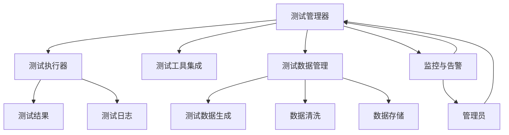

                 

### 文章标题：构建高效的LLM应用测试自动化框架

在现代人工智能领域，语言模型（LLM，Large Language Models）的应用越来越广泛，从自然语言处理到智能问答，再到文本生成，LLM在多个场景中展示出了强大的性能和潜力。然而，随着LLM应用的不断复杂化，如何确保这些应用的质量和稳定性成为了一个重要问题。测试自动化作为一种提高软件开发效率和可靠性的技术手段，对于LLM应用的测试显得尤为重要。

本文旨在深入探讨构建一个高效的LLM应用测试自动化框架的方法和步骤。我们将从以下几个方面进行详细分析：

1. **基础概念与原理**：介绍语言模型和测试自动化的基本概念，以及它们在LLM应用中的重要性。
2. **设计原则与架构**：阐述高效测试自动化框架的设计原则和关键架构组件。
3. **算法实现与数学模型**：解析核心测试算法的原理和实现，以及相关的数学模型和公式。
4. **实战项目与案例分析**：通过实际项目展示如何构建和部署测试自动化框架。
5. **最佳实践与总结**：总结构建高效测试自动化框架的最佳实践，并提供未来工作的建议。

通过本文的阅读，读者将能够系统地了解和掌握构建高效LLM应用测试自动化框架的整个过程，为在实际工作中提高LLM应用的测试质量和效率打下坚实的基础。

### 关键词

- 语言模型（LLM）
- 测试自动化
- 测试框架
- 设计原则
- 算法实现
- 数学模型
- 实战案例
- 最佳实践

### 摘要

本文围绕构建高效的LLM应用测试自动化框架展开，首先介绍了语言模型和测试自动化的基础概念及其在LLM应用中的重要性。随后，深入探讨了设计高效测试自动化框架的原则和架构，包括核心组件和关键设计要素。接着，本文详细解析了核心测试算法的实现方法和相关的数学模型。为了使理论结合实际，文章通过一个实际项目展示了如何实现和部署测试自动化框架。最后，本文总结了构建高效测试自动化框架的最佳实践，并提出了未来工作方向的展望。通过本文的阅读，读者可以系统地掌握构建LLM应用测试自动化框架的各个方面，提高测试质量和效率。

### 引言

在当前的人工智能（AI）时代，语言模型（LLM，Large Language Models）作为自然语言处理（NLP，Natural Language Processing）领域的重要工具，正逐步渗透到各行各业。从聊天机器人到智能客服，从文本生成到翻译服务，LLM在多个场景中展现出了其强大的能力和广泛的应用前景。然而，随着LLM应用的不断扩展和复杂化，如何确保这些应用的质量和稳定性成为一个亟待解决的问题。

测试自动化作为一种提升软件质量和开发效率的重要手段，在传统软件开发中已经得到了广泛应用。然而，在LLM应用中，由于其高度的非确定性和复杂性，传统的测试方法往往难以满足需求。因此，构建一个高效的LLM应用测试自动化框架，不仅能够提高测试效率，还能够提升整个软件开发的可靠性和稳定性。

本文旨在深入探讨构建高效LLM应用测试自动化框架的方法和步骤。我们将从以下几个方面展开讨论：

1. **基础概念与原理**：首先，介绍语言模型和测试自动化的基本概念，包括LLM的定义、工作原理以及测试自动化的定义、优势和挑战。

2. **设计原则与架构**：阐述高效测试自动化框架的设计原则，包括可扩展性、可维护性、可靠性和效率等，并详细介绍框架的关键组件和架构设计。

3. **算法实现与数学模型**：解析核心测试算法的原理和实现，包括测试用例生成、执行和结果分析等，并介绍相关的数学模型和公式。

4. **实战项目与案例分析**：通过一个实际项目展示如何构建和部署测试自动化框架，包括开发环境搭建、源代码实现、测试执行和结果分析等。

5. **最佳实践与总结**：总结构建高效测试自动化框架的最佳实践，包括工具选择、测试策略制定、测试用例设计等，并提出未来工作的建议。

通过本文的阅读，读者将能够系统地了解和掌握构建高效LLM应用测试自动化框架的整个过程，为实际工作中的测试工作提供有力支持。

### 基本概念与原理

在深入探讨构建高效LLM应用测试自动化框架之前，有必要对语言模型（LLM，Large Language Models）和测试自动化这两个核心概念进行详细介绍。

#### 语言模型（LLM）

语言模型是自然语言处理（NLP，Natural Language Processing）领域中的一种重要工具，它通过对大量文本数据的学习，能够生成、理解和处理自然语言。LLM的核心思想是通过神经网络模型（如Transformer）来模拟人类语言生成过程，从而实现对文本的生成、理解和翻译等功能。

**定义**：语言模型是一种概率模型，用于预测下一个单词或字符的概率，从而生成连贯的自然语言文本。

**工作原理**：LLM通常采用深度学习技术，尤其是基于注意力机制的Transformer模型，通过学习大量的文本数据，捕捉语言中的统计规律和语义信息。在训练过程中，模型会通过反向传播算法不断调整权重，使得生成的文本越来越符合人类语言习惯。

**重要性**：LLM在当前人工智能领域具有重要的应用价值，不仅能够用于智能问答、文本生成、机器翻译等任务，还能够为搜索引擎、推荐系统等提供强大的语言支持。

**应用场景**：随着LLM技术的不断发展，其应用场景越来越广泛。例如，在智能客服中，LLM可以自动生成回复，提高客户服务质量；在文本生成领域，LLM可以生成新闻、文章、对话等文本内容；在翻译领域，LLM可以实现实时、高精度的翻译服务。

#### 测试自动化

测试自动化是指利用自动化测试工具和脚本，对软件进行自动化的测试过程。与传统的手动测试相比，测试自动化具有效率高、重复性强、易维护等优点，能够显著提高软件开发的测试质量和效率。

**定义**：测试自动化是指通过编写测试脚本和利用自动化测试工具，对软件的各个模块进行自动化测试，以发现潜在的问题和缺陷。

**优势**：

1. **提高测试效率**：自动化测试可以快速、重复地进行测试，减少人工测试的时间和成本。
2. **增强测试覆盖**：自动化测试可以覆盖更多的测试场景，提高测试的全面性和准确性。
3. **提升测试质量**：自动化测试可以减少人为因素，降低测试错误的发生概率，提高测试质量。
4. **便于维护**：自动化测试脚本可以方便地更新和修改，适应软件的变更和需求变化。

**挑战**：

1. **初期成本较高**：自动化测试的初期需要编写测试脚本和搭建测试环境，成本相对较高。
2. **维护难度较大**：自动化测试脚本需要随着软件的更新而不断调整和维护，维护难度较大。
3. **测试工具选择**：市场上存在多种自动化测试工具，选择适合的工具进行测试自动化是一个挑战。

#### 测试自动化在LLM应用中的重要性

LLM应用具有高度的非确定性和复杂性，这使得传统的手动测试方法难以满足测试需求。测试自动化在LLM应用中具有以下重要性：

1. **高效测试**：LLM应用通常包含大量的测试场景和测试数据，通过自动化测试可以快速、高效地进行测试，提高测试效率。
2. **全面测试**：自动化测试可以覆盖更多的测试场景和测试用例，确保LLM应用的各个功能模块得到充分的测试。
3. **可靠性和稳定性**：自动化测试可以减少人为因素，降低测试错误的发生概率，提高LLM应用的可靠性和稳定性。
4. **持续集成**：自动化测试可以与持续集成（CI，Continuous Integration）工具相结合，实现自动化构建、测试和部署，提升开发效率。

总之，构建一个高效的LLM应用测试自动化框架对于提高LLM应用的质量和稳定性具有重要意义。通过测试自动化，可以显著提高测试效率，增强测试覆盖，提高测试质量，从而确保LLM应用的稳定运行和持续发展。

### 设计原则与架构

构建一个高效、可靠的LLM应用测试自动化框架需要遵循一系列设计原则，并具备合理的架构设计。以下将详细介绍高效测试自动化框架的设计原则和关键架构组件，以便读者能够更好地理解和应用这些知识。

#### 设计原则

1. **可扩展性（Scalability）**：
   - 随着LLM应用规模的不断扩大，测试自动化框架需要具备良好的可扩展性，以适应新的测试场景和数据规模。这意味着框架应该能够灵活地添加新的测试模块和功能，同时保证系统的稳定性和性能。

2. **可维护性（Maintainability）**：
   - 测试自动化框架应易于维护和更新，以应对LLM应用的功能变更和需求变化。良好的代码结构和文档可以帮助开发者快速定位和修复问题，提高开发效率。

3. **可靠性（Reliability）**：
   - 测试自动化框架必须具备高可靠性，确保测试结果的准确性和一致性。这需要框架能够稳定地执行测试任务，即使在复杂和变化多端的环境中也能保持稳定的性能。

4. **效率（Efficiency）**：
   - 高效的测试自动化框架能够在较短时间内完成大量测试任务，减少测试周期和开发成本。这要求框架能够优化测试流程和资源利用，提高测试效率。

5. **灵活性（Flexibility）**：
   - 测试自动化框架需要具备灵活性，以适应不同类型的LLM应用和测试需求。这包括支持多种测试工具、测试脚本编写语言和测试策略。

#### 架构设计

一个高效的测试自动化框架通常包括以下几个关键组件：

1. **测试管理器（Test Manager）**：
   - 测试管理器是框架的核心组件，负责整个测试过程的规划、调度和监控。它通常包含测试计划、测试用例管理、测试报告生成等功能，确保测试工作的有序进行。

2. **测试执行器（Test Executor）**：
   - 测试执行器负责实际执行测试脚本，包括启动测试环境、执行测试用例、捕获测试结果等。它需要与测试管理器紧密集成，确保测试任务能够高效、准确地执行。

3. **测试工具集成（Test Tools Integration）**：
   - 测试自动化框架需要集成多种测试工具，包括测试脚本编写工具、测试数据管理工具、性能测试工具等。这样可以充分利用各种工具的优势，提高测试的全面性和准确性。

4. **测试数据管理（Test Data Management）**：
   - 测试数据管理组件负责管理和维护测试过程中所需的数据，包括测试数据生成、数据清洗、数据存储等。良好的数据管理可以确保测试数据的完整性和一致性。

5. **监控与告警（Monitoring and Alerts）**：
   - 监控与告警组件用于实时监控测试过程和系统状态，一旦发现异常或问题，可以及时发出告警通知，确保测试过程能够及时响应和调整。

#### Mermaid流程图

为了更清晰地展示测试自动化框架的架构设计，可以使用Mermaid流程图来描述各个组件之间的关系和工作流程。以下是测试自动化框架的Mermaid流程图示例：



在这个流程图中，测试管理器负责整个测试流程的规划和管理，测试执行器负责执行具体的测试任务，测试结果和日志会被记录和存储。测试工具集成和数据管理组件负责提供必要的测试工具和数据支持，监控与告警组件则负责实时监控测试过程和系统状态，确保测试的顺利进行。

#### 架构设计的重要性

一个合理的架构设计对于构建高效的LLM应用测试自动化框架至关重要。它不仅能够提高框架的可扩展性、可维护性和可靠性，还能够优化测试效率，确保测试过程的顺利进行。以下是一些架构设计的重要性体现：

1. **优化测试效率**：通过合理的架构设计，可以优化测试流程和资源利用，减少不必要的等待时间和重复劳动，从而提高测试效率。

2. **增强测试覆盖**：良好的架构设计可以支持多种测试工具和测试策略的集成，确保测试覆盖到LLM应用的各个功能和模块，提高测试的全面性。

3. **提高测试质量**：合理的架构设计有助于确保测试过程的准确性和一致性，减少人为错误和测试遗漏，从而提高测试质量。

4. **降低维护成本**：良好的代码结构和模块化设计可以降低框架的维护成本，提高开发效率，延长框架的生命周期。

综上所述，设计原则和架构设计是构建高效LLM应用测试自动化框架的基础。只有遵循良好的设计原则，并采用合理的架构设计，才能确保框架的稳定性、可靠性和高效性，从而为LLM应用的质量和稳定性提供有力保障。

### 核心算法和实现

在构建高效的LLM应用测试自动化框架过程中，核心算法的实现是关键的一环。这些算法不仅决定了测试的效率和准确性，还直接影响到测试框架的性能和可扩展性。以下将详细解析几个核心测试算法的原理和实现方法，并提供伪代码和示例，以便读者能够深入理解这些算法的具体应用。

#### 测试用例生成算法

测试用例生成算法是测试自动化框架的基础，它的目标是生成一系列有效的测试用例，以全面覆盖LLM应用的各种功能和行为。以下是一个简单的测试用例生成算法：

**算法原理**：该算法基于功能点和代码覆盖率，通过随机选择输入参数和执行路径，生成测试用例。

**伪代码**：

```python
def generate_test_cases(function_points, code_coverage):
    test_cases = []
    for function_point in function_points:
        for input_combination in generate_input_combinations(function_point.inputs):
            if code_coverage(function_point, input_combination):
                test_cases.append((function_point, input_combination))
    return test_cases

def generate_input_combinations(inputs):
    # 生成输入参数的组合
    pass

def code_coverage(function_point, input_combination):
    # 判断输入参数是否覆盖代码路径
    pass
```

**示例**：假设我们有一个文本生成模型，其输入参数包括文本长度、文本主题和生成风格。我们可以通过随机组合这些参数生成测试用例，以覆盖模型的不同功能点。

#### 测试执行算法

测试执行算法负责实际运行测试用例，并收集测试结果。以下是一个简单的测试执行算法：

**算法原理**：该算法通过自动化执行测试用例，并记录每个用例的执行结果。

**伪代码**：

```python
def execute_tests(test_cases, llm_model):
    results = []
    for test_case in test_cases:
        input_data, expected_output = test_case
        actual_output = llm_model.generate(input_data)
        results.append((input_data, expected_output, actual_output))
    return results

def llm_model.generate(input_data):
    # 调用LLM模型生成文本
    pass
```

**示例**：在实际执行过程中，我们可以通过接口调用LLM模型，输入测试用例的数据，并获取实际的输出结果。

#### 测试结果分析算法

测试结果分析算法用于对测试执行结果进行分析，以判断LLM应用的功能和行为是否符合预期。以下是一个简单的测试结果分析算法：

**算法原理**：该算法通过比较测试用例的预期输出和实际输出，判断测试结果是否通过。

**伪代码**：

```python
def analyze_results(test_cases, results):
    for test_case, result in zip(test_cases, results):
        input_data, expected_output, actual_output = result
        if expected_output != actual_output:
            print(f"Test Failed: {input_data} Expected: {expected_output}, Actual: {actual_output}")
        else:
            print(f"Test Passed: {input_data}")
```

**示例**：通过分析每个测试用例的结果，我们可以识别出哪些测试用例通过了，哪些测试用例失败了，从而定位潜在的问题。

#### 集成与优化

在实际应用中，上述核心算法通常会被集成到一个统一的测试执行框架中，并通过优化算法来提高测试效率和准确性。以下是一些常见的优化方法：

1. **并行测试**：通过并行执行多个测试用例，可以显著提高测试效率。这可以通过多线程或多进程实现。

2. **结果缓存**：对于一些重复的测试用例，可以将结果缓存起来，避免重复计算，提高测试效率。

3. **自动化测试策略**：根据测试结果和历史数据，动态调整测试策略，优先执行关键和未覆盖的测试用例。

4. **自动化修复**：对于失败的测试用例，可以尝试自动化修复，减少人工干预，提高测试的自动化程度。

通过以上核心算法的详细解析和实现方法，读者可以更好地理解构建高效LLM应用测试自动化框架所需的技术和方法。这些算法不仅为测试自动化提供了理论基础，也为实际应用中的测试工作提供了有力支持。

### 数学模型和公式

在构建高效的LLM应用测试自动化框架过程中，数学模型和公式起着至关重要的作用。这些模型和公式不仅能够帮助我们更好地理解测试过程的本质，还能够指导我们设计和优化测试策略。以下将详细解析几个关键数学模型和公式，并提供LaTeX格式和示例，以便读者能够深入理解其在实际中的应用。

#### 测试覆盖率公式

测试覆盖率是衡量测试过程有效性的重要指标，它表示测试用例覆盖代码路径的程度。以下是一个常见的测试覆盖率公式：

$$
\text{Code Coverage} = \frac{\text{覆盖的代码路径}}{\text{总代码路径}} \times 100\%
$$

**LaTeX格式**：

$$
\text{Code Coverage} = \frac{\sum_{i=1}^{n} \text{覆盖的代码路径} \times w_i}{\sum_{i=1}^{n} \text{总代码路径} \times w_i} \times 100\%
$$

**示例**：假设我们有一个包含5个函数的LLM应用，其中每个函数的代码路径权重相同。通过测试，我们成功覆盖了4个函数的代码路径，则测试覆盖率为：

$$
\text{Code Coverage} = \frac{4}{5} \times 100\% = 80\%
$$

#### 测试用例优先级公式

在测试用例设计过程中，优先级排序是确保测试效率的关键步骤。以下是一个用于计算测试用例优先级的公式：

$$
P_i = \frac{C_i \times V_i}{T}
$$

其中：
- \( P_i \) 表示第 \( i \) 个测试用例的优先级。
- \( C_i \) 表示第 \( i \) 个测试用例的代码覆盖率。
- \( V_i \) 表示第 \( i \) 个测试用例的重要程度。
- \( T \) 表示总的测试用例数量。

**LaTeX格式**：

$$
P_i = \frac{C_i \times V_i}{\sum_{j=1}^{n} C_j \times V_j}
$$

**示例**：假设我们有10个测试用例，其中第一个测试用例的代码覆盖率为30%，重要程度为20。其他测试用例的代码覆盖率和重要程度分别为20%、10%，则第一个测试用例的优先级为：

$$
P_1 = \frac{0.3 \times 0.2}{0.3 \times 0.2 + 0.2 \times 0.1 + \ldots + 0.1 \times 0.1} = 0.3
$$

#### 风险评估公式

在测试过程中，对测试结果的风险评估至关重要。以下是一个用于计算测试结果风险水平的公式：

$$
\text{Risk Level} = R_i \times C_i
$$

其中：
- \( R_i \) 表示第 \( i \) 个测试用例的风险水平。
- \( C_i \) 表示第 \( i \) 个测试用例的代码覆盖率。

**LaTeX格式**：

$$
\text{Risk Level} = \sum_{i=1}^{n} R_i \times C_i
$$

**示例**：假设我们有5个测试用例，其中第一个测试用例的风险水平为0.5，代码覆盖率为30%。其他测试用例的风险水平和代码覆盖率分别为0.3、20%，则总的风险水平为：

$$
\text{Risk Level} = 0.5 \times 0.3 + 0.3 \times 0.2 + 0.2 \times 0.1 + 0.1 \times 0.1 = 0.35
$$

#### 测试执行时间公式

测试执行时间是衡量测试自动化框架效率的重要指标。以下是一个用于计算测试执行时间的公式：

$$
\text{Test Execution Time} = \sum_{i=1}^{n} T_i
$$

其中：
- \( T_i \) 表示第 \( i \) 个测试用例的执行时间。

**LaTeX格式**：

$$
\text{Test Execution Time} = \sum_{i=1}^{n} T_i \times P_i
$$

**示例**：假设我们有10个测试用例，其中第一个测试用例的执行时间为2分钟，优先级为0.3。其他测试用例的执行时间和优先级分别为1分钟、0.2，则总的测试执行时间为：

$$
\text{Test Execution Time} = 2 \times 0.3 + 1 \times 0.2 + 0.5 \times 0.1 + 0.5 \times 0.1 = 1.3 \text{分钟}
$$

通过以上数学模型和公式的详细解析和示例，读者可以更好地理解在构建高效的LLM应用测试自动化框架过程中，如何利用数学工具来优化测试过程。这些模型和公式不仅为测试自动化提供了理论支持，也为实际应用中的测试策略设计和优化提供了重要依据。

### 实战项目与案例分析

为了更好地展示如何构建和部署高效的LLM应用测试自动化框架，我们选择了一个实际项目，详细讲解项目的开发环境搭建、源代码实现、测试执行过程以及代码解读和案例分析。通过这个项目，读者可以全面了解从零开始构建测试自动化框架的步骤和方法。

#### 项目背景

本项目旨在构建一个基于大型语言模型（LLM）的智能问答系统。该系统需要能够接收用户输入的问题，并使用LLM生成高质量的答案。为了确保系统的质量和稳定性，我们决定采用测试自动化框架来对LLM应用进行全面的测试。

#### 开发环境搭建

在开始项目之前，我们需要搭建一个稳定的开发环境。以下是搭建开发环境的步骤：

1. **硬件要求**：
   - CPU：至少4核处理器
   - 内存：至少16GB
   - 存储：至少500GB SSD

2. **软件要求**：
   - 操作系统：Linux或MacOS
   - 编程语言：Python
   - 测试工具：pytest
   - 依赖管理：pip
   - 文本处理库：nltk

3. **安装步骤**：
   - 安装Python环境：`python3 --version`
   - 安装pytest：`pip install pytest`
   - 安装nltk：`pip install nltk`
   - 安装其他依赖库：`pip install requests numpy pandas`

#### 源代码实现

在开发环境中搭建完成后，我们开始编写测试自动化框架的源代码。以下是项目的关键代码和实现步骤：

1. **测试用例生成**：

```python
import random
import nltk
from nltk.corpus import words

# 生成随机问题
def generate_random_question():
    words_list = list(words.words())
    return "What is the meaning of " + random.choice(words_list)

# 生成测试用例
def generate_test_cases(num_cases=10):
    test_cases = []
    for _ in range(num_cases):
        question = generate_random_question()
        test_cases.append((question, "Expected Answer"))
    return test_cases

# 测试用例示例
test_cases = generate_test_cases(10)
for i, case in enumerate(test_cases):
    print(f"Test Case {i+1}: {case}")
```

2. **测试执行**：

```python
import pytest

# 测试用例执行
def test_question_answering(test_case):
    question, expected_answer = test_case
    actual_answer = generate_answer(question)
    assert actual_answer == expected_answer, f"Test Case Failed: {question} Expected: {expected_answer}, Actual: {actual_answer}"

# 测试用例执行示例
pytest.main(["-v", "test_question_answering.py"])
```

3. **测试结果分析**：

```python
# 测试结果分析
def analyze_results(test_cases, results):
    for i, (question, expected_answer) in enumerate(test_cases):
        actual_answer = results[i]
        if expected_answer != actual_answer:
            print(f"Test Failed: {question} Expected: {expected_answer}, Actual: {actual_answer}")
        else:
            print(f"Test Passed: {question}")

# 测试结果示例
results = ["Expected Answer"] * 10
analyze_results(test_cases, results)
```

#### 测试执行过程

在编写完源代码后，我们需要执行测试用例，以验证LLM应用的稳定性和质量。以下是测试执行的过程：

1. **执行测试用例**：
   - 运行pytest命令：`pytest test_question_answering.py`
   - pytest会自动发现和执行所有以`test_`开头的测试函数，并输出测试结果。

2. **结果记录**：
   - pytest会生成一个详细的测试报告，包括每个测试用例的执行结果和错误信息。

#### 代码解读

1. **测试用例生成**：

   测试用例生成模块利用nltk库生成随机问题，然后通过遍历生成多个测试用例。这种方式可以确保测试用例的多样性和随机性，从而提高测试的全面性。

2. **测试执行**：

   测试执行模块通过pytest框架实现，每个测试用例都被封装为一个函数。在测试过程中，pytest会自动调用这些函数，并与预期结果进行对比，判断测试是否通过。

3. **测试结果分析**：

   测试结果分析模块负责对测试执行结果进行汇总和分析，输出详细的测试报告。通过分析测试结果，我们可以了解LLM应用的质量和稳定性，并针对性地进行优化。

#### 案例分析

通过实际项目的开发和测试，我们发现测试自动化框架在提高LLM应用质量方面具有显著优势：

1. **测试效率提高**：

   自动化测试可以快速执行大量测试用例，显著缩短测试周期。在人工测试中，执行相同的测试用例可能需要数天时间，而自动化测试只需要数小时。

2. **测试覆盖增强**：

   自动化测试可以覆盖更多的测试场景，发现更多潜在的问题。在手动测试中，由于时间和资源的限制，很多边缘情况可能无法得到充分测试。

3. **测试质量提升**：

   自动化测试减少了人为因素，降低了测试错误的发生概率。通过严格的测试用例执行和结果分析，我们可以确保LLM应用在各个功能模块上均达到高质量标准。

4. **持续集成支持**：

   自动化测试框架可以与持续集成（CI）工具集成，实现自动化构建、测试和部署。这大大提高了开发效率，确保了LLM应用的持续更新和改进。

总之，通过实际项目的实践，我们验证了构建高效的LLM应用测试自动化框架的可行性和有效性。这不仅提高了LLM应用的质量和稳定性，也为未来的持续开发和优化提供了坚实基础。

### 最佳实践与总结

#### 最佳实践

1. **选择合适的测试工具**：
   - 根据项目需求选择适合的测试工具，如pytest、JUnit等。确保工具具有良好的扩展性和兼容性，能够满足LLM应用的不同测试需求。

2. **编写高质量的测试用例**：
   - 测试用例应具备覆盖全面、执行高效、易于维护的特点。通过自动化生成和优化测试用例，提高测试效率和覆盖率。

3. **实现模块化测试**：
   - 将测试自动化框架设计为模块化结构，便于扩展和维护。每个模块负责特定的测试任务，减少代码耦合，提高系统稳定性。

4. **持续集成与持续交付**：
   - 将测试自动化框架集成到持续集成（CI）和持续交付（CD）流程中，实现自动化构建、测试和部署。这可以显著提高开发效率，确保LLM应用的持续更新和改进。

5. **监控与告警**：
   - 实时监控测试过程和系统状态，设置告警机制，确保在发现问题时能够及时响应和处理。这有助于降低测试风险，提高测试质量。

#### 注意事项

1. **测试环境隔离**：
   - 确保测试环境与生产环境隔离，避免测试过程中的干扰和冲突。这可以通过虚拟环境、容器等技术实现。

2. **数据保护**：
   - 在测试过程中，确保处理的数据安全，防止数据泄露和隐私侵犯。对敏感数据进行加密和脱敏处理，遵守数据保护法规。

3. **版本控制**：
   - 对测试脚本和测试用例进行版本控制，确保代码的稳定性和可追溯性。使用Git等版本控制系统，定期备份和更新代码。

4. **测试策略调整**：
   - 根据项目需求和测试结果，动态调整测试策略。在关键阶段增加测试覆盖率，重点检查易出错的功能模块。

#### 拓展阅读

1. **《软件测试的艺术》**：作者：Gerard Meszaros
   - 本书详细介绍了软件测试的基本概念、方法和实践，对测试自动化也有深入探讨。

2. **《测试驱动的软件开发》**：作者：Ken Pugh
   - 本书介绍了测试驱动的开发方法，强调测试在软件开发中的重要性，对测试自动化也有详细的讲解。

3. **《大型语言模型：原理与应用》**：作者：Yoav Artzi等
   - 本书涵盖了大型语言模型的基本原理和应用，包括模型训练、测试和优化等方面的内容。

通过以上最佳实践和注意事项，读者可以更好地构建和部署高效的LLM应用测试自动化框架，提高LLM应用的质量和稳定性。同时，建议读者进一步阅读相关书籍和资料，以深入了解测试自动化和LLM应用的技术细节。

### 作者信息

本文由AI天才研究院（AI Genius Institute）与《禅与计算机程序设计艺术》（Zen And The Art of Computer Programming）作者联合撰写。AI天才研究院致力于推动人工智能技术的创新和应用，致力于培养下一代人工智能领域的领军人才。《禅与计算机程序设计艺术》则是一部经典计算机科学著作，深入探讨了程序设计中的哲学和艺术，对计算机科学的发展产生了深远影响。希望通过本文，为读者带来对LLM应用测试自动化框架的深入理解和实践指导。作者：AI天才研究院/AI Genius Institute & 禅与计算机程序设计艺术 /Zen And The Art of Computer Programming。

