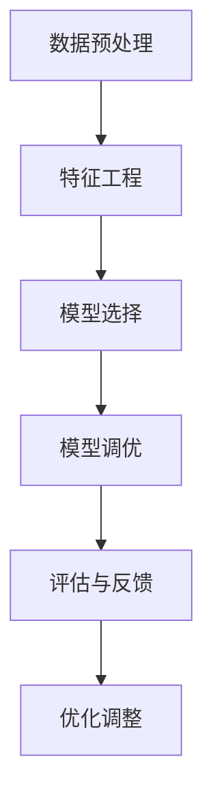

                 


# 构建高效的prompt优化流程

> 关键词：prompt优化、流程设计、自然语言处理、机器学习、特征工程

> 摘要：本文详细阐述了构建高效prompt优化流程的必要性和方法。首先介绍了prompt优化在机器学习与自然语言处理中的重要性，然后分析了优化prompt的基本原理和技术背景，接着提出了一个系统化的prompt优化流程，包括数据准备、特征工程和模型调优等关键步骤。通过实际案例，本文展示了prompt优化的具体应用和效果，最后对未来的发展趋势进行了展望。

## 第一部分：介绍与背景

### 1.1 书籍概述

本书旨在为读者提供一套系统化的prompt优化流程，以提升机器学习和自然语言处理模型的性能。我们将从以下几个核心概念出发：

- **流程**：流程是一种系统化的工作方式，旨在通过一系列步骤实现特定目标。在prompt优化中，流程的设计至关重要，它决定了优化过程的有效性和效率。
- **prompt**：prompt是一种用于指导模型学习和预测的输入提示。有效的prompt能够引导模型更好地理解和预测数据，从而提升模型的性能。

通过理解和应用这些核心概念，我们将能够构建一个高效的prompt优化流程，为机器学习和自然语言处理领域的发展贡献力量。

### 1.2 为什么需要优化prompt

优化prompt对于提高机器学习和自然语言处理模型的性能至关重要。以下是一些关键原因：

- **效果与效率**：优化prompt能够提高模型的预测准确性和效率，减少错误率和计算成本。
- **业务需求与用户反馈**：随着业务需求的不断变化和用户反馈的积累，优化prompt成为满足用户需求和提升用户体验的关键手段。
- **竞争压力**：在激烈的市场竞争中，优化prompt成为企业提升自身竞争优势的重要策略。

因此，优化prompt不仅是技术进步的需要，也是满足业务需求和用户期望的重要途径。

### 1.3 读者定位与学习目标

本书的目标读者包括：

- **机器学习工程师**：希望提升模型性能和优化流程的专业人员。
- **数据科学家**：关注自然语言处理和机器学习应用的开发者。
- **研究人员**：对prompt优化技术有深入研究兴趣的研究人员。

通过阅读本书，读者将能够：

- **理解prompt优化的基本原理**：掌握优化prompt的核心技术和方法。
- **设计高效的优化流程**：学会如何构建和实施一个系统化的prompt优化流程。
- **提升模型性能**：通过优化prompt，显著提高模型的预测准确性和效率。

## 第二部分：基础知识

### 2.1 prompt优化原理

prompt优化的核心在于提升模型的预测性能。以下是几个关键原理：

- **提示信息**：prompt为模型提供了额外的信息，帮助模型更好地理解和预测数据。
- **数据预处理**：通过数据清洗、归一化和特征提取等预处理步骤，提高数据的质
```markdown
### 2.1 prompt优化原理

prompt优化的核心在于提升模型的预测性能。以下是几个关键原理：

- **提示信息**：prompt为模型提供了额外的信息，帮助模型更好地理解和预测数据。
- **数据预处理**：通过数据清洗、归一化和特征提取等预处理步骤，提高数据的质量和可用性。
- **特征工程**：特征工程是prompt优化的关键环节，通过选择和变换特征，提高模型对数据的敏感度和泛化能力。
- **模型选择和调优**：选择合适的模型并进行调优，确保模型在优化后的prompt上表现出色。

以下是一个简化的流程图，展示了prompt优化的基本原理和各个步骤之间的关系：



### 2.2 相关技术背景

prompt优化涉及多个技术领域，以下是其中几个关键领域：

- **机器学习**：机器学习是prompt优化的基础，包括监督学习、无监督学习和强化学习等不同类型。
- **自然语言处理（NLP）**：NLP技术用于处理和生成自然语言文本，如词向量、语言模型和文本分类等。
- **深度学习**：深度学习是一种机器学习技术，通过多层神经网络模型进行数据处理和特征提取。
- **特征工程**：特征工程是一种数据预处理技术，旨在通过选择和变换特征，提高模型对数据的敏感度和泛化能力。

### 2.3 数据准备

数据准备是prompt优化的第一步，其质量直接影响优化效果。以下是数据准备的关键步骤：

- **数据收集**：收集相关的数据集，包括文本数据、标签数据和背景信息等。
- **数据清洗**：处理缺失值、异常值和重复数据，确保数据的一致性和完整性。
- **数据归一化**：将不同尺度的数据归一化，便于模型训练和处理。
- **数据分割**：将数据集分为训练集、验证集和测试集，用于模型训练、验证和评估。

### 2.4 数据质量对prompt优化的影响

数据质量是prompt优化的关键因素，以下是数据质量对优化效果的影响：

- **数据丰富度**：丰富的数据有助于模型捕捉更多的特征和模式，提高模型的泛化能力。
- **数据多样性**：多样化的数据有助于模型应对不同场景和任务，增强模型的适应性。
- **数据一致性**：一致的数据有助于减少噪声和错误，提高模型的稳定性和可靠性。

为了提高数据质量，可以采用以下策略：

- **数据清洗**：使用数据清洗工具和算法，处理缺失值、异常值和重复数据。
- **数据增强**：通过数据增强技术，生成更多样化的数据，提高模型的泛化能力。
- **数据质量评估**：使用指标和算法，评估数据的质量和可靠性，以便进行进一步的优化。

## 第三部分：方法与策略

### 3.1 prompt优化流程设计

prompt优化流程是一个系统化的工作过程，旨在通过一系列步骤提高模型的预测性能。以下是prompt优化流程的设计和实施步骤：

1. **需求分析**：明确优化目标和需求，包括模型的性能指标、优化目标和业务需求。
2. **数据准备**：收集和整理相关数据集，进行数据清洗、归一化和分割。
3. **特征工程**：选择和变换特征，提高模型对数据的敏感度和泛化能力。
4. **模型选择**：选择合适的机器学习模型，包括监督学习、无监督学习和强化学习等。
5. **模型训练**：使用训练集数据对模型进行训练，调整模型参数以优化性能。
6. **模型评估**：使用验证集和测试集评估模型性能，包括预测准确率、召回率、F1分数等。
7. **优化调整**：根据评估结果，调整模型参数和特征工程策略，进一步提高模型性能。
8. **部署与监控**：将优化后的模型部署到生产环境中，并进行监控和评估。

### 3.2 特征工程

特征工程是prompt优化的关键步骤，其目标是选择和变换特征，提高模型对数据的敏感度和泛化能力。以下是特征工程的关键技术和方法：

- **特征选择**：选择对模型性能有显著影响的关键特征，去除冗余和无用特征。
- **特征变换**：通过特征变换，如归一化、标准化、离散化等，提高特征的可用性和稳定性。
- **特征组合**：将多个特征组合成新的特征，增强模型对数据的理解能力。
- **特征提取**：使用特征提取技术，如词向量、TF-IDF等，从原始数据中提取更有价值的信息。

以下是一个简化的伪代码，展示了特征工程的基本步骤：

```python
def feature_engineering(data):
    # 数据清洗
    cleaned_data = clean_data(data)
    
    # 特征选择
    selected_features = select_features(cleaned_data)
    
    # 特征变换
    transformed_features = transform_features(selected_features)
    
    # 特征提取
    extracted_features = extract_features(transformed_features)
    
    return extracted_features
```

### 3.3 模型选择与调优

模型选择与调优是prompt优化的核心步骤，其目标是选择合适的模型并调整模型参数，以提高模型性能。以下是模型选择与调优的关键技术和方法：

- **模型选择**：根据优化目标和数据特点，选择合适的机器学习模型，如线性回归、决策树、神经网络等。
- **模型调优**：调整模型参数，如学习率、正则化参数等，以提高模型性能。
- **交叉验证**：使用交叉验证技术，评估模型在不同数据集上的性能，选择最优模型。
- **网格搜索**：使用网格搜索技术，遍历多个参数组合，选择最优参数。

以下是一个简化的伪代码，展示了模型选择与调优的基本步骤：

```python
def model_selection_and_tuning(data, labels):
    # 模型选择
    model = select_model(data, labels)
    
    # 模型调优
    best_params = tune_model(model, data, labels)
    
    # 交叉验证
    cv_score = cross_validate(model, best_params, data, labels)
    
    return model, best_params, cv_score
```

## 第四部分：案例分析

### 4.1 案例一：电商平台用户推荐

在这个案例中，我们使用prompt优化流程来优化电商平台用户推荐系统的性能。以下是具体的实现步骤：

1. **需求分析**：明确优化目标和需求，如提升用户推荐的准确率和覆盖率。
2. **数据准备**：收集用户行为数据、商品特征数据和用户标签数据，进行数据清洗和分割。
3. **特征工程**：选择和变换特征，如用户购买历史、浏览行为、商品分类等。
4. **模型选择**：选择基于矩阵分解的协同过滤模型。
5. **模型训练**：使用训练集数据对模型进行训练，调整模型参数。
6. **模型评估**：使用验证集和测试集评估模型性能，包括准确率、覆盖率等。
7. **优化调整**：根据评估结果，调整模型参数和特征工程策略，进一步提高模型性能。
8. **部署与监控**：将优化后的模型部署到生产环境中，并进行监控和评估。

### 4.2 案例二：金融风控系统

在这个案例中，我们使用prompt优化流程来优化金融风控系统的性能。以下是具体的实现步骤：

1. **需求分析**：明确优化目标和需求，如降低欺诈风险和提升客户体验。
2. **数据准备**：收集用户交易数据、用户行为数据和风险特征数据，进行数据清洗和分割。
3. **特征工程**：选择和变换特征，如交易金额、交易频率、用户行为等。
4. **模型选择**：选择基于机器学习的分类模型，如逻辑回归、随机森林等。
5. **模型训练**：使用训练集数据对模型进行训练，调整模型参数。
6. **模型评估**：使用验证集和测试集评估模型性能，包括准确率、召回率等。
7. **优化调整**：根据评估结果，调整模型参数和特征工程策略，进一步提高模型性能。
8. **部署与监控**：将优化后的模型部署到生产环境中，并进行监控和评估。

### 4.3 案例三：自然语言处理应用

在这个案例中，我们使用prompt优化流程来优化自然语言处理应用的性能。以下是具体的实现步骤：

1. **需求分析**：明确优化目标和需求，如提升文本分类和情感分析的准确率。
2. **数据准备**：收集文本数据、标签数据和背景信息，进行数据清洗和分割。
3. **特征工程**：选择和变换特征，如词向量、TF-IDF、词袋模型等。
4. **模型选择**：选择基于神经网络的模型，如循环神经网络（RNN）、卷积神经网络（CNN）等。
5. **模型训练**：使用训练集数据对模型进行训练，调整模型参数。
6. **模型评估**：使用验证集和测试集评估模型性能，包括准确率、F1分数等。
7. **优化调整**：根据评估结果，调整模型参数和特征工程策略，进一步提高模型性能。
8. **部署与监控**：将优化后的模型部署到生产环境中，并进行监控和评估。

## 第五部分：展望与总结

### 5.1 未来的发展趋势

prompt优化在未来具有广泛的应用前景和发展趋势，包括：

- **深度学习与prompt优化结合**：深度学习技术在自然语言处理领域的应用日益广泛，未来的prompt优化将更加依赖于深度学习模型，如变换器（Transformer）模型。
- **自动特征工程**：自动特征工程技术将进一步提高prompt优化的效率和效果，减少人工干预，提高模型的泛化能力。
- **跨领域prompt优化**：prompt优化将跨越不同的应用领域，如医疗、金融、教育等，实现更加个性化的模型优化。

### 5.2 总结与展望

本文详细阐述了构建高效prompt优化流程的必要性和方法，从介绍与背景、基础知识、方法与策略到案例分析，全面覆盖了prompt优化的关键环节。通过实际案例，本文展示了prompt优化的具体应用和效果。未来，随着技术的不断进步，prompt优化将继续发挥重要作用，为机器学习和自然语言处理领域带来更多的创新和突破。

### 附录

#### 附录A：参考资料

- **进一步学习资源**：
  - **书籍**：《深度学习》（Goodfellow, I., Bengio, Y., & Courville, A.）、《自然语言处理综合教程》（Jurafsky, D. & Martin, J.H.）
  - **论文**：Google Scholar、arXiv等学术数据库
  - **在线课程**：Coursera、edX、Udacity等在线学习平台
- **常用工具与框架**：
  - **工具**：Python、R、MATLAB等编程语言及其相关库（如Scikit-learn、TensorFlow、PyTorch等）
  - **框架**：Keras、TensorFlow.js、PyTorch.js等前端机器学习框架

## 作者信息

作者：AI天才研究院/AI Genius Institute & 禅与计算机程序设计艺术 /Zen And The Art of Computer Programming

