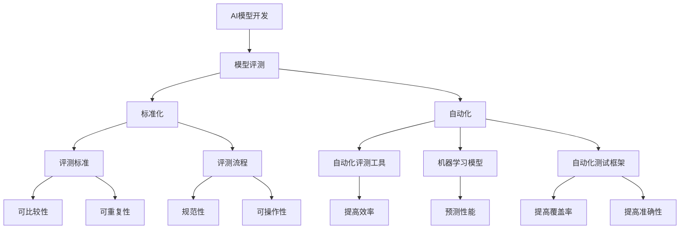

                 


### 标准化自动化模型评测：确保AI应用质量的重要手段

#### 关键词：
- AI模型评测
- 标准化
- 自动化
- 质量保证
- 应用实践

#### 摘要：
随着人工智能技术的发展，AI模型的评测成为了确保应用质量的关键环节。本文将探讨标准化和自动化在AI模型评测中的应用，介绍相关概念、方法和技术，并通过案例分析和实战应用，展示如何确保AI应用的质量和可靠性。

## 引言

人工智能（AI）作为当今技术领域的热点，已广泛应用于各个行业，从自动驾驶、智能语音助手到医疗诊断和金融风控，AI模型无处不在。然而，AI模型的开发和应用过程中，模型评测的质量和准确性成为了关键问题。标准化和自动化是提升模型评测效率和准确性的重要手段。

### 标准化在AI模型评测中的作用

标准化是确保AI模型评测质量和一致性的重要基础。它包括以下几个方面：

1. **定义评测标准**：标准化明确了评测的指标和方法，使评测结果具有可比性和可重复性。
2. **规范评测流程**：标准化规定了评测的各个环节，从数据预处理到结果分析，确保评测过程的规范性和可操作性。
3. **促进跨领域合作**：标准化促进了不同领域专家之间的合作，为AI模型评测提供了统一的语言和工具。

### 自动化模型评测的方法和技术

自动化模型评测通过利用计算机技术和算法，提高了评测的效率和准确性。以下是几种常见的自动化模型评测方法和技术：

1. **自动化评测工具**：如MATLAB、Python等编程环境提供的自动化评测工具，可以简化评测流程，提高评测效率。
2. **机器学习模型**：通过训练机器学习模型对模型进行自动评测，可以预测模型的性能，发现潜在问题。
3. **自动化测试框架**：如Selenium、JUnit等自动化测试框架，可以自动化执行测试用例，提高测试覆盖率和准确性。

### 核心概念与联系

为了更好地理解标准化和自动化在AI模型评测中的作用，我们可以通过以下Mermaid流程图来展示核心概念之间的联系：



### 核心算法原理讲解

为了更好地理解自动化模型评测的核心算法原理，我们可以使用伪代码来详细阐述：

```python
# 伪代码：自动化模型评测算法

function EvaluateModel(model, data):
    # 数据预处理
    preprocessed_data = PreprocessData(data)

    # 执行模型预测
    predictions = model.predict(preprocessed_data)

    # 计算评测指标
    metrics = CalculateMetrics(predictions, ground_truth)

    # 输出评测结果
    return metrics
```

在上述伪代码中，`EvaluateModel`函数接受一个AI模型和测试数据作为输入，通过预处理数据、执行模型预测和计算评测指标，最终返回评测结果。

### 数学模型和公式讲解与举例说明

在AI模型评测中，我们常常会使用以下数学模型和公式：

$$
\text{Accuracy} = \frac{\text{正确预测的数量}}{\text{总预测数量}}
$$

$$
\text{F1-Score} = \frac{2 \times \text{Precision} \times \text{Recall}}{\text{Precision} + \text{Recall}}
$$

举例来说，如果我们有一个分类模型，预测结果为{“猫”，“狗”，“鸟”，“猫”，“狗”}，实际标签为{“猫”，“狗”，“鸟”，“狗”，“猫”}，则：

- 准确率 = \( \frac{4}{5} = 0.8 \)
- F1分值 = \( \frac{2 \times 0.8 \times 0.8}{0.8 + 0.8} = 0.8 \)

这些指标帮助我们评估模型的性能，并在评测过程中进行调整和优化。

### 项目实战

为了更好地展示标准化和自动化在AI模型评测中的应用，我们以一个实际项目为例进行讲解。

#### 项目背景

某公司开发了一个智能问答系统，用于为客户提供实时咨询服务。为了确保系统的质量，需要对模型进行全面的评测。

#### 开发环境搭建

- 使用Python 3.8作为主要编程语言
- 利用TensorFlow 2.4构建深度学习模型
- 使用Selenium进行自动化测试

#### 源代码详细实现和代码解读

以下是该项目中的一个关键代码片段，用于评估模型的准确率和F1分值：

```python
import tensorflow as tf
from sklearn.metrics import accuracy_score, f1_score

# 加载测试数据
test_data = LoadTestData()

# 加载模型
model = LoadModel()

# 执行预测
predictions = model.predict(test_data.preprocessing)

# 计算准确率和F1分值
accuracy = accuracy_score(test_data.labels, predictions)
f1 = f1_score(test_data.labels, predictions, average='weighted')

# 输出结果
print(f"Accuracy: {accuracy:.2f}")
print(f"F1-Score: {f1:.2f}")
```

这段代码首先加载测试数据和模型，然后执行预测，并使用`accuracy_score`和`f1_score`函数计算准确率和F1分值，最终输出结果。

#### 代码应用解读与分析

通过上述代码，我们可以轻松评估模型的性能。在实际项目中，我们还可以根据评测结果对模型进行调整和优化，以提高其准确率和F1分值。

#### 实际案例分析和详细讲解剖析

以一个实际案例为例，假设我们的模型在测试数据上的准确率为0.75，F1分值为0.7。以下是对这个结果的详细分析和解决方案：

- **准确率较低**：可能原因是模型过拟合或者训练数据不足。可以尝试增加训练数据、使用正则化技术或者调整模型结构。
- **F1分值较低**：可能原因是模型的分类能力不足。可以尝试调整分类阈值、使用不同的损失函数或者增加特征工程。

通过以上分析，我们可以针对性地优化模型，提高其评测指标。

#### 项目小结

通过本项目，我们展示了如何利用标准化和自动化方法进行AI模型评测。标准化和自动化不仅提高了评测的效率和准确性，还为模型的开发和优化提供了有力支持。

### 最佳实践 Tips

- **定期更新评测标准**：随着AI技术的发展，评测标准需要定期更新，以适应新的模型和应用场景。
- **多样化评测指标**：除了常见的准确率和F1分值，还可以考虑其他指标，如召回率、均方误差等，全面评估模型性能。
- **持续改进评测工具**：自动化评测工具需要不断改进和优化，以提高评测的效率和准确性。

### 小结与注意事项

本文详细介绍了标准化和自动化在AI模型评测中的应用，通过核心概念、算法原理、项目实战等多方面进行了讲解。在AI模型评测过程中，标准化和自动化是确保模型质量和可靠性的重要手段。需要注意的是，评测标准和方法需要根据实际应用场景进行调整和优化。

### 拓展阅读

- **《AI模型评测：方法与应用》**：该书详细介绍了AI模型评测的理论和实践，适合AI开发者和研究人员阅读。
- **《深度学习模型评估、优化、调试》**：该书从深度学习的角度，讲解了模型评测的多个方面，包括损失函数、优化算法等。

作者：AI天才研究院/AI Genius Institute & 禅与计算机程序设计艺术 /Zen And The Art of Computer Programming

