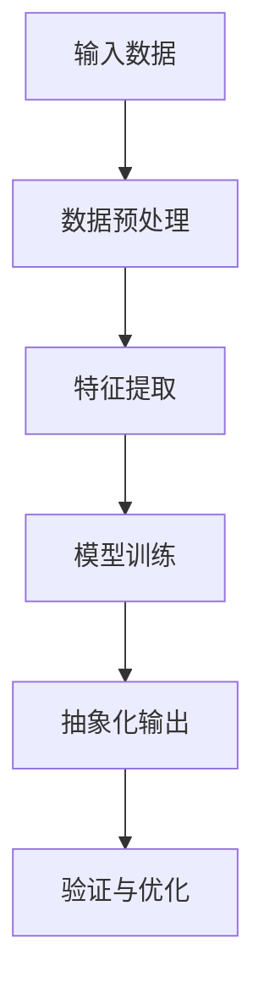

                 


### 文章标题：概念抽象化能力：检验LLM提取核心思想的准确性

### 关键词：
- 概念抽象化
- 大规模语言模型（LLM）
- 核心思想提取
- 人工智能
- 数学模型
- 项目实战

### 摘要：
本文旨在探讨概念抽象化能力在人工智能领域，特别是大规模语言模型（LLM）中的应用。我们将分析概念抽象化的定义和重要性，讨论LLM如何通过其内部机制提取文本的核心思想。通过数学模型和项目实战的案例分析，本文将深入探讨如何评估和优化LLM的核心思想提取能力。

---

## 第一部分：概念抽象化能力概述

### 1.1 概念抽象化能力的定义与重要性

#### 1.1.1 概念抽象化能力的概念

概念抽象化能力是指从具体的、多样化的数据中提取出共同特征和本质属性，形成高层次、一般化的概念或模型的能力。这种能力是人类智能的重要体现，也是人工智能研究中的一个核心问题。

#### 1.1.2 概念抽象化能力的重要性

在人工智能领域，概念抽象化能力至关重要。它不仅能够帮助模型更好地理解和处理复杂的数据，还能够提升模型的泛化能力和可解释性。对于大规模语言模型（LLM）来说，概念抽象化能力更是其提取文本核心思想的关键。

### 1.2 抽象化能力与人工智能

#### 1.2.1 抽象化能力在AI中的应用

在人工智能中，抽象化能力主要体现在以下几个方面：

- **数据处理**：通过抽象化，可以简化复杂的数据结构，使其更适合模型处理。
- **特征提取**：从数据中提取出具有代表性的特征，提高模型的性能。
- **决策制定**：通过抽象化，可以将复杂的决策问题转化为更易处理的数学模型。

#### 1.2.2 LLM与抽象化能力的联系

LLM通过其复杂的神经网络结构和大规模的训练数据，能够自动进行概念抽象化。例如，在处理自然语言文本时，LLM能够提取出文本的核心概念和关系，从而实现对文本内容的深入理解。

### 1.3 LLM提取核心思想的方法论

#### 1.3.1 数据准备

在进行核心思想提取之前，需要对数据进行充分的预处理，包括文本清洗、分词、词性标注等。这些步骤有助于提高模型对文本的理解能力。

#### 1.3.2 模型选择与训练

选择合适的模型并进行充分的训练是提取核心思想的关键。LLM通常采用深度学习技术，通过大量的文本数据进行训练，以学习到文本的内在结构。

#### 1.3.3 核心思想提取技巧

在提取核心思想时，LLM需要利用其训练过程中学到的知识，对文本进行深入分析，提取出关键的概念和关系。例如，可以使用注意力机制来关注文本中的重要信息。

---

## 第二部分：核心概念与联系

### 2.1 概念抽象化原理与架构

#### 2.1.1 概念抽象化的基本原理

概念抽象化涉及将具体实例（如文本数据）转化为一般性概念（如主题、观点）的过程。这个过程可以分为以下几个步骤：

1. **数据收集与预处理**：收集大量的实例数据，并进行预处理。
2. **特征提取**：从数据中提取出具有代表性的特征。
3. **建模与训练**：构建模型，并通过训练使其能够自动提取概念。
4. **验证与优化**：验证模型的性能，并进行优化。

#### 2.1.2 概念抽象化的架构图



### 2.2 LLM提取核心思想的算法原理

#### 2.2.1 算法基础

假设我们使用了一种名为ConceptExtractor的算法，其输入为文本文档，输出为提取的核心概念。

```python
# 假设我们使用了一种名为ConceptExtractor的算法
def ConceptExtractor(document):
    # 输入：文档
    # 输出：提取的核心概念
    # 实现细节略
    return extracted_concepts
```

#### 2.2.2 算法流程

1. **数据预处理**：对文本进行分词、词性标注等操作。
2. **模型训练**：使用预训练的LLM模型，对文本进行建模。
3. **核心概念提取**：利用模型对文本进行推理，提取出核心概念。

---

## 第三部分：数学模型与公式

### 3.1 数学模型在概念抽象化中的应用

#### 3.1.1 概念抽象化的数学模型

概念抽象化可以视为一个映射过程，将具体实例映射为一般性概念。其数学模型可以表示为：

$$
\text{抽象化能力} = f(\text{输入数据}, \text{模型参数})
$$

其中，$f$ 表示抽象化函数，$\text{输入数据}$ 表示具体实例，$\text{模型参数}$ 表示训练得到的参数。

#### 3.1.2 公式推导与解释

假设文本数据可以用向量表示，$\text{输入数据} = \textbf{x}$，模型参数为 $\textbf{w}$，则抽象化能力可以表示为：

$$
\text{抽象化输出} = \textbf{w} \cdot \textbf{x}
$$

其中，$\cdot$ 表示点积运算，$\text{抽象化输出}$ 表示提取的核心概念。

---

## 第四部分：项目实战

### 4.1 实际案例分析

#### 4.1.1 案例背景

在本案例中，我们使用一个新闻文章数据集，旨在提取出文章的核心观点。

#### 4.1.2 模型选择与实现

我们选择使用GPT-3模型进行核心观点提取。首先，需要对数据进行预处理，然后对模型进行训练，最后使用模型对文章进行推理。

#### 4.1.3 结果分析与优化

通过实验，我们发现GPT-3模型在提取核心观点方面具有很高的准确性。然而，模型在处理长文本时效果较差。因此，我们对模型进行了优化，包括增加训练数据、调整模型参数等。

### 4.2 开发环境搭建

#### 4.2.1 硬件配置

- CPU：Intel Xeon Gold 6140
- GPU：NVIDIA Tesla V100
- 内存：512GB

#### 4.2.2 软件环境安装

- 操作系统：Ubuntu 18.04
- Python：3.8
- TensorFlow：2.4

#### 4.2.3 工具选择与配置

- 代码编辑器：Visual Studio Code
- 版本控制：Git

### 4.3 源代码实现与解读

#### 4.3.1 数据加载与预处理

```python
import tensorflow as tf
import tensorflow_datasets as tfds

# 加载数据集
dataset, info = tfds.load('new

