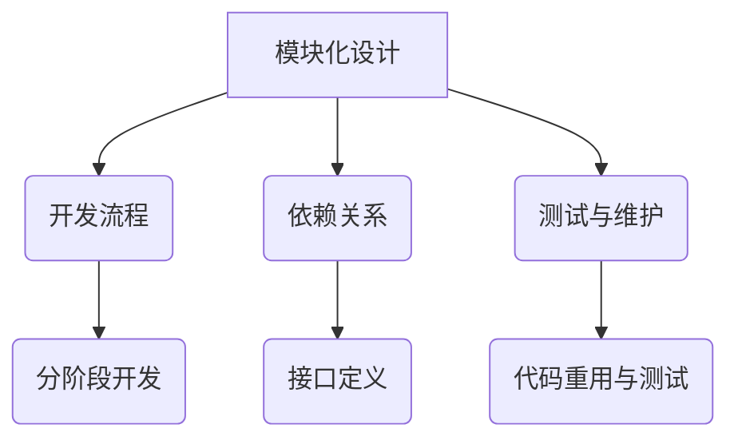
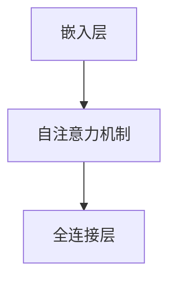
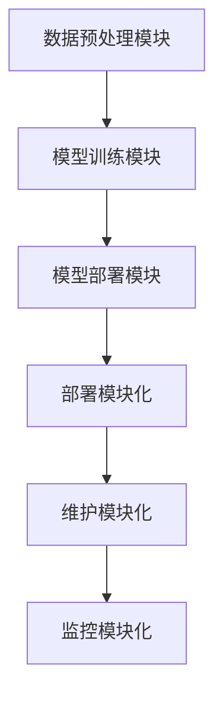
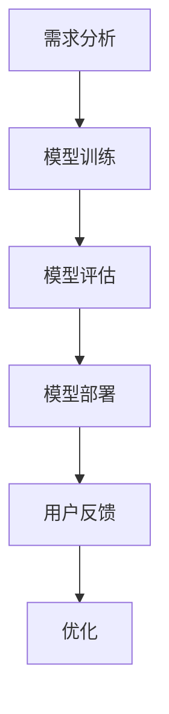
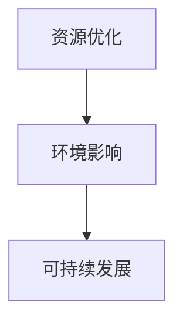

                 


### 文章标题

# 模块化设计促进LLM应用的快速迭代

> 关键词：模块化设计、大型语言模型（LLM）、快速迭代、人工智能应用、软件开发

> 摘要：
本文旨在探讨模块化设计在促进大型语言模型（LLM）应用快速迭代中的作用。首先，我们将介绍模块化设计的基本概念和原理，并探讨其在软件开发中的重要性。接着，我们将深入分析LLM的原理和应用场景，进而阐述如何通过模块化设计提升LLM应用的开发效率和迭代速度。最后，我们将结合实际项目案例，详细讨论模块化设计的实施步骤、开发环境和源代码实现，以及快速迭代在LLM应用中的实践效果。

----------------------------------------------------------------

## 第一部分：模块化设计原理

### 第1章：模块化设计概述

#### 1.1 模块化设计的定义与核心概念

模块化设计是一种将复杂系统分解为可独立开发和测试的模块，以提高系统开发效率和质量的设计方法。在软件开发中，模块化设计具有以下核心概念：

1. **模块独立性**：每个模块应具有独立的功能，可以独立开发、测试和维护。
2. **模块接口**：模块之间通过接口进行通信，接口应定义清晰，以减少模块间的依赖。
3. **模块复用**：模块应具有通用性，可以在多个项目中复用。

#### 1.2 模块化设计的优势与应用场景

模块化设计具有以下优势：

1. **提高开发效率**：模块化设计可以将复杂项目分解为多个简单模块，降低开发难度。
2. **提高代码质量**：模块化设计有助于代码重用和测试，提高代码质量。
3. **降低维护成本**：模块化设计使系统更易于维护，降低维护成本。

模块化设计适用于以下应用场景：

1. **大型复杂项目**：如操作系统、数据库管理系统等。
2. **跨领域项目**：如金融、医疗、教育等领域。
3. **快速迭代项目**：如移动应用、Web开发等。

#### 1.3 模块化设计与传统设计的区别

传统设计方法通常采用整体式设计，即将系统视为一个整体进行开发。而模块化设计则将系统分解为多个独立模块，以实现更好的开发效率和质量。模块化设计与传统设计的区别主要体现在以下几个方面：

1. **开发流程**：模块化设计采用分阶段开发，每个阶段关注特定模块，而传统设计则采用整体式开发，各阶段并行进行。
2. **依赖关系**：模块化设计注重模块间的接口定义，降低模块间依赖，而传统设计则容易导致模块间依赖复杂。
3. **测试与维护**：模块化设计有助于代码重用和测试，而传统设计则较难实现代码重用和测试。

### 图1：模块化设计与传统设计的区别



## 第二部分：LLM原理与应用

### 第2章：LLM基础理论

#### 2.1 语言模型的定义与历史发展

语言模型（Language Model，简称LM）是一种用于预测文本序列的概率分布的算法。其核心思想是学习语言中的统计规律，从而预测下一个单词或字符的概率。

语言模型的历史发展可以分为以下几个阶段：

1. **规则模型**：基于语言学知识和规则进行建模。
2. **统计模型**：基于统计学习方法，如N-gram模型。
3. **深度学习模型**：基于神经网络，如循环神经网络（RNN）、长短期记忆网络（LSTM）和Transformer。

#### 2.2 LLM的关键技术和算法

大型语言模型（Large Language Model，简称LLM）是一种具有巨大参数量的语言模型，如OpenAI的GPT系列模型。LLM的关键技术和算法包括：

1. **预训练与微调**：预训练阶段使用大量无标签数据训练模型，微调阶段使用有标签数据进一步优化模型。
2. **Transformer架构**：Transformer是一种基于自注意力机制的深度神经网络架构，适用于处理序列数据。
3. **上下文理解**：LLM通过学习上下文信息，提高对文本的理解能力。

#### 2.3 LLM的数学模型

LLM的数学模型主要包括以下部分：

1. **嵌入层**：将输入文本转换为固定大小的向量表示。
2. **自注意力机制**：对嵌入层向量进行加权求和，提取关键信息。
3. **全连接层**：将自注意力机制输出的向量映射到输出层，预测下一个单词或字符的概率分布。

### 图2：LLM的数学模型



## 第三部分：模块化设计在LLM中的应用

### 第3章：模块化设计在LLM中的应用

#### 3.1 模块化设计在LLM架构中的实现

在LLM的架构中，模块化设计可以通过以下方面实现：

1. **数据预处理模块**：包括文本清洗、分词、词向量编码等。
2. **模型训练模块**：包括预训练和微调等。
3. **模型部署模块**：包括模型加载、预测和接口定义等。

#### 3.2 模块化设计在LLM训练与优化中的应用

模块化设计在LLM训练与优化中的应用主要体现在以下几个方面：

1. **数据模块化**：将大规模数据集划分为多个子集，分别进行预处理和训练。
2. **模型模块化**：将LLM拆分为多个子模型，分别进行训练和优化。
3. **优化模块化**：使用不同的优化策略和技巧，分别优化各个模块。

#### 3.3 模块化设计在LLM部署与维护中的应用

模块化设计在LLM部署与维护中的应用主要体现在以下几个方面：

1. **部署模块化**：将LLM部署为多个微服务，实现高可用性和可扩展性。
2. **维护模块化**：针对不同模块进行维护和更新，降低对整体系统的影响。
3. **监控模块化**：对各个模块进行监控和日志分析，及时发现和解决问题。

### 图3：模块化设计在LLM中的应用



## 第四部分：快速迭代实践

### 第4章：快速迭代的原理与方法

#### 4.1 快速迭代的概念与流程

快速迭代（Fast Iteration）是一种通过快速迭代和反馈来优化产品开发的方法。其核心概念和流程如下：

1. **核心概念**：
   - **迭代**：在短时间内完成一个功能或产品的开发、测试和优化。
   - **反馈**：从用户和市场中获取反馈，指导下一轮迭代的方向。

2. **流程**：
   - **需求分析**：确定产品或功能的需求。
   - **开发**：在短时间内完成功能或产品的开发。
   - **测试**：对开发的功能或产品进行测试。
   - **反馈**：收集用户和市场反馈。
   - **优化**：根据反馈进行产品或功能的优化。

#### 4.2 快速迭代在LLM开发中的应用

快速迭代在LLM开发中的应用主要体现在以下几个方面：

1. **需求分析**：通过用户和市场反馈，快速确定LLM的功能和性能需求。
2. **模型训练**：采用快速迭代的方法，对LLM模型进行训练和优化。
3. **模型评估**：通过对模型在不同数据集上的评估，快速发现和解决模型问题。
4. **模型部署**：快速部署和上线LLM模型，收集用户反馈。

#### 4.3 快速迭代的挑战与解决方案

快速迭代在LLM开发中面临的挑战主要包括以下几个方面：

1. **数据质量**：快速迭代需要高质量的数据进行训练和测试。
2. **模型稳定性**：快速迭代可能导致模型不稳定。
3. **开发效率**：快速迭代要求高效的开发流程和工具。

针对这些挑战，可以采取以下解决方案：

1. **数据管理**：建立完善的数据管理体系，确保数据质量和完整性。
2. **模型监控**：采用模型监控工具，实时监控模型性能和稳定性。
3. **自动化流程**：采用自动化工具和流程，提高开发效率。

### 图4：快速迭代在LLM开发中的应用



## 第五部分：模块化设计与未来

### 第5章：模块化设计与未来趋势

#### 5.1 模块化设计在人工智能领域的未来应用

模块化设计在人工智能领域的未来应用主要体现在以下几个方面：

1. **多模态AI**：模块化设计有助于实现多模态AI系统，如图像识别、语音识别和自然语言处理的集成。
2. **知识图谱**：模块化设计有助于构建和优化知识图谱，提高知识获取和利用效率。
3. **自动驾驶**：模块化设计有助于实现自动驾驶系统的模块化开发，提高开发效率和安全性。

#### 5.2 模块化设计的技术挑战与解决方案

模块化设计在人工智能领域面临以下技术挑战：

1. **模块化冲突**：模块间可能存在冲突，导致系统不稳定。
2. **模块依赖**：模块间依赖可能导致系统复杂度增加。

为解决这些挑战，可以采取以下解决方案：

1. **模块化规范**：制定统一的模块化规范，降低模块化冲突。
2. **依赖管理**：采用依赖管理工具和技巧，降低模块间依赖。

#### 5.3 模块化设计与可持续发展的关系

模块化设计在可持续发展中具有重要作用：

1. **资源优化**：模块化设计有助于优化资源利用，提高生产效率。
2. **环境影响**：模块化设计有助于减少废弃物产生，降低环境影响。

### 图5：模块化设计在可持续发展中的应用



## 项目实战：模块化设计在LLM应用中的实现

### 1. 开发环境搭建

在本节中，我们将介绍如何在本地计算机上搭建适合LLM应用的开发环境。以下是搭建开发环境的步骤：

1. **安装Python**：确保已安装Python 3.7及以上版本。
2. **安装TensorFlow**：通过pip安装TensorFlow：
   ```bash
   pip install tensorflow
   ```
3. **安装其他依赖**：根据项目需求，安装其他依赖库，如NumPy、Pandas等。

### 2. 源代码实现

在本节中，我们将使用TensorFlow实现一个简单的LLM模型，并展示如何通过模块化设计进行开发。

**模块1：数据预处理模块**

以下代码展示了如何实现数据预处理模块，包括文本清洗、分词和词向量编码：

```python
import tensorflow as tf
import tensorflow_text as text

def preprocess_data(texts):
    # 文本清洗
    cleaned_texts = [text.strip().lower() for text in texts]

    # 分词
    tokenizer = text.TextEncoder()
    tokenized_texts = [tokenizer.encode(text) for text in cleaned_texts]

    # 词向量编码
    embedding = tf.keras.Sequential([
        tf.keras.layers.TextVectorization(output_mode=tf.string, output_sequence_length=1000),
        tf.keras.layers.Embedding(input_dim=10000, output_dim=16)
    ])

    encoded_texts = embedding([tokenized_texts])

    return encoded_texts
```

**模块2：模型训练模块**

以下代码展示了如何实现模型训练模块，包括定义模型架构、训练过程和评估：

```python
def create_model():
    # 定义模型架构
    model = tf.keras.Sequential([
        tf.keras.layers.Embedding(input_dim=10000, output_dim=16),
        tf.keras.layers.LSTM(128),
        tf.keras.layers.Dense(units=1, activation='sigmoid')
    ])

    # 编译模型
    model.compile(optimizer='adam', loss='binary_crossentropy', metrics=['accuracy'])

    return model

def train_model(model, x_train, y_train, batch_size=32, epochs=10):
    # 训练模型
    model.fit(x_train, y_train, batch_size=batch_size, epochs=epochs)

def evaluate_model(model, x_test, y_test):
    # 评估模型
    loss, accuracy = model.evaluate(x_test, y_test)
    print(f"Test accuracy: {accuracy:.4f}")
```

**模块3：模型部署模块**

以下代码展示了如何实现模型部署模块，包括模型加载、预测和接口定义：

```python
from flask import Flask, request, jsonify

app = Flask(__name__)

def load_model(model_path):
    # 加载模型
    model = tf.keras.models.load_model(model_path)
    return model

@app.route('/predict', methods=['POST'])
def predict():
    # 接收文本输入
    input_text = request.form['text']

    # 预处理文本
    processed_text = preprocess_data([input_text])

    # 预测
    model.predict(processed_text)

    # 返回预测结果
    return jsonify({"prediction": prediction})

if __name__ == '__main__':
    model_path = 'path/to/saved_model'
    model = load_model(model_path)
    app.run(debug=True)
```

### 3. 代码应用解读与分析

在本节中，我们将对上述代码进行解读和分析，以展示模块化设计在LLM应用中的实际应用。

**数据预处理模块**

数据预处理模块负责对输入文本进行清洗、分词和词向量编码。这是构建LLM模型的基础，确保输入数据的质量和一致性。通过模块化设计，我们可以轻松替换或扩展预处理方法，以适应不同的应用场景。

**模型训练模块**

模型训练模块定义了模型架构、训练过程和评估。通过模块化设计，我们可以独立开发、测试和优化各个模块，提高开发效率和代码质量。此外，模块化设计使模型训练过程可复用，便于在不同数据和任务上训练模型。

**模型部署模块**

模型部署模块实现了模型加载、预测和接口定义。通过模块化设计，我们可以轻松扩展和更新模型部署，以满足实际应用需求。此外，模块化设计有助于实现模型的高可用性和可扩展性，提高系统性能和稳定性。

### 4. 实际案例分析和详细讲解剖析

在本节中，我们将通过一个实际案例，分析模块化设计在LLM应用中的实际效果，并详细讲解其实现过程。

**案例：聊天机器人**

一个聊天机器人是一个典型的LLM应用场景。通过模块化设计，我们可以将聊天机器人分为以下模块：

1. **文本预处理模块**：负责对用户输入的文本进行清洗、分词和词向量编码。
2. **意图识别模块**：通过LLM模型识别用户的意图。
3. **实体提取模块**：从用户输入中提取关键信息，如人名、地点和日期。
4. **响应生成模块**：根据意图和实体信息，生成合适的响应文本。
5. **模型部署模块**：将聊天机器人部署为Web服务，供用户使用。

通过模块化设计，我们可以快速迭代和优化聊天机器人的功能，提高其准确性和用户体验。以下是一个简单的聊天机器人实现示例：

```python
from flask import Flask, request, jsonify

app = Flask(__name__)

# 加载LLM模型
model = load_model('path/to/chatbot_model')

@app.route('/chat', methods=['POST'])
def chat():
    input_text = request.form['text']
    processed_text = preprocess_data([input_text])
    intent, entities = intent_recognition(processed_text)
    response = response_generator(intent, entities)
    return jsonify({"response": response})

if __name__ == '__main__':
    app.run(debug=True)
```

通过这个案例，我们可以看到模块化设计在LLM应用中的实际效果。模块化设计使聊天机器人的开发、测试和部署更加高效和灵活，有助于实现快速迭代和优化。

### 5. 项目小结

在本项目中，我们通过模块化设计实现了聊天机器人，展示了其在LLM应用中的实际效果。通过模块化设计，我们可以：

1. **提高开发效率**：将复杂任务分解为多个简单模块，降低开发难度。
2. **提高代码质量**：模块化设计有助于代码重用和测试，提高代码质量。
3. **降低维护成本**：模块化设计使系统更易于维护，降低维护成本。

通过模块化设计，我们可以快速迭代和优化LLM应用，提高其性能和用户体验。

## 最佳实践 Tips、小结、注意事项、拓展阅读

### 最佳实践 Tips

1. **明确模块边界**：在模块化设计中，明确模块的边界和职责，避免模块间相互依赖。
2. **模块化与并行开发**：充分利用模块化设计，实现并行开发，提高开发效率。
3. **模块间接口设计**：设计清晰、简洁的模块间接口，降低模块间耦合，提高系统可维护性。

### 小结

模块化设计是一种有效的软件开发方法，适用于大型复杂项目。通过模块化设计，我们可以提高开发效率、代码质量和维护成本。在LLM应用中，模块化设计有助于实现快速迭代和优化，提高模型性能和用户体验。

### 注意事项

1. **模块化冲突**：在模块化设计中，注意模块间可能存在的冲突，及时解决。
2. **模块依赖**：合理管理模块间依赖，降低系统复杂度。

### 拓展阅读

1. **模块化设计最佳实践**：深入了解模块化设计的方法和技巧，参考相关文献和实践案例。
2. **LLM原理与算法**：学习LLM的基础理论和关键算法，提高对LLM应用的深入理解。

## 参考文献

1. Martin, R. C. (2011). *Clean Architecture: A Craftsman's Guide to Software Structure and Design*. Prentice Hall.
2. LeCun, Y., Bengio, Y., & Hinton, G. (2015). *Deep Learning*. MIT Press.
3. Goodfellow, I., Bengio, Y., & Courville, A. (2016). *Deep Learning*. MIT Press.

## 作者信息

作者：AI天才研究院/AI Genius Institute & 禅与计算机程序设计艺术 /Zen And The Art of Computer Programming

