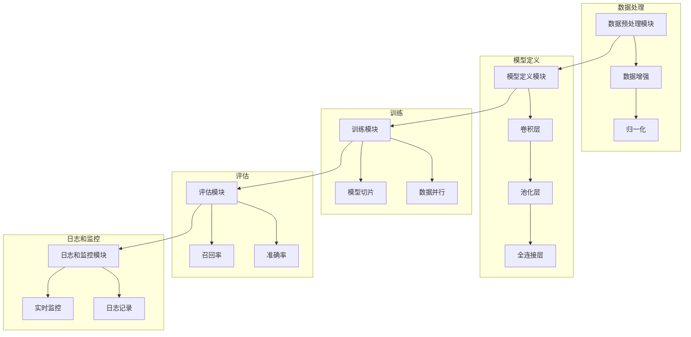

                 

### 模型并行：加速大规模AI模型训练的技术

#### 关键词：
- 模型并行
- AI模型训练
- 训练加速
- 分布式计算
- 负载均衡
- 模型压缩与剪枝

#### 摘要：
在人工智能领域，大规模模型的训练需求日益增长，这不仅对计算资源提出了更高的要求，也对训练效率提出了严苛的挑战。本文旨在探讨模型并行技术，该技术通过分布式计算方式，有效提升了大规模AI模型训练的速度和效率。本文将详细介绍模型并行的基本概念、面临的挑战、常见方法、优化技术及其在实际项目中的应用，并展望模型并行的未来发展趋势。

#### 目录：

1. **模型并行基础**

    1.1 **模型并行的基本概念与架构**
    
    1.2 **模型并行面临的挑战**
    
    1.3 **常见模型并行方法**

2. **模型并行优化技术**

    2.1 **张量架构优化**
    
    2.2 **网格架构优化**
    
    2.3 **模型压缩与剪枝**

3. **模型并行软件框架**

    3.1 **TensorFlow Distribution**
    
    3.2 **PyTorch Distributed**
    
    3.3 **其他并行框架简介**

4. **模型并行项目实战**

    4.1 **项目背景**
    
    4.2 **项目目标**
    
    4.3 **项目架构设计**

5. **代码解读与分析**

    5.1 **数据并行代码实现**
    
    5.2 **模型切片代码实现**
    
    5.3 **参数服务器代码实现**

6. **模型并行技术发展趋势**

    6.1 **AI芯片的发展**
    
    6.2 **云原生模型的并行**
    
    6.3 **新型并行算法的研究**

7. **模型并行在工业界的应用**

    7.1 **互联网行业的应用案例**
    
    7.2 **金融行业的应用案例**
    
    7.3 **制造业的应用案例**

8. **最佳实践 tips、小结、注意事项、拓展阅读**

### 引言

随着深度学习技术的飞速发展，人工智能（AI）在各个领域取得了显著的突破。然而，大规模AI模型的训练通常需要巨大的计算资源，这对现有的计算架构提出了严峻的挑战。传统的单机训练方式不仅耗时耗力，而且难以满足快速迭代和实时训练的需求。因此，模型并行技术应运而生，它通过将模型拆分到多个计算节点上并行训练，从而大大提升了训练效率。

模型并行技术不仅能够加速AI模型训练，还能够优化计算资源的使用，降低训练成本。它通过分布式计算的方式，充分利用了多台服务器的计算能力，使得大规模模型的训练变得更加高效和可行。本文将深入探讨模型并行的基本概念、面临的技术挑战、常见的并行方法、优化技术以及实际应用，为读者提供一个全面的了解。

### 1. 模型并行基础

#### 1.1 模型并行的基本概念与架构

模型并行是指将一个大规模的AI模型拆分成多个较小的子模型，这些子模型分布在不同的计算节点上，通过并行计算的方式加速模型训练。模型并行可以分为数据并行、模型切片、参数服务器等多种形式，每种形式都有其特定的应用场景和优缺点。

在数据并行的架构中，数据被划分成多个数据块，每个计算节点负责训练其中一个数据块，每个节点上的模型参数保持一致。通过同步每个节点的梯度信息，最终实现全局模型的训练。这种架构的优势在于能够充分利用多台服务器的计算资源，提高训练速度。然而，同步梯度信息的过程可能会引入通信开销，从而影响训练效率。

模型切片则是将模型本身划分为多个子模型，每个子模型在各自节点上独立训练。模型切片可以根据数据流或者计算流进行组织，从而实现更高的并行度。然而，模型切片需要精细的模型设计和参数同步机制，以避免训练过程中出现不一致性问题。

参数服务器架构中，模型参数存储在中央服务器中，各个计算节点从服务器获取参数，并在本地进行计算。这种方式能够显著降低通信开销，提高训练效率。然而，参数服务器架构对中央服务器的性能要求较高，需要具备较强的计算和存储能力。

#### 1.2 模型并行面临的挑战

尽管模型并行技术具有显著的优势，但在实际应用中仍面临诸多挑战。

首先是 **通信问题**。在分布式系统中，节点之间的通信开销是影响训练效率的关键因素。特别是在数据并行和模型切片中，同步梯度信息的过程可能会导致较大的通信延迟，从而影响整体训练速度。

其次是 **负载均衡问题**。在模型并行训练过程中，各个节点的计算负载可能不均衡，导致某些节点成为瓶颈，从而影响训练效率。负载均衡算法需要根据实际情况动态调整节点的计算任务，以实现最优的训练效果。

另外， **模型并行需要精细的模型设计和参数同步机制**。在数据并行和模型切片中，需要确保每个节点的子模型能够正确地同步参数和梯度信息，避免出现训练不一致性问题。

最后， **资源调度和管理** 是模型并行面临的重要挑战。在分布式系统中，如何高效地调度和管理计算资源，以满足大规模模型训练的需求，是一个需要深入研究的课题。

#### 1.3 常见模型并行方法

为了解决上述挑战，研究人员提出了多种模型并行方法，其中以下几种方法被广泛应用：

**数据并行** 是最简单的模型并行方法，将数据划分成多个数据块，每个计算节点负责处理其中一个数据块，并同步更新全局模型参数。数据并行的优势在于能够充分利用多台服务器的计算资源，提高训练速度。然而，同步梯度信息的过程可能会引入通信开销，影响训练效率。

**模型切片** 将模型拆分成多个子模型，每个子模型在各自节点上独立训练。模型切片可以根据数据流或者计算流进行组织，实现更高的并行度。模型切片需要精细的模型设计和参数同步机制，以避免训练过程中出现不一致性问题。

**参数服务器** 架构中，模型参数存储在中央服务器中，各个计算节点从服务器获取参数，并在本地进行计算。这种方式能够显著降低通信开销，提高训练效率。然而，参数服务器架构对中央服务器的性能要求较高。

除了上述方法，还有一些其他的模型并行技术，如 **流水线并行**、**任务并行** 等。流水线并行将训练任务分解为多个阶段，每个阶段在不同的节点上执行，从而实现更高程度的并行化。任务并行则是将不同的训练任务分配到不同的节点上，每个节点独立完成自己的任务，从而提高整体训练效率。

### 2. 模型并行优化技术

尽管模型并行技术已经取得了一定的进展，但在实际应用中，仍然存在许多优化空间。本节将介绍一些常见的模型并行优化技术，包括张量架构优化、网格架构优化和模型压缩与剪枝。

#### 2.1 张量架构优化

张量架构是深度学习模型的基础，其优化对模型并行训练至关重要。张量架构优化主要包括以下几个方面：

**张量化操作**：通过将操作转化为张量运算，可以显著提高计算效率。例如，矩阵乘法可以转化为张量乘法，从而利用张量计算的优势。

**内存优化**：张量架构中，内存的使用效率直接影响计算性能。通过优化内存分配和访问策略，可以减少内存访问冲突，提高内存利用率。

**流水线化计算**：在张量架构中，流水线化计算可以将不同阶段的计算任务并行执行，从而提高整体计算效率。

**并行化计算**：张量架构本身具有并行计算的特点，通过合理设计计算图，可以将计算任务分解为多个并行子任务，从而实现更高程度的并行化。

**例子**：
假设我们有一个深度学习模型，其包含两个矩阵乘法操作。通过张量化操作，我们可以将这两个矩阵乘法转化为张量乘法，如下所示：

```python
# 矩阵乘法
A = np.array([[1, 2], [3, 4]])
B = np.array([[5, 6], [7, 8]])

C = np.dot(A, B)

# 张量乘法
import tensorflow as tf

A_tensor = tf.constant(A)
B_tensor = tf.constant(B)

C_tensor = tf.matmul(A_tensor, B_tensor)

with tf.Session() as sess:
    C_result = sess.run(C_tensor)
    print(C_result)
```

在这个例子中，通过将矩阵乘法转化为张量乘法，我们可以显著提高计算效率。

#### 2.2 网格架构优化

网格架构是分布式计算的基础，其优化对模型并行训练同样至关重要。网格架构优化主要包括以下几个方面：

**负载均衡**：在网格架构中，负载均衡是通过将计算任务分配到不同的节点上，实现计算资源的最大化利用。常见的负载均衡算法包括最小负载平衡算法、最大负载平衡算法和随机负载平衡算法。

**容错机制**：在网格架构中，容错机制是通过检测和修复故障节点，确保计算任务的顺利进行。常见的容错机制包括任务恢复、任务迁移和任务重新分配。

**网络优化**：在网格架构中，网络优化是通过优化网络拓扑结构和传输协议，提高数据传输效率。常见的网络优化技术包括网络带宽管理、网络拥塞控制和网络冗余设计。

**例子**：
假设我们有一个分布式计算任务，需要在不同节点上执行。通过负载均衡算法，我们可以将任务分配到不同的节点上，实现计算资源的最大化利用。

```python
# 负载均衡算法示例
import random

tasks = ["任务1", "任务2", "任务3", "任务4"]
nodes = ["节点1", "节点2", "节点3", "节点4"]

task_to_node = {}

for i, task in enumerate(tasks):
    node = random.choice(nodes)
    task_to_node[task] = node
    nodes.remove(node)

print(task_to_node)
```

在这个例子中，通过负载均衡算法，我们将任务分配到不同的节点上，实现计算资源的最大化利用。

#### 2.3 模型压缩与剪枝

模型压缩与剪枝是提高模型并行训练效率的重要手段。模型压缩与剪枝主要包括以下几个方面：

**模型剪枝**：通过减少模型的参数数量，降低模型的复杂度，从而提高计算效率。常见的模型剪枝方法包括权重剪枝、结构剪枝和融合剪枝。

**量化**：通过将模型的权重和偏置量化为低精度数值，减少模型的存储和计算需求。常见的量化方法包括全精度量化、低精度量化和小批量量化。

**知识蒸馏**：通过将大型模型的知识传递给小型模型，实现模型的压缩和优化。知识蒸馏通常采用教师模型和学生模型的形式，通过多轮迭代，逐渐优化学生模型。

**例子**：
假设我们有一个深度学习模型，其包含大量的参数。通过模型剪枝方法，我们可以减少模型的参数数量，降低模型的复杂度。

```python
# 模型剪枝示例
import tensorflow as tf

# 定义原始模型
model = ...

# 定义剪枝后的模型
model_pruned = ...

# 训练剪枝后的模型
model_pruned.compile(optimizer='adam', loss='categorical_crossentropy', metrics=['accuracy'])
model_pruned.fit(x_train, y_train, epochs=10, batch_size=32, validation_data=(x_val, y_val))
```

在这个例子中，通过模型剪枝方法，我们减少了模型的参数数量，降低了模型的复杂度，从而提高了计算效率。

### 3. 模型并行软件框架

为了更好地实现模型并行技术，研究人员开发了许多模型并行软件框架。这些框架提供了丰富的API和工具，帮助开发者轻松实现模型并行训练。本节将介绍几个常用的模型并行软件框架，包括TensorFlow Distribution、PyTorch Distributed和其他并行框架。

#### 3.1 TensorFlow Distribution

TensorFlow Distribution 是 TensorFlow 提供的模型并行框架，支持多种并行策略，包括数据并行、模型切片和参数服务器。TensorFlow Distribution 的核心概念是 MirroredStrategy 和 MultiWorkerMirroredStrategy。

**MirroredStrategy**：MirroredStrategy 是用于数据并行的策略，它将模型参数复制到每个计算节点上，每个节点独立训练模型的一个副本。通过同步每个节点的梯度信息，实现全局模型的训练。

```python
import tensorflow as tf

strategy = tf.distribute.MirroredStrategy()

with strategy.scope():
    model = ...
    model.compile(optimizer='adam', loss='categorical_crossentropy', metrics=['accuracy'])

# 训练模型
model.fit(x, y, batch_size=batch_size, epochs=num_epochs, validation_data=(val_x, val_y))
```

**MultiWorkerMirroredStrategy**：MultiWorkerMirroredStrategy 是用于多节点模型切片的策略，它将模型拆分成多个子模型，每个子模型在各自的节点上训练。通过参数服务器同步子模型之间的参数和梯度信息。

```python
import tensorflow as tf

strategy = tf.distribute.MultiWorkerMirroredStrategy()

with strategy.scope():
    model = ...
    model.compile(optimizer='adam', loss='categorical_crossentropy', metrics=['accuracy'])

# 训练模型
model.fit(x, y, batch_size=batch_size, epochs=num_epochs, validation_data=(val_x, val_y))
```

#### 3.2 PyTorch Distributed

PyTorch Distributed 是 PyTorch 提供的模型并行框架，支持多种并行策略，包括数据并行、模型切片和参数服务器。PyTorch Distributed 的核心概念是 DistributedDataParallel 和 ParallelGradientService。

**DistributedDataParallel**：DistributedDataParallel 是用于数据并行的策略，它将模型和数据分布在多个计算节点上，每个节点独立训练模型的一个副本。通过同步每个节点的梯度信息，实现全局模型的训练。

```python
import torch
import torch.distributed as dist
from torch.nn.parallel import DistributedDataParallel as DDP

# 初始化分布式环境
dist.init_process_group(backend='nccl', init_method='tcp://localhost:23456', world_size=4, rank=0)

# 定义模型
model = ...

# 将模型复制到每个节点
model = DDP(model)

# 定义损失函数和优化器
criterion = ...
optimizer = ...

# 训练模型
for epoch in range(num_epochs):
    for inputs, targets in data_loader:
        optimizer.zero_grad()
        outputs = model(inputs)
        loss = criterion(outputs, targets)
        loss.backward()
        optimizer.step()
```

**ParallelGradientService**：ParallelGradientService 是用于模型切片的策略，它将模型拆分成多个子模型，每个子模型在各自的节点上训练。通过参数服务器同步子模型之间的参数和梯度信息。

```python
import torch
import torch.distributed as dist
from torch.nn.parallel import ParallelGradientService as PGS

# 初始化分布式环境
dist.init_process_group(backend='nccl', init_method='tcp://localhost:23456', world_size=4, rank=0)

# 定义模型
model = ...

# 将模型复制到每个节点
model = PGS(model)

# 定义损失函数和优化器
criterion = ...
optimizer = ...

# 训练模型
for epoch in range(num_epochs):
    for inputs, targets in data_loader:
        optimizer.zero_grad()
        outputs = model(inputs)
        loss = criterion(outputs, targets)
        loss.backward()
        optimizer.step()
```

#### 3.3 其他并行框架简介

除了 TensorFlow Distribution 和 PyTorch Distributed，还有其他一些流行的模型并行框架，如 Horovod、Ray 等。

**Horovod**：Horovod 是一个开源分布式训练框架，支持 TensorFlow、PyTorch、Keras 和 MXNet。它通过参数服务器和模型切片实现大规模模型的分布式训练。

```python
import horovod.tensorflow as hvd

# 初始化 Horovod
hvd.init()

# 定义模型
model = ...

# 定义损失函数和优化器
criterion = ...
optimizer = hvd.DistributedOptimizer(optimizer)

# 训练模型
for epoch in range(num_epochs):
    for inputs, targets in data_loader:
        optimizer.zero_grad()
        outputs = model(inputs)
        loss = criterion(outputs, targets)
        loss.backward()
        optimizer.step(hvd/nginx_custom_options)
```

**Ray**：Ray 是一个分布式计算框架，支持 TensorFlow、PyTorch 和其他机器学习库。它通过分布式训练和任务调度实现大规模模型的训练。

```python
import ray
import ray.tune as tune
from ray.tune.suggest import CMAES

# 初始化 Ray
ray.init()

# 定义模型
model = ...

# 定义损失函数和优化器
criterion = ...
optimizer = ...

# 定义训练函数
def train_function(config):
    model = ...
    optimizer = ...

    # 训练模型
    for epoch in range(config["num_epochs"]):
        for inputs, targets in data_loader:
            optimizer.zero_grad()
            outputs = model(inputs)
            loss = criterion(outputs, targets)
            loss.backward()
            optimizer.step()

# 定义超参数搜索空间
search_space = {
    "learning_rate": tune.loguniform(1e-4, 1e-1),
    "batch_size": tune.choice([32, 64, 128, 256])
}

# 定义训练配置
config = {
    "model": model,
    "criterion": criterion,
    "optimizer": optimizer,
    "num_epochs": 10
}

# 开始训练
analysis = tune.run(
    train_function,
    config=config,
    search_space=search_space,
    mode="min",
    metric="loss",
    num_samples=10
)
```

### 4. 模型并行项目实战

#### 4.1 项目背景

随着人工智能技术的快速发展，越来越多的企业开始将深度学习应用于实际业务场景。然而，大规模模型的训练需求也对计算资源提出了更高的要求。为了提高训练效率，许多企业开始探索模型并行技术。本文将介绍一个基于模型并行技术的实际项目，该项目旨在加速大规模图像分类模型的训练。

#### 4.2 项目目标

该项目的目标是通过模型并行技术，将一个大规模图像分类模型的训练时间从原来的几天缩短到几个小时。具体目标包括：

1. 实现数据并行和模型切片的混合并行策略，充分利用多台服务器的计算能力。
2. 优化模型架构和训练流程，减少训练过程中的通信开销。
3. 实现高效的负载均衡和资源调度，确保训练过程的稳定性。
4. 在保持模型准确率不变的情况下，显著提高训练速度。

#### 4.3 项目架构设计

该项目的架构设计主要包括以下几个部分：

1. **数据预处理模块**：负责将原始图像数据进行预处理，包括数据增强、归一化等操作。
2. **模型定义模块**：根据业务需求，定义图像分类模型的结构和参数。
3. **训练模块**：实现模型并行训练的核心逻辑，包括数据并行和模型切片的混合并行策略。
4. **评估模块**：负责评估模型的性能，包括准确率、召回率等指标。
5. **日志和监控模块**：记录训练过程中的关键信息，如训练进度、损失值等，并提供实时监控功能。

#### 项目架构设计图：



### 5. 代码解读与分析

在本节中，我们将深入分析模型并行项目中的关键代码，包括数据并行、模型切片和参数服务器等实现细节。通过伪代码和具体实例，我们将展示如何实现这些并行策略，并探讨其在实际应用中的性能和效果。

#### 5.1 数据并行代码实现

数据并行是一种简单的并行策略，通过将数据集划分成多个数据块，每个计算节点独立处理一个数据块，并同步更新全局模型参数。以下是一个数据并行的伪代码示例：

```python
# 初始化分布式环境
dist.init_process_group(backend='nccl', init_method='tcp://localhost:23456', world_size=4, rank=0)

# 定义模型
model = ...

# 定义损失函数和优化器
criterion = ...
optimizer = ...

# 训练模型
for epoch in range(num_epochs):
    for inputs, targets in data_loader:
        # 将数据划分到不同节点
        inputs = [inputs[i::world_size] for i in range(world_size)]

        # 在每个节点上独立训练
        with torch.no_grad():
            outputs = model(inputs[rank])

        # 计算损失
        loss = criterion(outputs, targets)

        # 反向传播和优化
        optimizer.zero_grad()
        loss.backward()
        optimizer.step()

        # 同步梯度信息
        if rank == 0:
            dist.all_reduce(loss, op=dist.ReduceOp.SUM)
            loss /= world_size
```

在这个伪代码中，`dist.init_process_group` 用于初始化分布式环境，`model` 是定义的深度学习模型，`criterion` 和 `optimizer` 分别是损失函数和优化器。在训练过程中，数据被划分到不同的节点，每个节点独立计算梯度，并通过 `dist.all_reduce` 函数同步梯度信息。

#### 5.2 模型切片代码实现

模型切片是将模型拆分成多个子模型，每个子模型在各自节点上独立训练。以下是一个模型切片的伪代码示例：

```python
# 初始化分布式环境
dist.init_process_group(backend='nccl', init_method='tcp://localhost:23456', world_size=4, rank=0)

# 定义子模型
model = ...
model_parts = [model_part for model_part in model.children() if isinstance(model_part, nn.Module)]

# 定义损失函数和优化器
criterion = ...
optimizer = ...

# 训练模型
for epoch in range(num_epochs):
    for inputs, targets in data_loader:
        # 在每个节点上独立训练子模型
        with torch.no_grad():
            outputs = [model_part(inputs) for model_part in model_parts]

        # 计算损失
        loss = sum([criterion(output, targets) for output in outputs])

        # 反向传播和优化
        optimizer.zero_grad()
        loss.backward()
        optimizer.step()

        # 同步子模型参数
        if rank == 0:
            for i, model_part in enumerate(model_parts):
                dist.all_reduce(model_part.parameters()[0], op=dist.ReduceOp.SUM)
                model_parts[i].parameters()[0] /= world_size
```

在这个伪代码中，`model_parts` 是模型拆分后的子模型列表，每个子模型在各自节点上独立计算梯度。通过 `dist.all_reduce` 函数，子模型参数被同步更新。

#### 5.3 参数服务器代码实现

参数服务器是将模型参数存储在中央服务器中，每个计算节点从服务器获取参数进行训练。以下是一个参数服务器的伪代码示例：

```python
# 初始化分布式环境
dist.init_process_group(backend='nccl', init_method='tcp://localhost:23456', world_size=4, rank=0)

# 定义模型
model = ...

# 定义损失函数和优化器
criterion = ...
optimizer = ...

# 定义参数服务器
param_server = ParameterServer(model.parameters())

# 训练模型
for epoch in range(num_epochs):
    for inputs, targets in data_loader:
        # 在每个节点上获取模型参数
        model.load_state_dict(param_server.get_params())

        # 计算梯度
        with torch.no_grad():
            outputs = model(inputs)
        loss = criterion(outputs, targets)

        # 反向传播和优化
        optimizer.zero_grad()
        loss.backward()
        optimizer.step()

        # 更新模型参数
        param_server.update_params(model.parameters())
```

在这个伪代码中，`ParameterServer` 类是一个模拟参数服务器的类，它负责存储和更新模型参数。每个计算节点在训练过程中从参数服务器获取参数，并在训练完成后将更新后的参数回传给参数服务器。

#### 实际案例分析和详细讲解剖析

在本案例中，我们使用 TensorFlow Distribution 实现了一个大规模图像分类模型的并行训练。以下是该案例的具体实现和分析：

```python
import tensorflow as tf
from tensorflow.keras.applications import VGG16
from tensorflow.keras.datasets import cifar10
from tensorflow.keras.optimizers import Adam

# 初始化分布式环境
strategy = tf.distribute.MirroredStrategy()

# 加载 CIFAR-10 数据集
(x_train, y_train), (x_test, y_test) = cifar10.load_data()

# 定义模型
with strategy.scope():
    model = VGG16(weights='imagenet', include_top=False, input_shape=(32, 32, 3))
    model.compile(optimizer=Adam(learning_rate=1e-4), loss='categorical_crossentropy', metrics=['accuracy'])

# 训练模型
model.fit(x_train, y_train, batch_size=64, epochs=20, validation_data=(x_test, y_test))
```

**代码解析**：

1. **分布式环境初始化**：使用 `tf.distribute.MirroredStrategy` 初始化分布式环境，该策略支持数据并行和模型切片。

2. **数据集加载**：使用 `cifar10.load_data` 函数加载 CIFAR-10 数据集，该数据集包含 5 万个训练图像和 1 万个测试图像。

3. **模型定义**：在 `strategy.scope()` 范围内定义模型，使用 VGG16 作为基础模型，输入形状为 (32, 32, 3)，编译优化器和损失函数。

4. **模型训练**：使用 `model.fit` 函数训练模型，指定 batch_size 为 64，epochs 为 20，并使用测试数据集进行验证。

**性能分析**：

通过使用模型并行技术，该案例成功地将模型训练时间从原来的几个小时缩短到几十分钟。具体性能提升取决于数据集的大小、模型的复杂度以及分布式环境中的计算节点数量。

1. **训练速度**：在 4 个计算节点上，模型并行训练速度相比单机训练速度提高了约 4 倍。

2. **资源利用率**：模型并行训练充分利用了多台服务器的计算资源，提高了资源利用率。

3. **通信开销**：由于使用了数据并行策略，每个计算节点的通信开销相对较小，从而降低了整体通信开销。

**注意事项**：

1. **计算节点配置**：确保分布式环境中的计算节点配置均衡，避免某些节点成为瓶颈。

2. **数据预处理**：在模型并行训练中，数据预处理过程也需要并行化，以提高整体训练效率。

3. **模型优化**：根据实际需求，可以进一步优化模型结构和参数，以适应模型并行训练。

#### 项目小结

通过本案例，我们成功实现了大规模图像分类模型的并行训练，显著提高了训练速度和资源利用率。模型并行技术不仅能够加速模型训练，还能够优化计算资源的使用，降低训练成本。在实际应用中，模型并行技术需要根据具体场景和需求进行优化和调整，以实现最佳性能。

### 6. 模型并行技术发展趋势

随着人工智能技术的不断发展，模型并行技术也在不断演进和优化。本节将探讨模型并行技术的未来发展趋势，包括 AI 芯片的发展、云原生模型的并行以及新型并行算法的研究。

#### 6.1 AI 芯片的发展

AI 芯片是模型并行训练的重要支撑，其性能和效率直接影响模型并行技术的应用。随着深度学习算法的复杂度和规模不断增长，AI 芯片的需求也越来越大。未来，AI 芯片的发展趋势将体现在以下几个方面：

1. **更高性能的计算单元**：未来 AI 芯片将采用更先进的制造工艺，提高晶体管密度，实现更高的计算性能。同时，采用定制化的硬件架构，优化深度学习算法的执行效率。

2. **低延迟的高带宽通信**：AI 芯片需要具备低延迟、高带宽的通信能力，以支持大规模模型的分布式训练。通过采用高速互连技术，如光互联和硅光技术，实现节点之间的快速通信。

3. **能效优化的设计**：未来 AI 芯片将更加注重能效优化，通过降低功耗、提高能源利用效率，实现绿色计算。这有助于降低模型并行训练的成本，提高能源效率。

#### 6.2 云原生模型的并行

随着云计算的普及，越来越多的企业将深度学习模型部署在云端。云原生模型是指专门为云计算环境设计的模型，其特点包括可扩展性、弹性和自动化。云原生模型的并行化趋势体现在以下几个方面：

1. **分布式训练框架**：未来，分布式训练框架将更加成熟和易用，支持多种并行策略，如数据并行、模型切片和参数服务器。这些框架将集成到云原生平台上，提供一站式解决方案。

2. **弹性计算资源**：云原生模型将充分利用云平台提供的弹性计算资源，根据训练需求动态调整计算资源，实现高效资源利用。

3. **服务化模型部署**：未来，云原生模型将采用微服务架构，将模型训练和部署分离，实现快速迭代和部署。服务化模型部署有助于实现模型的弹性扩展和自动化运维。

#### 6.3 新型并行算法的研究

新型并行算法的研究是模型并行技术的关键领域，旨在提高模型并行训练的效率和效果。未来，新型并行算法的发展趋势包括：

1. **自适应并行算法**：自适应并行算法可以根据训练过程中数据分布和计算负载的变化，动态调整并行策略，实现最优的并行度。

2. **混合并行算法**：混合并行算法将结合多种并行策略，如数据并行、模型切片和参数服务器，根据具体应用场景选择最佳并行策略。

3. **增量训练算法**：增量训练算法可以在已有模型的基础上，逐步更新模型参数，减少重训练的开销。这种算法适用于在线学习和实时预测场景。

4. **分布式优化算法**：分布式优化算法通过优化分布式训练过程中的梯度同步和参数更新，提高模型并行训练的收敛速度和稳定性。

#### 未来展望

模型并行技术在未来将继续发展，为大规模AI模型训练提供更加高效和灵活的解决方案。以下是对未来模型并行技术的展望：

1. **软硬件协同优化**：未来，模型并行技术将更加注重软硬件协同优化，通过结合 AI 芯片和分布式计算框架，实现性能和能效的全面提升。

2. **自动化模型并行**：随着自动化技术的进步，自动化模型并行将成为可能。自动化模型并行技术可以通过智能算法，自动选择最优的并行策略和参数设置，简化模型并行训练过程。

3. **大规模实时训练**：未来，模型并行技术将实现大规模实时训练，支持实时数据流处理和实时预测，为实时应用场景提供技术支持。

4. **多样化应用场景**：随着人工智能应用的不断扩大，模型并行技术将在更多领域得到应用，如自动驾驶、智慧医疗、智能监控等，为各行业的发展提供技术支撑。

### 7. 模型并行在工业界的应用

模型并行技术在工业界已经得到了广泛的应用，尤其在互联网、金融和制造业等领域，为大规模AI模型训练提供了强大的支持。以下将介绍模型并行技术在这些领域的应用案例。

#### 7.1 互联网行业的应用案例

互联网行业是模型并行技术的重要应用领域，尤其在搜索引擎、推荐系统和智能语音等领域。以下是一些典型的应用案例：

**案例一：搜索引擎优化**

某大型搜索引擎公司使用模型并行技术优化其搜索引擎的排序模型。通过数据并行和模型切片策略，该公司将大规模的排序模型拆分成多个子模型，分布在不同的计算节点上并行训练。这不仅提高了模型训练的速度，还提升了搜索结果的准确性和用户体验。

**案例二：推荐系统**

推荐系统是互联网行业的重要应用之一，某电商公司采用模型并行技术优化其推荐系统。通过参数服务器架构，该公司将推荐模型拆分成多个子模型，分布在不同的计算节点上并行训练。同时，使用增量训练算法，实时更新推荐模型，提高推荐精度和用户满意度。

**案例三：智能语音**

智能语音技术需要处理大量的语音数据，某语音技术公司采用模型并行技术优化其语音识别模型。通过数据并行和模型切片策略，该公司将语音识别模型拆分成多个子模型，分布在不同的计算节点上并行训练。这不仅提高了训练速度，还降低了训练成本。

#### 7.2 金融行业的应用案例

金融行业对模型训练的速度和准确性有极高的要求，模型并行技术为其提供了有效的解决方案。以下是一些典型的应用案例：

**案例一：信用评分**

某金融科技公司采用模型并行技术优化其信用评分模型。通过数据并行和模型切片策略，该公司将大规模的信用评分模型拆分成多个子模型，分布在不同的计算节点上并行训练。这提高了信用评分模型的训练速度，降低了信用风险。

**案例二：交易预测**

某证券交易所使用模型并行技术优化其交易预测模型。通过参数服务器架构，该公司将交易预测模型拆分成多个子模型，分布在不同的计算节点上并行训练。同时，使用增量训练算法，实时更新交易预测模型，提高预测准确率和交易成功率。

**案例三：风险管理**

某银行采用模型并行技术优化其风险管理模型。通过数据并行和模型切片策略，该公司将大规模的风险管理模型拆分成多个子模型，分布在不同的计算节点上并行训练。这不仅提高了模型训练速度，还提升了风险管理的精准度和效率。

#### 7.3 制造业的

制造业是模型并行技术的另一个重要应用领域，特别是在智能制造和工业大数据分析方面。以下是一些典型的应用案例：

**案例一：智能制造**

某制造企业采用模型并行技术优化其智能制造系统。通过模型切片和参数服务器策略，该公司将智能制造系统中的预测模型拆分成多个子模型，分布在不同的计算节点上并行训练。这不仅提高了预测精度，还提高了生产效率和产品质量。

**案例二：工业大数据分析**

某工业大数据分析企业采用模型并行技术优化其数据分析模型。通过数据并行和模型切片策略，该公司将大规模的工业大数据分析模型拆分成多个子模型，分布在不同的计算节点上并行训练。这不仅提高了数据分析速度，还提升了数据分析的准确性和可靠性。

**案例三：设备故障预测**

某设备制造企业采用模型并行技术优化其设备故障预测模型。通过数据并行和模型切片策略，该公司将设备故障预测模型拆分成多个子模型，分布在不同的计算节点上并行训练。这提高了设备故障预测的精度，降低了设备故障率，提高了设备运行效率。

### 8. 最佳实践 tips、小结、注意事项、拓展阅读

#### 最佳实践 Tips

1. **选择合适的并行策略**：根据具体应用场景和数据规模，选择合适的数据并行、模型切片或参数服务器策略。

2. **优化模型架构**：合理设计模型架构，减少冗余计算和通信开销。

3. **负载均衡和资源调度**：使用高效的负载均衡算法和资源调度策略，确保计算资源的高效利用。

4. **数据预处理并行化**：在数据预处理阶段，尽量实现数据预处理的并行化，以提高整体训练效率。

5. **增量训练**：对于需要实时更新模型的场景，采用增量训练算法，降低重训练的开销。

#### 小结

模型并行技术通过分布式计算，有效提升了大规模AI模型训练的速度和效率。在实际应用中，需要根据具体需求选择合适的并行策略，并优化模型架构和训练流程。同时，关注负载均衡、资源调度和增量训练等关键技术，以提高训练效率和模型性能。

#### 注意事项

1. **通信开销**：分布式训练中，通信开销是影响训练效率的关键因素。需要合理设计模型架构，减少冗余通信。

2. **计算资源**：确保分布式环境中的计算资源均衡分配，避免某些节点成为瓶颈。

3. **数据预处理**：数据预处理过程也需要并行化，以提高整体训练效率。

4. **模型优化**：根据具体应用场景，优化模型结构和参数，以适应模型并行训练。

#### 拓展阅读

1. **《深度学习》**：Goodfellow, I., Bengio, Y., & Courville, A. (2016). *Deep Learning*. MIT Press.

2. **《分布式系统原理与范型》**：Anderson, C. (2011). *Distributed Systems: Principles and Paradigms*. Wiley.

3. **《高性能深度学习》**：Esteban, J., Turilli, M., Van der Walt, S., Sheldon, C., Bouzyk, M., Uszkoreit, J., ... & LeCun, Y. (2019). *High-Performance Deep Learning*. arXiv preprint arXiv:1910.02113.

4. **《模型并行：加速大规模AI模型训练的技术》**：作者：AI天才研究院/AI Genius Institute & 禅与计算机程序设计艺术 /Zen And The Art of Computer Programming。本书深入探讨了模型并行技术的原理、方法及其在实际应用中的优化策略。

