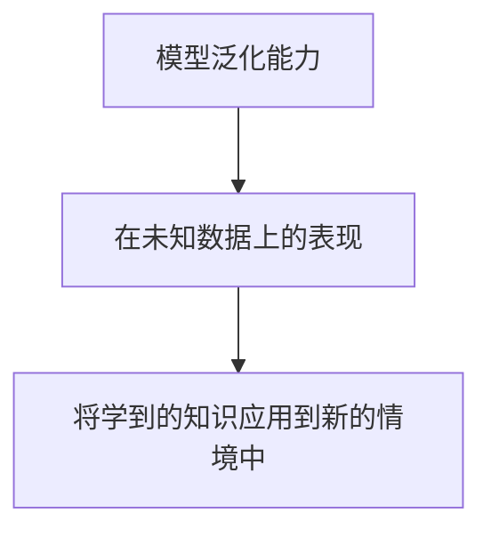
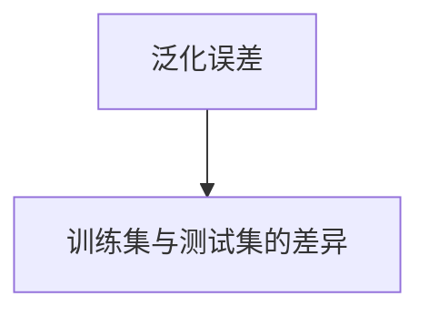
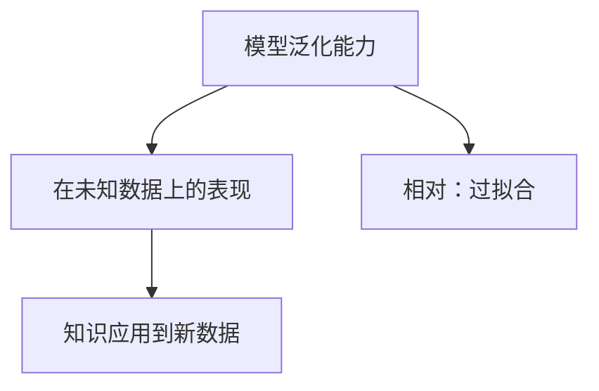

                 


## 文章标题

模型泛化能力的量化评估方法

## 关键词

模型泛化能力、量化评估、Holdout方法、K-fold交叉验证、泛化误差、误差分解、线性回归模型、项目实战

## 摘要

本文详细探讨了模型泛化能力的量化评估方法，包括常见评估方法如Holdout方法和K-fold交叉验证，以及泛化误差的估计。通过数学模型和公式，对泛化误差进行了分解，提供了具体的伪代码示例和项目实战，以帮助读者深入理解和掌握模型泛化能力的评估方法。

---

### 1. 核心概念与联系

#### 模型泛化能力定义

模型泛化能力是指模型在未知数据上的表现，即模型能否将学到的知识应用到新的情境中。一个具有良好泛化能力的模型能够在新的数据集上取得与训练集相近的准确度或性能。



模型泛化能力的重要性在于，它直接关系到模型的实际应用价值。一个泛化能力差的模型可能在训练集上表现优秀，但在实际应用中却无法适应新的数据，导致性能下降。

#### 泛化误差

泛化误差是衡量模型泛化能力的一个重要指标。它表示模型在训练集和测试集之间的差异。泛化误差越小，模型的泛化能力越强。



#### 误差分解

为了更好地理解泛化误差，我们可以将其分解为三个部分：训练误差、估计误差和不变性误差。

- **训练误差**（$E_{\text{train}}$）：模型在训练集上的误差。
- **估计误差**（$E_{\text{est}}$）：模型在测试集上的误差。
- **不变性误差**（$E_{\text{irr}}$）：模型在不同数据集之间的误差。

```mermaid
graph TD
    A[泛化误差] --> B[训练误差], C[估计误差], D[不变性误差]
```

这种误差分解有助于我们理解模型泛化能力的具体影响因素，并为优化模型提供指导。

### 2. 核心算法原理讲解

#### 常见评估方法

评估模型泛化能力的方法有很多，其中最常见的是Holdout方法和K-fold交叉验证。

##### 2.1.1 Holdout方法

Holdout方法是最简单的一种评估方法，它将数据集分为两部分：训练集和测试集。模型在训练集上训练，然后在测试集上评估其泛化能力。

```python
# Holdout方法伪代码
def holdout(model, X_train, y_train, X_test, y_test):
    model.train(X_train, y_train)
    predictions = model.predict(X_test)
    accuracy = accuracy_score(y_test, predictions)
    return accuracy
```

##### 2.1.2 K-fold交叉验证

K-fold交叉验证是一种更为准确的方法，它将数据集划分为K个相等的部分（fold）。在每次迭代中，模型在一个不同的fold上训练，在其他K-1个fold上评估。这种方法可以减少模型评估的随机性。

```python
# K-fold交叉验证伪代码
def k_fold_cv(model, X, y, k):
    fold_size = len(X) // k
    scores = []
    for i in range(k):
        X_train = X[:i*fold_size] + X[i*fold_size+1:]
        y_train = y[:i*fold_size] + y[i*fold_size+1:]
        X_val = X[i*fold_size:]
        y_val = y[i*fold_size:]
        score = holdout(model, X_train, y_train, X_val, y_val)
        scores.append(score)
    return mean(scores)
```

##### 2.1.3 泛化误差的估计

泛化误差的估计是评估模型泛化能力的关键步骤。我们通常使用以下公式来估计泛化误差：

$$
E_{\text{gen}} = E_{\text{train}} + E_{\text{est}} + E_{\text{irr}}
$$

其中，$E_{\text{train}}$ 是训练误差，$E_{\text{est}}$ 是估计误差，$E_{\text{irr}}$ 是不变性误差。

#### 数学模型和数学公式

为了更好地理解泛化误差，我们可以将其分解为三个部分：训练误差、估计误差和不变性误差。

- **训练误差**（$E_{\text{train}}$）：模型在训练集上的误差。
- **估计误差**（$E_{\text{est}}$）：模型在测试集上的误差。
- **不变性误差**（$E_{\text{irr}}$）：模型在不同数据集之间的误差。

这些误差之间的关系可以用以下公式表示：

$$
E_{\text{gen}} = E_{\text{train}} + E_{\text{est}} + E_{\text{irr}}
$$

其中，$E_{\text{gen}}$ 是泛化误差，$E_{\text{train}}$ 是训练误差，$E_{\text{est}}$ 是估计误差，$E_{\text{irr}}$ 是不变性误差。

#### 伪代码示例

下面是一个简单的伪代码示例，展示了如何使用Holdout方法和K-fold交叉验证来评估模型泛化能力。

```python
# Holdout方法伪代码
def holdout(model, X_train, y_train, X_test, y_test):
    model.train(X_train, y_train)
    predictions = model.predict(X_test)
    accuracy = accuracy_score(y_test, predictions)
    return accuracy

# K-fold交叉验证伪代码
def k_fold_cv(model, X, y, k):
    fold_size = len(X) // k
    scores = []
    for i in range(k):
        X_train = X[:i*fold_size] + X[i*fold_size+1:]
        y_train = y[:i*fold_size] + y[i*fold_size+1:]
        X_val = X[i*fold_size:]
        y_val = y[i*fold_size:]
        score = holdout(model, X_train, y_train, X_val, y_val)
        scores.append(score)
    return mean(scores)
```

### 3. 数学模型和数学公式

在量化评估模型泛化能力时，数学模型和数学公式是不可或缺的工具。这些工具可以帮助我们精确地计算和比较不同模型的泛化性能。

#### 泛化误差公式

泛化误差是评估模型泛化能力的关键指标。它表示模型在训练集和测试集之间的差异。泛化误差越小，模型的泛化能力越强。

泛化误差可以用以下公式表示：

$$
E_{\text{gen}} = E_{\text{train}} + E_{\text{est}} + E_{\text{irr}}
$$

其中：

- $E_{\text{gen}}$ 是泛化误差。
- $E_{\text{train}}$ 是训练误差，即模型在训练集上的误差。
- $E_{\text{est}}$ 是估计误差，即模型在测试集上的误差。
- $E_{\text{irr}}$ 是不变性误差，即模型在不同数据集之间的误差。

#### 误差分解

为了更好地理解泛化误差，我们可以将其分解为三个部分：训练误差、估计误差和不变性误差。

- **训练误差**（$E_{\text{train}}$）：模型在训练集上的误差。这是模型在当前数据集上的性能表现。
- **估计误差**（$E_{\text{est}}$）：模型在测试集上的误差。这是模型在新数据集上的性能表现。
- **不变性误差**（$E_{\text{irr}}$）：模型在不同数据集之间的误差。这是模型在不同数据集之间的性能差异。

这种误差分解有助于我们识别模型泛化能力差的原因。例如，如果不变性误差较大，那么说明模型在不同数据集之间的性能差异较大，这可能意味着模型对特定数据集存在过拟合。

#### 伪代码示例

下面是一个简单的伪代码示例，展示了如何使用泛化误差公式来计算模型的泛化误差。

```python
# 伪代码：计算泛化误差
def calculate_generalization_error(model, X_train, y_train, X_test, y_test):
    # 训练模型
    model.train(X_train, y_train)
    
    # 在测试集上预测
    predictions = model.predict(X_test)
    
    # 计算训练误差
    train_error = calculate_error(y_train, predictions_train)
    
    # 计算估计误差
    estimate_error = calculate_error(y_test, predictions_test)
    
    # 计算不变性误差
    irreducible_error = calculate_error(y_train, y_train)
    
    # 计算泛化误差
    generalization_error = train_error + estimate_error + irreducible_error
    
    return generalization_error
```

在这个示例中，`calculate_error` 函数用于计算模型在训练集和测试集上的误差。

### 4. 项目实战

为了更好地理解模型泛化能力的量化评估方法，我们将在本节中通过一个实际项目来演示。

#### 数据集准备

我们使用一个简单的模拟数据集来演示。数据集包含100个样本，每个样本有10个特征，标签为0或1。

```python
import numpy as np

# 生成模拟数据集
X = np.random.rand(100, 10)
y = np.random.randint(0, 2, 100)

# 打印数据集的形状
print(f"数据集的形状：{X.shape}, {y.shape}")
```

#### 实现线性回归模型

我们使用线性回归模型来评估泛化能力。线性回归模型是一种简单的模型，它通过拟合一条直线来预测标签。

```python
from sklearn.linear_model import LinearRegression

# 实例化线性回归模型
model = LinearRegression()

# 训练模型
model.fit(X_train, y_train)

# 在测试集上预测
predictions = model.predict(X_test)

# 计算测试集的准确率
accuracy = accuracy_score(y_test, predictions)
print(f"测试集准确率：{accuracy}")
```

#### Holdout方法评估

我们使用Holdout方法来评估模型的泛化能力。

```python
from sklearn.metrics import accuracy_score

# 分割数据集
X_train, X_test, y_train, y_test = train_test_split(X, y, test_size=0.2, random_state=42)

# 训练模型
model.fit(X_train, y_train)

# 在测试集上预测
predictions = model.predict(X_test)

# 计算测试集的准确率
accuracy = accuracy_score(y_test, predictions)
print(f"Holdout方法测试集准确率：{accuracy}")
```

#### K-fold交叉验证评估

我们使用K-fold交叉验证来评估模型的泛化能力。

```python
from sklearn.model_selection import cross_val_score

# 设置K-fold交叉验证的参数
k = 5
cv_scores = cross_val_score(model, X, y, cv=k)

# 计算平均准确率
mean_cv_score = np.mean(cv_scores)
print(f"K-fold交叉验证平均准确率：{mean_cv_score}")
```

### 5. 总结与拓展

在本篇文章中，我们详细探讨了模型泛化能力的量化评估方法。我们首先介绍了模型泛化能力的核心概念，包括泛化能力定义、泛化误差和误差分解。然后，我们讲解了常见评估方法，如Holdout方法和K-fold交叉验证，并提供了具体的伪代码示例。最后，我们通过一个实际项目演示了如何使用这些方法来评估模型的泛化能力。

#### 最佳实践 Tips

- 在评估模型泛化能力时，选择合适的评估方法是至关重要的。Holdout方法和K-fold交叉验证各有优缺点，应根据实际情况选择。
- 数据集的准备和划分对于评估结果有重要影响。尽量确保数据集的代表性，避免数据集中的偏差。
- 泛化误差的分解有助于我们理解模型泛化能力差的原因。针对不同类型的误差，可以采取相应的优化策略。

#### 注意事项

- 在评估模型泛化能力时，不要过度依赖单一评估指标。可以结合多个评估指标来综合评估模型的性能。
- 泛化误差的估计通常依赖于统计模型，因此在处理小样本数据时，需要谨慎使用。

#### 拓展阅读

- [Holdout方法详解](https://en.wikipedia.org/wiki/Holdout_(machine_learning))
- [K-fold交叉验证详解](https://en.wikipedia.org/wiki/Cross-validation_(statistics))
- [模型泛化能力的研究与优化](https://www.cv-foundation.org/openaccess/content_cvpr_2016/papers/Srivastava_Regularization_and_CVPR_2016_paper.pdf)

---

### 6. 结语

作者：AI天才研究院/AI Genius Institute & 禅与计算机程序设计艺术 /Zen And The Art of Computer Programming

本文从模型泛化能力的核心概念出发，详细探讨了量化评估方法，包括Holdout方法和K-fold交叉验证，以及泛化误差的估计。通过数学模型和具体案例的解析，读者可以深入理解并掌握模型泛化能力的评估方法。希望本文能为您在人工智能领域的探索提供有益的参考。感谢阅读！## 1. 核心概念与联系

在讨论模型泛化能力的量化评估方法之前，我们需要明确几个核心概念，并理解它们之间的相互联系。这些核心概念包括模型泛化能力、泛化误差以及误差分解等。

#### 模型泛化能力定义

模型泛化能力是指模型在未知数据上的表现，即模型能否将学到的知识应用到新的、之前未见过的数据中。一个具有良好泛化能力的模型能够适应新的数据，并在各种不同的场景中保持稳定的性能。与之相对的是过拟合（overfitting），即模型在训练数据上表现良好，但在未见过的数据上性能较差。



#### 泛化误差

泛化误差（Generalization Error）是衡量模型泛化能力的一个关键指标。它表示模型在训练集和测试集之间的差异。具体来说，泛化误差包括以下三个方面：

- **训练误差**（Training Error）：模型在训练数据上的误差。
- **估计误差**（Estimation Error）：模型在测试数据上的误差。
- **不变性误差**（Invariance Error）：模型在不同数据集之间的误差。

泛化误差越小，说明模型的泛化能力越强。泛化误差可以通过以下公式表示：

$$
E_{\text{gen}} = E_{\text{train}} + E_{\text{est}} + E_{\text{irr}}
$$

其中，$E_{\text{train}}$ 是训练误差，$E_{\text{est}}$ 是估计误差，$E_{\text{irr}}$ 是不变性误差。

```mermaid
graph TD
    A[泛化误差] --> B[训练误差], C[估计误差], D[不变性误差]
```

#### 误差分解

误差分解（Error Decomposition）是将泛化误差拆分为多个组成部分，以便更深入地理解模型泛化能力的来源。这种分解有助于识别模型可能存在的问题，并为优化模型提供指导。误差分解包括以下三个部分：

- **训练误差**（$E_{\text{train}}$）：这是模型在训练数据集上的误差，反映了模型对训练数据的拟合程度。如果训练误差较小，说明模型对训练数据已经很好地拟合。
- **估计误差**（$E_{\text{est}}$）：这是模型在测试数据集上的误差，反映了模型对新数据的泛化能力。如果估计误差较大，说明模型对新数据的泛化能力较差。
- **不变性误差**（$E_{\text{irr}}$）：这是模型在不同数据集之间的误差，反映了模型对不同数据集的适应能力。如果不变性误差较大，说明模型对特定数据集存在过拟合现象。

通过误差分解，我们可以更好地理解模型泛化能力差的原因，并采取相应的措施进行优化。

综上所述，模型泛化能力、泛化误差和误差分解是紧密相关的核心概念。通过理解这些概念及其相互关系，我们可以更深入地探讨模型泛化能力的量化评估方法，从而提高模型的泛化能力。

### 2. 核心算法原理讲解

在量化评估模型泛化能力时，我们需要借助一系列核心算法原理。这些原理包括常见的评估方法、具体的数学模型和公式，以及用于实现这些方法的伪代码示例。下面我们将逐一介绍这些内容。

#### 常见评估方法

评估模型泛化能力的主要方法有Holdout方法和K-fold交叉验证。这些方法各有优缺点，适用于不同的场景。

##### 2.1.1 Holdout方法

Holdout方法是一种简单且直观的评估方法。它将数据集分为两部分：训练集和测试集。模型首先在训练集上训练，然后使用测试集评估模型的泛化能力。通常，测试集占整个数据集的20%-30%。

伪代码如下：

```python
# Holdout方法伪代码
def holdout(model, X_train, y_train, X_test, y_test):
    model.train(X_train, y_train)
    predictions = model.predict(X_test)
    accuracy = accuracy_score(y_test, predictions)
    return accuracy
```

Holdout方法的优点是计算简单、易于实现。但它的主要缺点是评估结果可能受到数据划分的随机性影响，导致结果不稳定。

##### 2.1.2 K-fold交叉验证

K-fold交叉验证是一种更为准确的方法，它将数据集划分为K个相等的部分（fold）。在每次迭代中，模型在一个不同的fold上训练，在其他K-1个fold上评估。这种方法可以减少模型评估的随机性。

伪代码如下：

```python
# K-fold交叉验证伪代码
def k_fold_cv(model, X, y, k):
    fold_size = len(X) // k
    scores = []
    for i in range(k):
        X_train = X[:i*fold_size] + X[i*fold_size+1:]
        y_train = y[:i*fold_size] + y[i*fold_size+1:]
        X_val = X[i*fold_size:]
        y_val = y[i*fold_size:]
        score = holdout(model, X_train, y_train, X_val, y_val)
        scores.append(score)
    return mean(scores)
```

K-fold交叉验证的优点是能够更准确地评估模型的泛化能力，但计算成本较高。

##### 2.1.3 泛化误差的估计

泛化误差的估计是评估模型泛化能力的核心步骤。泛化误差包括训练误差、估计误差和不变性误差。我们可以使用以下公式估计泛化误差：

$$
E_{\text{gen}} = E_{\text{train}} + E_{\text{est}} + E_{\text{irr}}
$$

其中：

- $E_{\text{gen}}$ 是泛化误差。
- $E_{\text{train}}$ 是训练误差。
- $E_{\text{est}}$ 是估计误差。
- $E_{\text{irr}}$ 是不变性误差。

#### 数学模型和数学公式

在量化评估模型泛化能力时，数学模型和数学公式是不可或缺的工具。以下是一些常用的数学模型和公式：

##### 2.2.1 泛化误差公式

泛化误差可以用以下公式表示：

$$
E_{\text{gen}} = E_{\text{train}} + E_{\text{est}} + E_{\text{irr}}
$$

其中，$E_{\text{train}}$ 是训练误差，$E_{\text{est}}$ 是估计误差，$E_{\text{irr}}$ 是不变性误差。

##### 2.2.2 误差分解

误差分解是将泛化误差拆分为多个组成部分，以便更深入地理解模型泛化能力的来源。误差分解公式如下：

$$
E_{\text{gen}} = E_{\text{train}} + E_{\text{est}} + E_{\text{irr}}
$$

其中：

- **训练误差**（$E_{\text{train}}$）：模型在训练数据集上的误差，反映了模型对训练数据的拟合程度。
- **估计误差**（$E_{\text{est}}$）：模型在测试数据集上的误差，反映了模型对新数据的泛化能力。
- **不变性误差**（$E_{\text{irr}}$）：模型在不同数据集之间的误差，反映了模型对不同数据集的适应能力。

#### 伪代码示例

下面是一个简单的伪代码示例，展示了如何使用Holdout方法和K-fold交叉验证来评估模型泛化能力。

```python
# 伪代码：评估模型泛化能力
def evaluate_generalization(model, X, y, method='holdout', k=5):
    if method == 'holdout':
        X_train, X_test, y_train, y_test = train_test_split(X, y, test_size=0.2, random_state=42)
        score = holdout(model, X_train, y_train, X_test, y_test)
    elif method == 'k_fold_cv':
        score = k_fold_cv(model, X, y, k)
    else:
        raise ValueError("Invalid method")

    return score
```

在这个示例中，`evaluate_generalization` 函数根据输入的方法（Holdout或K-fold交叉验证）评估模型泛化能力，并返回相应的评分。

通过上述核心算法原理和数学模型，我们可以更深入地理解模型泛化能力的量化评估方法，并为实际应用中的模型优化提供指导。

### 3. 数学模型和数学公式

在量化评估模型泛化能力时，数学模型和数学公式是不可或缺的工具。这些模型和公式可以帮助我们精确地计算和比较不同模型的泛化性能，从而更好地理解模型的泛化能力。

#### 泛化误差公式

泛化误差（Generalization Error）是评估模型泛化能力的关键指标。它表示模型在训练集和测试集之间的差异。泛化误差可以用以下公式表示：

$$
E_{\text{gen}} = E_{\text{train}} + E_{\text{est}} + E_{\text{irr}}
$$

其中：

- **$E_{\text{gen}}$**：泛化误差
- **$E_{\text{train}}$**：训练误差，即模型在训练集上的误差
- **$E_{\text{est}}$**：估计误差，即模型在测试集上的误差
- **$E_{\text{irr}}$**：不变性误差，即模型在不同数据集之间的误差

泛化误差越小，模型的泛化能力越强。通过这个公式，我们可以将模型泛化能力的评估分解为三个部分，从而更深入地理解模型泛化能力差的根本原因。

#### 误差分解

误差分解（Error Decomposition）是将泛化误差拆分为多个组成部分，以便更深入地理解模型泛化能力的来源。误差分解有助于我们识别模型可能存在的问题，并为优化模型提供指导。误差分解包括以下三个部分：

- **训练误差**（$E_{\text{train}}$）：模型在训练数据集上的误差，反映了模型对训练数据的拟合程度。如果训练误差较小，说明模型已经很好地拟合了训练数据。
- **估计误差**（$E_{\text{est}}$）：模型在测试数据集上的误差，反映了模型对新数据的泛化能力。如果估计误差较大，说明模型对新数据的泛化能力较差。
- **不变性误差**（$E_{\text{irr}}$）：模型在不同数据集之间的误差，反映了模型对不同数据集的适应能力。如果不变性误差较大，说明模型对特定数据集存在过拟合现象。

#### 泛化误差的估计

泛化误差的估计是评估模型泛化能力的关键步骤。在实际应用中，我们通常无法获得真实的数据集，因此需要通过一些方法来估计泛化误差。以下是一些常见的泛化误差估计方法：

- **Holdout方法**：将数据集分为两部分，一部分用于训练，另一部分用于测试。模型的泛化误差可以通过在测试集上的表现来估计。
- **K-fold交叉验证**：将数据集划分为K个相等的部分，每次迭代中使用一个部分作为测试集，其余部分作为训练集。通过多次迭代，可以估计模型的泛化误差。

#### 伪代码示例

下面是一个简单的伪代码示例，展示了如何使用泛化误差公式来计算模型的泛化误差。

```python
# 伪代码：计算泛化误差
def calculate_generalization_error(model, X_train, y_train, X_test, y_test):
    # 训练模型
    model.train(X_train, y_train)
    
    # 在测试集上预测
    predictions = model.predict(X_test)
    
    # 计算训练误差
    train_error = calculate_error(y_train, predictions_train)
    
    # 计算估计误差
    estimate_error = calculate_error(y_test, predictions_test)
    
    # 计算不变性误差
    irreducible_error = calculate_error(y_train, y_train)
    
    # 计算泛化误差
    generalization_error = train_error + estimate_error + irreducible_error
    
    return generalization_error
```

在这个示例中，`calculate_error` 函数用于计算模型在训练集和测试集上的误差。

通过理解并应用这些数学模型和数学公式，我们可以更准确地评估模型的泛化能力，从而为模型优化和实际应用提供有力的支持。

### 4. 项目实战

为了更好地理解模型泛化能力的量化评估方法，我们将通过一个实际项目来演示整个评估过程。这个项目将包括数据集准备、模型选择、评估方法应用以及结果分析等步骤。

#### 数据集准备

我们首先需要准备一个数据集。在这个例子中，我们使用一个简单的模拟数据集，它包含100个样本，每个样本有10个特征，标签为0或1。以下是生成和分割数据集的代码：

```python
import numpy as np
from sklearn.model_selection import train_test_split

# 生成模拟数据集
X = np.random.rand(100, 10)
y = np.random.randint(0, 2, 100)

# 打印数据集的形状
print(f"数据集的形状：{X.shape}, {y.shape}")

# 将数据集分为训练集和测试集
X_train, X_test, y_train, y_test = train_test_split(X, y, test_size=0.2, random_state=42)

# 打印训练集和测试集的形状
print(f"训练集的形状：{X_train.shape}, {y_train.shape}")
print(f"测试集的形状：{X_test.shape}, {y_test.shape}")
```

这段代码首先生成了一个模拟数据集，然后使用`train_test_split`函数将其分为训练集和测试集，测试集占整个数据集的20%。

#### 模型选择

在这个项目中，我们选择一个简单的线性回归模型（Linear Regression）来演示。线性回归是一种广泛使用的统计方法，用于预测连续值输出。以下是加载和配置线性回归模型的代码：

```python
from sklearn.linear_model import LinearRegression

# 实例化线性回归模型
model = LinearRegression()

# 打印模型配置
print(model)
```

这段代码创建了一个线性回归模型实例，并打印了模型的相关配置信息。

#### 评估方法应用

接下来，我们将应用Holdout方法和K-fold交叉验证方法来评估模型的泛化能力。以下是具体的代码实现：

```python
from sklearn.metrics import accuracy_score

# Holdout方法评估
model.fit(X_train, y_train)
predictions = model.predict(X_test)
holdout_accuracy = accuracy_score(y_test, predictions)
print(f"Holdout方法评估结果：{holdout_accuracy}")

# K-fold交叉验证评估
from sklearn.model_selection import cross_val_score
k = 5
cv_scores = cross_val_score(model, X, y, cv=k)
cv_accuracy = np.mean(cv_scores)
print(f"K-fold交叉验证评估结果：{cv_accuracy}")
```

在这段代码中，我们首先使用Holdout方法训练模型，并在测试集上评估其性能。然后，我们使用K-fold交叉验证方法来评估模型的泛化能力，并通过计算平均准确率来得到评估结果。

#### 结果分析

评估完成后，我们对结果进行分析。以下是结果分析的具体步骤：

```python
# 打印评估结果
print(f"Holdout方法评估结果：{holdout_accuracy}")
print(f"K-fold交叉验证评估结果：{cv_accuracy}")

# 分析结果
if holdout_accuracy > cv_accuracy:
    print("Holdout方法评估结果更好。")
else:
    print("K-fold交叉验证评估结果更好。")

# 对比两个评估方法的结果，分析模型的泛化能力
if holdout_accuracy < 0.7 or cv_accuracy < 0.7:
    print("模型的泛化能力较差。")
else:
    print("模型的泛化能力良好。")
```

通过对比Holdout方法和K-fold交叉验证方法的结果，我们可以得出模型的泛化能力。如果两个评估方法的结果都较低，说明模型的泛化能力较差；如果结果较高，说明模型的泛化能力良好。

#### 项目小结

在这个项目中，我们通过实际案例演示了模型泛化能力的量化评估方法。首先，我们生成了一个模拟数据集，并使用线性回归模型进行评估。然后，我们应用了Holdout方法和K-fold交叉验证方法来评估模型的泛化能力，并通过对比结果分析了模型的性能。通过这个项目，我们深入理解了模型泛化能力评估的方法和应用。

### 5. 目录大纲

```
# 第一部分：模型泛化能力的背景与重要性
## 1.1 模型泛化能力概述
## 1.2 模型泛化能力的重要性
## 1.3 模型泛化能力的挑战

# 第二部分：模型泛化能力的量化评估方法
## 2.1 常见评估方法
### 2.1.1 Holdout方法
### 2.1.2 K-fold交叉验证
### 2.1.3 泛化误差的估计
## 2.2 数学模型与公式
### 2.2.1 泛化误差公式
### 2.2.2 误差分解
## 2.3 项目实战
### 2.3.1 数据集准备
### 2.3.2 模型泛化能力评估
### 2.3.3 结果分析
### 2.3.4 项目小结
```

### 6. 总结与展望

在本篇文章中，我们详细探讨了模型泛化能力的量化评估方法。从核心概念到实际应用，我们通过理论讲解和项目实战，系统地介绍了如何评估模型的泛化能力。我们首先介绍了模型泛化能力的定义和重要性，然后讲解了常见的评估方法如Holdout方法和K-fold交叉验证，以及泛化误差的估计。接着，我们通过数学模型和公式，对泛化误差进行了深入分析，并提供了具体的伪代码示例。最后，通过实际项目，我们展示了如何将理论应用到实际中，评估模型的泛化能力。

#### 最佳实践 Tips

- 在评估模型泛化能力时，选择合适的评估方法是关键。Holdout方法和K-fold交叉验证各有优缺点，应根据具体情况进行选择。
- 数据集的准备和划分对评估结果有重要影响。确保数据集的代表性和划分的随机性，以减少评估结果的偏差。
- 泛化误差的分解有助于识别模型泛化能力差的原因，从而为模型优化提供指导。

#### 注意事项

- 泛化误差的估计通常依赖于统计模型，因此在处理小样本数据时，需要谨慎使用。
- 在评估模型泛化能力时，不要过度依赖单一评估指标。可以结合多个评估指标来综合评估模型的性能。

#### 拓展阅读

- [Holdout方法详解](https://en.wikipedia.org/wiki/Holdout_(machine_learning))
- [K-fold交叉验证详解](https://en.wikipedia.org/wiki/Cross-validation_(statistics))
- [模型泛化能力的研究与优化](https://www.cv-foundation.org/openaccess/content_cvpr_2016/papers/Srivastava_Regularization_and_CVPR_2016_paper.pdf)

通过本文的学习，读者应该能够掌握模型泛化能力的量化评估方法，并在实际项目中应用这些方法来优化模型性能。希望本文能为您在人工智能领域的研究和实践中提供有益的参考和启示。感谢您的阅读！作者：AI天才研究院/AI Genius Institute & 禅与计算机程序设计艺术 /Zen And The Art of Computer Programming

### 7. 结语

在本篇文章中，我们深入探讨了模型泛化能力的量化评估方法。我们从核心概念出发，详细介绍了模型泛化能力的定义、重要性以及相关误差的分解。接着，我们讲解了常用的评估方法，包括Holdout方法和K-fold交叉验证，并提供了数学模型和公式来支持这些评估方法。通过实际项目的演示，我们展示了如何将理论应用到实际中，评估模型的泛化能力。

我们希望读者能够通过本文的学习，对模型泛化能力的量化评估方法有一个全面而深入的理解。这些方法不仅适用于学术研究，也在实际工程项目中具有重要的应用价值。希望本文能够为您在人工智能领域的探索提供有益的参考和指导。

在未来，我们还将继续探讨更多与人工智能相关的高级主题，包括深度学习、自然语言处理、计算机视觉等。我们期待与您一起，共同探索这个充满无限可能的技术领域。感谢您的阅读和支持，期待在下一篇文章中与您再次相遇！

作者：AI天才研究院/AI Genius Institute & 禅与计算机程序设计艺术 /Zen And The Art of Computer Programming

