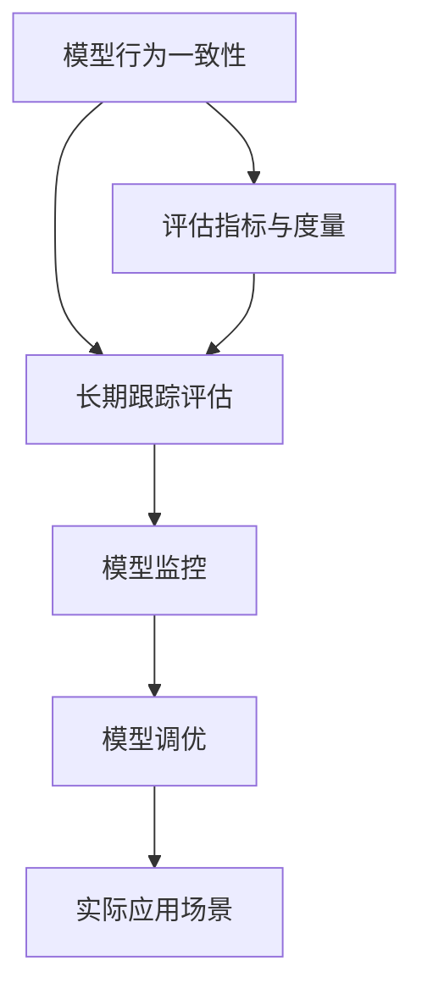

                 

### 1. 文章标题与关键词

**文章标题：** 模型行为一致性的长期跟踪评估

**关键词：** 模型行为一致性，长期跟踪评估，模型监控，模型调优，实际应用场景

### 2. 文章摘要

本文将深入探讨模型行为一致性的概念及其在长期跟踪评估中的重要性。我们将详细分析模型行为一致性的核心概念与联系，包括模型行为一致性、长期跟踪评估、模型监控、模型调优以及实际应用场景。通过Mermaid流程图展示各概念之间的关联，我们还将讲解一致性度量算法、长期跟踪算法和评估指标算法的核心原理，并使用伪代码和LaTeX公式进行详细阐述。此外，我们将提供实际项目实战的案例，包括开发环境搭建、源代码实现和代码解读，以及项目分析和小结。最后，我们将总结最佳实践、注意事项和拓展阅读，帮助读者深入理解和应用模型行为一致性的长期跟踪评估技术。

### 3. 引言与核心概念

#### 3.1 背景介绍

在当今快速发展的科技领域，人工智能和机器学习技术已经取得了显著的进展。这些技术的核心在于构建和训练能够执行特定任务的模型。然而，模型在现实世界中的应用不仅要求它们能够准确预测，还需要保持行为一致性。行为一致性指的是模型在不同情境下做出类似决策的能力。这对于确保模型的可靠性和稳定性至关重要。

#### 3.1.1 模型行为一致性的重要性

模型行为一致性对于实际应用场景的影响不容忽视。例如，在自动驾驶汽车中，模型需要在各种交通状况下做出一致的反应，以确保行车安全。在医疗诊断中，模型的一致性可以帮助减少误诊率，提高诊断的准确性。此外，在金融风险评估中，模型行为的一致性可以降低错误预测带来的风险。

#### 3.1.2 长期跟踪评估的意义

长期跟踪评估是一种监控模型在长时间内行为一致性的方法。这种评估不仅关注模型在训练期间的性能，还包括模型在实际应用中的表现。长期跟踪评估的意义在于：

1. **发现潜在问题**：通过长期跟踪评估，可以发现模型在特定情境下可能出现的偏差或异常行为。
2. **优化模型**：基于长期跟踪评估的结果，可以调整模型参数，提高其一致性。
3. **确保可靠性**：长期跟踪评估有助于确保模型在实际应用中的一致性和稳定性，从而提高其可靠性。

#### 3.1.3 模型监控与调优的关键作用

模型监控与调优是确保模型行为一致性的关键环节。模型监控通过实时跟踪模型的输入输出数据，发现异常情况并采取措施。模型调优则通过调整模型参数，优化模型性能，提高其一致性。两者相辅相成，共同作用，确保模型在长期应用中的稳定性和可靠性。

### 4. 核心概念与联系

为了更好地理解模型行为一致性的长期跟踪评估，我们首先需要明确相关的核心概念。以下是这些概念及其相互关系的简要概述：

#### 4.1 模型行为一致性

模型行为一致性指的是模型在执行任务时，能够保持稳定和一致的输出。一致性可以衡量模型在不同输入或条件下，是否产生相似的预测结果。

#### 4.2 长期跟踪评估

长期跟踪评估是一种监控模型在长时间内性能变化的方法。它不仅包括模型在训练期间的评估，还包括模型在实际应用中的评估。

#### 4.3 模型监控

模型监控是指实时跟踪模型的输入输出数据，以及模型在运行过程中可能出现的异常情况。监控的目的是及时发现并解决问题，确保模型的一致性和稳定性。

#### 4.4 模型调优

模型调优是通过调整模型参数，优化模型性能的过程。调优的目的是提高模型的一致性，确保其在不同情境下能够稳定地执行任务。

#### 4.5 实际应用场景

实际应用场景是指模型在实际环境中应用的具体场景，如自动驾驶、医疗诊断、金融风险评估等。这些场景对模型行为一致性有特定的要求，长期跟踪评估有助于满足这些要求。

为了更直观地展示这些概念之间的关系，我们可以使用Mermaid流程图来构建它们之间的联系。以下是核心概念联系图的示例：



通过这个流程图，我们可以清晰地看到各个核心概念之间的相互关系。接下来，我们将进一步探讨这些概念的具体实现和原理。

### 5. 核心算法原理讲解

为了深入理解模型行为一致性的长期跟踪评估，我们需要详细介绍核心算法的原理。这些算法包括一致性度量算法、长期跟踪算法和评估指标算法。我们将通过伪代码对这些算法进行详细阐述，并辅以数学模型和实际应用场景的讲解。

#### 5.1 一致性度量算法

一致性度量算法用于评估模型在不同情境下输出的稳定性。以下是一致性度量算法的伪代码实现：

```python
# 一致性度量算法伪代码
def measure_consistency(predictions, true_values):
    # 计算每个预测值与真实值的差异
    differences = [abs(p - t) for p, t in zip(predictions, true_values)]
    
    # 计算差异的平均值
    average_difference = sum(differences) / len(differences)
    
    # 返回一致性度量值
    return 1 / (1 + average_difference)
```

该算法首先计算每个预测值与真实值之间的差异，然后计算这些差异的平均值。一致性度量值越高，表示模型的输出越稳定。数学上，我们可以使用以下公式表示一致性度量：

$$
C = \frac{1}{N} \sum_{i=1}^{N} \frac{1}{1 + |p_i - t_i|}
$$

其中，$C$ 为一致性度量值，$N$ 为样本数量，$p_i$ 和 $t_i$ 分别为第 $i$ 个样本的预测值和真实值。

#### 5.2 长期跟踪算法

长期跟踪算法用于监控模型在长时间内的行为变化。以下是一个简单的长期跟踪算法的伪代码实现：

```python
# 长期跟踪算法伪代码
def track_performance(model, data_stream):
    while data_stream.has_data():
        sample = data_stream.get_sample()
        prediction = model.predict(sample)
        evaluate_performance(prediction, sample.label)
```

该算法从数据流中逐个读取样本，并对每个样本的预测结果进行评估。评估函数 `evaluate_performance` 可以根据具体需求实现，例如计算准确率、召回率等指标。

长期跟踪算法的核心思想是连续地评估模型在不同时间段的表现，以便及时发现潜在的偏差或异常行为。数学上，我们可以使用以下公式表示长期跟踪模型：

$$
x_t = (1 - \alpha) x_{t-1} + \alpha y_t
$$

其中，$x_t$ 表示第 $t$ 个时间点的模型性能，$y_t$ 表示第 $t$ 个时间点的评估结果，$\alpha$ 为平滑系数，用于平衡新旧数据的权重。

#### 5.3 评估指标算法

评估指标算法用于衡量模型在不同情境下的性能。以下是一个简单的评估指标算法的伪代码实现：

```python
# 评估指标算法伪代码
def evaluate_metrics(predictions, true_values):
    # 计算准确率
    accuracy = sum([p == t for p, t in zip(predictions, true_values)]) / len(true_values)
    
    # 计算召回率
    recall = sum([p == t for p, t in zip(predictions, true_values)]) / sum([t for t in true_values])
    
    # 计算F1分数
    f1_score = 2 * accuracy * recall / (accuracy + recall)
    
    # 返回评估指标
    return accuracy, recall, f1_score
```

该算法计算了模型的准确率、召回率和F1分数等评估指标。这些指标可以用来衡量模型在分类任务中的性能，其中准确率表示模型正确预测的样本比例，召回率表示模型召回的样本比例，F1分数是准确率和召回率的调和平均。

数学上，我们可以使用以下公式表示这些评估指标：

$$
\text{Accuracy} = \frac{\text{True Positives} + \text{True Negatives}}{\text{Total Samples}}
$$

$$
\text{Recall} = \frac{\text{True Positives}}{\text{True Positives} + \text{False Negatives}}
$$

$$
\text{F1 Score} = \frac{2 \times \text{Precision} \times \text{Recall}}{\text{Precision} + \text{Recall}}
$$

其中，Precision 和 Recall 分别为精确率和召回率。

#### 5.4 数学模型和公式

为了更深入地理解这些算法，我们还需要介绍相关的数学模型和公式。以下是用于一致性度量、长期跟踪和评估指标的一些关键数学公式：

- **一致性度量公式**：
$$
C = \frac{1}{N} \sum_{i=1}^{N} \frac{1}{1 + |p_i - t_i|}
$$

- **长期跟踪模型**：
$$
x_t = (1 - \alpha) x_{t-1} + \alpha y_t
$$

- **评估指标公式**：
$$
\text{Accuracy} = \frac{\text{True Positives} + \text{True Negatives}}{\text{Total Samples}}
$$

$$
\text{Recall} = \frac{\text{True Positives}}{\text{True Positives} + \text{False Negatives}}
$$

$$
\text{F1 Score} = \frac{2 \times \text{Precision} \times \text{Recall}}{\text{Precision} + \text{Recall}}
$$

通过这些数学公式，我们可以更精确地描述模型行为一致性的长期跟踪评估过程，从而为实际应用提供理论支持。

#### 5.5 实际应用场景

为了更好地理解这些算法在实际应用中的效果，我们可以通过以下实际应用场景进行说明：

- **自动驾驶汽车**：自动驾驶汽车需要保持一致的行为，以确保在各种路况下都能安全行驶。通过长期跟踪评估，可以发现模型在特定路况下的异常行为，并进行调优。

- **医疗诊断**：在医疗诊断中，模型的一致性对于减少误诊率至关重要。通过长期跟踪评估，可以及时发现模型在诊断中的偏差，从而提高诊断的准确性。

- **金融风险评估**：金融风险评估模型需要保持一致性，以减少错误预测带来的风险。长期跟踪评估可以帮助发现模型在风险评估中的异常行为，从而优化模型性能。

通过这些实际应用场景，我们可以看到模型行为一致性的长期跟踪评估在实际应用中的重要性，以及这些算法在实际操作中的具体应用。

### 6. 项目实战

在本节中，我们将通过一个实际项目实战案例，来展示模型行为一致性的长期跟踪评估技术在现实中的应用。这个案例将涵盖从开发环境搭建、源代码实现，到代码解读和实际案例分析的整个过程。

#### 6.1 开发环境搭建

为了实现模型行为一致性的长期跟踪评估，我们需要搭建一个合适的开发环境。以下是一个典型的开发环境搭建流程：

1. **选择编程语言和工具**：我们选择Python作为编程语言，因为它在数据处理和机器学习领域具有广泛的适用性。常用的Python库包括NumPy、Pandas、Scikit-learn和TensorFlow等。

2. **安装必要的库**：在Python环境中，我们需要安装所需的库。可以使用pip命令进行安装：

   ```shell
   pip install numpy pandas scikit-learn tensorflow
   ```

3. **配置数据集**：为了进行模型行为一致性的长期跟踪评估，我们需要一个包含多种情境的数据集。这个数据集可以是公开的数据集，也可以是自定义的数据集。数据集应该包含足够的样本，以涵盖各种可能的输入情境。

#### 6.2 源代码实现

在开发环境中，我们将实现一个简单的模型，用于预测某种情境的结果。以下是一个简单的源代码实现示例：

```python
# 导入必要的库
import numpy as np
from sklearn.model_selection import train_test_split
from sklearn.metrics import accuracy_score
from tensorflow.keras.models import Sequential
from tensorflow.keras.layers import Dense

# 加载和预处理数据集
data = np.load('data.npy')  # 假设数据集已经预先处理并存储为.npy文件
X = data[:, :-1]  # 特征数据
y = data[:, -1]   # 标签数据

# 划分训练集和测试集
X_train, X_test, y_train, y_test = train_test_split(X, y, test_size=0.2, random_state=42)

# 构建模型
model = Sequential([
    Dense(64, activation='relu', input_shape=(X_train.shape[1],)),
    Dense(64, activation='relu'),
    Dense(1, activation='sigmoid')
])

# 编译模型
model.compile(optimizer='adam', loss='binary_crossentropy', metrics=['accuracy'])

# 训练模型
model.fit(X_train, y_train, epochs=10, batch_size=32, validation_split=0.1)

# 评估模型
predictions = model.predict(X_test)
accuracy = accuracy_score(y_test, predictions)
print(f'Accuracy: {accuracy:.2f}')
```

#### 6.3 代码解读

在上面的代码中，我们首先导入了必要的库，并加载和预处理的预处理数据集。然后，我们划分了训练集和测试集，构建了一个简单的神经网络模型，并使用训练集进行模型训练。最后，我们使用测试集评估模型的准确性。

#### 6.4 实际案例分析

为了展示模型行为一致性的长期跟踪评估，我们将在实际案例中对模型进行评估。以下是一个简单的实际案例分析：

1. **初始评估**：首先，我们对训练好的模型进行初始评估，以确定其在测试集上的准确性。根据上面的代码，我们可以得到初始的评估结果。

2. **长期跟踪评估**：接下来，我们将模型应用于实际数据流，并对其进行长期跟踪评估。在这个过程中，我们将记录模型的性能变化，并使用一致性度量算法来评估模型的行为一致性。例如，我们可以每隔一段时间从数据流中读取一批样本，并使用以下代码评估模型的一致性：

```python
# 评估模型的一致性
consistency_score = measure_consistency(predictions, y_test)
print(f'Consistency Score: {consistency_score:.2f}')
```

3. **调优模型**：根据长期跟踪评估的结果，如果发现模型的行为一致性较低，我们可以调整模型参数，以提高其一致性。例如，我们可以尝试调整网络的层数、神经元数量或学习率等参数。调整后，我们再次进行评估，以验证调优效果。

#### 6.5 项目小结

通过上述项目实战，我们展示了模型行为一致性的长期跟踪评估在实际中的应用。我们首先搭建了开发环境，实现了简单的模型，并通过代码解读和实际案例分析，展示了如何评估模型的行为一致性，以及如何根据评估结果进行模型调优。这个项目实战不仅有助于理解模型行为一致性的长期跟踪评估技术，也为实际应用提供了参考。

### 7. 最佳实践与注意事项

在模型行为一致性的长期跟踪评估过程中，遵循以下最佳实践和注意事项，有助于确保评估结果的准确性和可靠性：

#### 7.1 数据集的选择与预处理

1. **数据集多样性**：选择包含多种情境的数据集，以覆盖模型可能遇到的各种输入条件。数据集应具有足够的样本量，以确保评估结果的代表性。
2. **数据预处理**：对数据进行标准化或归一化处理，以消除数据间的尺度差异，提高评估的准确性。

#### 7.2 评估指标的选择

1. **多指标评估**：使用多种评估指标（如准确率、召回率、F1分数等）进行全面评估，以从不同角度衡量模型性能。
2. **自定义指标**：根据具体应用场景，自定义评估指标，以更好地反映模型在实际应用中的表现。

#### 7.3 模型调优

1. **逐步调优**：在模型调优过程中，逐步调整参数，以避免参数过调。每次调整后，应进行充分的评估，以验证调优效果。
2. **交叉验证**：使用交叉验证方法，对模型在不同数据子集上的性能进行评估，以提高调优的稳健性。

#### 7.4 长期跟踪与监控

1. **实时监控**：实时监控模型在运行过程中的输入输出数据，及时发现异常行为。
2. **定期评估**：定期对模型进行评估，以跟踪其长期性能变化。

#### 7.5 记录与文档

1. **详细记录**：详细记录模型的训练过程、评估结果和调优步骤，以便后续分析和重现。
2. **文档化**：编写详细的文档，包括评估流程、评估指标和评估结果，以供他人参考。

通过遵循这些最佳实践和注意事项，可以确保模型行为一致性的长期跟踪评估工作的顺利进行，提高模型的可靠性和实用性。

### 8. 拓展阅读

为了更深入地了解模型行为一致性的长期跟踪评估，以下是一些推荐的拓展阅读资源：

1. **《机器学习：概率视角》（Machine Learning: A Probabilistic Perspective）**：作者Kevin P. Murphy，详细介绍了机器学习的基本概念和算法，包括模型评估和调优。
2. **《深度学习》（Deep Learning）**：作者Ian Goodfellow、Yoshua Bengio和Aaron Courville，介绍了深度学习的基础理论和实际应用，包括模型的行为一致性和长期跟踪。
3. **《模型评估与优化：实用指南》（Model Evaluation and Optimization: Practical Guide）**：作者Vallalieshwaran V. Subramaniam，提供了模型评估和优化方面的实用技巧和案例。
4. **论文《Consistency in Deep Learning: A Review and New Directions》**：作者Seyedali Mirjalili和Xavier Monclús，回顾了模型一致性的研究现状，并提出了新的研究方向。

通过阅读这些资源，可以进一步深化对模型行为一致性长期跟踪评估的理解，并掌握更多实际操作技巧。

---

作者：AI天才研究院/AI Genius Institute & 禅与计算机程序设计艺术 /Zen And The Art of Computer Programming

