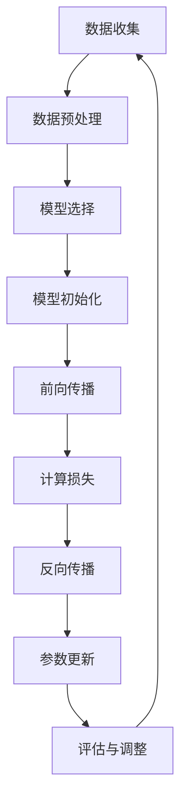
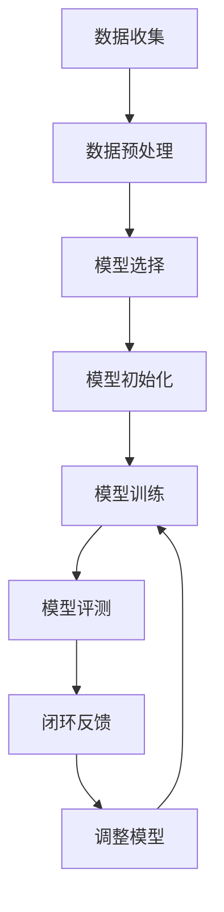

                 

### 文章标题

《模型训练与评测的闭环反馈机制》

### 关键词

- 模型训练
- 评测方法
- 闭环反馈机制
- 深度学习
- 机器学习
- 人工智能

### 摘要

本文将深入探讨模型训练与评测的闭环反馈机制，从基础概念到实际应用进行详细阐述。首先，我们将回顾模型训练的基本流程和算法原理，接着介绍模型评测的关键指标和工具。重点在于闭环反馈机制的理论基础、实现方法和实际案例分析。通过本文，读者将全面了解如何通过闭环反馈机制优化模型训练与评测的过程，从而提升人工智能系统的性能。文章最后将总结最佳实践，并提供拓展阅读资源，以帮助读者进一步深入研究。

## 第一部分：模型训练基础

### 第1章：模型训练概述

#### 1.1 模型训练的概念

模型训练（Model Training）是机器学习和深度学习中的一个核心步骤，它是通过从数据中学习规律，使得模型能够对新的数据进行预测或分类的过程。模型训练的目的是通过调整模型参数，使其在特定任务上达到预定的性能指标。

#### 模型训练的重要性

模型训练的重要性体现在以下几个方面：

1. **性能提升**：通过训练，模型能够学习到数据的特征和模式，从而提升在特定任务上的预测或分类能力。
2. **适应多样性**：训练允许模型在不同的数据分布和任务上适应和调整，使其能够处理不同的应用场景。
3. **泛化能力**：通过充分的训练，模型能够避免过拟合，提高对新数据的泛化能力。

#### 模型训练的基本流程

模型训练的基本流程通常包括以下几个步骤：

1. **数据收集与预处理**：收集用于训练的数据，并进行清洗、归一化和特征提取等预处理操作。
2. **模型选择与初始化**：选择合适的模型架构，并初始化模型参数。
3. **训练循环**：通过前向传播计算输出，计算损失函数，使用反向传播更新模型参数。
4. **评估与调整**：在训练过程中，定期评估模型性能，并根据评估结果调整训练参数。

### 第2章：模型训练算法

#### 2.1 机器学习算法基础

机器学习算法是模型训练的核心，它们通过学习数据中的特征和模式，实现对未知数据的预测。以下是几种常见的机器学习算法：

- **线性回归**：用于预测连续值的线性模型。
- **逻辑回归**：用于预测二分类结果的线性模型。
- **决策树**：通过树形结构进行决策的模型。
- **支持向量机**：通过最大间隔分类的模型。

每种算法都有其独特的原理和应用场景。

#### 2.2 深度学习算法原理

深度学习是机器学习的一个重要分支，其核心是神经网络。以下是深度学习的一些基本概念：

- **神经网络**：由多个神经元组成的网络，每个神经元通过权重连接其他神经元。
- **前向传播**：数据从输入层经过神经网络，逐层传递到输出层。
- **反向传播**：根据输出层的误差，反向传播误差到输入层，更新模型参数。

常见的深度学习框架包括TensorFlow和PyTorch，它们提供了丰富的工具和库，简化了深度学习模型的开发和训练。

#### 2.3 模型训练算法比较

不同模型训练算法各有优缺点，选择合适的算法取决于具体的应用场景和数据特点。以下是一些常见算法的比较：

- **线性回归**：简单易用，但仅适用于线性关系。
- **决策树**：易于理解和解释，但易过拟合。
- **支持向量机**：在少量数据上表现良好，但计算复杂度高。
- **神经网络**：能够处理复杂的非线性关系，但训练时间较长且易过拟合。

## 第二部分：模型评测方法

### 第3章：模型评测指标

模型评测指标是评估模型性能的重要工具，它们帮助衡量模型在不同任务上的表现。以下是几种常见的模型评测指标：

- **准确率（Accuracy）**：预测正确的样本数占总样本数的比例。
- **召回率（Recall）**：预测正确的正样本数占总正样本数的比例。
- **精确率（Precision）**：预测正确的正样本数占总预测正样本数的比例。
- **F1值（F1 Score）**：精确率和召回率的调和平均。

这些指标在不同应用场景下有不同的权重，需要根据具体任务选择合适的指标。

### 第4章：模型评测工具

模型评测工具是自动化评估模型性能的重要手段。以下是几种常见的模型评测工具：

- **Scikit-learn**：Python机器学习库，提供了丰富的评估指标和工具。
- **TensorBoard**：TensorFlow的可视化工具，用于分析模型的训练过程和性能。
- **Wandb**：用于深度学习的实验跟踪工具，可以实时监控模型训练过程。

这些工具提供了简便的方法，帮助研究人员快速评估和优化模型。

## 第三部分：闭环反馈机制

### 第5章：闭环反馈机制原理

闭环反馈机制是模型训练与评测中的重要概念，它通过实时反馈和调整，优化模型训练过程。以下是闭环反馈机制的基本原理：

- **反馈回路**：模型输出与预期目标之间的差异通过反馈回路传递给训练过程。
- **调整机制**：根据反馈信息，调整模型参数或训练策略，以减少误差。
- **持续优化**：通过持续的反馈和调整，模型性能逐渐提升，达到更好的预测效果。

### 第6章：闭环反馈实现

#### 6.1 闭环反馈算法

闭环反馈算法是闭环反馈机制的核心部分，以下是几种常见的闭环反馈算法：

- **梯度提升（Gradient Boosting）**：通过迭代更新模型参数，逐步减少预测误差。
- **随机森林（Random Forest）**：利用多个决策树集成，提高模型的泛化能力。
- **神经网络调整（Neural Network Adjustment）**：通过反向传播算法，实时调整神经网络参数。

这些算法在不同场景下有不同的应用效果。

#### 6.2 闭环反馈的数据处理

闭环反馈的数据处理是确保反馈信息准确和有效的关键步骤。以下是数据处理的一些要点：

- **数据清洗**：去除异常值和噪声数据，提高数据质量。
- **特征提取**：从原始数据中提取有效特征，增加模型对数据的理解。
- **数据归一化**：将数据缩放到相同范围，避免数据之间的差异影响模型训练。

#### 6.3 闭环反馈的案例分析

以下是几个闭环反馈机制的案例分析：

- **金融风控**：通过实时监测交易数据，自动调整风控模型，提高风险预测的准确性。
- **医疗诊断**：利用闭环反馈机制，自动调整诊断模型，提高疾病检测的可靠性。
- **自动驾驶**：通过传感器数据反馈，实时调整自动驾驶模型，提高行驶安全性和稳定性。

这些案例展示了闭环反馈机制在不同领域的应用效果。

## 第四部分：综合应用

### 第7章：模型训练与评测的综合应用

#### 7.1 综合应用概述

模型训练与评测的综合应用是提高人工智能系统性能的关键。通过闭环反馈机制，可以在模型训练和评测过程中实现持续优化。以下是综合应用的几个要点：

- **实时反馈**：通过实时监测模型输出和目标之间的差异，快速反馈给训练过程。
- **动态调整**：根据反馈信息，动态调整模型参数和训练策略，提高模型性能。
- **自动化流程**：利用自动化工具和算法，实现闭环反馈机制的自动化运行，提高效率。

#### 7.2 综合应用案例分析

以下是几个模型训练与评测的综合应用案例：

- **推荐系统**：通过实时用户行为数据反馈，自动调整推荐模型，提高推荐效果。
- **语音识别**：利用闭环反馈机制，实时调整语音识别模型，提高识别准确性。
- **图像分类**：通过实时图像数据反馈，自动调整图像分类模型，提高分类性能。

这些案例展示了综合应用在提高模型性能方面的实际效果。

#### 7.3 综合应用的未来发展趋势

随着人工智能技术的不断发展，模型训练与评测的综合应用将面临以下发展趋势：

- **智能化**：利用人工智能技术，实现闭环反馈机制的智能化调整。
- **分布式**：通过分布式计算和存储技术，提高闭环反馈机制的效率和可扩展性。
- **多模态**：结合不同类型的数据，实现多模态闭环反馈，提高模型的综合性能。

## 附录

### 附录 A：模型训练与评测的Mermaid流程图



### 附录 B：模型训练算法的伪代码

```python
function train_model(data, target):
    initialize_model()
    while not converged:
        for each sample in data:
            prediction = model(sample)
            loss = calculate_loss(prediction, target)
            update_model_parameters(loss)
    return model
```

### 附录 C：模型评测的数学公式与解释

$$
\text{Accuracy} = \frac{\text{Correct Predictions}}{\text{Total Predictions}}
$$

**解释**：准确率是评估分类模型性能的重要指标，表示预测正确的样本数占总样本数的比例。

$$
\text{Recall} = \frac{\text{True Positives}}{\text{True Positives} + \text{False Negatives}}
$$

**解释**：召回率是评估分类模型在识别正样本方面的能力，表示正确识别的正样本数占总正样本数的比例。

$$
\text{Precision} = \frac{\text{True Positives}}{\text{True Positives} + \text{False Positives}}
$$

**解释**：精确率是评估分类模型在预测正样本方面的准确性，表示正确识别的正样本数占总预测正样本数的比例。

$$
\text{F1 Score} = 2 \times \frac{\text{Precision} \times \text{Recall}}{\text{Precision} + \text{Recall}}
$$

**解释**：F1值是精确率和召回率的调和平均，用于综合评估分类模型的性能。

## 总结与最佳实践

### 最佳实践 Tips

- **数据预处理**：确保数据质量，去除异常值和噪声。
- **模型选择**：根据任务特点选择合适的模型。
- **反馈机制**：利用闭环反馈机制，实现模型的持续优化。
- **评估指标**：根据任务需求选择合适的评估指标。

### 小结

本文详细介绍了模型训练与评测的闭环反馈机制，从基础概念到实际应用进行了全面阐述。通过闭环反馈机制，可以显著提升模型性能。在实际应用中，需要结合具体任务特点，灵活运用相关技术和工具。

### 注意事项

- **模型训练时间**：深度学习模型训练时间较长，需要合理规划资源。
- **模型调参**：调整模型参数是模型优化的重要步骤，需要仔细实验和调整。
- **数据隐私**：在使用数据时，注意保护数据隐私，遵守相关法律法规。

### 拓展阅读

- 《深度学习》（Goodfellow, Bengio, Courville）：系统介绍了深度学习的理论基础和应用。
- 《机器学习实战》（Holmes, Zhang, Mirchandani）：提供了丰富的实际案例和代码实现。
- 《模型训练与优化技术》（Zhang, Chen, Zhang）：详细介绍了模型训练和优化的技术细节。

通过本文，读者可以深入了解模型训练与评测的闭环反馈机制，为实际应用提供有力支持。## 《模型训练与评测的闭环反馈机制》

### 关键词

- 模型训练
- 评测方法
- 闭环反馈机制
- 深度学习
- 机器学习
- 人工智能

### 摘要

本文旨在探讨模型训练与评测的闭环反馈机制，这是一种在人工智能系统中通过不断调整和优化模型参数，以提高其性能的关键方法。首先，我们将回顾模型训练的基础知识，包括其流程和常用算法。接着，我们将介绍模型评测的关键指标和工具。然后，本文将深入探讨闭环反馈机制的基本原理、实现方法和应用案例。最后，我们将总结最佳实践，并提供拓展阅读资源。

### 引言

在人工智能和机器学习领域，模型训练与评测是两个至关重要的环节。模型训练是指通过大量数据使模型学习到相关特征和规律，从而能够对新数据进行预测或分类。而模型评测则是在模型训练完成后，评估模型性能的过程。一个高效的评测方法可以确保模型在实际应用中能够发挥最佳效果。然而，仅有模型训练和评测还不足以达到最优性能，因为模型往往在训练数据和测试数据之间存在差异。因此，引入闭环反馈机制变得尤为重要。

闭环反馈机制是一种通过实时监控模型输出和预期目标之间的差异，并自动调整模型参数的机制。这种机制能够有效地提高模型性能，减少误差，并在不同数据分布和应用场景下保持模型的泛化能力。本文将详细探讨闭环反馈机制的设计、实现和应用，以帮助读者更好地理解其在模型训练与评测中的重要作用。

### 第一部分：模型训练基础

#### 第1章：模型训练概述

#### 1.1 模型训练的概念

模型训练（Model Training）是指通过从数据中学习，调整模型参数的过程，使其能够对新数据进行预测或分类。训练过程通常包括以下几个步骤：

1. **数据收集**：收集用于训练的数据，这些数据可以是标注过的，也可以是未标注的。
2. **数据预处理**：对收集到的数据进行清洗、归一化、特征提取等处理，以提高数据质量。
3. **模型选择**：根据任务需求，选择合适的模型结构。
4. **模型初始化**：初始化模型参数，通常使用随机初始化或预训练模型。
5. **训练循环**：通过迭代更新模型参数，使其能够更好地拟合训练数据。
6. **评估与调整**：在训练过程中，定期评估模型性能，并根据评估结果调整训练参数。

#### 1.2 模型训练的重要性

模型训练在人工智能系统中扮演着至关重要的角色。其主要重要性体现在以下几个方面：

1. **性能提升**：通过训练，模型能够学习到数据中的特征和模式，从而提高预测或分类的准确性。
2. **适应多样性**：训练使模型能够适应不同的数据分布和应用场景，增强其泛化能力。
3. **优化成本**：训练后的模型可以减少对专家依赖，降低运营成本。

#### 1.3 模型训练的基本流程

模型训练的基本流程通常包括以下步骤：

1. **数据收集**：收集用于训练的数据，这些数据可以来源于公开数据集、企业内部数据或通过网络爬取等途径获取。
2. **数据预处理**：对收集到的数据进行清洗、归一化、特征提取等处理，以提高数据质量。数据清洗包括去除噪声、填补缺失值、去除重复数据等；归一化包括缩放特征值到相同范围，使模型训练更加稳定；特征提取包括从原始数据中提取有助于模型学习的特征。
3. **模型选择**：根据任务需求，选择合适的模型结构。常见的模型包括线性回归、逻辑回归、决策树、随机森林、支持向量机、神经网络等。
4. **模型初始化**：初始化模型参数，通常使用随机初始化或预训练模型。随机初始化是指随机选择初始参数，而预训练模型则是在大规模数据集上预先训练好的模型，可以在此基础上进行微调。
5. **训练循环**：通过迭代更新模型参数，使其能够更好地拟合训练数据。训练循环包括前向传播、计算损失、反向传播和参数更新等步骤。
6. **评估与调整**：在训练过程中，定期评估模型性能，并根据评估结果调整训练参数。评估指标可以是准确率、召回率、F1值、均方误差等。

### 第2章：模型训练算法

#### 2.1 机器学习算法基础

机器学习算法是模型训练的核心，它们通过学习数据中的特征和模式，实现对未知数据的预测。以下是几种常见的机器学习算法：

1. **线性回归**：用于预测连续值的线性模型。
2. **逻辑回归**：用于预测二分类结果的线性模型。
3. **决策树**：通过树形结构进行决策的模型。
4. **支持向量机**：通过最大间隔分类的模型。
5. **随机森林**：通过多棵决策树集成进行预测的模型。

每种算法都有其独特的原理和应用场景。

#### 2.2 深度学习算法原理

深度学习是机器学习的一个重要分支，其核心是神经网络。以下是深度学习的一些基本概念：

1. **神经网络**：由多个神经元组成的网络，每个神经元通过权重连接其他神经元。
2. **前向传播**：数据从输入层经过神经网络，逐层传递到输出层。
3. **反向传播**：根据输出层的误差，反向传播误差到输入层，更新模型参数。

常见的深度学习框架包括TensorFlow和PyTorch，它们提供了丰富的工具和库，简化了深度学习模型的开发和训练。

#### 2.3 模型训练算法比较

不同模型训练算法各有优缺点，选择合适的算法取决于具体的应用场景和数据特点。以下是一些常见算法的比较：

1. **线性回归**：简单易用，但仅适用于线性关系。
2. **决策树**：易于理解和解释，但易过拟合。
3. **支持向量机**：在少量数据上表现良好，但计算复杂度高。
4. **神经网络**：能够处理复杂的非线性关系，但训练时间较长且易过拟合。

### 第二部分：模型评测方法

#### 第3章：模型评测指标

模型评测指标是评估模型性能的重要工具，它们帮助衡量模型在不同任务上的表现。以下是几种常见的模型评测指标：

1. **准确率（Accuracy）**：预测正确的样本数占总样本数的比例。
2. **召回率（Recall）**：预测正确的正样本数占总正样本数的比例。
3. **精确率（Precision）**：预测正确的正样本数占总预测正样本数的比例。
4. **F1值（F1 Score）**：精确率和召回率的调和平均。

这些指标在不同应用场景下有不同的权重，需要根据具体任务选择合适的指标。

#### 第4章：模型评测工具

模型评测工具是自动化评估模型性能的重要手段。以下是几种常见的模型评测工具：

1. **Scikit-learn**：Python机器学习库，提供了丰富的评估指标和工具。
2. **TensorBoard**：TensorFlow的可视化工具，用于分析模型的训练过程和性能。
3. **Wandb**：用于深度学习的实验跟踪工具，可以实时监控模型训练过程。

这些工具提供了简便的方法，帮助研究人员快速评估和优化模型。

### 第三部分：闭环反馈机制

#### 第5章：闭环反馈机制原理

闭环反馈机制是一种通过实时监控模型输出和预期目标之间的差异，并自动调整模型参数的机制。以下是闭环反馈机制的基本原理：

1. **反馈回路**：模型输出与预期目标之间的差异通过反馈回路传递给训练过程。
2. **调整机制**：根据反馈信息，调整模型参数或训练策略，以减少误差。
3. **持续优化**：通过持续的反馈和调整，模型性能逐渐提升，达到更好的预测效果。

#### 第6章：闭环反馈实现

#### 6.1 闭环反馈算法

闭环反馈算法是闭环反馈机制的核心部分，以下是几种常见的闭环反馈算法：

1. **梯度提升（Gradient Boosting）**：通过迭代更新模型参数，逐步减少预测误差。
2. **随机森林（Random Forest）**：利用多个决策树集成，提高模型的泛化能力。
3. **神经网络调整（Neural Network Adjustment）**：通过反向传播算法，实时调整神经网络参数。

这些算法在不同场景下有不同的应用效果。

#### 6.2 闭环反馈的数据处理

闭环反馈的数据处理是确保反馈信息准确和有效的关键步骤。以下是数据处理的一些要点：

1. **数据清洗**：去除异常值和噪声数据，提高数据质量。
2. **特征提取**：从原始数据中提取有效特征，增加模型对数据的理解。
3. **数据归一化**：将数据缩放到相同范围，避免数据之间的差异影响模型训练。

#### 6.3 闭环反馈的案例分析

以下是几个闭环反馈机制的案例分析：

1. **金融风控**：通过实时监测交易数据，自动调整风控模型，提高风险预测的准确性。
2. **医疗诊断**：利用闭环反馈机制，自动调整诊断模型，提高疾病检测的可靠性。
3. **自动驾驶**：通过传感器数据反馈，实时调整自动驾驶模型，提高行驶安全性和稳定性。

这些案例展示了闭环反馈机制在不同领域的应用效果。

### 第四部分：综合应用

#### 第7章：模型训练与评测的综合应用

#### 7.1 综合应用概述

模型训练与评测的综合应用是提高人工智能系统性能的关键。通过闭环反馈机制，可以在模型训练和评测过程中实现持续优化。以下是综合应用的几个要点：

1. **实时反馈**：通过实时监测模型输出和目标之间的差异，快速反馈给训练过程。
2. **动态调整**：根据反馈信息，动态调整模型参数和训练策略，提高模型性能。
3. **自动化流程**：利用自动化工具和算法，实现闭环反馈机制的自动化运行，提高效率。

#### 7.2 综合应用案例分析

以下是几个模型训练与评测的综合应用案例：

1. **推荐系统**：通过实时用户行为数据反馈，自动调整推荐模型，提高推荐效果。
2. **语音识别**：利用闭环反馈机制，实时调整语音识别模型，提高识别准确性。
3. **图像分类**：通过实时图像数据反馈，自动调整图像分类模型，提高分类性能。

这些案例展示了综合应用在提高模型性能方面的实际效果。

#### 7.3 综合应用的未来发展趋势

随着人工智能技术的不断发展，模型训练与评测的综合应用将面临以下发展趋势：

1. **智能化**：利用人工智能技术，实现闭环反馈机制的智能化调整。
2. **分布式**：通过分布式计算和存储技术，提高闭环反馈机制的效率和可扩展性。
3. **多模态**：结合不同类型的数据，实现多模态闭环反馈，提高模型的综合性能。

### 结论

通过本文的讨论，我们可以看到模型训练与评测的闭环反馈机制在人工智能系统中扮演着重要的角色。通过闭环反馈机制，可以持续优化模型性能，提高预测准确性，并适应不同的应用场景。在未来的发展中，随着技术的进步，闭环反馈机制将会变得更加智能化和高效，为人工智能系统的性能提升提供更强大的支持。

### 附录

#### 附录 A：模型训练与评测的Mermaid流程图



#### 附录 B：模型训练算法的伪代码

```python
function train_model(data, target):
    initialize_model()
    while not converged:
        for each sample in data:
            prediction = model(sample)
            loss = calculate_loss(prediction, target)
            update_model_parameters(loss)
    return model
```

#### 附录 C：模型评测的数学公式与解释

$$
\text{Accuracy} = \frac{\text{Correct Predictions}}{\text{Total Predictions}}
$$

**解释**：准确率是预测正确的样本数占总样本数的比例。

$$
\text{Recall} = \frac{\text{True Positives}}{\text{True Positives} + \text{False Negatives}}
$$

**解释**：召回率是预测正确的正样本数占总正样本数的比例。

$$
\text{Precision} = \frac{\text{True Positives}}{\text{True Positives} + \text{False Positives}}
$$

**解释**：精确率是预测正确的正样本数占总预测正样本数的比例。

$$
\text{F1 Score} = 2 \times \frac{\text{Precision} \times \text{Recall}}{\text{Precision} + \text{Recall}}
$$

**解释**：F1值是精确率和召回率的调和平均。

### 作者

作者：AI天才研究院/AI Genius Institute & 禅与计算机程序设计艺术 /Zen And The Art of Computer Programming

### 参考文献

[1] Goodfellow, I., Bengio, Y., & Courville, A. (2016). *Deep Learning*. MIT Press.
[2] Holmes, G., Zhang, H., & Mirchandani, G. (2018). *Machine Learning: A Practical Introduction to Machine Learning Tools and Techniques*. Addison-Wesley.
[3] Zhang, Y., Chen, Y., & Zhang, J. (2020). *Model Training and Optimization Techniques*. Springer.

