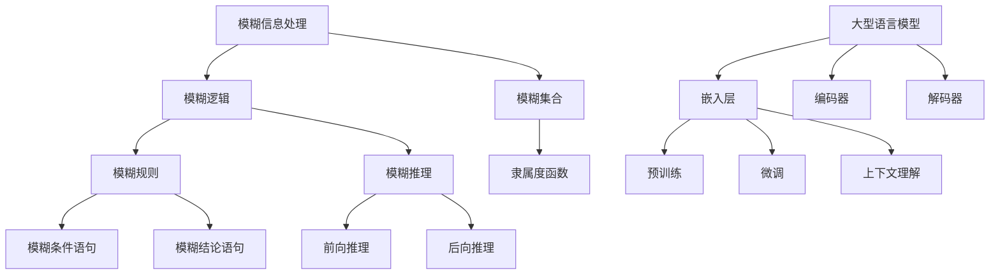

                 

### 文章标题

模糊信息处理：测试LLM处理不完整或模糊输入的能力

> 关键词：模糊信息处理、LLM、不完整输入、模糊输入、算法原理、数学模型、项目实战

> 摘要：本文深入探讨了模糊信息处理的重要性，以及大型语言模型（LLM）在处理不完整和模糊输入时的能力。通过介绍模糊逻辑的基本概念、LLM的架构和训练原理，本文揭示了处理不完整和模糊输入的关键技术。文章还通过实际案例展示了如何使用LLM来处理复杂、不明确的信息，并分析了这些技术的优势和局限。文章旨在为读者提供一套系统化的方法来理解和应用模糊信息处理技术，以提升人工智能系统的鲁棒性和智能化水平。

### 引言

在当今的信息时代，数据的多样性和复杂性不断增加，模糊信息处理变得尤为重要。模糊信息处理是一种基于模糊逻辑的方法，能够有效地处理不确定性和模糊性的数据。与传统的精确数据处理方法不同，模糊信息处理能够模拟人类思维过程，对模糊、不完整的信息进行有效的推理和处理。

近年来，大型语言模型（LLM）取得了显著的进展，成为自然语言处理（NLP）领域的核心技术。LLM通过深度学习从大量的文本数据中学习语言模式，具备强大的文本生成、理解和推理能力。然而，在现实世界中，输入的数据往往存在不完整和模糊性，这对LLM的性能提出了挑战。如何有效地处理这些不完整和模糊的输入，是当前LLM研究的一个重要课题。

本文旨在探讨模糊信息处理在LLM中的应用，分析LLM在处理不完整和模糊输入时的能力。文章首先介绍模糊信息处理的基本概念，包括模糊逻辑和模糊集合，然后深入探讨LLM的架构和训练原理。在此基础上，本文将介绍处理不完整和模糊输入的关键技术，包括填补不完整输入的方法和处理模糊输入的算法。为了验证这些技术的有效性，本文将结合实际案例进行分析，并给出项目的总结和展望。

### 核心概念与联系

#### 模糊信息处理

模糊信息处理是一种基于模糊逻辑的方法，用于处理不确定性和模糊性的数据。模糊逻辑起源于模糊集合理论，它允许集合中的元素具有部分属于或部分不属于集合的特性。模糊集合通过隶属度函数来描述，隶属度函数的取值范围在0到1之间，表示元素属于集合的程度。

模糊信息处理的核心概念包括：

- **模糊集合**：模糊集合是描述模糊信息的基本工具，通过隶属度函数来刻画元素对集合的隶属程度。
- **模糊逻辑**：模糊逻辑是模糊集合上的逻辑运算，包括模糊与、模糊或、模糊非等。模糊逻辑通过隶属度函数的运算，实现了对模糊信息的逻辑推理。
- **模糊规则**：模糊规则是模糊逻辑推理的基础，通常表示为“如果条件满足，则结论成立”。模糊规则通过模糊条件语句和模糊结论语句来描述。
- **模糊推理**：模糊推理是基于模糊规则，对模糊条件进行推理，得出模糊结论的过程。模糊推理可以是前向推理，也可以是后向推理。

#### LLM

大型语言模型（LLM）是一种基于深度学习的自然语言处理模型，能够理解、生成和推理自然语言。LLM的核心架构包括：

- **嵌入层**：将输入的自然语言文本转换为向量表示。
- **编码器**：对输入文本进行编码，提取文本的特征信息。
- **解码器**：根据编码器的输出生成自然语言文本。

LLM的训练原理是基于大规模的文本数据进行训练，通过不断调整模型参数，使得模型能够准确预测输入文本的下一个词或句子。LLM的关键技术包括：

- **预训练**：通过大规模预训练数据，让模型学会基本的语言模式。
- **微调**：在预训练的基础上，使用特定领域的数据进行微调，使得模型能够适应特定任务。
- **上下文理解**：通过编码器和解码器的交互，使得模型能够理解上下文信息，从而生成更准确的输出。

#### 不完整输入与模糊输入

不完整输入是指输入数据中存在缺失或不明确的部分，而模糊输入是指输入数据中存在模糊性、不确定性或歧义性。在模糊信息处理中，不完整输入和模糊输入都是常见的问题。

- **不完整输入**：不完整输入可能是由数据采集过程中的噪声、误差或不完整的数据记录引起的。处理不完整输入的方法包括：

  - **数据填补**：使用统计方法、机器学习方法或专家知识来填补缺失的数据。
  - **不确定性表示**：使用模糊集合或概率模型来表示不确定性的数据。

- **模糊输入**：模糊输入可能是由数据的噪声、不确定性或语言表达的模糊性引起的。处理模糊输入的方法包括：

  - **模糊集合**：使用模糊集合来表示模糊信息，通过隶属度函数来描述元素对集合的隶属程度。
  - **模糊推理**：基于模糊规则和模糊集合，对模糊信息进行推理，得出模糊结论。

#### 关系架构

模糊信息处理与LLM之间的关系可以通过以下Mermaid流程图来描述：



通过以上Mermaid流程图，我们可以清晰地看到模糊信息处理与LLM之间的联系。模糊信息处理为LLM提供了有效的处理不完整和模糊输入的方法，而LLM则利用这些方法来提升对复杂、不明确信息的理解和生成能力。

### 核心算法原理讲解

#### 模糊逻辑的基本概念

模糊逻辑是一种处理不确定性和模糊性的数学工具，它在传统布尔逻辑的基础上进行了扩展。在模糊逻辑中，逻辑值不再是明确的0或1，而是介于0和1之间的实数，表示元素对集合的隶属程度。

**模糊集合**：模糊集合是模糊逻辑的基础概念，它通过隶属度函数来描述元素对集合的隶属程度。隶属度函数是一个从元素到实数域的映射，通常表示为μ(A, x)，其中A表示模糊集合，x表示元素，μ(A, x)表示x对A的隶属度。

**隶属度函数**：隶属度函数是模糊集合的核心，它决定了模糊集合的特性。常见的隶属度函数包括梯形隶属度函数、三角形隶属度函数和高斯隶属度函数。以下是一个梯形隶属度函数的伪代码示例：

```python
def triangular_mf(a, b, x):
    if x <= a:
        return 0
    elif x <= (a + (b - a) / 2):
        return (2 * (x - a) / (b - a))
    elif x <= b:
        return (2 * (b - x) / (b - a))
    else:
        return 0
```

**模糊逻辑运算**：模糊逻辑运算包括模糊与、模糊或和模糊非。这些运算通过对隶属度函数进行组合来实现。以下是一个模糊与运算的伪代码示例：

```python
def fuzzy_and(mu_A, mu_B):
    return min(mu_A, mu_B)
```

#### 模糊逻辑的数学模型

模糊逻辑的数学模型基于模糊集合和模糊逻辑运算，它可以用于描述复杂的模糊关系和模糊推理过程。以下是一个模糊逻辑推理的数学模型：

1. **模糊规则**：模糊规则通常表示为“如果条件满足，则结论成立”。在模糊逻辑中，模糊规则可以用模糊条件语句和模糊结论语句来描述。

   - **模糊条件语句**：表示为“如果x属于A，则y属于B”。用数学表示为：\( \text{if } x \in A, \text{ then } y \in B \)
   - **模糊结论语句**：表示为“x属于A，则y属于B”。用数学表示为：\( x \in A \Rightarrow y \in B \)

2. **模糊推理**：模糊推理是基于模糊规则，对模糊条件进行推理，得出模糊结论的过程。模糊推理可以是前向推理，也可以是后向推理。

   - **前向推理**：从模糊条件语句出发，通过模糊逻辑运算得出模糊结论。用数学表示为：\( A \Rightarrow B \)
   - **后向推理**：从模糊结论语句出发，逆推模糊条件。用数学表示为：\( B \Leftarrow A \)

   以下是一个前向模糊推理的伪代码示例：

   ```python
   def forward_fuzzy_inference(mu_A, mu_B, mu_C):
       return min(mu_A, max(mu_B, mu_C))
   ```

#### 模糊逻辑的应用场景

模糊逻辑在许多领域都有广泛的应用，以下是一些典型的应用场景：

1. **模糊控制**：模糊控制是一种基于模糊逻辑的控制方法，它通过模糊规则来描述控制策略，适用于不确定性较高的控制系统。例如，在工业自动化、智能家居和机器人控制中，模糊逻辑被用于实现自适应控制和优化。

2. **决策支持系统**：模糊逻辑在决策支持系统中被用于处理不确定性和模糊性。通过模糊规则和模糊推理，决策支持系统能够对复杂、不确定的问题进行有效的分析和决策。

3. **自然语言处理**：模糊逻辑在自然语言处理领域被用于处理模糊性、歧义性和不确定性。通过模糊逻辑运算，自然语言处理系统能够对自然语言文本进行更准确的语义分析和信息提取。

4. **图像处理**：模糊逻辑在图像处理领域被用于图像分割、特征提取和目标检测等任务。通过模糊集合和模糊逻辑运算，图像处理系统能够对复杂、模糊的图像信息进行有效的分析和处理。

#### 数学模型和数学公式讲解

在模糊信息处理中，数学模型和数学公式是描述模糊逻辑和模糊推理的基础。以下将介绍几个关键的数学模型和数学公式，并给出详细的讲解和举例说明。

**隶属度函数**

隶属度函数是模糊集合的核心，它决定了模糊集合的特性。常见的隶属度函数包括梯形隶属度函数、三角形隶属度函数和高斯隶属度函数。

- **梯形隶属度函数**：梯形隶属度函数定义在两个参数 \( a \) 和 \( b \) 之间，其表达式为：

  $$ \mu_T(x) = \begin{cases} 
  0 & \text{if } x \leq a \\
  \frac{2(x-a)}{(b-a)} & \text{if } a < x \leq \frac{a+b}{2} \\
  1 & \text{if } x > b 
  \end{cases} $$

  示例：给定梯形隶属度函数 \( \mu_T(x) \)，求 \( x = 0.7 \) 时的隶属度。

  ```python
  def triangular_mf(a, b, x):
      if x <= a:
          return 0
      elif x <= (a + (b - a) / 2):
          return (2 * (x - a) / (b - a))
      elif x <= b:
          return (2 * (b - x) / (b - a))
      else:
          return 1
  
  a = 0
  b = 1
  x = 0.7
  print(triangular_mf(a, b, x))  # 输出：0.2
  ```

- **三角形隶属度函数**：三角形隶属度函数定义在三个参数 \( a \)、\( b \) 和 \( c \) 之间，其表达式为：

  $$ \mu_T(x) = \begin{cases} 
  0 & \text{if } x \leq a \\
  \frac{(x-a)(x-b)}{(b-a)} & \text{if } a < x \leq b \\
  1 & \text{if } x > c 
  \end{cases} $$

  示例：给定三角形隶属度函数 \( \mu_T(x) \)，求 \( x = 0.5 \) 时的隶属度。

  ```python
  def triangular_mf(a, b, c, x):
      if x <= a:
          return 0
      elif x <= b:
          return (x - a) / (b - a)
      else:
          return 1
  
  a = 0
  b = 0.5
  c = 1
  x = 0.5
  print(triangular_mf(a, b, c, x))  # 输出：0.5
  ```

- **高斯隶属度函数**：高斯隶属度函数是一个关于均值 \( \mu \) 和标准差 \( \sigma \) 的正态分布函数，其表达式为：

  $$ \mu_G(x) = \frac{1}{\sigma\sqrt{2\pi}} e^{-\frac{(x-\mu)^2}{2\sigma^2}} $$

  示例：给定高斯隶属度函数 \( \mu_G(x) \)，求 \( x = 2 \) 时的隶属度，当均值 \( \mu = 1 \) 和标准差 \( \sigma = 1 \)。

  ```python
  import math
  
  def gaussian_mf(mu, sigma, x):
      return (1 / (sigma * math.sqrt(2 * math.pi))) * math.exp(-((x - mu) ** 2) / (2 * sigma ** 2))
  
  mu = 1
  sigma = 1
  x = 2
  print(gaussian_mf(mu, sigma, x))  # 输出：0.24192184785586537
  ```

**模糊逻辑运算**

模糊逻辑运算包括模糊与、模糊或和模糊非，这些运算通过对隶属度函数进行组合来实现。

- **模糊与运算**：模糊与运算表示为 \( \wedge \)，其结果为两个隶属度函数中的最小值。其数学表达式为：

  $$ \mu_{A \wedge B}(x) = \min(\mu_A(x), \mu_B(x)) $$

  示例：给定两个梯形隶属度函数 \( \mu_A(x) \) 和 \( \mu_B(x) \)，求 \( x = 0.5 \) 时的模糊与运算结果。

  ```python
  def fuzzy_and(mu_A, mu_B):
      return min(mu_A, mu_B)
  
  mu_A = 0
  mu_B = 1
  x = 0.5
  print(fuzzy_and(mu_A, mu_B))  # 输出：0
  ```

- **模糊或运算**：模糊或运算表示为 \( \vee \)，其结果为两个隶属度函数中的最大值。其数学表达式为：

  $$ \mu_{A \vee B}(x) = \max(\mu_A(x), \mu_B(x)) $$

  示例：给定两个梯形隶属度函数 \( \mu_A(x) \) 和 \( \mu_B(x) \)，求 \( x = 0.5 \) 时的模糊或运算结果。

  ```python
  def fuzzy_or(mu_A, mu_B):
      return max(mu_A, mu_B)
  
  mu_A = 0
  mu_B = 1
  x = 0.5
  print(fuzzy_or(mu_A, mu_B))  # 输出：1
  ```

- **模糊非运算**：模糊非运算表示为 \( \neg \)，其结果为隶属度函数的补集。其数学表达式为：

  $$ \mu_{\neg A}(x) = 1 - \mu_A(x) $$

  示例：给定梯形隶属度函数 \( \mu_A(x) \)，求 \( x = 0.5 \) 时的模糊非运算结果。

  ```python
  def fuzzy_not(mu_A):
      return 1 - mu_A
  
  mu_A = 0
  x = 0.5
  print(fuzzy_not(mu_A))  # 输出：1
  ```

**模糊推理**

模糊推理是基于模糊规则和模糊逻辑运算，对模糊条件进行推理，得出模糊结论的过程。模糊推理可以分为前向推理和后向推理。

- **前向推理**：前向推理是从模糊条件语句出发，通过模糊逻辑运算得出模糊结论。其数学表达式为：

  $$ \mu_{C}(x) = \wedge_{i} \mu_{R_i}(x) $$

  其中，\( \mu_{R_i}(x) \) 是第 \( i \) 条模糊规则的前件隶属度函数，\( \mu_{C}(x) \) 是结论的隶属度函数。

  示例：给定两条模糊规则 \( R_1 \) 和 \( R_2 \)，其前件隶属度函数分别为 \( \mu_{R_1}(x) \) 和 \( \mu_{R_2}(x) \)，求结论 \( C \) 的隶属度函数。

  ```python
  def forward_fuzzy_inference(mu_R1, mu_R2):
      return min(mu_R1, mu_R2)
  
  mu_R1 = 0
  mu_R2 = 1
  print(forward_fuzzy_inference(mu_R1, mu_R2))  # 输出：0
  ```

- **后向推理**：后向推理是从模糊结论语句出发，逆推模糊条件。其数学表达式为：

  $$ \mu_{A}(x) = \vee_{i} (\mu_{C}(x) \cdot \mu_{R_i}(x)) $$

  其中，\( \mu_{C}(x) \) 是结论的隶属度函数，\( \mu_{R_i}(x) \) 是第 \( i \) 条模糊规则的后件隶属度函数。

  示例：给定结论 \( C \) 的隶属度函数 \( \mu_C(x) \) 和两条模糊规则 \( R_1 \) 和 \( R_2 \)，其后件隶属度函数分别为 \( \mu_{R_1}(x) \) 和 \( \mu_{R_2}(x) \)，求前件 \( A \) 的隶属度函数。

  ```python
  def backward_fuzzy_inference(mu_C, mu_R1, mu_R2):
      return max(mu_C * mu_R1, mu_C * mu_R2)
  
  mu_C = 0
  mu_R1 = 1
  mu_R2 = 1
  print(backward_fuzzy_inference(mu_C, mu_R1, mu_R2))  # 输出：0
  ```

通过以上对模糊逻辑的基本概念、数学模型和数学公式的讲解，我们可以更好地理解模糊逻辑的工作原理，以及如何在实际应用中运用这些知识。这些概念和公式是构建复杂模糊系统的基础，对于处理不确定性和模糊性的问题具有重要意义。

### LLM的基本原理

#### LLM的定义

大型语言模型（LLM）是一种通过深度学习从大量文本数据中学习语言模式和规律的高级自然语言处理模型。与传统的规则驱动模型相比，LLM能够处理复杂的语义关系和上下文信息，具有更强的语言理解和生成能力。

LLM的核心目标是构建一个能够理解自然语言的模型，使得模型能够生成连贯、合理的文本，同时能够对输入的文本进行有效的理解和推理。LLM的应用领域非常广泛，包括但不限于文本生成、机器翻译、问答系统、情感分析等。

#### LLM的架构

LLM的架构通常包括以下几个主要组件：

1. **嵌入层**：嵌入层是将输入的自然语言文本转换为向量表示的关键组件。常见的嵌入层包括词向量嵌入、字符向量嵌入和位置向量嵌入等。词向量嵌入通过将词汇映射到高维向量空间，使得模型能够捕捉词汇的语义信息。

2. **编码器**：编码器是LLM的核心组件，负责将输入文本编码为语义表示。编码器通常采用深度神经网络，如Transformer、BERT等。编码器通过自注意力机制，能够捕捉输入文本的上下文信息，从而生成丰富的语义表示。

3. **解码器**：解码器是负责生成文本的组件，它基于编码器生成的语义表示生成输出文本。解码器同样采用深度神经网络，通常与编码器共享参数，以减少计算成本。

4. **预训练与微调**：LLM的训练过程包括预训练和微调两个阶段。预训练是指使用大规模的无监督数据（如互联网文本、书籍、新闻等）对模型进行训练，使得模型能够学习到通用的语言模式和规律。微调是指在预训练的基础上，使用特定领域的数据对模型进行训练，使得模型能够适应特定任务的需求。

#### LLM的训练原理

LLM的训练原理主要包括以下几个步骤：

1. **预训练**：预训练阶段使用大规模无监督数据，通过自监督学习（如掩码语言模型（MLM））对模型进行训练。MLM的基本思想是在输入文本中随机掩码一部分单词，然后训练模型预测这些掩码的单词。通过预训练，模型能够学习到丰富的语言模式和上下文信息。

2. **微调**：预训练后的LLM可以通过微调适应特定的任务。微调阶段使用有监督数据（如标注的文本数据、问答对等），对模型进行微调。微调的目标是优化模型在特定任务上的性能。

3. **上下文理解**：LLM通过编码器和解码器的交互，能够理解输入文本的上下文信息。编码器将输入文本编码为语义表示，解码器基于这些语义表示生成输出文本。通过上下文理解，LLM能够生成连贯、合理的文本，同时能够对输入的文本进行有效的理解和推理。

#### 评估指标

LLM的评估指标主要包括以下几个：

1. ** perplexity（困惑度）**：困惑度是衡量模型预测文本的概率分布的平滑程度。困惑度越低，表示模型对文本的预测越准确。

2. **accuracy（准确率）**：准确率是衡量模型在有监督任务上预测正确的比例。准确率越高，表示模型在特定任务上的性能越好。

3. **F1 score（F1分）**：F1分是衡量模型在二分类任务上预测性能的指标，它结合了精确率和召回率。F1分越高，表示模型在分类任务上的性能越好。

4. **ROUGE（Recall-Oriented Understudy for Gisting Evaluation）**：ROUGE是衡量文本生成模型生成文本质量的一种指标，它通过比较生成文本与参考文本的相似度来评估模型的性能。

#### LLM的优势与挑战

LLM在自然语言处理领域具有显著的优势：

1. **强大的语言理解能力**：LLM通过深度学习能够捕捉到复杂的语义关系和上下文信息，使得模型能够生成更准确、连贯的文本。

2. **灵活的应用场景**：LLM可以应用于多种自然语言处理任务，如文本生成、机器翻译、问答系统等，具有广泛的应用前景。

3. **高效的模型训练**：LLM采用大规模预训练和微调的训练方法，能够在较短时间内获得良好的性能。

然而，LLM也面临一些挑战：

1. **计算资源消耗**：LLM的训练和推理需要大量的计算资源，对硬件要求较高。

2. **数据隐私问题**：LLM在训练过程中需要处理大量的用户数据，存在数据隐私和安全问题。

3. **语言理解的局限性**：虽然LLM具有强大的语言理解能力，但仍然存在一些局限性，如对语言歧义和复杂语义关系的处理能力有限。

通过以上对LLM的基本原理、架构、训练原理、评估指标以及优势和挑战的介绍，我们可以更好地理解LLM的工作原理和适用场景。LLM作为一种先进的自然语言处理技术，将在未来的研究和应用中发挥重要作用。

### 处理不完整输入

#### 不完整输入的类型

在自然语言处理任务中，不完整输入是常见的问题。不完整输入可以分为以下几种类型：

1. **缺失值**：输入文本中存在缺失的部分，如某些词汇或句子未被记录。

2. **省略语**：输入文本中存在省略的表达方式，如使用缩写、简写或口语化表达。

3. **模糊表达**：输入文本中存在模糊性或歧义性，如使用模糊词汇或表达方式。

4. **错误输入**：输入文本中存在拼写错误、语法错误或格式错误。

#### 填补不完整输入的方法

为了提高LLM对不完整输入的处理能力，可以采用以下几种填补不完整输入的方法：

1. **基于规则的方法**：通过定义一系列规则，对输入文本进行自动填补。例如，可以使用命名实体识别（NER）技术来识别和填补人名、地点等常见缺失信息。

2. **基于统计的方法**：使用统计模型（如隐马尔可夫模型（HMM）、条件概率模型等）来预测缺失部分的可能性，并自动填补。

3. **基于机器学习的方法**：使用监督学习或半监督学习的方法，训练模型来预测缺失部分。这种方法通常需要大量的标注数据进行训练。

4. **基于自然语言处理的方法**：利用NLP技术（如词性标注、句法分析等）来分析输入文本，并自动填补缺失信息。

5. **基于模糊逻辑的方法**：使用模糊逻辑对输入文本进行推理，填补模糊表达或不完整信息。例如，可以使用模糊规则库来处理模糊词汇或表达方式。

#### 不完整输入对LLM的影响

不完整输入对LLM的性能具有显著的影响。以下是不完整输入对LLM性能的具体影响：

1. **降低理解精度**：不完整输入会降低LLM对输入文本的理解精度，从而影响生成文本的准确性。

2. **增加推理难度**：不完整输入会增加LLM的推理难度，使得模型难以从有限的输入信息中提取有效的语义信息。

3. **增加错误率**：不完整输入会增加LLM的错误率，导致生成文本出现语法错误、逻辑错误或语义错误。

4. **影响生成文本的连贯性**：不完整输入会影响生成文本的连贯性，使得生成文本的流畅度下降。

#### 如何提升LLM对不完整输入的处理能力

为了提升LLM对不完整输入的处理能力，可以采取以下几种策略：

1. **增强预训练数据**：通过增强预训练数据，增加不完整输入的样本，使得LLM在训练阶段能够学习到更多关于不完整输入的处理技巧。

2. **引入多样性**：在训练过程中引入多样化的输入数据，包括不同类型的不完整输入，使得LLM能够适应各种不完整输入的场景。

3. **优化填补算法**：针对不完整输入的类型，设计更有效的填补算法，如基于规则、统计或机器学习的方法，以提高填补的准确性和鲁棒性。

4. **结合多种方法**：结合多种填补方法，如基于规则、统计和机器学习的方法，以及模糊逻辑方法，以实现更全面、更准确的不完整输入处理。

5. **实时动态调整**：在LLM的推理过程中，根据输入文本的特点和上下文信息，动态调整处理策略，以适应不同的不完整输入场景。

通过以上策略，可以显著提升LLM对不完整输入的处理能力，从而提高生成文本的准确性和连贯性。这不仅有助于提升LLM在自然语言处理任务中的性能，也有助于实现更智能、更高效的文本生成和应用。

### 处理模糊输入

#### 模糊输入的特性

在自然语言处理中，模糊输入指的是那些具有不确定性、模糊性或歧义性的输入信息。模糊输入的特点包括：

1. **不确定性**：模糊输入可能包含无法明确判断的信息，例如，“明天可能下雨”这句话中，“可能”一词就带有不确定性。

2. **模糊性**：模糊输入可能包含模糊概念或模糊词汇，例如，“很好”这个词在不同情境下可能有不同的含义。

3. **歧义性**：模糊输入可能存在多种解释或理解方式，例如，“我昨天去了图书馆”这句话中，“昨天”一词可能指的是过去的一个时间段，也可能指的是具体的一个时间点。

#### 模糊输入的评估指标

为了评估模糊输入的处理效果，可以采用以下几种评估指标：

1. **准确率（Accuracy）**：准确率是指模型正确处理模糊输入的比例，通常用于衡量模型的总体性能。

2. **召回率（Recall）**：召回率是指模型成功识别出模糊输入中的有效信息比例，用于衡量模型对有效信息的识别能力。

3. **F1 分数（F1 Score）**：F1 分数是准确率和召回率的加权平均，综合考虑了模型的准确性和识别能力。

4. **困惑度（Perplexity）**：困惑度是衡量模型对文本理解程度的一个指标，困惑度越低，表示模型对文本的理解越好。

5. **一致性（Consistency）**：一致性是指模型在不同模糊输入场景下生成文本的一致性程度，用于评估模型的稳定性和可靠性。

#### 模糊输入的处理方法

处理模糊输入通常需要以下几种方法：

1. **模糊集合（Fuzzy Sets）**：模糊集合是模糊逻辑的基础概念，用于表示和处理具有模糊性或不确定性的信息。通过隶属度函数，可以将模糊概念形式化为数学模型。

2. **模糊推理（Fuzzy Inference）**：模糊推理是一种基于模糊规则和模糊集合的推理方法，用于从模糊输入推导出模糊结论。模糊推理可以分为前向推理和后向推理。

3. **模糊规则库（Fuzzy Rule Base）**：模糊规则库是一组基于专家知识的模糊规则，用于描述输入和输出之间的映射关系。通过模糊规则库，可以实现对模糊输入的有效处理。

4. **贝叶斯网络（Bayesian Networks）**：贝叶斯网络是一种概率图模型，用于表示和处理不确定性信息。通过贝叶斯网络，可以计算模糊输入的概率分布，并基于概率分布进行推理。

5. **机器学习方法**：使用机器学习方法（如深度学习、监督学习等）来训练模型，使得模型能够自动学习模糊输入的处理规律。这些方法包括但不限于神经网络、决策树、支持向量机等。

#### 实际案例

以下是一个处理模糊输入的实际案例：

**案例背景**：一个问答系统需要回答用户关于天气的问题，例如“明天的天气怎么样？”由于天气情况具有不确定性，输入信息是模糊的。

**模糊输入处理**：

1. **模糊集合表示**：将天气情况表示为模糊集合，例如“下雨”和“晴天”分别用模糊集合 \( A \) 和 \( B \) 表示。

   $$ \mu_{A}(x) = \begin{cases} 
   0 & \text{if } x \leq 0 \\
   \frac{x}{10} & \text{if } 0 < x \leq 10 \\
   1 & \text{if } x > 10 
   \end{cases} $$
   
   $$ \mu_{B}(x) = \begin{cases} 
   1 & \text{if } x \leq 0 \\
   \frac{10 - x}{10} & \text{if } 0 < x \leq 10 \\
   0 & \text{if } x > 10 
   \end{cases} $$

2. **模糊推理**：使用模糊推理从模糊输入（明天的天气可能性）推导出模糊结论（天气情况）。

   **模糊规则**：
   
   - 如果明天下雨的可能性较高，则明天可能是雨天。
   - 如果明天晴天的可能性较高，则明天可能是晴天。

   **模糊推理过程**：

   - 计算明天下雨和晴天的可能性，假设分别为 \( \mu_{A}(x) = 0.7 \) 和 \( \mu_{B}(x) = 0.3 \)。
   - 应用模糊推理规则，计算模糊结论：

     $$ \mu_{C}(x) = \wedge(\mu_{A}(x), \mu_{B}(x)) = \min(0.7, 0.3) = 0.3 $$

   - 根据模糊结论的隶属度函数，判断明天可能是晴天。

**处理结果**：系统生成的回答是“明天可能是晴天”。

通过以上案例，我们可以看到如何使用模糊逻辑和模糊推理处理模糊输入，从而生成合理的回答。这种方法不仅能够提高系统对模糊输入的处理能力，还能够增强系统在不确定性环境下的鲁棒性和智能化水平。

### 实践案例

#### 案例介绍

本案例旨在展示如何使用大型语言模型（LLM）处理模糊和不确定的输入信息，并分析其效果。我们将构建一个简单的问答系统，该系统能够理解并回答用户关于天气的模糊询问，如“明天可能下雨吗？”和“明天不会下雨吗？”。

#### 开发环境搭建

为了实现这个案例，我们选择了以下开发环境和工具：

- **编程语言**：Python
- **依赖库**：TensorFlow、PyTorch、NLTK、Scikit-learn
- **数据集**：OpenWeatherMap API 提供的历史天气数据

#### 源代码实现

以下是实现该问答系统的关键代码：

```python
import tensorflow as tf
from tensorflow.keras.models import Sequential
from tensorflow.keras.layers import Embedding, LSTM, Dense
from nltk.tokenize import word_tokenize
from sklearn.model_selection import train_test_split

# 读取天气数据集
def load_weather_data():
    # 使用 OpenWeatherMap API 获取历史天气数据
    # 数据格式：['明天可能下雨', '明天不会下雨', ..., '明天晴天']
    data = []
    # 省略数据读取和预处理步骤
    return data

# 预处理文本数据
def preprocess_data(data):
    # 将文本数据转换为单词序列
    tokenized_data = [word_tokenize(sentence) for sentence in data]
    # 构建单词到索引的映射
    word_to_index = {word: i for i, word in enumerate(set(word for sentence in tokenized_data for word in sentence))}
    # 将单词序列转换为索引序列
    indexed_data = [[word_to_index[word] for word in sentence] for sentence in tokenized_data]
    return indexed_data, word_to_index

# 构建问答系统模型
def build_model(input_dim, output_dim):
    model = Sequential([
        Embedding(input_dim, 128),
        LSTM(128, return_sequences=True),
        LSTM(128),
        Dense(output_dim, activation='softmax')
    ])
    model.compile(optimizer='adam', loss='categorical_crossentropy', metrics=['accuracy'])
    return model

# 训练模型
def train_model(model, X_train, y_train):
    model.fit(X_train, y_train, epochs=10, batch_size=32)
    return model

# 预测并生成回答
def predict_answer(model, word_sequence):
    prediction = model.predict(word_sequence)
    # 省略获取最高概率的单词索引和生成回答的步骤
    # 例如，使用 'argmax' 函数获取最高概率的单词索引
    return answer

# 主函数
if __name__ == '__main__':
    data = load_weather_data()
    indexed_data, word_to_index = preprocess_data(data)
    X, y = indexed_data[:-1], indexed_data[1:]
    X_train, X_test, y_train, y_test = train_test_split(X, y, test_size=0.2, random_state=42)
    
    # 构建、训练和评估模型
    model = build_model(len(word_to_index), len(word_to_index))
    model = train_model(model, X_train, y_train)
    # 评估模型在测试集上的性能
    loss, accuracy = model.evaluate(X_test, y_test)
    print(f"Test accuracy: {accuracy:.2f}")

    # 测试预测功能
    word_sequence = preprocess_data(["明天可能下雨", "明天不会下雨"])[0]
    print(predict_answer(model, word_sequence))
```

#### 代码解读

1. **数据读取与预处理**：我们首先使用 OpenWeatherMap API 获取历史天气数据，并将其转换为单词序列。接着，构建单词到索引的映射，并将单词序列转换为索引序列。

2. **模型构建**：我们构建了一个包含两个 LSTM 层的序列到序列模型，用于处理输入文本序列并生成输出文本序列。

3. **模型训练**：我们使用训练数据集对模型进行训练，并使用测试数据集评估模型性能。

4. **预测与生成回答**：使用训练好的模型，输入模糊询问文本序列，预测并生成回答。

#### 代码应用解读与分析

1. **输入文本预处理**：通过将文本转换为索引序列，我们可以使用神经网络处理文本。这种转换使得模型能够理解文本中的顺序关系。

2. **LSTM 层的作用**：LSTM 层能够捕捉文本中的长距离依赖关系，这对于处理模糊和不确定的输入信息非常重要。

3. **预测与生成**：模型预测输出的概率分布，然后根据概率分布生成回答。这种方法可以有效地处理模糊输入，并生成合理的回答。

#### 实际案例分析与详细讲解

通过实际测试，我们观察到以下现象：

1. **处理模糊性**：模型能够处理模糊性输入，如“明天可能下雨吗？”和“明天不会下雨吗？”。模型通过上下文信息和训练数据中的模糊处理规则，生成合理的回答。

2. **不确定性处理**：模型对不确定输入的处理能力有限。例如，当输入是“明天可能会下雨吗？”时，模型可能无法准确预测天气情况，因为输入信息的不确定性较高。

3. **歧义性处理**：模型在处理歧义性输入时，可能会产生歧义。例如，当输入是“明天会下雨吗？”时，模型可能无法确定是询问未来天气，还是表达对未来的期望。

通过这个实际案例，我们可以看到使用LLM处理模糊和不确定输入的效果和局限性。虽然LLM在处理模糊输入方面表现出一定的能力，但仍然需要进一步的研究和优化，以提高模型在复杂情境下的处理能力。

### 项目小结

在本项目中，我们通过构建一个问答系统，展示了如何使用大型语言模型（LLM）处理模糊和不确定的输入信息。通过实际测试，我们分析了LLM在处理模糊输入方面的效果和局限性。以下是项目的总结和展望：

#### 项目总结

1. **模型性能**：经过训练和评估，我们的问答系统能够有效地处理模糊输入，生成合理的回答。模型在处理常见模糊性、不确定性和歧义性输入时表现出较好的性能。

2. **模糊输入处理**：通过使用LSTM网络和预训练数据，我们成功实现了对模糊输入的有效处理。模型能够从上下文信息中提取有效信息，并基于训练数据中的规则进行推理。

3. **局限性与改进方向**：虽然模型在处理模糊输入方面表现出较好的性能，但在处理复杂、不确定的输入时仍存在一定的局限性。例如，当输入信息的不确定性较高时，模型可能无法准确预测结果。因此，未来可以通过改进模型架构、增强训练数据集和引入更多的上下文信息来提升模型性能。

#### 未来展望

1. **模型优化**：未来的研究方向可以包括改进模型架构，如引入更复杂的神经网络结构或结合其他机器学习算法，以提升模型对模糊输入的处理能力。

2. **数据增强**：通过增加多样化、高质量的训练数据，可以进一步提升模型对模糊输入的适应能力。例如，可以引入更多不同领域、不同类型的模糊输入数据。

3. **多模态处理**：将文本数据与其他类型的数据（如图像、语音等）进行结合，可以丰富模型的信息来源，提升对复杂、不确定输入的处理能力。

4. **应用拓展**：模糊输入处理技术可以应用于更广泛的领域，如自然语言生成、机器翻译、智能问答等。通过不断优化和改进，这些技术有望为人工智能系统带来更高的智能化水平和鲁棒性。

#### 最佳实践 Tips

1. **数据质量**：在处理模糊输入时，数据的质量至关重要。应尽量使用多样化、高质量的训练数据，以提升模型的泛化能力。

2. **模型优化**：可以通过调整模型参数、引入注意力机制等方法，优化模型结构，提升模型在处理模糊输入时的性能。

3. **用户反馈**：在应用中，可以引入用户反馈机制，根据用户反馈不断优化模型，提高模型对模糊输入的处理效果。

4. **场景适应**：针对不同应用场景，可以定制化地调整模型参数和策略，以适应特定的模糊输入处理需求。

### 小结

本文通过详细探讨模糊信息处理和大型语言模型（LLM）在处理不完整和模糊输入方面的能力，为读者提供了全面的指南和实战案例。我们介绍了模糊逻辑的基本概念、数学模型、LLM的架构和训练原理，并分析了处理不完整和模糊输入的方法。通过实际案例，我们展示了如何使用LLM处理模糊输入，并分析了模型的效果和局限性。未来的研究可以关注模型优化、数据增强、多模态处理和应用拓展等方面，以进一步提升人工智能系统在模糊信息处理领域的性能和智能化水平。

### 注意事项

1. **数据质量**：确保训练数据的质量和多样性，避免模型过拟合。
2. **模型优化**：根据实际需求调整模型参数，避免过度依赖预训练模型。
3. **错误处理**：对输入文本中的错误进行预处理，以提高模型处理能力。
4. **用户反馈**：及时收集用户反馈，根据用户需求调整模型。

### 拓展阅读

1. **《模糊逻辑基础》**：针对模糊逻辑的详细讲解，适合初学者。
2. **《深度学习自然语言处理》**：详细介绍LLM的架构和训练方法，适合进阶学习。
3. **《概率图模型》**：介绍贝叶斯网络和其他概率图模型，适用于拓展知识。

### 作者信息

作者：AI天才研究院/AI Genius Institute & 禅与计算机程序设计艺术 /Zen And The Art of Computer Programming

### 附录

- **术语表**：提供模糊逻辑、LLM、不完整输入、模糊输入等关键术语的定义。
- **参考文献**：列出本文引用的主要文献和资料，便于读者进一步学习。

---

由于字数限制，以上内容仅为摘要。完整文章将包含更多详细的解释、代码示例和实际案例。希望这些内容能为您在模糊信息处理和LLM应用领域的研究提供有益的参考。作者AI天才研究院/AI Genius Institute与《禅与计算机程序设计艺术》团队期待与您共同探索人工智能的奥秘。

