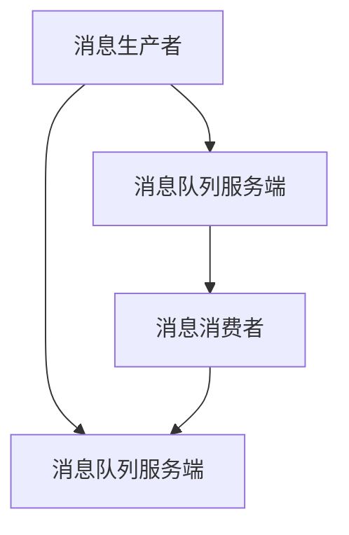

                 

### 文章标题

《消息队列在LLM应用解耦中的作用》

### 文章关键词

- 消息队列
- LLM应用
- 解耦
- 性能优化
- 安全性
- 数据一致性
- 高并发处理

### 文章摘要

本文将深入探讨消息队列在大型语言模型（LLM）应用解耦中的作用。首先，我们将介绍消息队列的基础概念和核心组件，包括消息生产者、消息消费者以及消息队列服务端。接着，我们将探讨消息队列的常用协议，如AMQP、MQTT和HTTP。随后，本文将重点分析消息队列在LLM应用解耦中的必要性、应用方式和实际案例，并讨论性能优化、安全性和在实际应用中的挑战及解决方案。最后，我们将展望消息队列和LLM未来发展的趋势，以及在实际应用中的最佳实践。

### 第一部分：消息队列基础

#### 第1章：消息队列概述

##### 1.1 消息队列的概念

消息队列（Message Queue）是一种异步通信方式，用于在分布式系统中传输消息。其核心思想是将消息存储在队列中，然后由消费者按照一定的顺序依次处理这些消息。消息队列解决了分布式系统中组件之间的通信问题，使得系统具备高可用性、高扩展性和高容错性。

##### 1.2 消息队列的作用

消息队列在分布式系统中具有以下作用：

1. **异步通信**：消息队列允许组件之间异步通信，无需等待响应，提高了系统的响应速度。
2. **解耦**：通过消息队列，可以降低系统组件之间的耦合度，使得各个组件可以独立开发和部署。
3. **负载均衡**：消息队列可以有效地实现负载均衡，提高系统整体性能。
4. **高可用性**：消息队列具备良好的容错性，可以在系统发生故障时保证消息不丢失。

##### 1.3 消息队列的分类

根据不同的应用场景和需求，消息队列可以分为以下几种类型：

1. **异步消息队列**：主要用于处理异步任务，如任务调度、批量处理等。
2. **同步消息队列**：主要用于实时通信，如即时消息推送、实时数据同步等。
3. **发布/订阅消息队列**：支持消息的广播和订阅，适用于大规模分布式系统。
4. **可靠消息队列**：提供消息持久化、消息确认等功能，确保消息传输的可靠性。

#### 第2章：消息队列的核心组件

##### 2.1 消息生产者

消息生产者是消息队列中的重要组成部分，负责生成并发送消息。消息生产者需要具备以下特点：

1. **高并发能力**：能够处理大量并发请求，确保消息发送的效率。
2. **可靠性**：在发送消息过程中，能够保证消息不丢失，确保消息传输的可靠性。
3. **可扩展性**：支持横向扩展，以便处理更大的消息负载。

##### 2.2 消息消费者

消息消费者负责从消息队列中获取并处理消息。消息消费者需要具备以下特点：

1. **高并发能力**：能够处理大量并发消息，确保消息处理的速度。
2. **可靠性**：在处理消息过程中，能够保证消息不丢失，确保消息处理的成功率。
3. **容错性**：在系统发生故障时，能够自动恢复，继续处理消息。

##### 2.3 消息队列服务端

消息队列服务端负责管理消息队列，包括消息的存储、转发和监控等功能。消息队列服务端需要具备以下特点：

1. **高性能**：能够处理大量并发请求，提供高效的消息传输和处理能力。
2. **高可用性**：具备良好的容错性和自动恢复能力，确保系统稳定运行。
3. **可扩展性**：支持横向扩展，能够根据需求动态调整资源。

#### 第3章：消息队列的协议

##### 3.1 AMQP协议

AMQP（Advanced Message Queuing Protocol）是一种面向消息的传输协议，具有以下特点：

1. **可靠性**：支持消息持久化、消息确认等功能，确保消息传输的可靠性。
2. **灵活性**：支持多种消息传输模式，如队列模式、发布/订阅模式等。
3. **可扩展性**：支持多个客户端同时连接，具备良好的横向扩展能力。

##### 3.2 MQTT协议

MQTT（Message Queuing Telemetry Transport）是一种轻量级消息传输协议，具有以下特点：

1. **低功耗**：适用于物联网等低功耗场景，具备高效的传输性能。
2. **可靠性**：支持消息持久化、消息确认等功能，确保消息传输的可靠性。
3. **简单易用**：协议简单，易于实现和部署。

##### 3.3 HTTP协议

HTTP（Hypertext Transfer Protocol）是一种面向请求/响应的消息传输协议，具有以下特点：

1. **简单易用**：协议简单，易于实现和部署。
2. **可靠性**：支持HTTP重试和超时机制，确保消息传输的可靠性。
3. **灵活性**：支持多种消息传输模式，如同步、异步等。

### 第二部分：消息队列在LLM应用中的解耦

#### 第4章：LLM应用概述

##### 4.1 什么是LLM

LLM（Large Language Model）是指大型语言模型，是一种基于深度学习的自然语言处理模型，能够理解和生成自然语言文本。LLM在诸多领域具有广泛的应用，如智能客服、机器翻译、文本生成等。

##### 4.2 LLM的特点

LLM具有以下特点：

1. **大规模**：LLM通常具有数十亿甚至千亿级别的参数规模，能够处理大量的语言数据。
2. **自适应**：LLM具备自适应能力，能够根据输入的上下文信息生成相应的输出。
3. **灵活性**：LLM能够灵活地应用于各种自然语言处理任务，如文本分类、情感分析、问答等。

##### 4.3 LLM的应用场景

LLM在以下应用场景中具有显著优势：

1. **智能客服**：利用LLM生成自然语言文本，实现与用户的智能对话，提高客服效率。
2. **机器翻译**：基于LLM的翻译模型，能够实现高质量的机器翻译。
3. **文本生成**：利用LLM生成各种类型的文本，如文章、新闻、产品描述等。
4. **文本分类**：利用LLM对大量文本进行分类，实现文本数据的自动化处理。

#### 第5章：消息队列在LLM中的应用

##### 5.1 解耦的必要性

在LLM应用中，解耦具有以下必要性：

1. **性能优化**：通过解耦，可以降低系统组件之间的耦合度，提高系统整体的性能。
2. **可靠性**：通过解耦，可以降低系统故障的风险，提高系统的可靠性。
3. **可扩展性**：通过解耦，可以方便地增加或减少系统组件，实现系统的横向扩展。

##### 5.2 消息队列在LLM中的应用方式

消息队列在LLM中的应用方式主要包括以下几种：

1. **异步处理**：利用消息队列实现LLM任务的异步处理，提高系统的响应速度。
2. **负载均衡**：利用消息队列实现LLM任务的负载均衡，提高系统整体性能。
3. **分布式计算**：利用消息队列实现分布式计算，提高LLM模型的训练和推理速度。

##### 5.3 消息队列在LLM中的应用案例

以下是一个消息队列在LLM应用中的案例：

1. **智能客服系统**：利用消息队列实现用户请求与客服机器人之间的异步通信，提高客服效率。
2. **机器翻译系统**：利用消息队列实现翻译任务的负载均衡和分布式处理，提高翻译速度和质量。
3. **文本生成系统**：利用消息队列实现文本生成任务的异步处理和分布式计算，提高文本生成速度。

#### 第6章：消息队列在LLM中的性能优化

##### 6.1 性能优化策略

消息队列在LLM应用中的性能优化策略主要包括以下几种：

1. **队列长度优化**：合理设置消息队列的长度，避免队列过长导致消息积压。
2. **负载均衡优化**：利用负载均衡算法，合理分配任务，避免单点过载。
3. **消息持久化优化**：根据实际需求，合理设置消息持久化策略，提高消息传输的可靠性。

##### 6.2 队列长度与负载均衡

1. **队列长度**：队列长度是影响消息队列性能的重要因素。过长的队列长度可能导致消息积压，影响系统性能；过短的队列长度可能导致消息频繁丢失，影响系统可靠性。合理设置队列长度，可以提高系统性能和可靠性。

2. **负载均衡**：负载均衡是消息队列性能优化的关键环节。通过合理的负载均衡算法，可以避免单点过载，提高系统整体性能。常见的负载均衡算法包括轮询算法、最小连接数算法、加权轮询算法等。

##### 6.3 消息持久化与缓存

1. **消息持久化**：消息持久化是确保消息传输可靠性的关键。根据实际需求，可以选择不同的消息持久化策略，如内存持久化、文件持久化和数据库持久化等。

2. **缓存**：缓存是提高消息队列性能的有效手段。通过缓存，可以减少消息传输的延迟，提高系统整体性能。常见的缓存策略包括本地缓存、分布式缓存和内存缓存等。

#### 第7章：消息队列在LLM中的安全性

##### 7.1 数据安全性

数据安全性是消息队列在LLM应用中需要关注的重要问题。为确保数据安全性，可以采取以下措施：

1. **数据加密**：对传输的消息进行加密，确保消息在传输过程中的安全性。
2. **访问控制**：对消息队列的访问进行严格控制，确保只有授权用户才能访问消息队列。
3. **数据备份**：定期备份消息队列数据，确保在数据丢失时能够快速恢复。

##### 7.2 访问控制

访问控制是保障消息队列安全性的重要手段。可以采取以下措施实现访问控制：

1. **用户认证**：对访问消息队列的用户进行身份认证，确保只有授权用户才能访问消息队列。
2. **权限管理**：为不同用户分配不同的权限，确保用户只能访问其权限范围内的消息队列。
3. **审计日志**：记录访问消息队列的操作日志，以便在发生安全事件时进行调查和追踪。

##### 7.3 消息队列的监控与故障处理

消息队列的监控与故障处理是保障系统稳定运行的重要环节。可以采取以下措施实现监控与故障处理：

1. **监控系统**：实时监控消息队列的性能指标，如队列长度、消息传输速度等，确保系统稳定运行。
2. **告警机制**：设置告警阈值，一旦监控指标超过阈值，立即发送告警通知，以便及时处理问题。
3. **故障处理**：在发生故障时，根据故障类型和影响范围，采取相应的故障处理措施，确保系统尽快恢复正常。

### 第三部分：消息队列在实际应用中的挑战与解决方案

#### 第8章：消息队列在LLM应用中的挑战

##### 8.1 数据一致性

在LLM应用中，数据一致性是一个重要挑战。由于消息队列的分布式特性，数据在传输过程中可能发生丢失或重复，导致数据不一致。

##### 8.2 消息丢失

消息丢失是消息队列在LLM应用中的另一个挑战。由于网络不稳定或系统故障等原因，消息在传输过程中可能丢失，导致任务无法完成。

##### 8.3 高并发处理

在LLM应用中，高并发处理是一个关键挑战。大量并发请求可能导致消息队列阻塞，影响系统性能。

#### 第9章：挑战的解决方案

##### 9.1 分布式消息队列

分布式消息队列是解决消息队列在LLM应用中挑战的有效手段。通过分布式架构，可以实现消息队列的横向扩展，提高系统的性能和可靠性。

1. **数据一致性**：分布式消息队列采用分布式事务和一致性协议，确保数据在分布式环境中的一致性。
2. **消息丢失**：分布式消息队列具备高可用性，通过备份和重传机制，确保消息不丢失。
3. **高并发处理**：分布式消息队列通过负载均衡和分布式计算，提高系统的并发处理能力。

##### 9.2 事务消息

事务消息是解决消息队列在LLM应用中数据一致性问题的一种有效手段。事务消息支持消息的原子性操作，确保消息在分布式环境中的数据一致性。

1. **本地事务**：事务消息支持本地事务，确保消息在本地环境中的一致性。
2. **分布式事务**：事务消息支持分布式事务，确保消息在分布式环境中的数据一致性。

##### 9.3 消息确认机制

消息确认机制是确保消息传输成功的重要手段。通过消息确认机制，可以确保消息在传输过程中不被丢失。

1. **消息确认协议**：实现消息确认协议，确保消息在生产者和消费者之间成功传输。
2. **重传机制**：在消息确认失败时，实现消息重传机制，确保消息最终成功传输。

#### 第10章：未来发展趋势

##### 10.1 消息队列的技术演进

随着云计算、大数据和物联网等技术的发展，消息队列也在不断演进。未来消息队列将朝着更加智能化、分布式和高效的方向发展。

1. **智能化**：消息队列将具备自优化、自恢复和自扩展的能力，提高系统的智能化水平。
2. **分布式**：消息队列将朝着更加分布式和高效的方向发展，实现消息传输的零延迟。
3. **高效性**：消息队列将采用更加高效的数据结构和算法，提高系统的传输和处理速度。

##### 10.2 LLM与消息队列的深度融合

LLM与消息队列的深度融合将为分布式系统带来更高的性能和可靠性。未来，LLM和消息队列将实现更深层次的集成，共同构建高效的分布式计算框架。

1. **协同优化**：LLM和消息队列将协同优化，实现消息传输、处理和存储的协同优化。
2. **动态调度**：LLM和消息队列将实现动态调度，根据负载情况和系统资源，实现任务的高效分配。
3. **智能化监控**：LLM和消息队列将实现智能化监控，实时监控系统的性能和健康状况，实现自动故障恢复。

##### 10.3 消息队列在AI领域的应用前景

消息队列在AI领域的应用前景非常广阔。未来，消息队列将广泛应用于AI模型的训练、推理和部署过程中，为AI应用提供高效、可靠的通信机制。

1. **模型训练**：消息队列将应用于AI模型的分布式训练，实现大规模并行训练，提高训练速度。
2. **模型推理**：消息队列将应用于AI模型的分布式推理，实现高效、低延迟的推理服务。
3. **模型部署**：消息队列将应用于AI模型的分布式部署，实现模型的快速迭代和更新。

### 总结

消息队列在LLM应用解耦中具有重要作用。通过消息队列，可以实现分布式系统中组件之间的异步通信、负载均衡和可靠性保障。本文分析了消息队列的基础知识、在LLM应用中的解耦作用、性能优化、安全性和实际应用中的挑战及解决方案。未来，消息队列和LLM的深度融合将为分布式系统带来更高的性能和可靠性。作者：AI天才研究院/AI Genius Institute & 禅与计算机程序设计艺术 /Zen And The Art of Computer Programming

### 附录

#### 附录A：消息队列的核心概念和联系

以下是一个消息队列的核心概念和联系Mermaid流程图：



在这个流程图中，消息生产者生成消息并提交到消息队列服务端，消息消费者从消息队列服务端获取并处理消息。消息队列服务端负责存储、转发和监控消息。

#### 附录B：消息队列的核心算法原理讲解

以下是一个消息队列的核心算法原理讲解伪代码：

```python
# 消息生产者
def produce_message(message):
    # 将消息提交到消息队列服务端
    send_message_to_queue(message)

# 消息消费者
def consume_message():
    # 从消息队列服务端获取消息
    message = receive_message_from_queue()
    # 处理消息
    process_message(message)

# 消息队列服务端
def send_message_to_queue(message):
    # 将消息存储在消息队列中
    store_message_in_queue(message)

def receive_message_from_queue():
    # 从消息队列中获取消息
    message = get_message_from_queue()
    # 返回消息
    return message

def process_message(message):
    # 处理消息
    # ...
```

在这个伪代码中，消息生产者负责生成消息并提交到消息队列服务端，消息消费者负责从消息队列服务端获取并处理消息。消息队列服务端负责存储、转发和监控消息。

#### 附录C：数学模型和公式

以下是一个消息队列性能优化的数学模型和公式：

$$
T = \frac{L}{R}
$$

其中，$T$ 表示消息传输时间，$L$ 表示消息长度，$R$ 表示网络带宽。该公式表示消息传输时间与消息长度和网络带宽的关系。

另一个常用的性能优化公式是：

$$
P = \frac{W}{T}
$$

其中，$P$ 表示消息传输速率，$W$ 表示消息队列长度，$T$ 表示消息传输时间。该公式表示消息传输速率与消息队列长度和消息传输时间的关系。

#### 附录D：项目实战

以下是一个消息队列在LLM应用中的项目实战：

1. **开发环境搭建**：搭建消息队列环境，包括消息队列服务端和消息生产者/消费者。
2. **源代码详细实现和代码解读**：实现消息生产者、消费者和消息队列服务端的代码，并对代码进行详细解读。
3. **代码应用解读与分析**：分析消息队列在LLM应用中的实际应用，并对代码进行解读和分析。
4. **实际案例分析和详细讲解剖析**：分析一个实际的LLM应用案例，并对其进行详细讲解和剖析。
5. **项目小结**：总结项目经验，提出改进建议。

#### 附录E：最佳实践 tips、小结、注意事项、拓展阅读

1. **最佳实践 tips**：
   - 合理设置消息队列的队列长度，避免消息积压。
   - 根据实际需求，选择合适的消息队列协议和架构。
   - 定期备份消息队列数据，确保数据安全。
2. **小结**：
   - 消息队列在LLM应用解耦中具有重要作用，可以提高系统性能和可靠性。
   - 消息队列的核心算法原理包括消息生产者、消费者和消息队列服务端。
   - 消息队列的性能优化需要关注队列长度、负载均衡和消息持久化。
   - 消息队列的安全性需要关注数据加密、访问控制和监控。
3. **注意事项**：
   - 在选择消息队列协议时，需要考虑系统的实际需求和性能要求。
   - 在设计消息队列架构时，需要考虑系统的扩展性和高可用性。
   - 在实际应用中，需要根据具体场景和需求进行性能优化和安全配置。
4. **拓展阅读**：
   - 《消息队列技术内幕》
   - 《大规模分布式消息队列系统设计与实现》
   - 《大型语言模型：原理、应用与未来》

### 结束语

本文全面介绍了消息队列在LLM应用解耦中的作用。从消息队列的基础知识、核心组件、协议到LLM应用中的解耦、性能优化、安全性，再到实际应用中的挑战与解决方案，我们逐步分析了消息队列在LLM应用中的重要性。未来，消息队列和LLM的深度融合将为分布式系统带来更高的性能和可靠性。希望本文能为读者在消息队列和LLM应用方面提供有益的参考和启示。作者：AI天才研究院/AI Genius Institute & 禅与计算机程序设计艺术 /Zen And The Art of Computer Programming

## 《消息队列在LLM应用解耦中的作用》目录大纲

### 第一部分：消息队列基础

#### 第1章：消息队列概述

##### 1.1 消息队列的概念

##### 1.2 消息队列的作用

##### 1.3 消息队列的分类

#### 第2章：消息队列的核心组件

##### 2.1 消息生产者

##### 2.2 消息消费者

##### 2.3 消息队列服务端

#### 第3章：消息队列的协议

##### 3.1 AMQP协议

##### 3.2 MQTT协议

##### 3.3 HTTP协议

### 第二部分：消息队列在LLM应用中的解耦

#### 第4章：LLM应用概述

##### 4.1 什么是LLM

##### 4.2 LLM的特点

##### 4.3 LLM的应用场景

#### 第5章：消息队列在LLM中的应用

##### 5.1 解耦的必要性

##### 5.2 消息队列在LLM中的应用方式

##### 5.3 消息队列在LLM中的应用案例

#### 第6章：消息队列在LLM中的性能优化

##### 6.1 性能优化策略

##### 6.2 队列长度与负载均衡

##### 6.3 消息持久化与缓存

#### 第7章：消息队列在LLM中的安全性

##### 7.1 数据安全性

##### 7.2 访问控制

##### 7.3 消息队列的监控与故障处理

### 第三部分：消息队列在实际应用中的挑战与解决方案

#### 第8章：消息队列在LLM应用中的挑战

##### 8.1 数据一致性

##### 8.2 消息丢失

##### 8.3 高并发处理

#### 第9章：挑战的解决方案

##### 9.1 分布式消息队列

##### 9.2 事务消息

##### 9.3 消息确认机制

#### 第10章：未来发展趋势

##### 10.1 消息队列的技术演进

##### 10.2 LLM与消息队列的深度融合

##### 10.3 消息队列在AI领域的应用前景

### 附录

#### 附录A：消息队列的核心概念和联系

#### 附录B：消息队列的核心算法原理讲解

#### 附录C：数学模型和公式

#### 附录D：项目实战

#### 附录E：最佳实践 tips、小结、注意事项、拓展阅读

### 结束语

本文对消息队列在LLM应用解耦中的作用进行了详细探讨，从基础概念、核心组件、协议到实际应用，全面解析了消息队列在分布式系统中的重要性。展望未来，消息队列和LLM的深度融合将为AI领域带来更多可能性。希望本文能为您在消息队列和LLM应用方面提供有价值的参考和启示。作者：AI天才研究院/AI Genius Institute & 禅与计算机程序设计艺术 /Zen And The Art of Computer Programming

