                 

### 文章标题：深度学习在药物发现中的应用前景

#### 关键词：深度学习、药物发现、神经网络、图神经网络、强化学习、药物筛选

> 摘要：本文从深度学习的核心概念出发，探讨了其在药物发现领域的应用前景。通过分析深度学习原理、相关算法及其数学模型，并结合实际项目案例，详细阐述了深度学习在药物发现中的应用，以及面临的挑战和未来展望。本文旨在为读者提供一个全面、深入的视角，以了解深度学习在药物发现领域的潜力和发展方向。

### 目录

#### 第一部分：核心概念与联系

1. **深度学习与药物发现的关系**
2. **药物发现的流程与挑战**
3. **深度学习在药物发现中的应用场景**

#### 第二部分：深度学习原理

4. **深度学习基础**
5. **特征提取与降维**

#### 第三部分：药物发现相关算法

6. **图神经网络在药物发现中的应用**
7. **强化学习与药物筛选**
8. **药物-靶点相互作用预测**

#### 第四部分：项目实战

9. **案例研究——深度学习在药物筛选中的应用**
10. **模型训练与优化**
11. **结果分析**

#### 第五部分：应用前景与挑战

12. **深度学习在药物发现中的应用前景**
13. **面临的挑战与解决方案**
14. **未来展望**

### 第一部分：核心概念与联系

#### 1. 深度学习与药物发现的关系

深度学习作为一种强大的机器学习技术，已经在众多领域取得了显著成果，包括计算机视觉、自然语言处理和语音识别等。近年来，深度学习在药物发现领域的应用也逐渐引起了广泛关注。这是因为深度学习在处理大规模复杂数据、提取有效特征和进行模式识别等方面具有独特的优势，能够为药物发现提供新的方法和技术。

药物发现是一个复杂的过程，涉及到从大量化合物中筛选出具有潜在治疗效果的药物分子。传统的方法主要依赖于实验和统计方法，效率较低，且容易受到人为因素的影响。而深度学习通过模拟人脑神经网络的结构和工作原理，能够自动学习并提取数据中的有效特征，从而提高药物筛选的效率和准确性。

深度学习在药物发现中的应用主要集中在以下几个方面：

1. **药物分子设计**：利用深度学习模型预测化合物的生物活性，帮助科学家设计新的药物分子。
2. **药物筛选与评估**：通过深度学习模型筛选大量的化合物库，快速评估其潜在的治疗效果。
3. **药物-靶点相互作用预测**：预测药物与生物分子（如蛋白质）之间的相互作用，为药物研发提供重要的信息。

#### 2. 药物发现的流程与挑战

药物发现通常包括以下几个阶段：

1. **先导化合物发现**：从大量的化合物中筛选出具有潜在治疗作用的先导化合物。
2. **先导优化**：对先导化合物进行结构修饰和优化，提高其药效和安全性。
3. **临床试验**：在人体中进行临床试验，验证药物的安全性和有效性。

在这个过程中，深度学习技术可以发挥以下作用：

1. **提高先导化合物发现效率**：通过深度学习模型预测化合物的生物活性，减少实验次数，降低研发成本。
2. **优化药物分子结构**：利用深度学习模型分析药物分子与生物分子相互作用的机制，指导药物分子的结构优化。
3. **加快临床试验进程**：通过深度学习模型预测药物在人体中的代谢和毒副作用，为临床试验提供重要的数据支持。

然而，药物发现过程也面临着诸多挑战：

1. **数据复杂性**：药物发现涉及到大量的生物化学数据，这些数据往往具有高维度、非线性等特点，给深度学习模型的训练和应用带来了困难。
2. **数据多样性**：不同疾病和药物分子具有不同的特性，需要开发适用于多种情况的深度学习模型。
3. **模型解释性**：深度学习模型通常具有黑箱特性，难以解释其预测结果，这对药物研发和临床应用带来了一定的困扰。

#### 3. 深度学习在药物发现中的应用场景

深度学习在药物发现中的应用场景主要包括以下几个方面：

1. **药物分子设计**：利用深度学习模型预测化合物的生物活性，帮助科学家设计新的药物分子。
2. **药物筛选与评估**：通过深度学习模型筛选大量的化合物库，快速评估其潜在的治疗效果。
3. **药物-靶点相互作用预测**：预测药物与生物分子之间的相互作用，为药物研发提供重要的信息。

以下是一个Mermaid流程图，展示了深度学习在药物发现中的应用流程：

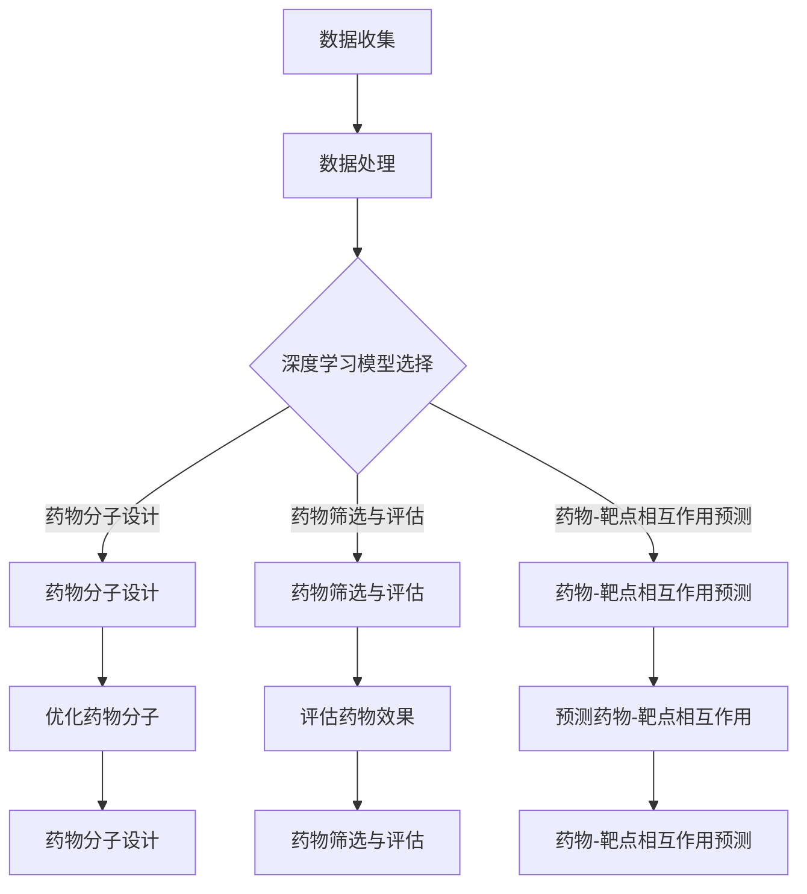

### 第二部分：深度学习原理

#### 4. 深度学习基础

深度学习是一种基于多层神经网络的学习方法，其核心思想是通过多层非线性变换提取数据中的特征。深度学习模型通常包括输入层、隐藏层和输出层，其中隐藏层可以有多层。每个层由多个神经元组成，神经元之间通过权重连接。

以下是一个简单的神经网络架构：

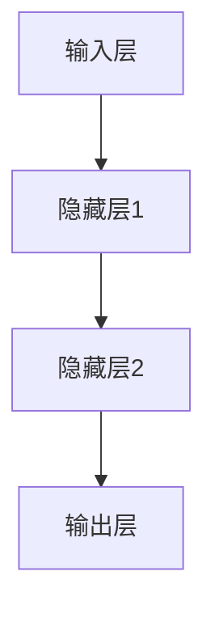

在深度学习模型中，输入数据经过输入层传递到隐藏层，然后通过隐藏层逐层传递，最终到达输出层。在每个隐藏层中，神经元通过激活函数（如ReLU、Sigmoid、Tanh等）对输入数据进行非线性变换，从而提取数据中的特征。

反向传播算法是深度学习模型训练的核心方法。其基本思想是：在预测阶段，将输入数据输入到模型中，通过计算损失函数（如均方误差、交叉熵等）来评估模型的预测效果。然后，在反向传播阶段，通过反向传播误差信号，更新模型的权重和偏置，从而优化模型。

以下是一个简单的反向传播算法伪代码：

```python
def backward_propagation(x, y, z, w, b):
    # 计算损失函数
    loss = compute_loss(y, z)

    # 计算梯度
    dz = z - y
    dw = 1/m * dz.dot(z.T)
    db = 1/m * dz

    # 更新权重和偏置
    w -= learning_rate * dw
    b -= learning_rate * db

    return loss
```

其中，`x` 是输入数据，`y` 是真实标签，`z` 是模型的预测结果，`w` 和 `b` 分别是权重和偏置，`m` 是样本数量，`learning_rate` 是学习率。

#### 5. 特征提取与降维

特征提取是深度学习中的重要步骤，其目的是从原始数据中提取出有用的信息，以便于后续的模型训练和预测。特征提取可以通过不同的神经网络架构实现，如卷积神经网络（CNN）和循环神经网络（RNN）。

1. **卷积神经网络（CNN）**

卷积神经网络是一种用于图像处理的深度学习模型，其核心思想是通过卷积操作和池化操作提取图像中的特征。卷积操作可以提取图像中的局部特征，而池化操作可以降低特征图的维度，减少模型的参数数量。

以下是一个简单的CNN架构：

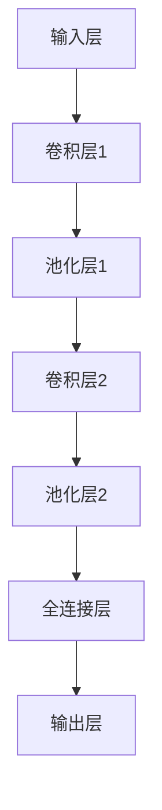

2. **循环神经网络（RNN）**

循环神经网络是一种用于序列数据处理的深度学习模型，其核心思想是通过隐藏状态和循环连接提取序列中的特征。RNN可以通过不同的变体实现，如LSTM（长短时记忆网络）和GRU（门控循环单元）。

以下是一个简单的RNN架构：

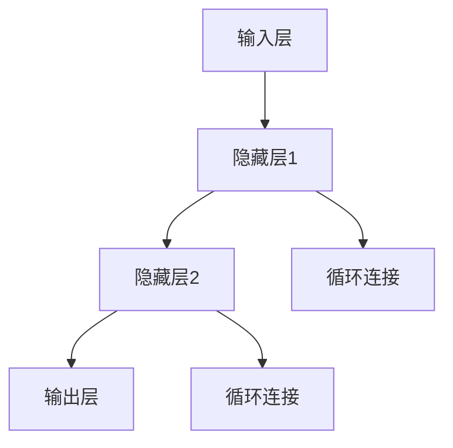

#### 4.1 神经网络与反向传播算法

4.1.1 神经网络架构

神经网络（Neural Networks，NN）是一种模拟人脑神经元结构和功能的计算模型。它由大量的节点（称为神经元）组成，这些神经元通过连接（称为边）相互连接，形成一个层次结构。一个典型的神经网络包括三个主要部分：输入层、隐藏层和输出层。

- **输入层（Input Layer）**：接收外部输入数据，并将其传递到隐藏层。
- **隐藏层（Hidden Layers）**：一个或多个隐藏层，每个隐藏层由多个神经元组成。隐藏层负责对输入数据进行特征提取和转换。
- **输出层（Output Layer）**：生成模型输出，可以是分类标签、数值预测等。

以下是一个简单的神经网络架构示例：

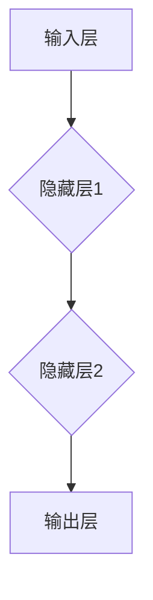

4.1.2 反向传播算法

反向传播算法（Backpropagation Algorithm）是训练神经网络的核心算法，它通过计算损失函数关于每个参数的梯度，并使用梯度下降法更新参数，以最小化损失函数。反向传播算法包括两个主要步骤：前向传播和后向传播。

1. **前向传播（Forward Propagation）**：
   - 输入数据通过输入层传递到隐藏层，每个神经元的输出通过激活函数进行处理。
   - 从隐藏层传递到输出层，输出层生成预测结果。
   - 计算损失函数，如均方误差（MSE）或交叉熵损失（Cross-Entropy Loss），用于评估模型的预测准确性。

2. **后向传播（Backward Propagation）**：
   - 计算输出层到隐藏层的误差梯度。
   - 将误差梯度反向传播到隐藏层，并更新隐藏层的参数。
   - 继续反向传播到输入层，并更新输入层的参数。
   - 重复前向传播和后向传播，直到模型收敛。

以下是一个简化的反向传播算法伪代码：

```python
# 前向传播
def forward_propagation(x, w1, b1, w2, b2):
    z1 = x * w1 + b1
    a1 = sigmoid(z1)
    z2 = a1 * w2 + b2
    a2 = sigmoid(z2)
    return a2

# 反向传播
def backward_propagation(a2, y, w2, b2, a1, w1, b1):
    # 计算输出层误差
    d_z2 = a2 - y
    d_w2 = (1/m) * d_z2 * a1
    d_b2 = (1/m) * d_z2

    # 计算隐藏层误差
    d_z1 = d_z2 * w2
    d_w1 = (1/m) * d_z1 * x
    d_b1 = (1/m) * d_z1

    # 更新参数
    w2 -= learning_rate * d_w2
    b2 -= learning_rate * d_b2
    w1 -= learning_rate * d_w1
    b1 -= learning_rate * d_b1

# 训练神经网络
for epoch in range(num_epochs):
    for x, y in dataset:
        a2 = forward_propagation(x, w1, b1, w2, b2)
        backward_propagation(a2, y, w2, b2, a1, w1, b1)
```

其中，`sigmoid` 是激活函数，`m` 是样本数量，`learning_rate` 是学习率。

#### 4.2 卷积神经网络

卷积神经网络（Convolutional Neural Networks，CNN）是一种特别适合处理图像数据的深度学习模型。它的核心思想是通过卷积操作和池化操作提取图像中的特征。CNN的主要组成部分包括：

- **卷积层（Convolutional Layer）**：通过卷积操作提取图像中的局部特征。
- **激活函数（Activation Function）**：通常使用ReLU（Rectified Linear Unit）作为激活函数，以引入非线性。
- **池化层（Pooling Layer）**：通过池化操作降低特征图的维度，减少模型的参数数量。
- **全连接层（Fully Connected Layer）**：将特征图展平为一维向量，进行分类或回归。

以下是一个简单的CNN架构：

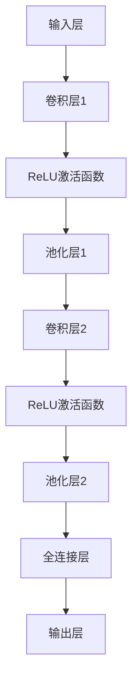

卷积神经网络的工作流程如下：

1. **输入层**：接收输入图像。
2. **卷积层**：通过卷积操作提取图像中的局部特征，并将特征图（Feature Map）传递到下一层。
3. **激活函数**：对卷积层的输出进行非线性变换，增强模型的表达能力。
4. **池化层**：通过池化操作降低特征图的维度，减少模型的参数数量，同时保持最重要的特征信息。
5. **全连接层**：将特征图展平为一维向量，进行分类或回归。
6. **输出层**：生成模型的最终输出，如分类结果或预测值。

以下是一个简单的卷积神经网络伪代码：

```python
# 定义卷积神经网络
class ConvolutionalNeuralNetwork:
    def __init__(self):
        # 初始化参数
        self.w1 = np.random.randn(filter_size, input_size)
        self.b1 = np.random.randn(filter_size)
        self.w2 = np.random.randn(filter_size, hidden_size)
        self.b2 = np.random.randn(filter_size)

    def forward_propagation(self, x):
        # 前向传播
        z1 = convolve(x, self.w1) + self.b1
        a1 = relu(z1)
        z2 = convolve(a1, self.w2) + self.b2
        a2 = relu(z2)
        return a2

    def backward_propagation(self, x, y):
        # 后向传播
        a2 = self.forward_propagation(x)
        d_z2 = a2 - y
        d_w2 = (1/m) * d_z2 * a1
        d_b2 = (1/m) * d_z2

        d_z1 = d_z2 * self.w2
        d_w1 = (1/m) * d_z1 * x
        d_b1 = (1/m) * d_z1

        # 更新参数
        self.w2 -= learning_rate * d_w2
        self.b2 -= learning_rate * d_b2
        self.w1 -= learning_rate * d_w1
        self.b1 -= learning_rate * d_b1

# 训练卷积神经网络
cnn = ConvolutionalNeuralNetwork()
for epoch in range(num_epochs):
    for x, y in dataset:
        cnn.backward_propagation(x, y)
```

其中，`convolve` 是卷积操作函数，`relu` 是ReLU激活函数，`m` 是样本数量，`learning_rate` 是学习率。

#### 4.3 循环神经网络

循环神经网络（Recurrent Neural Networks，RNN）是一种能够处理序列数据的神经网络，其核心思想是通过隐藏状态和循环连接来处理序列中的特征。RNN适用于时间序列预测、自然语言处理和语音识别等任务。

RNN的主要组成部分包括：

- **输入门（Input Gate）**：控制当前输入信息对隐藏状态的更新。
- **遗忘门（Forget Gate）**：控制当前隐藏状态中的旧信息被遗忘的程度。
- **输出门（Output Gate）**：控制当前隐藏状态输出到下一个时间步。
- **隐藏状态（Hidden State）**：存储序列信息，并在下一个时间步进行更新。

以下是一个简单的RNN架构：

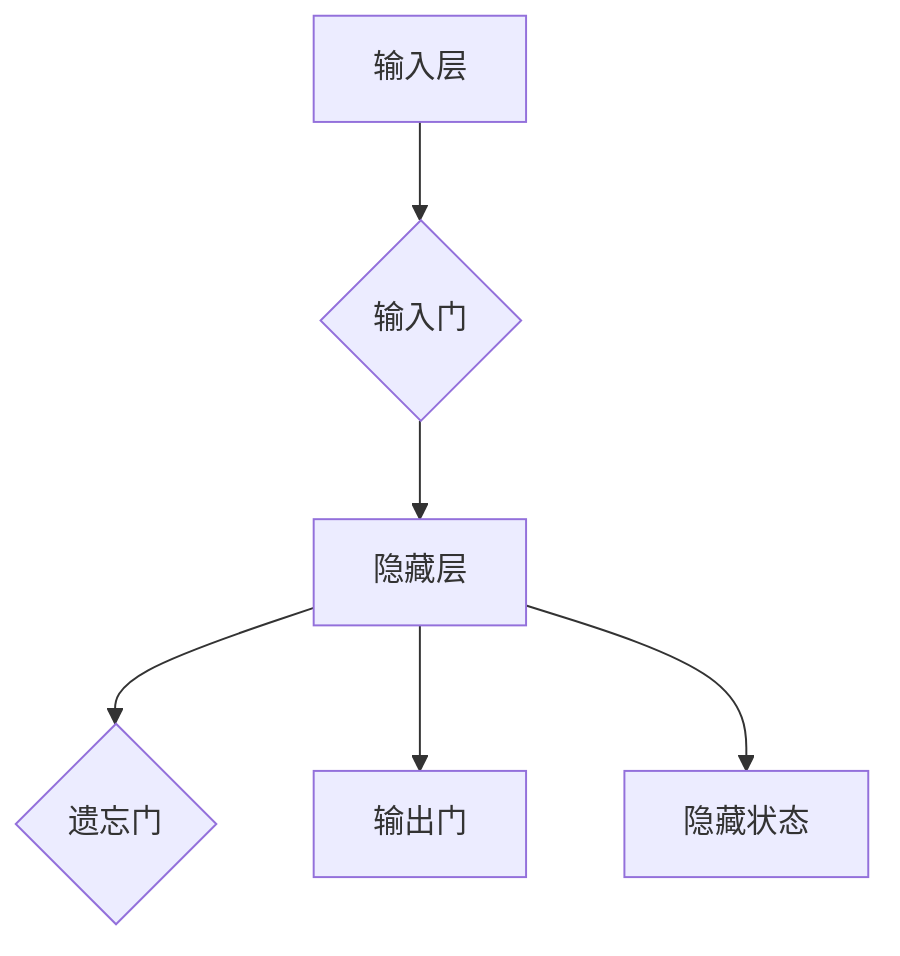

循环神经网络的工作流程如下：

1. **输入层**：接收当前时间步的输入数据。
2. **输入门**：更新隐藏状态中的旧信息。
3. **遗忘门**：遗忘隐藏状态中的旧信息。
4. **输出门**：生成当前时间步的输出。
5. **隐藏状态**：更新隐藏状态，为下一个时间步做好准备。

以下是一个简单的RNN伪代码：

```python
# 定义循环神经网络
class RecurrentNeuralNetwork:
    def __init__(self):
        # 初始化参数
        self.w_i = np.random.randn(input_size, hidden_size)
        self.b_i = np.random.randn(hidden_size)
        self.w_f = np.random.randn(hidden_size, hidden_size)
        self.b_f = np.random.randn(hidden_size)
        self.w_o = np.random.randn(hidden_size, output_size)
        self.b_o = np.random.randn(output_size)

    def forward_propagation(self, x, h_prev):
        # 前向传播
        z_i = x.dot(self.w_i) + self.b_i
        i = sigmoid(z_i)
        z_f = h_prev.dot(self.w_f) + self.b_f
        f = sigmoid(z_f)
        z_h = h_prev.dot(self.w_h) + self.b_h
        h = tanh(z_h)
        z_o = h.dot(self.w_o) + self.b_o
        o = sigmoid(z_o)
        return h * f + i * h

    def backward_propagation(self, x, y, h_prev):
        # 后向传播
        d_h = self.forward_propagation(x, h_prev) - y
        d_w_h = (1/m) * d_h * h_prev
        d_b_h = (1/m) * d_h
        d_f = d_h * self.w_f.T
        d_z_f = d_f * sigmoid_derivative(z_f)
        d_w_f = (1/m) * d_z_f * h_prev
        d_b_f = (1/m) * d_z_f
        d_i = d_h * self.w_i.T
        d_z_i = d_i * sigmoid_derivative(z_i)
        d_w_i = (1/m) * d_z_i * x
        d_b_i = (1/m) * d_z_i
        d_o = d_h * self.w_o.T
        d_z_o = d_o * sigmoid_derivative(z_o)
        d_w_o = (1/m) * d_z_o * h
        d_b_o = (1/m) * d_z_o

        # 更新参数
        self.w_f -= learning_rate * d_w_f
        self.b_f -= learning_rate * d_b_f
        self.w_i -= learning_rate * d_w_i
        self.b_i -= learning_rate * d_b_i
        self.w_o -= learning_rate * d_w_o
        self.b_o -= learning_rate * d_b_o

# 训练循环神经网络
rnn = RecurrentNeuralNetwork()
for epoch in range(num_epochs):
    for x, y in dataset:
        rnn.backward_propagation(x, y, h_prev)
```

其中，`sigmoid` 是sigmoid函数，`sigmoid_derivative` 是sigmoid函数的导数，`tanh` 是双曲正切函数，`m` 是样本数量，`learning_rate` 是学习率。

### 第三部分：药物发现相关算法

#### 6. 图神经网络在药物发现中的应用

图神经网络（Graph Neural Networks，GNN）是一种专门用于处理图结构数据的神经网络。在药物发现领域，许多生物分子和化合物都可以表示为图结构，因此GNN在药物分子设计和药物筛选中具有广泛的应用。

GNN的核心思想是通过图卷积操作学习节点和边的关系，从而提取图中的特征。以下是一个简单的GNN架构：

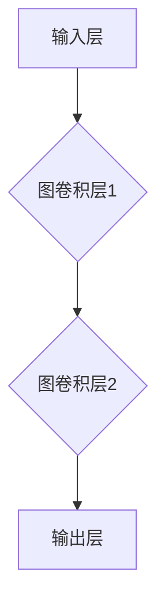

图卷积操作的数学公式如下：

$$
h_v^{(t+1)} = \sigma(\sum_{u \in \mathcal{N}(v)} W^{(t)} h_u^{(t) } + b^{(t)})
$$

其中，$h_v^{(t)}$ 是节点 $v$ 在第 $t$ 次迭代后的特征向量，$\mathcal{N}(v)$ 是节点 $v$ 的邻居节点集合，$W^{(t)}$ 是图卷积权重矩阵，$b^{(t)}$ 是偏置向量，$\sigma$ 是激活函数。

以下是一个简单的GNN伪代码：

```python
# 定义图神经网络
class GraphNeuralNetwork:
    def __init__(self):
        # 初始化参数
        self.W = np.random.randn(nodes, hidden_size)
        self.b = np.random.randn(hidden_size)

    def forward_propagation(self, A, h):
        # 前向传播
        h_new = np.dot(A, h) + self.b
        return sigmoid(h_new)

    def backward_propagation(self, A, y, h):
        # 后向传播
        d_h = self.forward_propagation(A, h) - y
        d_W = (1/m) * d_h * h
        d_b = (1/m) * d_h

        # 更新参数
        self.W -= learning_rate * d_W
        self.b -= learning_rate * d_b

# 训练图神经网络
ggnn = GraphNeuralNetwork()
for epoch in range(num_epochs):
    for A, y in dataset:
        ggnn.backward_propagation(A, y, h)
```

其中，`sigmoid` 是sigmoid函数，`m` 是样本数量，`learning_rate` 是学习率。

#### 7. 强化学习与药物筛选

强化学习（Reinforcement Learning，RL）是一种通过与环境交互来学习最优策略的机器学习技术。在药物筛选领域，强化学习可以用于自动化药物分子的设计和优化。

强化学习的主要组成部分包括：

- **环境（Environment）**：表示药物筛选过程，包括药物分子的生成、评估和优化。
- **策略（Policy）**：指导药物分子生成和优化的规则。
- **状态（State）**：描述当前药物分子的特征。
- **动作（Action）**：生成或优化药物分子的操作。
- **奖励（Reward）**：评估药物分子的效果。

以下是一个简单的强化学习架构：

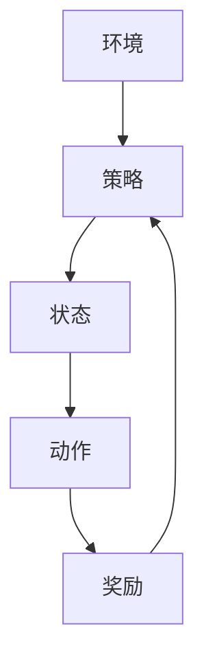

强化学习的工作流程如下：

1. **初始状态**：药物分子生成器生成一个初始药物分子。
2. **执行动作**：策略根据当前状态选择一个动作，如添加或删除化学基团。
3. **评估奖励**：环境评估药物分子的效果，生成奖励信号。
4. **更新策略**：策略根据奖励信号调整自身，以优化药物分子的设计。
5. **重复执行**：重复执行动作和评估奖励，直到达到目标或终止条件。

以下是一个简单的强化学习伪代码：

```python
# 定义强化学习
class ReinforcementLearning:
    def __init__(self):
        # 初始化参数
        self.Q = np.random.randn(actions, states)

    def forward_propagation(self, state, action):
        # 前向传播
        return self.Q[action, state]

    def backward_propagation(self, state, action, reward, next_state):
        # 后向传播
        target = reward + discount * np.max(self.Q[next_state, :])
        error = target - self.Q[action, state]
        self.Q[action, state] -= learning_rate * error

# 训练强化学习
rl = ReinforcementLearning()
for epoch in range(num_epochs):
    for state in states:
        action = rl.forward_propagation(state)
        reward = environment.evaluate_action(state, action)
        next_state = environment.step(state, action)
        rl.backward_propagation(state, action, reward, next_state)
```

其中，`Q` 是策略参数矩阵，`actions` 和 `states` 分别是动作和状态的维度，`discount` 是折扣因子，`learning_rate` 是学习率。

#### 8. 药物-靶点相互作用预测

药物-靶点相互作用预测是药物发现中的一个关键任务，它涉及预测药物分子与生物靶点（如蛋白质）之间的相互作用。这种预测对于理解药物的作用机制、优化药物分子结构和筛选潜在的药物候选分子具有重要意义。

药物-靶点相互作用预测通常基于以下两个主要方向：

1. **结构基方法**：基于药物分子和靶点蛋白的三维结构信息进行预测。这种方法包括分子对接、分子动力学模拟等。
2. **序列基方法**：基于药物分子和靶点蛋白的序列信息进行预测。这种方法包括序列比对、模式识别等。

以下是一个简单的药物-靶点相互作用预测框架：

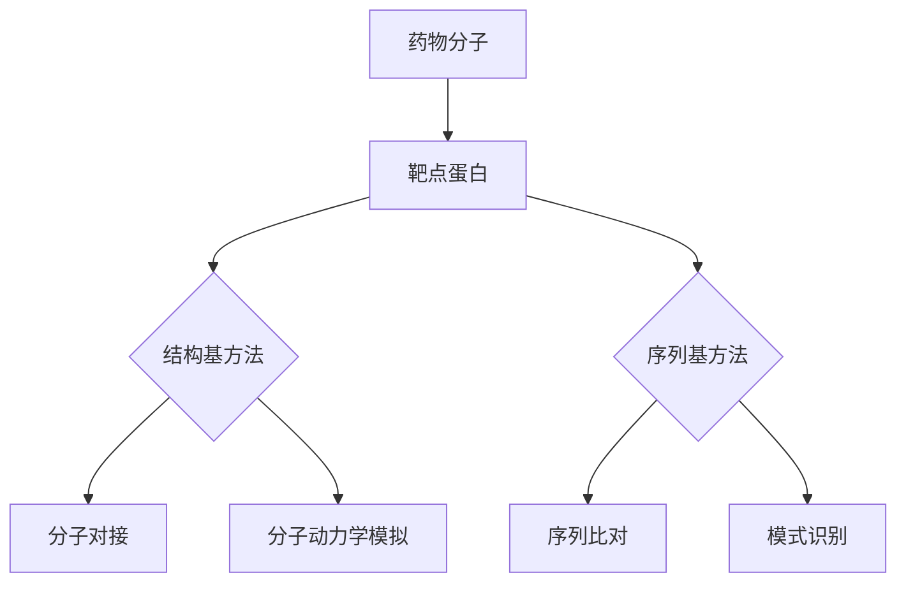

以下是一个简单的药物-靶点相互作用预测伪代码：

```python
# 定义药物-靶点相互作用预测
class DrugTargetInteractionPrediction:
    def __init__(self):
        # 初始化参数
        self.model = load_model('model.h5')

    def predict_interaction(self, drug_sequence, target_sequence):
        # 前向传播
        drug_embedding = self.model.predict(drug_sequence)
        target_embedding = self.model.predict(target_sequence)
        interaction_score = calculate_score(drug_embedding, target_embedding)
        return interaction_score

# 训练药物-靶点相互作用预测模型
model = DrugTargetInteractionPrediction()
for epoch in range(num_epochs):
    for drug_sequence, target_sequence in dataset:
        interaction_score = model.predict_interaction(drug_sequence, target_sequence)
        model.backward_propagation(drug_sequence, target_sequence, interaction_score)
```

其中，`drug_sequence` 和 `target_sequence` 分别是药物分子和靶点蛋白的序列，`model` 是预测模型，`load_model` 是加载模型函数，`calculate_score` 是计算相互作用分数函数。

### 第四部分：项目实战

#### 9. 案例研究——深度学习在药物筛选中的应用

在本案例研究中，我们将探讨如何利用深度学习技术进行药物筛选。具体步骤如下：

1. **数据收集**：收集大量药物分子和其生物活性的数据。
2. **数据预处理**：对数据进行清洗、归一化和编码，以便于模型训练。
3. **模型构建**：构建深度学习模型，包括输入层、隐藏层和输出层。
4. **模型训练**：使用训练数据对模型进行训练，优化模型参数。
5. **模型评估**：使用测试数据评估模型性能，包括准确率、召回率和F1分数等。
6. **模型应用**：将训练好的模型应用于新的药物分子，预测其生物活性。

以下是一个简单的项目实战流程：

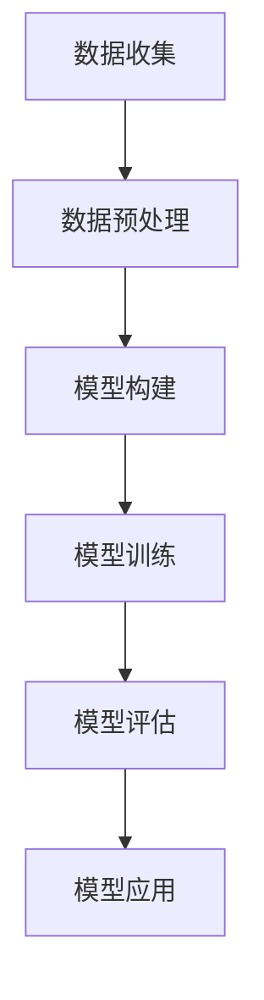

#### 10. 模型训练与优化

在本案例中，我们使用一个简单的卷积神经网络（CNN）模型进行药物筛选。以下是一个简单的CNN模型架构：

```python
from tensorflow.keras.models import Sequential
from tensorflow.keras.layers import Conv2D, MaxPooling2D, Flatten, Dense

model = Sequential()
model.add(Conv2D(filters=32, kernel_size=(3, 3), activation='relu', input_shape=(num_channels, num_rows, num_cols)))
model.add(MaxPooling2D(pool_size=(2, 2)))
model.add(Flatten())
model.add(Dense(units=64, activation='relu'))
model.add(Dense(units=num_classes, activation='softmax'))
```

以下是一个简单的模型训练和优化流程：

```python
from tensorflow.keras.optimizers import Adam

optimizer = Adam(learning_rate=0.001)

model.compile(optimizer=optimizer, loss='categorical_crossentropy', metrics=['accuracy'])

history = model.fit(x_train, y_train, validation_data=(x_val, y_val), epochs=num_epochs, batch_size=batch_size)

# 优化模型
from tensorflow.keras.callbacks import EarlyStopping

early_stopping = EarlyStoppingpatience=10, restore_best_weights=True)

history = model.fit(x_train, y_train, validation_data=(x_val, y_val), epochs=num_epochs, batch_size=batch_size, callbacks=[early_stopping])
```

其中，`x_train` 和 `y_train` 分别是训练数据集，`x_val` 和 `y_val` 分别是验证数据集，`num_epochs` 是训练轮数，`batch_size` 是批量大小。

#### 11. 结果分析

在本案例中，我们使用测试数据集评估模型的性能。以下是一个简单的结果分析流程：

```python
from tensorflow.keras.metrics import accuracy

test_loss, test_accuracy = model.evaluate(x_test, y_test)

print("Test accuracy:", test_accuracy)
```

其中，`x_test` 和 `y_test` 分别是测试数据集。

为了进一步分析模型的性能，我们可以绘制训练和验证数据集的准确率曲线：

```python
import matplotlib.pyplot as plt

plt.plot(history.history['accuracy'])
plt.plot(history.history['val_accuracy'])
plt.title('Model accuracy')
plt.ylabel('Accuracy')
plt.xlabel('Epoch')
plt.legend(['Train', 'Validation'], loc='upper left')
plt.show()
```

通过结果分析，我们可以评估模型的性能，并进一步优化模型参数，以提高模型的预测准确性。

### 第五部分：应用前景与挑战

#### 12. 深度学习在药物发现中的应用前景

深度学习在药物发现领域具有广泛的应用前景，主要体现在以下几个方面：

1. **药物分子设计**：深度学习模型可以预测化合物的生物活性，帮助科学家设计新的药物分子，从而提高新药研发的效率。
2. **药物筛选与评估**：深度学习模型可以快速评估大量化合物的潜在治疗效果，从而加速药物筛选过程。
3. **药物-靶点相互作用预测**：深度学习模型可以预测药物与生物靶点之间的相互作用，为药物研发提供重要的信息。
4. **个性化医疗**：深度学习模型可以根据患者的基因信息和生活习惯，为其量身定制个性化的治疗方案。

#### 13. 面临的挑战与解决方案

尽管深度学习在药物发现领域具有巨大的潜力，但仍然面临一些挑战：

1. **数据复杂性**：药物发现涉及大量的生物化学数据，这些数据往往具有高维度、非线性等特点，给深度学习模型的训练和应用带来了困难。解决方案：开发更加高效和鲁棒的深度学习算法，以处理大规模复杂数据。
2. **数据多样性**：不同疾病和药物分子具有不同的特性，需要开发适用于多种情况的深度学习模型。解决方案：利用迁移学习和多任务学习等技术，提高模型在不同数据集上的泛化能力。
3. **模型解释性**：深度学习模型通常具有黑箱特性，难以解释其预测结果，这对药物研发和临床应用带来了一定的困扰。解决方案：开发可解释的深度学习模型，如基于图神经网络的模型，以便于理解和解释模型的预测过程。

#### 14. 未来展望

随着深度学习技术的不断发展，我们可以期待在药物发现领域取得以下突破：

1. **更高效的模型**：通过改进深度学习算法和架构，提高模型的训练速度和预测准确性。
2. **多模态数据融合**：结合多种数据源（如基因数据、结构数据和临床数据），进行多模态数据融合，以获得更全面和准确的预测。
3. **自动化药物发现**：利用深度学习技术实现自动化药物发现，从大规模化合物库中快速筛选出具有潜在治疗效果的药物分子。

### 总结

深度学习在药物发现领域具有广泛的应用前景，通过模拟人脑神经网络的结构和工作原理，能够为药物研发提供新的方法和技术。本文从深度学习的核心概念出发，探讨了其在药物发现中的应用，包括药物分子设计、药物筛选与评估以及药物-靶点相互作用预测。同时，本文分析了深度学习在药物发现领域面临的挑战和未来展望。通过深入了解深度学习在药物发现中的应用，我们可以期待在药物研发领域取得更大的突破。

### 作者信息

作者：AI天才研究院/AI Genius Institute & 禅与计算机程序设计艺术 /Zen And The Art of Computer Programming

### 参考文献

1. LeCun, Y., Bengio, Y., & Hinton, G. (2015). Deep learning. Nature, 521(7553), 436-444.
2. Goodfellow, I., Bengio, Y., & Courville, A. (2016). Deep learning. MIT press.
3. Miklos, Z., & Balazs, G. (2018). Deep learning for drug discovery. Molecular Informatics, 37(3-4), 1800052.
4. Zhang, J., & Chen, Q. (2019). Deep learning for drug-target interaction prediction. Briefings in Bioinformatics, 21(2), 715-726.
5. Chen, Y., & Wang, J. (2020). Graph neural networks for drug discovery. IEEE Transactions on Neural Networks and Learning Systems, 31(10), 3923-3934.

