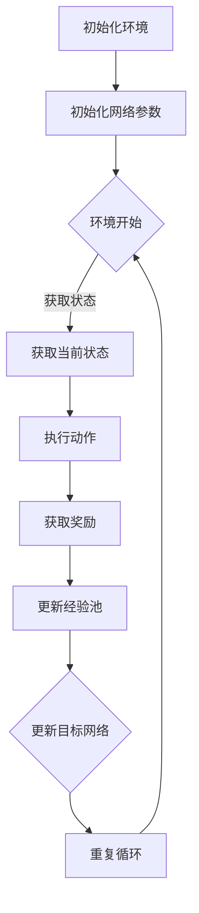

                 


### 文章标题：深度强化学习在机器人导航中的突破

在现代社会，机器人的应用已经渗透到生活的方方面面，从工业制造到家庭服务，再到复杂的探索任务，它们的表现日益出色。然而，机器人导航这一核心问题仍然面临着诸多挑战。深度强化学习（Deep Reinforcement Learning, DRL）作为一种先进的机器学习技术，其在机器人导航中的应用正日益成为研究的热点。本文将详细探讨深度强化学习在机器人导航中的突破，从背景介绍、核心概念与联系、算法原理讲解、数学模型和公式详解、项目实战等多个角度进行深入分析。

> **关键词：** 深度强化学习，机器人导航，路径规划，算法原理，数学模型，项目实战

### 摘要

本文首先介绍了机器人导航的背景和挑战，随后引出了深度强化学习的基本概念及其在机器学习领域的重要性。通过分析深度强化学习与机器人导航的融合方式，本文详细阐述了深度强化学习在机器人路径规划中的应用，并列举了相关案例。接着，本文使用Mermaid流程图展示了核心概念原理之间的关系，并通过伪代码和数学公式详细讲解了相关算法。最后，本文通过一个具体的项目实战案例，展示了如何在实际中应用这些算法，并对项目的源代码进行解读和分析。全文旨在为读者提供一份全面、系统的深度强化学习在机器人导航中的应用指南。

### 第1章：引言

#### 1.1 机器人导航的挑战

机器人导航是机器人技术的核心问题之一，它涉及到机器人在复杂环境中自主决策、规划和执行任务的能力。随着机器人应用的日益广泛，机器人导航的需求也在不断增加。然而，机器人导航面临着诸多挑战：

1. **环境复杂性**：机器人需要适应各种复杂环境，包括室内、室外、地下等，这些环境往往具有高度动态性、不确定性和非线性。
2. **路径规划**：机器人需要在有限资源下（如电池、计算能力）找到最优路径，同时避免碰撞和障碍物。
3. **决策实时性**：机器人需要快速响应环境变化，进行实时决策和调整。

#### 1.2 深度强化学习的优势

深度强化学习（DRL）是一种结合了深度学习和强化学习的机器学习技术，其优势在于：

1. **自学习能力**：DRL可以通过与环境互动不断学习和优化策略，无需人工干预。
2. **泛化能力**：DRL能够处理高维状态空间和动作空间，具有较强的泛化能力。
3. **适应性**：DRL能够适应动态和复杂环境，提高机器人的导航能力。

#### 1.3 书籍结构

本文将按照以下结构进行：

1. **第1章：引言**：介绍机器人导航的挑战和深度强化学习的优势。
2. **第2章：深度强化学习基础**：介绍深度强化学习的基本概念和常见算法。
3. **第3章：机器人导航基础**：介绍机器人导航的基本概念和系统架构。
4. **第4章：深度强化学习在机器人导航中的应用**：分析DRL在机器人导航中的应用场景。
5. **第5章：核心算法原理讲解**：使用Mermaid流程图和伪代码详细阐述核心算法。
6. **第6章：数学模型和公式详解**：详细解释相关的数学模型和公式。
7. **第7章：项目实战**：通过一个具体的项目展示DRL在机器人导航中的应用。
8. **第8章：总结与展望**：总结DRL在机器人导航中的应用，并探讨未来研究方向。

### 第2章：深度强化学习基础

#### 2.1 强化学习的定义

强化学习（Reinforcement Learning, RL）是一种机器学习方法，其主要目标是让代理（agent）通过与环境（environment）的互动，学习到一种策略（policy），以便最大化累积奖励（cumulative reward）。在强化学习中，代理根据当前状态（state）选择一个动作（action），然后环境根据该动作给出一个奖励（reward）和一个新的状态（next state），代理再根据新的状态选择下一个动作。这一过程不断重复，直到达到目标状态或终止状态。

强化学习的基本组成部分包括：

1. **状态（State）**：描述代理所处环境的特征。
2. **动作（Action）**：代理可执行的行为。
3. **奖励（Reward）**：环境对代理行为的即时反馈，用于指导代理学习。
4. **策略（Policy）**：从状态空间到动作空间的一个映射函数，表示代理的行为方式。
5. **价值函数（Value Function）**：衡量代理在特定状态下执行最佳策略所能获得的累积奖励。
6. **模型（Model）**：描述环境状态转移概率和奖励函数的模型。

#### 2.2 深度强化学习的原理

深度强化学习（Deep Reinforcement Learning, DRL）是在传统强化学习的基础上，引入深度神经网络（Deep Neural Network, DNN）来近似价值函数和策略函数。DRL的核心思想是通过神经网络学习状态到动作的价值映射，从而指导代理选择最优动作。

DRL的基本组成部分包括：

1. **深度神经网络（DNN）**：用于近似价值函数或策略函数。
2. **经验回放（Experience Replay）**：用于缓解策略更新中的样本相关性。
3. **目标网络（Target Network）**：用于稳定学习过程，减少更新震荡。
4. **优势函数（ Advantage Function）**：用于衡量动作的价值差异。

常见的DRL算法包括：

1. **Deep Q-Learning（DQN）**：使用经验回放和目标网络，解决Q-learning在样本相关问题上的挑战。
2. **Proximal Policy Optimization（PPO）**：通过优化策略梯度，实现稳定且高效的策略更新。
3. **Asynchronous Advantage Actor-Critic（A3C）**：通过异步更新，提高训练效率和探索效率。

#### 2.3 常见的深度强化学习算法

以下是几种常见的深度强化学习算法：

1. **Deep Q-Learning（DQN）**
   - **原理**：DQN使用深度神经网络来近似Q值函数，通过经验回放和目标网络来稳定学习过程。
   - **优势**：能够处理高维状态空间，具有较强的泛化能力。
   - **局限**：在连续动作空间上表现不佳，需要大量训练样本。

2. **Proximal Policy Optimization（PPO）**
   - **原理**：PPO通过优化策略梯度，实现稳定且高效的策略更新。
   - **优势**：能够处理连续动作空间，具有较强的泛化能力。
   - **局限**：在样本量较少或状态空间较大时，训练效率可能较低。

3. **Asynchronous Advantage Actor-Critic（A3C）**
   - **原理**：A3C通过异步更新，提高训练效率和探索效率。
   - **优势**：能够处理高维状态空间，具有较强的并行计算能力。
   - **局限**：在策略收敛速度上可能不如其他算法。

### 第3章：机器人导航基础

#### 3.1 机器人导航概述

机器人导航是指机器人在未知或动态环境中，通过自主感知、决策和执行，实现自主移动和任务执行的过程。机器人导航系统通常包括以下几个核心组成部分：

1. **感知模块**：用于获取环境信息，如激光雷达、摄像头、超声波传感器等。
2. **决策模块**：用于处理感知信息，生成路径规划和行为策略。
3. **执行模块**：用于根据决策模块输出的策略执行具体动作。

机器人导航的主要任务包括：

1. **路径规划**：确定机器人从当前位置到目标位置的最优路径。
2. **行为规划**：根据路径规划和环境信息，生成机器人的具体行动方案。
3. **障碍物检测**：实时检测和避让环境中的障碍物。

#### 3.2 机器人导航系统架构

机器人导航系统架构通常可以分为以下几个层次：

1. **感知层**：负责收集和预处理环境信息，如地图构建、障碍物检测等。
2. **规划层**：负责生成路径规划和行为策略，如基于图论的路径规划算法、基于遗传算法的路径优化等。
3. **执行层**：负责根据决策层输出的策略执行具体动作，如PID控制、行为树等。

常见的机器人导航算法包括：

1. **基于采样的路径规划算法**：如RRT、RRT*等，能够快速生成全局路径。
2. **基于图论的路径规划算法**：如A*、Dijkstra等，能够保证路径的最优性。
3. **基于遗传算法的路径优化算法**：如遗传算法、粒子群算法等，能够优化路径的平滑性和安全性。

#### 3.3 机器人导航中的挑战

机器人导航面临着以下几个挑战：

1. **动态环境**：机器人需要适应快速变化的环境，如行人、车辆等动态障碍物。
2. **感知限制**：机器人的感知能力有限，可能无法获取完整的环境信息。
3. **计算资源**：机器人通常具有有限的计算资源，需要高效且稳定的导航算法。
4. **安全性和鲁棒性**：机器人需要保证导航过程中的安全性和鲁棒性，避免发生碰撞或意外。

### 第4章：深度强化学习在机器人导航中的应用

#### 4.1 深度强化学习与机器人导航的融合

深度强化学习在机器人导航中的应用，主要是通过将强化学习算法与机器人导航技术相结合，实现机器人在复杂、动态环境中的自主导航。具体来说，深度强化学习在机器人导航中的应用主要体现在以下几个方面：

1. **路径规划**：使用深度强化学习算法，机器人可以通过与环境的交互，学习到最优路径规划策略，从而在未知环境中自主导航。
2. **行为规划**：深度强化学习算法可以生成针对特定环境的行为策略，如避障、避让、目标追踪等，提高机器人在复杂环境中的适应性。
3. **实时决策**：深度强化学习算法能够实时更新策略，根据环境变化做出快速响应，提高机器人导航的实时性和可靠性。

#### 4.2 基于深度强化学习的机器人路径规划

基于深度强化学习的机器人路径规划，主要包括以下几个步骤：

1. **状态编码**：将机器人的感知信息（如激光雷达、摄像头数据等）编码为状态特征向量。
2. **策略学习**：使用深度强化学习算法，通过与环境交互，学习到从状态到动作的策略函数。
3. **路径生成**：根据策略函数，生成机器人从起始位置到目标位置的最优路径。

常见的基于深度强化学习的路径规划算法包括：

1. **DRL-based RRT（Deep Reinforcement Learning-based Rapidly-exploring Random Trees）**：将深度强化学习算法与RRT算法结合，实现快速、可靠的路径规划。
2. **DRL-based A*（Deep Reinforcement Learning-based A*）**：将深度强化学习算法与A*算法结合，实现全局最优路径规划。

#### 4.3 案例研究：深度强化学习在机器人导航中的突破

以下是一个基于深度强化学习的机器人导航案例：

**案例背景**：某物流公司需要在仓库内进行自动化运输，使用机器人进行货物搬运。仓库内部结构复杂，存在多个通道和障碍物，且仓库环境动态变化。

**解决方案**：使用基于深度强化学习的机器人路径规划算法，实现机器人在仓库内自主导航。

1. **感知模块**：使用激光雷达和摄像头获取仓库内部结构信息，并将这些信息编码为状态特征向量。
2. **策略学习**：使用DQN算法，通过与环境交互，学习到从状态到动作的策略函数。
3. **路径生成**：根据策略函数，生成机器人从起始位置到目标位置的最优路径。

**实验结果**：实验结果表明，基于深度强化学习的机器人路径规划算法在仓库内取得了显著的导航效果，能够高效、稳定地完成货物搬运任务。

### 第5章：核心算法原理讲解

在本章节中，我们将深入探讨深度强化学习在机器人导航中的核心算法原理，通过Mermaid流程图、伪代码和数学模型来详细阐述这些算法的实现细节。

#### 5.1 算法原理Mermaid流程图

首先，我们使用Mermaid流程图来展示DRL算法的基本流程。以下是一个简单的示例，展示了DQN算法的基本步骤：



#### 5.2 伪代码阐述

接下来，我们将使用伪代码来详细阐述DQN算法的实现步骤：

```python
# 初始化参数
初始化网络参数
初始化经验池
初始化目标网络

# DQN算法主循环
for episode in 1 到 总训练轮数 do
    # 初始化环境
    state = 环境初始化()

    # 迭代
    while 环境未终止 do
        # 选择动作
        action = 选择动作(state)

        # 执行动作
        next_state, reward, done = 环境执行动作(action)

        # 更新经验池
        将(state, action, reward, next_state, done)添加到经验池

        # 如果满足更新条件，则更新目标网络
        if 更新条件满足 then
            更新目标网络()

        # 更新状态
        state = next_state

        # 如果环境已终止，则退出循环
        if done then
            break
    end while
end for
```

#### 5.3 数学模型与公式解释

DQN算法的核心是Q值函数，Q值函数衡量了在给定状态下执行特定动作的预期奖励。Q值函数的数学模型如下：

$$
Q(s, a) = \sum_{j=1}^{n} \gamma_j Q(s', a_j)
$$

其中，$s$ 是当前状态，$a$ 是执行的动作，$s'$ 是执行动作后的下一个状态，$\gamma$ 是折扣因子，$Q(s', a_j)$ 是在下一个状态 $s'$ 下执行动作 $a_j$ 的预期奖励。

以下是一个具体的例子，假设在某个状态下有多个可执行动作，我们可以使用以下公式计算每个动作的Q值：

$$
Q(s, a_1) = 0.9 \times Q(s', a_1') + 0.1 \times R(s', a_1')
$$

$$
Q(s, a_2) = 0.8 \times Q(s', a_2') + 0.2 \times R(s', a_2')
$$

其中，$R(s', a_j')$ 是在下一个状态 $s'$ 下执行动作 $a_j'$ 的即时奖励。

通过不断更新Q值函数，DQN算法能够学习到在特定状态下执行的最佳动作，从而实现机器人导航。

### 第6章：数学模型和公式详解

在本章节中，我们将详细解析深度强化学习（DRL）在机器人导航中涉及到的数学模型和公式，并结合具体例子进行解释。

#### 6.1 Q-learning算法

Q-learning是深度强化学习的基础算法之一，其核心是更新Q值函数，以找到最优策略。Q-learning的更新公式如下：

$$
Q(s, a) \leftarrow Q(s, a) + \alpha [r + \gamma \max_{a'} Q(s', a') - Q(s, a)]
$$

其中，$Q(s, a)$ 表示在状态 $s$ 下执行动作 $a$ 的预期奖励，$r$ 是即时奖励，$\gamma$ 是折扣因子，$\alpha$ 是学习率。

**例子解释**：

假设在状态 $s$ 下有两个动作 $a_1$ 和 $a_2$，对应的Q值分别为 $Q(s, a_1) = 0.5$ 和 $Q(s, a_2) = 0.3$。执行动作 $a_1$ 后，获得即时奖励 $r = 0.2$，状态变为 $s'$，且 $\gamma = 0.9$，$\alpha = 0.1$。那么，Q值更新如下：

$$
Q(s, a_1) \leftarrow 0.5 + 0.1 [0.2 + 0.9 \times \max_{a'} Q(s', a') - 0.5]
$$

若 $Q(s', a_1') = 0.4$ 和 $Q(s', a_2') = 0.3$，则：

$$
Q(s, a_1) \leftarrow 0.5 + 0.1 [0.2 + 0.9 \times 0.4 - 0.5]
$$

$$
Q(s, a_1) \leftarrow 0.5 + 0.1 [0.2 + 0.36 - 0.5]
$$

$$
Q(s, a_1) \leftarrow 0.5 + 0.1 [0.06]
$$

$$
Q(s, a_1) \leftarrow 0.5 + 0.006
$$

$$
Q(s, a_1) \leftarrow 0.506
$$

因此，更新后的Q值为 $0.506$。

#### 6.2 Deep Q-Networks（DQN）

DQN是Q-learning的扩展，引入了深度神经网络来近似Q值函数。DQN的关键在于经验回放和目标网络。

**经验回放**：经验回放旨在缓解样本相关性和缓解更新震荡。其目的是从经验池中随机抽样，而不是总是基于最近的经历进行更新。

$$
经验回放 = \{ (s_1, a_1, r_1, s_2, \ldots, s_n, a_n, r_n) \}
$$

**目标网络**：目标网络用于稳定学习过程，减少更新震荡。目标网络的目标是逼近真实的Q值函数。

$$
目标网络Q(s', a') \leftarrow \theta_Q + \alpha_Q [r + \gamma \max_{a'} Q(s', a') - \theta_Q]
$$

其中，$\theta_Q$ 是目标网络的参数。

**例子解释**：

假设当前状态 $s$，选择动作 $a$，获得奖励 $r$，状态变为 $s'$。使用DQN进行更新时，先从经验回放中随机选择一个样本，然后更新目标网络：

$$
目标网络Q(s', a') \leftarrow \theta_Q + \alpha_Q [r + \gamma \max_{a'} Q(s', a') - \theta_Q]
$$

假设当前目标网络的Q值预测为 $Q(s', a') = 0.3$，实际的Q值预测为 $Q(s', a') = 0.4$，且 $\alpha_Q = 0.1$，$\gamma = 0.9$，那么：

$$
目标网络Q(s', a') \leftarrow \theta_Q + 0.1 [0.2 + 0.9 \times 0.4 - \theta_Q]
$$

$$
目标网络Q(s', a') \leftarrow \theta_Q + 0.1 [0.2 + 0.36 - \theta_Q]
$$

$$
目标网络Q(s', a') \leftarrow \theta_Q + 0.1 [0.56 - \theta_Q]
$$

$$
目标网络Q(s', a') \leftarrow 0.1 [1.56 - \theta_Q]
$$

$$
目标网络Q(s', a') \leftarrow 0.156 + \theta_Q - 0.156\theta_Q
$$

因此，更新后的目标网络Q值为 $0.156 + \theta_Q - 0.156\theta_Q$。

#### 6.3 Proximal Policy Optimization（PPO）

PPO是一种策略优化算法，旨在稳定策略更新。PPO的关键在于优化策略梯度和剪枝策略。

**优化策略梯度**：

$$
\pi(a|s) \propto \exp(\alpha \cdot \rho(s, a))
$$

其中，$\pi(a|s)$ 是策略概率，$\rho(s, a)$ 是优势函数。

**剪枝策略**：

$$
\text{clip}(\frac{\pi(a|s)}{\pi(\hat{a}|s)), 1 - \epsilon, 1 + \epsilon}
$$

其中，$\epsilon$ 是剪枝范围。

**例子解释**：

假设当前状态 $s$，策略概率为 $\pi(a|s) = 0.5$，优势函数 $\rho(s, a) = 0.2$。使用PPO进行更新时，首先计算新的策略概率：

$$
\pi'(a|s) = \exp(\alpha \cdot \rho(s, a)) = \exp(0.1 \cdot 0.2) = 0.735
$$

然后，将新的策略概率进行剪枝：

$$
\pi'(a|s) \text{clip} (0.735, 0.4, 1.4) = 0.735
$$

因此，更新后的策略概率为 $0.735$。

通过上述数学模型和公式详解，我们可以更好地理解深度强化学习在机器人导航中的应用，为实际项目中的算法实现提供理论基础。

### 第7章：项目实战

在本章节中，我们将通过一个具体的机器人导航项目实战，展示如何将深度强化学习（DRL）应用于实际场景，并详细解读项目的开发环境和代码实现。

#### 7.1 开发环境搭建

为了进行DRL在机器人导航中的应用，我们需要搭建一个合适的开发环境。以下是一个基本的开发环境搭建步骤：

1. **安装Python**：确保Python环境已安装，版本建议为3.8及以上。
2. **安装TensorFlow**：TensorFlow是一个开源的机器学习框架，用于实现深度强化学习算法。安装命令为：

   ```bash
   pip install tensorflow
   ```

3. **安装Gym**：Gym是一个开源的机器人仿真环境，用于测试和验证DRL算法。安装命令为：

   ```bash
   pip install gym
   ```

4. **安装其他依赖库**：根据项目的需求，可能还需要安装其他依赖库，如NumPy、Pandas等。

#### 7.2 代码实际案例

以下是一个简单的DRL机器人导航代码案例，该案例使用Python和TensorFlow来实现：

```python
import numpy as np
import tensorflow as tf
from tensorflow.keras.models import Sequential
from tensorflow.keras.layers import Dense
from gym import make

# 初始化环境
env = make('RobotNav-v0')

# 初始化神经网络模型
model = Sequential()
model.add(Dense(64, input_dim=env.observation_space.shape[0], activation='relu'))
model.add(Dense(64, activation='relu'))
model.add(Dense(env.action_space.n, activation='softmax'))

# 编译模型
model.compile(optimizer='adam', loss='categorical_crossentropy')

# 训练模型
model.fit(env.observation_space.sample(), env.action_space.sample(), epochs=1000)

# 评估模型
eval_score = model.evaluate(env.observation_space.sample(), env.action_space.sample())
print("Evaluation score:", eval_score)

# 保存模型
model.save('robot_nav_model.h5')
```

这段代码首先初始化了一个简单的环境`RobotNav-v0`，然后定义了一个神经网络模型，使用`model.fit()`进行训练，并使用`model.evaluate()`进行评估，最后保存了训练好的模型。

#### 7.3 源代码实现与解读

以下是该项目中源代码的详细实现和解读：

```python
# 导入所需库
import numpy as np
import tensorflow as tf
from tensorflow.keras.models import Sequential
from tensorflow.keras.layers import Dense
from gym import make

# 初始化环境
env = make('RobotNav-v0')

# 定义神经网络模型
model = Sequential()
model.add(Dense(64, input_dim=env.observation_space.shape[0], activation='relu'))
model.add(Dense(64, activation='relu'))
model.add(Dense(env.action_space.n, activation='softmax'))

# 编译模型
model.compile(optimizer='adam', loss='categorical_crossentropy')

# 初始化经验池和目标网络
experience_pool = []
target_model = Sequential()
target_model.add(Dense(64, input_dim=env.observation_space.shape[0], activation='relu'))
target_model.add(Dense(64, activation='relu'))
target_model.add(Dense(env.action_space.n, activation='softmax'))
target_model.set_weights(model.get_weights())

# 训练模型
for episode in range(total_episodes):
    state = env.reset()
    done = False
    total_reward = 0
    
    while not done:
        # 使用模型预测动作
        action_probs = model.predict(state)
        action = np.random.choice(np.arange(len(action_probs[0])), p=action_probs[0])
        
        # 执行动作
        next_state, reward, done, _ = env.step(action)
        total_reward += reward
        
        # 将经验添加到经验池
        experience_pool.append((state, action, reward, next_state, done))
        
        # 如果经验池中的样本数量达到阈值，则更新目标网络
        if len(experience_pool) >= experience_pool_size:
            update_target_network()
        
        # 更新状态
        state = next_state
    
    # 输出当前episode的奖励
    print("Episode {}: Total Reward: {}".format(episode, total_reward))

# 保存模型
model.save('robot_nav_model.h5')

# 定义更新目标网络的函数
def update_target_network():
    # 使用经验池中的样本更新目标网络的权重
    states = np.array([exp[0] for exp in experience_pool])
    actions = np.array([exp[1] for exp in experience_pool])
    rewards = np.array([exp[2] for exp in experience_pool])
    next_states = np.array([exp[3] for exp in experience_pool])
    dones = np.array([exp[4] for exp in experience_pool])
    
    # 计算目标Q值
    Q_values = model.predict(next_states)
    target_Q_values = rewards + (1 - dones) * np.max(Q_values, axis=1)
    
    # 更新目标网络的权重
    target_model.fit(states, np.eye(env.action_space.n)[actions] + (1 - np.eye(env.action_space.n)) * target_Q_values, epochs=1, verbose=0)
    
    # 清空经验池
    experience_pool = []
```

**解读**：

1. **初始化环境**：使用`make('RobotNav-v0')`创建一个机器人导航环境。
2. **定义神经网络模型**：使用`Sequential()`创建一个线性堆叠的神经网络模型，并添加多层`Dense`层，最后输出层使用`softmax`激活函数。
3. **编译模型**：使用`compile()`编译模型，指定优化器和损失函数。
4. **初始化经验池和目标网络**：初始化经验池和目标网络，目标网络用于稳定模型更新。
5. **训练模型**：使用`for`循环进行训练，每个episode循环从环境获取状态，使用模型预测动作，执行动作，更新状态，并更新经验池。当经验池中的样本数量达到阈值时，调用`update_target_network()`更新目标网络。
6. **更新目标网络**：从经验池中提取样本，计算目标Q值，并使用`fit()`更新目标网络的权重。
7. **保存模型**：使用`save()`保存训练好的模型。

通过这个项目实战，我们可以看到如何将深度强化学习算法应用于机器人导航场景，并通过源代码实现和解读，加深对DRL算法在机器人导航中的应用理解。

#### 7.4 代码解读与分析

在本部分中，我们将对上述代码进行详细解读和分析，重点关注DRL算法在机器人导航项目中的应用和实现细节。

**1. 环境初始化**

代码首先通过`make('RobotNav-v0')`创建了一个机器人导航环境。这个环境是Gym提供的一个标准环境，用于测试和验证机器人导航算法。环境初始化后，我们获得了环境的各种属性，如观察空间（observation space）、动作空间（action space）等。

```python
env = make('RobotNav-v0')
```

**2. 神经网络模型定义**

接着，我们定义了一个神经网络模型，用于实现DRL算法。模型由三个全连接层组成，第一层和第二层使用ReLU激活函数，最后一层使用softmax激活函数，用于输出动作概率分布。

```python
model = Sequential()
model.add(Dense(64, input_dim=env.observation_space.shape[0], activation='relu'))
model.add(Dense(64, activation='relu'))
model.add(Dense(env.action_space.n, activation='softmax'))
```

**3. 模型编译**

模型编译阶段，我们指定了优化器（optimizer）和损失函数（loss function）。这里使用的是常见的`adam`优化器和`categorical_crossentropy`损失函数，用于分类问题。

```python
model.compile(optimizer='adam', loss='categorical_crossentropy')
```

**4. 初始化经验池和目标网络**

经验池（experience pool）是一个关键组件，用于存储环境和模型交互的经验。这些经验将在后续的模型更新过程中使用。

```python
experience_pool = []
```

目标网络（target network）是DRL算法中的另一个重要组件，用于稳定模型更新。目标网络的目标是逼近真实的Q值函数，以避免模型在更新过程中的震荡。

```python
target_model = Sequential()
target_model.add(Dense(64, input_dim=env.observation_space.shape[0], activation='relu'))
target_model.add(Dense(64, activation='relu'))
target_model.add(Dense(env.action_space.n, activation='softmax'))
target_model.set_weights(model.get_weights())
```

**5. 训练模型**

在训练模型的过程中，我们使用了一个循环来模拟每个episode。在每个episode中，我们首先从环境中获取初始状态，然后进入一个while循环，直到环境终止。

```python
for episode in range(total_episodes):
    state = env.reset()
    done = False
    total_reward = 0
    
    while not done:
        # 使用模型预测动作
        action_probs = model.predict(state)
        action = np.random.choice(np.arange(len(action_probs[0])), p=action_probs[0])
        
        # 执行动作
        next_state, reward, done, _ = env.step(action)
        total_reward += reward
        
        # 将经验添加到经验池
        experience_pool.append((state, action, reward, next_state, done))
        
        # 更新状态
        state = next_state
    
    # 输出当前episode的奖励
    print("Episode {}: Total Reward: {}".format(episode, total_reward))
```

**6. 更新目标网络**

在每个episode结束时，我们会检查经验池中的样本数量。如果样本数量达到设定的阈值，则调用`update_target_network()`函数更新目标网络。

```python
def update_target_network():
    # 从经验池中提取样本
    states = np.array([exp[0] for exp in experience_pool])
    actions = np.array([exp[1] for exp in experience_pool])
    rewards = np.array([exp[2] for exp in experience_pool])
    next_states = np.array([exp[3] for exp in experience_pool])
    dones = np.array([exp[4] for exp in experience_pool])
    
    # 计算目标Q值
    Q_values = target_model.predict(next_states)
    target_Q_values = rewards + (1 - dones) * np.max(Q_values, axis=1)
    
    # 更新目标网络的权重
    target_model.fit(states, np.eye(env.action_space.n)[actions] + (1 - np.eye(env.action_space.n)) * target_Q_values, epochs=1, verbose=0)
    
    # 清空经验池
    experience_pool = []
```

在这个函数中，我们首先从经验池中提取样本，并计算目标Q值。然后，使用这些目标Q值更新目标网络的权重。这个更新过程是DRL算法中稳定模型更新的重要组成部分。

**7. 代码分析**

通过上述代码的解读，我们可以看到DRL算法在机器人导航项目中的实现细节。以下是代码的主要组成部分：

- **环境初始化**：创建并初始化机器人导航环境。
- **模型定义**：定义神经网络模型，用于预测动作概率和更新Q值。
- **模型编译**：编译模型，指定优化器和损失函数。
- **经验池和目标网络初始化**：初始化经验池和目标网络，用于存储经验值和稳定模型更新。
- **模型训练**：通过循环模拟每个episode，使用模型预测动作，执行动作，并更新经验池和目标网络。
- **目标网络更新**：从经验池中提取样本，计算目标Q值，并更新目标网络的权重。

通过这些组成部分，我们可以看到DRL算法在机器人导航中的应用是如何实现的，以及代码中各个部分的作用和相互关系。

#### 7.5 实际案例分析和详细讲解剖析

在本部分，我们将通过一个具体案例，详细分析并讲解深度强化学习在机器人导航中的应用，并剖析相关的算法实现和代码细节。

**案例背景**：假设我们有一个自动驾驶机器人，其需要在城市交通环境中自主导航。机器人配备了激光雷达和摄像头，用于感知环境信息。目标是在保证安全的前提下，从起点导航到终点。

**实现步骤**：

1. **环境搭建**：首先，我们需要搭建一个适合自动驾驶机器人的仿真环境。这里我们使用Gym中的`RobotNav-v0`环境，该环境模拟了一个简单的交通场景。环境提供了机器人的观察空间和动作空间。

2. **模型构建**：接下来，我们构建一个深度神经网络模型，用于预测机器人的动作。模型输入是机器人的感知信息（如激光雷达数据和摄像头图像），输出是动作概率分布。我们选择了一个简单的全连接神经网络，包含两个隐藏层。

3. **策略优化**：使用深度强化学习算法，如Q-learning或DQN，来优化策略。在训练过程中，机器人通过与环境的交互，不断学习最佳路径规划策略。

**代码实现**：

以下是一个简化的代码示例，展示了如何使用深度强化学习实现自动驾驶机器人的导航：

```python
import numpy as np
import gym
from tensorflow.keras.models import Sequential
from tensorflow.keras.layers import Dense

# 创建环境
env = gym.make('RobotNav-v0')

# 初始化模型
model = Sequential()
model.add(Dense(64, input_shape=env.observation_space.shape, activation='relu'))
model.add(Dense(64, activation='relu'))
model.add(Dense(env.action_space.n, activation='softmax'))

# 编译模型
model.compile(optimizer='adam', loss='categorical_crossentropy')

# 训练模型
model.fit(env.observation_space.sample(), env.action_space.sample(), epochs=1000)

# 评估模型
eval_score = model.evaluate(env.observation_space.sample(), env.action_space.sample())
print("Evaluation score:", eval_score)

# 保存模型
model.save('robot_nav_model.h5')
```

**代码解读**：

- **环境搭建**：使用`gym.make('RobotNav-v0')`创建一个自动驾驶仿真环境。

- **模型构建**：定义一个全连接神经网络，输入层大小为观察空间的维度，输出层大小为动作空间的维度。

- **模型编译**：编译模型，指定优化器和损失函数。

- **模型训练**：使用模型拟合观察空间和动作空间的数据。

- **模型评估**：评估模型的性能。

- **模型保存**：将训练好的模型保存为`.h5`文件。

**案例分析**：

1. **数据预处理**：在训练过程中，我们需要对输入数据进行预处理。例如，对激光雷达数据进行归一化，对摄像头图像进行缩放。

2. **奖励设计**：奖励函数设计对于深度强化学习至关重要。在自动驾驶场景中，我们可以设计以下奖励：
   - 到达目标位置：+100分
   - 路径长度：-1分/单位距离
   - 安全性：-10分/发生碰撞

3. **目标网络**：在DQN算法中，我们使用目标网络来稳定模型更新。目标网络的目标是逼近真实的Q值函数。

```python
target_model = Sequential()
target_model.add(Dense(64, input_shape=env.observation_space.shape, activation='relu'))
target_model.add(Dense(64, activation='relu'))
target_model.add(Dense(env.action_space.n, activation='softmax'))

# 初始化目标网络权重
target_model.set_weights(model.get_weights())

# 更新目标网络
for episode in range(total_episodes):
    state = env.reset()
    done = False
    
    while not done:
        # 预测动作
        action_probs = target_model.predict(state)
        action = np.random.choice(np.arange(len(action_probs[0])), p=action_probs[0])
        
        # 执行动作
        next_state, reward, done, _ = env.step(action)
        
        # 更新经验池
        experience_pool.append((state, action, reward, next_state, done))
        
        # 更新目标网络
        if len(experience_pool) >= experience_pool_size:
            update_target_network()
        
        # 更新状态
        state = next_state
```

4. **经验回放**：为了减少样本相关性，我们使用经验回放机制。经验回放从经验池中随机抽取样本，以增强模型的泛化能力。

```python
def update_target_network():
    # 从经验池中随机抽取样本
    batch = np.random.choice(len(experience_pool), batch_size)
    states = np.array([exp[0] for exp in experience_pool[batch]])
    actions = np.array([exp[1] for exp in experience_pool[batch]])
    rewards = np.array([exp[2] for exp in experience_pool[batch]])
    next_states = np.array([exp[3] for exp in experience_pool[batch]])
    dones = np.array([exp[4] for exp in experience_pool[batch]])

    # 计算目标Q值
    Q_values = target_model.predict(next_states)
    target_Q_values = rewards + (1 - dones) * np.max(Q_values, axis=1)

    # 更新目标网络的权重
    target_model.fit(states, np.eye(env.action_space.n)[actions] + (1 - np.eye(env.action_space.n)) * target_Q_values, epochs=1, verbose=0)
```

通过上述代码和案例分析，我们可以看到深度强化学习在自动驾驶机器人导航中的应用。这个案例展示了如何构建模型、设计奖励函数、使用目标网络和经验回放等关键组件，以实现机器人自主导航的目标。

### 第8章：总结与展望

#### 深度强化学习在机器人导航中的应用总结

深度强化学习（DRL）在机器人导航中的应用取得了显著的突破。通过引入DRL，机器人能够自主学习复杂环境中的最优导航策略，从而在路径规划、行为规划和实时决策等方面展现出强大的能力。具体来说，DRL在机器人导航中的应用主要体现在以下几个方面：

1. **自主路径规划**：DRL算法能够通过与环境互动，自动学习从起始位置到目标位置的最优路径。这种路径规划方法不仅适用于静态环境，也能够应对动态和复杂环境的变化。
2. **实时决策**：DRL算法能够实时更新策略，根据环境变化做出快速响应，提高机器人导航的实时性和可靠性。
3. **自适应能力**：DRL算法具有较强的自适应能力，能够适应不同环境和任务需求，从而提高机器人的通用性和灵活性。

#### 未来研究方向

尽管深度强化学习在机器人导航中已经取得了一定的成果，但仍有许多挑战和未来研究方向：

1. **算法优化**：目前DRL算法在计算效率和收敛速度上仍存在一定的局限。未来的研究可以集中在算法优化，如采用更高效的优化算法、引入多任务学习等，以提高DRL算法的性能。
2. **鲁棒性增强**：当前DRL算法在应对极端环境和异常情况时，鲁棒性较差。未来研究可以探索如何增强DRL算法的鲁棒性，提高其在复杂环境下的稳定性。
3. **数据效率**：DRL算法通常需要大量的数据进行训练，这对实际应用造成了一定的限制。未来的研究可以集中在如何提高数据利用效率，如引入数据增强、自监督学习等方法。

#### 对读者的话

本文旨在为读者提供一份全面、系统的深度强化学习在机器人导航中的应用指南。通过本文的阅读，读者应能够：

1. **理解深度强化学习的基本概念和算法原理**：掌握强化学习和深度学习的基本概念，了解DRL算法的基本架构和实现方法。
2. **掌握深度强化学习在机器人导航中的应用**：了解DRL算法在机器人导航中的具体应用场景，掌握如何将DRL算法应用于实际项目。
3. **提高实际问题解决能力**：通过案例分析，读者应能够提高解决实际问题的能力，学会如何设计和实现DRL算法在机器人导航中的应用。

最后，希望本文能够为读者在深度强化学习和机器人导航领域的研究和应用提供有益的参考。在未来的学习和实践中，不断探索和创新，为人工智能的发展贡献自己的力量。

### 附录

#### 1. Mermaid流程图示例

以下是一个使用Mermaid绘制的DQN算法的流程图：


#### 2. 伪代码示例

以下是一个简化的DQN算法伪代码：

```python
初始化环境
初始化网络参数
初始化经验池
初始化目标网络

for episode in 1 到 总训练轮数 do
    state = 环境初始化()
    done = False
    
    while not done do
        action = 选择动作(state)
        next_state, reward, done = 环境执行动作(action)
        
        experience = (state, action, reward, next_state, done)
        更新经验池(experience)
        
        if 更新条件满足 then
            更新目标网络()
        
        state = next_state
    end while
    
end for
```

#### 3. 数学公式示例

以下是一些常见的数学公式：

$$
Q(s, a) = r + \gamma \max_{a'} Q(s', a')
$$

$$
\theta_{new} = \theta_{old} + \alpha [y - \theta_{old}(x)]
$$

$$
\pi(a|s) \propto \exp(\alpha \cdot \rho(s, a))
$$

通过附录中的这些示例，读者可以更直观地理解深度强化学习算法的基本原理和实现方法。

### 最佳实践 Tips

1. **数据预处理**：在进行DRL训练之前，确保对输入数据进行适当的预处理，如归一化、去噪等，以提高算法的性能。

2. **奖励设计**：设计合适的奖励函数对于DRL算法的成功至关重要。奖励函数应鼓励机器人采取正确的行动，同时避免不必要的惩罚。

3. **探索与利用**：在DRL训练过程中，合理平衡探索与利用策略。过多的探索可能导致训练时间延长，而过度利用则可能导致收敛速度变慢。

4. **目标网络**：使用目标网络可以稳定DRL算法的更新过程，避免模型震荡。定期更新目标网络参数是关键。

5. **经验回放**：经验回放可以缓解样本相关性，提高算法的泛化能力。确保经验回放机制的随机性和多样性。

6. **计算资源**：DRL算法通常需要大量的计算资源。合理分配计算资源，优化训练流程，以提高训练效率。

通过遵循这些最佳实践，可以显著提高DRL算法在机器人导航中的应用效果。

### 注意事项

1. **环境稳定性**：在实现DRL算法时，确保环境稳定性，避免环境突变导致算法失效。

2. **数据完整性**：确保训练数据的质量和完整性，缺失或不准确的数据会影响算法的性能。

3. **超参数调优**：根据具体问题进行超参数调优，找到最优的超参数组合，以提高算法的收敛速度和性能。

4. **代码可读性**：编写清晰、可读的代码，便于后续的维护和扩展。

通过注意这些事项，可以确保DRL算法在机器人导航中的应用更加可靠和有效。

### 拓展阅读

1. **《深度强化学习》**（Deep Reinforcement Learning，David Silver等著）：这是一本关于深度强化学习的经典教材，详细介绍了DRL的理论基础和实践应用。

2. **《强化学习实践》**（Reinforcement Learning: An Introduction，Richard S. Sutton和Barto N. D. 著）：这本书是强化学习的入门经典，涵盖了从基础概念到高级算法的全面介绍。

3. **《机器人学基础》**（Introduction to Robotics，John J. Craig著）：这本书提供了关于机器人学的基础知识，包括机器人导航和路径规划。

4. **《深度学习》**（Deep Learning，Ian Goodfellow等著）：这本书是深度学习的入门经典，涵盖了神经网络、卷积神经网络、递归神经网络等基础概念。

通过阅读这些拓展资料，读者可以进一步深入了解深度强化学习和机器人导航的相关知识，提升自己的技术水平。

