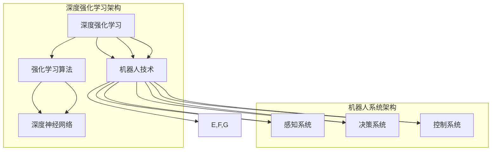

                 

### 文章标题

《深度强化学习在机器人技术中的突破性应用》

### 关键词

深度强化学习、机器人技术、算法实现、应用案例、突破性进展

### 摘要

本文旨在深入探讨深度强化学习在机器人技术中的突破性应用。通过梳理深度强化学习与机器人技术之间的核心联系，本文详细介绍了深度强化学习的基础概念、机器人技术的基本架构，以及深度强化学习在机器人技术中的具体应用场景。文章通过具体案例和算法解析，阐述了深度强化学习在机器人感知、决策和控制等方面的技术突破，并对未来发展趋势和挑战进行了展望。

### 确定书的核心主题和目标读者

#### 核心主题

《深度强化学习在机器人技术中的突破性应用》这本书的核心主题在于深入探讨深度强化学习（DRL）这一先进的人工智能技术，如何在机器人技术领域实现突破性应用。深度强化学习是一种结合了深度学习和强化学习的方法，它能够使机器人通过与环境交互来学习复杂任务，从而大大提升了机器人在动态和不确定环境中的自主决策能力。

#### 目标读者

本书的目标读者主要包括以下几类：

1. **机器人工程师**：他们对机器人技术的原理和应用有较为深入的了解，希望借助深度强化学习提升机器人系统的智能化水平。
2. **计算机科学家**：他们对深度学习和强化学习算法有研究兴趣，希望了解这些算法在机器人领域的应用潜力。
3. **相关领域的研究人员**：包括人工智能、控制理论、自动化等相关领域的研究人员，他们希望通过本书了解深度强化学习在机器人技术中的最新进展。

### 设计核心概念和架构的 Mermaid 流程图

为了更好地展示深度强化学习与机器人技术之间的联系，我们可以使用 Mermaid 流程图来描述这一架构。以下是一个简化的 Mermaid 流程图示例：



在这个流程图中，深度强化学习通过强化学习算法与深度神经网络结合，形成了一套强大的学习框架，这一框架可以应用于机器人技术中的感知系统、决策系统和控制系统。通过与环境交互，机器人系统能够不断优化其行为策略，实现自主学习和决策。

### 设计章节标题，细化到 1,2,3 级目录

以下是本书的详细章节目录结构：

#### 第1章: 深度强化学习基础
- **1.1 核心概念与联系**
  - **1.1.1 强化学习的定义与原理**
  - **1.1.2 深度神经网络的基本概念**
  - **1.1.3 深度强化学习的核心思想**
- **1.2 强化学习算法**
  - **1.2.1 Q-学习算法**
  - **1.2.2 SARSA算法**
  - **1.2.3 DQN算法**
- **1.3 深度强化学习原理**
  - **1.3.1 经验回放（Experience Replay）**
  - **1.3.2 双层网络架构（Double DQN）**
  - **1.3.3 优势估计（Advantage Function）**

#### 第2章: 机器人技术基础
- **2.1 机器人系统架构**
  - **2.1.1 机器人的基本组成部分**
  - **2.1.2 机器人控制系统的设计**
  - **2.1.3 机器人的感知与决策**
- **2.2 机器人感知与控制**
  - **2.2.1 传感器与感知系统**
  - **2.2.2 控制算法与执行器**
  - **2.2.3 实时性要求与挑战**
- **2.3 机器人决策与规划**
  - **2.3.1 决策理论基础**
  - **2.3.2 机器人路径规划算法**
  - **2.3.3 动作空间与状态空间建模**

#### 第3章: 深度强化学习在机器人技术中的应用
- **3.1 应用场景分析**
  - **3.1.1 自动驾驶汽车**
  - **3.1.2 机器人导航与地图构建**
  - **3.1.3 机器人协作与交互**
- **3.2 算法实现与优化**
  - **3.2.1 实现深度强化学习的挑战**
  - **3.2.2 优化策略与算法选择**
  - **3.2.3 实验设计与性能评估**
- **3.3 案例研究：突破性应用实例**
  - **3.3.1 研究背景与目标**
  - **3.3.2 案例实现步骤与细节**
  - **3.3.3 案例分析与效果评估**

#### 第4章: 机器人系统的深度强化学习架构
- **4.1 整体架构设计**
  - **4.1.1 深度强化学习在机器人系统中的角色**
  - **4.1.2 整体架构的模块划分与功能**
  - **4.1.3 模块间的交互与数据流动**
- **4.2 感知与决策融合**
  - **4.2.1 感知信息的处理与融合**
  - **4.2.2 决策模型的设计与实现**
  - **4.2.3 感知与决策的协同优化**
- **4.3 适应性与鲁棒性**
  - **4.3.1 适应环境的动态调整**
  - **4.3.2 鲁棒性评估与优化策略**
  - **4.3.3 失效检测与恢复机制**

#### 第5章: 核心算法原理讲解
- **5.1 伪代码阐述**
  - **5.1.1 Q-Learning算法的伪代码**
  - **5.1.2 DQN算法的伪代码**
  - **5.1.3 A3C算法的伪代码**
- **5.2 数学模型与公式**
  - **5.2.1 强化学习的基本数学模型**
  - **5.2.2 深度神经网络的结构与参数**
  - **5.2.3 经验回放机制**
- **5.3 举例说明**
  - **5.3.1 自动驾驶中的Q-Learning应用实例**
  - **5.3.2 机器人导航中的DQN应用实例**
  - **5.3.3 协作机器人中的A3C应用实例**

#### 第6章: 项目实战与代码解析
- **6.1 开发环境搭建**
  - **6.1.1 Python环境配置**
  - **6.1.2 相关库和工具的安装**
  - **6.1.3 环境配置与调试**
- **6.2 实际案例与实现**
  - **6.2.1 自动驾驶案例介绍**
  - **6.2.2 机器人导航案例介绍**
  - **6.2.3 协作机器人案例介绍**
- **6.3 代码解读与分析**
  - **6.3.1 自动驾驶案例代码解读**
  - **6.3.2 机器人导航案例代码解读**
  - **6.3.3 协作机器人案例代码解读**

#### 第7章: 未来展望与挑战
- **7.1 技术发展趋势**
  - **7.1.1 深度强化学习的最新研究动态**
  - **7.1.2 机器人技术的未来发展方向**
  - **7.1.3 深度强化学习与机器人技术的融合趋势**
- **7.2 应用前景**
  - **7.2.1 自动驾驶的广泛应用**
  - **7.2.2 机器人服务的普及**
  - **7.2.3 机器人技术在工业、医疗等领域的应用潜力**
- **7.3 挑战与解决方案**
  - **7.3.1 算法复杂性与计算资源限制**
  - **7.3.2 鲁棒性与安全性**
  - **7.3.3 法律法规与伦理道德**

### 确保目录大纲的完整性，包含核心概念与联系、核心算法原理讲解、数学模型和数学公式、项目实战与代码解析等核心内容

为了确保目录大纲的完整性，我们将各个章节的核心内容进行了详细划分，每个章节都涵盖了核心概念与联系、核心算法原理讲解、数学模型和数学公式、项目实战与代码解析等方面。

- **第1章** 深度强化学习基础，涵盖了深度强化学习的核心概念与联系，强化学习算法的介绍，以及深度强化学习的基本原理。
- **第2章** 机器人技术基础，介绍了机器人系统的基本架构，感知与控制系统的设计，以及机器人决策与规划的理论基础。
- **第3章** 深度强化学习在机器人技术中的应用，分析了深度强化学习在自动驾驶、机器人导航、机器人协作等应用场景中的实际效果，并讨论了算法实现与优化的策略。
- **第4章** 机器人系统的深度强化学习架构，详细介绍了机器人系统中深度强化学习的整体架构设计，感知与决策的融合机制，以及适应性与鲁棒性的优化策略。
- **第5章** 核心算法原理讲解，通过伪代码、数学模型和公式、举例说明等方式，深入阐述了Q-Learning、DQN、A3C等核心算法的原理。
- **第6章** 项目实战与代码解析，通过实际案例，详细讲解了开发环境搭建、实际案例与实现，以及代码解读与分析。
- **第7章** 未来展望与挑战，对深度强化学习在机器人技术中的发展趋势、应用前景以及面临的挑战进行了分析和讨论。

这样的结构设计确保了目录大纲的完整性，使得读者可以系统地学习和理解深度强化学习在机器人技术中的突破性应用。

### 将目录大纲用 markdown 格式输出，确保简洁性和可读性

以下是《深度强化学习在机器人技术中的突破性应用》的markdown格式目录大纲：

```
# 《深度强化学习在机器人技术中的突破性应用》目录大纲

## 第1章: 深度强化学习基础
- **1.1 核心概念与联系**
  - **1.1.1 强化学习的定义与原理**
  - **1.1.2 深度神经网络的基本概念**
  - **1.1.3 深度强化学习的核心思想**
- **1.2 强化学习算法**
  - **1.2.1 Q-学习算法**
  - **1.2.2 SARSA算法**
  - **1.2.3 DQN算法**
- **1.3 深度强化学习原理**
  - **1.3.1 经验回放（Experience Replay）**
  - **1.3.2 双层网络架构（Double DQN）**
  - **1.3.3 优势估计（Advantage Function）**

## 第2章: 机器人技术基础
- **2.1 机器人系统架构**
  - **2.1.1 机器人的基本组成部分**
  - **2.1.2 机器人控制系统的设计**
  - **2.1.3 机器人的感知与决策**
- **2.2 机器人感知与控制**
  - **2.2.1 传感器与感知系统**
  - **2.2.2 控制算法与执行器**
  - **2.2.3 实时性要求与挑战**
- **2.3 机器人决策与规划**
  - **2.3.1 决策理论基础**
  - **2.3.2 机器人路径规划算法**
  - **2.3.3 动作空间与状态空间建模**

## 第3章: 深度强化学习在机器人技术中的应用
- **3.1 应用场景分析**
  - **3.1.1 自动驾驶汽车**
  - **3.1.2 机器人导航与地图构建**
  - **3.1.3 机器人协作与交互**
- **3.2 算法实现与优化**
  - **3.2.1 实现深度强化学习的挑战**
  - **3.2.2 优化策略与算法选择**
  - **3.2.3 实验设计与性能评估**
- **3.3 案例研究：突破性应用实例**
  - **3.3.1 研究背景与目标**
  - **3.3.2 案例实现步骤与细节**
  - **3.3.3 案例分析与效果评估**

## 第4章: 机器人系统的深度强化学习架构
- **4.1 整体架构设计**
  - **4.1.1 深度强化学习在机器人系统中的角色**
  - **4.1.2 整体架构的模块划分与功能**
  - **4.1.3 模块间的交互与数据流动**
- **4.2 感知与决策融合**
  - **4.2.1 感知信息的处理与融合**
  - **4.2.2 决策模型的设计与实现**
  - **4.2.3 感知与决策的协同优化**
- **4.3 适应性与鲁棒性**
  - **4.3.1 适应环境的动态调整**
  - **4.3.2 鲁棒性评估与优化策略**
  - **4.3.3 失效检测与恢复机制**

## 第5章: 核心算法原理讲解
- **5.1 伪代码阐述**
  - **5.1.1 Q-Learning算法的伪代码**
  - **5.1.2 DQN算法的伪代码**
  - **5.1.3 A3C算法的伪代码**
- **5.2 数学模型与公式**
  - **5.2.1 强化学习的基本数学模型**
  - **5.2.2 深度神经网络的结构与参数**
  - **5.2.3 经验回放机制**
- **5.3 举例说明**
  - **5.3.1 自动驾驶中的Q-Learning应用实例**
  - **5.3.2 机器人导航中的DQN应用实例**
  - **5.3.3 协作机器人中的A3C应用实例**

## 第6章: 项目实战与代码解析
- **6.1 开发环境搭建**
  - **6.1.1 Python环境配置**
  - **6.1.2 相关库和工具的安装**
  - **6.1.3 环境配置与调试**
- **6.2 实际案例与实现**
  - **6.2.1 自动驾驶案例介绍**
  - **6.2.2 机器人导航案例介绍**
  - **6.2.3 协作机器人案例介绍**
- **6.3 代码解读与分析**
  - **6.3.1 自动驾驶案例代码解读**
  - **6.3.2 机器人导航案例代码解读**
  - **6.3.3 协作机器人案例代码解读**

## 第7章: 未来展望与挑战
- **7.1 技术发展趋势**
  - **7.1.1 深度强化学习的最新研究动态**
  - **7.1.2 机器人技术的未来发展方向**
  - **7.1.3 深度强化学习与机器人技术的融合趋势**
- **7.2 应用前景**
  - **7.2.1 自动驾驶的广泛应用**
  - **7.2.2 机器人服务的普及**
  - **7.2.3 机器人技术在工业、医疗等领域的应用潜力**
- **7.3 挑战与解决方案**
  - **7.3.1 算法复杂性与计算资源限制**
  - **7.3.2 鲁棒性与安全性**
  - **7.3.3 法律法规与伦理道德**
```

这样的markdown格式不仅保证了目录的简洁性，同时也使得目录结构清晰、层次分明，方便读者快速查找和阅读各个章节的内容。

