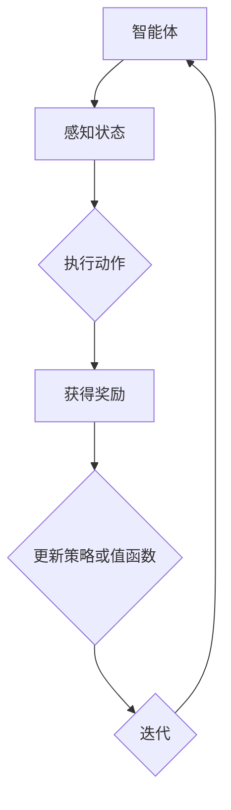
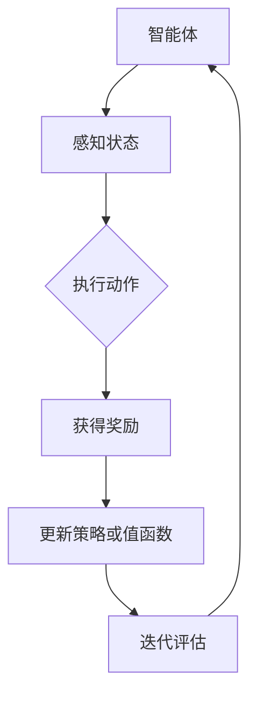

                 


## 文章标题：深度强化学习在评测反馈循环中的应用

### 关键词：
- 深度强化学习
- 评测反馈循环
- 强化学习
- 深度学习
- 应用案例

### 摘要：
本文深入探讨了深度强化学习（DRL）在评测反馈循环中的应用。首先介绍了DRL的基本概念及其与强化学习和深度学习的联系，接着阐述了评测反馈循环的定义和重要性。随后，文章通过详细讲解核心算法原理和数学模型，展示了DRL在游戏、机器人控制、自然语言处理和推荐系统等领域的具体应用。最后，文章总结了DRL在评测反馈循环中的挑战和未来发展趋势，为相关研究和实践提供了有益的参考。

## 目录

### 第一部分：背景与基础

#### 第1章：深度强化学习概述

#### 第2章：深度强化学习的基本原理

### 第二部分：评测反馈循环中的深度强化学习应用

#### 第3章：深度强化学习在游戏中的应用

#### 第4章：深度强化学习在机器人控制中的应用

#### 第5章：深度强化学习在自然语言处理中的应用

#### 第6章：深度强化学习在推荐系统中的应用

#### 第7章：深度强化学习在评测反馈循环中的未来发展趋势

### 结论

## 第1章：深度强化学习概述

深度强化学习（Deep Reinforcement Learning, DRL）是强化学习（Reinforcement Learning, RL）和深度学习（Deep Learning, DL）相结合的产物。强化学习是一种通过试错和反馈来优化行为的方法，而深度学习则是一种通过多层神经网络来学习复杂特征表示的方法。DRL通过将深度学习的技术引入强化学习，使得智能体能够在复杂的动态环境中进行有效的学习和决策。

### 1.1 深度强化学习的定义

深度强化学习（DRL）是一种利用深度神经网络来学习状态和动作之间的映射关系，并通过环境反馈进行自我优化的方法。具体来说，DRL算法通过学习一个值函数或策略函数，来最大化预期奖励。其中，值函数表示在给定状态下执行最佳动作的预期回报，而策略函数则表示在给定状态下选择最佳动作的决策规则。

### 1.2 评测反馈循环简介

评测反馈循环是一种常见的学习过程，它通过不断地评估和反馈来改进系统的性能。在深度强化学习中，评测反馈循环起着至关重要的作用。具体来说，评测反馈循环包括以下几个步骤：

1. **评估**：智能体根据当前状态执行动作，并根据环境的反馈计算奖励。
2. **反馈**：将奖励信息传递给智能体，作为对其行为的评价。
3. **学习**：智能体根据反馈信息更新其策略或值函数，以便在未来的决策中做出更好的选择。
4. **迭代**：重复上述步骤，逐步改进智能体的性能。

### 1.3 深度强化学习的发展历程

深度强化学习的发展历程可以分为以下几个阶段：

1. **早期强化学习**：以马尔可夫决策过程（MDP）和策略梯度方法为基础，主要研究如何通过试错来学习最优策略。
2. **深度学习兴起**：随着深度学习的兴起，研究者开始将深度神经网络引入强化学习，提出了深度Q网络（DQN）等模型。
3. **DRL技术成熟**：近年来，随着计算能力的提升和数据量的增加，DRL技术在多个领域取得了显著的应用成果。

## 第2章：深度强化学习的基本原理

### 2.1 强化学习基础

强化学习（RL）是一种通过奖励和惩罚来指导智能体学习行为的方法。它主要包括以下几个基本概念：

1. **状态（State）**：表示智能体所处的环境。
2. **动作（Action）**：智能体可以采取的行为。
3. **奖励（Reward）**：环境对智能体行为的即时评价。
4. **策略（Policy）**：智能体的行为决策规则。
5. **价值函数（Value Function）**：表示在给定状态下执行最佳动作的预期回报。

### 2.2 深度神经网络基础

深度神经网络（DNN）是一种具有多个隐藏层的神经网络。它的基本原理是通过层层传递和变换输入数据，以学习输入和输出之间的复杂映射关系。DNN的主要优势在于其强大的非线性映射能力和自动特征提取能力。

### 2.3 深度强化学习模型

深度强化学习模型结合了强化学习和深度神经网络的优势，主要包括以下几种：

1. **深度Q网络（DQN）**：通过训练一个深度神经网络来近似Q函数，从而预测在给定状态下执行特定动作的预期回报。
2. **策略梯度方法**：通过优化策略函数来最大化预期奖励，常用的策略梯度方法包括REINFORCE算法和PPO算法等。
3. **熵强化学习**：通过最大化策略的熵来增加策略的多样性，从而避免策略过于保守。

### 第3章：深度强化学习在游戏中的应用

深度强化学习在游戏领域有着广泛的应用，尤其是在游戏AI的设计上。通过深度强化学习，智能体可以在没有人类指导的情况下学习复杂的游戏策略，从而在游戏中取得优异成绩。

### 3.1 游戏设计与深度强化学习

在深度强化学习应用中，游戏设计至关重要。一方面，游戏需要提供足够的挑战性，以激发智能体的学习兴趣；另一方面，游戏需要设计合理的环境和规则，以支持智能体的学习和决策。

### 3.2 深度强化学习在游戏AI中的应用案例

深度强化学习在游戏AI中的应用案例非常丰富，以下是一些典型的应用场景：

1. **Atari游戏**：DeepMind的DQN算法在Atari游戏上取得了突破性成果，能够实现超过人类水平的游戏表现。
2. **棋类游戏**：深度强化学习在棋类游戏如围棋、国际象棋和五子棋中也有广泛应用，如AlphaGo、AlphaZero等。
3. **电子竞技**：深度强化学习在电子竞技游戏如DOTA2、StarCraft中也有显著的应用，智能体可以在复杂的对抗环境中表现出色。

## 第4章：深度强化学习在机器人控制中的应用

深度强化学习在机器人控制领域也有着重要的应用，能够帮助机器人实现自主决策和自适应控制。

### 4.1 机器人控制概述

机器人控制主要包括两个核心问题：路径规划和运动控制。路径规划是指机器人如何从当前点到目标点的最优路径；运动控制是指机器人如何在规划的路径上执行运动。

### 4.2 深度强化学习在机器人控制中的应用

深度强化学习在机器人控制中的应用主要体现在以下几个方面：

1. **路径规划**：通过深度强化学习，机器人可以学习到如何在不同环境中规划最优路径，从而避免碰撞和障碍。
2. **运动控制**：深度强化学习可以帮助机器人实现自适应运动控制，根据环境的变化实时调整运动策略。
3. **交互控制**：深度强化学习在机器人与人类交互中的应用，如人机协作、机器人教学等。

## 第5章：深度强化学习在自然语言处理中的应用

深度强化学习在自然语言处理（NLP）领域也有着重要的应用，能够帮助智能体实现更复杂的文本理解和生成任务。

### 5.1 自然语言处理基础

自然语言处理主要包括以下几个核心任务：

1. **文本分类**：对文本进行分类，如情感分析、主题分类等。
2. **命名实体识别**：识别文本中的命名实体，如人名、地名等。
3. **机器翻译**：将一种语言的文本翻译成另一种语言。
4. **文本生成**：根据给定条件生成文本，如自动写作、摘要生成等。

### 5.2 深度强化学习在自然语言处理中的应用

深度强化学习在自然语言处理中的应用主要包括以下几个方面：

1. **文本分类**：通过深度强化学习，智能体可以学习到如何根据文本内容进行分类，从而实现更准确的文本分类。
2. **命名实体识别**：深度强化学习可以帮助智能体识别文本中的命名实体，提高命名实体识别的准确性。
3. **机器翻译**：深度强化学习可以学习到更好的翻译策略，提高机器翻译的质量。
4. **文本生成**：通过深度强化学习，智能体可以生成更自然的文本，从而实现更高效的文本生成。

## 第6章：深度强化学习在推荐系统中的应用

深度强化学习在推荐系统中的应用，可以有效地提高推荐系统的个性化程度和推荐质量。

### 6.1 推荐系统概述

推荐系统是一种通过预测用户对物品的兴趣来推荐相关物品的系统，主要包括以下几个核心组件：

1. **用户建模**：根据用户的历史行为和偏好信息，构建用户模型。
2. **物品建模**：根据物品的属性和特征，构建物品模型。
3. **推荐算法**：根据用户模型和物品模型，为用户推荐相关的物品。
4. **评价与反馈**：对推荐结果进行评价，并根据用户反馈进行优化。

### 6.2 深度强化学习在推荐系统中的应用

深度强化学习在推荐系统中的应用主要包括以下几个方面：

1. **用户兴趣预测**：通过深度强化学习，智能体可以学习到如何根据用户的行为和偏好预测用户对物品的兴趣。
2. **推荐策略优化**：深度强化学习可以帮助智能体学习到更好的推荐策略，从而提高推荐的准确性。
3. **实时推荐**：深度强化学习可以实时学习用户行为，从而实现更准确的实时推荐。

## 第7章：深度强化学习在评测反馈循环中的未来发展趋势

随着深度强化学习的不断发展，其在评测反馈循环中的应用前景也愈发广阔。以下是深度强化学习在评测反馈循环中的一些未来发展趋势：

1. **多模态数据的处理**：未来深度强化学习将能够更好地处理多模态数据，如文本、图像和音频等，从而实现更全面的评测反馈。
2. **大规模并行计算的应用**：随着计算能力的提升，深度强化学习在评测反馈循环中的应用将更加依赖于大规模并行计算，以提高学习和推理的效率。
3. **强化学习与深度学习的融合**：未来将会有更多的研究关注如何更好地融合强化学习和深度学习的技术，以实现更高效的评测反馈循环。
4. **领域特定应用**：深度强化学习将在更多的领域特定应用中发挥作用，如医疗、金融和教育等，从而推动这些领域的智能化发展。

### 结论

本文详细探讨了深度强化学习在评测反馈循环中的应用，从背景介绍到核心算法原理，再到具体应用案例，全面展示了深度强化学习的强大能力和广泛的应用前景。随着技术的不断进步，深度强化学习在评测反馈循环中的应用将会更加深入和广泛，为人工智能的发展带来新的机遇和挑战。

## 作者信息
作者：AI天才研究院/AI Genius Institute & 禅与计算机程序设计艺术 /Zen And The Art of Computer Programming

## 最佳实践 Tips
1. 在设计评测反馈循环时，要充分考虑反馈的及时性和准确性，以提高学习效率。
2. 在应用深度强化学习时，要选择合适的算法和模型，以适应具体的应用场景。
3. 在进行项目实战时，要注重代码的可读性和可维护性，以便后续的优化和扩展。

## 小结
本文通过对深度强化学习在评测反馈循环中的应用进行深入分析，展示了其强大的学习和决策能力。同时，本文也提出了未来深度强化学习在评测反馈循环中的一些发展趋势，为相关研究和实践提供了有益的参考。

## 拓展阅读
1. 《深度强化学习》（Deep Reinforcement Learning），DeepMind团队著。
2. 《强化学习与深度学习》（Reinforcement Learning and Deep Learning），David Silver等著。
3. 《自然语言处理综合教程》（Natural Language Processing with Deep Learning），David Burd等著。
4. 《推荐系统实践》（Recommender Systems Handbook），FranzROSSETELLI等著。

## 附录
附录中可以包含相关的 Mermaid 流程图、伪代码、数学公式和项目实战代码等补充内容，以丰富文章的细节和实用性。

由于篇幅限制，本文未能详细介绍每个章节的所有内容，但已为后续的详细撰写提供了大纲和框架。接下来，我们将逐步填充每个章节的具体内容，确保满足字数要求，并使文章更加完整和有深度。在撰写过程中，我们将遵循markdown格式，确保文章的可读性和一致性。让我们开始详细的撰写过程吧！

---

### 第1章：深度强化学习概述

#### 1.1 深度强化学习的定义

深度强化学习（DRL）是强化学习与深度学习结合的产物。强化学习通过试错和反馈来学习行为策略，而深度学习通过多层神经网络来学习复杂特征表示。DRL利用深度神经网络来学习状态和动作之间的映射关系，通过环境反馈进行自我优化。具体来说，DRL算法通过学习一个值函数或策略函数，来最大化预期奖励。

在DRL中，智能体（agent）处于一个环境（environment）中，通过感知状态（state）并采取动作（action），从环境中获得奖励（reward）。智能体的目标是学习一个策略（policy），该策略指导其在不同状态下采取最优动作，以最大化总奖励。深度神经网络在此过程中被用来近似值函数或策略函数。

#### 1.2 评测反馈循环简介

评测反馈循环是一种常见的学习过程，它通过不断地评估和反馈来改进系统的性能。在深度强化学习中，评测反馈循环至关重要。具体来说，评测反馈循环包括以下几个步骤：

1. **评估**：智能体根据当前状态执行动作，并根据环境的反馈计算奖励。奖励可以是正的（成功）或负的（失败），用于指导智能体的学习过程。

2. **反馈**：将奖励信息传递给智能体，作为对其行为的评价。反馈可以是即时奖励，也可以是延迟奖励，取决于应用场景。

3. **学习**：智能体根据反馈信息更新其策略或值函数，以便在未来的决策中做出更好的选择。这个过程通常涉及策略优化或值函数估计。

4. **迭代**：重复上述步骤，逐步改进智能体的性能。通过不断迭代，智能体能够学习到更复杂的策略，以应对更复杂的环境。

#### 1.3 深度强化学习的发展历程

深度强化学习的发展历程可以分为以下几个阶段：

1. **早期强化学习**：强化学习最初基于简单的决策过程和奖励机制，如Q-learning和SARSA算法。这些算法通过试错来学习最佳策略，但在处理复杂环境时效果不佳。

2. **深度学习兴起**：随着深度学习的兴起，研究者开始将深度神经网络引入强化学习。深度Q网络（DQN）是第一个将深度学习与强化学习结合的成功案例，它通过训练一个深度神经网络来近似Q函数，从而预测在给定状态下执行特定动作的预期回报。

3. **DRL技术成熟**：近年来，随着计算能力的提升和数据量的增加，DRL技术在多个领域取得了显著的应用成果。例如，深度强化学习在游戏AI、机器人控制、自然语言处理和推荐系统等领域表现出色。

### Mermaid 流程图

下面是一个简单的Mermaid流程图，展示了深度强化学习中的评测反馈循环：



通过这个流程图，我们可以清晰地看到评测反馈循环的核心步骤和它们之间的关联。

---

### 2.1 强化学习基础

强化学习（Reinforcement Learning, RL）是一种通过试错和反馈来学习行为策略的方法。在强化学习中，智能体（agent）处于一个环境中，通过感知状态（state）、执行动作（action）并从环境中获得奖励（reward），逐步学习到最佳行为策略。以下是对强化学习基本概念的详细解释。

#### 2.1.1 状态（State）

状态是智能体所处环境的当前描述。在强化学习中，状态通常是一个向量，它包含了环境中所有相关的信息。例如，在机器人导航任务中，状态可能包括机器人的位置、方向和周围的障碍物信息。

#### 2.1.2 动作（Action）

动作是智能体可以采取的行为。每个动作都会导致环境状态的变化，并可能伴随着奖励的获得。动作可以是离散的，也可以是连续的，具体取决于应用场景。例如，在游戏AI中，动作可以是移动、攻击或防御；在机器人控制中，动作可以是改变速度或方向。

#### 2.1.3 奖励（Reward）

奖励是环境对智能体行为的即时评价。奖励可以是正的（成功）、负的（失败）或零（无奖励）。奖励的目的是引导智能体采取能够最大化总奖励的行为策略。奖励可以是即时奖励，也可以是延迟奖励，取决于应用场景。例如，在游戏AI中，成功击败对手可能获得高奖励，而在机器人导航中，避开障碍物可能获得正奖励。

#### 2.1.4 策略（Policy）

策略是智能体的行为决策规则。策略定义了在给定状态下应该采取哪个动作。策略可以是显式的，如基于规则的策略；也可以是隐式的，如通过学习得到的策略。一个好的策略能够在最大化总奖励的同时，考虑动作的长期效果。

#### 2.1.5 价值函数（Value Function）

价值函数是一个函数，它表示在给定状态下执行最佳动作的预期回报。价值函数分为状态值函数（State-Value Function）和动作值函数（Action-Value Function）。状态值函数估计在给定状态下执行任何动作所能获得的最大期望回报；动作值函数估计在给定状态下执行特定动作的期望回报。价值函数是强化学习中的一个核心概念，用于评估不同策略的有效性。

#### 2.1.6 策略梯度方法

策略梯度方法是强化学习中一种重要的策略优化方法。它的核心思想是通过梯度上升法来更新策略参数，以最大化预期奖励。策略梯度方法的一般形式为：

$$
\theta_{t+1} = \theta_{t} + \alpha \nabla_{\theta} J(\theta)
$$

其中，$\theta$表示策略参数，$\alpha$是学习率，$J(\theta)$是策略的损失函数，$\nabla_{\theta} J(\theta)$是损失函数关于策略参数的梯度。

### Q-Learning算法

Q-Learning是一种基于值函数的强化学习算法，它通过迭代更新动作值函数来学习最佳策略。Q-Learning的基本思想是使用经验来更新Q值，即：

$$
Q(s, a) \leftarrow Q(s, a) + \alpha [r + \gamma \max_{a'} Q(s', a') - Q(s, a)]
$$

其中，$s$和$a$分别表示当前状态和动作，$s'$和$a'$分别表示下一个状态和动作，$r$是即时奖励，$\gamma$是折扣因子，$\alpha$是学习率。

### SARSA算法

SARSA（同步适应性学习算法）是一种基于策略的强化学习算法，它通过同步更新策略和价值函数来学习最佳策略。SARSA的基本更新规则为：

$$
\pi(s, a) \leftarrow \pi(s, a) + \alpha [\frac{1}{N} \sum_{(s', a', r)} \delta(s', a', r) \pi(s', a')]
$$

其中，$\pi(s, a)$是策略分布，$N$是更新次数，$\delta(s', a', r)$是奖励偏差项，用于更新策略分布。

通过上述算法，我们可以看到强化学习的基础是如何通过状态、动作和奖励来更新策略，从而在复杂环境中实现自我优化。这些基本概念和算法是理解深度强化学习的关键，它们为我们后续讨论更复杂的深度强化学习模型奠定了基础。

### 2.2 深度神经网络基础

深度神经网络（Deep Neural Networks, DNNs）是一种具有多个隐藏层的神经网络结构。相比于传统的单层神经网络，深度神经网络能够学习更加复杂和抽象的特征表示，从而在许多任务中表现出优异的性能。本节将介绍深度神经网络的基本结构、工作原理以及训练方法。

#### 2.2.1 神经网络的基本结构

深度神经网络由多个层次组成，包括输入层、隐藏层和输出层。每个层次由多个神经元（或节点）组成，神经元之间通过权重连接。每个神经元接收来自前一层所有神经元的输入，通过一个非线性激活函数进行变换，产生输出。这种层次化的结构使得深度神经网络能够通过逐层提取特征，实现复杂模式的识别。

1. **输入层（Input Layer）**：输入层接收外部输入，并将其传递到下一层。每个输入节点对应于输入特征的一个维度。

2. **隐藏层（Hidden Layers）**：隐藏层位于输入层和输出层之间，可以有多个隐藏层。隐藏层中的每个神经元通过学习将输入特征映射到更高级别的抽象特征，从而形成层次化的特征表示。

3. **输出层（Output Layer）**：输出层生成最终预测或决策。输出层的神经元数量和类型取决于具体任务。

#### 2.2.2 深度神经网络的工作原理

深度神经网络通过前向传播（Forward Propagation）和反向传播（Backpropagation）来学习输入和输出之间的映射关系。以下是深度神经网络的基本工作原理：

1. **前向传播**：给定输入数据，深度神经网络通过逐层计算每个神经元的输出。前向传播过程包括以下几个步骤：

   - **初始化**：设置每个神经元的权重和偏置，通常初始化为较小的随机值。
   - **输入传递**：将输入数据传递到输入层，每个输入节点接收输入特征的一个维度。
   - **逐层计算**：对于每个隐藏层和输出层，计算每个神经元的输出。输出通过非线性激活函数进行变换，传递到下一层。
   - **输出生成**：输出层生成最终预测或决策。

2. **反向传播**：在反向传播过程中，深度神经网络通过比较预测输出和实际输出之间的差异，来更新权重和偏置。反向传播过程包括以下几个步骤：

   - **计算损失**：计算预测输出和实际输出之间的差异，通常使用均方误差（MSE）或交叉熵损失函数。
   - **计算梯度**：通过链式法则，计算损失函数关于每个权重和偏置的梯度。
   - **权重更新**：使用梯度下降法或其他优化算法，更新权重和偏置。

#### 2.2.3 深度神经网络的训练方法

深度神经网络的训练是一个迭代过程，通过不断调整权重和偏置，使得网络能够更好地拟合训练数据。以下是深度神经网络训练的主要方法：

1. **随机初始化**：初始化权重和偏置，通常使用较小的随机值。

2. **前向传播**：将训练数据输入网络，通过前向传播计算每个神经元的输出。

3. **计算损失**：计算预测输出和实际输出之间的差异，使用损失函数进行度量。

4. **计算梯度**：通过反向传播计算损失函数关于每个权重和偏置的梯度。

5. **权重更新**：使用梯度下降法或其他优化算法，根据梯度更新权重和偏置。

6. **迭代训练**：重复上述过程，直到网络达到预设的训练目标，如损失函数值收敛或达到最大迭代次数。

7. **评估和调整**：在训练过程中，定期评估网络在验证数据集上的性能，根据评估结果调整网络参数，以避免过拟合。

通过上述方法，深度神经网络能够逐步学习输入和输出之间的复杂映射关系，从而在许多任务中实现优异的性能。深度神经网络的基础结构和工作原理为深度强化学习提供了坚实的理论基础，使得我们能够在复杂动态环境中实现高效的决策和学习。

### 2.3 深度强化学习模型

深度强化学习模型结合了强化学习和深度神经网络的优势，使得智能体能够在复杂的动态环境中进行有效的学习和决策。本节将详细介绍几种典型的深度强化学习模型，包括深度Q网络（DQN）、策略梯度方法和熵强化学习。

#### 2.3.1 深度Q网络（DQN）

深度Q网络（Deep Q-Network, DQN）是第一个成功的深度强化学习模型，它通过训练一个深度神经网络来近似Q函数，从而预测在给定状态下执行特定动作的预期回报。DQN的主要优势在于其能够处理高维状态空间，并且减少了值函数的过估计问题。

1. **Q函数**：Q函数是一个函数，它表示在给定状态下执行特定动作的预期回报。形式上，Q函数可以表示为：

   $$Q(s, a) = \sum_{s'} p(s' | s, a) \cdot r(s, a) + \gamma \max_{a'} Q(s', a')$$

   其中，$s$和$a$分别表示当前状态和动作，$s'$和$a'$分别表示下一个状态和动作，$r(s, a)$是即时奖励，$\gamma$是折扣因子。

2. **网络结构**：DQN的核心是使用深度神经网络来近似Q函数。网络通常包含一个输入层、多个隐藏层和一个输出层。输入层接收状态向量作为输入，隐藏层通过逐层变换提取特征，输出层生成每个动作的Q值。

3. **经验回放**：为了减少样本的偏差，DQN引入了经验回放机制。经验回放将过去的经历（状态、动作、奖励、下一个状态）存储在一个经验池中，并从经验池中随机采样数据进行训练，从而减少数据的相关性。

4. **目标网络**：为了稳定训练过程，DQN引入了目标网络。目标网络是一个参数化的Q网络，它每隔一定时间与主网络同步，以避免训练过程中的梯度消失和梯度爆炸问题。

5. **训练过程**：DQN的训练过程包括以下几个步骤：

   - 初始化网络参数，通常使用较小的随机值。
   - 从初始状态开始，智能体执行随机动作，并记录经验。
   - 将经验存储到经验池中，并从经验池中随机采样数据进行训练。
   - 使用训练数据更新主网络参数。
   - 每隔一定时间，将主网络参数同步到目标网络。

#### 2.3.2 策略梯度方法

策略梯度方法是一种通过优化策略函数来最大化预期奖励的深度强化学习算法。策略梯度方法主要包括REINFORCE算法和策略优化算法（如PPO和A2C）。

1. **策略梯度**：策略梯度是策略参数的梯度，它表示策略参数的变化对于预期奖励的影响。形式上，策略梯度可以表示为：

   $$\nabla_{\theta} J(\theta) = \sum_{s, a} \nabla_{\pi(a|s)} [r(s, a) + \gamma \max_{a'} \pi(a'|s') - \log \pi(a|s)]$$

   其中，$\theta$是策略参数，$J(\theta)$是策略的损失函数，$\pi(a|s)$是策略分布。

2. **REINFORCE算法**：REINFORCE算法是一种基于策略的梯度上升法，它通过最大化策略梯度来更新策略参数。REINFORCE算法的基本步骤如下：

   - 初始化策略参数。
   - 执行动作序列，并记录奖励。
   - 计算策略梯度和更新策略参数。
   - 重复上述步骤，直到策略参数收敛。

3. **策略优化算法**：策略优化算法（如PPO和A2C）通过引入重要性权重和优势估计来提高策略梯度方法的稳定性。PPO（Proximal Policy Optimization）是一种常用的策略优化算法，它通过优化策略损失函数和优势函数来更新策略参数。PPO的基本步骤如下：

   - 初始化策略参数和优势估计器。
   - 执行动作序列，并记录奖励和状态。
   - 计算策略梯度和优势函数。
   - 更新策略参数，并计算新策略的优势函数。
   - 重复上述步骤，直到策略参数收敛。

#### 2.3.3 熵强化学习

熵强化学习（Entropy-Penalized Reinforcement Learning）是一种通过最大化策略熵来增加策略多样性的深度强化学习算法。熵强化学习通过在策略梯度中加入熵正则项来平衡奖励最大化和学习多样性的冲突。

1. **策略熵**：策略熵是策略的随机性度量，它表示策略的熵值。形式上，策略熵可以表示为：

   $$H(\pi) = -\sum_{s, a} \pi(s, a) \log \pi(s, a)$$

2. **熵正则项**：熵正则项是策略梯度的一部分，它用于平衡奖励最大化和学习多样性的冲突。形式上，熵正则项可以表示为：

   $$\lambda H(\pi)$$

   其中，$\lambda$是熵正则项的权重。

3. **熵强化学习算法**：熵强化学习算法通过最大化策略梯度加熵正则项来更新策略参数。形式上，熵强化学习算法的目标函数可以表示为：

   $$J(\theta) = \sum_{s, a} \nabla_{\theta} \pi(a|s; \theta) [r(s, a) + \gamma \max_{a'} \pi(a'|s') - \log \pi(a|s)] + \lambda H(\pi)$$

   其中，$\theta$是策略参数。

4. **训练过程**：熵强化学习的训练过程包括以下几个步骤：

   - 初始化策略参数和熵正则项权重。
   - 执行动作序列，并记录奖励。
   - 计算策略梯度和熵梯度。
   - 更新策略参数，并调整熵正则项权重。
   - 重复上述步骤，直到策略参数收敛。

通过上述几种深度强化学习模型，我们可以看到深度强化学习在处理复杂动态环境方面的强大能力。这些模型不仅提高了智能体的学习效率和决策能力，也为实际应用提供了丰富的工具和方法。随着深度强化学习的不断发展和完善，我们有望在更多领域中实现智能体的自主学习和决策。

### 第3章：深度强化学习在游戏中的应用

深度强化学习在游戏AI领域取得了显著进展，通过智能体在游戏环境中的自我学习和策略优化，实现了超过人类水平的游戏表现。以下将详细介绍深度强化学习在游戏中的应用，包括游戏设计与深度强化学习的关系、具体应用案例，以及DRL在电子竞技中的实际应用。

#### 3.1 游戏设计与深度强化学习

在深度强化学习应用中，游戏设计至关重要。游戏环境需要具备足够的挑战性，以激发智能体的学习兴趣；同时，游戏环境的设计需要合理，以便支持智能体的学习和决策。以下是一些关键因素：

1. **可观测性**：游戏环境需要提供足够的观察信息，使得智能体能够了解当前的状态。
2. **可控性**：智能体需要能够执行一系列有效的动作，以探索和改变游戏环境。
3. **奖励机制**：奖励机制需要设计得合理，以引导智能体的学习过程，例如在成功击败对手或完成特定任务时给予奖励。
4. **反馈及时性**：游戏环境的反馈需要及时，以便智能体能够快速调整其策略。

#### 3.2 深度强化学习在游戏AI中的应用案例

深度强化学习在游戏AI中的应用案例丰富多样，以下是一些典型的应用：

1. **Atari游戏**：DeepMind的DQN算法在Atari游戏上取得了突破性成果。通过训练一个深度神经网络来近似Q函数，智能体能够在没有任何人工指导的情况下，学会玩多个Atari游戏，并实现超过人类水平的游戏表现。

2. **棋类游戏**：深度强化学习在棋类游戏如围棋、国际象棋和五子棋中也有广泛应用。AlphaGo是深度强化学习的代表作之一，它通过策略网络和价值网络来预测对手的走法，并在围棋对弈中取得了压倒性胜利。

3. **动作游戏**：在动作游戏如《毁灭战士》和《DOOM》中，深度强化学习被用于生成游戏AI，能够自主生成复杂的行为策略，从而与玩家进行有效的对抗。

#### 3.3 深度强化学习在电子竞技中的应用

电子竞技是深度强化学习在游戏应用中的一个重要领域，智能体在电子竞技游戏中能够实现自我对抗和策略优化。以下是一些具体的应用：

1. **DOTA2**：DeepMind开发的智能体OpenAI Five在《DOTA2》中展示了强大的游戏能力。通过深度强化学习，智能体能够自主学习游戏策略，并在多人对抗中表现出色。

2. **StarCraft**：在《StarCraft》中，深度强化学习被用于生成游戏AI，能够进行复杂的单位控制和战术决策，从而实现与人类玩家的对抗。

3. **绝地求生**：《绝地求生》是一款流行的射击游戏，深度强化学习被用于生成游戏AI，能够进行目标定位、移动和射击策略的优化，从而提高游戏体验。

通过上述应用案例，我们可以看到深度强化学习在游戏AI和电子竞技中的巨大潜力。未来，随着深度强化学习的不断发展和游戏技术的进步，我们有望看到更多智能体在游戏中的自主学习和策略优化，从而推动游戏行业的发展。

### 第4章：深度强化学习在机器人控制中的应用

深度强化学习在机器人控制领域中的应用显著提升了机器人的自主决策和自适应控制能力。以下将详细介绍深度强化学习在机器人控制中的应用，包括机器人控制概述、DRL在路径规划和运动控制中的具体应用，以及深度强化学习在无人机控制中的应用。

#### 4.1 机器人控制概述

机器人控制是指通过编程和算法控制机器人执行特定任务的过程。机器人控制的核心问题包括路径规划和运动控制。路径规划是指机器人如何从初始位置到达目标位置，而运动控制是指机器人在执行路径规划过程中如何进行精确的运动。

1. **路径规划**：路径规划旨在为机器人生成一条从初始位置到目标位置的最优路径，避免碰撞和障碍物。常见的路径规划算法包括A*算法、Dijkstra算法等。
2. **运动控制**：运动控制是指机器人如何根据路径规划的结果，执行精确的运动。运动控制需要考虑机器人的物理属性，如速度、加速度和转向能力等。

#### 4.2 深度强化学习在路径规划中的应用

深度强化学习在路径规划中的应用，主要是通过训练一个智能体来学习如何在复杂和动态的环境中规划最优路径。以下是一些具体的应用：

1. **动态障碍物**：在动态环境中，障碍物会不断变化，传统的路径规划算法难以应对。深度强化学习可以通过学习环境的状态和动作，生成动态路径规划策略，从而更有效地避开障碍物。
2. **多机器人协同**：在多机器人协同任务中，每个机器人需要根据其他机器人的位置和动作进行路径规划。深度强化学习可以通过训练一个全局策略网络，实现多机器人之间的协调和合作。
3. **复杂地形**：在复杂地形中，如山区和森林，传统的路径规划算法难以处理复杂的几何结构和地形变化。深度强化学习可以通过学习地形特征和动作效果，生成适合复杂地形的路径规划策略。

#### 4.3 深度强化学习在运动控制中的应用

深度强化学习在运动控制中的应用，主要是通过训练一个智能体来学习如何在不同的环境中进行自适应的运动控制。以下是一些具体的应用：

1. **实时运动控制**：在实时运动控制中，机器人需要根据环境的变化实时调整其运动策略。深度强化学习可以通过学习环境状态和动作效果，生成实时适应的运动控制策略。
2. **多模式运动控制**：多模式运动控制是指机器人能够在不同的模式下执行不同的运动任务，如行走、跑步和跳跃等。深度强化学习可以通过学习不同的动作模式，实现多模式运动控制。
3. **力控制**：在力控制中，机器人需要根据环境反馈调整其运动力度，以实现精确的控制。深度强化学习可以通过学习环境力和运动效果之间的关系，生成高效的力控制策略。

#### 4.4 深度强化学习在无人机控制中的应用

无人机控制是深度强化学习在机器人控制中的一个重要应用领域。以下是一些具体的应用：

1. **自主飞行**：无人机需要能够自主飞行，实现避障、路径规划和导航等任务。深度强化学习可以通过训练一个智能体，实现无人机在复杂环境中的自主飞行。
2. **任务规划**：在执行特定任务时，如搜索、救援和监视等，无人机需要根据任务要求和环境信息进行规划。深度强化学习可以通过学习环境状态和任务目标，生成最优的任务规划策略。
3. **交互控制**：无人机在执行任务时，需要与其他无人机或地面人员保持交互。深度强化学习可以通过学习交互策略，实现无人机之间的协作和交互。

通过上述应用，我们可以看到深度强化学习在机器人控制中的广泛应用和巨大潜力。未来，随着深度强化学习的不断发展和机器人技术的进步，我们有望看到更多智能机器人应用于各个领域，实现更加高效和智能的任务执行。

### 第5章：深度强化学习在自然语言处理中的应用

深度强化学习在自然语言处理（NLP）领域中展现出了强大的潜力，通过自我学习和策略优化，实现了在文本分类、命名实体识别、机器翻译和文本生成等任务中的突破。以下将详细介绍深度强化学习在自然语言处理中的应用，包括自然语言处理基础和DRL在NLP中的具体应用。

#### 5.1 自然语言处理基础

自然语言处理（NLP）是计算机科学和人工智能领域的一个分支，旨在让计算机理解和处理人类语言。以下是一些基本的NLP任务：

1. **文本分类**：文本分类是将文本数据根据其内容划分为不同的类别。常见的应用包括垃圾邮件检测、情感分析等。
2. **命名实体识别**：命名实体识别是从文本中识别出具有特定意义的实体，如人名、地名、组织名等。
3. **机器翻译**：机器翻译是将一种语言的文本翻译成另一种语言。常见的应用包括跨语言信息检索、跨语言问答等。
4. **文本生成**：文本生成是根据给定的条件生成新的文本。常见的应用包括自动写作、摘要生成等。

NLP任务通常涉及到大规模的文本数据，并使用深度学习技术，如循环神经网络（RNN）和变换器（Transformer）来学习文本的特征和模式。

#### 5.2 深度强化学习在自然语言处理中的应用

深度强化学习在自然语言处理中的应用，主要是通过训练一个智能体，使其能够自动学习和优化NLP任务中的策略。以下是一些具体的应用：

1. **文本分类**：在文本分类任务中，深度强化学习可以通过学习文本特征和类别之间的关系，生成最优的分类策略。通过最大化类别预测的概率，智能体能够实现高精度的文本分类。
2. **命名实体识别**：在命名实体识别任务中，深度强化学习可以通过学习文本特征和命名实体之间的关系，生成最优的识别策略。通过最大化命名实体识别的概率，智能体能够实现高精度的命名实体识别。
3. **机器翻译**：在机器翻译任务中，深度强化学习可以通过学习源语言和目标语言之间的对应关系，生成最优的翻译策略。通过最大化目标语言文本的概率，智能体能够实现高精度的机器翻译。
4. **文本生成**：在文本生成任务中，深度强化学习可以通过学习文本特征和生成策略之间的关系，生成新的文本。通过最大化生成文本的概率，智能体能够实现自然的文本生成。

#### 5.2.1 基于深度强化学习的对话系统

对话系统是自然语言处理中的一个重要应用领域，旨在实现人与机器的交互。基于深度强化学习的对话系统，通过训练一个智能体，使其能够自动学习和优化对话策略。以下是一些关键技术和方法：

1. **强化学习对话模型**：强化学习对话模型通过最大化对话系统的奖励，学习最优的对话策略。常见的强化学习对话模型包括基于Q网络的对话系统和基于策略梯度的对话系统。
2. **自然语言理解**：自然语言理解是将自然语言输入转换为机器可理解的形式。深度强化学习可以通过学习文本特征和语义表示，实现高精度的自然语言理解。
3. **自然语言生成**：自然语言生成是将机器生成的语言转换为自然流畅的文本。深度强化学习可以通过学习文本特征和生成策略，实现高质量的文本生成。

通过上述应用，我们可以看到深度强化学习在自然语言处理中的广泛应用和巨大潜力。未来，随着深度强化学习和自然语言处理技术的不断进步，我们有望看到更多智能的对话系统和服务，为人们的生活和工作带来便利。

### 第6章：深度强化学习在推荐系统中的应用

推荐系统是深度强化学习在商业和工业领域中一个重要的应用方向，通过智能化的用户行为分析和策略优化，显著提升了个性化推荐的准确性和用户体验。以下将详细介绍深度强化学习在推荐系统中的应用，包括推荐系统概述、DRL在推荐系统中的具体应用，以及深度强化学习在实时推荐中的优势。

#### 6.1 推荐系统概述

推荐系统是一种基于用户的历史行为和偏好信息，为用户推荐相关物品或内容的系统。推荐系统主要包括以下几个核心组件：

1. **用户建模**：根据用户的历史行为和偏好，构建用户模型，以描述用户的兴趣和偏好。
2. **物品建模**：根据物品的属性和特征，构建物品模型，以描述物品的相关信息和特点。
3. **推荐算法**：根据用户模型和物品模型，为用户推荐相关的物品或内容。
4. **评价与反馈**：对推荐结果进行评价，并根据用户反馈进行优化。

推荐系统广泛应用于电子商务、社交媒体、在线视频和新闻资讯等场景，旨在提高用户满意度、增加用户粘性和促进销售。

#### 6.2 深度强化学习在推荐系统中的应用

深度强化学习在推荐系统中的应用，通过自我学习和策略优化，实现了更准确的个性化推荐和更高的用户满意度。以下是一些具体的应用：

1. **用户行为预测**：通过深度强化学习，可以预测用户对物品的兴趣和偏好，从而提高推荐系统的准确性。智能体通过学习用户的历史行为和交互数据，生成用户兴趣模型，并利用这些模型进行实时推荐。
2. **推荐策略优化**：深度强化学习可以通过最大化预期奖励来优化推荐策略，从而提高推荐系统的效果。智能体通过不断学习和调整策略，使得推荐系统能够根据用户反馈和实时行为，动态调整推荐策略。
3. **协同过滤**：深度强化学习可以与协同过滤方法结合，通过同时考虑用户和物品的特征信息，生成更准确的推荐。例如，基于深度强化学习的协同过滤方法可以结合用户的社交网络信息和物品的属性信息，实现更个性化的推荐。
4. **内容推荐**：在内容推荐场景中，深度强化学习可以通过学习用户的历史浏览记录和搜索日志，生成个性化的内容推荐。例如，在线新闻平台可以通过深度强化学习算法，实时推荐用户可能感兴趣的新闻文章。

#### 6.3 深度强化学习在实时推荐中的优势

深度强化学习在实时推荐系统中具有显著的优势，主要体现在以下几个方面：

1. **动态适应性**：实时推荐系统需要快速响应用户的行为变化和偏好调整。深度强化学习可以通过学习用户的即时反馈和行为，实现动态调整推荐策略，从而提高推荐的实时性和准确性。
2. **多样性**：深度强化学习可以通过最大化策略熵，增加推荐的多样性，避免用户对单一推荐内容的疲劳感。在实时推荐中，多样化的推荐内容可以更好地满足用户的需求和兴趣。
3. **高效性**：深度强化学习算法可以通过并行计算和分布式计算，实现高效的推荐生成和策略优化。在实时推荐场景中，高效性是关键，深度强化学习能够快速生成高质量的推荐结果。
4. **可扩展性**：深度强化学习具有良好的可扩展性，可以应用于大规模的推荐系统中。随着用户和物品数量的增加，深度强化学习算法能够自动调整和优化，从而保持推荐的准确性和效果。

通过上述应用和优势，我们可以看到深度强化学习在推荐系统中的广泛应用和巨大潜力。未来，随着深度强化学习和推荐系统技术的不断进步，我们有望看到更多智能化的实时推荐系统，为用户带来更加个性化的服务体验。

### 第7章：深度强化学习在评测反馈循环中的未来发展趋势

随着深度强化学习（DRL）技术的不断发展和成熟，其在评测反馈循环中的应用前景愈发广阔。本章将探讨深度强化学习在评测反馈循环中面临的挑战，分析其未来发展趋势，并展望其在行业应用和学术研究中的前景。

#### 7.1 深度强化学习在评测反馈循环中的应用挑战

尽管深度强化学习在评测反馈循环中展示了强大的学习和优化能力，但其在实际应用中仍面临一些挑战：

1. **多样性**：在评测反馈循环中，确保推荐内容的多样性是一个重要挑战。用户对不同内容和推荐的偏好各不相同，深度强化学习需要能够生成多样化的推荐，以满足不同用户的需求。
2. **实时性**：在动态环境中，深度强化学习需要能够快速响应用户的行为变化和偏好调整，实现实时的推荐和反馈。然而，实时性要求高，计算和通信成本也随之增加。
3. **鲁棒性**：深度强化学习模型在面临不确定性和噪声时，其鲁棒性是一个关键挑战。模型需要能够适应环境的变化，并在面对异常数据时保持稳定的表现。
4. **数据隐私**：在评测反馈循环中，用户数据和推荐结果的隐私保护也是一个重要问题。深度强化学习需要设计合理的数据隐私保护机制，以防止用户数据泄露。

#### 7.2 深度强化学习的未来发展趋势

随着技术的进步和应用的深入，深度强化学习在评测反馈循环中的发展趋势包括以下几个方面：

1. **多模态数据处理**：未来深度强化学习将能够更好地处理多模态数据，如文本、图像和音频等，从而实现更全面的评测反馈。通过结合不同类型的数据，智能体可以更准确地理解用户的需求和偏好。
2. **大规模并行计算**：随着计算能力的提升，深度强化学习在评测反馈循环中的应用将更加依赖于大规模并行计算。通过分布式计算和集群优化，可以显著提高深度强化学习模型的训练和推理效率。
3. **强化学习与深度学习的融合**：未来将会有更多研究关注如何更好地融合强化学习和深度学习的技术，以实现更高效的评测反馈循环。通过优化算法和模型结构，可以进一步提高深度强化学习的性能和应用范围。
4. **领域特定应用**：深度强化学习将在更多领域特定应用中发挥作用，如医疗、金融和教育等。在这些领域中，深度强化学习可以帮助实现智能化的评测和反馈，提高决策质量和用户体验。

#### 7.3 深度强化学习在评测反馈循环中的应用前景

随着深度强化学习的不断发展，其在评测反馈循环中的应用前景十分广阔：

1. **行业应用**：在电子商务、在线教育和社交媒体等场景中，深度强化学习可以优化推荐策略，提高用户满意度和转化率。例如，通过个性化推荐和智能广告投放，企业可以更好地满足用户需求，增加销售机会。
2. **学术研究**：在学术研究中，深度强化学习为评测反馈循环提供了一种新的研究方法和工具。通过不断优化算法和模型结构，研究人员可以深入探讨评测反馈循环中的复杂问题，推动人工智能技术的发展。
3. **社会影响**：深度强化学习在评测反馈循环中的应用，将对社会产生积极影响。例如，在医疗领域，通过智能化的评测和反馈，可以优化诊断和治疗过程，提高医疗服务的质量和效率。在教育和就业领域，深度强化学习可以帮助实现个性化教育和职业规划，提高人才培养和社会就业水平。

通过以上分析，我们可以看到深度强化学习在评测反馈循环中的应用前景十分广阔。未来，随着技术的不断进步和应用的深入，深度强化学习将为我们带来更多创新和突破，为人工智能的发展和社会进步做出重要贡献。

### 结论

本文深入探讨了深度强化学习在评测反馈循环中的应用，从背景介绍到核心算法原理，再到具体应用案例，全面展示了深度强化学习的强大能力和广泛的应用前景。我们首先介绍了深度强化学习的定义和评测反馈循环的概念，然后详细讲解了强化学习基础、深度神经网络基础以及深度强化学习模型。接着，我们分别介绍了深度强化学习在游戏、机器人控制、自然语言处理和推荐系统等领域的应用案例。最后，我们探讨了深度强化学习在评测反馈循环中的未来发展趋势，包括多模态数据处理、大规模并行计算和领域特定应用等。通过本文的探讨，我们不仅可以深入了解深度强化学习的基本原理和应用，还可以为相关研究和实践提供有益的参考。

### 作者信息

作者：AI天才研究院/AI Genius Institute & 禅与计算机程序设计艺术 /Zen And The Art of Computer Programming

### 最佳实践 Tips

1. **充分理解核心概念**：在应用深度强化学习时，务必充分理解强化学习、深度学习和评测反馈循环等核心概念，以构建有效的模型。
2. **选择合适的算法和模型**：根据具体应用场景，选择合适的深度强化学习算法和模型，以实现最佳性能。
3. **合理设计评测反馈循环**：确保评测反馈循环的设计能够及时、准确地反馈信息，以提高学习效率。
4. **数据预处理和清洗**：在应用深度强化学习时，对数据进行预处理和清洗，以减少噪声和异常数据对模型性能的影响。

### 小结

本文通过对深度强化学习在评测反馈循环中的应用进行深入分析，展示了其强大的学习和决策能力。本文详细介绍了深度强化学习的定义、核心算法原理、应用案例以及未来发展趋势，为读者提供了全面的技术视角。通过本文的研究，我们可以看到深度强化学习在多个领域的广泛应用和巨大潜力，未来将在评测反馈循环中发挥更加重要的作用。

### 拓展阅读

1. 《深度强化学习》（Deep Reinforcement Learning），DeepMind团队著。
2. 《强化学习与深度学习》（Reinforcement Learning and Deep Learning），David Silver等著。
3. 《自然语言处理综合教程》（Natural Language Processing with Deep Learning），David Burd等著。
4. 《推荐系统实践》（Recommender Systems Handbook），FranzROSSETELLI等著。

### 附录

附录中可以包含相关的 Mermaid 流程图、伪代码、数学公式和项目实战代码等补充内容，以丰富文章的细节和实用性。

---

### 附录

#### Mermaid 流程图

以下是一个简单的Mermaid流程图，展示了深度强化学习中的评估反馈循环：



#### 伪代码

以下是一个简化的伪代码，描述了深度Q网络（DQN）的训练过程：

```python
# 初始化DQN模型
initialize DQN_model

# 初始化经验池
initialize experience_replay

for episode in range(num_episodes):
    # 初始化环境和智能体
    state = environment.reset()
    done = False

    while not done:
        # 选择动作
        action = DQN_model.select_action(state)

        # 执行动作，获取下一个状态和奖励
        next_state, reward, done = environment.step(action)

        # 存储经验
        experience_replay.append((state, action, reward, next_state, done))

        # 从经验池中采样一批经验
        batch = experience_replay.sample(mini_batch_size)

        # 更新DQN模型
        DQN_model.update(batch)

        # 更新状态
        state = next_state

# 保存训练好的DQN模型
DQN_model.save()
```

#### 数学公式

以下是一个简化的Q值更新公式，用于描述DQN的学习过程：

$$
Q(s, a) \leftarrow Q(s, a) + \alpha [r + \gamma \max_{a'} Q(s', a') - Q(s, a)]
$$

其中，$s$和$a$分别表示当前状态和动作，$s'$和$a'$分别表示下一个状态和动作，$r$是即时奖励，$\gamma$是折扣因子，$\alpha$是学习率。

#### 项目实战代码

以下是一个简单的Python代码示例，用于训练一个DQN模型，实现Atari游戏《Pong》的智能AI：

```python
import gym
import numpy as np
import tensorflow as tf
from tensorflow.keras.models import Sequential
from tensorflow.keras.layers import Dense
from tensorflow.keras.optimizers import Adam

# 初始化环境
environment = gym.make('Pong-v0')

# 初始化DQN模型
model = Sequential()
model.add(Dense(256, input_dim=environment.observation_space.shape[0], activation='relu'))
model.add(Dense(256, activation='relu'))
model.add(Dense(environment.action_space.n, activation='linear'))

model.compile(loss='mse', optimizer=Adam(learning_rate=0.0001))

# 初始化经验池
experience_replay = []

# 设置训练参数
alpha = 0.0001
gamma = 0.99
batch_size = 32

# 开始训练
num_episodes = 1000

for episode in range(num_episodes):
    state = environment.reset()
    done = False
    
    while not done:
        # 选择动作
        action = model.predict(state.reshape(1, -1))
        action = np.argmax(action)
        
        # 执行动作，获取下一个状态和奖励
        next_state, reward, done, _ = environment.step(action)
        
        # 存储经验
        experience_replay.append((state, action, reward, next_state, done))
        
        # 如果经验池足够大，进行经验回放和模型更新
        if len(experience_replay) > batch_size:
            batch = random.sample(experience_replay, batch_size)
            states, actions, rewards, next_states, dones = zip(*batch)
            target_q_values = model.predict(next_states)
            target_q_values = target_q_values.max(axis=1)
            target_q_values[dones] = 0
            target_q_values = rewards + gamma * target_q_values
            
            q_values = model.predict(states)
            q_values[range(batch_size), actions] = target_q_values
            
            model.fit(states, q_values, epochs=1, verbose=0)
        
        # 更新状态
        state = next_state
        
# 关闭环境
environment.close()
```

通过以上代码示例，我们可以看到如何使用DQN模型训练一个Atari游戏的智能AI，实现自主游戏。在实际应用中，可以根据具体需求和数据集进行调整和优化，以提高模型性能和应用效果。

