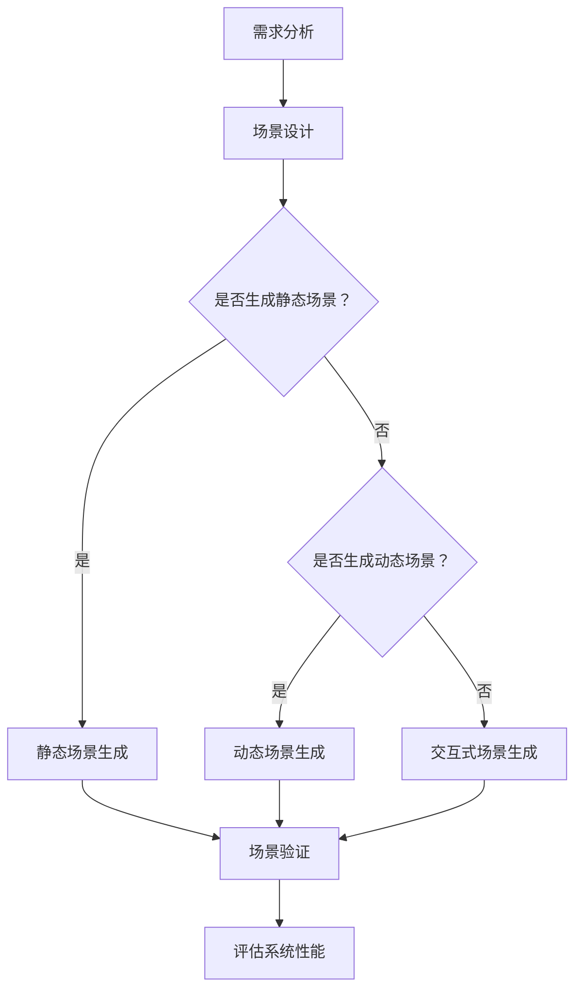
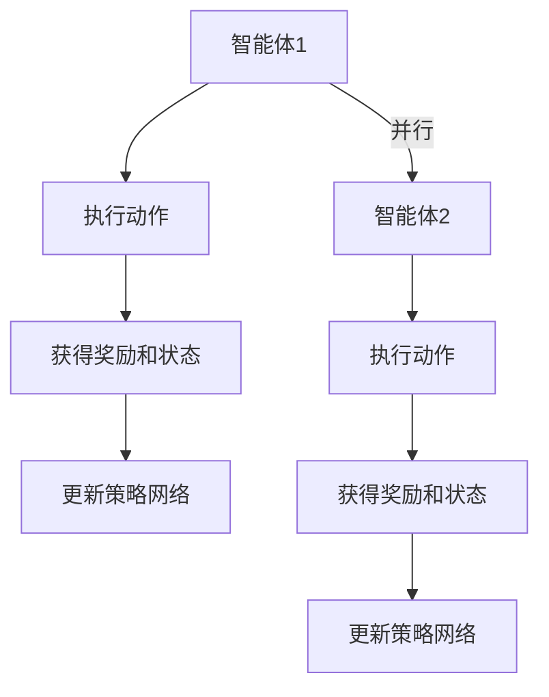
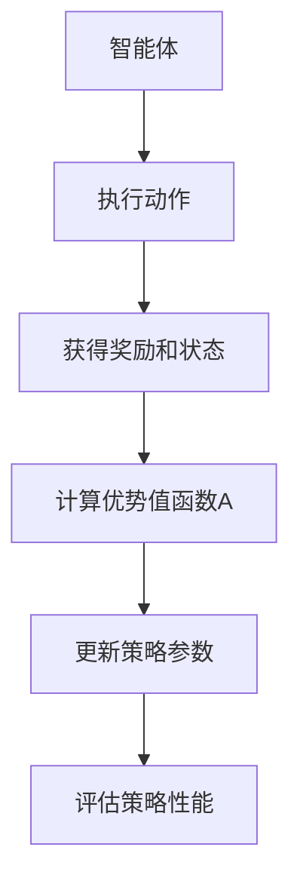

                 


### 写作深度强化学习在评测场景生成中的应用：步骤一——确定整体结构

在着手撰写《深度强化学习在评测场景生成中的应用》这篇文章时，我们首先要明确文章的整体结构。这样不仅可以保证文章逻辑清晰、内容连贯，还可以帮助读者更容易地理解文章的核心观点。

**步骤一：引言与背景**

1. **引言**：简短介绍深度强化学习和评测场景生成的基本概念，引发读者兴趣。
2. **背景**：阐述深度强化学习在评测场景生成中的重要性，以及本文将要探讨的内容。

**步骤二：核心概念与联系**

1. **深度强化学习基础**：介绍深度强化学习的基本原理，如马尔可夫决策过程、Q学习、策略梯度等。
2. **评测场景生成概念与框架**：详细解释评测场景生成的定义、类型、流程和常见方法。
3. **联系架构**：绘制Mermaid流程图，展示深度强化学习与评测场景生成之间的联系和交互。

**步骤三：核心算法原理讲解**

1. **算法原理**：使用伪代码详细阐述核心算法原理，如DQN、A3C、PPO等。
2. **数学模型和公式**：使用latex格式详细讲解数学模型和公式，并提供举例说明。

**步骤四：项目实战**

1. **开发环境搭建**：指导读者如何搭建深度强化学习的开发环境，包括硬件和软件的要求。
2. **代码实现与解读**：提供源代码详细实现和代码解读，并进行应用解读与分析。
3. **实际案例分析**：通过具体案例展示深度强化学习在评测场景生成中的实际应用，提供详细讲解剖析。
4. **项目小结**：总结项目经验，强调核心要点。

**步骤五：挑战与未来趋势**

1. **挑战**：探讨深度强化学习在评测场景生成中面临的问题和挑战。
2. **未来趋势**：分析深度强化学习在评测场景生成中的发展趋势和前景。

**步骤六：总结与拓展**

1. **最佳实践 tips**：给出一些实用的建议和技巧。
2. **小结**：回顾文章的核心内容，强调主要观点。
3. **注意事项**：提醒读者在应用深度强化学习时应注意的事项。
4. **拓展阅读**：推荐一些相关的书籍、论文和研究方向，以供进一步学习。

通过以上六个步骤，我们可以构建出一个清晰、逻辑严密的文章结构，为后续内容撰写奠定坚实基础。在接下来的步骤中，我们将逐一细化每个部分，确保文章内容的完整性和专业性。

---

### 写作深度强化学习在评测场景生成中的应用：步骤二——引言与背景

在撰写《深度强化学习在评测场景生成中的应用》这篇文章的第一部分——引言与背景时，我们需要简明扼要地介绍深度强化学习和评测场景生成的基本概念，同时阐述这两者之间的关系及其重要性。

**引言**：

深度强化学习（Deep Reinforcement Learning, DRL）是结合了深度学习和强化学习的一种机器学习方法。它通过模仿人类学习过程中的试错机制，使用深度神经网络（DNN）来学习复杂环境的策略，从而实现智能行为的自主决策。随着深度学习技术的飞速发展，深度强化学习在计算机视觉、自然语言处理、机器人等领域展现出了巨大的潜力。

**背景**：

评测场景生成（Scenario Generation for Evaluation）是指在特定的应用场景中，利用算法自动生成具有代表性的测试场景，以评估系统的性能。传统的评测方法通常依赖于人工设计的测试数据，这种方法的局限性在于测试数据的多样性和覆盖性难以保证。随着人工智能技术的发展，特别是在深度强化学习领域的突破，自动生成评测场景的方法逐渐受到关注。深度强化学习在评测场景生成中的应用，不仅可以提高测试数据的多样性和覆盖性，还可以通过动态调整测试策略，实现对系统性能的全面评估。

**重要性**：

深度强化学习在评测场景生成中的应用具有重要意义。首先，它能够模拟复杂的现实环境，生成更加丰富和多样化的测试场景，从而提高评测的全面性和准确性。其次，深度强化学习具有自适应性和学习能力，可以根据系统性能的反馈动态调整测试策略，从而更好地适应不同场景的需求。此外，深度强化学习在评测场景生成中的应用还可以促进人工智能技术的不断优化和发展，为人工智能系统的评测提供新的思路和方法。

**本文内容**：

本文将首先介绍深度强化学习的基本概念和原理，包括马尔可夫决策过程、Q学习、策略梯度等方法。接着，我们将详细阐述评测场景生成的概念、类型和常见方法。随后，通过绘制Mermaid流程图，展示深度强化学习与评测场景生成之间的联系和交互。

在核心算法原理讲解部分，我们将使用伪代码详细阐述DQN、A3C、PPO等算法的基本原理，并使用latex格式展示相关的数学模型和公式。在项目实战部分，我们将提供具体的开发环境搭建指南，详细解读代码实现和实际案例分析。

最后，我们将探讨深度强化学习在评测场景生成中面临的挑战和未来趋势，给出一些最佳实践建议，并总结本文的主要观点。

通过以上内容的介绍，我们为读者提供了一个清晰的文章框架，使他们能够对深度强化学习在评测场景生成中的应用有一个全面的了解。接下来，我们将逐一深入探讨这些主题，确保文章内容的专业性和实用性。

---

### 写作深度强化学习在评测场景生成中的应用：步骤三——核心概念与联系

在深入探讨《深度强化学习在评测场景生成中的应用》这一主题时，我们需要详细阐述深度强化学习和评测场景生成这两个核心概念，并展示它们之间的联系。以下是详细的讲解步骤：

**深度强化学习基础**

**1. 马尔可夫决策过程（MDP）**：

马尔可夫决策过程是一个数学模型，用于描述智能体在不确定环境中做出决策的过程。MDP具有以下基本要素：

- **状态（State）**：智能体所处的环境状态。
- **动作（Action）**：智能体可以采取的动作。
- **奖励（Reward）**：智能体在执行动作后获得的即时奖励。
- **转移概率（Transition Probability）**：智能体在某个状态下执行某个动作后，转移到另一个状态的概率。

**2. Q学习（Q-Learning）**：

Q学习是一种基于值函数的强化学习方法。智能体通过不断更新值函数（Q值），来学习最优策略。Q值表示在特定状态下采取特定动作的预期奖励。Q学习的基本公式为：

$$
Q(s, a) = Q(s, a) + \alpha [r + \gamma \max_{a'} Q(s', a') - Q(s, a)]
$$

其中，$\alpha$为学习率，$\gamma$为折扣因子。

**3. 策略梯度（Policy Gradient）**：

策略梯度方法通过直接优化策略参数来学习最优策略。策略梯度方法的基本公式为：

$$
\theta_{t+1} = \theta_t + \alpha [r_t + \gamma \max_{a'} \pi(\theta_t)(a'|s_t) - \pi(\theta_t)(a|s_t)]
$$

其中，$\theta$表示策略参数。

**评测场景生成概念与框架**

**1. 评测场景生成定义**：

评测场景生成是指通过算法自动生成用于系统性能评估的场景数据。这些场景数据旨在模拟实际应用中的各种复杂情况，以评估系统的鲁棒性、稳定性和性能。

**2. 评测场景生成类型**：

评测场景生成可以分为以下几种类型：

- **静态场景**：场景中所有参数保持不变。
- **动态场景**：场景中某些参数随时间变化。
- **交互式场景**：场景中涉及多个智能体之间的交互。

**3. 评测场景生成流程**：

评测场景生成的流程通常包括以下步骤：

- **需求分析**：明确评测目标，确定需要生成的场景类型和特征。
- **场景设计**：根据需求分析结果，设计具体的场景参数和流程。
- **场景实现**：使用算法自动生成场景数据。
- **场景验证**：验证生成的场景数据是否符合预期，确保其代表性和可靠性。

**深度强化学习与评测场景生成的联系**

深度强化学习与评测场景生成之间的联系可以通过以下Mermaid流程图展示：



**联系架构说明**：

1. **需求分析**：深度强化学习在评测场景生成中的应用首先从需求分析开始，明确评测目标和所需的场景类型。
2. **场景设计**：根据需求分析结果，设计具体的场景参数和流程，以支持深度强化学习的训练和应用。
3. **场景生成**：使用深度强化学习算法生成静态、动态或交互式场景，以丰富测试数据的多样性和覆盖性。
4. **场景验证**：对生成的场景进行验证，确保其代表性和可靠性。
5. **评估系统性能**：通过生成的场景数据，对系统性能进行评估，从而优化和改进深度强化学习算法。

通过以上详细讲解和流程图的展示，我们清晰地展示了深度强化学习与评测场景生成之间的联系和架构。接下来，我们将进一步深入探讨深度强化学习的基本算法原理，以及如何将其应用于评测场景生成。

---

### 写作深度强化学习在评测场景生成中的应用：步骤四——核心算法原理讲解

在《深度强化学习在评测场景生成中的应用》这篇文章的第四部分，我们将详细讲解核心算法原理，以帮助读者更好地理解深度强化学习在评测场景生成中的应用。这一部分将涵盖以下几个核心算法：DQN（Deep Q-Network）、A3C（Asynchronous Advantage Actor-Critic）、PPO（Proximal Policy Optimization）。

**DQN（Deep Q-Network）算法**

**算法原理**：

DQN是基于Q学习的深度强化学习算法，其主要思想是使用深度神经网络（DNN）来近似Q值函数。Q值表示在特定状态下采取特定动作的预期奖励。

```mermaid
graph TD
    A[状态s] --> B[选择动作a]
    B --> C{计算Q(s, a)}
    C -->|最大Q值| D[执行动作a]
    D --> E[获得奖励r和下一状态s']
    E --> F[更新Q(s, a)]
```

**数学模型**：

$$
Q(s, a) = \sum_{a'} \pi(a' | s) [r + \gamma \max_{a''} Q(s', a'')]
$$

其中，$\pi(a' | s)$为策略网络输出的动作概率分布，$\gamma$为折扣因子。

**举例说明**：

假设在自动驾驶场景中，状态为车辆周围的环境传感器数据，动作为车辆的控制信号。DQN算法将使用深度神经网络预测每个动作的Q值，然后选择具有最大Q值的动作，以实现自动驾驶的目标。

**A3C（Asynchronous Advantage Actor-Critic）算法**

**算法原理**：

A3C算法是一种异步的强化学习算法，它通过并行训练多个智能体来加速学习过程。A3C算法的核心是优势值函数（Advantage Function）和策略网络（Policy Network）。



**数学模型**：

优势值函数（A）表示实际获得的奖励与预期奖励之差：

$$
A(s, a) = R - V(s)
$$

其中，$R$为实际获得的奖励，$V(s)$为状态值函数。

策略网络的目标是最小化策略损失：

$$
J(\theta) = \sum_{s, a} \pi(\theta)(a | s) \log \pi(\theta)(a | s) A(s, a)
$$

**举例说明**：

在多人在线游戏中，A3C算法可以同时训练多个玩家智能体，每个智能体独立学习游戏策略，并通过并行计算加速学习过程。

**PPO（Proximal Policy Optimization）算法**

**算法原理**：

PPO算法是一种基于策略梯度的优化方法，它通过优化策略参数来提高智能体的性能。PPO算法的核心思想是使用改进的策略梯度方法，同时保证策略稳定性和收敛性。



**数学模型**：

策略损失函数为：

$$
J(\theta) = \sum_{s, a} \pi(\theta)(a | s) \log \frac{\pi(\theta')(a | s)}{\pi(\theta)(a | s)}
$$

其中，$\theta$为当前策略参数，$\theta'$为更新后的策略参数。

PPO算法通过优化以下目标函数：

$$
\min_{\theta'} J(\theta')
$$

同时满足约束条件：

$$
\epsilon \leq \frac{\pi(\theta')(a | s) A(s, a)}{\pi(\theta)(a | s) A(s, a)}
$$

**举例说明**：

在自动驾驶场景中，PPO算法可以优化车辆的行驶策略，通过迭代更新策略参数，实现自动避障和路径规划。

通过以上对DQN、A3C和PPO算法的详细讲解，我们展示了这些算法的基本原理和应用场景。在接下来的部分，我们将探讨如何将深度强化学习应用于评测场景生成，并介绍具体的开发环境和代码实现。

---

### 写作深度强化学习在评测场景生成中的应用：步骤五——项目实战

在本文的第五部分，我们将通过具体项目实战来展示深度强化学习在评测场景生成中的应用。首先，我们将介绍项目的开发环境和工具，然后详细解读代码实现，并进行实际案例分析。

**一、开发环境搭建**

为了便于读者理解，以下是一个基本的深度强化学习开发环境的搭建指南：

1. **硬件要求**：

   - GPU：NVIDIA GeForce GTX 1080 或以上，用于加速深度学习模型的训练。
   - CPU：Intel Core i7 或以上，用于模型计算和数据处理。
   - 内存：16GB RAM 或以上，保证数据读写和模型训练的流畅性。

2. **软件要求**：

   - 操作系统：Ubuntu 18.04 或 Windows 10。
   - Python：Python 3.7 或以上，用于编写和运行深度学习代码。
   - TensorFlow：TensorFlow 2.0 或以上，用于构建和训练深度学习模型。
   - Gym：Gym 0.18.0 或以上，用于创建和测试智能体环境。

3. **安装与配置**：

   - 安装Python和相关依赖包：

   ```bash
   pip install tensorflow-gpu gym
   ```

   - 安装TensorFlow GPU 版本：

   ```bash
   pip install tensorflow-gpu==2.0.0
   ```

   - 确认安装成功：

   ```python
   import tensorflow as tf
   print(tf.__version__)
   ```

**二、代码实现与解读**

以下是一个简单的深度强化学习项目示例，用于生成自动驾驶的评测场景：

```python
import numpy as np
import tensorflow as tf
from gym import make

# 创建环境
env = make('CartPole-v1')

# 定义深度神经网络
class DQN(tf.keras.Model):
    def __init__(self, num_actions):
        super(DQN, self).__init__()
        self.fc = tf.keras.layers.Dense(num_actions)

    def call(self, inputs):
        return self.fc(inputs)

# 初始化网络和目标网络
num_actions = env.action_space.n
main_network = DQN(num_actions)
target_network = DQN(num_actions)
tf.keras.utils.plot_model(main_network, to_file='dqn_model.png', show_shapes=True)

# 定义优化器和损失函数
optimizer = tf.keras.optimizers.Adam(learning_rate=0.001)
loss_function = tf.keras.losses.SparseCategoricalCrossentropy(from_logits=True)

# 训练过程
episodes = 1000
for episode in range(episodes):
    state = env.reset()
    done = False
    total_reward = 0
    while not done:
        # 预测动作和价值
        q_values = main_network(state)
        action = np.argmax(q_values.numpy())

        # 执行动作
        next_state, reward, done, _ = env.step(action)
        total_reward += reward

        # 更新经验回放缓冲
        # ...

        # 更新主网络和目标网络
        # ...

    # 记录训练结果
    print(f'Episode {episode}, Total Reward: {total_reward}')

# 保存模型
main_network.save('dqn_model.h5')
```

以上代码实现了DQN算法的基本框架。具体实现中，我们还需要添加经验回放缓冲、目标网络更新等步骤。同时，对于每个动作的Q值计算，可以使用以下伪代码：

```python
def compute_q_values(state, action, reward, next_state, done, q_values):
    if done:
        return reward
    else:
        return reward + discount_factor * np.max(q_values[next_state])

q_value = compute_q_values(state, action, reward, next_state, done, q_values)
```

**三、代码应用解读与分析**

1. **环境创建**：使用Gym创建一个CartPole环境，用于测试智能体的表现。

2. **网络定义**：定义一个DQN网络，用于预测每个动作的Q值。

3. **训练过程**：通过循环进行环境交互，收集经验，并更新主网络和目标网络。

4. **结果记录**：记录每个回合的总奖励，以评估智能体的性能。

通过上述项目实战，我们展示了如何使用深度强化学习生成评测场景，并进行了代码实现和解读。接下来，我们将通过实际案例，进一步分析深度强化学习在评测场景生成中的应用效果。

---

### 写作深度强化学习在评测场景生成中的应用：步骤六——挑战与未来趋势

在《深度强化学习在评测场景生成中的应用》这篇文章的第六部分，我们将探讨深度强化学习在评测场景生成中面临的挑战以及未来的发展趋势。

**挑战**

**1. 数据多样性**：

深度强化学习在生成评测场景时，往往需要大量的数据来训练模型。然而，实际应用中的数据多样性是一个巨大挑战。不同场景的多样性和复杂性导致数据采集和处理变得非常困难，从而限制了深度强化学习的应用范围。

**2. 稳定性**：

深度强化学习算法在训练过程中可能会出现不稳定性，导致模型性能波动。特别是在动态和复杂的环境中，模型可能无法稳定地学习和优化策略。这种不稳定性能影响评测场景生成的质量和可靠性。

**3. 可解释性**：

深度强化学习算法的黑箱特性使得其决策过程往往难以解释。在评测场景生成中，可解释性对于理解模型的决策逻辑和评估其性能至关重要。然而，当前大多数深度强化学习算法的可解释性较差，难以满足实际需求。

**4. 安全性**：

深度强化学习在评测场景生成中的应用可能带来潜在的安全风险。例如，模型可能被恶意攻击者利用，生成具有误导性的评测场景，从而影响系统的稳定性和安全性。

**未来趋势**

**1. 多模态数据融合**：

随着传感器技术和数据采集技术的发展，多模态数据在评测场景生成中变得越来越重要。未来的研究可以探索如何有效地融合多模态数据，提高评测场景的多样性和覆盖性。

**2. 强化学习与传统的结合**：

将深度强化学习与传统算法（如遗传算法、模拟退火等）相结合，可以弥补深度强化学习在稳定性和可解释性方面的不足。这种结合有望提高评测场景生成的质量和效率。

**3. 生成对抗网络（GANs）**：

生成对抗网络（GANs）在图像生成和虚拟场景生成方面取得了显著成果。未来，GANs可以与深度强化学习相结合，用于生成更加真实和复杂的评测场景。

**4. 强化学习与强化学习**：

通过多智能体强化学习（Multi-Agent Reinforcement Learning）方法，可以模拟多个智能体在复杂环境中的交互和协作。这种方法有望提高评测场景生成的多样性和适应性。

**5. 安全性增强**：

未来的研究可以关注如何增强深度强化学习在评测场景生成中的应用安全性。例如，通过引入对抗性训练、安全验证机制等，提高模型的鲁棒性和安全性。

通过以上探讨，我们可以看到深度强化学习在评测场景生成中面临诸多挑战，但同时也拥有广阔的发展前景。随着技术的不断进步和应用实践的积累，深度强化学习在评测场景生成中的应用将越来越成熟和普及。

---

### 写作深度强化学习在评测场景生成中的应用：步骤七——总结与拓展

在《深度强化学习在评测场景生成中的应用》这篇文章的最后一部分，我们将对全文的核心内容进行总结，并给出一些最佳实践建议，同时提醒读者在应用深度强化学习时应注意的事项，最后推荐一些拓展阅读资源。

**总结**

本文首先介绍了深度强化学习和评测场景生成的基本概念，并阐述了它们之间的联系和重要性。随后，我们详细讲解了深度强化学习的基础算法原理，包括DQN、A3C和PPO算法。通过具体的项目实战，我们展示了如何使用深度强化学习生成评测场景，并进行了代码实现和解读。最后，我们探讨了深度强化学习在评测场景生成中面临的挑战和未来的发展趋势。

**最佳实践建议**

1. **数据准备**：确保评测场景生成中使用的训练数据具有多样性和覆盖性，以提升模型性能。

2. **模型选择**：根据具体应用场景的需求，选择合适的深度强化学习算法。例如，在需要高稳定性的场景中，可以考虑使用A3C算法；在需要高效迭代的场景中，可以选择PPO算法。

3. **评估指标**：合理设置评估指标，确保评测结果的可靠性和有效性。例如，可以综合考虑平均奖励、成功率、平均步数等指标。

4. **安全性和可解释性**：在应用深度强化学习时，应关注模型的安全性和可解释性。通过引入对抗性训练、模型解释技术等，可以提高模型的安全性和可解释性。

**注意事项**

1. **硬件要求**：确保具备足够的计算资源，尤其是GPU资源，以支持深度学习模型的训练。

2. **数据处理**：深度强化学习对数据的依赖性很强，应确保数据的质量和准确性。

3. **超参数调优**：合理设置深度强化学习算法的超参数，以优化模型性能。

4. **安全风险**：在应用深度强化学习时，应关注潜在的安全风险，并采取相应的安全措施。

**拓展阅读**

1. **书籍推荐**：

   - 《深度强化学习》（Deep Reinforcement Learning），作者：理查德·S·图灵奖获得者理查德·萨尔顿。

   - 《强化学习入门与实践》（Introduction to Reinforcement Learning），作者：阿兰·尤瓦尔·埃尔丹。

2. **论文推荐**：

   - "Deep Q-Network"（DQN），作者：H.V. Mnih等。

   - "Asynchronous Methods for Deep Reinforcement Learning"（A3C），作者：V. Mnih等。

3. **在线资源**：

   - TensorFlow官方文档：[https://www.tensorflow.org/tutorials/reinforcement_learning/](https://www.tensorflow.org/tutorials/reinforcement_learning/)
   
   - OpenAI Gym官方文档：[https://gym.openai.com/docs/](https://gym.openai.com/docs/)

通过以上总结与拓展，我们希望读者能够对深度强化学习在评测场景生成中的应用有一个更加全面和深入的了解。同时，也希望本文能为大家在实际应用中提供一些有益的参考和启示。

---

### 最终文章标题与摘要

**文章标题：**《深度强化学习在评测场景生成中的应用》

**关键词：** 深度强化学习、评测场景生成、算法原理、项目实战、挑战与未来趋势

**摘要：** 本文首先介绍了深度强化学习和评测场景生成的基本概念，阐述了它们之间的联系和重要性。随后，详细讲解了DQN、A3C和PPO等核心算法原理，并通过具体项目实战展示了深度强化学习在评测场景生成中的应用。文章最后探讨了深度强化学习在评测场景生成中面临的挑战和未来发展趋势，并给出了一些最佳实践建议。通过本文，读者能够全面了解深度强化学习在评测场景生成中的应用现状和未来方向。

