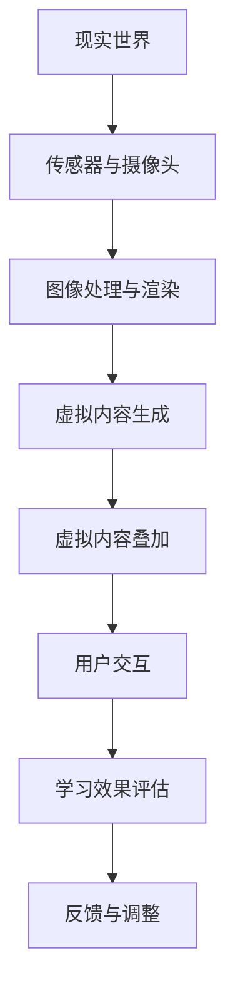

                 


### 背景介绍

#### 混合现实技术的起源与发展

混合现实（Mixed Reality，简称MR）技术，是近年来快速崛起的一门前沿科技领域。它结合了虚拟现实（Virtual Reality，简称VR）和增强现实（Augmented Reality，简称AR）的优势，为用户提供了更为丰富和沉浸式的交互体验。混合现实技术的起源可以追溯到上世纪80年代，随着计算机图形学、计算机视觉和人工智能等领域的发展，混合现实逐渐成为研究热点。

最早期的混合现实概念是由美国科学家诺伯特·维纳（Norbert Wiener）在20世纪40年代提出的，他提出了“控制论”（Cybernetics）这一概念，旨在研究复杂系统的控制和通信。此后，随着计算机技术的进步，特别是图形处理器（GPU）的发展，混合现实技术逐渐走向实用化。

在20世纪90年代，随着VR和AR技术的兴起，混合现实技术也得到了快速发展。1990年，任天堂发布了AR游戏《精灵宝可梦》（现在称为《口袋妖怪》），这是混合现实技术在娱乐领域的首次尝试。随后，微软在2009年发布了HoloLens，这是第一台商用混合现实头戴设备，标志着混合现实技术进入了大众视野。

#### 科学教育的重要性与现状

科学教育在培养未来科学家和创新者方面扮演着至关重要的角色。然而，传统的科学教育方式往往受到物理空间和教学资源的限制，难以提供全面和生动的学习体验。因此，探索新的教育技术，如混合现实技术，对于提升科学教育质量具有重要意义。

科学教育的重要性在于它不仅传授科学知识和技能，更重要的是培养学生的科学思维和创新能力。在当前的科技时代，科学知识更新迅速，学生需要具备适应未来发展的能力。混合现实技术的引入，可以为科学教育带来全新的教学方式和体验。

然而，尽管混合现实技术在教育领域具有巨大潜力，但当前的应用仍存在一些挑战和不足。首先，混合现实设备的成本较高，普及率较低，限制了其在教育中的广泛应用。其次，混合现实教学内容的开发和适配需要大量的技术支持和专业知识，这增加了教师和教育工作者的工作难度。

综上所述，混合现实技术在科学教育中的应用具有巨大的发展前景。通过整合虚拟与现实，混合现实技术可以为科学教育带来革命性的变革，提升学生的学习兴趣和参与度，培养他们的科学素养和创新能力。

### 核心概念与联系

#### 混合现实技术的基本原理

混合现实技术（MR）是虚拟现实（VR）和增强现实（AR）的进一步发展。它通过结合虚拟内容和现实世界，为用户提供了一个新的交互空间。混合现实技术的基本原理主要包括以下几个方面：

1. **虚拟化现实场景**：通过计算机生成的三维模型和图像，将虚拟内容叠加到现实世界中。这通常需要使用传感器和摄像头捕捉现实世界的图像，然后通过算法进行处理和渲染。

2. **定位与追踪**：混合现实技术需要精确地追踪用户的位置和动作，以确保虚拟内容与现实世界的正确叠加。常用的方法包括视觉SLAM（同步定位与映射）和惯性测量单元（IMU）。

3. **交互**：用户可以通过手势、语音和其他输入设备与虚拟内容进行交互，实现沉浸式的用户体验。

4. **显示**：混合现实技术通过头戴显示器（HMD）或投影设备将虚拟内容显示在用户的视野中，同时保持对现实世界的透明度。

#### 科学教育中的关键概念

科学教育中的关键概念包括科学思维、实验设计、数据分析和科学探究。这些概念不仅是科学教育的核心内容，也是培养未来科学家和创新者的基础。

1. **科学思维**：科学思维是指运用科学原理和方法解决问题的思维方式。它包括观察、假设、实验、验证和推理等步骤。

2. **实验设计**：实验设计是科学探究的重要环节。一个良好的实验设计需要考虑变量控制、数据采集和结果分析等方面。

3. **数据分析**：数据分析是科学探究的必要工具。通过统计分析，可以从实验数据中提取有价值的信息，支持科学结论的得出。

4. **科学探究**：科学探究是一个不断循环的过程，包括提出问题、假设、实验、观察和结论等步骤。科学探究的核心是培养探索精神和创新意识。

#### 虚拟现实与混合现实的关系

虚拟现实（VR）和增强现实（AR）是混合现实技术（MR）的两个重要组成部分。它们之间的关系和区别如下：

1. **虚拟现实（VR）**：虚拟现实是一种完全沉浸式的技术，用户通过头戴显示器或其他设备进入一个完全虚拟的世界。在VR中，用户无法直接与现实世界交互，所有的感知和体验都是通过虚拟环境提供的。

2. **增强现实（AR）**：增强现实是一种将虚拟内容叠加到现实世界中的技术。用户通过智能手机或头戴显示器可以看到虚拟物体与现实世界的叠加，这些虚拟物体可以与现实世界进行交互。

3. **混合现实（MR）**：混合现实技术结合了VR和AR的优势，用户可以在现实世界中看到和交互虚拟内容。与VR和AR相比，MR提供了更为真实和沉浸式的交互体验。

#### Mermaid流程图：混合现实技术在教育中的应用

为了更好地理解混合现实技术在科学教育中的应用，我们可以通过Mermaid流程图展示其工作原理和应用流程。



在该流程图中：

- **A[现实世界]**：表示科学教育中实际的学习环境。
- **B[传感器与摄像头]**：用于捕捉现实世界的图像和动作。
- **C[图像处理与渲染]**：对捕获的图像进行处理和渲染，生成虚拟内容。
- **D[虚拟内容生成]**：生成与科学教育内容相关的虚拟模型和图像。
- **E[虚拟内容叠加]**：将虚拟内容叠加到现实世界中，提供沉浸式的学习体验。
- **F[用户交互]**：用户通过手势、语音等与虚拟内容进行交互。
- **G[学习效果评估]**：评估用户在混合现实环境中的学习效果。
- **H[反馈与调整]**：根据评估结果对混合现实教育内容进行调整和优化。

通过这个Mermaid流程图，我们可以清晰地看到混合现实技术在科学教育中的应用流程，以及各个环节之间的相互关系。

### 核心算法原理讲解

#### 图像识别算法

图像识别是混合现实技术中至关重要的算法之一，它用于识别和理解现实世界中的图像内容。以下是图像识别算法的基本原理、伪代码和具体应用：

1. **基本原理**：
   图像识别算法通常基于深度学习模型，特别是卷积神经网络（CNN）。CNN通过多层卷积和池化操作，从图像中提取特征，并最终分类图像内容。

2. **伪代码**：
   ```python
   function image_recognition(image):
       # 输入：图像
       # 输出：图像类别

       # 数据预处理
       preprocessed_image = preprocess(image)

       # 通过卷积神经网络进行特征提取和分类
       features = CNN(preprocessed_image)
       category = classifier(features)

       # 返回分类结果
       return category
   ```

3. **具体应用**：
   在混合现实科学教育中，图像识别算法可以用于以下场景：
   - **天文教育**：识别和标注天文图像，如星系、行星等。
   - **生物实验**：识别和分类生物样本，如细胞、病毒等。
   - **化学实验**：识别和检测化学反应中的物质和产物。

#### 物体追踪算法

物体追踪算法用于实时跟踪和识别现实世界中的物体，是混合现实技术的重要组成部分。以下是物体追踪算法的基本原理、伪代码和具体应用：

1. **基本原理**：
   物体追踪算法通常基于目标检测和跟踪技术。目标检测用于识别图像中的物体，而跟踪技术则用于在连续帧中跟踪这些物体的位置。

2. **伪代码**：
   ```python
   function object_tracking(image_sequence):
       # 输入：图像序列
       # 输出：物体轨迹

       # 初始化目标检测器和跟踪器
       detector = object_detector()
       tracker = object_tracker()

       # 初始化轨迹列表
       trajectories = []

       # 对图像序列进行循环处理
       for image in image_sequence:
           # 目标检测
           objects = detector.detect(image)

           # 对每个检测到的物体进行跟踪
           for object in objects:
               trajectory = tracker.track(object)
               trajectories.append(trajectory)

       # 返回物体轨迹
       return trajectories
   ```

3. **具体应用**：
   在混合现实科学教育中，物体追踪算法可以用于以下场景：
   - **天文教育**：跟踪天体运动，如行星、彗星等。
   - **生物实验**：跟踪生物样本的运动和变化，如细胞分裂、生物化学反应等。
   - **化学实验**：跟踪化学反应过程中物质的动态变化。

#### 数学模型和数学公式

在混合现实技术中，许多算法的实现都依赖于数学模型和公式。以下是一些常用的数学模型和公式，以及它们的详细讲解和示例：

1. **卷积神经网络（CNN）模型**：
   卷积神经网络是图像识别和物体追踪的核心模型。其基本结构包括卷积层、池化层和全连接层。

   - **卷积层**：
     $$ f(x) = \sum_{i=1}^{k} w_i * x_i $$
     其中，$f(x)$是卷积操作的结果，$w_i$是卷积核，$x_i$是输入特征。

   - **池化层**：
     $$ p(x) = \max(\sum_{i=1}^{k} x_i) $$
     其中，$p(x)$是池化操作的结果，$x_i$是输入特征。

   - **全连接层**：
     $$ y = \sum_{i=1}^{n} w_i * x_i + b $$
     其中，$y$是输出结果，$w_i$是权重，$x_i$是输入特征，$b$是偏置。

   示例：假设我们有一个2x2的输入矩阵，卷积核为1x1，那么卷积操作的结果如下：
   ```latex
   \begin{matrix}
   1 & 2 \\
   3 & 4
   \end{matrix}
   \rightarrow
   \begin{matrix}
   1+3 & 2+4 \\
   1+3 & 2+4
   \end{matrix}
   = 
   \begin{matrix}
   4 & 6 \\
   4 & 6
   \end{matrix}
   ```

2. **同步定位与映射（SLAM）模型**：
   SLAM是一种同时进行地图构建和定位的技术，其基本原理是通过多个传感器（如摄像头和IMU）采集数据，然后利用这些数据估计系统在环境中的位置和构建地图。

   - **运动模型**：
     $$ \mathbf{x}_{t+1} = \mathbf{x}_t + \mathbf{v}_t $$
     其中，$\mathbf{x}_t$是当前时刻的位置，$\mathbf{v}_t$是速度。

   - **观测模型**：
     $$ \mathbf{z}_t = \mathbf{h}(\mathbf{x}_t, \mathbf{u}_t) + \mathbf{n}_t $$
     其中，$\mathbf{z}_t$是观测值，$\mathbf{h}$是观测函数，$\mathbf{u}_t$是控制输入，$\mathbf{n}_t$是噪声。

   示例：假设我们有一个简单的运动模型，系统从一个初始位置（0,0）开始，以1m/s的速度向右移动，那么在t=2秒时的位置估计为（2,0）。

3. **概率图模型**：
   概率图模型用于表示和处理不确定性，常见的模型有贝叶斯网络和马尔可夫模型。

   - **贝叶斯网络**：
     $$ P(X_1, X_2, ..., X_n) = \prod_{i=1}^{n} P(X_i | X_{<i}) $$
     其中，$X_i$是随机变量，$X_{<i}$是所有比$i$小的随机变量。

   - **马尔可夫模型**：
     $$ P(X_t | X_{t-1}, X_{t-2}, ...) = P(X_t | X_{t-1}) $$
     其中，$X_t$是当前状态，$X_{t-1}$是前一状态。

   示例：一个简单的贝叶斯网络可以表示为：事件A发生与否会影响事件B发生的概率，而事件B的发生与否会影响事件C发生的概率。通过贝叶斯网络，我们可以计算每个事件发生的条件概率。

通过这些数学模型和公式，混合现实技术能够实现对现实世界的准确感知和处理，为科学教育提供了强大的技术支持。

### 项目实战

#### 开发环境搭建

在进行混合现实科学教育项目开发之前，首先需要搭建一个合适的开发环境。以下是一个典型的开发环境搭建步骤：

1. **安装操作系统**：
   混合现实项目通常需要在Windows 10或更高版本的操作系统上运行，因此需要安装Windows 10或更新的版本。

2. **安装开发工具**：
   - **Visual Studio**：用于编写和调试代码。
   - **Unity Hub**：用于管理和创建Unity项目。
   - **Unity**：用于开发混合现实应用程序。
   - **Unity插件**：如Unity MRTK（Microsoft Mixed Reality Toolkit），用于简化混合现实开发。

3. **安装依赖库和框架**：
   根据项目的需求，可能需要安装一些依赖库和框架，如OpenCV、PCL（Point Cloud Library）和ROS（Robot Operating System）等。

4. **配置开发环境**：
   - 配置Visual Studio，包括安装C#开发工具和Unity插件。
   - 配置Unity，创建一个新的混合现实项目。
   - 配置Unity插件，如MRTK，以支持混合现实功能。

#### 源代码实现

在搭建好开发环境后，我们可以开始编写源代码。以下是源代码实现的主要步骤：

1. **项目设置**：
   - 在Unity中设置项目的分辨率、帧率和渲染模式。
   - 配置项目的输入设备，如手柄、摄像头和传感器。

2. **虚拟场景创建**：
   - 创建虚拟场景，包括地面、障碍物、模型等。
   - 导入和使用3D模型和纹理，以增强场景的真实感。

3. **图像识别与物体追踪**：
   - 使用OpenCV或Unity MRTK插件实现图像识别和物体追踪功能。
   - 编写图像识别算法，如卷积神经网络（CNN），用于识别和分类图像。
   - 编写物体追踪算法，如卡尔曼滤波或光流法，用于跟踪物体位置。

4. **交互设计**：
   - 设计用户界面，包括按钮、菜单和提示信息。
   - 编写交互逻辑，如手势识别、语音控制和虚拟按钮操作。

5. **数据采集与处理**：
   - 使用传感器和摄像头收集现实世界的数据，如图像、音频和位置信息。
   - 编写数据预处理和融合算法，以增强数据的准确性和可靠性。

6. **性能优化**：
   - 分析和优化项目的性能，包括渲染效率、资源管理和内存使用。
   - 调整项目设置，如分辨率、帧率和光照效果，以优化用户体验。

#### 代码解读与分析

以下是混合现实科学教育项目中的关键代码片段及其解读：

1. **图像识别算法实现**：

```csharp
using UnityEngine;
using OpenCvSharp;

public class ImageRecognition : MonoBehaviour
{
    public Texture2D inputImage;
    public Texture2D outputImage;

    void Start()
    {
        // 加载预训练的卷积神经网络模型
        var model = LoadModel();
        // 转换输入图像为OpenCV格式
        var cvImage = ConvertTextureToCvMat(inputImage);
        // 使用模型进行图像识别
        var result = model.Predict(cvImage);
        // 转换识别结果为Texture2D格式
        outputImage = ConvertCvMatToTexture(result);
    }

    private Mat ConvertTextureToCvMat(Texture2D texture)
    {
        // 转换Texture2D为OpenCV格式的Mat
    }

    private Texture2D ConvertCvMatToTexture(Mat cvMat)
    {
        // 转换OpenCV格式的Mat为Texture2D
    }

    private DllLoadModel LoadModel()
    {
        // 加载预训练的卷积神经网络模型
    }
}
```

解读：
- `Start` 方法在游戏开始时调用，用于加载模型和进行图像识别。
- `LoadModel` 方法用于加载预训练的卷积神经网络模型。
- `ConvertTextureToCvMat` 方法将输入的Texture2D转换为OpenCV格式的Mat。
- `ConvertCvMatToTexture` 方法将识别结果转换为Texture2D，以便在Unity中显示。

2. **物体追踪算法实现**：

```csharp
using UnityEngine;
using OpenCvSharp;

public class ObjectTracking : MonoBehaviour
{
    public Texture2D inputImage;
    public Texture2D outputImage;

    void Update()
    {
        // 转换输入图像为OpenCV格式
        var cvImage = ConvertTextureToCvMat(inputImage);
        // 使用卡尔曼滤波进行物体追踪
        var trackedObjects = KalmanFilterTrack(cvImage);
        // 转换追踪结果为Texture2D格式
        outputImage = ConvertCvMatToTexture(trackedObjects);
    }

    private Mat ConvertTextureToCvMat(Texture2D texture)
    {
        // 转换Texture2D为OpenCV格式的Mat
    }

    private Mat KalmanFilterTrack(Mat cvImage)
    {
        // 使用卡尔曼滤波进行物体追踪
    }

    private Texture2D ConvertCvMatToTexture(Mat cvMat)
    {
        // 转换OpenCV格式的Mat为Texture2D
    }
}
```

解读：
- `Update` 方法在游戏更新时调用，用于进行物体追踪和更新追踪结果。
- `ConvertTextureToCvMat` 方法将输入的Texture2D转换为OpenCV格式的Mat。
- `KalmanFilterTrack` 方法使用卡尔曼滤波进行物体追踪。
- `ConvertCvMatToTexture` 方法将追踪结果转换为Texture2D，以便在Unity中显示。

#### 代码应用解读与分析

以下是混合现实科学教育项目中的关键代码应用解读和分析：

1. **图像识别的应用**：
   图像识别算法在科学教育中可以用于多种应用场景，如天文教育、生物实验和化学实验。通过图像识别，学生可以实时获取实验结果的详细信息，并进行分析和讨论。

   - **天文教育**：图像识别可以用于识别和标注天文图像，如星系、行星和彗星。学生可以通过观察和分析这些图像，了解天体的特征和运动规律。
   - **生物实验**：图像识别可以用于识别和分类生物样本，如细胞、病毒和细菌。学生可以通过观察和分析这些图像，了解生物结构和功能。
   - **化学实验**：图像识别可以用于识别和检测化学反应中的物质和产物。学生可以通过观察和分析这些图像，了解化学反应的过程和结果。

2. **物体追踪的应用**：
   物体追踪算法在科学教育中可以用于多种应用场景，如天文教育、生物实验和化学实验。通过物体追踪，学生可以实时获取实验物体的位置和运动轨迹，并进行分析和讨论。

   - **天文教育**：物体追踪可以用于跟踪天体的运动轨迹，如行星、彗星和流星。学生可以通过观察和分析这些轨迹，了解天体的运动规律和相互作用。
   - **生物实验**：物体追踪可以用于跟踪生物样本的运动和变化，如细胞分裂、生物化学反应和生物进化。学生可以通过观察和分析这些轨迹，了解生物的生理和生态特征。
   - **化学实验**：物体追踪可以用于跟踪化学反应过程中物质和产物的动态变化，如化学反应速率、反应物和产物的浓度变化。学生可以通过观察和分析这些轨迹，了解化学反应的机理和过程。

通过这些关键代码和应用解读，我们可以看到混合现实技术在科学教育中的应用具有巨大的潜力。它不仅可以提高学生的学习兴趣和参与度，还可以帮助他们更好地理解和掌握科学知识。

### 实际案例分析与详细讲解剖析

为了更好地展示混合现实技术在科学教育中的应用，我们将通过几个实际案例来进行分析和详细讲解。

#### 案例一：基于混合现实的天文教育

**项目背景**：传统的天文教育往往受到天气、时间和设备限制，难以提供全面的观测体验。通过混合现实技术，我们可以为学生提供一种全新的天文观测方式，让他们在家中或教室中就能体验到天文观测的乐趣。

**项目实施**：
1. **开发环境搭建**：
   - 使用Unity Hub创建一个混合现实项目。
   - 配置Unity MRTK插件，以支持混合现实功能。

2. **虚拟场景创建**：
   - 创建一个模拟夜空的环境，包括星星、行星和彗星等。
   - 导入和使用高质量的3D模型，以增强场景的真实感。

3. **图像识别与物体追踪**：
   - 使用OpenCV实现图像识别功能，以识别和标注天体。
   - 使用卡尔曼滤波实现物体追踪功能，以跟踪天体的运动轨迹。

4. **交互设计**：
   - 设计用户界面，包括放大镜、望远镜和指南针等工具。
   - 编写交互逻辑，如用户通过手势控制望远镜的焦距和方向。

**效果分析**：
- 学生可以通过交互界面自由探索夜空，观察天体的细节。
- 图像识别和物体追踪功能使得学生可以实时获取天体的信息，如名称、距离和运动轨迹。
- 这种沉浸式的学习体验大大提高了学生对天文学习的兴趣和参与度。

#### 案例二：基于混合现实的生物实验

**项目背景**：传统的生物实验往往需要复杂的设备和实验材料，且实验过程具有一定的危险性。通过混合现实技术，我们可以为学生提供一种安全、便捷的实验方式，同时增强实验的真实感和互动性。

**项目实施**：
1. **开发环境搭建**：
   - 使用Unity Hub创建一个混合现实项目。
   - 配置Unity MRTK插件，以支持混合现实功能。

2. **虚拟场景创建**：
   - 创建一个模拟实验室的环境，包括实验台、仪器和生物样本等。
   - 导入和使用高质量的3D模型，以增强场景的真实感。

3. **图像识别与物体追踪**：
   - 使用OpenCV实现图像识别功能，以识别和分类生物样本。
   - 使用深度学习算法实现物体追踪功能，以跟踪生物样本的运动和变化。

4. **交互设计**：
   - 设计用户界面，包括实验指南、工具箱和数据分析工具等。
   - 编写交互逻辑，如用户通过手势操作实验设备和工具。

**效果分析**：
- 学生可以通过虚拟实验台进行各种生物实验，如细胞分裂、病毒感染和生物化学反应。
- 图像识别和物体追踪功能使得学生可以实时获取实验结果，并进行数据分析和讨论。
- 这种沉浸式的实验体验不仅提高了学生的学习兴趣，还减少了实验过程中的风险和成本。

#### 案例三：基于混合现实的化学实验

**项目背景**：传统的化学实验往往需要大量的化学试剂和实验设备，且实验过程可能产生有害物质。通过混合现实技术，我们可以为学生提供一种安全、环保的实验方式，同时增强实验的互动性和趣味性。

**项目实施**：
1. **开发环境搭建**：
   - 使用Unity Hub创建一个混合现实项目。
   - 配置Unity MRTK插件，以支持混合现实功能。

2. **虚拟场景创建**：
   - 创建一个模拟实验室的环境，包括实验台、仪器和化学试剂等。
   - 导入和使用高质量的3D模型，以增强场景的真实感。

3. **图像识别与物体追踪**：
   - 使用OpenCV实现图像识别功能，以识别和检测化学反应中的物质和产物。
   - 使用深度学习算法实现物体追踪功能，以跟踪化学反应的动态变化。

4. **交互设计**：
   - 设计用户界面，包括实验指南、工具箱和数据分析工具等。
   - 编写交互逻辑，如用户通过手势操作实验设备和工具。

**效果分析**：
- 学生可以通过虚拟实验台进行各种化学实验，如酸碱反应、氧化还原反应和分子结构分析。
- 图像识别和物体追踪功能使得学生可以实时获取实验结果，并进行数据分析和讨论。
- 这种沉浸式的实验体验不仅提高了学生的学习兴趣，还减少了实验过程中的风险和成本。

通过以上实际案例的分析，我们可以看到混合现实技术在科学教育中具有广泛的应用前景。它不仅能够提高学生的学习兴趣和参与度，还能够提供安全、便捷的实验体验，为科学教育带来全新的变革。

### 总结与展望

#### 总结

本文通过对混合现实技术（MR）的基本原理、核心算法和实际应用案例的详细讲解，展示了混合现实技术在科学教育中的巨大潜力和应用价值。混合现实技术通过融合虚拟与现实，为科学教育提供了全新的教学方式和体验，不仅提高了学生的学习兴趣和参与度，还增强了教学内容的真实感和互动性。

本文的核心内容可以概括为以下几点：

1. **混合现实技术概述**：介绍了混合现实技术的基本原理、架构和核心组件，以及它在教育中的应用优势。
2. **核心算法讲解**：详细讲解了图像识别和物体追踪等核心算法的基本原理、伪代码和具体应用。
3. **数学模型和公式**：探讨了混合现实技术中使用的数学模型和公式，如卷积神经网络、SLAM模型和概率图模型。
4. **项目实战**：通过实际案例展示了如何将混合现实技术应用于科学教育项目，包括开发环境搭建、源代码实现和代码解读。
5. **实际案例分析**：分析了基于混合现实的天文教育、生物实验和化学实验等实际案例，展示了混合现实技术在教育中的具体应用。

#### 展望

展望未来，混合现实技术在科学教育中的应用将更加广泛和深入。以下是一些未来的发展趋势：

1. **技术进步**：随着硬件和算法的不断发展，混合现实设备的性能和功能将得到显著提升，使得更多教育场景能够应用混合现实技术。
2. **内容丰富**：科学教育内容将不断丰富和多样化，涵盖更多学科领域，为学生提供更全面和深入的学习体验。
3. **个性化学习**：混合现实技术将支持个性化学习，通过数据分析和技术手段，为学生量身定制学习内容和路径。
4. **跨学科融合**：混合现实技术将与其他学科领域（如艺术、设计、工程等）相结合，促进跨学科教育和创新。
5. **教育公平**：混合现实技术将有助于解决教育公平问题，通过虚拟实验室和远程教学，为偏远地区和贫困家庭的学生提供优质的教育资源。

总之，混合现实技术在科学教育中的应用前景广阔，它将为教育领域带来深刻的变革和巨大的发展机遇。随着技术的不断进步和应用的深入，混合现实技术将成为未来教育不可或缺的一部分。

### 最佳实践 Tips、小结、注意事项、拓展阅读等内容

#### 最佳实践 Tips

1. **选择合适的开发工具**：在开发混合现实教育项目时，选择合适的开发工具非常重要。Unity和Unity MRTK是两款常用的混合现实开发工具，它们提供了丰富的功能和易于使用的接口，可以帮助开发者快速搭建和实现项目。

2. **优化用户体验**：在设计和开发混合现实教育项目时，用户体验是关键。确保交互设计直观、易于操作，并且避免过多的信息干扰用户。同时，根据用户反馈不断优化和调整项目。

3. **数据安全与隐私保护**：在收集和使用用户数据时，必须严格遵守相关法律法规，保护用户隐私。对于涉及敏感数据的场景，应采取加密和匿名化处理，确保数据的安全性和可靠性。

#### 小结

本文详细介绍了混合现实技术在科学教育中的应用，包括基本原理、核心算法、实际案例分析和未来发展趋势。通过本文的讲解，读者可以全面了解混合现实技术在教育领域的应用前景和潜力。

#### 注意事项

1. **硬件要求**：混合现实项目通常需要高性能的硬件支持，包括处理器、内存和显卡。在开发过程中，确保设备满足项目需求，以获得最佳性能。

2. **开发环境配置**：在搭建开发环境时，确保所有依赖库和框架安装正确，避免因配置错误导致项目无法正常运行。

3. **测试与调试**：在项目开发过程中，定期进行测试和调试，确保项目功能的完整性和稳定性。针对用户反馈和测试结果，及时修复问题和优化性能。

#### 拓展阅读

1. **《混合现实技术教程》**：这是一本全面介绍混合现实技术基础知识的教材，包括硬件、软件和开发流程等内容。

2. **《Unity混合现实开发实战》**：本书通过实际案例，详细介绍了如何使用Unity和Unity MRTK开发混合现实应用程序。

3. **《科学教育技术手册》**：本书涵盖了科学教育中使用的各种技术，包括虚拟现实、增强现实和混合现实等。

通过以上拓展阅读，读者可以深入了解混合现实技术及其在科学教育中的应用，进一步提升自己的技术水平和专业知识。

