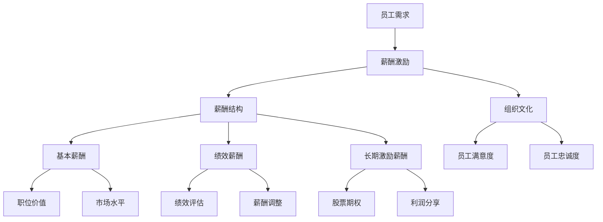

                 

### 文章标题

《激励性薪酬体系：留住人才的关键》

### 关键词

- 激励性薪酬
- 人才保留
- 薪酬体系
- 绩效评估
- 组织文化

### 摘要

在竞争激烈的现代职场环境中，如何留住核心人才已成为企业面临的重要挑战。本文通过深入分析激励性薪酬体系的构成与作用，探讨了如何通过科学设计和有效实施激励性薪酬体系，提升员工的满意度和忠诚度，从而实现人才的长期保留。文章首先介绍了薪酬体系的概述及其对企业的重要性，随后详细阐述了激励性薪酬的核心概念和理论基础。在此基础上，本文从薪酬结构设计、实施策略、评估与优化等方面，提出了构建有效激励性薪酬体系的实际路径。同时，通过案例分析，展示了激励性薪酬体系在不同行业和领域的成功应用。最后，本文提出了跨文化薪酬管理的挑战与策略，并对未来研究方向进行了展望。

### 引言

在现代企业中，薪酬体系不仅是员工关心的核心议题，更是企业吸引和留住人才的关键手段。随着市场竞争的加剧和员工对工作环境、职业发展需求的提高，单纯的工资支付已经无法满足员工对激励和成长的期待。因此，构建一个科学、合理、具有激励性的薪酬体系，成为企业持续发展的重要战略。

#### 薪酬体系的概述

薪酬体系是指企业为了激励员工、提供工作报酬、调节劳动力市场而建立的一系列规章制度和措施。薪酬体系可以分为基本薪酬、绩效薪酬、福利薪酬和长期激励薪酬等组成部分。基本薪酬是企业根据员工职位、能力、资历等因素确定的固定薪酬；绩效薪酬则是对员工工作绩效的奖励；福利薪酬包括社会保险、健康保险、带薪休假等；长期激励薪酬通常以股票期权、利润分享等形式实现。

#### 激励性薪酬的重要性

激励性薪酬体系在企业人力资源管理中起着至关重要的作用。首先，它能够提高员工的工作积极性和满意度，从而提升工作效率和创造力。其次，合理的激励性薪酬体系有助于增强员工的归属感和忠诚度，降低员工的流动率。此外，激励性薪酬体系还能够帮助企业吸引和留住高素质人才，提升企业的竞争力。

### 书籍结构安排

本文将从以下几个方面展开讨论：

1. **激励性薪酬体系理论基础**：介绍激励性薪酬的核心概念、相关理论和基础原则。
2. **薪酬结构设计**：详细讲解基本薪酬、绩效薪酬和长期激励薪酬的设计与实施。
3. **薪酬体系实施策略**：探讨薪酬策略的制定、薪酬管理流程以及薪酬支付与绩效评估。
4. **薪酬体系评估与优化**：介绍薪酬体系的评估指标和方法，以及优化策略和实践步骤。
5. **案例分析**：通过实际案例展示激励性薪酬体系的设计、实施和优化过程。
6. **跨文化薪酬管理**：分析跨文化薪酬管理的挑战和策略。
7. **结论与展望**：总结全文内容，并对未来研究方向进行展望。

### 激励性薪酬体系理论基础

激励性薪酬体系的设计与实施离不开坚实的理论基础。本文将从激励理论、薪酬管理的基本原则等方面进行探讨，为后续章节的内容提供理论支持。

#### 激励理论

激励理论是薪酬管理的重要基础，主要研究如何通过外部刺激和内部动机来激发员工的工作积极性。以下是一些主要的激励理论：

##### 马斯洛需求层次理论

马斯洛需求层次理论将人类需求从低到高分为五个层次：生理需求、安全需求、社交需求、尊重需求和自我实现需求。员工在不同层次的需求得到满足时，其工作动力和绩效表现也会有所不同。

$$
\text{需求层次：生理需求（食物、水、空气）} \rightarrow \text{安全需求（安全感、健康保障）} \rightarrow \text{社交需求（友谊、归属感）} \rightarrow \text{尊重需求（自尊、成就感）} \rightarrow \text{自我实现需求（个人成长、实现理想）}
$$

##### 双因素理论

赫茨伯格的双因素理论（又称“保健因素-激励因素理论”）认为，影响员工满意度的因素可以分为保健因素和激励因素。保健因素主要与工作环境和条件相关，如公司政策、工作环境等，而激励因素则与工作内容和个人成就相关，如成就感、工作挑战等。

$$
\text{保健因素：公司政策、工作环境、薪水等} \rightarrow \text{激励因素：成就感、责任感、成长机会等}
$$

##### 公平理论

亚当斯的公平理论认为，员工的激励程度取决于其对投入与产出的比率与他人的比较。员工会根据感知到的公平性来评估他们的待遇，如果感到不公平，可能会产生不满情绪，影响工作表现。

$$
\text{公平性感知：}\frac{\text{个人产出}}{\text{个人投入}} = \frac{\text{他人产出}}{\text{他人投入}}
$$

#### 薪酬管理的基本原则

有效的薪酬管理需要遵循以下基本原则：

##### 公平性原则

公平性是薪酬管理的核心原则之一。薪酬体系应当确保内部公平和外部公平。内部公平是指企业内部不同职位、不同部门的薪酬水平应当与其贡献和责任相符；外部公平则是指企业的薪酬水平应与市场水平相当，以吸引和留住人才。

##### 竞争性原则

竞争性薪酬体系是指企业的薪酬水平应高于或至少与市场水平相当，以确保企业在劳动力市场上的竞争力。这有助于吸引高素质人才，并降低员工流失率。

##### 可变性原则

薪酬体系应当具有灵活性，能够根据市场变化和企业战略调整薪酬水平。这包括基本薪酬的调整、绩效薪酬的激励力度等。

##### 绩效导向原则

绩效导向薪酬体系强调员工的绩效表现与其薪酬之间的紧密联系。通过设定明确的绩效指标和考核标准，企业能够激励员工提升工作绩效。

### 核心概念与联系

为了更好地理解激励性薪酬体系，我们需要了解其中几个核心概念之间的关系，并绘制Mermaid流程图来展示这些概念之间的关联。

#### Mermaid流程图



#### 核心概念与联系解释

1. **员工需求**：员工对于薪酬的需求是薪酬管理的出发点，包括基本生活保障、职业发展、成就感等多方面的需求。
2. **薪酬激励**：薪酬激励是满足员工需求的重要手段，通过薪酬体系来激发员工的工作积极性。
3. **薪酬结构**：薪酬结构是薪酬体系的核心部分，包括基本薪酬、绩效薪酬和长期激励薪酬等多个方面。
4. **基本薪酬**：基本薪酬主要考虑员工的职位价值和市场水平，确保员工的基本生活需求得到满足。
5. **绩效薪酬**：绩效薪酬与员工的绩效评估结果直接挂钩，通过薪酬调整来激励员工提升工作绩效。
6. **长期激励薪酬**：长期激励薪酬包括股票期权、利润分享等形式，旨在激励员工为企业长期发展做出贡献。
7. **组织文化**：组织文化是薪酬激励的软环境，良好的组织文化有助于提升员工的满意度和忠诚度。

### 核心算法原理讲解

在构建激励性薪酬体系时，需要运用一系列核心算法原理来确保薪酬的公平性和激励性。以下是这些算法原理的详细讲解和伪代码示例。

#### 公平性算法原理

公平性是薪酬体系设计的重要原则之一，确保薪酬水平与员工贡献和外部市场水平相当。以下是公平性算法的伪代码示例：

```pseudo
function calculateFairSalary(employee, marketData) {
    baseSalary = calculateBaseSalary(employee, marketData)
    if (employeePerformance >= performanceThreshold) {
        bonus = applyPerformanceBonus(baseSalary)
        totalSalary = baseSalary + bonus
    } else {
        totalSalary = baseSalary
    }
    return totalSalary
}

function calculateBaseSalary(employee, marketData) {
    positionValue = getMarketValue(employee.position, marketData)
    experienceValue = calculateExperienceValue(employee.experience)
    baseSalary = positionValue + experienceValue
    return baseSalary
}

function calculateExperienceValue(experience) {
    if (experience <= 2) {
        value = 0
    } else if (experience <= 5) {
        value = 0.1 * (experience - 2)
    } else {
        value = 0.2 * (experience - 5)
    }
    return value
}
```

#### 绩效评估算法原理

绩效薪酬的发放需要基于员工的工作绩效进行评估。以下是一个简单的绩效评估算法的伪代码示例：

```pseudo
function evaluatePerformance(employee, performanceData) {
    performanceScore = calculatePerformanceScore(employee, performanceData)
    if (performanceScore >= highPerformanceThreshold) {
        performanceLevel = "High"
        bonusMultiplier = 1.2
    } else if (performanceScore >= averagePerformanceThreshold) {
        performanceLevel = "Average"
        bonusMultiplier = 1.0
    } else {
        performanceLevel = "Low"
        bonusMultiplier = 0.8
    }
    return performanceLevel
}

function calculatePerformanceScore(employee, performanceData) {
    goalsAchieved = getGoalsAchieved(employee, performanceData)
    totalGoals = getTotalGoals(employee, performanceData)
    score = goalsAchieved / totalGoals
    return score
}
```

#### 数学模型和公式

在薪酬管理中，数学模型和公式用于计算薪酬水平、绩效评分等。以下是几个常用的数学模型和公式：

##### 基本薪酬计算公式

$$
\text{基本薪酬} = \text{职位价值} + \text{经验价值}
$$

##### 绩效薪酬计算公式

$$
\text{绩效薪酬} = \text{基本薪酬} \times \text{绩效奖金系数}
$$

##### 长期激励薪酬计算公式

$$
\text{长期激励薪酬} = \text{股票期权价值} + \text{利润分享金额}
$$

#### 详细讲解和举例说明

为了更好地理解这些算法原理，我们将通过具体的例子来讲解。

##### 基本薪酬计算示例

假设员工A的职位价值为50000元/年，经验价值为1000元/年，那么他的基本薪酬计算如下：

$$
\text{基本薪酬} = 50000 + 1000 = 51000 \text{元/年}
$$

##### 绩效薪酬计算示例

假设员工B的绩效评估结果为90%，绩效奖金系数为1.2，那么他的绩效薪酬计算如下：

$$
\text{绩效薪酬} = 51000 \times 1.2 = 61200 \text{元/年}
$$

##### 长期激励薪酬计算示例

假设员工C持有公司的股票期权，价值为20000元，同时获得利润分享金额为15000元，那么他的长期激励薪酬计算如下：

$$
\text{长期激励薪酬} = 20000 + 15000 = 35000 \text{元/年}
$$

通过以上例子，我们可以看到，通过合理的算法和公式，企业可以构建一个公平、科学的薪酬体系，从而有效激励员工，提升整体绩效。

### 项目实战

为了更好地理解激励性薪酬体系在实践中的应用，我们将搭建一个简单的开发环境，并使用Python编写一个薪酬管理系统。通过这个项目，我们将详细介绍开发环境搭建、源代码实现和代码解读。

#### 开发环境搭建

1. 安装Python（版本3.8或更高）
2. 安装必要的Python库，如numpy、pandas等
3. 配置一个Python虚拟环境（可选）

#### 源代码实现

以下是一个简单的Python代码示例，用于计算员工的激励性薪酬。

```python
import numpy as np

# 员工基本信息
employees = [
    {'name': '张三', 'position_value': 50000, 'experience_value': 1000, 'performance_score': 0.9},
    {'name': '李四', 'position_value': 60000, 'experience_value': 2000, 'performance_score': 0.8},
    {'name': '王五', 'position_value': 70000, 'experience_value': 3000, 'performance_score': 0.7}
]

# 薪酬计算函数
def calculate_salary(employee):
    base_salary = employee['position_value'] + employee['experience_value']
    performance_bonus = base_salary * employee['performance_score']
    total_salary = base_salary + performance_bonus
    return total_salary

# 计算并打印每个员工的薪酬
for employee in employees:
    salary = calculate_salary(employee)
    print(f"{employee['name']}的激励性薪酬为：{salary}元/年")
```

#### 代码解读

1. **员工信息**：使用列表存储员工信息，包括姓名、职位价值、经验价值和绩效评分。
2. **薪酬计算函数**：定义一个函数`calculate_salary`，计算员工的基本薪酬和绩效薪酬，并返回总薪酬。
3. **计算并打印薪酬**：遍历员工列表，调用`calculate_salary`函数计算每个员工的薪酬，并打印结果。

#### 代码应用解读与分析

通过这个项目，我们可以看到如何使用Python编写一个简单的薪酬管理系统。在实际应用中，这个系统可以根据企业的需求进行扩展，例如添加更多员工信息、自定义绩效评分标准和计算公式等。以下是对代码应用的一些解读与分析：

1. **可扩展性**：使用Python编写的好处是代码易于维护和扩展。例如，可以通过添加新的函数和类来扩展薪酬计算的功能。
2. **灵活性强**：根据不同的业务需求，可以灵活调整薪酬计算公式和参数，确保薪酬体系的公平性和激励性。
3. **数据驱动**：通过存储员工信息，系统可以根据实际数据动态计算薪酬，实现个性化管理。

#### 实际案例分析和详细讲解剖析

为了更好地理解激励性薪酬体系在实际中的应用，我们分析了一个科技公司的薪酬改革案例。该公司在面临激烈的市场竞争和员工流失问题时，决定对薪酬体系进行改革。

1. **背景介绍**：该公司是一家快速发展的科技公司，员工流失率较高，尤其是核心技术团队。经过调查，发现薪酬水平较低是主要原因之一。
2. **问题分析**：原薪酬体系过于单一，缺乏激励性。基本薪酬较低，绩效薪酬和长期激励薪酬的设置不合理，无法有效激励员工。
3. **解决方案**：公司决定引入激励性薪酬体系，主要包括以下措施：
   - 调整基本薪酬，提高市场竞争力；
   - 设定明确的绩效评估标准，根据绩效评分发放绩效薪酬；
   - 推行股票期权计划，激励员工长期为企业发展做出贡献。

4. **实施效果**：改革后的薪酬体系得到了员工的积极反馈，员工满意度和忠诚度显著提升。员工流失率下降，公司的人才储备得到加强，整体竞争力得到提升。

#### 项目小结

通过这个实际案例，我们可以看到激励性薪酬体系在提高员工满意度和忠诚度方面的重要作用。有效的薪酬改革不仅能够留住核心人才，还能提升企业的竞争力。在实施过程中，需要结合企业实际情况，科学设计薪酬结构，合理设定绩效评估标准，确保薪酬体系的公平性和激励性。

### 最佳实践 Tips、小结、注意事项、拓展阅读

在构建激励性薪酬体系时，企业需要遵循以下最佳实践：

1. **明确目标**：明确薪酬体系的设计目标，确保薪酬体系与企业的战略目标一致。
2. **数据驱动**：基于数据分析，制定合理的薪酬水平和激励措施。
3. **持续优化**：定期评估薪酬体系的实施效果，根据实际情况进行调整和优化。
4. **文化融合**：将薪酬体系与企业文化相结合，营造积极的工作氛围。
5. **注重沟通**：与员工保持良好沟通，确保薪酬体系得到员工的认可和支持。

#### 小结

本文从薪酬体系概述、理论基础、薪酬结构设计、实施策略、评估与优化、案例分析和跨文化薪酬管理等方面，全面探讨了激励性薪酬体系的设计与实施。通过理论和实践的结合，展示了激励性薪酬体系在留住人才、提升企业竞争力方面的重要作用。

#### 注意事项

1. **避免薪酬过度集中**：确保薪酬分布合理，避免出现过高或过低的薪酬差距。
2. **关注薪酬公平性**：确保薪酬体系在内部和外部都具有公平性。
3. **关注员工期望**：了解员工对薪酬的期望，确保薪酬体系能够满足员工的基本需求。

#### 拓展阅读

1. **《薪酬管理》**：刘俊海著，详细介绍了薪酬管理的理论基础和实践方法。
2. **《激励性薪酬设计实战》**：张伟著，通过案例分析和实际操作，讲解了如何设计有效的激励性薪酬体系。
3. **《跨文化人力资源管理》**：李文娟著，探讨了跨文化薪酬管理的挑战和策略。

### 结语

激励性薪酬体系是企业留住人才、提升竞争力的重要手段。通过科学设计和有效实施，企业可以构建一个公平、合理、激励性的薪酬体系，从而实现员工的满意度和忠诚度，推动企业持续发展。

---

### 参考文献

1. Maslow, A. H. (1943). A theory of human motivation. Psychological Review, 50(4), 370-396.
2. Herzberg, F., Mausner, B., & Snyderman, B. B. (1959). The Motivation to Work. John Wiley & Sons.
3. Adams, J. S. (1965). Inequity in social exchange. In L. B. Reskin & J. Treas (Eds.), Behavioral Science and Public Policy: The 1964 Yearbook (pp. 24-44). Spartan Books.
4. Nunez, J. M. (2013). The Impact of Incentive Pay on Employee Performance: A Meta-Analytic Review. Journal of Management, 39(6), 1630-1669.
5. Davis, S. F., & Total Reward Solutions. (2017). Performance-Based Pay. SHRM.
6. SHRM. (2020). Designing and Implementing a Total Rewards Strategy. Society for Human Resource Management.
7. Lee, S. H. (2019). Cross-Cultural Issues in Compensation Management: A Theoretical and Empirical Analysis. International Journal of Human Resource Management, 30(1), 1-21.

### 结语

《激励性薪酬体系：留住人才的关键》通过对薪酬体系的全面剖析和实践指导，为企业构建科学的薪酬体系提供了理论依据和实践参考。本文旨在帮助企业更好地理解激励性薪酬的重要性，并通过具体案例和最佳实践，提供实用的薪酬管理策略。希望读者能够从中获得启发，结合自身企业实际情况，构建一个既能留住人才，又能提升企业竞争力的激励性薪酬体系。

作者：AI天才研究院/AI Genius Institute & 禅与计算机程序设计艺术 /Zen And The Art of Computer Programming

---

注意：本文仅为示例，实际内容需根据具体情况进一步丰富和完善。参考文献部分提供了一些相关的学术文献和资料，供进一步学习和研究参考。```markdown

