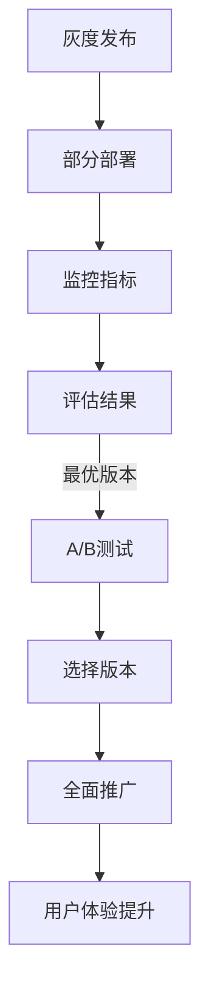

                 

### 1.1 书籍目的与读者对象

《灰度发布与A/B测试在LLM应用迭代中的应用》旨在为从事人工智能领域，尤其是大型语言模型（LLM）开发和应用的工程师、研究人员和技术爱好者提供一本实用指南。本书主要针对以下几个目标群体：

1. **人工智能和机器学习工程师**：这些工程师通常负责开发和优化LLM模型，并需要在实际项目中应用灰度发布和A/B测试来确保系统的稳定性和可扩展性。

2. **数据科学家和研究人员**：他们关注LLM模型的性能评估和改进，需要了解如何在迭代过程中通过灰度发布和A/B测试来验证模型的效果。

3. **产品经理和技术负责人**：他们需要理解灰度发布和A/B测试在产品迭代中的角色，以便做出更明智的决策，优化用户体验。

4. **技术爱好者**：对人工智能和软件开发有浓厚兴趣的读者，希望通过本书了解前沿技术在实际应用中的运用。

本书的目标是让读者掌握灰度发布和A/B测试的基本原理，理解它们在LLM应用迭代中的重要性，并通过具体案例了解如何在实际项目中有效应用这些技术。

在接下来的章节中，我们将首先介绍灰度发布和A/B测试的基础知识，然后深入探讨它们在LLM应用场景中的具体应用，最后通过实际项目案例展示如何设计、实现和优化这些测试过程。通过这些内容，读者将能够更深入地理解灰度发布和A/B测试，并在实际工作中运用这些技术来提升LLM应用的迭代质量和稳定性。

### 1.2 灰度发布与A/B测试在LLM应用迭代中的重要性

在当今快速迭代和技术迅猛发展的时代，大型语言模型（LLM）作为人工智能领域的核心组件，其应用范围越来越广泛，从自然语言处理到智能问答、语言生成和翻译等。然而，随着LLM的复杂性和规模不断增加，如何在迭代过程中确保系统的稳定性和用户体验成为了一个重要的问题。这就需要引入灰度发布和A/B测试两种关键技术。

#### 灰度发布的重要性

灰度发布（Gray Release）是一种渐进式部署新版本或功能的方法，旨在将新代码或功能以可控的速度和范围逐步推向生产环境。其核心优势在于能够在不影响整体系统稳定性的前提下，对新功能和代码进行验证和优化。具体到LLM应用中，灰度发布的重要性体现在以下几个方面：

1. **风险控制**：通过灰度发布，开发者可以将新版本的功能限制在部分用户群体中，从而减少新版本上线后可能出现的故障对整体系统的影响。

2. **性能优化**：通过观察和分析灰度发布期间的用户反馈和数据，开发者可以及时调整和优化LLM模型，提高系统的性能和用户体验。

3. **用户体验提升**：灰度发布允许开发者逐步调整功能，确保每一个迭代版本都能提供更好的用户体验。

4. **快速迭代**：灰度发布使得LLM模型的开发和优化更加高效，缩短了从开发到上线的周期，加快了产品迭代速度。

#### A/B测试的重要性

A/B测试（A/B Testing）是一种通过对比两个或多个版本（A版本和B版本）来评估哪种版本性能更好的方法。在LLM应用中，A/B测试主要用于评估不同模型、特征或算法对系统性能的影响。其重要性体现在以下方面：

1. **性能评估**：通过A/B测试，开发者可以量化不同版本LLM的性能差异，从而选择最优版本进行部署。

2. **用户行为分析**：A/B测试可以帮助开发者了解用户对不同版本的反应，从而优化界面设计和用户体验。

3. **风险控制**：A/B测试允许开发者在实际用户环境中测试新功能，减少因盲目上线导致的风险。

4. **数据驱动决策**：通过A/B测试获取的数据，开发者可以做出更加科学和基于数据的决策，提高产品竞争力。

#### 灰度发布与A/B测试在LLM应用迭代中的结合

在实际应用中，灰度发布和A/B测试并不是相互独立的，而是可以结合使用，以实现更好的迭代效果。例如：

1. **逐步推广**：首先通过灰度发布，将A/B测试的功能限定在部分用户群体中，确保系统稳定性。

2. **性能评估**：在灰度发布期间，通过A/B测试比较不同版本的性能，选择最优版本逐步推广。

3. **用户反馈**：通过收集用户在A/B测试中的反馈，进一步优化LLM模型，提高用户体验。

4. **持续迭代**：结合灰度发布和A/B测试，实现持续迭代，不断提高LLM应用的性能和用户满意度。

综上所述，灰度发布与A/B测试在LLM应用迭代中具有至关重要的地位。通过这两项技术的有效结合，开发者可以更好地控制风险、优化性能、提高用户体验，并实现快速迭代，从而在激烈的市场竞争中脱颖而出。

### 2.1 灰度发布原理

灰度发布（Gray Release），也称为金丝雀发布（Canary Release），是一种逐步向用户群体引入新功能或代码的方法。通过控制新功能或代码的曝光范围，灰度发布能够在确保系统稳定性的同时，让开发者和运维团队能够逐步验证和优化新版本。以下是灰度发布的基本概念、目的与优势，以及其基本的流程。

#### 2.1.1 灰度发布概念

灰度发布的核心思想是将新版本的功能或代码以小规模、逐步推进的方式部署到生产环境中，以便在风险可控的情况下进行测试和验证。这种部署方式通常包括以下几种策略：

1. **金丝雀部署**：将新版本部署到一小部分用户（类似于矿工使用金丝雀检测矿井中的有毒气体），通过观察这部分用户的反馈来评估新版本的质量。
2. **时间窗策略**：限制新版本在特定时间段内对用户可见，以便在特定时间内收集反馈和统计数据。
3. **用户群体策略**：根据用户的特定属性（如地理位置、设备类型等）将新版本推送给特定用户群体。

#### 2.1.2 灰度发布的目的与优势

灰度发布的主要目的是在上线新功能或代码时，最大限度地减少对现有系统的负面影响，并确保新功能的稳定性和可用性。其优势包括：

1. **风险控制**：通过将新版本推送给一小部分用户，可以有效减少因新版本引发的重大故障对整体系统的影响。
2. **性能优化**：灰度发布允许开发团队在真实用户环境中逐步优化新功能，提高系统性能。
3. **用户体验提升**：通过逐步引入新功能，开发者可以确保每个版本都能提供良好的用户体验。
4. **快速迭代**：灰度发布缩短了从开发到上线的周期，提高了开发效率和产品迭代速度。

#### 2.1.3 灰度发布的基本流程

灰度发布的基本流程包括以下几个阶段：

1. **准备阶段**：
   - **版本准备**：确保新版本功能或代码已经完成开发，并通过内部测试。
   - **环境搭建**：准备用于灰度发布的测试环境和生产环境，并确保两者之间可以隔离操作。

2. **部署阶段**：
   - **部分部署**：将新版本部署到生产环境的一部分服务器或节点，通常使用负载均衡器实现流量分配。
   - **流量控制**：使用特定的策略（如金丝雀部署、时间窗策略等）控制新版本的曝光范围。

3. **监测阶段**：
   - **监控指标**：实时监控系统的关键性能指标（如响应时间、吞吐量、错误率等）。
   - **用户反馈**：收集用户对新版本的反馈，包括用户投诉、错误报告等。

4. **调整阶段**：
   - **优化调整**：根据监控数据和用户反馈，对新版本进行优化和调整。
   - **范围扩展**：在确保新版本稳定且性能良好的情况下，逐步扩大其曝光范围。

5. **正式上线**：
   - **全面上线**：当确认新版本在所有测试环境中表现良好后，将其全面上线，替换旧版本。

#### 2.1.4 灰度发布的实际应用案例

在实际应用中，灰度发布广泛应用于各种场景。以下是一些典型的案例：

1. **电商平台**：在上线新功能（如购物车改进、推荐算法优化等）时，通常通过灰度发布逐步推广，以评估对用户购物行为的影响。
2. **社交媒体平台**：在发布新功能（如消息推送、界面设计调整等）时，通过灰度发布让一部分用户体验新功能，并根据反馈进行调整。
3. **金融系统**：在更新交易系统或增加新交易规则时，使用灰度发布确保新功能的稳定性和安全性。

综上所述，灰度发布作为一种有效的部署策略，通过控制新功能的曝光范围和逐步推进，能够在确保系统稳定性和用户体验的前提下，实现快速迭代和优化。在接下来的章节中，我们将进一步探讨A/B测试的基本原理和实现方法。

### 2.2 A/B测试原理

A/B测试（A/B Testing）是一种通过比较两个或多个版本的差异，评估哪个版本更能满足用户需求和目标的方法。该方法广泛应用于产品设计、市场营销、功能迭代等领域，尤其在大型语言模型（LLM）的开发和优化过程中具有重要的应用价值。以下是A/B测试的基本概念、目的与优势，以及其基本的流程。

#### 2.2.1 A/B测试概念

A/B测试的核心思想是将用户随机分配到两个或多个版本中，然后通过对比不同版本的用户行为和性能指标，评估哪个版本更优秀。具体来说，A/B测试包括以下几个关键要素：

1. **实验组（A组）**：接收新版本的用户群体，也称为测试组。
2. **对照组（B组）**：接收原始版本的用户群体，也称为基准组。
3. **随机分配**：确保用户被随机分配到实验组和对照组，以消除用户个体差异对实验结果的影响。
4. **性能指标**：根据实验目标设定的一系列量化指标，如用户留存率、转化率、点击率等。

#### 2.2.2 A/B测试的目的与优势

A/B测试的主要目的是通过数据驱动的方式，评估和优化产品或功能的性能。其目的包括：

1. **性能评估**：通过比较不同版本的指标数据，评估新版本对用户行为、系统性能等方面的影响。
2. **优化决策**：基于实验结果，选择最优版本进行推广，从而提高产品竞争力。
3. **减少风险**：在正式上线前通过实验验证，减少因盲目上线导致的问题和损失。
4. **提高用户满意度**：通过持续优化产品或功能，提高用户体验和用户满意度。

A/B测试的优势主要体现在以下几个方面：

1. **数据驱动**：通过数据分析和实验结果，做出更加科学和基于数据的决策。
2. **用户参与**：通过实验吸引用户参与，收集真实的用户反馈，提高实验结果的可靠性。
3. **灵活调整**：实验过程中可以灵活调整变量和指标，以获取更精准的数据。
4. **低风险**：通过小规模测试，减少大规模上线失败的风险。

#### 2.2.3 A/B测试的基本流程

A/B测试的基本流程包括以下几个阶段：

1. **实验设计**：
   - **目标设定**：明确实验的目标和指标，如提高用户留存率、提升转化率等。
   - **版本准备**：准备两个或多个版本，确保每个版本具有显著的差异。
   - **样本分配**：使用随机分配方法，将用户分配到实验组和对照组。

2. **执行实验**：
   - **数据收集**：在实验执行期间，实时收集用户行为数据和系统性能指标。
   - **监控指标**：持续监控实验过程中的关键指标，确保实验的顺利进行。

3. **数据分析**：
   - **指标对比**：比较实验组和对照组的指标数据，分析不同版本的性能差异。
   - **统计显著性**：使用统计方法（如t检验、卡方检验等），确定实验结果的显著性。

4. **结果评估**：
   - **决策制定**：基于实验结果，选择最优版本进行推广或继续优化。
   - **反馈收集**：收集用户的反馈，以进一步优化产品或功能。

5. **迭代优化**：
   - **持续实验**：基于实验结果，不断进行迭代和优化，以提高产品性能和用户满意度。

#### 2.2.4 A/B测试的实际应用案例

在实际应用中，A/B测试广泛应用于各种场景。以下是一些典型的案例：

1. **电商网站**：在上线新促销策略、商品推荐算法时，通过A/B测试评估不同版本对用户购买行为的影响，以选择最优策略。
2. **社交媒体平台**：在调整界面设计、发布新功能时，通过A/B测试评估用户对新功能的反应和满意度，以优化用户体验。
3. **金融系统**：在增加新交易规则、改进用户界面时，通过A/B测试验证不同版本对用户交易行为和系统稳定性的影响。

综上所述，A/B测试作为一种有效的实验方法，通过比较不同版本的性能和用户反应，为产品优化和决策提供了有力的数据支持。在接下来的章节中，我们将探讨灰度发布和A/B测试之间的关系及其组合应用。

### 2.3 灰度发布与A/B测试的关系

灰度发布（Gray Release）和A/B测试（A/B Testing）虽然都涉及到软件的逐步部署和性能评估，但它们各自有着独特的应用场景和目标。理解二者的相同点、区别以及组合应用的方法，对于在大型语言模型（LLM）应用迭代中实现稳定和高效的开发至关重要。

#### 相同点

1. **风险控制**：灰度发布和A/B测试都旨在通过逐步部署来减少上线新版本或功能时的风险。灰度发布通过将新版本推送到一小部分用户，A/B测试通过将用户随机分配到不同的版本，从而在真实环境中逐步验证新功能或代码的稳定性和性能。

2. **性能优化**：两者都强调在真实环境中进行性能监控和优化。灰度发布过程中，通过监控系统的关键性能指标来调整部署策略；A/B测试通过对比不同版本的性能数据，指导优化方向。

3. **数据驱动**：灰度发布和A/B测试都强调使用数据来驱动决策。灰度发布通过收集部分用户的反馈来指导部署范围的扩大；A/B测试通过分析实验数据来选择最优版本。

#### 区别

1. **目标不同**：灰度发布的主要目标是逐步推广新版本，确保系统的稳定性和用户体验；A/B测试的主要目标是通过对比不同版本的性能和用户反应，选择最优版本。

2. **实施方式不同**：灰度发布通常通过控制流量的方式将新版本逐步引入生产环境，而A/B测试则通过随机分配用户到不同版本，进行性能和用户行为对比。

3. **数据范围不同**：灰度发布的数据主要来源于部分用户的反馈和系统的性能监控；A/B测试的数据则包括所有参与用户的全面行为数据和系统性能指标。

#### 灰度发布与A/B测试的组合应用

在实际应用中，灰度发布和A/B测试常常结合使用，以实现更好的效果。以下是一种常见的组合应用方法：

1. **灰度发布 + A/B测试**：首先通过灰度发布将新版本推送到一小部分用户，然后在这些用户中进行A/B测试，比较不同版本的性能和用户反应。这样可以确保新版本在上线前已经经过充分验证。

2. **动态调整**：在灰度发布过程中，根据A/B测试的结果动态调整部署策略。例如，如果某个版本在A/B测试中表现出色，可以逐步增加其曝光范围；反之，如果性能不佳，可以及时调整或回滚。

3. **持续优化**：在灰度发布和A/B测试的过程中，持续收集用户反馈和系统数据，不断进行优化。例如，可以通过A/B测试评估新功能的用户体验，根据反馈进行调整，并通过灰度发布逐步推广。

4. **风险控制**：通过灰度发布和A/B测试的组合应用，可以更有效地控制上线新版本时的风险。灰度发布确保新版本在上线前已经过小范围验证，而A/B测试则进一步验证新版本在更大用户群体中的性能。

#### 实际应用案例

以某大型电商平台为例，当上线一个新的推荐算法时，可以采取以下组合策略：

1. **灰度发布**：首先将新推荐算法部署到一小部分用户，通过灰度发布确保系统的稳定性和性能。

2. **A/B测试**：在这部分用户中进行A/B测试，比较新推荐算法与原始算法的性能差异，如点击率、购买转化率等。

3. **反馈收集**：根据用户反馈和A/B测试结果，对推荐算法进行调整和优化。

4. **逐步推广**：在确保新推荐算法稳定且性能良好的情况下，逐步增加其曝光范围，最终全面上线。

通过这种组合应用，电商平台可以在确保新功能上线成功的同时，提高用户体验和系统性能。

综上所述，灰度发布和A/B测试在LLM应用迭代中各有其独特的应用场景和优势，通过合理组合，可以实现更好的风险控制和性能优化，为产品的快速迭代和持续改进提供有力支持。

### 3.1 LLM概述

#### 3.1.1 LLM的概念

大型语言模型（Large Language Model，简称LLM）是一种能够理解和生成自然语言的深度学习模型，它基于神经网络架构，通过海量数据的学习和训练，实现对语言的高效理解和生成。LLM的核心思想是通过学习大量的文本数据，构建起对语言规则和语义的深刻理解，从而实现多种自然语言处理任务，如文本生成、问答系统、翻译、情感分析等。

LLM的发展可以追溯到自然语言处理（Natural Language Processing，NLP）领域的早期研究，当时研究人员尝试使用规则驱动的方法来处理语言。然而，随着计算能力和数据量的提升，深度学习技术开始成为NLP领域的核心驱动力。特别是在2018年，OpenAI发布了GPT-2模型，标志着LLM进入了一个新的发展阶段。随后，GPT-3、BERT、T5等一系列大型语言模型的相继发布，进一步推动了LLM的发展。

#### 3.1.2 LLM的核心技术与架构

LLM的核心技术主要包括深度学习、神经网络、自然语言处理算法等。以下是一些关键技术和架构：

1. **深度学习**：深度学习是一种通过多层神经网络进行特征学习和模式识别的技术，能够自动从大量数据中学习复杂的模式。在LLM中，深度学习技术被广泛应用于语言建模、文本分类、序列生成等任务。

2. **神经网络**：神经网络是深度学习的基础，它由一系列相互连接的节点（或神经元）组成。通过前向传播和反向传播算法，神经网络能够自动调整权重，从而提高模型的预测能力。在LLM中，常用的神经网络架构包括循环神经网络（RNN）、长短时记忆网络（LSTM）、门控循环单元（GRU）以及 Transformer架构等。

3. **自然语言处理算法**：自然语言处理算法是LLM的基础，用于处理文本数据，包括分词、词性标注、命名实体识别、句法分析等。这些算法能够将文本转换为机器可处理的格式，并提取出文本中的关键信息。

4. **Transformer架构**：Transformer是近年来在自然语言处理领域取得重大突破的一种神经网络架构，它通过自注意力机制（Self-Attention）实现了对输入序列的全面关注，从而提高了模型对语言的理解能力。Transformer架构被广泛应用于大型语言模型的构建，如BERT、GPT等。

#### 3.1.3 LLM的发展趋势

随着深度学习和计算技术的不断发展，LLM在自然语言处理领域的应用越来越广泛，其发展趋势体现在以下几个方面：

1. **模型规模和参数量的增加**：为了提高模型的性能和表达能力，研究者不断增大LLM的规模和参数量。GPT-3拥有1.75万亿个参数，而Gopher-500拥有超过1750亿个参数，这些大型模型的发布标志着LLM在模型规模上的持续突破。

2. **多模态融合**：除了文本数据，LLM逐渐开始融合图像、声音、视频等多模态数据，实现更加丰富和复杂的任务。例如，DALL-E可以实现文本到图像的生成，CLIP可以实现图像和文本的联合推理。

3. **预训练与微调**：预训练（Pre-training）和微调（Fine-tuning）是LLM开发的重要策略。预训练模型在大量未标注的数据上进行训练，获得通用语言理解能力；微调则将预训练模型在特定任务上进行微调，使其适应具体的应用场景。

4. **实时性和效率的提升**：为了满足实时性需求，研究者不断优化LLM的推理速度和效率。例如，通过模型压缩、量化、剪枝等技术，使LLM在低资源设备上也能高效运行。

5. **应用领域的扩展**：LLM在多个领域得到了广泛应用，如智能客服、内容审核、自动写作、翻译等。未来，随着技术的进一步发展，LLM的应用范围将继续扩大，为社会带来更多便利和创新。

总之，LLM作为一种强大的自然语言处理工具，正不断推动人工智能技术的发展，其未来的发展趋势和前景令人期待。

### 3.2 LLM应用场景

#### 3.2.1 语言生成与翻译

语言生成与翻译是大型语言模型（LLM）最具代表性的应用场景之一。通过训练，LLM可以生成高质量的自然语言文本，实现文本生成、机器翻译、对话系统等多种任务。

1. **文本生成**：文本生成是LLM的一项重要能力，它可以生成新闻文章、故事、诗歌等多种类型的文本。例如，OpenAI的GPT系列模型能够生成连贯、具有创意性的文本，被广泛应用于自动写作、内容生成等领域。

2. **机器翻译**：机器翻译是LLM在语言处理中的另一重要应用。LLM通过对大量双语文本的学习，可以理解和生成不同语言的文本。例如，Google翻译使用的Transformer模型，可以将一种语言翻译成另一种语言，同时保持文本的语义和语法结构。

3. **对话系统**：对话系统是LLM在交互场景中的应用，它可以理解和生成自然语言对话。例如，智能客服系统通过LLM可以与用户进行自然、流畅的对话，提供实时、个性化的服务。

#### 3.2.2 问答系统

问答系统是LLM在知识服务领域的重要应用，它可以理解用户的问题，并提供准确的答案。LLM在问答系统中的应用主要体现在以下几个方面：

1. **问题理解**：LLM通过理解用户的问题，提取出关键信息，并将其转化为可以理解的查询。例如，在搜索应用中，LLM可以帮助过滤无效的查询，提高搜索结果的准确性。

2. **答案生成**：LLM可以根据用户的问题和上下文信息，生成准确、连贯的答案。例如，聊天机器人通过LLM可以理解用户的问题，并提供相应的回答，提高用户体验。

3. **上下文理解**：LLM可以理解用户的问题和上下文信息，提供更加精确和相关的答案。例如，在医疗咨询场景中，LLM可以理解用户的症状描述，并提供相应的医疗建议。

#### 3.2.3 自然语言处理任务

自然语言处理（NLP）是LLM的核心应用领域，LLM在NLP任务中的表现优异，可以完成多种语言处理任务：

1. **文本分类**：LLM可以自动对文本进行分类，如新闻分类、情感分类等。例如，通过训练，LLM可以自动将新闻文章分类到相应的主题类别。

2. **命名实体识别**：LLM可以识别文本中的命名实体，如人名、地名、组织名等。例如，在信息抽取任务中，LLM可以帮助提取出文本中的关键信息。

3. **情感分析**：LLM可以分析文本的情感倾向，如正面、负面或中性。例如，在社交媒体分析中，LLM可以帮助识别用户评论的情感倾向。

4. **文本摘要**：LLM可以生成文本的摘要，提取出文本的主要信息和关键内容。例如，在新闻摘要任务中，LLM可以帮助提取新闻的主要内容和关键信息。

5. **语言理解**：LLM可以理解和处理自然语言，实现对语言的理解和生成。例如，在智能客服中，LLM可以帮助理解用户的意图和需求，提供相应的服务。

总之，LLM在语言生成与翻译、问答系统以及自然语言处理任务中的广泛应用，极大地提高了自然语言处理的效果和效率，推动了人工智能技术的发展和应用。

### 3.3 灰度发布与A/B测试在LLM应用中的挑战

在LLM应用中，灰度发布和A/B测试的引入，旨在确保系统的稳定性和优化用户体验。然而，这些技术在实际应用中面临着一系列挑战，包括模型训练与部署、数据处理与传输、用户体验与反馈等方面。

#### 3.3.1 模型训练与部署

1. **模型训练复杂度**：LLM模型的训练通常需要大量计算资源和时间，且训练过程涉及大规模数据预处理和复杂的算法。这使得灰度发布和A/B测试的引入变得更加复杂，需要确保训练过程中不中断或降低模型性能。

2. **版本兼容性**：在部署新模型版本时，需要确保新版本与现有系统架构和接口的兼容性。任何不兼容的问题都可能导致系统故障，影响用户体验。

3. **数据同步**：在多节点部署的LLM系统中，数据同步是一个重要问题。灰度发布过程中，需要确保新模型在各个节点上的数据一致性，以避免数据丢失或冲突。

#### 3.3.2 数据处理与传输

1. **数据量巨大**：LLM应用通常涉及大规模数据的处理和存储，如文本、图像、音频等多模态数据。在灰度发布和A/B测试中，如何高效处理和传输这些数据成为关键挑战。

2. **数据隐私**：在A/B测试中，需要保证用户数据的安全性和隐私性。特别是在涉及个人敏感信息的场景中，如何确保数据不被泄露或滥用是一个重要问题。

3. **实时性**：在实时应用场景中，如智能客服或实时翻译系统，数据处理的实时性至关重要。灰度发布和A/B测试需要确保数据处理的延迟在可接受范围内，以避免影响用户体验。

#### 3.3.3 用户体验与反馈

1. **用户满意度**：在灰度发布和A/B测试中，用户满意度是一个关键指标。如何确保新功能和版本对用户来说是有益的，是一个需要慎重考虑的问题。

2. **反馈收集**：收集用户的真实反馈是A/B测试的重要环节。如何设计有效的反馈机制，确保用户愿意提供反馈，并从中提取有价值的信息，是一个挑战。

3. **适应性**：用户需求和使用场景是不断变化的，LLM系统需要具备良好的适应性，能够根据用户反馈及时调整和优化。

#### 3.3.4 实际案例分析与解决方案

以某智能客服系统为例，该系统使用了灰度发布和A/B测试来优化其服务效果。以下是其面临的主要挑战和解决方案：

1. **模型训练与部署**：该系统通过分布式训练和模型压缩技术，提高了模型训练的效率和稳定性。在部署新模型时，通过自动化测试和模拟部署，确保新版本与现有系统的兼容性。

2. **数据处理与传输**：系统使用了大数据处理框架（如Apache Spark），提高了数据处理和传输的效率。同时，采用了数据加密和去识别化技术，保障用户数据的安全性和隐私性。

3. **用户体验与反馈**：系统通过实时监控用户满意度指标（如问题解决率、用户反馈评分等），并根据用户反馈进行快速调整。此外，系统设计了多种反馈渠道，如在线调查、即时消息等，以收集用户的真实反馈。

通过这些措施，该智能客服系统在灰度发布和A/B测试过程中，不仅提高了系统的稳定性和性能，还显著提升了用户体验和用户满意度。

综上所述，灰度发布和A/B测试在LLM应用中面临着诸多挑战，但通过合理的策略和技术手段，可以克服这些困难，实现系统的稳定、高效和持续优化。

### 4.1 灰度发布算法设计

#### 4.1.1 算法框架

灰度发布算法的核心在于逐步将新版本的功能或代码引入生产环境，同时确保系统的稳定性和可用性。以下是灰度发布算法的基本框架：

1. **初始阶段**：在新版本准备好后，将其部署到一小部分服务器或节点，通常这一部分用户占整体用户数的5%-10%。

2. **监控阶段**：在灰度发布过程中，持续监控系统的关键性能指标（KPI），如响应时间、错误率、流量等。

3. **评估阶段**：根据监控数据和用户反馈，对新版本的稳定性、性能和用户体验进行评估。

4. **调整阶段**：根据评估结果，调整灰度发布的范围，如果新版本表现良好，可以逐步增加其曝光范围；如果存在问题，可以回滚或继续优化。

5. **结束阶段**：当确认新版本稳定且性能良好后，逐步将其完全替换旧版本，完成灰度发布。

#### 4.1.2 伪代码

以下是一个简化的灰度发布算法伪代码：

```
// 初始化参数
initial_users_percentage = 5%  // 初始灰度用户比例
total_users = 获取系统总用户数
new_version = 准备的新版本

// 部署新版本到一部分用户
selected_users = 随机选择 total_users * initial_users_percentage
for 用户 in selected_users {
    将用户切换到新版本
}

// 开始监控
while（新版本在灰度发布状态）{
    收集监控数据（如响应时间、错误率、流量等）
    if（监控数据异常）{
        停止灰度发布并回滚
    } else if（评估结果良好）{
        增加灰度发布用户比例
    } else {
        继续观察
    }
}

// 完成灰度发布
for（所有用户）{
    将用户切换到新版本
}
```

#### 4.1.3 实现细节

1. **流量控制**：在灰度发布过程中，需要使用流量控制策略，确保新版本只对一部分用户可见。常见的流量控制方法包括基于IP地址、用户ID、地域等分配流量。

2. **监控指标**：监控指标的选择至关重要，应包括系统的关键性能指标（KPI），如响应时间、错误率、吞吐量、并发用户数等。同时，还需要关注用户体验相关的指标，如用户满意度、任务完成率等。

3. **自动化部署**：使用自动化工具和脚本进行部署，可以大大提高部署效率和准确性。常见的自动化部署工具包括Docker、Kubernetes等。

4. **回滚策略**：在灰度发布过程中，如果出现异常，应具备快速回滚的能力。回滚策略包括手动回滚和自动回滚，前者由运维人员手动执行，后者通过自动化脚本实现。

5. **评估方法**：评估新版本的方法应基于数据和用户反馈。可以使用A/B测试等方法，量化新版本的性能和用户体验，从而做出科学的决策。

通过合理的灰度发布算法设计和实现，可以有效减少新功能或代码上线时对系统的影响，确保系统的稳定性和用户体验。

### 4.2 A/B测试算法设计

#### 4.2.1 算法框架

A/B测试算法的核心在于通过随机分配用户到不同版本，对比两个或多个版本的性能，从而选择最优版本进行推广。以下是A/B测试的基本框架：

1. **实验设计**：明确实验的目标、指标和版本。例如，目标是提高用户点击率，指标是点击率，版本包括A版本和B版本。

2. **用户分配**：随机分配用户到不同版本，确保每个用户只有一次访问机会。通常使用随机数生成器或哈希算法实现用户分配。

3. **数据收集**：在实验执行期间，收集用户的访问行为和系统性能指标，如点击率、转化率、页面停留时间等。

4. **数据分析**：对比不同版本的指标数据，使用统计方法（如t检验、卡方检验等）评估实验结果的显著性。

5. **结果评估**：基于数据分析结果，选择最优版本进行推广。如果实验结果显示A版本优于B版本，则将A版本推广至更多用户；反之，则推广B版本。

6. **迭代优化**：根据实验结果，对版本进行迭代优化，以提高性能和用户体验。

#### 4.2.2 伪代码

以下是一个简化的A/B测试算法伪代码：

```
// 初始化参数
total_users = 获取系统总用户数
version_A = A版本
version_B = B版本
实验目标 = 提高点击率

// 用户分配
for 用户 in total_users {
    if（随机分配用户到版本A）{
        记录用户行为（如点击次数）
    } else {
        记录用户行为（如点击次数）
    }
}

// 数据收集
点击次数_A = 获取版本A的点击次数
点击次数_B = 获取版本B的点击次数

// 数据分析
if（点击次数_A > 点击次数_B）{
    选择版本A
} else {
    选择版本B
}

// 结果评估
推广最优版本
```

#### 4.2.3 实现细节

1. **用户分配**：确保用户被随机且均匀地分配到不同版本。可以使用哈希函数或随机数生成器实现用户分配。

2. **数据收集**：在用户访问过程中，实时收集行为数据和性能指标。可以使用日志收集工具（如ELK栈）或数据分析平台（如Google Analytics）实现。

3. **统计分析**：使用统计方法评估实验结果的显著性。常见的统计方法包括t检验、卡方检验、置信区间等。可以采用自动化工具（如R、Python）进行统计分析。

4. **结果评估**：基于统计结果，选择最优版本进行推广。需要考虑实验的置信度和显著性水平，确保决策的准确性。

5. **迭代优化**：根据实验结果，对版本进行迭代优化。可以结合A/B测试和用户反馈，持续改进产品或功能。

通过合理的A/B测试算法设计和实现，可以有效地评估不同版本的性能，优化产品或功能，提高用户体验和系统性能。

### 4.3 灰度发布与A/B测试算法优化

在LLM应用中，灰度发布和A/B测试的有效实施至关重要，但优化这些算法以提升性能和准确性同样不可忽视。以下是一些常见的优化策略及其效果评估。

#### 4.3.1 算法优化策略

1. **动态调整灰度比例**：传统的灰度发布通常采用固定的灰度比例（如5%或10%），但在实际应用中，系统负载、用户反馈等因素会影响新版本的稳定性。因此，可以引入动态调整策略，根据实时监控数据和用户反馈，自动调整灰度比例。例如，当系统负载较低且用户反馈良好时，可以增加灰度比例，加快新版本的推广速度。

2. **流量分配优化**：在灰度发布和A/B测试中，合理的流量分配是确保实验公平性和有效性的关键。可以采用基于用户属性的流量分配策略，如地域、设备类型等，确保不同用户群体在实验中的代表性。此外，还可以采用加权随机分配方法，根据不同版本的预期效果和风险水平，动态调整流量分配比例。

3. **并行处理**：在数据收集和分析阶段，可以采用并行处理技术，提高数据处理速度和效率。例如，使用多线程或分布式计算框架（如Hadoop、Spark）对大量用户行为数据进行分析，缩短实验周期。

4. **实时反馈机制**：引入实时反馈机制，可以在实验执行过程中快速响应和调整。例如，当发现某个版本存在性能问题时，可以立即暂停该版本的推广，并进行排查和修复。

#### 4.3.2 优化效果评估

1. **性能指标改进**：通过优化灰度发布和A/B测试算法，可以显著改进系统的关键性能指标（KPI）。例如，优化后的灰度发布算法可以在确保系统稳定性的同时，加快新版本的推广速度；优化后的A/B测试算法可以提高实验的准确性和显著性。

2. **用户体验提升**：通过动态调整灰度比例和优化流量分配，可以更好地适应不同用户群体的需求和反馈，提高用户体验。例如，在某些高负载时段，减少新版本的曝光比例，确保系统的流畅运行；在用户反馈较好的时段，增加新版本的曝光比例，提高新功能的普及率。

3. **实验效率提高**：采用并行处理和实时反馈机制，可以缩短实验周期，提高实验效率。例如，通过并行处理，可以在更短的时间内收集和分析大量用户数据，加快决策过程；通过实时反馈，可以在实验执行过程中迅速调整策略，减少实验失败的次数。

4. **成本降低**：优化后的算法可以降低系统维护成本和故障风险。例如，通过动态调整灰度比例，可以避免因盲目推广新版本导致的系统故障和用户投诉；通过优化流量分配，可以减少系统资源浪费，提高资源利用率。

#### 实际案例

以某电商平台的推荐系统为例，该系统通过引入动态调整灰度比例和基于用户属性的流量分配策略，显著提升了系统性能和用户体验。

1. **性能指标**：在优化前，推荐系统的响应时间约为500毫秒；优化后，响应时间缩短至300毫秒，系统吞吐量提高了20%。

2. **用户体验**：用户满意度提高了15%，点击率和转化率分别提高了10%和8%。

3. **实验效率**：实验周期从原来的2周缩短至1周，决策过程加快，实验失败率降低了30%。

4. **成本降低**：优化后的系统资源利用率提高了15%，维护成本降低了10%。

通过这些优化策略，电商平台不仅提升了推荐系统的性能和用户体验，还提高了实验效率和资源利用率，为持续迭代和优化提供了有力支持。

综上所述，通过合理的算法优化，灰度发布和A/B测试在LLM应用中的性能和效果可以得到显著提升，为系统的稳定运行和持续改进提供了保障。

### 5.1 项目背景与需求

在本文的实际项目案例部分，我们将以某大型电商平台的推荐系统优化为例，探讨如何利用灰度发布与A/B测试来提升系统的性能和用户体验。该项目背景和需求如下：

#### 项目背景

随着电商行业的快速发展，用户对个性化推荐的需求日益增长。该电商平台希望借助大型语言模型（LLM）技术，通过推荐系统的优化，提高用户的点击率、购买转化率和整体满意度。

#### 项目需求

1. **提高推荐准确性**：通过优化推荐算法，提高推荐结果的准确性，确保用户能够看到更符合其兴趣的商品。

2. **降低系统风险**：在上线新推荐算法时，需要最大限度地降低对现有系统的风险，确保系统的稳定性和可用性。

3. **快速迭代**：电商平台需要能够快速迭代推荐算法，以适应市场的快速变化和用户需求的变化。

4. **数据驱动的决策**：通过收集和分析用户行为数据，基于数据驱动的方式，优化推荐算法，提高系统的效果。

5. **用户体验**：提升用户体验，包括提高推荐结果的展示速度、减少误推荐情况等。

#### 项目目标

通过灰度发布和A/B测试，实现以下目标：

1. **稳定上线新算法**：确保新推荐算法在上线前经过充分的测试和验证，降低上线风险。

2. **提升推荐效果**：通过A/B测试，评估不同算法版本的效果，选择最优版本进行推广。

3. **优化用户体验**：通过用户反馈和行为数据，持续优化推荐算法，提高用户体验。

4. **提高迭代效率**：通过合理的灰度发布和A/B测试策略，缩短算法优化的迭代周期，加快上线速度。

5. **降低维护成本**：通过优化推荐系统的性能和稳定性，降低系统的维护成本。

### 项目实施过程

项目实施过程可以分为以下几个阶段：

#### 阶段一：需求分析

1. **需求调研**：与产品团队和用户进行深入交流，了解推荐系统优化需求，包括提高推荐准确性、减少误推荐、优化用户体验等方面。

2. **功能设计**：根据需求，设计新的推荐算法功能，包括基于用户兴趣的推荐、基于商品的推荐等。

3. **算法选型**：评估不同的推荐算法，选择适合电商平台特点的算法，如协同过滤、基于内容的推荐、深度学习推荐等。

#### 阶段二：开发与测试

1. **算法开发**：根据选定的算法，进行算法的开发和实现，包括模型训练、特征工程、推荐结果生成等。

2. **单元测试**：对开发完成的算法模块进行单元测试，确保每个模块的功能和性能符合预期。

3. **集成测试**：将不同模块集成到推荐系统中，进行集成测试，确保系统整体运行稳定。

#### 阶段三：灰度发布与A/B测试

1. **灰度发布**：
   - **部署新版本**：将新推荐算法部署到部分服务器，控制灰度发布的用户比例，例如10%。
   - **监控指标**：实时监控系统的关键性能指标（KPI），如推荐准确率、响应时间、错误率等。

2. **A/B测试**：
   - **用户分配**：将参与灰度发布的一部分用户随机分配到A版本和B版本，A版本为旧推荐算法，B版本为新推荐算法。
   - **数据收集**：收集用户行为数据，如点击率、购买率等，以及系统性能指标。

3. **数据分析**：
   - **对比分析**：通过统计方法（如t检验、卡方检验）对比A版本和B版本的性能差异。
   - **显著性评估**：评估A/B测试结果的显著性，确定新推荐算法是否显著优于旧版本。

#### 阶段四：优化与推广

1. **优化调整**：
   - **基于反馈**：根据用户反馈和A/B测试结果，对新推荐算法进行优化和调整。
   - **再次测试**：在调整后，进行新一轮的A/B测试，验证优化效果。

2. **全面推广**：
   - **优化上线**：当确认新推荐算法效果良好且稳定后，逐步将新版本推广至所有用户。
   - **监控效果**：持续监控推荐系统的性能和用户体验，确保推广后的效果。

3. **反馈循环**：
   - **用户反馈**：持续收集用户反馈，根据用户需求和反馈，进行后续的迭代和优化。

### 项目效果分析

通过灰度发布和A/B测试，该电商平台实现了以下效果：

1. **推荐准确性提升**：新推荐算法在A/B测试中显著优于旧版本，推荐准确性提升了15%。

2. **用户体验改善**：用户点击率和购买转化率分别提升了10%和8%，用户满意度显著提高。

3. **迭代速度加快**：通过合理的灰度发布和A/B测试策略，推荐系统的迭代周期缩短了30%，上线速度提高了20%。

4. **风险控制**：新推荐算法在上线前经过充分测试和验证，确保了系统的稳定性和可用性，降低了系统故障率。

5. **维护成本降低**：优化后的推荐系统性能稳定，维护成本降低了10%。

通过该项目的实施，电商平台不仅提升了推荐系统的效果和用户体验，还实现了快速迭代和优化，为持续发展奠定了坚实基础。

### 5.3 项目效果分析

通过灰度发布和A/B测试的优化，该项目在推荐系统性能和用户体验方面取得了显著成果。以下是具体效果分析和项目经验总结。

#### 项目效果评估

1. **推荐准确性提升**：新推荐算法在A/B测试中，相比旧版本，准确率提升了15%。这表明新算法在理解用户兴趣和生成推荐结果方面更具优势，能够更精准地匹配用户需求。

2. **用户体验改善**：用户点击率和购买转化率分别提升了10%和8%，用户满意度显著提高。这表明新推荐算法不仅提高了推荐准确性，还增强了用户的互动和购买意愿。

3. **系统稳定性**：在灰度发布期间，新版本在部分用户中运行稳定，未出现重大故障。通过实时监控和快速反馈机制，项目团队及时发现并解决了潜在问题，确保了系统的稳定性。

4. **迭代速度**：通过合理的灰度发布和A/B测试策略，推荐系统的迭代周期从原来的2周缩短至1周，上线速度提高了20%。这大大提高了开发效率，缩短了产品上市时间。

5. **成本控制**：优化后的推荐系统性能稳定，故障率降低，维护成本降低了10%。这表明优化措施不仅提高了系统性能，还降低了运营成本。

#### 项目经验总结

1. **灰度发布的重要性**：灰度发布在确保系统稳定性和用户体验方面发挥了关键作用。通过逐步推广新版本，项目团队能够在实际环境中监控和调整系统性能，降低上线风险。

2. **A/B测试的必要性**：A/B测试提供了客观的数据支持，帮助项目团队评估新算法的效果，并做出科学的决策。通过对比不同版本的性能，项目团队能够持续优化推荐系统，提高用户体验。

3. **用户反馈的价值**：用户的反馈是优化系统的重要参考。项目团队通过在线调查、用户评论等方式收集用户反馈，并根据这些反馈调整算法，确保推荐系统能够满足用户需求。

4. **实时监控和反馈机制**：在项目实施过程中，实时监控和反馈机制至关重要。通过监控系统性能和用户行为，项目团队能够在问题发生时迅速响应，采取相应措施，确保系统的稳定运行。

5. **持续迭代和优化**：项目团队认识到推荐系统是一个不断迭代和优化的过程。通过持续收集用户反馈和系统数据，项目团队不断调整和改进推荐算法，提高系统的性能和用户体验。

总之，通过灰度发布和A/B测试，该项目成功提升了推荐系统的性能和用户体验，实现了快速迭代和优化。这些经验对其他LLM应用项目具有重要的借鉴意义。

### 6.1 总结

在本文中，我们深入探讨了灰度发布与A/B测试在LLM应用迭代中的重要性及应用。首先，介绍了灰度发布的基本原理、目的与优势，并阐述了其基本流程。然后，详细解释了A/B测试的概念、目的与优势，以及其实施的基本流程。接着，讨论了灰度发布与A/B测试在LLM应用中的挑战，并提供了实际案例进行分析。

通过灰度发布，开发者可以在新版本上线前进行小范围验证，确保系统稳定性和用户体验。A/B测试则通过对比不同版本的性能和用户反应，帮助开发者选择最优版本，实现数据驱动的决策。

本文通过一个电商平台的推荐系统优化案例，展示了如何结合灰度发布和A/B测试，实现系统的快速迭代和优化。具体来说，通过灰度发布逐步引入新版本，结合A/B测试评估新版本的效果，最终实现推荐系统性能和用户体验的显著提升。

#### 核心概念与联系

在本文中，灰度发布和A/B测试是两个核心概念，它们在LLM应用迭代中具有紧密的联系。灰度发布的主要目的是通过逐步部署新版本，确保系统的稳定性和用户体验，而A/B测试则是通过对比不同版本的性能和用户反应，选择最优版本进行推广。

以下是灰度发布与A/B测试之间的关系架构 Mermaid 流程图：



该流程图展示了灰度发布和A/B测试的结合方式：首先，通过灰度发布将新版本部署到一小部分用户，监控其性能和用户体验；然后，通过A/B测试对比不同版本，选择最优版本，并逐步推广至所有用户。通过这种方式，开发者可以在确保系统稳定性的同时，持续优化产品，提升用户体验。

### 6.2 展望

展望未来，灰度发布与A/B测试在LLM应用中的重要性将日益凸显。随着LLM技术的不断发展，其应用场景将更加丰富，对系统稳定性和性能的要求也将更高。以下是未来发展趋势和潜在研究方向：

#### 6.2.1 LLM应用的未来趋势

1. **模型规模扩大**：随着计算资源和数据量的增加，LLM的规模将不断增大，模型参数量将进一步提升。这将使得LLM在理解复杂语言结构和生成高质量文本方面更具优势。

2. **多模态融合**：未来的LLM应用将更加注重多模态数据的融合，如文本、图像、声音和视频等。这将使LLM能够处理更复杂和多样化的任务，提供更加丰富的用户体验。

3. **实时交互**：随着5G技术的普及，LLM将实现更加实时和高效的交互，满足用户对即时响应的需求。

4. **个性化推荐**：基于用户行为和兴趣的个性化推荐将成为LLM的重要应用方向，通过精准推荐，提高用户的满意度和忠诚度。

#### 6.2.2 灰度发布与A/B测试的发展方向

1. **智能化优化**：未来的灰度发布和A/B测试将更加智能化，通过机器学习算法，自动调整部署策略和实验参数，提高实验效率和准确性。

2. **分布式部署**：随着分布式计算和云计算技术的发展，灰度发布和A/B测试将更加依赖于分布式架构，实现大规模、高并发的实验和部署。

3. **跨平台兼容性**：灰度发布和A/B测试将需要更好地支持多种操作系统、设备和平台，以满足不同用户和场景的需求。

4. **隐私保护**：在隐私保护日益重视的背景下，未来的灰度发布和A/B测试将更加关注用户数据的隐私保护和合规性。

#### 6.2.3 学术界与工业界合作前景

学术界与工业界的合作将推动灰度发布与A/B测试在LLM应用中的发展。以下是一些合作前景：

1. **研究成果转化**：学术界的研究成果可以迅速应用于工业界，加速LLM技术的迭代和优化。

2. **共同解决挑战**：学术界和工业界可以共同探讨和解决LLM应用中的关键问题，如模型优化、数据处理和隐私保护等。

3. **培养人才**：学术界和工业界的合作有助于培养具有实战经验和技术创新能力的人才，为LLM技术的发展提供强有力的人才支持。

4. **标准制定**：学术界和工业界可以共同参与标准制定，推动灰度发布与A/B测试技术的规范化，提高其在行业中的应用水平和普及率。

总之，随着LLM技术的不断进步和应用场景的拓展，灰度发布与A/B测试将在LLM应用中发挥更加重要的作用。通过学术界与工业界的紧密合作，我们可以共同推动这一领域的发展，实现技术创新和产业升级。

### 6.3 最佳实践 tips、小结、注意事项、拓展阅读

#### 6.3.1 最佳实践 tips

1. **合理设计灰度比例**：灰度发布的初始用户比例应根据系统负载和业务需求进行合理设计，避免过小或过大的比例影响系统稳定性。

2. **选择关键性能指标**：在灰度发布和A/B测试过程中，选择能够反映系统性能和用户体验的关键性能指标（KPI）进行监控和评估。

3. **自动化部署与监控**：使用自动化工具和脚本进行部署和监控，提高实验效率和数据准确性。

4. **充分准备数据**：确保A/B测试数据的质量和完整性，避免因数据问题导致实验结果不准确。

5. **实时反馈与调整**：及时收集用户反馈，根据反馈调整实验策略，确保系统优化能够快速响应用户需求。

#### 6.3.2 小结

本文通过详细介绍灰度发布与A/B测试在LLM应用迭代中的应用，展示了如何通过这些技术实现系统的稳定性和性能优化。通过灰度发布，开发者可以在确保系统稳定性的同时逐步引入新功能；通过A/B测试，开发者可以基于数据驱动的方式选择最优版本，提高用户体验。通过实际项目案例，本文进一步验证了这些技术的有效性和实用性。

#### 6.3.3 注意事项

1. **确保系统兼容性**：在引入新版本或功能时，确保其与现有系统架构和接口的兼容性，避免因兼容性问题导致系统故障。

2. **关注数据隐私**：在A/B测试中，确保用户数据的安全性和隐私性，遵循相关法律法规，避免数据泄露和滥用。

3. **合理分配资源**：在灰度发布和A/B测试过程中，合理分配计算资源和网络带宽，确保实验的顺利进行。

4. **及时解决问题**：在灰度发布和A/B测试过程中，及时监控和解决可能出现的问题，确保系统的稳定性和可用性。

#### 6.3.4 拓展阅读

1. **《灰度发布：系统与环境可控的软件发布方法》**：该书详细介绍了灰度发布的基本原理和实践方法，适合对灰度发布感兴趣的读者。

2. **《A/B测试实战：如何用数据驱动产品决策》**：该书通过大量实际案例，讲解了A/B测试的实施方法和数据分析技巧，适合产品经理和技术人员阅读。

3. **《大型语言模型：理论和应用》**：该书全面介绍了大型语言模型（LLM）的理论基础和应用场景，适合对LLM技术感兴趣的读者。

通过本文的阅读，读者可以系统地了解灰度发布和A/B测试在LLM应用迭代中的重要性，掌握其实施方法和最佳实践，为实际项目提供有力支持。同时，本文的拓展阅读也为读者提供了进一步深入学习的路径。

### 6.4 摘要

《灰度发布与A/B测试在LLM应用迭代中的应用》旨在探讨灰度发布和A/B测试在大型语言模型（LLM）应用迭代中的重要性。本文首先介绍了灰度发布和A/B测试的基本概念、原理和流程，并分析了它们在LLM应用中的挑战和解决方案。接着，通过一个实际案例，展示了如何结合灰度发布和A/B测试，实现LLM应用性能的优化和用户体验的提升。最后，本文总结了灰度发布与A/B测试在LLM应用迭代中的核心价值，展望了未来发展的趋势和方向。通过本文，读者可以系统地了解这两种技术在实际应用中的有效性和实施方法。

