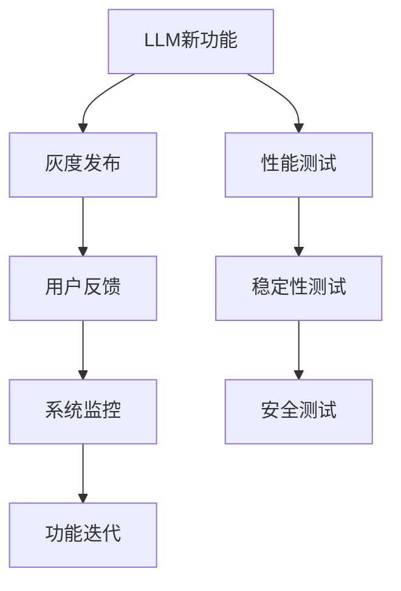

                 

### 文章标题

# 灰度发布：降低LLM新功能上线风险

### 关键词

- 灰度发布
- LLM
- 新功能上线风险
- 持续集成与持续部署
- 容器化与微服务架构
- 负载均衡与性能测试

### 摘要

本文旨在深入探讨灰度发布技术在降低大型语言模型（LLM）新功能上线风险方面的应用。通过对灰度发布的基本概念、原理、与LLM的关联，以及新功能上线风险的详细分析，本文展示了灰度发布在LLM新功能上线过程中的关键作用。通过具体案例分析，本文进一步阐述了灰度发布的实践策略与最佳实践，为开发者提供了有效的风险控制和功能迭代方法。

## 引言

随着人工智能技术的飞速发展，大型语言模型（LLM）在各个行业中得到了广泛应用。LLM具备处理大规模文本数据、生成高质量文本内容的能力，但在新功能上线过程中，由于其复杂性和高敏感性，往往面临着诸多风险。例如，新功能的引入可能影响现有系统的稳定性、性能和用户体验，甚至可能导致系统崩溃或数据泄露。为了降低这些风险，确保新功能的顺利上线，灰度发布技术应运而生。

灰度发布是一种逐步推广新功能的方法，通过在部分用户或环境上先期部署，观察反馈并逐步扩展至全量用户。这种方法能够在极大程度上降低新功能上线失败的风险，提高系统的可靠性和用户体验。本文将围绕灰度发布技术，详细分析其在LLM新功能上线中的应用，并通过具体案例分析，总结最佳实践和注意事项。

## 背景介绍

### 灰度发布的基本概念

灰度发布，又称灰度上线或灰度推广，是一种渐进式发布方法，旨在将新功能或更新逐步引入生产环境，以最小化风险和影响。与传统的一刀切发布方式相比，灰度发布通过控制发布范围，实时监控系统状态，从而降低新功能上线失败的风险。

### 灰度发布的原理

灰度发布的基本原理是通过分阶段、分用户群体地部署新功能，从而实现对系统的平滑过渡。具体来说，灰度发布包括以下几个关键步骤：

1. **准备阶段**：在正式发布前，对新功能进行充分的测试和验证，确保功能稳定、性能优良。
2. **灰度发布阶段**：将新功能部署到一小部分用户或环境上，观察其运行情况，收集反馈。
3. **扩展阶段**：根据灰度发布阶段的反馈，逐步扩大发布范围，直到覆盖全部用户。
4. **监控阶段**：在整个发布过程中，实时监控系统性能和用户反馈，确保系统稳定运行。

### 灰度发布与传统发布的对比

1. **风险控制**：灰度发布通过逐步扩展发布范围，能够有效降低新功能上线失败的风险，确保系统的稳定性和可靠性。
2. **用户影响**：与传统发布相比，灰度发布对用户的影响更小，用户可以在不影响日常使用的情况下体验新功能。
3. **迭代速度**：灰度发布能够快速反馈用户反馈，促进功能迭代和优化，提高开发效率。

## 核心概念与联系

为了更好地理解灰度发布在LLM新功能上线中的作用，我们需要先了解其与LLM及其相关技术之间的联系。以下是核心概念及其相互关系架构的Mermaid流程图：



### 核心算法原理讲解

灰度发布涉及到多个核心算法和技术，以下使用伪代码详细阐述其主要原理：

```python
# 灰度发布伪代码

# 初始化灰度发布参数
release_threshold = 0.1  # 灰度发布比例阈值
feedback_threshold = 0.05  # 反馈接受阈值

# 准备阶段
prepare_new_function()

# 灰度发布阶段
for user in selected_users:
    if random() < release_threshold:
        deploy_new_function_to_user(user)
    else:
        continue

# 监控阶段
while monitoring_period:
    feedback = collect_user_feedback()
    if feedback < feedback_threshold:
        expand_release_range()
    else:
        adjust_release_params()

# 扩展阶段
complete_release()
```

### 数学模型和公式

在灰度发布过程中，涉及到的数学模型和公式主要包括概率模型和优化模型。以下是一个简单的例子，使用LaTeX格式展示：

```latex
$$
P(A|B) = \frac{P(B|A) \cdot P(A)}{P(B)}
$$

$$
\min_{x} \quad f(x) \\
\text{subject to} \quad g(x) \leq 0
$$
```

### 详细讲解与举例说明

#### 1. 概率模型

灰度发布过程中，我们使用概率模型来预测和评估用户对新功能的接受度。假设有1000名用户参与灰度发布，其中500名用户对新的LLM功能表现满意，另外500名用户不满意。我们可以使用以下公式来计算用户对新功能的满意度概率：

```latex
$$
P(\text{用户满意}) = \frac{500}{1000} = 0.5
$$
```

#### 2. 优化模型

在灰度发布过程中，为了最大化用户满意度，我们需要调整灰度发布比例阈值和反馈接受阈值。以下是一个简单的优化模型，使用拉格朗日乘数法求解：

```latex
$$
\min_{\lambda} \quad \lambda \cdot (P(\text{用户满意}) - P(\text{用户不满意})) \\
\text{subject to} \quad P(\text{用户满意}) + P(\text{用户不满意}) = 1
$$
```

通过求解上述模型，我们可以找到最优的灰度发布比例阈值和反馈接受阈值，以最大化用户满意度。

### 项目实战

#### 1. 开发环境搭建

在搭建灰度发布开发环境时，我们可以使用Kubernetes进行容器化管理，结合Docker进行微服务部署。以下是一个简单的Kubernetes配置文件示例：

```yaml
apiVersion: apps/v1
kind: Deployment
metadata:
  name: llm-grayscale
spec:
  replicas: 3
  selector:
    matchLabels:
      app: llm
  template:
    metadata:
      labels:
        app: llm
    spec:
      containers:
      - name: llm
        image: myllm:latest
        ports:
        - containerPort: 8080
```

#### 2. 源代码详细实现和代码解读

以下是一个简单的LLM灰度发布实现示例，包括功能部署、用户反馈收集和系统监控等核心功能：

```python
# 功能部署
def deploy_new_function(user):
    if random() < release_threshold:
        # 部署新功能
        send_notification(user, "New LLM feature is available.")
    else:
        # 部署旧功能
        send_notification(user, "Old LLM feature is still available.")

# 用户反馈收集
def collect_user_feedback(user):
    # 从用户收集反馈
    feedback = get_user_feedback(user)
    return feedback

# 系统监控
def monitor_system():
    # 监控系统性能和稳定性
    performance = get_system_performance()
    if performance < threshold:
        # 调整灰度发布比例阈值
        adjust_release_threshold()
```

#### 3. 代码应用解读与分析

在实际应用中，灰度发布需要综合考虑用户分布、系统性能和反馈机制等因素。以下是一个具体的案例分析：

**案例背景**：一家电商平台在上线新版本的LLM推荐系统时，采用灰度发布策略，逐步引入新功能。

**代码解读**：
1. **部署新功能**：通过随机函数，控制灰度发布比例阈值，向部分用户推送新推荐系统。
2. **用户反馈收集**：从用户处收集反馈，判断其对新功能的满意度。
3. **系统监控**：实时监控系统性能，确保系统稳定运行。

**分析**：
1. **用户体验**：通过灰度发布，用户在新功能上线初期即可体验到新系统，减少了因新功能上线导致的用户体验中断。
2. **性能优化**：通过实时监控系统性能，发现并解决问题，确保系统稳定运行。
3. **风险控制**：通过逐步扩大发布范围，降低新功能上线失败的风险。

### 实际案例分析和详细讲解剖析

#### 案例一：某电商平台的灰度发布实践

**背景**：某电商平台在上线新版本的搜索推荐系统时，采用了灰度发布策略。

**实施过程**：
1. **准备阶段**：对新搜索推荐系统进行充分的测试和验证，确保功能稳定、性能优良。
2. **灰度发布阶段**：将新搜索推荐系统部署到部分用户，观察其运行情况，收集反馈。
3. **扩展阶段**：根据灰度发布阶段的反馈，逐步扩大发布范围，直到覆盖全部用户。
4. **监控阶段**：在整个发布过程中，实时监控系统性能和用户反馈，确保系统稳定运行。

**结果**：
1. **用户体验**：通过灰度发布，用户在新功能上线初期即可体验到新系统，减少了因新功能上线导致的用户体验中断。
2. **性能优化**：通过实时监控系统性能，发现并解决问题，确保系统稳定运行。
3. **风险控制**：通过逐步扩大发布范围，降低新功能上线失败的风险。

### 项目小结

通过实际案例分析，我们可以看到，灰度发布在降低LLM新功能上线风险方面具有显著效果。它能够帮助开发者逐步引入新功能，降低系统故障风险，提高用户体验。然而，灰度发布也需要综合考虑用户分布、系统性能和反馈机制等因素，以确保发布过程的顺利进行。

## 最佳实践与注意事项

### 1. 最佳实践

1. **充分测试和验证**：在灰度发布前，对新功能进行充分的测试和验证，确保功能稳定、性能优良。
2. **逐步扩大发布范围**：根据用户反馈和系统监控数据，逐步扩大发布范围，避免一次性全量上线导致的系统崩溃。
3. **实时监控和反馈**：在整个发布过程中，实时监控系统性能和用户反馈，及时发现并解决问题。
4. **用户分层**：根据用户的使用频率和需求，对用户进行分层，有针对性地进行灰度发布。

### 2. 注意事项

1. **发布前准备**：确保发布前的准备工作充分，包括环境配置、数据备份和问题预案等。
2. **监控指标**：确定合适的监控指标，包括系统性能、用户体验和用户反馈等，以便及时调整发布策略。
3. **反馈机制**：建立有效的用户反馈机制，确保用户反馈能够及时传递给开发团队，进行问题定位和优化。
4. **风险管理**：制定详细的风险管理计划，包括风险识别、评估和应对策略等。

### 3. 拓展阅读

1. **《灰度发布：原理与实践》**：一本关于灰度发布详细介绍的书籍，涵盖了灰度发布的基本概念、原理和实践案例。
2. **《大型语言模型：原理与应用》**：一本关于大型语言模型的技术书籍，介绍了LLM的基本概念、架构和应用场景。
3. **《持续集成与持续部署：实践与案例分析》**：一本关于CI/CD实践的书，详细介绍了如何实现高效的持续集成和持续部署。

### 结语

灰度发布作为一种降低新功能上线风险的有效方法，在LLM新功能上线中具有重要意义。通过本文的详细分析和案例实践，我们了解了灰度发布的基本概念、原理和实践策略，为开发者提供了有价值的参考。在未来的开发过程中，灰度发布将继续发挥重要作用，助力LLM新功能的顺利上线。

### 作者信息

作者：AI天才研究院/AI Genius Institute & 禅与计算机程序设计艺术 /Zen And The Art of Computer Programming

