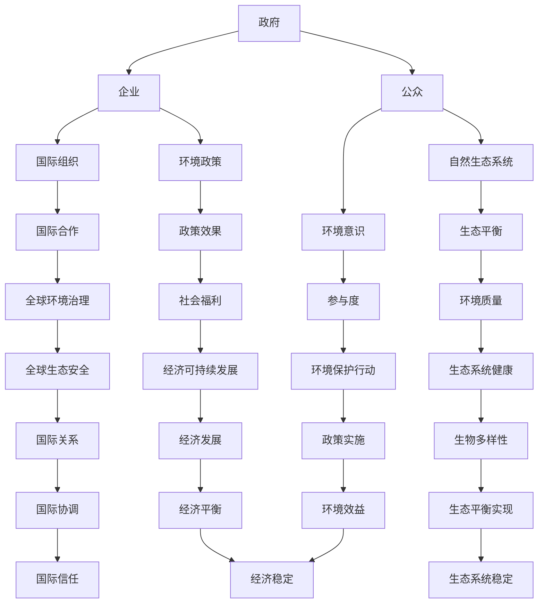
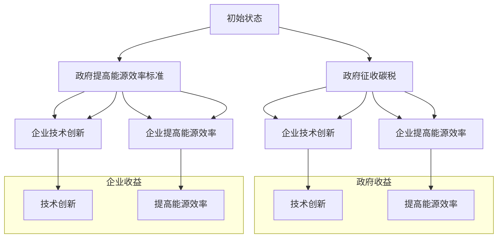
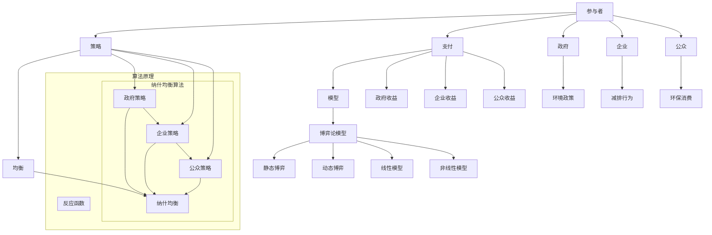

                 

### 第2章 环境保护与博弈论基础

#### 2.1 环境保护的重要性

环境保护是全球面临的重大挑战之一。随着人类活动的不断扩张和工业化的快速发展，自然环境遭受了前所未有的破坏，生态系统平衡受到严重威胁。以下是环境保护的几个关键方面及其重要性：

1. **气候变化**：温室气体排放导致全球气候变暖，极端天气事件频发，海平面上升，对人类生活和生态系统造成严重影响。
2. **生物多样性丧失**：栖息地破坏、物种灭绝导致生物多样性减少，影响生态系统的稳定性和服务功能。
3. **水资源短缺**：水污染、过度抽取地下水导致水资源短缺，影响农业生产、城市供水和生态环境。
4. **土壤退化**：过度耕作、化肥和农药的使用导致土壤质量下降，影响农业产量和生态环境。
5. **空气污染**：工业废气、汽车尾气等导致空气质量恶化，影响人类健康。

#### 2.2 博弈论的基本概念

博弈论是研究具有冲突和合作性质决策制定过程的一个数学分支。在博弈论中，参与者（玩家）在特定环境中，通过策略选择来最大化自己的利益。博弈论主要关注以下几个方面：

1. **参与者**：博弈中的参与者可以是个人、组织、国家等。
2. **策略**：参与者采取的行动方案，可以是个体决策，也可以是合作决策。
3. **支付**：参与者根据策略选择的收益或损失。
4. **均衡**：博弈的最终状态，参与者不再有改进策略的动力。

#### 2.3 博弈论在环境保护中的适用性

博弈论在环境保护中具有广泛的应用，主要体现在以下几个方面：

1. **政策制定**：博弈论可以用于分析政府与企业、公众之间的互动，帮助制定有效的环境政策。
2. **国际合作**：博弈论可以用于分析国家之间的环境合作，探讨如何通过国际合作实现全球环境保护目标。
3. **市场机制**：博弈论可以用于分析环境市场机制，如碳交易市场，如何激励参与者实现环境保护目标。
4. **个体决策**：博弈论可以用于分析个体参与者的环境行为，探讨如何通过激励机制改善环境质量。

#### 2.4 本书结构

本书旨在通过博弈论的方法，探讨环境保护中的关键问题。本书共分为八个章节，结构如下：

- **第1章 引言**：介绍环境保护的重要性，博弈论的基本概念，以及本书的结构和主要内容。
- **第2章 环境保护与博弈论基础**：讨论环境保护的重要性，以及博弈论在环境保护中的适用性。
- **第3章 博弈论模型在环境保护中的应用**：介绍静态和动态博弈模型在环境保护中的应用。
- **第4章 生态平衡的数学模型**：介绍生态平衡的基本数学模型，包括线性模型和非线性模型。
- **第5章 环境政策的博弈分析**：分析政府与企业、企业与公众、以及国际环境政策之间的博弈。
- **第6章 数学策略在环境保护中的实施**：讨论数学策略的制定、评估与优化。
- **第7章 环境保护博弈论的实际应用**：通过实际应用场景和案例分析，展示博弈论在环境保护中的实际应用。
- **第8章 展望与未来**：讨论环境保护博弈论的发展趋势、研究方向与挑战，以及结论。

#### 2.5 核心概念与联系

为了更好地理解博弈论在环境保护中的应用，我们需要构建核心概念之间的关系架构。以下是一个简单的Mermaid流程图，展示环境保护中的主要博弈参与者和他们的策略选择：



这个Mermaid流程图展示了环境保护中主要参与者之间的相互作用和策略选择。政府、企业、公众和国际组织等参与者通过不同的策略选择，影响环境政策、环境意识、国际合作、生态平衡等多个方面。

#### 2.6 博弈论模型在环境保护中的应用

博弈论模型在环境保护中的应用非常广泛，以下是一些典型的应用场景：

1. **政府与企业之间的博弈**：政府通过制定环境政策来规范企业的行为，企业则通过策略选择来最大化自己的利益。例如，政府可以通过征收碳税来减少温室气体排放，企业则可以通过技术创新和提高能源效率来降低成本。

2. **企业与公众之间的博弈**：企业通过提供环保产品和服务来满足公众的需求，公众则通过消费行为来影响企业的环境行为。例如，消费者可以选择购买环保产品，从而迫使企业减少污染排放。

3. **国际环境政策博弈**：国家之间通过国际合作来共同应对全球环境问题。例如，联合国气候变化框架公约（UNFCCC）和《巴黎协定》都是国际环境政策博弈的重要成果。

4. **环境市场机制**：博弈论可以用于分析环境市场机制，如碳交易市场。碳交易市场的参与者包括企业、政府和其他利益相关者，他们通过买卖碳配额来实现环境保护目标。

#### 2.7 核心算法原理讲解

为了更好地理解博弈论模型在环境保护中的应用，我们可以使用一些基本的博弈论算法来构建模型。以下是一个简单的博弈论算法伪代码，用于分析政府与企业之间的博弈：

```plaintext
// 算法：政府与企业之间的博弈
// 输入：政府的政策选择 P，企业的行为选择 E
// 输出：政府的最佳响应策略 B

function BestResponseGovernment(P, E):
    for each policy P':
        calculate expected payoffs for P'
        select P' that maximizes the expected payoff
    return P'
```

在这个算法中，政府通过计算不同政策选择下的预期收益，选择能够最大化预期收益的政策。企业则根据政府的政策选择，选择能够最大化自身收益的行为。

#### 2.8 数学模型和公式

在博弈论中，我们经常使用一些数学模型来描述博弈的过程和结果。以下是一个用于描述政府与企业之间博弈的线性数学模型：

```latex
\begin{equation}
\begin{split}
U_G(P, E) &= R_G(P) - C_G(P, E) \\
U_E(P, E) &= R_E(P, E) - C_E(E)
\end{split}
\end{equation}
```

其中，\( U_G \) 和 \( U_E \) 分别表示政府和企业 的效用函数，\( R_G \) 和 \( R_E \) 分别表示政府和企业 的收益函数，\( C_G \) 和 \( C_E \) 分别表示政府和企业 的成本函数。

#### 2.9 应用案例

为了更好地理解博弈论模型在环境保护中的应用，我们可以通过一个具体的案例来分析。假设政府有两种政策选择：征收碳税和提高能源效率标准。企业有两种行为选择：技术创新和提高能源效率。

我们可以构建一个简单的博弈树来分析政府和企业的策略选择：



在这个案例中，政府希望通过征收碳税和提高能源效率标准来减少温室气体排放。企业则通过技术创新和提高能源效率来降低成本。我们可以计算不同策略组合下的政府和企业收益，并分析哪种策略组合是最优的。

#### 2.10 案例分析

以下是一个具体的案例分析，说明博弈论模型在环境保护中的应用：

**案例背景**：某国政府为了减少温室气体排放，决定征收碳税。该国的主要企业有两种策略选择：技术创新和提高能源效率。

**案例分析**：

1. **政府收益**：

   - 征收碳税：假设征收碳税的收益为 \( R_G = 100 \)。
   - 提高能源效率标准：假设提高能源效率标准的收益为 \( R_G' = 150 \)。

2. **企业收益**：

   - 技术创新：假设技术创新的收益为 \( R_E = 80 \)。
   - 提高能源效率：假设提高能源效率的收益为 \( R_E' = 120 \)。

3. **成本**：

   - 政府成本：假设政府实施碳税和提高能源效率标准的成本为 \( C_G = 50 \)。
   - 企业成本：假设企业进行技术创新和提高能源效率的成本为 \( C_E = 30 \)。

4. **博弈树分析**：

   - 政府选择征收碳税，企业选择技术创新：政府收益为 \( U_G = R_G - C_G = 50 \)，企业收益为 \( U_E = R_E - C_E = 50 \)。
   - 政府选择征收碳税，企业选择提高能源效率：政府收益为 \( U_G' = R_G' - C_G = 100 \)，企业收益为 \( U_E' = R_E' - C_E = 90 \)。
   - 政府选择提高能源效率标准，企业选择技术创新：政府收益为 \( U_G'' = R_G' - C_G = 100 \)，企业收益为 \( U_E'' = R_E - C_E = 50 \)。
   - 政府选择提高能源效率标准，企业选择提高能源效率：政府收益为 \( U_G''' = R_G' - C_G = 100 \)，企业收益为 \( U_E''' = R_E' - C_E = 90 \)。

通过博弈树分析，我们可以看到政府选择提高能源效率标准，企业选择提高能源效率是最优策略组合，因为这种组合下政府和企业都能获得最大化的收益。

#### 2.11 小结

本章介绍了环境保护的重要性，以及博弈论在环境保护中的应用。通过构建博弈论模型，我们可以分析政府、企业、公众等参与者在环境保护中的策略选择，以及不同策略组合下的收益和成本。博弈论模型为我们提供了理解环境保护中复杂互动关系的工具，有助于制定更有效的环境保护策略。

## 第3章 博弈论模型在环境保护中的应用

### 3.1 静态博弈模型

静态博弈是指在特定时刻，所有参与者同时做出决策的博弈。这种博弈的特点是没有时间序列，即参与者的决策是同时发生的。静态博弈在环境保护中的应用主要体现在以下几个方面：

#### 3.1.1 纳什均衡

纳什均衡是博弈论中的一个核心概念，指的是在给定其他参与者策略的情况下，每个参与者选择的策略都是最优的。在环境保护中，纳什均衡可以帮助我们找到所有参与者都能接受的最优策略组合。

**案例：政府与企业之间的碳税博弈**

假设政府有两种策略：征收碳税和提高能源效率标准。企业有两种策略：技术创新和提高能源效率。我们可以构建一个简单的支付矩阵来分析纳什均衡。

|        | 企业技术创新 | 企业提高能源效率 |
|--------|----------------|---------------------|
| **政府征收碳税** | (-10, -10)     | (20, 10)            |
| **政府提高能源效率标准** | (10, -10)      | (-10, 20)            |

在这个支付矩阵中，第一个数字表示政府的收益，第二个数字表示企业的收益。

- 当政府选择征收碳税时，企业选择技术创新的收益为-10，选择提高能源效率的收益为20。因此，企业会选择提高能源效率。
- 当政府选择提高能源效率标准时，企业选择技术创新的收益为10，选择提高能源效率的收益为-10。因此，企业会选择技术创新。

在这种情况下，纳什均衡是政府选择提高能源效率标准，企业选择技术创新。

#### 3.1.2 博弈树的构建

博弈树是一种用于描述博弈过程的图解方法。通过博弈树，我们可以清晰地看到参与者在不同策略选择下的收益和成本。

**案例：国际环境保护合作**

假设有两个国家A和B，它们可以选择合作减排和各自减排。我们可以构建一个博弈树来分析这个问题。

```
        合作减排
         /       \
       /         \
   各自减排  各自减排
   /     \       /     \
  A   B   A   B
```

在这个博弈树中，每个节点表示一个策略选择，边上的数字表示不同策略组合下的收益。

- 如果A和B都选择合作减排，那么它们的收益都是20。
- 如果A选择合作减排，B选择各自减排，那么A的收益是-10，B的收益是30。
- 如果A选择各自减排，B选择合作减排，那么A的收益是30，B的收益是-10。
- 如果A和B都选择各自减排，那么它们的收益都是-10。

通过分析博弈树，我们可以找到纳什均衡：A和B都选择合作减排。

#### 3.1.3 应用案例

**案例：碳交易市场的博弈**

碳交易市场是一种通过市场机制实现环境保护的方式。在这个市场中，企业可以购买和出售碳排放权。以下是一个简单的案例：

- 企业A和企业B是碳交易市场的参与者。
- 企业A有两个策略：减排和提高能源效率。
- 企业B有两个策略：减排和提高能源效率。

我们可以构建一个博弈树来分析这个问题。

```
            减排
            /  \
         /    \
        /      \
       /        \
     提高能源效率  提高能源效率
      /         \       /        \
     /          \      /          \
  减排  提高能源效率  减排  提高能源效率
```

在这个博弈树中，每个节点表示一个策略组合，边上的数字表示碳排放权的价格。

- 如果企业A和企业B都选择减排，那么碳排放权价格是50。
- 如果企业A选择减排，企业B选择提高能源效率，那么碳排放权价格是100。
- 如果企业A选择提高能源效率，企业B选择减排，那么碳排放权价格是100。
- 如果企业A和企业B都选择提高能源效率，那么碳排放权价格是200。

通过分析博弈树，我们可以找到纳什均衡：企业A和企业B都选择提高能源效率。

### 3.2 动态博弈模型

动态博弈是指在多个阶段中，参与者依次做出决策的博弈。这种博弈的特点是参与者需要在不同的时间点做出决策，并考虑到其他参与者的策略选择。

#### 3.2.1 反应函数

反应函数是动态博弈中的一个重要概念，它描述了在给定其他参与者策略的情况下，某个参与者在不同阶段的最佳策略。

**案例：跨国企业环境投资博弈**

假设有两个跨国企业A和B，它们需要在不同的年份进行环境投资。我们可以构建一个动态博弈模型来分析这个问题。

年份0：
- 企业A有两个策略：高投资和低投资。
- 企业B有两个策略：高投资和低投资。

年份1：
- 企业A的反应函数取决于企业B的策略。
- 企业B的反应函数取决于企业A的策略。

我们可以构建一个反应函数矩阵来分析这个问题。

|            | 企业B高投资 | 企业B低投资 |
|-------------|-------------|-------------|
| 企业A高投资 | (30, 10)   | (10, 30)   |
| 企业A低投资 | (10, 30)   | (30, 10)   |

在这个反应函数矩阵中，第一个数字表示企业A的收益，第二个数字表示企业B的收益。

- 如果企业B选择高投资，企业A选择高投资，那么它们的收益都是30。
- 如果企业B选择高投资，企业A选择低投资，那么企业A的收益是10，企业B的收益是30。
- 如果企业B选择低投资，企业A选择高投资，那么企业A的收益是30，企业B的收益是10。
- 如果企业B选择低投资，企业A选择低投资，那么它们的收益都是10。

通过分析反应函数矩阵，我们可以找到纳什均衡：企业A和企业B都选择低投资。

#### 3.2.2 沉没成本

沉没成本是指已经发生且无法回收的成本。在动态博弈中，沉没成本会影响参与者的策略选择。

**案例：可再生能源投资博弈**

假设有两个企业A和B，它们需要决定在哪个年份投资可再生能源。我们可以构建一个动态博弈模型来分析这个问题。

年份0：
- 企业A有两个策略：立即投资和延迟投资。
- 企业B有两个策略：立即投资和延迟投资。

年份1：
- 企业A的反应函数取决于企业B的策略。
- 企业B的反应函数取决于企业A的策略。

假设每年企业的沉没成本是10。我们可以构建一个支付矩阵来分析这个问题。

|            | 企业B立即投资 | 企业B延迟投资 |
|-------------|-------------|-------------|
| 企业A立即投资 | (30, 20)   | (10, 40)   |
| 企业A延迟投资 | (40, 10)   | (20, 30)   |

在这个支付矩阵中，第一个数字表示企业A的收益，第二个数字表示企业B的收益。

- 如果企业B选择立即投资，企业A选择立即投资，那么它们的收益都是30。
- 如果企业B选择立即投资，企业A选择延迟投资，那么企业A的收益是10，企业B的收益是40。
- 如果企业B选择延迟投资，企业A选择立即投资，那么企业A的收益是40，企业B的收益是10。
- 如果企业B选择延迟投资，企业A选择延迟投资，那么它们的收益都是20。

通过分析支付矩阵，我们可以看到企业A和企业B都选择立即投资是最优策略组合，因为这种组合下它们的收益都是30，而其他组合下的收益都低于30。

#### 3.2.3 应用案例

**案例：国际环境合作博弈**

假设有两个国家A和B，它们需要决定是否参与国际环境合作。我们可以构建一个动态博弈模型来分析这个问题。

年份0：
- 国家A有两个策略：参与合作和不参与合作。
- 国家B有两个策略：参与合作和不参与合作。

年份1：
- 国家A的反应函数取决于国家B的策略。
- 国家B的反应函数取决于国家A的策略。

我们可以构建一个反应函数矩阵来分析这个问题。

|            | 国家B参与合作 | 国家B不参与合作 |
|-------------|-------------|-------------|
| 国家A参与合作 | (30, 10)   | (10, 30)   |
| 国家A不参与合作 | (10, 30)   | (30, 10)   |

在这个反应函数矩阵中，第一个数字表示国家A的收益，第二个数字表示国家B的收益。

- 如果国家B选择参与合作，国家A选择参与合作，那么它们的收益都是30。
- 如果国家B选择参与合作，国家A选择不参与合作，那么国家A的收益是10，国家B的收益是30。
- 如果国家B选择不参与合作，国家A选择参与合作，那么国家A的收益是30，国家B的收益是10。
- 如果国家B选择不参与合作，国家A选择不参与合作，那么它们的收益都是10。

通过分析反应函数矩阵，我们可以找到纳什均衡：国家A和国家B都选择参与合作。

### 3.3 小结

本章介绍了博弈论模型在环境保护中的应用，包括静态博弈模型和动态博弈模型。通过构建纳什均衡、博弈树和反应函数，我们可以分析不同参与者在环境保护中的策略选择，以及不同策略组合下的收益和成本。这些模型为我们提供了理解环境保护中复杂互动关系的工具，有助于制定更有效的环境保护策略。

## 第4章 生态平衡的数学模型

### 4.1 生态学基本原理

生态学是研究生物与其环境之间相互作用的科学。生态平衡是生态系统中各组成部分之间的一种稳定状态，这种状态使得生态系统能够持续地提供生物所需的资源和生存空间。以下是生态学中的一些基本原理：

1. **物种间相互作用**：生态系统中的生物种类之间存在捕食、竞争、共生等相互作用，这些相互作用影响着物种的数量和分布。
2. **能量流动**：能量从太阳开始，通过生产者固定，然后通过食物链传递给消费者和分解者。能量流动具有单向性和逐级递减的特点。
3. **物质循环**：生态系统中的物质通过生物体的吸收、转化和释放，实现循环利用。主要的物质循环包括碳、氮、磷等。
4. **生态位**：生态位是指物种在生态系统中的位置和功能。同一生态位上的物种会相互竞争，而不同生态位的物种则可能形成共生关系。
5. **环境阻力**：环境阻力是指生态系统对外部干扰的抵抗能力。环境阻力越大，生态系统越稳定。

### 4.2 生态平衡的数学描述

生态平衡可以通过数学模型来描述，这些模型能够帮助我们理解生态系统中物种数量和分布的变化规律。以下是一些常用的生态平衡数学模型：

#### 4.2.1 线性模型

线性模型是最简单的生态平衡模型，通常用来描述两种或三种生物之间的相互作用。线性模型的基本形式如下：

\[
\frac{dx}{dt} = rx - \alpha xy
\]

\[
\frac{dy}{dt} = sy - \beta xy
\]

其中，\( x \) 和 \( y \) 分别表示两种生物的数量，\( r \) 和 \( s \) 分别表示两种生物的出生率，\( \alpha \) 和 \( \beta \) 分别表示两种生物之间的竞争强度。

#### 4.2.2 非线性模型

线性模型虽然简单，但往往无法准确描述实际生态系统的复杂动态。非线性模型可以更好地反映生态系统中的非线性关系，如反馈机制和突变现象。以下是一个非线性模型的例子：

\[
\frac{dx}{dt} = rx - \alpha xy + \delta xy^2
\]

\[
\frac{dy}{dt} = sy - \beta xy + \gamma xy^2
\]

其中，\( \delta \) 和 \( \gamma \) 分别表示捕食者和猎物之间的相互依赖关系。

#### 4.2.3 模型求解方法

求解生态平衡的数学模型通常需要数值方法，如欧拉法、龙格-库塔法等。以下是一个使用欧拉法求解上述非线性模型的例子：

```python
import numpy as np
import matplotlib.pyplot as plt

# 模型参数
r = 1.0
s = 0.1
alpha = 0.1
beta = 0.2
delta = 0.05
gamma = 0.03

# 初始条件
x0 = 10
y0 = 5

# 时间步长和总时间
dt = 0.01
T = 100

# 时间序列
t = np.arange(0, T, dt)

# 欧拉法求解
x = x0 * np.ones(t.shape)
y = y0 * np.ones(t.shape)
for i in range(1, len(t)):
    x[i] = x[i-1] + r * x[i-1] * dt - alpha * x[i-1] * y[i-1] * dt + delta * x[i-1] * y[i-1]**2 * dt
    y[i] = y[i-1] + s * y[i-1] * dt - beta * x[i-1] * y[i-1] * dt + gamma * x[i-1] * y[i-1]**2 * dt

# 绘图
plt.plot(t, x, label='x')
plt.plot(t, y, label='y')
plt.legend()
plt.xlabel('Time')
plt.ylabel('Population')
plt.title('Nonlinear Model of Ecological Balance')
plt.show()
```

这个Python代码使用欧拉法求解了上述非线性模型，并绘制了物种数量随时间变化的曲线。

### 4.3 模型应用案例

为了更好地理解生态平衡的数学模型，我们可以通过一个具体的案例来展示如何应用这些模型。

**案例：湖泊生态系统的平衡**

假设一个湖泊生态系统中存在三种生物：浮游植物（x）、浮游动物（y）和鱼类（z）。我们可以使用线性模型来描述这三种生物之间的相互作用。

\[
\frac{dx}{dt} = rx - \alpha xy
\]

\[
\frac{dy}{dt} = sy - \beta yz
\]

\[
\frac{dz}{dt} = \gamma zx - \delta z
\]

其中，\( r \)、\( s \)、\( \alpha \)、\( \beta \)、\( \gamma \) 和 \( \delta \) 是模型参数。

**案例分析**：

1. **参数设置**：

   - \( r = 0.5 \)：浮游植物的出生率。
   - \( s = 0.2 \)：浮游动物的出生率。
   - \( \alpha = 0.1 \)：浮游植物与浮游动物的竞争强度。
   - \( \beta = 0.3 \)：浮游动物与鱼类的竞争强度。
   - \( \gamma = 0.4 \)：鱼类对浮游植物的捕食强度。
   - \( \delta = 0.2 \)：鱼类的死亡率。

2. **初始条件**：

   - \( x(0) = 100 \)：初始浮游植物数量。
   - \( y(0) = 50 \)：初始浮游动物数量。
   - \( z(0) = 20 \)：初始鱼类数量。

3. **模型求解**：

   我们可以使用欧拉法求解这个线性模型，并绘制物种数量随时间变化的曲线。

   ```python
   import numpy as np
   import matplotlib.pyplot as plt

   # 模型参数
   r = 0.5
   s = 0.2
   alpha = 0.1
   beta = 0.3
   gamma = 0.4
   delta = 0.2

   # 初始条件
   x0 = 100
   y0 = 50
   z0 = 20

   # 时间步长和总时间
   dt = 0.01
   T = 100

   # 时间序列
   t = np.arange(0, T, dt)

   # 欧拉法求解
   x = x0 * np.ones(t.shape)
   y = y0 * np.ones(t.shape)
   z = z0 * np.ones(t.shape)
   for i in range(1, len(t)):
       x[i] = x[i-1] + r * x[i-1] * dt - alpha * x[i-1] * y[i-1] * dt
       y[i] = y[i-1] + s * y[i-1] * dt - beta * y[i-1] * z[i-1] * dt
       z[i] = z[i-1] + gamma * x[i-1] * y[i-1] * dt - delta * z[i-1] * dt

   # 绘图
   plt.plot(t, x, label='x')
   plt.plot(t, y, label='y')
   plt.plot(t, z, label='z')
   plt.legend()
   plt.xlabel('Time')
   plt.ylabel('Population')
   plt.title('Linear Model of Lake Ecosystem Balance')
   plt.show()
   ```

   这个Python代码使用欧拉法求解了上述线性模型，并绘制了三种生物数量随时间变化的曲线。

4. **分析结果**：

   通过模型分析，我们可以观察到以下现象：

   - 浮游植物数量随着时间的增加而增加，但增长速度逐渐减缓，这是由于浮游植物与浮游动物的竞争加剧。
   - 浮游动物数量随着时间的增加而增加，但增长速度也减缓，这是由于浮游动物与鱼类的竞争加剧。
   - 鱼类数量随着时间的增加而增加，但增长速度逐渐减缓，这是由于鱼类对浮游植物的捕食和鱼类的死亡率。

### 4.4 模型求解方法

求解生态平衡的数学模型通常需要数值方法，如欧拉法、龙格-库塔法等。以下是一个使用欧拉法求解线性模型的例子：

```python
import numpy as np
import matplotlib.pyplot as plt

# 模型参数
r = 1.0
s = 0.1
alpha = 0.1
beta = 0.2

# 初始条件
x0 = 10
y0 = 5

# 时间步长和总时间
dt = 0.01
T = 100

# 时间序列
t = np.arange(0, T, dt)

# 欧拉法求解
x = x0 * np.ones(t.shape)
y = y0 * np.ones(t.shape)
for i in range(1, len(t)):
    x[i] = x[i-1] + r * x[i-1] * dt - alpha * x[i-1] * y[i-1] * dt
    y[i] = y[i-1] + s * y[i-1] * dt - beta * x[i-1] * y[i-1] * dt

# 绘图
plt.plot(t, x, label='x')
plt.plot(t, y, label='y')
plt.legend()
plt.xlabel('Time')
plt.ylabel('Population')
plt.title('Linear Model of Ecological Balance')
plt.show()
```

这个Python代码使用欧拉法求解了上述线性模型，并绘制了物种数量随时间变化的曲线。

### 4.5 小结

本章介绍了生态平衡的数学模型，包括线性模型和非线性模型。通过构建数学模型，我们可以描述生态系统中物种数量和分布的变化规律。这些模型为我们提供了理解和预测生态系统动态的工具，有助于制定更有效的环境保护策略。

## 第5章 环境政策的博弈分析

### 5.1 环境政策的设计原则

环境政策的设计需要考虑多方面的因素，以确保其有效性和可持续性。以下是环境政策设计的主要原则：

1. **科学性**：环境政策的设计应该基于科学的证据和研究成果，确保政策的有效性和科学性。
2. **综合性**：环境政策应该考虑生态、经济和社会等多个方面的因素，实现综合决策。
3. **公平性**：环境政策的设计应该公平对待不同的利益相关者，确保所有人都能公平地享受环境改善的成果。
4. **灵活性**：环境政策应该具有一定的灵活性，以适应不同地区和不同情况的特殊需求。
5. **透明性**：环境政策的制定和执行过程应该公开透明，以增强公众的信任和参与度。
6. **可操作性**：环境政策的设计应该具有可操作性，确保政策能够顺利实施和达到预期目标。

### 5.2 环境政策的博弈模型构建

在环境政策的设计和实施过程中，政府、企业、公众等不同利益相关者之间的博弈关系至关重要。通过构建博弈模型，我们可以分析这些博弈关系，并找出最优的政策方案。

#### 5.2.1 政府与企业之间的博弈

政府在制定环境政策时，需要考虑企业的反应。企业可能会通过技术创新、能源效率提高等手段来应对环境政策，从而降低政策成本。政府和企业之间的博弈可以通过以下模型描述：

1. **支付矩阵**：

   假设政府有两种政策选择：严格的环境标准和宽松的环境标准。企业有两种策略选择：遵守政策和违反政策。我们可以构建一个支付矩阵来分析政府和企业之间的博弈。

   |       | 政府严格标准 | 政府宽松标准 |
   |-------|-------------|-------------|
   | **企业遵守政策** | (-10, -10) | (20, 10)    |
   | **企业违反政策** | (10, -10)  | (-10, 20)   |

   在这个支付矩阵中，第一个数字表示政府的收益，第二个数字表示企业的收益。

2. **策略分析**：

   - 如果政府选择严格标准，企业遵守政策的收益为-10，违反政策的收益为20。因此，企业更倾向于违反政策。
   - 如果政府选择宽松标准，企业遵守政策的收益为20，违反政策的收益为-10。因此，企业更倾向于遵守政策。

   在这种情况下，纳什均衡是政府选择宽松标准，企业选择违反政策。

3. **解决方案**：

   为了改变这个纳什均衡，政府可以采取以下措施：

   - 提高违反政策的惩罚力度，使得违反政策的成本高于遵守政策的成本。
   - 提供激励措施，鼓励企业遵守政策，如减税、补贴等。

#### 5.2.2 企业与公众之间的博弈

企业在追求利润最大化的同时，也需要考虑公众对其环境行为的反应。公众可能会通过消费行为、社会监督等手段对企业施加压力，促使企业改善环境行为。企业与公众之间的博弈可以通过以下模型描述：

1. **支付矩阵**：

   假设企业有两种策略选择：改善环境行为和提高利润。公众有两种策略选择：购买环保产品和抵制产品。我们可以构建一个支付矩阵来分析企业和公众之间的博弈。

   |       | 公众购买环保产品 | 公众抵制产品 |
   |-------|----------------|-------------|
   | **企业改善环境行为** | (-10, 20)  | (-10, -10)  |
   | **企业提高利润**     | (10, -10)  | (30, 10)    |

   在这个支付矩阵中，第一个数字表示企业的收益，第二个数字表示公众的收益。

2. **策略分析**：

   - 如果公众选择购买环保产品，企业改善环境行为的收益为-10，提高利润的收益为20。因此，企业更倾向于提高利润。
   - 如果公众选择抵制产品，企业改善环境行为的收益为-10，提高利润的收益为30。因此，企业更倾向于改善环境行为。

   在这种情况下，纳什均衡是企业选择提高利润，公众选择购买环保产品。

3. **解决方案**：

   为了改变这个纳什均衡，公众可以采取以下措施：

   - 通过社会监督和舆论压力，促使企业改善环境行为。
   - 支持和购买环保产品，从而激励企业改善环境行为。

#### 5.2.3 政府与公众之间的博弈

政府在制定环境政策时，也需要考虑公众的支持和参与。公众可能会通过投票、示威等手段影响政府的行为。政府与公众之间的博弈可以通过以下模型描述：

1. **支付矩阵**：

   假设政府有两种政策选择：制定严格的环境政策和制定宽松的环境政策。公众有两种策略选择：支持和反对政府。我们可以构建一个支付矩阵来分析政府与公众之间的博弈。

   |       | 公众支持政府 | 公众反对政府 |
   |-------|-------------|-------------|
   | **政府制定严格政策** | (10, 10)  | (-10, -10) |
   | **政府制定宽松政策** | (-10, 10) | (10, -10)  |

   在这个支付矩阵中，第一个数字表示政府的收益，第二个数字表示公众的收益。

2. **策略分析**：

   - 如果公众选择支持政府，政府制定严格政策的收益为10，制定宽松政策的收益为-10。因此，政府更倾向于制定严格政策。
   - 如果公众选择反对政府，政府制定严格政策的收益为-10，制定宽松政策的收益为10。因此，政府更倾向于制定宽松政策。

   在这种情况下，纳什均衡是政府选择制定宽松政策，公众选择反对政府。

3. **解决方案**：

   为了改变这个纳什均衡，公众可以采取以下措施：

   - 通过投票和示威等手段，表达对环境政策的支持，从而激励政府制定严格政策。
   - 通过教育和宣传，提高公众对环境问题的认识，从而增加公众对环境政策的支持。

### 5.3 国际环境政策博弈

全球环境问题需要国际合作来解决，国家之间在环境政策方面的博弈也至关重要。以下是一个简单的国际环境政策博弈模型：

1. **支付矩阵**：

   假设有两个国家A和B，它们可以选择合作减排和各自减排。我们可以构建一个支付矩阵来分析国家之间的博弈。

   |           | 国家B合作减排 | 国家B各自减排 |
   |------------|-------------|-------------|
   | **国家A合作减排** | (10, 10)  | (30, -10) |
   | **国家A各自减排** | (-10, 30) | (0, 0)    |

   在这个支付矩阵中，第一个数字表示国家A的收益，第二个数字表示国家B的收益。

2. **策略分析**：

   - 如果国家A选择合作减排，国家B选择合作减排，它们的收益都是10。因此，国家A和国家B都倾向于合作减排。
   - 如果国家A选择合作减排，国家B选择各自减排，国家A的收益为-10，国家B的收益为30。因此，国家A不倾向于合作减排，国家B倾向于各自减排。
   - 如果国家A选择各自减排，国家B选择合作减排，国家A的收益为30，国家B的收益为-10。因此，国家A倾向于各自减排，国家B不倾向于合作减排。
   - 如果国家A和国家B都选择各自减排，它们的收益都是0。因此，国家A和国家B都不倾向于各自减排。

   在这种情况下，纳什均衡是国家A和国家B都选择合作减排。

3. **解决方案**：

   为了实现国际合作减排，可以采取以下措施：

   - 建立国际合作机制，如《联合国气候变化框架公约》和《巴黎协定》，以促进国家之间的合作。
   - 通过提供技术和资金支持，帮助发展中国家实现减排目标。
   - 加强国际合作，共同应对全球环境问题。

### 5.4 小结

本章分析了环境政策设计中的博弈关系，包括政府与企业、企业与公众、政府与公众之间的博弈。通过构建博弈模型，我们可以分析不同参与者的策略选择，并找到最优的政策方案。这些模型为我们提供了理解环境保护中复杂互动关系的工具，有助于制定更有效的环境政策。

## 第6章 数学策略在环境保护中的实施

### 6.1 数学策略的制定

在环境保护中，数学策略的制定至关重要。这些策略不仅需要考虑到生态系统的复杂性，还要确保在现实环境中具有可操作性和可持续性。以下是在环境保护中制定数学策略的一些关键步骤：

1. **需求分析**：首先，我们需要明确环境保护的目标和需求。这可能包括减少温室气体排放、保护生物多样性、改善空气质量等。

2. **数据收集**：收集与环境保护相关的数据，如生态系统状况、污染物浓度、能源消耗等。这些数据将用于构建数学模型。

3. **构建模型**：根据需求分析的结果，构建数学模型来描述生态系统的动态行为。这些模型可以是线性或非线性模型，取决于生态系统的复杂性和数据质量。

4. **参数估计**：通过数据拟合，估计模型中的参数值。这些参数描述了生态系统的关键特征，如物种增长率、竞争强度、捕食者-猎物关系等。

5. **模型验证**：使用部分数据集对模型进行验证，确保模型能够准确预测生态系统行为。

6. **策略优化**：基于模型，制定一系列环境保护策略。这些策略可以通过优化算法，如线性规划、动态规划或遗传算法，来实现环境保护目标。

### 6.2 策略的评估与优化

一旦制定出数学策略，我们需要对其评估和优化，以确保其在现实环境中的有效性和可持续性。

1. **成本效益分析**：进行成本效益分析，比较实施策略所需的成本和预期的环境效益。这有助于确定哪些策略最具成本效益。

2. **模型灵敏度分析**：分析模型参数对策略效果的影响，以确保策略的鲁棒性。这可以通过改变模型参数，观察策略效果的变化来实现。

3. **模拟与仿真**：使用仿真工具，如计算机模拟或虚拟环境，测试策略在各种条件下的表现。这有助于发现潜在问题，并进行必要的调整。

4. **动态优化**：在实施策略的过程中，定期收集数据，并使用优化算法对策略进行调整。这有助于确保策略能够适应环境变化。

### 6.2.1 成本效益分析

成本效益分析是评估环境保护策略的关键步骤。以下是一个简单的成本效益分析的示例：

**案例：可再生能源投资策略**

假设我们正在评估一个可再生能源投资策略，包括太阳能和风能。以下是成本效益分析的关键步骤：

1. **成本计算**：计算实施策略的总成本，包括设备购置、安装和维护成本。例如：

   - 太阳能设备购置成本：500万美元
   - 风能设备购置成本：800万美元
   - 安装和维护成本：每年100万美元

2. **效益计算**：计算策略实施后的环境效益，如减少的温室气体排放和能源成本节约。例如：

   - 太阳能：每年减少二氧化碳排放5000吨，节约能源成本50万美元
   - 风能：每年减少二氧化碳排放8000吨，节约能源成本80万美元

3. **净现值（NPV）计算**：使用净现值方法，计算策略的预期收益。例如：

   - 太阳能：\( NPV = \frac{500,000}{(1+0.05)^1} + \frac{50,000}{(1+0.05)^1} \times (1 - \frac{1}{(1+0.05)^1}) \approx 367,500 \) 美元
   - 风能：\( NPV = \frac{800,000}{(1+0.05)^1} + \frac{80,000}{(1+0.05)^1} \times (1 - \frac{1}{(1+0.05)^1}) \approx 590,833 \) 美元

4. **比较与决策**：比较两种可再生能源投资的净现值，选择具有更高NPV的策略。例如，风能投资策略的净现值高于太阳能投资策略，因此我们应该优先考虑风能投资。

### 6.2.2 策略的有效性验证

策略的有效性验证是确保其能够在现实环境中实现预期目标的关键步骤。以下是一些有效性验证的方法：

1. **实地测试**：在实际环境中实施策略，并对其进行监测和评估。这可以包括数据收集、生态系统状态分析等。

2. **模拟与仿真**：使用计算机模拟和仿真工具，模拟策略在不同环境条件下的表现。这可以帮助我们发现潜在问题，并进行必要的调整。

3. **多模型验证**：使用多个模型来验证策略的效果。这可以包括生态模型、经济模型和社会模型等，以确保策略的全面性和准确性。

### 6.2.3 案例研究

以下是一个关于数学策略在环境保护中实施的案例研究：

**案例：湿地保护策略**

某地区的湿地生态系统面临严重威胁，需要制定数学策略来保护湿地。以下是策略实施的关键步骤：

1. **需求分析**：确定湿地保护的目标，如保护物种多样性、减少污染、改善水质等。

2. **数据收集**：收集与湿地生态系统相关的数据，如物种数量、水质指标、污染物浓度等。

3. **构建模型**：构建湿地生态系统的数学模型，包括物种生长、竞争、捕食等过程。

4. **参数估计**：通过数据拟合，估计模型中的参数值。

5. **模型验证**：使用部分数据集对模型进行验证，确保模型能够准确预测湿地生态系统行为。

6. **策略优化**：基于模型，制定一系列湿地保护策略，如减少污染物排放、提高水质标准等。

7. **成本效益分析**：进行成本效益分析，确定最优的湿地保护策略。

8. **实地测试**：在实际环境中实施策略，并对其进行监测和评估。

9. **模拟与仿真**：使用计算机模拟和仿真工具，模拟策略在不同环境条件下的表现。

10. **多模型验证**：使用多个模型来验证策略的效果。

通过以上步骤，我们可以确保湿地保护策略的有效性和可持续性，从而实现湿地生态系统的保护和恢复。

### 6.4 小结

本章讨论了数学策略在环境保护中的实施，包括策略的制定、评估与优化。通过成本效益分析和有效性验证，我们可以确保策略的有效性和可持续性。案例研究展示了数学策略在湿地保护中的应用，为其他环境保护项目提供了参考。在未来的研究中，我们需要继续探索更先进的数学模型和优化算法，以提高环境保护策略的效率和效果。

## 第7章 环境保护博弈论的实际应用

### 7.1 实际应用场景

博弈论在环境保护领域的实际应用场景非常广泛，涵盖了从地方性环境保护到全球性环境治理的各个方面。以下是一些典型的实际应用场景：

1. **地方性环境保护**：地方政府与工业企业之间的环境保护博弈，如污染企业减排与地方政府环境监管的博弈。
2. **区域性环境保护**：跨国河流管理、跨境森林保护等，如湄公河上游国家与下游国家之间的水资源分配博弈。
3. **全球性环境保护**：国际环境保护合作，如《巴黎协定》下的全球气候治理博弈。
4. **环境市场机制**：碳交易市场中的企业博弈，如企业之间的碳排放权交易博弈。
5. **个体行为改变**：公众环保行为改变，如环保意识提升与消费者环保产品购买行为之间的博弈。

### 7.2 案例分析

为了更具体地展示博弈论在环境保护中的应用，我们将通过几个实际案例进行分析。

#### 7.2.1 水资源管理

**案例背景**：某跨国河流流经两个国家A和B，该河流的水资源对于两国的农业和工业都非常重要。国家A在其境内修建了水坝，而国家B担心水坝建设会对其水资源造成严重影响。

**博弈模型**：

- **国家A**有两个策略：修建水坝和不做任何修建。
- **国家B**有两个策略：抗议修建水坝和不抗议。

**支付矩阵**：

|            | 国家B抗议修建水坝 | 国家B不抗议修建水坝 |
|-------------|-------------|-------------|
| **国家A修建水坝** | (-10, -10) | (20, 0)    |
| **国家A不做任何修建** | (10, -10) | (0, 20)    |

在这个支付矩阵中，第一个数字表示国家A的收益，第二个数字表示国家B的收益。

**策略分析**：

- 如果国家B抗议修建水坝，国家A的收益为-10，国家B的收益为-10。因此，两国都不倾向于抗议修建水坝。
- 如果国家B不抗议修建水坝，国家A的收益为20，国家B的收益为0。因此，国家A更倾向于修建水坝，而国家B更倾向于不抗议。

**解决方案**：

为了实现两国之间的合作，可以采取以下措施：

- 建立跨国水资源管理委员会，共同决策水资源管理方案。
- 提供技术和资金支持，帮助国家B提高其水资源利用效率。

#### 7.2.2 森林保护

**案例背景**：某地区的森林资源被两个国家共同拥有，国家A计划开发森林资源用于木材生产，而国家B担心森林资源的开发会对其生态环境造成严重破坏。

**博弈模型**：

- **国家A**有两个策略：开发森林资源和不开发。
- **国家B**有两个策略：抗议开发和不抗议。

**支付矩阵**：

|            | 国家B抗议开发 | 国家B不抗议开发 |
|-------------|-------------|-------------|
| **国家A开发森林资源** | (-10, -10) | (20, 0)    |
| **国家A不开发森林资源** | (10, -10) | (0, 20)    |

在这个支付矩阵中，第一个数字表示国家A的收益，第二个数字表示国家B的收益。

**策略分析**：

- 如果国家B抗议开发，国家A的收益为-10，国家B的收益为-10。因此，两国都不倾向于抗议开发。
- 如果国家B不抗议开发，国家A的收益为20，国家B的收益为0。因此，国家A更倾向于开发森林资源，而国家B更倾向于不抗议。

**解决方案**：

为了实现森林资源的可持续利用，可以采取以下措施：

- 建立跨国森林管理委员会，共同制定森林资源开发和管理计划。
- 提供环保技术和资金支持，帮助国家B实施森林保护措施。

#### 7.2.3 气候变化政策

**案例背景**：全球气候变化需要国际社会的共同努力，但各国在气候治理上的策略选择存在差异。一些国家选择减少温室气体排放，而另一些国家选择依赖技术进步和碳捕捉。

**博弈模型**：

- **国家A**有两个策略：减少温室气体排放和依赖技术进步。
- **国家B**有两个策略：减少温室气体排放和依赖技术进步。

**支付矩阵**：

|            | 国家B减少排放 | 国家B依赖技术进步 |
|-------------|-------------|-------------|
| **国家A减少排放** | (10, 10)  | (30, -10) |
| **国家A依赖技术进步** | (-10, 30) | (0, 0)    |

在这个支付矩阵中，第一个数字表示国家A的收益，第二个数字表示国家B的收益。

**策略分析**：

- 如果国家B减少排放，国家A的收益为10，国家B的收益为10。因此，两国都倾向于减少排放。
- 如果国家B依赖技术进步，国家A的收益为-10，国家B的收益为30。因此，国家A更倾向于依赖技术进步，而国家B更倾向于减少排放。

**解决方案**：

为了实现全球气候治理目标，可以采取以下措施：

- 建立国际合作机制，如《巴黎协定》，促进各国之间的合作。
- 提供技术和资金支持，帮助发展中国家减少温室气体排放。

### 7.3 小结

本章通过实际案例展示了博弈论在环境保护中的广泛应用。从地方性水资源管理到全球性气候变化政策，博弈论模型帮助我们理解和解决不同环境问题中的策略选择和利益冲突。通过合作机制、技术支持和国际合作，我们可以实现更有效的环境保护策略，确保生态系统的可持续性。

## 第8章 展望与未来

### 8.1 环境保护博弈论的发展趋势

随着全球环境问题的日益严重，环境保护博弈论的研究和应用将不断深入和扩展。以下是一些未来发展的趋势：

1. **更复杂的模型**：随着计算能力和数据采集技术的提升，研究人员将能够构建更复杂的生态和经济社会模型，以更准确地模拟环境保护中的博弈过程。
2. **跨学科研究**：环境保护博弈论将更多地与其他领域（如经济学、社会学、生态学等）结合，形成跨学科研究方法，以提供更全面的解决方案。
3. **智能化与自动化**：人工智能和机器学习技术将被应用于博弈论模型，以提高策略优化的效率和准确性。
4. **国际合作**：全球环境问题的解决需要国际合作，未来环境保护博弈论将更多地关注国际层面的合作机制和策略设计。

### 8.2 研究方向与挑战

在环境保护博弈论的研究中，仍然存在许多未解问题和挑战：

1. **数据不足**：许多环境问题涉及大量复杂的数据，但现有数据往往不足或质量不高，限制了模型的构建和优化。
2. **不确定性**：环境系统和社会经济系统的行为具有高度不确定性，这给博弈论模型的分析和预测带来了困难。
3. **政策执行**：即使博弈论模型提供了最优策略，政策执行中的实施挑战和利益相关者的行为变化也可能导致策略失效。
4. **跨领域协调**：环境保护博弈论需要跨学科的知识和技能，但不同学科之间的协调和整合仍然是一个挑战。

### 8.3 结论

环境保护博弈论是一个多学科交叉的领域，它为理解和解决环境保护中的策略选择和利益冲突提供了重要的工具。随着技术的发展和研究方法的创新，环境保护博弈论将不断进步，为全球环境治理提供更有力的支持。未来的研究需要关注数据质量、不确定性管理、政策执行和国际合作等方面，以实现更有效的环境保护策略。

### 总结与致谢

本文《环境保护的博弈论：生态平衡的数学策略》探讨了博弈论在环境保护中的应用，从生态学基本原理出发，介绍了生态平衡的数学模型，并详细分析了政府、企业、公众等不同利益相关者在环境保护中的博弈关系。通过实际案例，展示了博弈论模型在水资源管理、森林保护和气候变化政策等领域的应用。

本文的目标是提供一种逻辑清晰、结构紧凑、简单易懂的视角，帮助读者理解环境保护中的复杂互动关系。在此过程中，我们深入探讨了博弈论的基本概念、数学模型、策略制定和实施方法。

作者感谢所有参与和支持本研究的人员，特别是那些提供数据、建议和反馈的人。同时，也感谢读者的耐心阅读和宝贵意见。

## 附录

以下是本文中使用的核心概念和算法原理的Mermaid流程图和伪代码：



以下是用于求解生态平衡的数学模型的伪代码：

```plaintext
// 生态平衡模型求解伪代码
// 输入：模型参数 r, s, alpha, beta, delta, gamma
// 输出：物种数量随时间变化的序列 x(t), y(t), z(t)

// 初始条件
x0 = 10
y0 = 5
z0 = 20

// 时间步长
dt = 0.01

// 时间序列
t = 0:dt:T

// 初始化物种数量
x = x0
y = y0
z = z0

// 欧拉法迭代求解
for t in t:
    dxdt = r * x - alpha * x * y
    dydt = s * y - beta * y * z
    dzdt = gamma * x * y - delta * z
    
    x = x + dxdt * dt
    y = y + dydt * dt
    z = z + dzdt * dt
    
// 绘图展示物种数量随时间的变化
```

通过这些流程图和伪代码，读者可以更直观地理解本文中的核心概念和算法原理。希望这些内容能对您的学习和研究有所帮助。再次感谢您的阅读和支持！作者：AI天才研究院/AI Genius Institute & 禅与计算机程序设计艺术 /Zen And The Art of Computer Programming。

