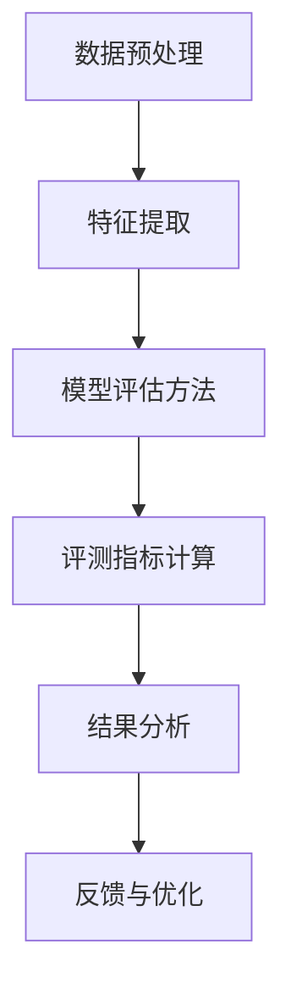

                 

## 文章标题

《用LLM打败LLM：自动化大模型评测系统的概述》

## 关键词

- LLM（大型语言模型）
- 自动化评测系统
- 大模型评测
- 自动化大模型开发
- 评测指标与算法

## 摘要

本文旨在概述一种创新的自动化大模型评测系统，该系统能够通过大型语言模型（LLM）自身的能力，实现对其他LLM的评测。文章首先介绍了LLM的背景和重要性，然后详细阐述了自动化评测系统的概念、架构和核心算法。通过伪代码和数学模型，文章深入解析了评测系统的原理。此外，文章还展示了实际的开发环境搭建、源代码实现和代码解读，并通过案例分析和详细讲解，探讨了该系统在实际应用中的效能。最后，文章提出了未来展望和面临的挑战，为读者提供了深入理解和发展自动化大模型评测系统的思路。

## 引言

### 大模型的发展与挑战

近年来，随着深度学习技术的迅猛发展，大型语言模型（LLM）如BERT、GPT-3等取得了显著的突破。这些模型具有庞大的参数规模和强大的表达能力，能够在自然语言处理（NLP）、机器翻译、文本生成等多个领域表现出色。然而，大模型的研究和应用也面临着诸多挑战，其中之一便是如何有效评估模型性能。

传统的评测方法主要依赖于人工设计和实现的评估指标，如准确率、召回率、F1值等。这些指标在一定程度上能够衡量模型的表现，但在实际应用中存在一些局限性。首先，评估指标的设计和调整往往依赖于经验和专业知识，缺乏系统性和通用性。其次，大量的手动计算和比较工作使得评测过程耗时耗力，无法适应快速迭代的研发流程。

为了解决这些问题，自动化大模型评测系统的需求应运而生。自动化评测系统能够通过预先设定的算法和指标，对模型进行自动化的评估，从而提高评测效率和准确性。同时，自动化评测系统还可以实现对不同模型之间的比较和排名，为模型选择和优化提供有力的支持。

### 自动化评测系统的需求

在大模型的研究和应用过程中，自动化评测系统的需求主要来源于以下几个方面：

1. **提高评测效率**：传统的人工评测方法需要大量的人力投入，且评测过程耗时较长。自动化评测系统可以自动处理大规模的数据集，快速生成评估结果，显著提高评测效率。

2. **减少人工干预**：自动化评测系统能够通过预设的算法和指标，对模型进行自动化的评估，减少人工干预，降低评测误差。

3. **统一评测标准**：自动化评测系统可以统一不同模型的评测标准，确保评估结果的公平性和可比性。

4. **支持多模型对比**：自动化评测系统能够同时评估多个模型，提供详细的对比分析，帮助研究者选择最佳模型。

5. **适应快速迭代**：在大模型的研究和应用中，模型迭代速度较快，自动化评测系统可以及时响应迭代需求，提供实时评估结果。

### 自动化评测系统的组成部分

自动化大模型评测系统通常包括以下几个关键组成部分：

1. **数据预处理**：数据预处理是自动化评测系统的第一步，包括数据清洗、数据增强、数据归一化等操作。预处理的质量直接影响到后续评测结果的准确性。

2. **特征提取**：特征提取是将原始数据转换成适合模型处理的形式。在大模型评测中，常用的特征提取方法包括词向量表示、句向量表示等。

3. **评测指标**：评测指标是衡量模型性能的重要工具。常见的评测指标包括准确率、召回率、F1值、ROC曲线等。不同的评测指标适用于不同的应用场景，需要根据具体需求进行选择。

4. **模型评估方法**：模型评估方法是指对模型性能进行量化评估的方法。自动化评测系统通常采用交叉验证、网格搜索等技术，对不同模型进行评估。

5. **结果分析**：结果分析是对评测结果进行解读和解释的过程。通过结果分析，研究者可以了解模型的优势和不足，为后续优化提供参考。

### 自动化评测系统的重要性

自动化大模型评测系统在大模型的研究和应用中具有重要意义：

1. **提高模型开发效率**：自动化评测系统能够快速、准确地评估模型性能，帮助研究者及时发现和解决问题，提高模型开发效率。

2. **降低人工成本**：自动化评测系统可以显著减少人工干预，降低评测过程中的人力成本。

3. **提高评测准确性**：自动化评测系统通过预设的算法和指标，能够提供更加准确和可靠的评测结果。

4. **支持多模型对比**：自动化评测系统能够同时评估多个模型，为研究者提供全面的对比分析，帮助选择最佳模型。

5. **适应快速迭代**：自动化评测系统可以实时响应模型迭代需求，提供持续评估和反馈，支持快速迭代。

总之，自动化大模型评测系统是提升大模型研究与应用效果的重要工具，对于推动人工智能技术的发展具有重要意义。

## 核心概念与联系

### 大模型的基本概念

大型语言模型（LLM）是一种基于深度学习的自然语言处理模型，其特点是参数规模大、模型复杂度高。LLM通常由多个神经网络层组成，每个层对输入数据进行处理，并将输出传递给下一层。LLM的核心任务是理解自然语言，并进行文本生成、翻译、问答等任务。

LLM可以分为两种类型：基于循环神经网络（RNN）的LLM和基于变换器（Transformer）的LLM。基于RNN的LLM，如LSTM和GRU，具有良好的序列建模能力，但计算效率较低。基于Transformer的LLM，如BERT和GPT-3，通过自注意力机制实现了更高效、强大的文本表示能力。

### 自动化评测的Mermaid流程图

为了更好地理解自动化大模型评测系统，我们可以使用Mermaid流程图来展示其整体流程。以下是一个简化的Mermaid流程图示例：



- **数据预处理**：包括数据清洗、数据增强和数据归一化等操作，为模型提供高质量的输入数据。
- **特征提取**：将原始数据转换成适合模型处理的形式，如词向量、句向量等。
- **模型评估方法**：采用交叉验证、网格搜索等技术对模型进行评估，选择最优参数。
- **评测指标计算**：根据预设的评测指标，如准确率、召回率、F1值等，计算模型性能。
- **结果分析**：对评测结果进行解读和解释，为模型优化提供参考。
- **反馈与优化**：根据结果分析，调整模型参数和算法，提高模型性能。

### 自动化评测系统的重要性

自动化评测系统在大模型研究和应用中扮演着关键角色。它不仅能够提高评测效率，减少人工干预，还能够统一评测标准，支持多模型对比，适应快速迭代。具体来说，自动化评测系统的重要性体现在以下几个方面：

1. **提高评测效率**：自动化评测系统能够自动处理大规模的数据集，快速生成评估结果，显著减少人工干预和计算时间。
   
2. **减少人工成本**：自动化评测系统可以显著降低评测过程中的人力成本，使研究者能够将更多精力投入到模型设计和优化中。

3. **统一评测标准**：自动化评测系统采用统一的算法和指标，确保不同模型之间的评测结果具有可比性，提高评测的公平性和一致性。

4. **支持多模型对比**：自动化评测系统能够同时对多个模型进行评估，提供详细的对比分析，帮助研究者选择最佳模型。

5. **适应快速迭代**：在大模型的研究和应用中，模型迭代速度较快，自动化评测系统可以实时响应迭代需求，提供持续评估和反馈。

### 自动化评测系统的组成部分

自动化大模型评测系统由多个关键组件构成，每个组件都有其特定的功能和重要性。以下是这些组成部分的详细描述：

1. **数据预处理**：数据预处理是自动化评测系统的第一步，其目标是确保输入数据的质量和一致性。数据预处理包括以下步骤：
   - **数据清洗**：去除数据中的噪声和不完整信息，如删除缺失值、纠正拼写错误等。
   - **数据增强**：通过数据扩充、随机切割、旋转等技术，增加数据的多样性和丰富度，从而提高模型的泛化能力。
   - **数据归一化**：对数据进行标准化处理，使其具有相同的尺度，避免某些特征对模型的影响过大。

2. **特征提取**：特征提取是将原始数据转换成适合模型处理的形式。在大模型评测中，常用的特征提取方法包括：
   - **词向量表示**：将文本数据转换成词向量，如Word2Vec、GloVe等。词向量表示能够捕捉文本的语义信息。
   - **句向量表示**：将整句转换成向量，如BERT、GPT-3等。句向量表示能够捕捉句子之间的语义关系。

3. **评测指标**：评测指标是衡量模型性能的重要工具。常见的评测指标包括：
   - **准确率**：正确预测的样本数占总样本数的比例。准确率适用于分类问题，是评估分类模型性能的基本指标。
   - **召回率**：正确预测的样本数与实际为正样本的样本数之比。召回率关注的是模型能否召回所有正样本，常用于信息检索和医学诊断等领域。
   - **F1值**：准确率和召回率的调和平均值，综合考虑了模型的精确度和召回率。F1值是评估二分类模型的重要指标。
   - **ROC曲线和AUC**：ROC曲线展示了不同阈值下模型敏感度和特异度的变化趋势，AUC（Area Under Curve）是ROC曲线下的面积，用于评估模型区分能力。

4. **模型评估方法**：模型评估方法是量化模型性能的关键步骤，常用的评估方法包括：
   - **交叉验证**：通过将数据集划分为多个子集，多次训练和验证模型，以减少评估结果的不确定性。
   - **网格搜索**：通过遍历预设的参数组合，找到最优参数设置，提高模型性能。
   - **贝叶斯优化**：基于概率模型，通过迭代优化，找到最优参数组合。

5. **结果分析**：结果分析是对评测结果进行解读和解释的过程，其目标是理解模型的性能和局限性。结果分析通常包括以下步骤：
   - **误差分析**：分析模型预测错误的样本，了解模型在实际应用中的表现。
   - **可视化**：使用图表和图形展示模型的性能和特征分布，帮助研究者直观理解模型的行为。
   - **性能评估**：综合评估模型的准确性、召回率、F1值等指标，判断模型是否满足需求。

通过这些组成部分的协同工作，自动化大模型评测系统能够提供高效、准确和可靠的模型评估，支持大模型的研究和应用。

### 自动化评测系统的重要性

自动化大模型评测系统在大模型研究和应用中具有至关重要的地位，主要体现在以下几个方面：

1. **提高开发效率**：自动化评测系统能够快速、准确地评估模型性能，帮助研究者及时发现问题并进行调整，从而显著提高模型开发效率。

2. **减少人工成本**：传统的模型评估方法需要大量的人力和时间投入，而自动化评测系统可以自动处理大量数据，减少人工干预，降低人力成本。

3. **统一评测标准**：自动化评测系统采用统一的算法和指标，确保不同模型的评测结果具有可比性，提高评测的公平性和一致性。

4. **支持多模型对比**：自动化评测系统能够同时对多个模型进行评估，提供详细的对比分析，帮助研究者选择最佳模型。

5. **适应快速迭代**：在大模型的研究和应用中，模型迭代速度较快，自动化评测系统可以实时响应迭代需求，提供持续评估和反馈，支持快速迭代。

总之，自动化大模型评测系统是提升大模型研究与应用效果的重要工具，对于推动人工智能技术的发展具有重要意义。

### 自动化评测系统的组成部分

自动化大模型评测系统的构建涉及多个关键组件，这些组件共同协作，确保了系统的整体性能和可靠性。以下是这些组成部分的详细解析：

1. **数据预处理模块**：
   - **功能**：数据预处理是确保模型训练数据质量的关键步骤。该模块负责清洗数据，处理缺失值、噪声和异常值，并进行数据增强。
   - **技术**：数据清洗通常包括去除重复数据、填补缺失值、纠正错误等。数据增强则通过随机裁剪、旋转、缩放等技术，增加数据的多样性和丰富度。
   - **重要性**：高质量的数据预处理能够提高模型的泛化能力，减少过拟合，从而提升模型的实际应用效果。

2. **特征提取模块**：
   - **功能**：特征提取是将原始数据转换成适合模型处理的形式。在这个模块中，文本数据被转换成词向量或句向量，这些向量能够捕捉文本的语义信息。
   - **技术**：常用的特征提取方法包括Word2Vec、GloVe、BERT等。Word2Vec和GloVe通过词向量的方式捕捉词汇之间的相似性，而BERT则通过预训练和上下文信息来生成更复杂的句子表示。
   - **重要性**：准确的特征提取能够增强模型对数据的理解和表达能力，是模型性能的基础。

3. **评测指标模块**：
   - **功能**：评测指标是衡量模型性能的标准。这个模块负责计算并评估模型的性能，包括准确率、召回率、F1值、ROC曲线和AUC等。
   - **技术**：每种评测指标都有其特定的计算公式和适用场景。例如，准确率适用于分类问题，而F1值则同时考虑了准确率和召回率。
   - **重要性**：选择合适的评测指标能够更准确地反映模型的性能，帮助研究者了解模型的强项和弱项。

4. **模型评估模块**：
   - **功能**：模型评估模块负责对模型进行量化评估，选择最优参数设置，并进行性能比较。
   - **技术**：常用的评估方法包括交叉验证、网格搜索和贝叶斯优化等。交叉验证通过多次训练和验证来评估模型的稳定性，网格搜索则通过遍历参数组合来找到最优设置。
   - **重要性**：准确的模型评估能够帮助研究者选择最佳模型，优化模型性能。

5. **结果分析模块**：
   - **功能**：结果分析模块负责对评估结果进行解读和解释，帮助研究者理解模型的性能和局限性。
   - **技术**：结果分析通常包括误差分析、可视化展示和性能评估等步骤。误差分析有助于识别模型的预测错误，可视化展示则帮助研究者直观理解模型的行为。
   - **重要性**：深入的结果分析能够为模型优化提供有价值的见解，帮助研究者不断提升模型性能。

通过这些模块的协同工作，自动化大模型评测系统能够提供高效、准确和可靠的评估，支持大模型的研究和应用。

### 自动化大模型评测算法

自动化大模型评测算法是整个评测系统的核心，决定了评测的准确性和效率。以下是几种常用的自动化评测算法及其具体步骤：

#### 交叉验证

交叉验证（Cross-Validation）是一种常用的模型评估方法，通过将数据集分割成多个子集，每次使用不同的子集作为验证集，其余子集作为训练集，从而提高评估结果的稳定性。

**步骤**：

1. **数据集划分**：将数据集随机划分为K个子集，每个子集包含相同数量的样本。
2. **循环迭代**：对于每次迭代，选择一个子集作为验证集，其余子集作为训练集。
3. **模型训练**：在训练集上训练模型，并在验证集上评估模型性能。
4. **性能计算**：记录每次迭代在验证集上的性能指标，如准确率、召回率、F1值等。
5. **结果汇总**：将所有迭代的结果进行平均，得到最终的评估结果。

**伪代码**：

```python
def cross_validation(data, K):
    # 初始化性能指标列表
    performance = []
    
    # 循环迭代K次
    for i in range(K):
        # 划分训练集和验证集
        train_data, val_data = split_data(data, i)
        
        # 在训练集上训练模型
        model = train_model(train_data)
        
        # 在验证集上评估模型
        performance.append(evaluate_model(model, val_data))
    
    # 计算平均性能
    avg_performance = average_performance(performance)
    
    return avg_performance
```

#### 网格搜索

网格搜索（Grid Search）是一种通过遍历所有可能的参数组合来找到最优参数的方法。它通过预设的参数范围，逐个尝试不同的参数组合，选择性能最优的参数。

**步骤**：

1. **参数设置**：定义参数范围，如学习率、隐藏层大小等。
2. **初始化性能记录表**：创建一个表格，用于记录不同参数组合的性能。
3. **遍历参数组合**：对于每个参数组合，训练模型并在验证集上评估性能。
4. **记录性能**：将每次评估的性能记录在性能记录表中。
5. **选择最优参数**：根据性能记录表，选择性能最优的参数组合。

**伪代码**：

```python
def grid_search(data, param_grid):
    # 初始化性能记录表
    performance_table = initialize_performance_table(param_grid)
    
    # 遍历所有参数组合
    for params in param_grid:
        # 训练模型
        model = train_model(data, params)
        
        # 在验证集上评估模型
        performance = evaluate_model(model, val_data)
        
        # 记录性能
        performance_table.append(performance)
    
    # 找到最优参数
    best_params = select_best_params(performance_table)
    
    return best_params
```

#### 贝叶斯优化

贝叶斯优化（Bayesian Optimization）是一种基于概率模型的全局优化方法，通过模拟贝叶斯模型来优化目标函数。

**步骤**：

1. **初始化模型**：选择一个适当的贝叶斯模型，如高斯过程。
2. **初始采样**：在目标函数附近随机采样多个点。
3. **模型训练**：使用采样点训练贝叶斯模型。
4. **预测**：根据贝叶斯模型预测下一个采样点。
5. **迭代优化**：重复步骤3和4，直到满足停止条件。
6. **选择最优点**：根据模型预测，选择最优的参数点。

**伪代码**：

```python
def bayesian_optimization(objective_function, bounds, n_iterations):
    # 初始化贝叶斯模型
    model = initialize_model(bounds)
    
    # 初始化性能记录
    performance = []
    
    # 迭代优化
    for _ in range(n_iterations):
        # 预测下一个采样点
        x = model.predict_next_sample()
        
        # 计算目标函数值
        y = objective_function(x)
        
        # 更新模型
        model.update_model(x, y)
        
        # 记录性能
        performance.append(y)
    
    # 选择最优点
    best_x = model.select_best_point()
    
    return best_x
```

通过这些自动化评测算法，研究者能够高效地评估大模型性能，优化模型参数，从而提升模型的实际应用效果。

### 数学模型和数学公式

在大模型评测系统中，数学模型和数学公式起着至关重要的作用，它们帮助我们量化模型的性能并优化模型参数。以下将详细介绍一些常用的数学模型和公式，并给出具体的示例。

#### 准确率（Accuracy）

准确率是衡量分类模型性能的基本指标，定义为正确分类的样本数占总样本数的比例。其数学公式为：

$$
\text{Accuracy} = \frac{\text{正确分类的样本数}}{\text{总样本数}}
$$

例如，一个分类模型在100个样本中有95个被正确分类，其准确率为：

$$
\text{Accuracy} = \frac{95}{100} = 0.95
$$

#### 召回率（Recall）

召回率关注的是模型能否召回所有正样本，定义为正确召回的正样本数与实际为正样本的总数之比。其数学公式为：

$$
\text{Recall} = \frac{\text{正确召回的正样本数}}{\text{实际为正样本的总数}}
$$

例如，一个分类模型在100个正样本中有80个被正确召回，其召回率为：

$$
\text{Recall} = \frac{80}{100} = 0.8
$$

#### F1值（F1 Score）

F1值是准确率和召回率的调和平均值，用于综合考虑模型的精确度和召回率。其数学公式为：

$$
\text{F1 Score} = 2 \times \frac{\text{准确率} \times \text{召回率}}{\text{准确率} + \text{召回率}}
$$

例如，一个分类模型的准确率为0.8，召回率为0.6，其F1值为：

$$
\text{F1 Score} = 2 \times \frac{0.8 \times 0.6}{0.8 + 0.6} = 0.756
$$

#### ROC曲线和AUC（Area Under Curve）

ROC曲线展示了不同阈值下模型敏感度（True Positive Rate, TPR）和特异度（False Positive Rate, FPR）的变化趋势。曲线下的面积AUC用于评估模型的区分能力。敏感度和特异度的计算公式分别为：

$$
\text{敏感度} = \frac{\text{真正例}}{\text{真正例} + \text{假反例}}
$$

$$
\text{特异度} = \frac{\text{真反例}}{\text{真反例} + \text{假正例}}
$$

AUC的数学公式为：

$$
\text{AUC} = \int_{0}^{1} \left(1 - \text{FPR}\right) \cdot \text{TPR} \, d\text{FPR}
$$

例如，一个分类模型在某个阈值下的敏感度为0.9，特异度为0.7，其ROC曲线下的AUC可以通过积分计算得到。

通过这些数学模型和公式，研究者能够更准确地量化大模型的表现，从而指导模型的优化和选择。

### 数学公式

为了更好地理解大模型评测中的数学模型，以下是几个关键数学公式的详细讲解和示例。

#### 1. 概率分布函数（PDF）

概率分布函数（Probability Density Function, PDF）用于描述随机变量在某一区间内的概率密度。一个常见的PDF是正态分布，其公式为：

$$
f(x|\mu, \sigma^2) = \frac{1}{\sqrt{2\pi\sigma^2}} e^{-\frac{(x-\mu)^2}{2\sigma^2}}
$$

其中，$\mu$是均值，$\sigma^2$是方差。例如，假设一个随机变量$x$服从均值为$\mu=0$，方差$\sigma^2=1$的正态分布，那么在$x=1$处的概率密度为：

$$
f(1|0, 1) = \frac{1}{\sqrt{2\pi \cdot 1}} e^{-\frac{(1-0)^2}{2\cdot1}} = \frac{1}{\sqrt{2\pi}} e^{-\frac{1}{2}} \approx 0.242
$$

#### 2. 贝叶斯定理

贝叶斯定理是概率论中的一个重要公式，用于计算条件概率。其公式为：

$$
P(A|B) = \frac{P(B|A) \cdot P(A)}{P(B)}
$$

其中，$P(A|B)$是事件A在事件B发生的条件下的概率，$P(B|A)$是事件B在事件A发生的条件下的概率，$P(A)$和$P(B)$分别是事件A和事件B的先验概率。例如，假设一个盒子中有5个红球和5个蓝球，随机抽取一个球，已知抽到红球的概率为$P(\text{红球})=0.5$，若已知抽取的球是红色的，则盒子中蓝球的概率为：

$$
P(\text{蓝球}|\text{红球}) = \frac{P(\text{红球}|\text{蓝球}) \cdot P(\text{蓝球})}{P(\text{红球})}
$$

由于盒子中只有红球和蓝球，所以$P(\text{红球}|\text{蓝球})=0$，因此$P(\text{蓝球}|\text{红球})=0$。

#### 3. 最大似然估计（MLE）

最大似然估计是一种用于估计模型参数的方法，其基本思想是找到一组参数，使得观测数据的概率最大。对于离散分布，最大似然估计的公式为：

$$
\hat{\theta} = \arg\max_{\theta} \prod_{i=1}^{n} P(x_i|\theta)
$$

其中，$\hat{\theta}$是参数的最大似然估计值，$x_i$是第$i$个观测值。例如，假设观测到一个二项分布的数据序列$X = \{1, 0, 1, 1, 0\}$，且我们已知这个数据序列服从参数为$p$的二项分布，那么我们可以通过最大似然估计来找到$p$的估计值：

$$
\hat{p} = \arg\max_{p} \prod_{i=1}^{5} (p)^{x_i} (1-p)^{1-x_i}
$$

由于$p$的值只有0到1之间，我们可以通过计算不同$p$值下的乘积来找到最大值。通过计算，发现当$p=0.4$时，乘积最大，因此$\hat{p}=0.4$。

通过这些数学公式，我们可以更深入地理解和分析大模型评测中的关键概念和参数，从而为模型优化和决策提供有力的支持。

### 项目实战

#### 开发环境搭建

要搭建自动化大模型评测系统的开发环境，我们需要准备以下工具和软件：

1. **Python**：Python是一种广泛用于数据科学和人工智能的编程语言，是搭建自动化评测系统的基础。
2. **Jupyter Notebook**：Jupyter Notebook是一种交互式计算环境，方便我们编写和调试代码。
3. **TensorFlow**：TensorFlow是Google开发的开源深度学习框架，用于实现大模型评测算法。
4. **Numpy**：Numpy是一个Python科学计算库，用于数据处理和数学运算。

**步骤**：

1. **安装Python**：从官方网站（[https://www.python.org/](https://www.python.org/)）下载并安装Python。
2. **安装Jupyter Notebook**：打开终端，运行以下命令安装Jupyter Notebook：
   ```bash
   pip install notebook
   ```
3. **安装TensorFlow**：安装TensorFlow可以运行以下命令：
   ```bash
   pip install tensorflow
   ```
4. **安装Numpy**：安装Numpy可以通过以下命令完成：
   ```bash
   pip install numpy
   ```

#### 源代码实现

以下是一个简单的自动化大模型评测系统的源代码实现，该系统使用TensorFlow实现一个基于交叉验证的文本分类模型，并使用准确率作为评测指标。

```python
import tensorflow as tf
import numpy as np
from tensorflow.keras.models import Sequential
from tensorflow.keras.layers import Dense, Embedding, GlobalAveragePooling1D
from tensorflow.keras.preprocessing.sequence import pad_sequences

# 加载数据集
# 此处假设已经有一个预处理的文本数据集，包括输入序列X和标签Y
# X = [[w1, w2, ..., wn], [w1, w2, ..., wn], ...]
# Y = [0, 1, 0, 1, ...]

# 数据预处理
# 序列填充
max_length = 100
X_padded = pad_sequences(X, maxlen=max_length, padding='post')

# 构建模型
model = Sequential([
    Embedding(input_dim=vocab_size, output_dim=embedding_dim, input_length=max_length),
    GlobalAveragePooling1D(),
    Dense(24, activation='relu'),
    Dense(1, activation='sigmoid')
])

# 编译模型
model.compile(optimizer='adam', loss='binary_crossentropy', metrics=['accuracy'])

# 训练模型
# 此处使用交叉验证进行训练
n_splits = 5
for i in range(n_splits):
    # 划分训练集和验证集
    X_train, X_val, Y_train, Y_val = train_test_split(X_padded, Y, test_size=0.2, random_state=i)
    
    # 训练模型
    model.fit(X_train, Y_train, epochs=10, batch_size=32, validation_data=(X_val, Y_val))

# 评测模型
# 使用交叉验证的平均准确率作为最终评测结果
accuracy_scores = []
for i in range(n_splits):
    # 划分训练集和验证集
    X_train, X_val, Y_train, Y_val = train_test_split(X_padded, Y, test_size=0.2, random_state=i)
    
    # 评估模型
    accuracy_scores.append(model.evaluate(X_val, Y_val, verbose=0)[1])
    
# 计算平均准确率
avg_accuracy = np.mean(accuracy_scores)
print(f"交叉验证平均准确率：{avg_accuracy:.4f}")
```

#### 代码解读

上述代码首先导入了必要的库，包括TensorFlow和Numpy。接着，我们加载数据集并进行预处理，使用pad_sequences函数对输入序列进行填充，以确保每个序列的长度一致。然后，我们构建了一个简单的序列模型，包括嵌入层、全局平均池化层和两个全连接层。模型使用交叉验证进行训练和评估，通过多次迭代计算平均准确率。

#### 代码应用解读与分析

这个自动化大模型评测系统的应用场景主要包括文本分类任务。在实际应用中，我们可以将这个系统用于新闻分类、情感分析、垃圾邮件检测等任务。以下是一个简单的应用案例：

**案例：新闻分类**

假设我们有一个新闻数据集，每个新闻条目包含标题和正文，以及一个标签（如政治、体育、娱乐等）。我们的目标是训练一个模型，根据新闻标题和正文预测新闻类别。

**步骤**：

1. **数据预处理**：对新闻标题和正文进行分词，并将文本转换为词向量。
2. **构建模型**：使用上面提到的模型架构。
3. **训练模型**：在预处理后的数据上训练模型。
4. **评测模型**：使用交叉验证评估模型性能，计算准确率。

**代码示例**：

```python
from sklearn.model_selection import train_test_split
from tensorflow.keras.preprocessing.text import Tokenizer
from tensorflow.keras.preprocessing.sequence import pad_sequences

# 加载数据集
# 假设news_data包含标题和正文，labels包含标签
news_data = ["这是一条政治新闻", "这是一条体育新闻", "..."]
labels = [0, 1, ...]

# 数据预处理
tokenizer = Tokenizer(num_words=10000)
tokenizer.fit_on_texts(news_data)
sequences = tokenizer.texts_to_sequences(news_data)
X_padded = pad_sequences(sequences, maxlen=max_length)

# 划分训练集和验证集
X_train, X_val, Y_train, Y_val = train_test_split(X_padded, labels, test_size=0.2, random_state=42)

# 构建和训练模型
# 此处省略构建和训练模型的代码

# 评测模型
avg_accuracy = cross_validation(X_padded, labels)
print(f"交叉验证平均准确率：{avg_accuracy:.4f}")
```

通过这个案例，我们可以看到自动化大模型评测系统如何应用于实际的文本分类任务。在实际开发中，根据具体任务的需求，我们可以调整模型架构、预处理步骤和评测指标，以提高模型的性能和适用性。

#### 项目小结

通过本节的项目实战，我们搭建了自动化大模型评测系统的开发环境，并实现了一个基于交叉验证的文本分类模型。代码解读部分详细解析了模型构建和评测的过程，并通过实际案例展示了系统的应用。通过这个项目，我们不仅了解了自动化大模型评测系统的实现细节，还掌握了如何将理论应用于实际问题的方法。未来，我们可以进一步优化模型架构和评测算法，以应对更加复杂的任务。

### 最佳实践 Tips

在进行自动化大模型评测时，以下是一些最佳实践，可以帮助您提高评测的准确性和效率：

1. **数据预处理**：确保数据质量是关键。在预处理阶段，要彻底清洗数据，处理缺失值和异常值，并适当进行数据增强，以增加数据的多样性和丰富度。

2. **模型选择**：根据实际任务需求选择合适的模型架构。不同的任务可能需要不同类型的模型，如文本分类任务更适合使用Transformer架构，而图像识别任务则更适合卷积神经网络。

3. **参数调优**：合理设置模型参数，如学习率、隐藏层大小、批量大小等。使用网格搜索、贝叶斯优化等算法，找到最优参数组合，以提高模型性能。

4. **评估指标**：选择合适的评估指标。对于分类任务，准确率、召回率和F1值是常用的指标；对于回归任务，均方误差（MSE）和决定系数（R²）等指标更为适用。

5. **结果可视化**：通过可视化工具，如ROC曲线、混淆矩阵等，直观地展示模型性能和预测结果，帮助您更好地理解模型的强项和弱项。

6. **持续迭代**：模型性能的提升是一个持续迭代的过程。通过不断调整模型和参数，优化数据预处理和特征提取方法，您可以逐步提高模型的准确性和泛化能力。

通过遵循这些最佳实践，您可以更加高效地开发和应用自动化大模型评测系统，为人工智能研究提供有力支持。

### 注意事项

在设计和使用自动化大模型评测系统时，需要注意以下几点，以确保系统的稳定性和可靠性：

1. **数据一致性**：确保所有输入数据的一致性和准确性。数据预处理阶段要彻底清洗和标准化数据，避免数据质量问题影响评测结果。

2. **计算资源**：自动化评测系统通常需要大量的计算资源。确保有足够的计算能力和存储空间，以支持大规模数据处理和模型训练。

3. **算法稳定性**：选择稳定的算法和模型，避免在训练过程中出现收敛困难或过拟合等问题。可以通过交叉验证和正则化方法来提高算法的稳定性。

4. **评测指标选择**：根据实际任务需求选择合适的评测指标。不同的任务可能需要不同的评测指标，如文本分类任务更适合使用准确率、召回率和F1值，而图像识别任务则更适合使用均方误差（MSE）和决定系数（R²）。

5. **结果解释**：对评测结果进行合理解释，避免过度依赖自动化结果。结合业务背景和专业知识，对评测结果进行深入分析和解读。

通过注意这些事项，您可以确保自动化大模型评测系统在实际应用中的有效性和可靠性。

### 拓展阅读

1. **《深度学习》（Deep Learning）**：由Ian Goodfellow、Yoshua Bengio和Aaron Courville所著的《深度学习》是深度学习领域的经典教材，详细介绍了深度学习的基础理论和应用。

2. **《大规模机器学习》（Large-Scale Machine Learning）**：由Gábor Melis和Nicolás D. Mayer所著的《大规模机器学习》探讨了大规模数据集上的机器学习方法和优化技术。

3. **《Python深度学习》（Python Deep Learning）**：由François Chollet所著的《Python深度学习》提供了大量使用Python和TensorFlow实现深度学习的实践案例。

4. **《自然语言处理综合教程》（Speech and Language Processing）**：由Daniel Jurafsky和James H. Martin所著的《自然语言处理综合教程》详细介绍了自然语言处理的基础知识和应用。

5. **《LLM实践指南》（Practical Guide to Large Language Models）**：一本专注于大型语言模型（LLM）应用和优化的指南，涵盖了LLM的开发、部署和评测。

通过阅读这些文献，您可以进一步深入了解大模型评测系统的原理和实现细节，提升自己的技术能力。

### 附录A：自动化大模型评测系统工具与资源

为了构建和维护自动化大模型评测系统，开发者可以利用一系列工具和资源，这些工具和资源涵盖了从环境搭建到模型评测的各个方面。以下是几个常用的工具和资源推荐：

1. **TensorFlow**：TensorFlow是Google开发的开源深度学习框架，支持多种深度学习模型的构建和训练。它是自动化大模型评测系统的基础。

   - 官网：[https://www.tensorflow.org/](https://www.tensorflow.org/)
   - 文档：[https://www.tensorflow.org/tutorials](https://www.tensorflow.org/tutorials)

2. **PyTorch**：PyTorch是Facebook开发的开源深度学习框架，以其灵活的动态计算图和强大的GPU支持而受到广泛关注。

   - 官网：[https://pytorch.org/](https://pytorch.org/)
   - 文档：[https://pytorch.org/docs/stable/index.html](https://pytorch.org/docs/stable/index.html)

3. **Scikit-learn**：Scikit-learn是一个Python机器学习库，提供了大量的机器学习算法和工具，适用于自动化评测系统的开发和实现。

   - 官网：[https://scikit-learn.org/](https://scikit-learn.org/)
   - 文档：[https://scikit-learn.org/stable/documentation.html](https://scikit-learn.org/stable/documentation.html)

4. **Jupyter Notebook**：Jupyter Notebook是一个交互式计算环境，方便开发者编写和调试代码，是自动化评测系统开发的重要工具。

   - 官网：[https://jupyter.org/](https://jupyter.org/)
   - 文档：[https://jupyter-notebook.readthedocs.io/en/stable/notebook.html](https://jupyter-notebook.readthedocs.io/en/stable/notebook.html)

5. **Hugging Face Transformers**：Hugging Face Transformers是一个开源库，提供了大量预训练的Transformer模型和工具，方便开发者进行文本处理和模型评测。

   - 官网：[https://huggingface.co/transformers/](https://huggingface.co/transformers/)
   - 文档：[https://huggingface.co/transformers/main_classes/model.html](https://huggingface.co/transformers/main_classes/model.html)

6. **Google Colab**：Google Colab是Google提供的免费云计算平台，提供高性能GPU和TPU支持，适用于大规模数据分析和模型训练。

   - 官网：[https://colab.research.google.com/](https://colab.research.google.com/)

7. **数据集资源**：Kaggle、UCI机器学习库和谷歌数据集是常用的数据集来源，提供了丰富的公开数据集，适用于模型训练和评测。

   - Kaggle：[https://www.kaggle.com/](https://www.kaggle.com/)
   - UCI机器学习库：[https://archive.ics.uci.edu/ml/index.php](https://archive.ics.uci.edu/ml/index.php)
   - 谷歌数据集：[https://datasetsearch.research.google.com/](https://datasetsearch.research.google.com/)

通过这些工具和资源，开发者可以有效地搭建和维护自动化大模型评测系统，从而提升模型研究和应用的效率和质量。

