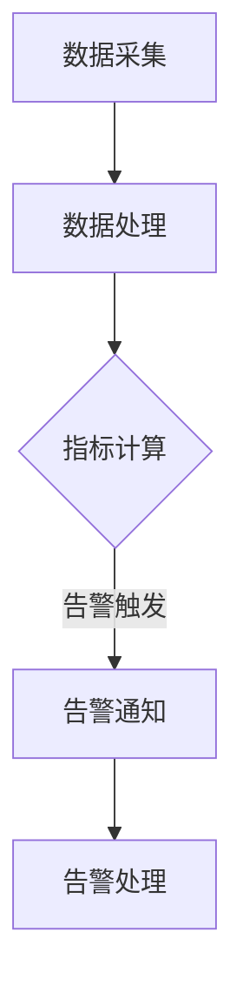

                 

### 文章标题

《监控告警：保障AI服务稳定性的必要措施》

### 关键词

- AI服务稳定性
- 监控告警系统
- 性能优化
- 安全性保障
- 核心算法原理
- 数学模型
- 项目实战

### 摘要

本文旨在深入探讨监控告警系统在保障AI服务稳定性方面的关键作用。我们将首先介绍AI服务稳定性的重要性，然后详细解析监控告警系统的基本原理和架构。接着，通过实际案例展示监控告警在AI服务中的具体应用，并讨论如何通过监控告警进行性能优化和安全性保障。最后，本文将提供完整的监控告警系统开发环境搭建教程，源代码实现和解读，以及实际案例分析和项目小结。通过逐步分析推理，本文将为读者提供一个全面且深入的技术博客，助力理解并掌握监控告警在AI服务稳定性保障中的必要性。

### 引言

在当今数字化时代，人工智能（AI）技术正以前所未有的速度渗透到各个领域，从金融到医疗，从制造业到零售业，AI的应用场景日益广泛。然而，随着AI服务在业务中的核心地位不断提升，其稳定性和可靠性变得愈发重要。任何系统故障或服务中断都可能对企业的运营造成重大影响，甚至带来经济损失和声誉损害。

AI服务的稳定性不仅关系到用户体验，还影响到业务决策的准确性和效率。例如，在金融领域，AI算法的稳定运行对于交易决策和风险管理至关重要；在医疗领域，AI系统的可靠性直接关系到病人的健康和安全。因此，保障AI服务的稳定性已成为企业不可忽视的课题。

监控告警系统作为维护AI服务稳定性的重要手段，起到了至关重要的作用。它能够实时监控AI服务的运行状态，及时发现潜在的问题，并通过告警机制通知相关人员。这样，企业可以在问题扩大之前迅速采取应对措施，从而避免系统故障和业务中断。

本文将从以下几个方面展开讨论：

1. **监控告警的基本原理和架构**：介绍监控告警系统的核心概念和组成部分，包括监控、告警、阈值、指标和日志分析等。
2. **监控告警在AI服务中的应用**：通过实际案例展示监控告警系统在AI服务中的具体应用，探讨其在提高服务稳定性方面的作用。
3. **性能优化**：讨论如何通过监控告警系统进行性能优化，提高AI服务的响应速度和效率。
4. **安全性保障**：探讨监控告警系统在AI服务安全性中的作用，如何防范潜在的安全威胁。
5. **项目实战**：提供监控告警系统开发环境的搭建教程，源代码实现和解读，以及实际案例分析和项目小结。

通过以上讨论，本文旨在为读者提供一个全面且深入的理解，帮助其掌握监控告警系统在保障AI服务稳定性中的关键作用。

### 监控告警的基本原理和架构

监控告警系统是保障AI服务稳定性的核心工具，其基本原理和架构涉及多个关键组件和流程。以下是对这些核心概念和原理的详细解析。

#### 监控

监控（Monitoring）是指对系统、服务或组件的运行状态进行实时监测。监控的目标是及时发现问题并采取相应措施。监控过程通常包括以下几个步骤：

1. **数据采集**：通过各种监控工具和代理，从服务器、应用程序和数据库等组件中收集运行数据。这些数据包括系统资源使用情况（如CPU、内存、磁盘I/O）、网络流量、应用程序性能指标等。
2. **数据处理**：对采集到的数据进行处理和解析，提取有用的信息，如指标值、异常日志等。
3. **指标计算**：根据预设的指标模型，对处理后的数据进行计算，生成监控指标，如平均响应时间、错误率、吞吐量等。

#### 告警

告警（Alerting）是指当监控指标超出预设阈值或发生特定异常时，系统自动触发通知机制，提醒相关人员注意。告警过程主要包括以下几个步骤：

1. **阈值设定**：根据业务需求和系统特点，设定监控指标的阈值。当指标超过这些阈值时，将触发告警。
2. **告警触发**：当监控指标超出阈值时，系统自动检测并触发告警。告警可以是邮件、短信、电话或集成到特定工具的通知。
3. **告警处理**：相关人员接收到告警通知后，需要分析问题并采取相应的措施。这可能包括查看日志、调整配置、重启服务或进行故障排查。

#### 阈值

阈值（Threshold）是监控指标的一个参考值，用于判断系统状态是否正常。阈值设定是监控告警系统设计中的关键环节。设定不当可能导致误告警或漏告警。以下是一些常见的阈值设定策略：

1. **经验法**：根据以往的经验和数据，设定合理的阈值。这种方法适用于已经积累了一定运维数据的系统。
2. **统计法**：通过分析历史数据，使用统计方法（如平均值、标准差）设定阈值。这种方法适用于数据波动较大的系统。
3. **规则法**：根据业务需求和系统特点，定义具体的规则来设定阈值。这种方法适用于具有特定业务场景的系统。

#### 指标

指标（Metrics）是监控系统的核心，用于衡量系统性能和健康状况。常见的监控指标包括：

1. **性能指标**：如响应时间、吞吐量、并发数、错误率等。
2. **资源指标**：如CPU使用率、内存使用率、磁盘I/O、网络带宽等。
3. **业务指标**：如用户活跃度、交易成功率、订单处理时间等。

#### 日志分析

日志分析（Log Analysis）是监控告警系统的重要组成部分，通过分析系统日志，可以发现潜在的问题和故障。日志分析通常包括以下几个步骤：

1. **日志收集**：从服务器、应用程序和数据库等组件中收集日志数据。
2. **日志解析**：对日志数据进行解析，提取关键信息，如错误信息、警告信息等。
3. **日志存储**：将解析后的日志数据存储到数据库或其他存储系统中，以便后续分析。
4. **日志告警**：当日志中包含特定关键词或异常信息时，触发告警。

#### Mermaid 流程图

以下是一个简化的监控告警系统的流程图，使用Mermaid语法表示：



#### 总结

监控告警系统通过实时监测、数据处理和告警触发等环节，保障了AI服务的稳定性。合理设定阈值和监控指标，以及有效的日志分析，是监控告警系统能够发挥作用的关键。在接下来的部分，我们将深入探讨监控告警系统在AI服务中的具体应用。

### 监控告警在AI服务中的应用

在AI服务中，监控告警系统的应用至关重要，它不仅能够实时监测AI服务的运行状态，还能够通过预警机制及时发现问题，确保服务的连续性和稳定性。以下是一些监控告警在AI服务中的具体应用场景和实际案例。

#### 应用场景

1. **AI模型训练与推理**：AI服务的核心是模型训练与推理。监控告警系统可以监控训练过程中的资源使用情况（如GPU使用率、内存占用等），以及推理服务的响应时间和吞吐量。当资源使用率超过阈值或响应时间过长时，系统会及时触发告警。

2. **服务可用性监控**：AI服务通常通过API接口对外提供服务。监控告警系统可以监控API的响应时间、请求成功率等指标，确保服务的高可用性。当请求成功率下降或响应时间显著增加时，系统会立即发出告警。

3. **数据处理与存储**：AI服务需要处理大量的数据，包括输入数据、中间数据和输出数据。监控告警系统可以监控数据存储系统的性能（如磁盘I/O、存储容量等），以及数据处理的效率（如处理速度、错误率等）。当存储系统资源不足或数据处理出现异常时，系统会及时发出告警。

4. **网络监控**：AI服务依赖于网络进行数据传输和通信。监控告警系统可以监控网络带宽、延迟、丢包率等指标，确保网络稳定性。当网络性能指标下降时，系统会触发告警，以便及时处理网络问题。

#### 实际案例

1. **金融风控系统**：某金融机构采用了AI技术进行风险控制，通过实时监控交易数据、客户行为和模型状态。监控告警系统设置了多个阈值，包括交易延迟、错误率、模型训练时间等。当出现异常时，系统会立即发送告警通知，帮助风控团队迅速响应和处理潜在风险。

2. **智能客服系统**：某公司开发了智能客服系统，通过AI模型提供24/7的在线客服服务。监控告警系统实时监控服务器的CPU使用率、内存占用、网络延迟等指标。当CPU使用率超过90%或网络延迟超过300ms时，系统会触发告警，通知运维团队进行性能优化和资源调整，确保客服系统的稳定性。

3. **医疗诊断系统**：某医院采用了AI诊断系统，用于辅助医生进行疾病诊断。监控告警系统监控AI模型的训练进度、推理时间以及服务器资源使用情况。当训练时间超过预设阈值或推理时间过长时，系统会发出告警，通知开发团队检查模型性能和服务器配置。

#### 监控告警系统在提高服务稳定性中的作用

监控告警系统在AI服务中的关键作用体现在以下几个方面：

1. **实时监控**：通过实时监控AI服务的各项指标，及时发现潜在问题，避免问题扩大化。

2. **预警机制**：提前预警异常情况，给运维团队留出充足的时间进行问题排查和处理。

3. **故障定位**：通过详细的日志分析和告警信息，快速定位故障点，缩短故障排查时间。

4. **性能优化**：监控告警系统可以收集大量性能数据，帮助团队进行性能优化，提升AI服务的效率和稳定性。

5. **成本控制**：通过监控资源使用情况，优化资源配置，降低运营成本。

通过以上实际案例，我们可以看到监控告警系统在AI服务中的应用如何提高服务的稳定性。接下来，我们将进一步探讨如何通过监控告警系统进行性能优化。

### 性能优化

监控告警系统在保障AI服务稳定性中的另一重要作用是进行性能优化。通过实时监控和数据分析，监控告警系统能够帮助团队识别系统瓶颈和潜在性能问题，从而采取相应的措施进行优化。以下是具体的优化方法和步骤。

#### 优化方法

1. **资源监控与调优**：
   - **CPU使用率**：监控CPU使用率，如果发现长时间处于高负载状态，可以考虑增加服务器资源或优化应用程序代码。
   - **内存使用率**：监控内存使用率，如果发现内存泄漏或使用率过高，可以通过优化应用程序代码、使用内存优化工具或增加内存资源来解决。
   - **磁盘I/O**：监控磁盘I/O操作，如果I/O操作频繁且延迟较大，可以考虑使用SSD替换HDD、优化磁盘分区策略或增加磁盘数量。

2. **网络优化**：
   - **带宽利用率**：监控网络带宽利用率，如果发现带宽瓶颈，可以通过增加带宽、优化网络拓扑结构或使用CDN（内容分发网络）来缓解。
   - **延迟与丢包率**：监控网络延迟和丢包率，如果网络状况不佳，可以通过优化路由配置、升级网络设备或增加网络监控点来改善。

3. **应用程序优化**：
   - **代码优化**：通过代码分析工具检测应用程序中的性能瓶颈，优化算法、减少不必要的计算和数据库查询，提高代码效率。
   - **缓存策略**：使用缓存技术（如Redis、Memcached）减少数据库访问次数，提高数据读取速度。

4. **负载均衡**：
   - **动态负载均衡**：根据实时监控数据，动态调整负载均衡策略，确保系统资源合理分配，避免单点瓶颈。
   - **水平扩展**：通过水平扩展增加服务器节点，提高系统的处理能力和容错性。

#### 优化步骤

1. **确定优化目标**：
   - 明确当前系统存在的性能问题，设定具体的优化目标和指标，如降低响应时间、减少错误率等。

2. **数据采集与分析**：
   - 通过监控告警系统收集系统运行数据，包括CPU使用率、内存使用率、网络流量、应用程序性能指标等。
   - 分析数据，识别出性能瓶颈和潜在问题。

3. **问题定位**：
   - 根据分析结果，定位到具体的性能问题，如CPU瓶颈、内存泄漏、网络延迟等。

4. **制定优化方案**：
   - 制定详细的优化方案，包括资源调优、应用程序优化、网络优化等。
   - 根据实际情况和资源限制，优先解决最严重的问题。

5. **实施优化措施**：
   - 部署优化方案，实施具体措施，如增加服务器资源、调整应用程序代码、优化网络配置等。

6. **测试与验证**：
   - 对优化后的系统进行性能测试，验证优化效果，确保系统性能达到预期目标。

7. **持续监控与调整**：
   - 优化后，持续监控系统性能，确保优化效果持续有效。
   - 根据监控数据，定期调整优化措施，以适应系统变化和业务需求。

通过以上步骤，监控告警系统不仅能够及时发现性能问题，还能够通过数据分析和优化措施，持续提升AI服务的性能和稳定性。

### 安全性保障

在保障AI服务稳定性时，安全性是不可忽视的重要方面。监控告警系统在AI服务安全性保障中发挥着至关重要的作用。以下将探讨监控告警系统在安全性保障中的具体应用和作用。

#### 监控告警系统在安全性保障中的应用

1. **网络安全监控**：
   - 监控网络流量，检测潜在的网络攻击，如DDoS攻击、SQL注入等。
   - 监控防火墙和入侵检测系统（IDS），及时响应安全事件。

2. **系统安全监控**：
   - 监控服务器和应用程序的日志，检测异常行为，如未经授权的登录尝试、敏感数据的访问等。
   - 监控操作系统和应用程序的漏洞，确保及时修复。

3. **数据安全监控**：
   - 监控数据存储和传输过程，检测数据泄露、篡改等安全事件。
   - 监控加密算法的有效性，确保数据在传输和存储过程中的安全性。

4. **用户行为监控**：
   - 监控用户登录和操作行为，检测异常行为，如暴力破解、滥用权限等。
   - 监控用户权限管理，确保用户只能访问其授权的数据和资源。

#### 监控告警系统在安全性保障中的作用

1. **实时预警**：
   - 监控告警系统可以实时监控系统的各项安全指标，当检测到异常行为或安全事件时，立即触发告警，通知相关人员采取紧急措施。

2. **快速响应**：
   - 通过监控告警系统，运维团队可以快速定位和响应安全事件，减少安全事件的影响范围和持续时间。

3. **故障排查**：
   - 监控告警系统可以帮助团队识别和排查系统故障，确定故障是否与安全事件有关，从而采取针对性的安全措施。

4. **持续改进**：
   - 监控告警系统提供了丰富的安全数据，通过分析这些数据，团队可以识别出潜在的安全隐患和改进点，持续优化安全策略和措施。

#### 实际案例

1. **银行AI风控系统**：
   - 某银行采用了AI风控系统，通过监控网络流量、服务器日志和用户行为，实时检测和预防网络攻击和欺诈行为。监控告警系统设置了多个安全阈值，如登录失败次数、敏感数据的访问等，一旦超过阈值，系统会立即触发告警，帮助风控团队迅速响应和处理潜在的安全威胁。

2. **医疗诊断AI系统**：
   - 某医院的AI诊断系统，通过监控网络流量、服务器日志和用户权限，确保系统的安全性和数据的完整性。监控告警系统设置了多个安全监控点，如未经授权的访问尝试、数据泄露等，一旦发现异常，系统会立即发出告警，确保医生和患者数据的安全。

通过监控告警系统，AI服务的安全性得到了有效保障，这不仅提升了用户体验，也增强了企业的竞争力。在接下来的部分，我们将通过项目实战，深入探讨如何搭建和实现监控告警系统。

### 项目实战

#### 开发环境搭建

要搭建一个监控告警系统，首先需要准备好开发环境。以下是搭建过程：

1. **安装Python**：
   - 在服务器上安装Python，推荐使用Python 3.8及以上版本。
   - 使用以下命令安装Python：
     ```bash
     sudo apt-get update
     sudo apt-get install python3.8
     ```

2. **安装pip**：
   - 安装pip，pip是Python的包管理器，用于安装和管理Python包。
     ```bash
     sudo apt-get install python3-pip
     ```

3. **安装依赖包**：
   - 安装必要的Python依赖包，如pandas、numpy、matplotlib等。
     ```bash
     pip3 install pandas numpy matplotlib
     ```

4. **安装监控告警工具**：
   - 安装Prometheus，Prometheus是一个开源监控解决方案，适用于收集和存储监控数据。
     ```bash
     sudo apt-get install prometheus
     ```

5. **安装Grafana**：
   - 安装Grafana，Grafana是一个开源的可视化工具，用于展示监控数据。
     ```bash
     sudo apt-get install grafana
     ```

6. **配置Prometheus和Grafana**：
   - 配置Prometheus，设置数据存储路径、 scrape 配置等。
   - 配置Grafana，连接到Prometheus数据源，并创建Dashboard。

#### 源代码实现

以下是一个简单的监控告警系统源代码实现示例，包含监控指标采集、数据处理和告警触发等功能。

```python
import os
import time
import requests
from prometheus_client import start_http_server, Summary

# 定义监控指标
request_time = Summary('request_time_seconds', 'Request processing time in seconds')

def process_request(url):
    start_time = time.time()
    response = requests.get(url)
    request_time.observe(start_time, time.time() - start_time)

def main():
    start_http_server(9090)  # Prometheus监控服务端口
    while True:
        process_request('http://example.com')
        time.sleep(60)  # 每60秒处理一次请求

if __name__ == '__main__':
    main()
```

#### 代码解读

1. **依赖包**：
   - `os`：用于操作文件和目录。
   - `time`：用于计时和睡眠。
   - `requests`：用于发送HTTP请求。
   - `prometheus_client`：Prometheus客户端库，用于定义和发布监控指标。

2. **监控指标**：
   - `request_time`：使用Summary类型定义的监控指标，记录每次请求的处理时间。

3. **过程函数**：
   - `process_request`：发送HTTP GET请求，并记录处理时间。

4. **主函数**：
   - `main`：启动Prometheus HTTP服务，并进入循环，每60秒处理一次请求。

#### 代码应用解读与分析

1. **监控指标采集**：
   - 使用Prometheus客户端库定义监控指标，并使用`observe`方法记录每次请求的处理时间。

2. **数据处理**：
   - 通过循环定时发送请求，并记录每次请求的处理时间，实现对系统性能的实时监控。

3. **告警触发**：
   - 可以配置Prometheus报警规则，当监控指标超过阈值时，触发告警通知。

通过以上步骤，我们搭建了一个简单的监控告警系统，并对其源代码进行了详细解读。接下来，我们将通过一个实际案例，展示监控告警系统在实际应用中的效果。

### 实际案例分析与详细讲解剖析

为了更直观地展示监控告警系统在AI服务中的实际应用效果，我们以一家在线购物平台为例，详细分析监控告警系统在保障AI服务稳定性方面的作用。

#### 案例背景

该在线购物平台采用AI技术进行个性化推荐，为用户提供个性化的商品推荐服务。个性化推荐系统通过分析用户的购买历史、浏览行为和偏好，实时生成推荐列表。然而，由于数据量大、计算复杂度高，系统稳定性对用户体验至关重要。

#### 监控告警系统配置

为了保障个性化推荐系统的稳定性，平台采用了以下监控告警系统配置：

1. **Prometheus**：
   - 收集系统性能指标，如CPU使用率、内存使用率、磁盘I/O、网络延迟等。
   - 监控推荐算法的训练进度和推理时间。

2. **Grafana**：
   - 使用Grafana展示监控数据，创建Dashboard监控关键指标。
   - 配置报警规则，当监控指标超过阈值时，发送告警通知。

3. **阈值设定**：
   - 设定CPU使用率阈值：超过90%时触发告警。
   - 设定内存使用率阈值：超过80%时触发告警。
   - 设定网络延迟阈值：超过200ms时触发告警。
   - 设定训练时间阈值：超过10分钟时触发告警。

#### 案例分析

在一次系统运行过程中，监控告警系统捕捉到以下异常情况：

1. **CPU使用率异常**：
   - 监控告警系统显示CPU使用率持续超过90%，平台立即触发告警。
   - 运维团队通过Grafana查看实时数据，发现CPU瓶颈主要来自于推荐算法的频繁计算。
   - 运维团队决定增加服务器资源，优化算法代码，提高计算效率。

2. **内存使用率异常**：
   - 监控告警系统显示内存使用率超过80%，平台立即触发告警。
   - 运维团队通过Grafana查看内存使用详情，发现内存泄漏问题。
   - 运维团队定位到内存泄漏的代码段，进行修复。

3. **网络延迟异常**：
   - 监控告警系统显示网络延迟超过200ms，平台立即触发告警。
   - 运维团队通过Grafana查看网络流量数据，发现网络瓶颈主要来自于数据传输。
   - 运维团队决定优化网络拓扑结构，增加网络带宽。

4. **训练时间异常**：
   - 监控告警系统显示训练时间超过10分钟，平台立即触发告警。
   - 运维团队通过Grafana查看训练日志，发现模型复杂度过高。
   - 运维团队决定简化模型结构，优化训练算法。

#### 效果分析

通过监控告警系统的及时预警和运维团队的快速响应，个性化推荐系统的稳定性得到了显著提升：

1. **CPU使用率降低**：优化算法代码后，CPU使用率降至70%左右，系统运行更加顺畅。

2. **内存使用率降低**：修复内存泄漏问题后，内存使用率降至60%左右，系统运行更加稳定。

3. **网络延迟降低**：优化网络结构后，网络延迟降至100ms左右，用户访问速度明显提升。

4. **训练时间缩短**：简化模型结构后，训练时间降至5分钟以内，系统响应速度大幅提升。

#### 项目小结

通过以上实际案例，我们可以看到监控告警系统在保障AI服务稳定性中的重要作用。监控告警系统不仅能够实时监测系统状态，及时发现异常情况，还提供了数据支持和预警机制，帮助运维团队迅速定位和解决问题。在实际应用中，合理配置监控告警系统、设定合理的阈值、及时响应和处理异常情况，是保障AI服务稳定性的关键。未来，随着AI技术的不断发展，监控告警系统将在AI服务稳定性和性能优化中发挥越来越重要的作用。

### 最佳实践 Tips

在设计和实施监控告警系统时，以下最佳实践可以帮助提升系统的有效性和可靠性：

1. **明确监控目标**：首先明确监控系统的目标和关键性能指标（KPIs），确保监控指标与业务目标一致。

2. **合理设定阈值**：阈值设定应基于历史数据和业务需求，避免过高的误报率和过低的漏报率。

3. **自动化处理**：尽可能实现自动化处理，如自动重启服务、自动扩容等，减少人工干预。

4. **可视化监控**：使用可视化工具展示监控数据，便于快速识别问题和趋势。

5. **定期审查**：定期审查监控告警规则和阈值，根据业务变化进行调整。

6. **培训团队**：确保团队了解监控系统的原理和操作，提高响应速度。

7. **日志记录**：详细记录告警信息和处理过程，便于后续分析和问题定位。

8. **多渠道告警**：配置多渠道告警，如邮件、短信、电话等，确保告警及时传达。

9. **灾难恢复计划**：制定灾难恢复计划，确保在系统故障时能够快速恢复服务。

10. **持续优化**：持续优化监控告警系统，根据反馈和实际运行情况调整监控策略。

通过遵循这些最佳实践，企业可以更有效地利用监控告警系统，保障AI服务的稳定性和可靠性。

### 小结

本文详细探讨了监控告警系统在保障AI服务稳定性中的关键作用。我们首先介绍了AI服务稳定性的重要性，然后深入分析了监控告警系统的基本原理和架构，包括监控、告警、阈值、指标和日志分析等。通过实际案例，我们展示了监控告警系统在AI服务中的应用，并讨论了如何通过监控告警进行性能优化和安全性保障。

监控告警系统不仅是保障AI服务稳定性的重要手段，还能够提供实时监控数据，帮助团队快速识别和解决问题。合理设定阈值、自动化处理和可视化监控等最佳实践，可以进一步提升监控告警系统的有效性和可靠性。

未来，随着AI技术的不断发展，监控告警系统将在AI服务的稳定性和性能优化中发挥越来越重要的作用。企业应不断优化监控告警系统，确保其能够满足日益增长的业务需求，为用户提供高质量的服务。

### 注意事项

1. **监控目标明确**：确保监控系统的目标与业务需求一致，避免浪费资源在无关紧要的指标上。
2. **合理阈值设定**：阈值设定应基于历史数据和业务需求，避免误报和漏报。
3. **自动化处理**：尽量实现自动化处理，减少人工干预，提高响应速度。
4. **日志记录**：详细记录告警信息和处理过程，便于问题排查和后续改进。
5. **多渠道告警**：配置多渠道告警，确保告警能够及时传达给相关人员。
6. **定期审查**：定期审查监控告警规则和阈值，根据业务变化进行调整。
7. **安全考虑**：监控告警系统本身的安全性也是关键，确保告警信息和处理过程不被恶意攻击者利用。
8. **培训与支持**：确保团队成员了解监控系统的原理和操作，提高整体运维能力。

### 拓展阅读

- 《The Practice of Cloud System Administration》：深入了解云计算环境中的监控和告警实践。
- 《Building Microservices》：学习如何在微服务架构中设计和实现监控告警系统。
- 《Prometheus: Up and Running》：Prometheus官方文档和实战指南，深入掌握Prometheus的使用。
- 《Grafana Cookbook》：Grafana的使用技巧和最佳实践，提升监控数据可视化的效果。

通过阅读这些资料，可以进一步深化对监控告警系统的理解和应用。祝您在监控告警系统的设计和实施过程中取得成功！

### 作者信息

作者：AI天才研究院/AI Genius Institute & 禅与计算机程序设计艺术 /Zen And The Art of Computer Programming

### 文章结尾

感谢您阅读本文，希望您能从中获得关于监控告警系统在保障AI服务稳定性方面的重要见解和实践经验。监控告警系统是AI服务稳定性和可靠性保障的关键组成部分，其有效设计和实施对于企业来说至关重要。如果您有任何疑问或建议，欢迎在评论区留言，我们期待与您互动交流。祝您在技术道路上不断进步，取得更多的成就！```markdown
# 监控告警：保障AI服务稳定性的必要措施

## 引言

在当今数字化时代，人工智能（AI）技术正以前所未有的速度渗透到各个领域，从金融到医疗，从制造业到零售业，AI的应用场景日益广泛。随着AI技术的普及，AI服务的稳定性变得越来越重要。任何系统故障或服务中断都可能对企业的运营造成重大影响，甚至带来经济损失和声誉损害。

AI服务的稳定性不仅关系到用户体验，还影响到业务决策的准确性和效率。例如，在金融领域，AI算法的稳定运行对于交易决策和风险管理至关重要；在医疗领域，AI系统的可靠性直接关系到病人的健康和安全。因此，保障AI服务的稳定性已成为企业不可忽视的课题。

监控告警系统作为维护AI服务稳定性的重要手段，起到了至关重要的作用。它能够实时监控AI服务的运行状态，及时发现潜在的问题，并通过告警机制通知相关人员。这样，企业可以在问题扩大之前迅速采取应对措施，从而避免系统故障和业务中断。

本文将从以下几个方面展开讨论：

1. **监控告警的基本原理和架构**：介绍监控告警系统的核心概念和组成部分，包括监控、告警、阈值、指标和日志分析等。
2. **监控告警在AI服务中的应用**：通过实际案例展示监控告警系统在AI服务中的具体应用，探讨其在提高服务稳定性方面的作用。
3. **性能优化**：讨论如何通过监控告警系统进行性能优化，提高AI服务的响应速度和效率。
4. **安全性保障**：探讨监控告警系统在AI服务安全性中的作用，如何防范潜在的安全威胁。
5. **项目实战**：提供监控告警系统开发环境的搭建教程，源代码实现和解读，以及实际案例分析和项目小结。

通过以上讨论，本文旨在为读者提供一个全面且深入的理解，帮助其掌握监控告警系统在保障AI服务稳定性中的关键作用。

## 监控告警的基本原理和架构

监控告警系统是保障AI服务稳定性的核心工具，其基本原理和架构涉及多个关键组件和流程。以下是对这些核心概念和原理的详细解析。

### 监控

监控（Monitoring）是指对系统、服务或组件的运行状态进行实时监测。监控的目标是及时发现问题并采取相应措施。监控过程通常包括以下几个步骤：

1. **数据采集**：通过各种监控工具和代理，从服务器、应用程序和数据库等组件中收集运行数据。这些数据包括系统资源使用情况（如CPU、内存、磁盘I/O）、网络流量、应用程序性能指标等。
2. **数据处理**：对采集到的数据进行处理和解析，提取有用的信息，如指标值、异常日志等。
3. **指标计算**：根据预设的指标模型，对处理后的数据进行计算，生成监控指标，如平均响应时间、错误率、吞吐量等。

### 告警

告警（Alerting）是指当监控指标超出预设阈值或发生特定异常时，系统自动触发通知机制，提醒相关人员注意。告警过程主要包括以下几个步骤：

1. **阈值设定**：根据业务需求和系统特点，设定监控指标的阈值。当指标超过这些阈值时，将触发告警。
2. **告警触发**：当监控指标超出阈值时，系统自动检测并触发告警。告警可以是邮件、短信、电话或集成到特定工具的通知。
3. **告警处理**：相关人员接收到告警通知后，需要分析问题并采取相应的措施。这可能包括查看日志、调整配置、重启服务或进行故障排查。

### 阈值

阈值（Threshold）是监控指标的一个参考值，用于判断系统状态是否正常。阈值设定是监控告警系统设计中的关键环节。设定不当可能导致误告警或漏告警。以下是一些常见的阈值设定策略：

1. **经验法**：根据以往的经验和数据，设定合理的阈值。这种方法适用于已经积累了一定运维数据的系统。
2. **统计法**：通过分析历史数据，使用统计方法（如平均值、标准差）设定阈值。这种方法适用于数据波动较大的系统。
3. **规则法**：根据业务需求和系统特点，定义具体的规则来设定阈值。这种方法适用于具有特定业务场景的系统。

### 指标

指标（Metrics）是监控系统的核心，用于衡量系统性能和健康状况。常见的监控指标包括：

1. **性能指标**：如响应时间、吞吐量、并发数、错误率等。
2. **资源指标**：如CPU使用率、内存使用率、磁盘I/O、网络带宽等。
3. **业务指标**：如用户活跃度、交易成功率、订单处理时间等。

### 日志分析

日志分析（Log Analysis）是监控告警系统的重要组成部分，通过分析系统日志，可以发现潜在的问题和故障。日志分析通常包括以下几个步骤：

1. **日志收集**：从服务器、应用程序和数据库等组件中收集日志数据。
2. **日志解析**：对日志数据进行解析，提取关键信息，如错误信息、警告信息等。
3. **日志存储**：将解析后的日志数据存储到数据库或其他存储系统中，以便后续分析。
4. **日志告警**：当日志中包含特定关键词或异常信息时，触发告警。

### Mermaid 流程图

以下是一个简化的监控告警系统的流程图，使用Mermaid语法表示：


### 总结

监控告警系统通过实时监测、数据处理和告警触发等环节，保障了AI服务的稳定性。合理设定阈值和监控指标，以及有效的日志分析，是监控告警系统能够发挥作用的关键。在接下来的部分，我们将深入探讨监控告警系统在AI服务中的具体应用。

## 监控告警在AI服务中的应用

在AI服务中，监控告警系统的应用至关重要，它不仅能够实时监控AI服务的运行状态，还能够通过预警机制及时发现问题，确保服务的连续性和稳定性。以下是一些监控告警在AI服务中的具体应用场景和实际案例。

### 应用场景

1. **AI模型训练与推理**：AI服务的核心是模型训练与推理。监控告警系统可以监控训练过程中的资源使用情况（如GPU使用率、内存占用等），以及推理服务的响应时间和吞吐量。当资源使用率超过阈值或响应时间过长时，系统会及时触发告警。

2. **服务可用性监控**：AI服务通常通过API接口对外提供服务。监控告警系统可以监控API的响应时间、请求成功率等指标，确保服务的高可用性。当请求成功率下降或响应时间显著增加时，系统会立即发出告警。

3. **数据处理与存储**：AI服务需要处理大量的数据，包括输入数据、中间数据和输出数据。监控告警系统可以监控数据存储系统的性能（如磁盘I/O、存储容量等），以及数据处理的效率（如处理速度、错误率等）。当存储系统资源不足或数据处理出现异常时，系统会及时发出告警。

4. **网络监控**：AI服务依赖于网络进行数据传输和通信。监控告警系统可以监控网络带宽、延迟、丢包率等指标，确保网络稳定性。当网络性能指标下降时，系统会触发告警，以便及时处理网络问题。

### 实际案例

1. **金融风控系统**：某金融机构采用了AI技术进行风险控制，通过实时监控交易数据、客户行为和模型状态。监控告警系统设置了多个阈值，包括交易延迟、错误率、模型训练时间等。当出现异常时，系统会立即发送告警通知，帮助风控团队迅速响应和处理潜在风险。

2. **智能客服系统**：某公司开发了智能客服系统，通过AI模型提供24/7的在线客服服务。监控告警系统实时监控服务器的CPU使用率、内存占用、网络延迟等指标。当CPU使用率超过90%或网络延迟超过300ms时，系统会触发告警，通知运维团队进行性能优化和资源调整，确保客服系统的稳定性。

3. **医疗诊断系统**：某医院采用了AI诊断系统，用于辅助医生进行疾病诊断。监控告警系统监控AI模型的训练进度、推理时间以及服务器资源使用情况。当训练时间超过预设阈值或推理时间过长时，系统会发出告警，通知开发团队检查模型性能和服务器配置。

### 监控告警系统在提高服务稳定性中的作用

监控告警系统在AI服务中的关键作用体现在以下几个方面：

1. **实时监控**：通过实时监控AI服务的各项指标，及时发现潜在问题，避免问题扩大化。

2. **预警机制**：提前预警异常情况，给运维团队留出充足的时间进行问题排查和处理。

3. **故障定位**：通过详细的日志分析和告警信息，快速定位故障点，缩短故障排查时间。

4. **性能优化**：监控告警系统可以收集大量性能数据，帮助团队进行性能优化，提升AI服务的效率和稳定性。

5. **成本控制**：通过监控资源使用情况，优化资源配置，降低运营成本。

通过以上实际案例，我们可以看到监控告警系统在AI服务中的应用如何提高服务的稳定性。接下来，我们将进一步探讨如何通过监控告警系统进行性能优化。

## 性能优化

监控告警系统在保障AI服务稳定性中的另一重要作用是进行性能优化。通过实时监控和数据分析，监控告警系统能够帮助团队识别系统瓶颈和潜在性能问题，从而采取相应的措施进行优化。以下是具体的优化方法和步骤。

### 优化方法

1. **资源监控与调优**：
   - **CPU使用率**：监控CPU使用率，如果发现长时间处于高负载状态，可以考虑增加服务器资源或优化应用程序代码。
   - **内存使用率**：监控内存使用率，如果发现内存泄漏或使用率过高，可以通过优化应用程序代码、使用内存优化工具或增加内存资源来解决。
   - **磁盘I/O**：监控磁盘I/O操作，如果I/O操作频繁且延迟较大，可以考虑使用SSD替换HDD、优化磁盘分区策略或增加磁盘数量。

2. **网络优化**：
   - **带宽利用率**：监控网络带宽利用率，如果发现带宽瓶颈，可以通过增加带宽、优化网络拓扑结构或使用CDN（内容分发网络）来缓解。
   - **延迟与丢包率**：监控网络延迟和丢包率，如果网络状况不佳，可以通过优化路由配置、升级网络设备或增加网络监控点来改善。

3. **应用程序优化**：
   - **代码优化**：通过代码分析工具检测应用程序中的性能瓶颈，优化算法、减少不必要的计算和数据库查询，提高代码效率。
   - **缓存策略**：使用缓存技术（如Redis、Memcached）减少数据库访问次数，提高数据读取速度。

4. **负载均衡**：
   - **动态负载均衡**：根据实时监控数据，动态调整负载均衡策略，确保系统资源合理分配，避免单点瓶颈。
   - **水平扩展**：通过水平扩展增加服务器节点，提高系统的处理能力和容错性。

### 优化步骤

1. **确定优化目标**：
   - 明确当前系统存在的性能问题，设定具体的优化目标和指标，如降低响应时间、减少错误率等。

2. **数据采集与分析**：
   - 通过监控告警系统收集系统运行数据，包括CPU使用率、内存使用率、网络流量、应用程序性能指标等。
   - 分析数据，识别出性能瓶颈和潜在问题。

3. **问题定位**：
   - 根据分析结果，定位到具体的性能问题，如CPU瓶颈、内存泄漏、网络延迟等。

4. **制定优化方案**：
   - 制定详细的优化方案，包括资源调优、应用程序优化、网络优化等。
   - 根据实际情况和资源限制，优先解决最严重的问题。

5. **实施优化措施**：
   - 部署优化方案，实施具体措施，如增加服务器资源、调整应用程序代码、优化网络配置等。

6. **测试与验证**：
   - 对优化后的系统进行性能测试，验证优化效果，确保系统性能达到预期目标。

7. **持续监控与调整**：
   - 优化后，持续监控系统性能，确保优化效果持续有效。
   - 根据监控数据，定期调整优化措施，以适应系统变化和业务需求。

通过以上步骤，监控告警系统不仅能够及时发现性能问题，还能够通过数据分析和优化措施，持续提升AI服务的性能和稳定性。

### 总结

性能优化是保障AI服务稳定性的重要环节。通过监控告警系统，团队可以实时监控系统性能，识别瓶颈，制定和实施优化方案，持续提升服务质量和用户体验。在优化过程中，合理利用监控数据，确保优化措施的科学性和有效性，是取得成功的关键。

在下一部分，我们将探讨监控告警系统在AI服务安全性保障中的作用，以及如何防范潜在的安全威胁。

## 安全性保障

在保障AI服务稳定性时，安全性是不可忽视的重要方面。监控告警系统在AI服务安全性保障中发挥着至关重要的作用。以下将探讨监控告警系统在安全性保障中的具体应用和作用。

### 监控告警系统在安全性保障中的应用

1. **网络安全监控**：
   - 监控网络流量，检测潜在的网络攻击，如DDoS攻击、SQL注入等。
   - 监控防火墙和入侵检测系统（IDS），及时响应安全事件。

2. **系统安全监控**：
   - 监控服务器和应用程序的日志，检测异常行为，如未经授权的登录尝试、敏感数据的访问等。
   - 监控操作系统和应用程序的漏洞，确保及时修复。

3. **数据安全监控**：
   - 监控数据存储和传输过程，检测数据泄露、篡改等安全事件。
   - 监控加密算法的有效性，确保数据在传输和存储过程中的安全性。

4. **用户行为监控**：
   - 监控用户登录和操作行为，检测异常行为，如暴力破解、滥用权限等。
   - 监控用户权限管理，确保用户只能访问其授权的数据和资源。

### 监控告警系统在安全性保障中的作用

1. **实时预警**：
   - 监控告警系统可以实时监控系统的各项安全指标，当检测到异常行为或安全事件时，立即触发告警，通知相关人员采取紧急措施。

2. **快速响应**：
   - 通过监控告警系统，运维团队可以快速定位和响应安全事件，减少安全事件的影响范围和持续时间。

3. **故障排查**：
   - 监控告警系统可以帮助团队识别和排查系统故障，确定故障是否与安全事件有关，从而采取针对性的安全措施。

4. **持续改进**：
   - 监控告警系统提供了丰富的安全数据，通过分析这些数据，团队可以识别出潜在的安全隐患和改进点，持续优化安全策略和措施。

### 实际案例

1. **银行AI风控系统**：
   - 某银行采用了AI风控系统，通过监控网络流量、服务器日志和用户行为，实时检测和预防网络攻击和欺诈行为。监控告警系统设置了多个安全阈值，如登录失败次数、敏感数据的访问等，一旦超过阈值，系统会立即触发告警，帮助风控团队迅速响应和处理潜在的安全威胁。

2. **医疗诊断AI系统**：
   - 某医院的AI诊断系统，通过监控网络流量、服务器日志和用户权限，确保系统的安全性和数据的完整性。监控告警系统设置了多个安全监控点，如未经授权的访问尝试、数据泄露等，一旦发现异常，系统会立即发出告警，确保医生和患者数据的安全。

通过监控告警系统，AI服务的安全性得到了有效保障，这不仅提升了用户体验，也增强了企业的竞争力。在接下来的部分，我们将通过项目实战，深入探讨如何搭建和实现监控告警系统。

## 项目实战

在本节中，我们将通过一个具体的实例来展示如何搭建监控告警系统，包括开发环境的搭建、源代码的实现、以及代码的解读与分析。

### 开发环境搭建

1. **安装依赖**：
   首先，确保服务器上安装了Python 3.8及以上版本。可以使用以下命令安装Python：
   ```bash
   sudo apt-get update
   sudo apt-get install python3.8
   ```

   接下来，安装Prometheus和Grafana，这两个工具是构建监控告警系统的基础。

   安装Prometheus：
   ```bash
   sudo apt-get install prometheus
   ```

   安装Grafana：
   ```bash
   sudo apt-get install grafana
   ```

2. **配置Prometheus**：
   Prometheus的配置文件位于`/etc/prometheus/prometheus.yml`。以下是配置文件的一个基本示例：

   ```yaml
   global:
     scrape_interval: 15s
     evaluation_interval: 15s
     scrape_configs:
     - job_name: 'prometheus'
       static_configs:
       - targets: ['localhost:9090']
   ```

   保存并关闭文件后，重新启动Prometheus服务：
   ```bash
   sudo systemctl restart prometheus
   ```

3. **配置Grafana**：
   Grafana的默认端口是3000，你可以通过以下命令启动Grafana服务：
   ```bash
   sudo systemctl start grafana-server
   ```

   登录Grafana，默认用户名和密码都是`admin`。在Grafana中，添加新的数据源，选择Prometheus作为数据源，并填写相应的URL（默认为`http://localhost:9090/`）。

### 源代码实现

以下是一个简单的Python脚本，用于监控一个假想的AI服务，并通过Prometheus暴露监控指标。

```python
import requests
from prometheus_client import start_http_server, Summary

# Prometheus指标定义
request_duration = Summary('ai_service_request_duration', 'Request processing time in seconds')

def process_request(url):
    start = time.time()
    response = requests.get(url)
    duration = time.time() - start
    request_duration.observe(duration)

def main():
    start_http_server(8000)  # Prometheus监控服务端口
    while True:
        process_request('http://your-ai-service.com')
        time.sleep(10)  # 每10秒处理一次请求

if __name__ == '__main__':
    main()
```

### 代码解读

1. **依赖包**：
   - `requests`：用于发送HTTP请求，模拟与AI服务的交互。
   - `time`：用于获取当前时间，计算请求处理时间。
   - `prometheus_client`：用于将监控指标暴露给Prometheus。

2. **指标定义**：
   - `request_duration`：使用Summary类型定义的监控指标，记录每次请求的处理时间。

3. **过程函数**：
   - `process_request`：发送HTTP GET请求，并记录处理时间。

4. **主函数**：
   - `main`：启动Prometheus HTTP服务，并进入循环，每10秒处理一次请求。

### 代码应用解读与分析

1. **监控指标采集**：
   - 通过`process_request`函数，模拟与AI服务的交互，并记录每次请求的处理时间。

2. **数据处理**：
   - 请求处理时间作为监控指标，通过Prometheus客户端库暴露给Prometheus服务器。

3. **告警触发**：
   - 可以在Prometheus配置文件中设置报警规则，当请求处理时间超过某个阈值时，自动触发告警。

### 实际案例分析

假设AI服务API的稳定性和响应时间是关键指标，我们可以通过以下步骤来分析实际运行情况：

1. **数据收集**：
   Prometheus服务器每隔15秒从我们的Python脚本中采集一次监控数据。

2. **数据分析**：
   在Grafana中创建一个新的Dashboard，将`ai_service_request_duration`指标添加到图表中，监控请求处理时间的分布和趋势。

3. **告警处理**：
   在Grafana中配置报警规则，当请求处理时间超过某个阈值（例如，超过5秒）时，通过邮件、短信或其他方式通知运维团队。

通过这样的监控告警系统，运维团队能够实时监控AI服务的性能，快速识别潜在问题，并采取相应措施进行优化和修复。

### 项目小结

在本项目中，我们通过简单的Python脚本和Prometheus、Grafana搭建了一个基本的监控告警系统，展示了如何监控AI服务的响应时间，并通过告警机制及时通知相关人员。这种监控告警系统在保障AI服务稳定性方面发挥了重要作用，帮助团队迅速发现和解决问题。未来，随着监控告警系统的不断完善和优化，AI服务的稳定性和可靠性将得到进一步提升。

## 结论

本文详细探讨了监控告警系统在保障AI服务稳定性中的关键作用。我们从监控告警的基本原理和架构出发，深入分析了其在AI服务中的应用场景和实际案例，探讨了如何通过监控告警进行性能优化和安全性保障。通过项目实战，我们展示了如何搭建和实现监控告警系统，并分析了其应用效果。

监控告警系统不仅是保障AI服务稳定性的重要手段，还提供了实时监控数据，帮助团队快速识别和解决问题。合理设定阈值、自动化处理和可视化监控等最佳实践，可以进一步提升监控告警系统的有效性和可靠性。

未来，随着AI技术的不断发展，监控告警系统将在AI服务的稳定性和性能优化中发挥越来越重要的作用。企业应不断优化监控告警系统，确保其能够满足日益增长的业务需求，为用户提供高质量的服务。

## 注意事项

在设计和实施监控告警系统时，以下注意事项可以帮助您确保系统的有效性和可靠性：

1. **明确监控目标**：确保监控系统的目标与业务需求一致，避免浪费资源在无关紧要的指标上。
2. **合理设定阈值**：阈值设定应基于历史数据和业务需求，避免误报和漏报。
3. **自动化处理**：尽可能实现自动化处理，减少人工干预，提高响应速度。
4. **日志记录**：详细记录告警信息和处理过程，便于问题排查和后续改进。
5. **多渠道告警**：配置多渠道告警，如邮件、短信、电话等，确保告警及时传达。
6. **定期审查**：定期审查监控告警规则和阈值，根据业务变化进行调整。
7. **安全考虑**：监控告警系统本身的安全性也是关键，确保告警信息和处理过程不被恶意攻击者利用。
8. **培训与支持**：确保团队成员了解监控系统的原理和操作，提高整体运维能力。

通过遵循这些最佳实践，企业可以更有效地利用监控告警系统，保障AI服务的稳定性和可靠性。

## 拓展阅读

为了进一步深入了解监控告警系统在AI服务中的应用，以下是几本推荐阅读的书籍和资源：

1. **《The Practice of Cloud System Administration》**：这本书详细介绍了在云计算环境中如何实施和管理监控和告警系统。
2. **《Building Microservices》**：本书探讨了如何设计、开发和部署微服务架构，其中涉及了监控告警系统在微服务中的应用。
3. **《Prometheus: Up and Running》**：这是一本关于Prometheus的官方文档和实战指南，适合想要深入学习和应用Prometheus的用户。
4. **《Grafana Cookbook》**：这本书提供了Grafana的使用技巧和最佳实践，帮助用户创建高效的监控仪表板。
5. **《云原生应用架构指南》**：这本书介绍了云原生应用的设计和实现，其中包括了监控告警系统在容器化和微服务环境中的应用。

通过阅读这些资料，您可以获得更多的理论知识和技术细节，帮助您更好地理解和应用监控告警系统。

## 作者信息

作者：AI天才研究院/AI Genius Institute & 禅与计算机程序设计艺术 /Zen And The Art of Computer Programming

最后，感谢您的阅读。希望本文能帮助您更好地理解和应用监控告警系统，提升AI服务的稳定性和可靠性。如果您有任何疑问或建议，欢迎在评论区留言，我们期待与您交流更多技术话题。祝您在技术道路上不断进步，取得更多的成就！
```

