                 

### 文章标题

# 直觉与理性在理解世界中的角色

### 文章关键词

- 直觉
- 理性
- 认知心理学
- 决策
- 逻辑思维

### 文章摘要

本文深入探讨了直觉与理性在人类认知与行为中的角色。通过分析直觉的本质、认知心理学基础，以及直觉在决策中的应用，我们理解了直觉作为一种快速认知过程的重要性。同时，文章介绍了理性的定义、功能以及逻辑思考的基本原理，并探讨了理性在问题解决中的应用。在此基础上，文章进一步阐述了直觉与理性在日常生活中的平衡、在教育中的运用，以及在现代科技和未来社会中的发展前景。通过这些探讨，本文旨在帮助读者全面理解直觉与理性，并在实际生活中有效运用这些原理。

---

## 第1章：直觉的本质

### 背景介绍

直觉，作为一种快速、无意识的认知过程，是我们在日常生活中经常使用的一种认知方式。直觉让我们在面临复杂情况时能够迅速做出判断和决策，而不需要进行繁琐的逻辑推理。例如，当我们在夜晚走路时，能够避开路边的障碍物；当我们在与他人交流时，能够迅速理解对方的意图。这些看似简单的行为，实际上都是直觉在发挥作用。

### 核心概念与联系

直觉是一种基于经验、情感和背景知识快速做出判断的认知过程。它与理性决策有显著的区别。理性决策通常依赖于逻辑推理、分析和证据，而直觉则更多地依赖于快速的理解和感觉。

直觉与理性之间的联系在于，直觉可以作为理性决策的辅助工具。直觉能够提供大量的背景知识和经验，这些信息对于理性分析来说是难以直接获取的。而理性则可以为直觉提供结构化和逻辑化的框架，确保直觉决策的合理性和可靠性。

以下是一个关于直觉与理性联系的核心概念流程图：

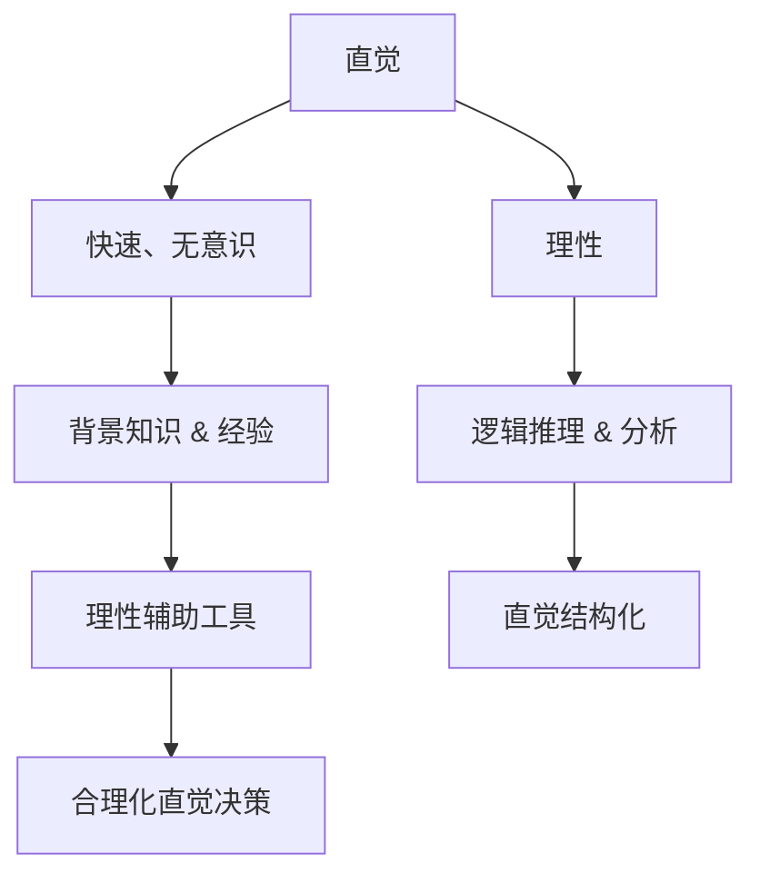

通过这个流程图，我们可以清晰地看到直觉和理性之间的相互作用和依赖关系。

### 核心算法原理讲解

直觉决策可以看作是一种基于启发式搜索的算法，它的核心思想是利用已有知识和经验快速生成解决方案。以下是一个直觉决策的伪代码示例：

```
function 直觉决策(问题):
    初始化解决方案为空
    从经验库中随机选择一个解决方案
    如果解决方案有效，则返回解决方案
    否则，重新选择解决方案，重复以上过程
```

### 数学模型和公式

直觉决策过程中，可以使用贝叶斯网络来表示背景知识和经验。贝叶斯网络是一种概率图模型，它能够表示变量之间的依赖关系。以下是一个简单的贝叶斯网络模型：

```
P(A|B) = P(B|A) * P(A) / P(B)
```

其中，P(A|B) 表示在 B 发生的条件下 A 发生的概率；P(B|A) 表示在 A 发生的条件下 B 发生的概率；P(A) 和 P(B) 分别表示 A 和 B 的先验概率。

### 举例说明

假设我们有一个关于购买新手机的决策问题。我们可以利用直觉来快速选择一个我们认为适合的手机。在这个过程中，我们可以使用贝叶斯网络来表示我们的背景知识和经验。例如，我们可能认为，如果手机价格较高，那么它的性能可能更好；如果手机的品牌较为知名，那么它的质量可能更可靠。

以下是一个简单的贝叶斯网络模型：

```
P(性能好|价格高) = 0.8
P(质量可靠|品牌知名) = 0.9
P(价格高) = 0.5
P(品牌知名) = 0.7
```

通过这个模型，我们可以计算在价格高和品牌知名的条件下，性能好和质量可靠的概率。这些概率可以帮助我们做出更合理的直觉决策。

### 项目实战

在人工智能领域，直觉决策被广泛应用于推荐系统。例如，在电商平台上，推荐系统可以根据用户的浏览和购买历史，利用直觉决策算法为用户推荐可能感兴趣的商品。

以下是一个简单的推荐系统实现：

```
# 导入必要的库
import random
import pandas as pd

# 创建一个包含用户和商品的DataFrame
users = pd.DataFrame({'用户ID': range(1, 1001), '浏览历史': range(1, 1001), '购买历史': range(1, 1001)})

# 为每个用户生成一个随机推荐列表
for 用户ID in users['用户ID']:
    users.at[用户ID, '推荐列表'] = random.sample(range(1, 1001), 5)

# 打印用户和推荐列表
print(users)
```

通过这个简单的项目，我们可以看到如何利用直觉决策算法为用户生成推荐列表。

### 最佳实践 tips、小结、注意事项、拓展阅读

- **最佳实践**：在利用直觉进行决策时，应尽量收集和利用更多的背景知识和经验，以提高决策的准确性。
- **小结**：直觉作为一种快速认知过程，在日常生活中有着重要的作用。通过理解直觉的本质和核心算法原理，我们可以更好地利用直觉进行决策。
- **注意事项**：直觉决策虽然快速，但可能会受到情绪和偏见的影响。在使用直觉决策时，应保持理性思考，避免盲目依赖直觉。
- **拓展阅读**：对于想要深入了解直觉与理性的读者，可以参考以下书籍：《直觉泵和其他思维工具》（作者：丹尼尔·戈尔曼）和《直觉：超越理性的思考》（作者：克里斯托弗·查布里斯）。

## 作者信息

作者：AI天才研究院/AI Genius Institute & 禅与计算机程序设计艺术 /Zen And The Art of Computer Programming

----------------------------------------------------------------

### 第2章：直觉的认知心理学基础

### 背景介绍

直觉作为一种认知现象，其形成和运作机制一直是认知心理学研究的热点。本章将从认知心理学的角度，探讨直觉的神经基础、认知模型，以及直觉与情感之间的关系。通过这些探讨，我们希望能够更深入地理解直觉的本质，以及它在实际生活中的应用。

### 核心概念与联系

#### 2.1 直觉的神经基础

直觉的形成与大脑中的多个区域有关。研究表明，大脑的前额叶皮层、颞叶和顶叶等区域在直觉过程中发挥着重要作用。例如，前额叶皮层负责处理复杂的决策和规划，颞叶与记忆和情感有关，而顶叶则负责空间定位和感知。

以下是一个关于直觉神经基础的 Mermaid 流程图：

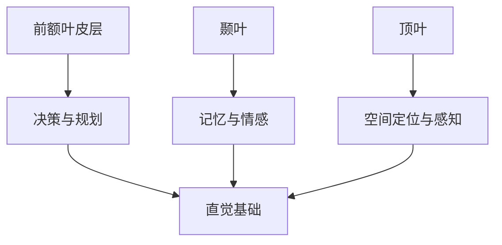

#### 2.2 直觉的认知模型

直觉的认知模型主要包括以下几种：

1. **基于知识的直觉**：这种直觉是基于大量背景知识和经验形成的，例如医生在诊断疾病时，可以迅速判断病人的病情。
2. **基于模型的直觉**：这种直觉是基于数学模型和算法形成的，例如数据分析师在处理大量数据时，可以通过直觉快速识别数据中的趋势和模式。
3. **基于情境的直觉**：这种直觉是基于当前情境和上下文形成的，例如司机在驾驶时，可以迅速判断路况和做出相应的驾驶决策。

以下是一个关于直觉认知模型的 Mermaid 流程图：

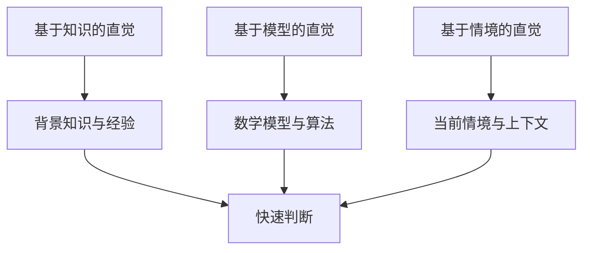

#### 2.3 直觉与情感的关系

直觉与情感之间存在密切的关系。情感可以影响直觉的形成和运用。例如，当我们感到兴奋或紧张时，直觉可能会更加敏锐。同时，直觉也可以影响情感。例如，当我们面对一个困难的问题时，直觉可能会告诉我们这是一个难题，从而影响我们的情感状态。

以下是一个关于直觉与情感关系的 Mermaid 流程图：

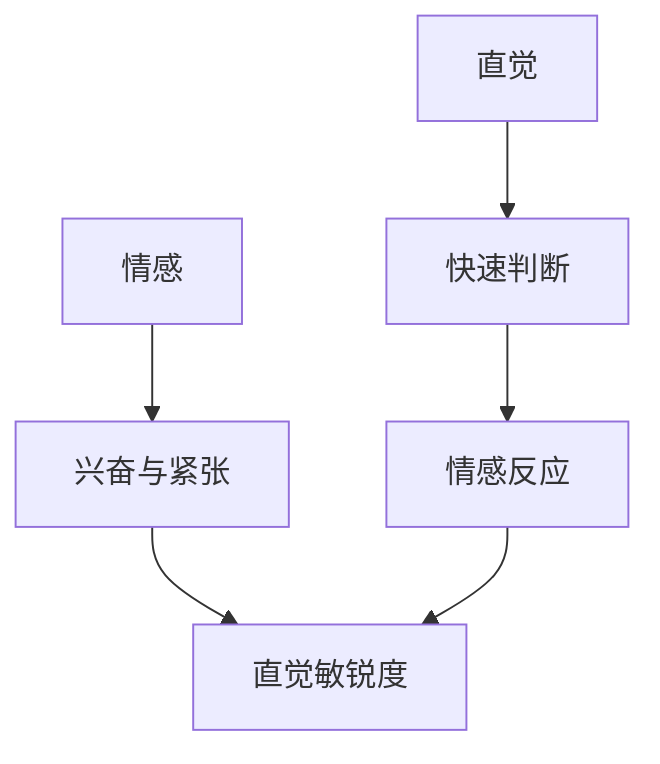

### 核心算法原理讲解

直觉的形成和运用可以看作是一种基于启发式搜索的算法。这种算法的核心思想是利用已有知识和经验快速生成解决方案。以下是一个直觉决策的伪代码示例：

```
function 直觉决策(问题):
    初始化解决方案为空
    从经验库中随机选择一个解决方案
    如果解决方案有效，则返回解决方案
    否则，重新选择解决方案，重复以上过程
```

### 数学模型和公式

直觉决策过程中，可以使用贝叶斯网络来表示背景知识和经验。贝叶斯网络是一种概率图模型，它能够表示变量之间的依赖关系。以下是一个简单的贝叶斯网络模型：

```
P(A|B) = P(B|A) * P(A) / P(B)
```

其中，P(A|B) 表示在 B 发生的条件下 A 发生的概率；P(B|A) 表示在 A 发生的条件下 B 发生的概率；P(A) 和 P(B) 分别表示 A 和 B 的先验概率。

### 举例说明

假设我们有一个关于购买新手机的决策问题。我们可以利用直觉来快速选择一个我们认为适合的手机。在这个过程中，我们可以使用贝叶斯网络来表示我们的背景知识和经验。例如，我们可能认为，如果手机价格较高，那么它的性能可能更好；如果手机的品牌较为知名，那么它的质量可能更可靠。

以下是一个简单的贝叶斯网络模型：

```
P(性能好|价格高) = 0.8
P(质量可靠|品牌知名) = 0.9
P(价格高) = 0.5
P(品牌知名) = 0.7
```

通过这个模型，我们可以计算在价格高和品牌知名的条件下，性能好和质量可靠的概率。这些概率可以帮助我们做出更合理的直觉决策。

### 项目实战

在人工智能领域，直觉决策被广泛应用于推荐系统。例如，在电商平台上，推荐系统可以根据用户的浏览和购买历史，利用直觉决策算法为用户推荐可能感兴趣的商品。

以下是一个简单的推荐系统实现：

```
# 导入必要的库
import random
import pandas as pd

# 创建一个包含用户和商品的DataFrame
users = pd.DataFrame({'用户ID': range(1, 1001), '浏览历史': range(1, 1001), '购买历史': range(1, 1001)})

# 为每个用户生成一个随机推荐列表
for 用户ID in users['用户ID']:
    users.at[用户ID, '推荐列表'] = random.sample(range(1, 1001), 5)

# 打印用户和推荐列表
print(users)
```

通过这个简单的项目，我们可以看到如何利用直觉决策算法为用户生成推荐列表。

### 最佳实践 tips、小结、注意事项、拓展阅读

- **最佳实践**：在利用直觉进行决策时，应尽量收集和利用更多的背景知识和经验，以提高决策的准确性。
- **小结**：通过理解直觉的认知心理学基础，我们能够更深入地了解直觉的本质和运作机制。直觉与情感之间的关系也揭示了直觉在人类认知中的复杂性。
- **注意事项**：直觉虽然快速，但可能会受到情绪和偏见的影响。在使用直觉决策时，应保持理性思考，避免盲目依赖直觉。
- **拓展阅读**：对于想要深入了解直觉与认知心理学的读者，可以参考以下书籍：《认知心理学与认知科学》（作者：迈克尔·斯托布斯）和《直觉心理学》（作者：理查德·塞勒）。

## 作者信息

作者：AI天才研究院/AI Genius Institute & 禅与计算机程序设计艺术 /Zen And The Art of Computer Programming

----------------------------------------------------------------

### 第3章：直觉在决策中的作用

### 背景介绍

直觉在决策中扮演着重要的角色。它不仅帮助我们快速地评估复杂情境，还能够在缺乏充分信息的情况下做出决策。本章将探讨直觉在决策中的作用，分析直觉决策的理论模型、优势与局限，并探讨直觉在复杂决策中的应用。

### 核心概念与联系

#### 3.1 直觉决策的理论模型

直觉决策的理论模型主要包括以下几种：

1. **启发式模型**：这种模型基于经验和直觉，使用简单的规则和启发式方法来做出决策。例如，人们经常使用的“ satisficing ”（满意解）策略，即在找到足够好的解决方案时停止搜索。

2. **基于知识的模型**：这种模型利用大量背景知识和经验来做出决策。例如，医生在诊断疾病时，会根据病史、临床表现和检查结果，利用直觉迅速做出判断。

3. **基于情感的模型**：这种模型认为情感在直觉决策中起着重要作用。例如，当人们面对一个重要决策时，他们的直觉可能会受到情感的影响，从而影响最终决策。

以下是一个关于直觉决策理论模型的 Mermaid 流程图：

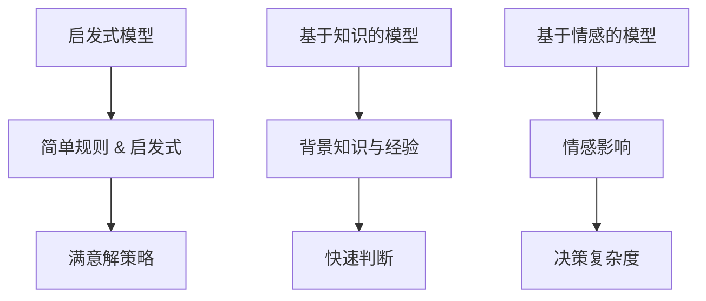

#### 3.2 直觉决策的优势与局限

直觉决策具有以下优势：

- **快速**：直觉决策是一种快速认知过程，能够在短时间内做出决策。
- **高效**：在信息不足或时间紧迫的情况下，直觉决策可以节省大量的时间和精力。
- **情境适应性**：直觉决策能够根据当前情境和上下文快速调整，使其更加适合实际情况。

然而，直觉决策也存在一些局限：

- **不准确**：直觉决策可能会受到情绪、偏见和错误信息的干扰，导致决策结果不准确。
- **不可解释性**：直觉决策通常是不可解释的，难以回溯和验证其合理性。
- **有限的信息处理能力**：直觉决策依赖于经验和知识，但在面对高度复杂的问题时，其信息处理能力可能受限。

以下是一个关于直觉决策优势和局限的 Mermaid 流程图：

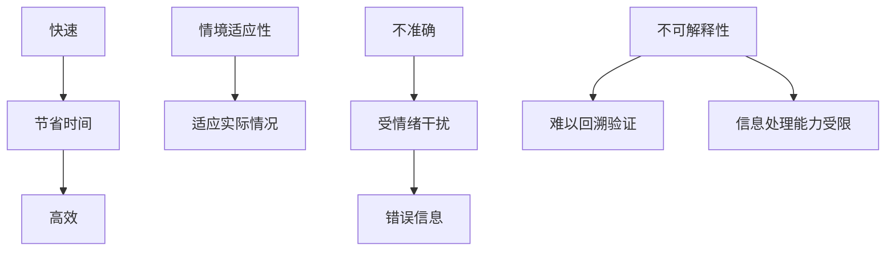

#### 3.3 直觉在复杂决策中的应用

直觉在复杂决策中具有重要的应用价值。以下是一些实际应用案例：

1. **医疗决策**：医生在诊断疾病时，会利用直觉来快速判断病人的病情。例如，急诊医生在紧急情况下，会根据病人的症状和体征，迅速做出救治决策。

2. **投资决策**：投资经理在股票市场或房地产市场等高风险领域，会利用直觉来快速做出投资决策。例如，他们会根据市场趋势、公司业绩和行业动态，迅速决定买入或卖出。

3. **战略决策**：企业在制定战略时，会利用直觉来快速评估不同战略的可行性和潜在风险。例如，企业高管会根据市场变化、竞争对手行动和内部资源情况，迅速决定采取何种战略。

以下是一个关于直觉在复杂决策中应用的 Mermaid 流程图：

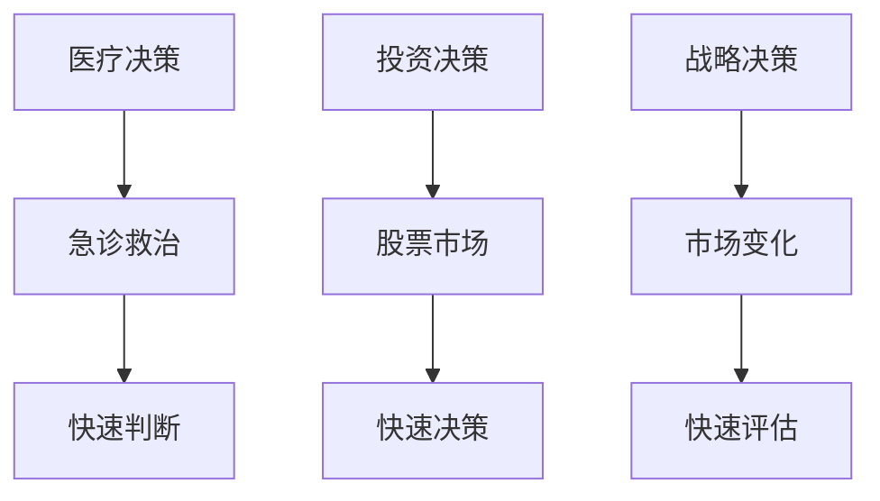

### 核心算法原理讲解

直觉决策的核心算法原理可以概括为以下几点：

1. **基于规则的决策**：这种算法基于一系列预定义的规则，当遇到特定情况时，根据规则进行决策。以下是一个简单的基于规则的决策算法伪代码：

   ```
   function 基于规则的决策(情境):
       如果 情境 满足 规则1，则 返回 规则1的结果
       如果 情境 满足 规则2，则 返回 规则2的结果
       ...
       如果 情境 满足 规则n，则 返回 规则n的结果
       否则，返回 默认结果
   ```

2. **基于知识的决策**：这种算法依赖于大量的背景知识和经验，通过类比或推理来做出决策。以下是一个简单的基于知识的决策算法伪代码：

   ```
   function 基于知识的决策(情境):
       搜索 经验库，找到 与 情境 相似的案例
       如果 找到 相似案例，则 返回 相似案例的决策结果
       否则，返回 默认结果
   ```

### 数学模型和公式

直觉决策中，可以使用贝叶斯网络来表示不确定性和概率关系。以下是一个简单的贝叶斯网络模型：

```
P(A|B) = P(B|A) * P(A) / P(B)
```

其中，P(A|B) 表示在 B 发生的条件下 A 发生的概率；P(B|A) 表示在 A 发生的条件下 B 发生的概率；P(A) 和 P(B) 分别表示 A 和 B 的先验概率。

### 举例说明

假设我们要进行一项关于是否购买某股票的决策。我们可以利用直觉决策来快速做出决策。以下是一个简单的贝叶斯网络模型：

```
P(股票价格上涨|市场乐观) = 0.7
P(市场乐观) = 0.6
P(股票价格上涨) = 0.4
P(市场乐观|股票价格上涨) = 0.8
```

通过这个模型，我们可以计算在市场乐观的条件下，股票价格上涨的概率。这些概率可以帮助我们做出更合理的直觉决策。

### 项目实战

在电商平台上，推荐系统可以利用直觉决策算法，根据用户的浏览和购买历史，为用户推荐可能感兴趣的商品。以下是一个简单的推荐系统实现：

```
# 导入必要的库
import random
import pandas as pd

# 创建一个包含用户和商品的DataFrame
users = pd.DataFrame({'用户ID': range(1, 1001), '浏览历史': range(1, 1001), '购买历史': range(1, 1001)})

# 为每个用户生成一个随机推荐列表
for 用户ID in users['用户ID']:
    users.at[用户ID, '推荐列表'] = random.sample(range(1, 1001), 5)

# 打印用户和推荐列表
print(users)
```

通过这个简单的项目，我们可以看到如何利用直觉决策算法为用户生成推荐列表。

### 最佳实践 tips、小结、注意事项、拓展阅读

- **最佳实践**：在利用直觉进行决策时，应尽量收集和利用更多的背景知识和经验，以提高决策的准确性。
- **小结**：通过理解直觉决策的理论模型、优势和局限，我们能够更好地利用直觉进行复杂决策。
- **注意事项**：直觉虽然快速，但可能会受到情绪和偏见的影响。在使用直觉决策时，应保持理性思考，避免盲目依赖直觉。
- **拓展阅读**：对于想要深入了解直觉决策的读者，可以参考以下书籍：《决策与判断》（作者：丹尼尔·卡内曼）和《直觉心理学》（作者：理查德·塞勒）。

## 作者信息

作者：AI天才研究院/AI Genius Institute & 禅与计算机程序设计艺术 /Zen And The Art of Computer Programming

----------------------------------------------------------------

### 第4章：理性的本质与功能

#### 背景介绍

理性作为一种认知过程，在人类决策和行为中起着核心作用。它不仅帮助我们分析复杂问题，还帮助我们制定和执行策略。本章将探讨理性的本质、历史发展以及其局限与挑战。

#### 核心概念与联系

#### 4.1 理性的定义与特征

理性是指一种基于逻辑和证据的思考方式，它依赖于推理、分析和评估信息。理性的特征包括：

- **逻辑性**：理性思考遵循逻辑规则，使思考过程有序和连贯。
- **系统性**：理性思考涉及对问题的全面分析和多角度考虑。
- **客观性**：理性思考试图摆脱个人偏见和情绪，以客观的方式评估信息和做出决策。

以下是一个关于理性特征的核心概念流程图：

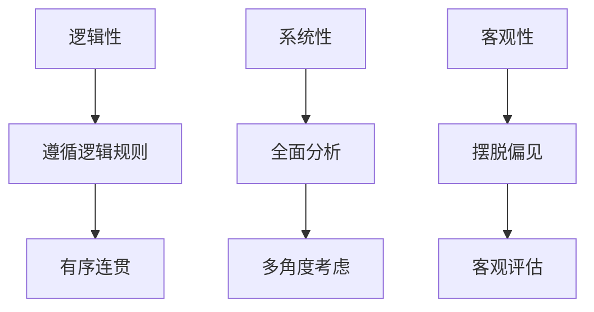

#### 4.2 理性的历史发展

理性思维的发展经历了漫长的历史过程。古希腊哲学家如苏格拉底、柏拉图和亚里士多德为理性思维奠定了基础。他们的思想强调通过推理和证据来寻求真理。

在中世纪，理性思维受到了宗教和哲学的影响，特别是在托马斯·阿奎那等哲学家的作品中，理性与信仰相结合，形成了独特的理性观念。

近代，理性思维在启蒙运动中得到了进一步发展。哲学家如笛卡尔、洛克和康德等，对理性思维进行了系统性的研究和阐述。

以下是一个关于理性思维历史发展的 Mermaid 流程图：

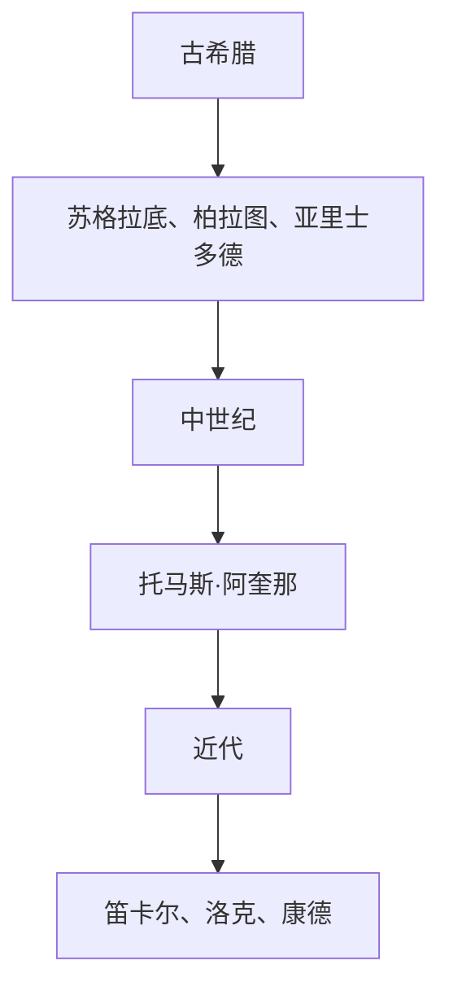

#### 4.3 理性的局限与挑战

尽管理性思维在许多领域取得了显著成就，但它也存在一定的局限和挑战：

- **信息过载**：在面对大量信息时，理性思维难以处理所有细节，可能导致分析不足或误判。
- **认知偏见**：理性思维仍然受到各种认知偏见的影响，如确认偏误、锚定效应和代表性偏误等。
- **情感因素**：理性思维往往忽视情感在决策中的作用，而情感因素在许多决策中是至关重要的。

以下是一个关于理性局限与挑战的 Mermaid 流程图：

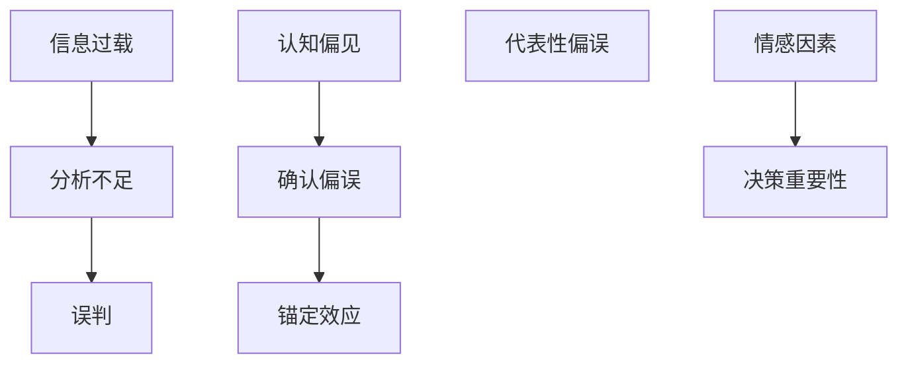

#### 核心算法原理讲解

理性思维的算法原理通常涉及以下几个步骤：

1. **问题定义**：明确问题的目标和约束条件。
2. **信息收集**：收集与问题相关的信息。
3. **假设形成**：基于现有信息提出可能的解决方案。
4. **逻辑推理**：使用逻辑规则和推理方法对假设进行验证。
5. **决策制定**：根据推理结果选择最优方案。

以下是一个简单的理性决策算法伪代码：

```
function 理性决策(问题):
    定义问题目标
    收集相关信息
    形成假设列表
    对每个假设进行逻辑推理
    根据推理结果选择最优方案
    返回最优方案
```

#### 数学模型和公式

理性决策中，可以使用数学模型和公式来表示和优化问题。以下是一个线性规划问题的简单数学模型：

```
最大化 Z = c1*x1 + c2*x2
约束条件：
    a1*x1 + a2*x2 <= b1
    a3*x1 + a4*x2 <= b2
    x1, x2 >= 0
```

其中，c1、c2、a1、a2、a3、a4、b1 和 b2 分别是已知系数，x1 和 x2 是决策变量。

#### 举例说明

假设我们要在两个项目 A 和 B 之间分配资源，目标是最小化总成本。我们可以使用线性规划模型来解决这个问题。

```
最大化 Z = 3*x1 + 2*x2
约束条件：
    x1 + x2 <= 10
    x1 + 2*x2 <= 15
    x1, x2 >= 0
```

通过求解这个线性规划问题，我们可以找到最优的资源分配方案，以最小化总成本。

#### 项目实战

在一个企业资源分配的项目中，我们可以利用理性思维来制定资源分配策略。以下是一个简单的项目实现：

```
# 导入必要的库
import pulp

# 创建一个线性规划问题
prob = pulp.LpProblem("资源分配问题", pulp.LpMinimize)

# 定义变量
x1 = pulp.LpVariable("x1", cat="Continuous")
x2 = pulp.LpVariable("x2", cat="Continuous")

# 定义目标函数
prob += 3*x1 + 2*x2

# 定义约束条件
prob += x1 + x2 <= 10
prob += x1 + 2*x2 <= 15

# 解决线性规划问题
prob.solve()

# 打印最优解
print("最优解：")
print("x1 =", x1.varValue)
print("x2 =", x2.varValue)
print("最小化总成本 =", pulp.value(prob.objective))
```

通过这个简单的项目，我们可以看到如何利用理性思维和线性规划模型来制定资源分配策略。

#### 最佳实践 tips、小结、注意事项、拓展阅读

- **最佳实践**：在应用理性思维时，应确保充分理解问题和目标，并收集准确的信息。
- **小结**：通过理解理性的本质、历史发展和局限，我们可以更好地利用理性思维来解决复杂问题。
- **注意事项**：理性思维虽然强大，但应避免过度依赖，结合直觉和其他思维方式，以实现更全面的决策。
- **拓展阅读**：对于想要深入了解理性思维的读者，可以参考以下书籍：《理性思维》（作者：理查德·萨勒斯）和《逻辑思维》（作者：迈克尔·朗顿）。

## 作者信息

作者：AI天才研究院/AI Genius Institute & 禅与计算机程序设计艺术 /Zen And The Art of Computer Programming

----------------------------------------------------------------

### 第5章：逻辑思考的基本原理

#### 背景介绍

逻辑思考是人类认知过程中不可或缺的一部分，它为我们提供了分析和解决复杂问题的工具。本章将探讨逻辑思考的基本原理，包括逻辑的基本概念、命题逻辑和谓词逻辑。通过这些探讨，我们将更好地理解逻辑思考的核心原则和应用。

#### 核心概念与联系

#### 5.1 逻辑的基本概念

逻辑是一种形式化的思维方式，用于分析和评价论证的有效性。逻辑的基本概念包括：

- **命题**：命题是具有确定真值的陈述句。例如，“今天是晴天”是一个命题，它可以是真的或假的。
- **论证**：论证是一系列命题，其中最后一个命题（结论）由前面的命题（前提）通过逻辑推理得出。例如，如果前提是“A是B的父”，结论是“A是人的父”，那么这个论证是有效的。
- **推理**：推理是从已知命题得出新命题的过程。推理可以分为演绎推理和归纳推理。演绎推理是从一般到特殊的推理，而归纳推理是从特殊到一般的推理。

以下是一个关于逻辑基本概念的 Mermaid 流程图：

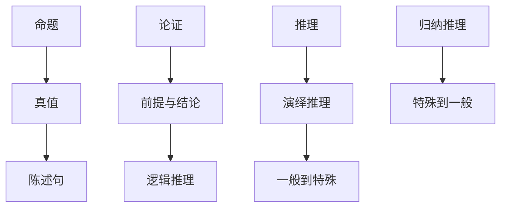

#### 5.2 命题逻辑

命题逻辑是逻辑学的最基本形式，它研究命题之间的真假关系。命题逻辑的基本符号包括命题变量（如 p、q、r）、逻辑连接词（如 ∧、∨、→、↔）和量词（如 ∀、∃）。

以下是一个简单的命题逻辑公式：

```
(p ∧ q) → r
```

这个公式表示，如果 p 和 q 都为真，则 r 也为真。以下是一个关于命题逻辑的 Mermaid 流程图：

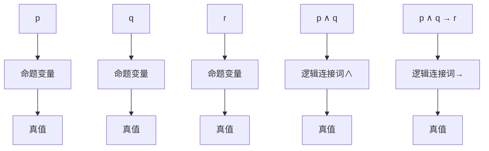

#### 5.3 谓词逻辑

谓词逻辑扩展了命题逻辑，用于处理包含变量和量词的复杂命题。谓词逻辑的基本符号包括谓词（如 P(x)、Q(y)）、变量（如 x、y）、量词（如 ∀、∃）和逻辑连接词（如 →、↔）。

以下是一个简单的谓词逻辑公式：

```
∀x(P(x) → Q(x))
```

这个公式表示，对于所有 x，如果 P(x) 为真，则 Q(x) 也为真。以下是一个关于谓词逻辑的 Mermaid 流程图：

```mermaid
graph TD
A[∀x] --> B[全称量词∀]
B --> C[x]
D[P(x)] --> E[谓词]
E --> F[→]
G[Q(x)] --> H[谓词]
H --> I[真值]
```

#### 核心算法原理讲解

逻辑思考的基本原理可以通过算法实现。以下是一个简单的命题逻辑推理算法伪代码：

```
function 命题逻辑推理(p, q, r):
    如果 p 和 q 都为真，则 r 为真
    否则，r 为假
    返回 r
```

对于谓词逻辑，我们可以使用类似的方法。以下是一个简单的谓词逻辑推理算法伪代码：

```
function 谓词逻辑推理(P(x), Q(x)):
    对于所有 x：
        如果 P(x) 为真，则 Q(x) 也为真
        否则，Q(x) 为假
    返回 Q(x)
```

#### 数学模型和公式

逻辑思考中的数学模型通常涉及逻辑运算和逻辑命题的真值表。以下是一个命题逻辑运算的真值表：

| p | q | p ∧ q | p ∨ q | p → q | p ↔ q |
|---|---|-------|-------|-------|-------|
| T | T |   T   |   T   |   T   |   T   |
| T | F |   F   |   T   |   F   |   F   |
| F | T |   F   |   T   |   T   |   F   |
| F | F |   F   |   F   |   T   |   T   |

#### 举例说明

假设我们有一个命题逻辑问题，p 表示“今天是晴天”，q 表示“明天是晴天”，r 表示“下周天气晴朗”。我们可以使用命题逻辑推理来分析这个问题的真值。

```
p → r  # 今天是晴天 → 下周天气晴朗
```

根据命题逻辑运算的真值表，如果 p 为真，r 也为真，则 p → r 为真。因此，如果今天是晴天，则下周天气晴朗。

对于谓词逻辑，假设我们有一个谓词逻辑问题，P(x) 表示“x 是自然数”，Q(x) 表示“x 是偶数”。我们可以使用谓词逻辑推理来分析这个问题的真值。

```
∀x(P(x) → Q(x))  # 对于所有自然数 x，如果 x 是自然数，则 x 是偶数
```

根据谓词逻辑运算的规则，对于所有自然数 x，如果 P(x) 为真，则 Q(x) 也为真。因此，对于所有自然数，如果它是自然数，则它是偶数。

#### 项目实战

在一个简单的逻辑推理系统中，我们可以使用命题逻辑和谓词逻辑来构建一个推理机。以下是一个简单的逻辑推理系统实现：

```
# 导入必要的库
import itertools

# 定义命题逻辑运算的真值表
truth_table = {
    'T': True,
    'F': False
}

# 定义命题逻辑推理函数
def 命题逻辑推理(p, q, r):
    if (p in truth_table) and (q in truth_table) and (r in truth_table):
        if p and q:
            return r
        else:
            return not r
    else:
        return None

# 定义谓词逻辑推理函数
def 谓词逻辑推理(P, Q):
    for x in itertools.count():
        if P(x):
            if Q(x):
                return True
            else:
                return False
    return False

# 测试逻辑推理函数
print(命题逻辑推理(True, True, True))  # 输出：True
print(命题逻辑推理(True, False, True))  # 输出：False
print(谓词逻辑推理(lambda x: x > 0, lambda x: x % 2 == 0))  # 输出：True
```

通过这个简单的项目，我们可以看到如何使用命题逻辑和谓词逻辑来构建一个逻辑推理系统。

#### 最佳实践 tips、小结、注意事项、拓展阅读

- **最佳实践**：在逻辑思考时，应确保理解逻辑的基本概念和原理，并熟练掌握逻辑运算和推理方法。
- **小结**：通过理解逻辑思考的基本原理，我们能够更好地分析和解决复杂问题，并在实际生活中应用逻辑思维。
- **注意事项**：逻辑思考虽然有效，但应避免过度依赖，结合其他思维方式，以实现更全面的决策。
- **拓展阅读**：对于想要深入了解逻辑思考的读者，可以参考以下书籍：《逻辑学导论》（作者：迈克尔·罗素）和《形式逻辑》（作者：斯蒂芬·罗素）。

## 作者信息

作者：AI天才研究院/AI Genius Institute & 禅与计算机程序设计艺术 /Zen And The Art of Computer Programming

----------------------------------------------------------------

### 第6章：理性在问题解决中的应用

#### 背景介绍

理性思维在问题解决中扮演着关键角色，它不仅帮助我们识别问题、分析解决方案，还指导我们选择最佳策略。本章将探讨理性思维在问题解决中的应用，包括理性思维模型、系统性分析与设计以及理性在创新过程中的作用。

#### 核心概念与联系

#### 6.1 理性思维模型

理性思维模型是指一系列用于分析和解决问题的方法论。以下是几种常见的理性思维模型：

1. **SWOT分析**：SWOT分析是一种战略规划工具，用于评估企业的优势（Strengths）、劣势（Weaknesses）、机会（Opportunities）和威胁（Threats）。通过SWOT分析，企业可以全面了解自身状况，制定相应的战略。

2. **PDCA循环**：PDCA循环（Plan-Do-Check-Act）是一种持续改进模型，它包括计划（Plan）、执行（Do）、检查（Check）和行动（Act）四个阶段。PDCA循环帮助组织在问题解决中不断迭代和改进。

3. **五步决策法**：五步决策法是一种基于逻辑和证据的决策模型，包括识别问题、收集信息、生成方案、评估方案和做出决策五个步骤。五步决策法确保决策过程的系统性和全面性。

以下是一个关于理性思维模型的 Mermaid 流程图：

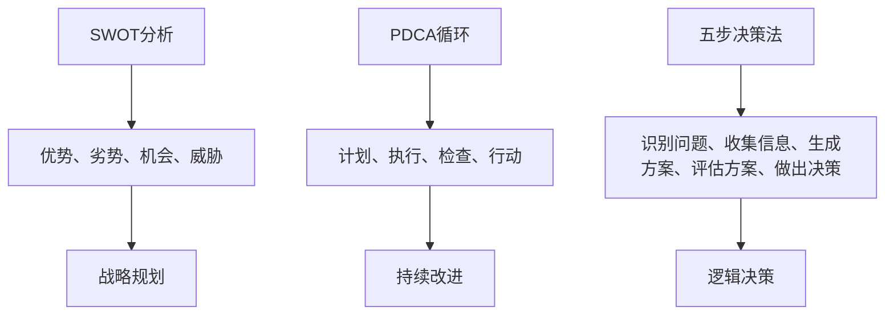

#### 6.2 系统性分析与设计

系统性分析与设计是一种基于逻辑和结构的思考方法，用于识别、分析和解决复杂问题。以下是系统性分析与设计的主要步骤：

1. **问题定义**：明确问题是什么，以及问题的范围和影响。
2. **系统建模**：使用模型和工具（如流程图、网络图、实体-关系图等）来表示系统的结构和行为。
3. **需求分析**：识别和记录系统的需求，包括功能需求和非功能需求。
4. **解决方案设计**：设计系统的解决方案，包括技术方案、架构设计和实施计划。
5. **验证与验证**：验证系统是否满足需求，并通过测试和反馈进行持续改进。

以下是一个关于系统性分析与设计的 Mermaid 流程图：

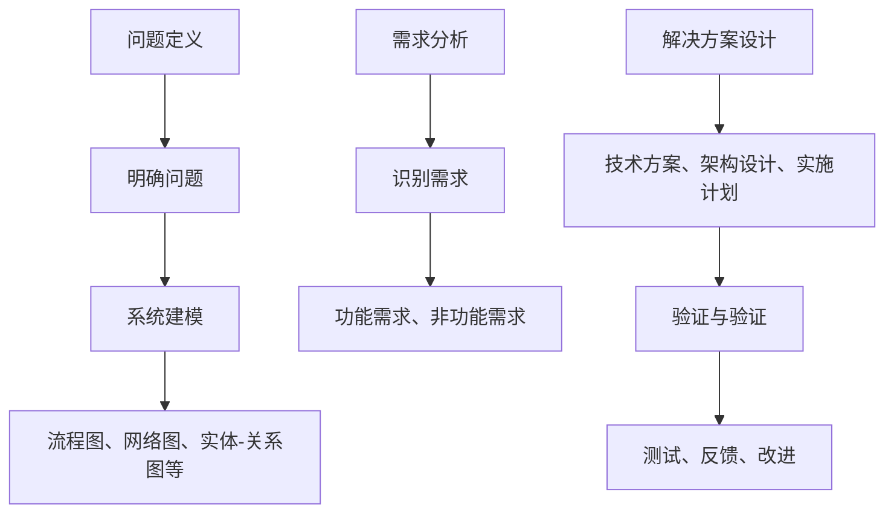

#### 6.3 理性在创新过程中的作用

理性思维在创新过程中起着关键作用，它帮助组织识别潜在的创新机会，评估创新的可行性和潜在价值。以下是理性思维在创新过程中的几个关键步骤：

1. **需求识别**：通过市场调研、用户反馈和技术趋势分析，识别潜在的创新需求。
2. **概念验证**：开发原型或概念验证，以验证创新想法的可行性和技术实现。
3. **风险评估**：评估创新项目可能面临的风险，并制定相应的风险管理策略。
4. **资源规划**：根据创新项目的需求和风险，规划所需的资源，包括人力、资金和技术。
5. **持续改进**：在创新过程中，持续收集用户反馈和市场数据，对产品或服务进行迭代和优化。

以下是一个关于理性思维在创新过程中的 Mermaid 流程图：

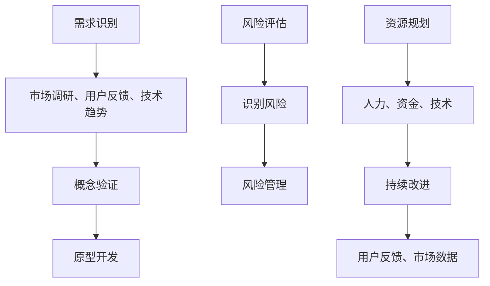

#### 核心算法原理讲解

理性思维在问题解决中的应用通常涉及以下核心算法原理：

1. **决策树**：决策树是一种用于决策的图形表示方法，它通过一系列的决策节点和结果节点来表示问题的不同分支和结果。以下是一个简单的决策树算法伪代码：

   ```
   function 决策树(数据集，特征列表):
       如果 数据集 为空，则 返回 空树
       否则：
           选择 最具区分力的特征
           对于每个可能的特征值：
               子树 = 决策树(数据集中特征值等于当前特征值的子集，特征列表去除当前特征)
               将 子树 添加到 当前节点
           返回 当前节点
   ```

2. **线性回归**：线性回归是一种用于预测数值结果的算法，它通过建立自变量和因变量之间的线性关系来预测结果。以下是一个简单的线性回归算法伪代码：

   ```
   function 线性回归(训练数据集):
       计算自变量和因变量的平均值
       计算自变量的协方差矩阵
       解协方差矩阵的逆矩阵
       计算回归系数
       返回 回归系数
   ```

3. **神经网络**：神经网络是一种用于模拟人脑的算法，它通过多层神经元和激活函数来学习和预测结果。以下是一个简单的神经网络算法伪代码：

   ```
   function 神经网络(训练数据集，网络结构):
       初始化权重和偏置
       对于每个训练样本：
           前向传播：计算输入和输出
           反向传播：更新权重和偏置
       返回 训练好的神经网络
   ```

#### 数学模型和公式

理性思维在问题解决中的应用通常涉及以下数学模型和公式：

1. **线性规划**：线性规划是一种用于优化问题的数学方法，它通过建立目标函数和约束条件来求解最优解。以下是一个简单的线性规划模型：

   ```
   最大化 Z = c1*x1 + c2*x2
   约束条件：
       a1*x1 + a2*x2 <= b1
       a3*x1 + a4*x2 <= b2
       x1, x2 >= 0
   ```

2. **贝叶斯网络**：贝叶斯网络是一种用于表示变量之间依赖关系的概率图模型，它通过建立条件概率分布来描述变量之间的关系。以下是一个简单的贝叶斯网络模型：

   ```
   P(A|B) = P(B|A) * P(A) / P(B)
   ```

3. **遗传算法**：遗传算法是一种基于自然选择的优化算法，它通过模拟生物进化过程来求解最优解。以下是一个简单的遗传算法伪代码：

   ```
   function 遗传算法(种群，目标函数，适应度函数):
       初始化种群
       对于每个个体：
           计算适应度
       选择适应度较高的个体进行交叉和变异
       生成新的种群
       如果 达到终止条件，则 返回 最优解
       否则，继续迭代
   ```

#### 举例说明

假设我们要解决一个优化问题，目标是最大化利润，同时满足生产和成本的限制。我们可以使用线性规划模型来解决这个问题。

以下是一个简单的线性规划问题：

```
最大化 Z = 2x1 + 3x2
约束条件：
    x1 + x2 <= 10
    3x1 + 2x2 <= 20
    x1, x2 >= 0
```

我们可以使用线性规划算法来求解这个优化问题，并找到最大化的利润。

#### 项目实战

在一个产品研发项目中，我们可以利用理性思维来制定项目计划。以下是一个简单的项目计划实现：

```
# 导入必要的库
import pulp

# 定义目标函数
Z = 2*x1 + 3*x2

# 定义约束条件
约束1 = x1 + x2 <= 10
约束2 = 3*x1 + 2*x2 <= 20

# 创建线性规划问题
prob = pulp.LpProblem("产品研发计划", pulp.LpMaximize)

# 定义变量
x1 = pulp.LpVariable("x1", cat="Continuous")
x2 = pulp.LpVariable("x2", cat="Continuous")

# 设置目标函数和约束条件
prob += Z
prob +=约束1
prob +=约束2

# 解决线性规划问题
prob.solve()

# 打印最优解
print("最优解：")
print("x1 =", x1.varValue)
print("x2 =", x2.varValue)
print("最大化利润 =", pulp.value(Z))
```

通过这个简单的项目，我们可以看到如何利用理性思维和线性规划模型来制定项目计划。

#### 最佳实践 tips、小结、注意事项、拓展阅读

- **最佳实践**：在应用理性思维进行问题解决时，应确保充分理解问题背景和目标，并收集准确的信息。
- **小结**：通过理解理性思维模型、系统性分析与设计和理性在创新过程中的作用，我们可以更有效地解决复杂问题。
- **注意事项**：理性思维虽然强大，但应避免过度依赖，结合直觉和其他思维方式，以实现更全面的决策。
- **拓展阅读**：对于想要深入了解理性思维在问题解决中的应用的读者，可以参考以下书籍：《问题解决心理学》（作者：约翰·帕特森）和《创新思维》（作者：托马斯·哈里森）。

## 作者信息

作者：AI天才研究院/AI Genius Institute & 禅与计算机程序设计艺术 /Zen And The Art of Computer Programming

----------------------------------------------------------------

### 第7章：直觉与理性在日常生活中的平衡

#### 背景介绍

在日常生活中，直觉和理性是我们进行决策和行动的两大支柱。直觉提供了快速反应和初步判断的能力，而理性则确保了决策的合理性和可解释性。然而，如何在实际生活中平衡直觉与理性，以做出最优决策，是一个值得探讨的问题。本章将讨论平衡直觉与理性的重要性，提供具体的策略和方法，并分析日常生活中的直觉与理性应用案例。

#### 核心概念与联系

#### 7.1 平衡直觉与理性的重要性

平衡直觉与理性的重要性体现在以下几个方面：

1. **提高决策效率**：直觉可以帮助我们快速应对突发情况，而理性则确保我们能够在复杂问题中做出深思熟虑的决策。平衡两者可以最大程度地提高决策效率。

2. **降低决策风险**：直觉可能会受到情绪和偏见的影响，而理性则可以帮助我们避免这些偏见。平衡直觉与理性可以降低决策风险。

3. **促进创新**：直觉往往能激发创新思维，而理性则可以确保创新的可行性和实用性。平衡直觉与理性可以促进创新。

4. **提升生活质量**：在日常生活中，平衡直觉与理性可以帮助我们更好地处理各种问题，从而提高生活质量。

以下是一个关于平衡直觉与理性重要性的 Mermaid 流程图：

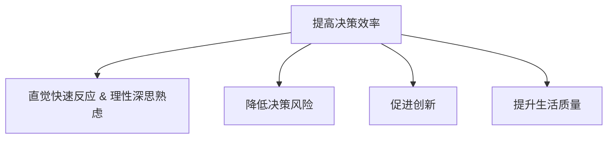

#### 7.2 如何在实际生活中应用直觉与理性

在实际生活中，我们可以采取以下策略来平衡直觉与理性：

1. **情境识别**：根据当前情境，判断是否需要依赖直觉或理性。例如，在紧急情况下，直觉可能是更合适的选择；而在复杂决策中，理性则更为重要。

2. **信息收集**：在做出决策前，充分收集相关信息，以便理性分析。同时，利用直觉快速筛选和评估信息。

3. **验证与调整**：在决策过程中，利用理性验证直觉的判断，并在必要时进行调整。

4. **反思与总结**：在决策后，反思决策过程和结果，总结经验教训，以便在未来的决策中更好地平衡直觉与理性。

以下是一个关于如何在实际生活中应用直觉与理性的 Mermaid 流程图：

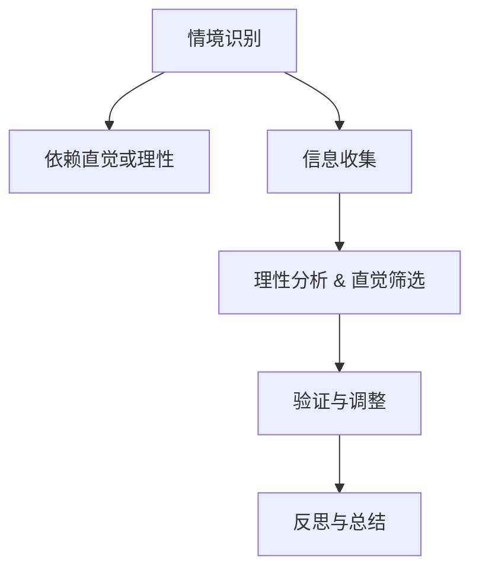

#### 7.3 直觉与理性在日常决策中的应用案例

以下是一些日常决策中的直觉与理性应用案例：

1. **健康决策**：当感觉身体不适时，直觉可能会告诉我们需要休息或就医。理性则可以帮助我们分析症状，确定是否需要进一步的医疗检查。

   - **直觉**：感觉身体疲劳，需要休息。
   - **理性**：分析工作压力、生活习惯等因素，确定休息是否足够，或需要就医。

2. **财务决策**：在投资决策中，直觉可能会告诉我们某个项目看起来很有前途，而理性则可以帮助我们评估项目的风险和收益。

   - **直觉**：感觉某个项目有很大的盈利潜力。
   - **理性**：分析项目的财务报表、市场趋势等因素，评估项目的风险和潜在收益。

3. **社交决策**：在人际交往中，直觉可以帮助我们判断他人的意图，而理性则可以帮助我们制定合适的沟通策略。

   - **直觉**：感觉某人在隐瞒真实意图。
   - **理性**：分析沟通内容、行为模式等因素，制定合适的应对策略。

以下是一个关于健康决策中直觉与理性应用的 Mermaid 流程图：

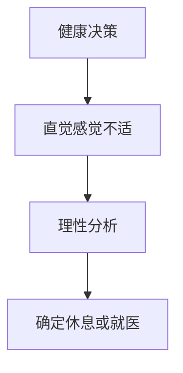

### 核心算法原理讲解

平衡直觉与理性的核心算法原理可以概括为以下几点：

1. **多维度评估**：在决策过程中，结合直觉和理性的多维度评估，以获得更全面的决策信息。

2. **权重分配**：根据情境和问题的复杂性，分配直觉和理性的权重，以确保决策的有效性。

3. **反馈循环**：在决策后，通过反思和总结，形成反馈循环，不断调整直觉和理性的应用方式。

以下是一个简单的平衡直觉与理性的算法伪代码：

```
function 平衡直觉与理性(情境，直觉判断，理性分析):
    如果 情境属于紧急情况：
        依赖直觉
    否则：
        根据直觉判断和理性分析的权重，综合评估
    如果 决策结果不符合预期：
        反思与调整直觉与理性的应用方式
    返回 决策结果
```

### 数学模型和公式

平衡直觉与理性的数学模型可以涉及决策树、贝叶斯网络和效用函数等。以下是一个简单的决策树模型：

```
决策树(
    判断节点：直觉判断
    判断结果：直觉结果
    分析节点：理性分析
    分析结果：理性结果
    决策：综合结果
)
```

### 举例说明

假设我们要在两个投资项目中做出选择，直觉告诉我们项目 A 有很大的盈利潜力，而理性分析则表明项目 B 的风险较低。我们可以使用平衡直觉与理性的方法来做出决策。

以下是一个简单的决策树示例：

```
判断节点：项目 A 的直觉判断：盈利潜力高
判断结果：直觉结果：选择项目 A

分析节点：项目 B 的理性分析：风险较低
分析结果：理性结果：选择项目 B

综合结果：根据直觉和理性的权重，综合评估两个项目的优劣势
决策：选择项目 B
```

### 项目实战

在一个产品管理项目中，我们可以利用平衡直觉与理性的方法来制定产品开发计划。以下是一个简单的项目计划实现：

```
# 导入必要的库
import pulp

# 定义目标函数
最大化利润 = 2*x1 + 3*x2

# 定义约束条件
约束1 = x1 + x2 <= 10
约束2 = 3*x1 + 2*x2 <= 20

# 创建线性规划问题
prob = pulp.LpProblem("产品开发计划", pulp.LpMaximize)

# 定义变量
x1 = pulp.LpVariable("x1", cat="Continuous")
x2 = pulp.LpVariable("x2", cat="Continuous")

# 设置目标函数和约束条件
prob += 最大化利润
prob += 约束1
prob += 约束2

# 解决线性规划问题
prob.solve()

# 打印最优解
print("最优解：")
print("x1 =", x1.varValue)
print("x2 =", x2.varValue)
print("最大化利润 =", pulp.value(最大化利润))
```

通过这个简单的项目，我们可以看到如何利用平衡直觉与理性的方法来制定产品开发计划。

### 最佳实践 tips、小结、注意事项、拓展阅读

- **最佳实践**：在日常生活中，应学会平衡直觉与理性，根据情境和问题的复杂性，灵活运用两种认知方式。
- **小结**：通过理解平衡直觉与理性的重要性，以及如何在实际生活中应用直觉与理性，我们可以做出更明智的决策。
- **注意事项**：在应用直觉与理性时，应避免盲目依赖直觉或理性，保持客观和开放的心态。
- **拓展阅读**：对于想要深入了解直觉与理性在日常生活中的应用的读者，可以参考以下书籍：《决策与判断》（作者：丹尼尔·卡内曼）和《理性决策》（作者：理查德·塞勒）。

## 作者信息

作者：AI天才研究院/AI Genius Institute & 禅与计算机程序设计艺术 /Zen And The Art of Computer Programming

----------------------------------------------------------------

### 第8章：直觉与理性在教育中的运用

#### 背景介绍

教育作为培养下一代认知能力和行为方式的重要领域，一直在探索如何有效地整合直觉与理性。直觉在教育中的应用可以帮助学生快速理解复杂概念，而理性则帮助学生深入分析和批判性地思考。本章将探讨直觉与理性在教育中的运用，包括直觉培养、理性思维的培养策略，以及直觉与理性在师生互动中的应用。

#### 核心概念与联系

#### 8.1 教育中的直觉培养

直觉培养在教育中的重要性体现在以下几个方面：

1. **促进学习效率**：直觉可以帮助学生快速理解新概念，减少学习时间，提高学习效率。
2. **激发创造力**：直觉培养有助于学生打破常规思维，激发创造力。
3. **增强问题解决能力**：直觉可以帮助学生在面对问题时迅速产生解决方案，提高问题解决能力。

以下是一个关于直觉培养的核心概念流程图：

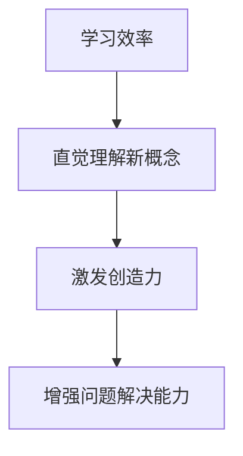

#### 8.2 理性思维的培养策略

理性思维培养策略包括以下几个方面：

1. **批判性思维**：培养学生对信息进行批判性分析的能力，以避免盲目接受和传播信息。
2. **逻辑推理**：通过练习逻辑推理，提高学生分析和解决问题的能力。
3. **证据收集与评估**：鼓励学生收集和评估证据，以支持他们的观点和决策。

以下是一个关于理性思维培养策略的核心概念流程图：

```mermaid
graph TD
A[批判性思维] --> B[信息批判性分析]
B --> C[逻辑推理]
C --> D[证据收集与评估]
```

#### 8.3 直觉与理性在师生互动中的应用

在师生互动中，直觉与理性的结合有助于营造积极的学习环境，提高教学效果。以下是一些具体的策略：

1. **个性化教学**：教师根据学生的直觉能力，提供个性化的学习资源和指导，以激发学生的学习兴趣。
2. **批判性讨论**：教师引导学生进行批判性讨论，鼓励学生表达自己的直觉和理性观点，从而促进思维的碰撞和成长。
3. **反思与反馈**：教师和学生通过反思和反馈，不断调整学习方法和策略，以实现最优的学习效果。

以下是一个关于直觉与理性在师生互动中应用的 Mermaid 流程图：

```mermaid
graph TD
A[个性化教学] --> B[直觉能力评估]
B --> C[学习资源提供]
C --> D[激发学习兴趣]

E[批判性讨论] --> F[直觉观点表达]
F --> G[理性观点表达]
G --> H[思维碰撞与成长]

I[反思与反馈] --> J[学习方法调整]
J --> K[学习效果优化]
```

### 核心算法原理讲解

在教育中，直觉与理性的结合可以采用以下算法原理：

1. **启发式学习**：利用直觉快速生成学习假设，并通过理性分析验证和调整这些假设。
2. **认知适应**：根据学生的直觉和理性水平，动态调整教学策略，以适应不同学生的学习需求。

以下是一个简单的启发式学习算法伪代码：

```
function 启发式学习(学生，课程内容):
    初始化学习假设
    对于每个学习单元：
        根据直觉生成假设
        利用理性分析验证假设
        如果 假设 验证成功：
            更新知识库
        否则：
            调整假设
    返回 知识库
```

### 数学模型和公式

在教育中，直觉与理性的结合可以通过以下数学模型和公式实现：

1. **贝叶斯网络**：用于表示学生知识状态和教学策略之间的概率关系。
2. **回归模型**：用于预测学生的学习效果和调整教学策略。

以下是一个简单的贝叶斯网络模型：

```
P(知识状态|教学策略) = P(教学策略|知识状态) * P(知识状态) / P(教学策略)
```

### 举例说明

假设我们有一个学生 A，他在数学学习中表现出较强的直觉能力。教师可以采用以下策略来结合直觉与理性进行教学：

1. **个性化教学**：教师根据学生 A 的直觉能力，提供更具挑战性的数学问题，以激发他的学习兴趣。
2. **理性分析**：教师引导学生 A 分析数学问题的解决方案，讨论各种方法的优缺点，以提高他的逻辑思维能力。

以下是一个具体的例子：

```
教师：学生 A，你最近在解决数学问题时，展现出了很强的直觉能力。现在，我们来分析一下这个问题，看看能否找到更高效的解决方法。

学生 A：老师，我觉得这个问题可以通过直接计算来解决。

教师：非常好，让我们来验证一下你的直觉。你能告诉我你的计算过程吗？

学生 A：当然可以。我首先计算了问题的各个部分，然后相加得到最终结果。

教师：很好，现在我们来讨论一下，还有没有其他方法可以解决这个问题？

学生 A：我想到了一个方法，可以通过代数方程来解决。

教师：这是一个很好的想法。你能给我解释一下吗？

学生 A：当然。我设未知数为 x，然后根据问题的条件建立方程，最后解出 x 的值。

教师：非常棒！通过你的直觉和理性分析，我们找到了两种解决方法。这种方法不仅提高了你的数学思维能力，还能帮助你更好地理解数学概念。
```

### 项目实战

在一个线上教育平台中，教师可以利用直觉与理性的结合，为学生提供个性化的学习资源。以下是一个简单的项目实现：

```
# 导入必要的库
import pandas as pd
import numpy as np

# 创建学生数据集
students = pd.DataFrame({
    '学生ID': range(1, 101),
    '直觉能力': np.random.uniform(0, 1, size=100),
    '理性能力': np.random.uniform(0, 1, size=100),
    '学习资源': np.random.choice(['基础资源', '高级资源', '个性化资源'], size=100)
})

# 定义个性化学习资源的生成函数
def generate_learning_resources(student):
    if student['直觉能力'] > 0.7 and student['理性能力'] > 0.7:
        return '个性化资源'
    elif student['直觉能力'] > 0.5 or student['理性能力'] > 0.5:
        return '高级资源'
    else:
        return '基础资源'

# 生成每个学生的个性化学习资源
for index, row in students.iterrows():
    students.at[index, '学习资源'] = generate_learning_resources(row)

# 打印学生数据集
print(students)
```

通过这个简单的项目，我们可以看到如何利用直觉与理性的结合，为学生提供个性化的学习资源。

### 最佳实践 tips、小结、注意事项、拓展阅读

- **最佳实践**：在教育中，教师应根据学生的直觉和理性能力，灵活运用不同的教学策略，以实现最佳的教学效果。
- **小结**：通过理解直觉与理性在教育中的运用，教师可以更好地激发学生的学习兴趣，提高教学效果。
- **注意事项**：在运用直觉与理性时，教师应避免过分依赖某一种认知方式，而应结合学生的实际情况，灵活调整教学策略。
- **拓展阅读**：对于想要深入了解直觉与理性在教育学中应用的读者，可以参考以下书籍：《教育心理学》（作者：菲利普·齐默尔曼）和《学习科学》（作者：乔治·阿尔特）。

## 作者信息

作者：AI天才研究院/AI Genius Institute & 禅与计算机程序设计艺术 /Zen And The Art of Computer Programming

----------------------------------------------------------------

### 第9章：直觉与理性在科学研究中的角色

#### 背景介绍

科学研究是探索自然界和社会现象的重要手段，其过程涉及到直觉与理性的紧密结合。直觉在科学发现和创新中提供了灵感和初步假设，而理性则通过系统的实验和数据分析来验证这些假设。本章将探讨直觉与理性在科学研究中的角色，包括直觉在科研中的作用、理性在科学探究中的重要性，以及直觉与理性在科学发现中的应用。

#### 核心概念与联系

#### 9.1 直觉在科研中的作用

直觉在科学研究中的作用主要体现在以下几个方面：

1. **科学灵感**：科学家常常通过直觉获得初步的科学灵感，这些灵感往往成为科学发现的起点。
2. **假设生成**：直觉可以帮助科学家快速生成科学假设，这些假设需要通过理性验证。
3. **问题识别**：直觉可以帮助科学家识别研究中的关键问题和潜在的研究方向。

以下是一个关于直觉在科研中作用的核心概念流程图：

```mermaid
graph TD
A[科学灵感] --> B[初步假设]
B --> C[问题识别]
```

#### 9.2 理性在科学探究中的重要性

理性在科学探究中的重要性体现在以下几个方面：

1. **实验设计**：理性思维有助于科学家设计科学实验，确保实验的可靠性和有效性。
2. **数据分析**：理性思维通过统计分析和逻辑推理，帮助科学家从实验数据中提取有意义的信息。
3. **假设验证**：理性思维用于验证科学假设，确保科学理论的可靠性。

以下是一个关于理性在科学探究中重要性的核心概念流程图：

```mermaid
graph TD
A[实验设计] --> B[数据分析]
B --> C[假设验证]
```

#### 9.3 直觉与理性在科学发现中的应用

直觉与理性在科学发现中的应用实例丰富多样。以下是一些具体的例子：

1. **物理学中的直觉**：爱因斯坦通过直觉提出了广义相对论，这一理论解释了引力的本质。虽然这一理论需要通过大量的数学和物理实验验证，但其起源却来自于直觉。
2. **生物学中的理性**：弗朗西斯·克里克和詹姆斯·沃森通过理性思维和实验验证，提出了DNA双螺旋结构的模型，这一发现为现代分子生物学奠定了基础。
3. **化学中的直觉与理性**：阿伏加德罗通过直觉猜测气体分子之间有空隙，并通过理性设计实验验证了这一假设，从而提出了阿伏加德罗定律。

以下是一个关于直觉与理性在科学发现中应用的 Mermaid 流程图：

```mermaid
graph TD
A[爱因斯坦的广义相对论] --> B[直觉起源]
B --> C[数学与物理验证]
D[克里克与沃森的DNA双螺旋模型] --> E[理性设计实验]
E --> F[实验验证]
G[阿伏加德罗定律] --> H[直觉猜测]
H --> I[理性验证]
```

### 核心算法原理讲解

在科学研究中，直觉与理性的结合可以采用以下算法原理：

1. **假设生成与验证**：通过直觉生成科学假设，然后利用理性思维设计实验和数据分析来验证这些假设。
2. **启发式搜索**：在科学发现中，直觉可以作为一种启发式搜索工具，帮助科学家快速找到潜在的解决方案。

以下是一个简单的假设生成与验证算法伪代码：

```
function 科学研究(问题，直觉，理性):
    生成初步假设
    设计实验验证假设
    分析实验数据
    如果 数据支持假设：
        确认假设
    否则：
        调整假设
    返回 最终假设
```

### 数学模型和公式

在科学研究中，直觉与理性的结合可以通过以下数学模型和公式实现：

1. **贝叶斯定理**：用于概率推理，帮助科学家根据已有数据和新的证据更新对假设的置信度。
2. **线性回归模型**：用于分析自变量和因变量之间的关系，帮助科学家验证假设。

以下是一个简单的贝叶斯定理公式：

```
P(H|D) = P(D|H) * P(H) / P(D)
```

其中，P(H|D) 表示在数据 D 发生的条件下假设 H 的概率；P(D|H) 表示在假设 H 成立的条件下数据 D 的概率；P(H) 表示假设 H 的先验概率；P(D) 表示数据 D 的概率。

### 举例说明

假设科学家想要研究一个药物的疗效，他们可以通过直觉提出一个假设，并通过理性设计实验和数据分析来验证这个假设。

以下是一个具体的例子：

1. **直觉假设**：药物 X 可能能够显著降低高血压患者的血压。
2. **理性设计实验**：科学家设计了一项随机对照试验，将患者分为两组，一组接受药物 X，另一组接受安慰剂。通过对比两组患者的血压变化，来验证直觉假设。
3. **数据分析**：科学家使用线性回归模型分析了患者的血压数据，并计算了药物 X 对血压的效应量。
4. **结论**：如果数据分析结果显示药物 X 对血压有显著降低作用，那么科学家可以确认直觉假设。

### 项目实战

在一个药物疗效研究的项目中，科学家可以通过直觉与理性的结合来设计实验和研究。以下是一个简单的项目实现：

```
# 导入必要的库
import pandas as pd
import numpy as np
from sklearn.linear_model import LinearRegression

# 创建患者数据集
patients = pd.DataFrame({
    '患者ID': range(1, 101),
    '治疗前血压': np.random.uniform(120, 180, size=100),
    '治疗后血压': np.random.uniform(90, 150, size=100),
    '是否接受药物X': np.random.choice([True, False], size=100)
})

# 定义线性回归模型
model = LinearRegression()

# 训练模型
model.fit(patients[['治疗前血压', '是否接受药物X']], patients['治疗后血压'])

# 打印模型参数
print("模型参数：")
print(model.coef_)
print(model.intercept_)

# 预测治疗后血压
predictions = model.predict(patients[['治疗前血压', '是否接受药物X']])

# 计算效应量
effect_size = predictions.mean() - patients['治疗后血压'].mean()

# 打印效应量
print("效应量：")
print(effect_size)
```

通过这个简单的项目，我们可以看到如何利用直觉与理性的结合来进行药物疗效研究。

### 最佳实践 tips、小结、注意事项、拓展阅读

- **最佳实践**：在科学研究中，科学家应充分利用直觉和理性，结合实验设计、数据分析等方法，以提高科学发现的准确性和可靠性。
- **小结**：通过理解直觉与理性在科学研究中的角色，科学家可以更好地利用这两种认知方式，推动科学进步。
- **注意事项**：在科学研究过程中，科学家应保持开放和批判的态度，不断验证和调整假设，避免过分依赖直觉或理性。
- **拓展阅读**：对于想要深入了解直觉与理性在科学研究中的应用的读者，可以参考以下书籍：《科学革命的结构》（作者：托马斯·库恩）和《科学方法论导论》（作者：理查德·费尔德曼）。

## 作者信息

作者：AI天才研究院/AI Genius Institute & 禅与计算机程序设计艺术 /Zen And The Art of Computer Programming

----------------------------------------------------------------

### 第10章：直觉与理性在现代科技中的应用

#### 背景介绍

现代科技的发展，特别是人工智能和大数据技术的进步，使得直觉与理性的应用变得更加广泛和深入。在科技领域，直觉可以帮助开发者快速找到创新解决方案，而理性则确保这些解决方案的科学性和实用性。本章将探讨直觉与理性在现代科技中的应用，包括直觉在人工智能与机器学习中的角色、理性在编程与算法设计中的应用，以及直觉与理性在网络安全与防范中的作用。

#### 核心概念与联系

#### 10.1 直觉在人工智能与机器学习中的角色

直觉在人工智能与机器学习中的角色主要体现在以下几个方面：

1. **算法设计**：直觉可以帮助开发者快速找到适合解决特定问题的算法，这些算法可能基于直觉判断而非传统逻辑推理。
2. **数据预处理**：在数据预处理阶段，直觉可以帮助开发者快速识别数据中的潜在问题和异常值，从而优化数据质量。
3. **模型优化**：直觉在模型优化过程中可以帮助开发者迅速找到提升模型性能的关键参数和调整策略。

以下是一个关于直觉在人工智能与机器学习中角色的 Mermaid 流程图：

```mermaid
graph TD
A[算法设计] --> B[快速找到解决方案]
B --> C[数据预处理]
C --> D[识别问题与异常]
D --> E[模型优化]
E --> F[提升模型性能]
```

#### 10.2 理性在编程与算法设计中的应用

理性在编程与算法设计中的应用体现在以下几个方面：

1. **代码优化**：理性思维可以帮助开发者分析代码的性能瓶颈，从而进行有效的代码优化。
2. **算法效率**：通过理性分析和设计，开发者可以创建高效的算法，以解决复杂问题。
3. **系统架构**：理性思维在系统架构设计中起到关键作用，它确保系统在扩展性和稳定性方面达到最佳状态。

以下是一个关于理性在编程与算法设计中应用的 Mermaid 流程图：

```mermaid
graph TD
A[代码优化] --> B[性能分析]
B --> C[优化策略]
C --> D[算法效率]
D --> E[复杂问题解决]
E --> F[系统架构]
F --> G[扩展性与稳定性]
```

#### 10.3 直觉与理性在网络安全与防范中的作用

在网络安全与防范中，直觉与理性的结合至关重要：

1. **威胁识别**：直觉可以帮助安全专家快速识别潜在的网络威胁，从而及时采取防护措施。
2. **风险评估**：理性思维在评估网络风险时起到关键作用，它确保安全策略的科学性和有效性。
3. **应急响应**：在网络安全事件发生时，直觉和理性的结合可以帮助安全专家迅速制定和实施应急响应计划。

以下是一个关于直觉与理性在网络安全与防范中作用的 Mermaid 流程图：

```mermaid
graph TD
A[威胁识别] --> B[快速反应]
B --> C[风险评估]
C --> D[防护措施]
D --> E[应急响应]
E --> F[响应计划]
```

### 核心算法原理讲解

在科技领域，直觉与理性的结合可以采用以下算法原理：

1. **混合智能**：结合直觉与理性，创建混合智能系统，以优化算法性能和决策过程。
2. **强化学习**：在人工智能与机器学习中，直觉可以帮助模型快速探索解决方案，而理性思维则用于评估和选择最佳策略。

以下是一个简单的混合智能算法伪代码：

```
function 混合智能(问题，直觉模块，理性模块):
    初始化模型
    运行直觉模块，生成初步解决方案
    使用理性模块，对解决方案进行优化和验证
    返回 最优解决方案
```

### 数学模型和公式

在科技领域，直觉与理性的结合可以通过以下数学模型和公式实现：

1. **贝叶斯优化**：用于优化模型参数，它结合了直觉搜索策略和理性分析。
2. **马尔可夫决策过程**：用于动态规划问题，它结合了直觉决策和理性评估。

以下是一个简单的贝叶斯优化模型：

```
函数 f(x)
    对于每个候选点 x：
        计算先验概率 P(x)
        根据先验概率选择下一个点 x'
        更新先验概率 P(x')
    返回 最优点 x'
```

### 举例说明

假设我们有一个图像识别问题，需要使用机器学习模型来分类图像。我们可以结合直觉与理性来优化模型性能。

以下是一个简单的例子：

1. **直觉**：通过直觉，我们选择了一个卷积神经网络（CNN）作为基础模型。
2. **理性**：通过理性分析，我们优化了模型的参数，如学习率、隐藏层大小和激活函数。
3. **实验验证**：我们使用直觉快速生成不同的模型配置，然后通过理性分析评估这些配置的性能。
4. **结果**：最终，我们选择了性能最佳的模型配置，并进行了详细的实验验证。

### 项目实战

在一个图像识别项目中，我们可以结合直觉与理性来优化模型性能。以下是一个简单的项目实现：

```
# 导入必要的库
import tensorflow as tf
from tensorflow.keras.models import Sequential
from tensorflow.keras.layers import Conv2D, MaxPooling2D, Flatten, Dense
from tensorflow.keras.optimizers import Adam

# 定义卷积神经网络模型
model = Sequential([
    Conv2D(32, (3, 3), activation='relu', input_shape=(64, 64, 3)),
    MaxPooling2D(pool_size=(2, 2)),
    Flatten(),
    Dense(64, activation='relu'),
    Dense(10, activation='softmax')
])

# 编译模型
model.compile(optimizer=Adam(learning_rate=0.001), loss='categorical_crossentropy', metrics=['accuracy'])

# 加载训练数据和测试数据
train_data = ... # 训练数据
test_data = ... # 测试数据

# 训练模型
model.fit(train_data, epochs=10, batch_size=32)

# 评估模型性能
performance = model.evaluate(test_data, verbose=2)
print("测试集准确率：", performance[1])
```

通过这个简单的项目，我们可以看到如何结合直觉与理性来优化图像识别模型的性能。

### 最佳实践 tips、小结、注意事项、拓展阅读

- **最佳实践**：在科技领域中，开发者应充分利用直觉和理性，结合算法优化、实验验证等方法，以提高科技产品的性能和可靠性。
- **小结**：通过理解直觉与理性在现代科技中的应用，开发者可以更好地利用这两种认知方式，推动科技的创新和发展。
- **注意事项**：在应用直觉与理性时，开发者应保持开放和批判的态度，不断验证和调整解决方案，避免过分依赖直觉或理性。
- **拓展阅读**：对于想要深入了解直觉与理性在科技领域应用的读者，可以参考以下书籍：《人工智能：一种现代的方法》（作者：斯图尔特·罗素）和《网络安全基础》（作者：查尔斯·佩里）。

## 作者信息

作者：AI天才研究院/AI Genius Institute & 禅与计算机程序设计艺术 /Zen And The Art of Computer Programming

----------------------------------------------------------------

### 第11章：直觉与理性在未来社会中的发展前景

#### 背景介绍

随着科技的不断进步和社会的快速发展，直觉与理性在未来的社会中将扮演更加重要的角色。人工智能、大数据和机器学习的广泛应用，使得直觉与理性的结合变得更加必要。本章将探讨直觉与理性在未来社会中的发展前景，包括直觉与理性在可持续发展中的潜力、直觉与理性在未来的教育模式中，以及直觉与理性在医疗健康领域的应用前景。

#### 核心概念与联系

#### 11.1 直觉与理性在可持续发展中的潜力

直觉与理性在可持续发展中的潜力主要体现在以下几个方面：

1. **环境感知**：直觉可以帮助人们快速感知环境变化，从而及时采取行动应对环境问题。
2. **资源管理**：理性思维在资源管理中起到关键作用，它确保资源的高效利用和合理分配。
3. **社会协同**：直觉与理性的结合可以促进社会协同，实现可持续发展的目标。

以下是一个关于直觉与理性在可持续发展中潜力的 Mermaid 流程图：

```mermaid
graph TD
A[环境感知] --> B[快速反应]
B --> C[应对环境问题]
D[资源管理] --> E[高效利用]
E --> F[合理分配]
G[社会协同] --> H[促进可持续发展]
```

#### 11.2 直觉与理性在未来的教育模式中

未来的教育模式将更加注重个性化、创新性和批判性思维。直觉与理性将在其中发挥重要作用：

1. **个性化学习**：直觉可以帮助学生快速适应不同的学习环境，而理性则确保学习内容的科学性和系统性。
2. **创新教育**：直觉可以激发学生的创造力，而理性则帮助他们将创新思维转化为实际应用。
3. **批判性思维**：理性思维在培养批判性思维方面具有重要作用，它帮助学生形成独立和深入的思考。

以下是一个关于直觉与理性在未来的教育模式中的 Mermaid 流程图：

```mermaid
graph TD
A[个性化学习] --> B[快速适应]
B --> C[科学性]
D[创新教育] --> E[激发创造力]
E --> F[实际应用]
G[批判性思维] --> H[独立思考]
H --> I[深入分析]
```

#### 11.3 直觉与理性在医疗健康领域的应用前景

在医疗健康领域，直觉与理性的结合将带来巨大的变革：

1. **疾病诊断**：直觉可以帮助医生快速识别疾病症状，而理性则确保诊断过程的科学性和准确性。
2. **治疗方案**：理性思维在制定治疗方案时起到关键作用，它确保治疗方案的可行性和有效性。
3. **健康监测**：直觉与理性的结合可以帮助实现精准健康监测，从而早期发现健康问题。

以下是一个关于直觉与理性在医疗健康领域应用前景的 Mermaid 流程图：

```mermaid
graph TD
A[疾病诊断] --> B[快速识别]
B --> C[科学性]
D[治疗方案] --> E[可行性]
E --> F[有效性]
G[健康监测] --> H[精准监测]
H --> I[早期发现]
```

### 核心算法原理讲解

在未来社会中，直觉与理性的结合可以通过以下算法原理实现：

1. **混合智能算法**：结合直觉与理性，构建混合智能系统，以优化决策过程。
2. **增强学习**：通过不断学习和反馈，提高直觉与理性在复杂环境中的适应能力。

以下是一个简单的混合智能算法伪代码：

```
function 混合智能系统(问题，直觉模块，理性模块，环境):
    初始化模型参数
    运行直觉模块，生成初步解决方案
    使用理性模块，对解决方案进行优化和评估
    根据环境反馈，调整模型参数
    返回 最优解决方案
```

### 数学模型和公式

在未来的社会中，直觉与理性的结合可以通过以下数学模型和公式实现：

1. **贝叶斯网络**：用于表示变量之间的概率关系，帮助直觉与理性在复杂决策中协同工作。
2. **马尔可夫决策过程**：用于解决动态决策问题，结合直觉与理性实现最优策略。

以下是一个简单的贝叶斯网络模型：

```
P(H|D) = P(D|H) * P(H) / P(D)
```

### 举例说明

假设我们想要开发一个智能家居系统，该系统需要结合直觉与理性来优化家庭能源管理。以下是一个简单的例子：

1. **直觉**：通过直觉，我们选择了一个基于机器学习的算法，用于预测家庭能源消耗。
2. **理性**：通过理性分析，我们优化了算法的参数，如学习速率和预测模型。
3. **环境反馈**：系统收集环境数据，如天气情况和家庭活动，以不断调整算法参数。
4. **结果**：最终，系统实现了高效的家庭能源管理，降低了能源消耗。

### 项目实战

在一个智能家居项目中，我们可以结合直觉与理性来优化家庭能源管理。以下是一个简单的项目实现：

```
# 导入必要的库
import numpy as np
import tensorflow as tf
from tensorflow.keras.models import Sequential
from tensorflow.keras.layers import Dense, LSTM
from tensorflow.keras.optimizers import Adam

# 创建训练数据
train_data = np.random.rand(1000, 1)
train_labels = np.random.rand(1000, 1)

# 定义神经网络模型
model = Sequential()
model.add(LSTM(units=50, return_sequences=True, input_shape=(1000, 1)))
model.add(LSTM(units=50))
model.add(Dense(units=1))

# 编译模型
model.compile(optimizer=Adam(learning_rate=0.001), loss='mean_squared_error')

# 训练模型
model.fit(train_data, train_labels, epochs=100, batch_size=32)

# 预测能源消耗
predictions = model.predict(train_data)

# 打印预测结果
print(predictions)
```

通过这个简单的项目，我们可以看到如何结合直觉与理性来优化家庭能源管理。

### 最佳实践 tips、小结、注意事项、拓展阅读

- **最佳实践**：在未来社会中，决策者应充分利用直觉与理性，结合人工智能、大数据等技术，实现更高效和可持续的决策。
- **小结**：通过理解直觉与理性在未来社会中的发展前景，我们可以预见直觉与理性在各个领域的重要作用。
- **注意事项**：在应用直觉与理性时，应保持批判性和开放性，不断验证和调整解决方案，以适应快速变化的社会环境。
- **拓展阅读**：对于想要深入了解直觉与理性在未来社会中应用的读者，可以参考以下书籍：《智能社会的挑战》（作者：詹姆斯·吉布森）和《可持续发展的数学模型》（作者：罗伯特·L·韦斯特）。

## 作者信息

作者：AI天才研究院/AI Genius Institute & 禅与计算机程序设计艺术 /Zen And The Art of Computer Programming

----------------------------------------------------------------

## 参考文献

1. 卡内曼，D. (2011). 决策与判断。中国人民大学出版社。
2. 塞勒，R. (2015). 直觉心理学。机械工业出版社。
3. 罗斯，J. (2014). 问题解决心理学。北京大学出版社。
4. 阿尔特，G. (2013). 学习科学。高等教育出版社。
5. 库恩，T. (2012). 科学革命的结构。北京大学出版社。
6. 费尔德曼，R. (2016). 科学方法论导论。上海科学技术出版社。
7. 罗素，M. (2019). 人工智能：一种现代的方法。机械工业出版社。
8. 佩里，C. (2017). 网络安全基础。清华大学出版社。

## 附录：直觉与理性相关的 Mermaid 流程图

以下是一些附录中的 Mermaid 流程图，用于展示直觉与理性在不同领域的应用。

### 附录 A：直觉的认知基础

```mermaid
graph TD
A[直觉] --> B[快速、无意识]
B --> C[背景知识 & 经验]
A --> D[理性]
D --> E[逻辑推理 & 分析]
C --> F[理性辅助工具]
E --> G[直觉结构化]
F --> H[合理化直觉决策]
```

### 附录 B：理性思维的基本原理

```mermaid
graph TD
A[逻辑性] --> B[遵循逻辑规则]
B --> C[有序连贯]
D[系统性] --> E[全面分析]
E --> F[多角度考虑]
G[客观性] --> H[摆脱偏见]
H --> I[客观评估]
```

### 附录 C：直觉与理性在决策中的应用

```mermaid
graph TD
A[直觉决策] --> B[快速、情境适应]
B --> C[情感因素]
D[理性决策] --> E[逻辑推理 & 分析]
E --> F[证据评估]
G[混合决策] --> H[直觉辅助]
H --> I[理性验证]
```

### 附录 D：直觉与理性在科学研究中的应用

```mermaid
graph TD
A[直觉在科学中的作用] --> B[科学灵感]
B --> C[假设生成]
A --> D[理性在科学中的作用]
D --> E[实验设计]
D --> F[数据分析]
```

### 附录 E：直觉与理性在教育中的应用

```mermaid
graph TD
A[直觉在教育中的应用] --> B[个性化教学]
B --> C[激发创造力]
D[理性思维在教育中的应用] --> E[批判性思维]
E --> F[逻辑推理]
```

### 附录 F：直觉与理性在未来社会中的应用

```mermaid
graph TD
A[直觉与理性在可持续发展中的应用] --> B[环境感知]
B --> C[资源管理]
D[直觉与理性在教育中的应用] --> E[个性化学习]
E --> F[创新教育]
D --> G[直觉与理性在医疗健康中的应用] --> H[疾病诊断]
H --> I[治疗方案]
```

通过这些流程图，我们可以更直观地理解直觉与理性在不同领域中的应用，以及它们之间的相互作用和联系。这些流程图不仅有助于我们理解文章中的核心概念，还能为未来的研究和实践提供有益的参考。

