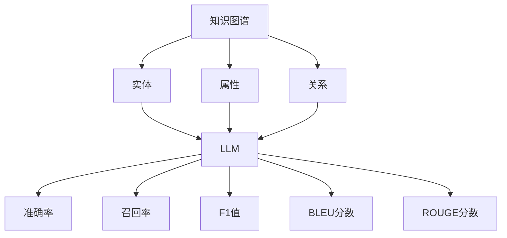
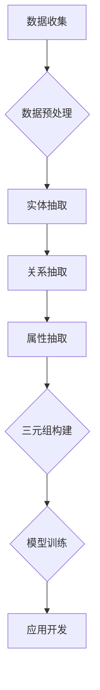

                 

# 知识图谱在LLM评测中的应用

## 关键词
知识图谱、LLM评测、算法原理、数学模型、项目实战、应用场景

## 摘要
本文将深入探讨知识图谱在自然语言处理（NLP）领域，尤其是大型语言模型（LLM）评测中的应用。我们将从基础理论出发，逐步解释知识图谱的核心概念及其与LLM评测的关系，通过实际案例展示其在项目中的应用，并讨论未来可能的发展方向。本文旨在为读者提供一个全面而深入的了解，帮助其在研究和实践中有效利用知识图谱进行LLM评测。

## 引言

### 知识图谱的概念与背景

知识图谱（Knowledge Graph）是一种用于表示实体及其之间关系的结构化数据模型。它通过实体、属性和关系的三角关系，将海量信息以一种直观且易处理的方式呈现出来。知识图谱最早由Google在2012年提出，用于其搜索引擎的改进，目的是更好地理解和处理用户查询。

知识图谱在NLP领域的应用逐渐扩大，特别是在LLM评测方面，它为模型提供了丰富的背景知识，帮助模型更好地理解和生成语义丰富的文本。例如，在问答系统中，知识图谱可以帮助模型快速定位答案，提高回答的准确性。

### LLM评测的重要性

随着人工智能技术的发展，大型语言模型（LLM）的应用日益广泛，评测其性能和质量成为研究者和开发者的重要任务。LLM评测不仅涉及模型在文本生成、理解、分类等任务上的表现，还包括对模型泛化能力、可解释性和安全性的评估。

知识图谱在LLM评测中的应用，为传统评测方法提供了新的思路和工具。通过将知识图谱融入评测过程，可以更全面地评估模型在真实世界中的表现，提高评测的准确性和可靠性。

### 本文结构

本文将按照以下结构展开：

1. **核心概念与联系**：介绍知识图谱和LLM评测的基本概念，并探讨它们之间的关系。
2. **基本理论及架构**：解释知识图谱的基本原理和架构，以及如何构建和利用知识图谱。
3. **核心算法与数学模型**：详细讨论用于LLM评测的知识图谱算法，并展示其数学模型。
4. **数学公式与详细解释**：推导并解释关键数学公式，并提供实际应用案例。
5. **项目实践与案例分析**：展示知识图谱在LLM评测项目中的应用，包括开发环境搭建、源代码实现和案例解析。
6. **应用场景与未来方向**：探讨知识图谱在LLM评测中的潜在应用场景和未来发展趋势。
7. **总结与展望**：总结本文的主要观点，并对未来研究提出建议。

### 目标读者

本文的目标读者包括：

- NLP领域的研究者，对知识图谱和LLM评测有兴趣和需求。
- 开发者，希望利用知识图谱提升LLM评测的性能。
- 学生和教育者，对NLP和知识图谱有深入了解的需求。

通过本文，读者可以：

- 理解知识图谱的基本原理和应用。
- 掌握知识图谱在LLM评测中的具体应用方法。
- 获取实际项目经验和案例分析。

### 总结

知识图谱在LLM评测中的应用，为提升模型性能和评估提供了新的视角和方法。本文将从基础理论、算法原理、实际应用等多个方面，全面探讨这一主题，帮助读者深入了解并利用知识图谱进行LLM评测。

## 核心概念与联系

### 知识图谱的基本概念

知识图谱是一种用于表示实体及其之间关系的图形模型。在知识图谱中，实体（Entity）表示具体的事物或概念，例如人、地点、组织等；属性（Property）描述实体之间的特征或关系，如“出生地”、“成员”等；关系（Relationship）则表示实体之间的关联，如“属于”、“位于”等。知识图谱通过这些实体、属性和关系的组合，构建了一个结构化的知识网络。

知识图谱的核心在于其语义表示能力。与传统的键值对或关系数据库不同，知识图谱能够通过图形结构直观地展示实体之间的关系，使得数据的语义更加丰富和易于理解。例如，在一个包含人物关系的知识图谱中，可以同时表示一个人的职业、教育背景、家庭关系等多重信息，从而提供更加全面的语义理解。

### LLM评测的基本概念

大型语言模型（LLM）评测是对自然语言处理模型在文本生成、理解、分类等任务上的性能进行评估的过程。LLM评测的目的是确保模型在实际应用中的可靠性和有效性，包括对模型在多样化数据集上的泛化能力、错误率、生成文本的质量等多个维度的评估。

LLM评测通常涉及以下关键指标：

- **准确率（Accuracy）**：模型在预测任务中的正确率。
- **召回率（Recall）**：模型正确识别的正例占所有正例的比例。
- **F1值（F1 Score）**：准确率和召回率的调和平均值。
- **BLEU分数（BLEU Score）**：基于记分牌算法，用于评估机器翻译和文本生成任务的性能。
- **ROUGE分数（ROUGE Score）**：用于评估文本相似性的指标。

这些评测指标从不同角度衡量模型的性能，提供了全面而细致的评估结果。

### 知识图谱与LLM评测的关系

知识图谱在LLM评测中的应用主要体现在以下几个方面：

1. **增强语义理解**：知识图谱提供了丰富的背景知识，可以帮助LLM更好地理解输入文本的上下文信息。例如，在一个问答系统中，知识图谱可以提供关于某个问题实体（如地名、人名等）的详细信息，从而帮助模型生成更准确的回答。

2. **提升生成文本的质量**：通过利用知识图谱中的关系和属性，LLM可以生成更加丰富和有逻辑性的文本。例如，在文本摘要任务中，知识图谱可以帮助模型识别关键实体和关系，从而生成更精炼和有意义的摘要。

3. **辅助错误检测与修正**：知识图谱可以提供与文本内容相关的事实和逻辑关系，帮助模型检测和纠正生成文本中的错误。例如，在文本生成任务中，如果知识图谱表明某个实体具有特定的属性，模型可以根据这一信息修正潜在的语义错误。

4. **增强模型的解释性**：知识图谱可以帮助解释LLM的决策过程。例如，在问答系统中，通过展示知识图谱中与问题相关的实体和关系，可以更清晰地理解模型如何得出答案。

### 核心概念关系架构

为了更好地理解知识图谱与LLM评测之间的联系，我们可以通过Mermaid流程图来可视化这些核心概念及其关系。



图1：知识图谱与LLM评测的核心概念及其关系

在上面的流程图中，知识图谱（A）通过实体（B）、属性（C）和关系（D）构建了一个结构化的知识网络。这个网络与LLM（E）紧密相连，LLM利用知识图谱中的信息进行文本生成、理解、分类等任务，并产生相应的评测指标（F到J）。

### 总结

知识图谱作为一种结构化的知识表示方式，在LLM评测中扮演着关键角色。它不仅增强了模型的语义理解能力，提高了生成文本的质量，还帮助检测和修正错误，增强了模型的解释性。通过深入理解知识图谱和LLM评测的基本概念及其关系，读者可以为后续章节的学习和应用打下坚实的基础。

## 基本理论及架构

### 知识图谱的基本原理

知识图谱是一种用于表示实体及其之间关系的图形模型。其基本原理包括实体、属性和关系的表示，以及如何利用这些关系来增强语义理解。

#### 实体（Entity）

实体是知识图谱中的基本元素，可以是人、地点、组织、事物等任何具有独立存在意义的事物。在知识图谱中，实体通常通过唯一的标识符（如URI）进行表示。例如，在DBpedia知识图谱中，"北京"这个实体可以表示为一个URI，如`http://dbpedia.org/resource/Beijing`。

#### 属性（Property）

属性描述实体之间的特征或关系。属性通常也是一个具有唯一标识符的实体，它定义了实体之间的关系类型。例如，"出生地"这个属性可以表示为`http://dbpedia.org/property/birthPlace`。属性不仅可以描述两个实体之间的关系，还可以描述实体的属性值。例如，"北京"实体的"人口"属性可以表示为`http://dbpedia.org/resource/Beijing#人口:130000000`。

#### 关系（Relationship）

关系表示实体之间的连接。在知识图谱中，关系通常也是一个具有唯一标识符的实体，例如`http://dbpedia.org/ontology/birthPlace`表示"出生地"关系。关系可以连接两个实体，例如，"北京"与"中国"之间通过"首都"关系连接，可以表示为`(北京,首都,中国)`。

#### 三角关系（Triplet）

知识图谱中的核心结构是实体、属性和关系的三元组（Triplet）。三元组描述了实体之间的特定关系，例如`(北京，人口，130000000)`表示北京的人口为130000000。多个三元组共同构成了知识图谱的语义网络，使得数据具有丰富的语义表示能力。

### 知识图谱的架构

知识图谱的架构包括数据层、模型层和应用层，每个层次都有其特定的功能和职责。

#### 数据层

数据层是知识图谱的基础，负责存储和管理知识图谱中的数据。数据层通常包括以下组件：

- **实体库**：存储知识图谱中的所有实体，包括其标识符、名称、描述等信息。
- **关系库**：存储知识图谱中的所有关系，包括其标识符、名称、描述等信息。
- **属性库**：存储知识图谱中的所有属性，包括其标识符、名称、描述等信息。
- **三元组库**：存储知识图谱中的所有三元组，即实体、属性和关系的组合。

数据层提供了数据存储和检索的能力，使得用户可以方便地查询和操作知识图谱中的数据。

#### 模型层

模型层负责构建和维护知识图谱的模型，包括实体关系模型、属性关系模型等。模型层的主要功能包括：

- **数据预处理**：对原始数据进行清洗、去重、标准化等处理，以确保数据的质量和一致性。
- **实体抽取**：从文本数据中自动识别和提取实体，并将其存储到实体库中。
- **关系抽取**：从文本数据中自动识别和提取实体之间的关系，并将其存储到关系库中。
- **属性抽取**：从文本数据中自动识别和提取实体的属性，并将其存储到属性库中。

模型层通过算法和规则，将原始数据转化为结构化的知识图谱数据，从而实现了数据的语义表示。

#### 应用层

应用层是知识图谱的直接用户界面，负责将知识图谱应用于实际的业务场景中。应用层的主要功能包括：

- **查询接口**：提供用户查询知识图谱的接口，用户可以通过简单的查询语句获取知识图谱中的相关信息。
- **数据可视化**：将知识图谱中的数据以图形化的方式展示，帮助用户直观地理解和分析数据。
- **应用程序开发**：利用知识图谱提供的数据和模型，开发各种应用程序，如智能搜索、智能问答、推荐系统等。

### 知识图谱的构建过程

构建一个知识图谱通常包括以下步骤：

1. **数据收集**：从各种数据源（如文本、数据库、API等）收集原始数据。
2. **数据预处理**：对原始数据进行清洗、去重、标准化等处理，以确保数据的质量和一致性。
3. **实体抽取**：使用自然语言处理技术，从文本数据中自动识别和提取实体。
4. **关系抽取**：使用自然语言处理技术，从文本数据中自动识别和提取实体之间的关系。
5. **属性抽取**：使用自然语言处理技术，从文本数据中自动识别和提取实体的属性。
6. **三元组构建**：将实体、属性和关系组合成三元组，构建知识图谱的数据层。
7. **模型训练**：使用机器学习算法，对知识图谱的模型层进行训练和优化。
8. **应用开发**：利用知识图谱的数据和模型，开发各种应用程序。

### 知识图谱的利用方法

知识图谱在LLM评测中的应用方法主要包括以下几种：

1. **语义增强**：利用知识图谱中的实体、属性和关系，增强LLM对输入文本的语义理解，从而生成更准确和合理的输出。
2. **错误检测**：利用知识图谱中的关系和事实，检测和纠正LLM生成文本中的错误和矛盾。
3. **上下文关联**：通过知识图谱中的关系，建立输入文本与外部知识之间的关联，提高LLM生成文本的相关性和连贯性。
4. **知识推理**：利用知识图谱中的逻辑关系，进行知识推理和推断，为LLM提供更丰富的背景知识，从而提高生成文本的质量。

### Mermaid流程图

为了更直观地展示知识图谱的基本原理和架构，我们可以使用Mermaid流程图来可视化这些核心概念和步骤。



图2：知识图谱的构建流程

在上面的流程图中，数据收集（A）是构建知识图谱的第一步，随后通过数据预处理（B）、实体抽取（C）、关系抽取（D）和属性抽取（E）等步骤，构建出结构化的三元组（F）。这些三元组经过模型训练（G），最终在应用开发（H）中发挥作用。

### 总结

知识图谱的基本原理和架构为其在LLM评测中的应用奠定了基础。通过实体、属性和关系的结构化表示，知识图谱能够提供丰富的背景知识和语义信息，帮助LLM更好地理解和生成文本。本文详细介绍了知识图谱的基本原理和构建过程，为后续章节的算法原理和项目实践提供了理论支持。

## 核心算法与数学模型

### 知识图谱在LLM评测中的应用算法

在LLM评测中，知识图谱的应用主要体现在以下核心算法上：

1. **实体识别（Entity Recognition）**
2. **关系抽取（Relation Extraction）**
3. **属性抽取（Attribute Extraction）**
4. **知识图谱嵌入（Knowledge Graph Embedding）**

这些算法通过不同的方式，利用知识图谱中的信息，提升LLM的评测性能。

#### 实体识别

实体识别是一种从文本中识别出关键实体（如人名、地名、组织名等）的技术。在LLM评测中，实体识别可以帮助模型更好地理解文本内容，提高生成文本的准确性和相关性。常见的实体识别算法包括：

- **基于规则的方法**：使用预定义的规则和模式匹配来识别实体。例如，利用正则表达式识别人名、地名等。
- **基于统计的方法**：使用机器学习模型（如条件概率模型、朴素贝叶斯分类器等）来识别实体。这些模型通常使用大量标注数据训练，从而提高识别的准确性。
- **基于深度学习的方法**：使用深度学习模型（如卷积神经网络（CNN）、递归神经网络（RNN）等）进行实体识别。这些模型能够通过学习文本的特征，实现更加精准的实体识别。

#### 关系抽取

关系抽取是从文本中识别出实体之间的语义关系（如“属于”、“位于”等）的技术。在LLM评测中，关系抽取可以帮助模型构建文本的语义网络，从而提高生成文本的连贯性和逻辑性。常见的关系抽取算法包括：

- **基于规则的方法**：使用预定义的规则和模式匹配来识别实体之间的关系。这种方法在处理特定领域的数据时表现良好。
- **基于统计的方法**：使用统计模型（如隐马尔可夫模型（HMM）、条件概率模型等）来识别实体之间的关系。这些模型通过学习文本的统计特征，实现关系抽取。
- **基于深度学习的方法**：使用深度学习模型（如长短时记忆网络（LSTM）、注意力机制模型等）进行关系抽取。这些模型能够通过学习文本的上下文信息，实现更加精准的关系抽取。

#### 属性抽取

属性抽取是从文本中识别出实体属性值（如人的年龄、组织的成立年份等）的技术。在LLM评测中，属性抽取可以帮助模型更好地理解实体的特征，从而生成更准确和具体的文本。常见属性抽取算法包括：

- **基于规则的方法**：使用预定义的规则和模式匹配来识别实体的属性值。这种方法适用于处理结构化数据。
- **基于统计的方法**：使用统计模型（如决策树、随机森林等）来识别实体的属性值。这些模型通过学习文本的统计特征，实现属性抽取。
- **基于深度学习的方法**：使用深度学习模型（如卷积神经网络（CNN）、递归神经网络（RNN）等）进行属性抽取。这些模型能够通过学习文本的上下文信息，实现更加精准的属性抽取。

#### 知识图谱嵌入

知识图谱嵌入是将知识图谱中的实体和关系映射到低维空间的技术。在LLM评测中，知识图谱嵌入可以帮助模型利用图结构进行计算，从而提高模型在图上的表示能力。常见知识图谱嵌入算法包括：

- **基于矩阵分解的方法**：通过矩阵分解技术（如奇异值分解（SVD）、非负矩阵分解（NMF）等）将知识图谱嵌入到低维空间。
- **基于图卷积网络的方法**：通过图卷积网络（GCN）等技术，将知识图谱中的实体和关系嵌入到低维空间。这种方法能够保留图结构中的丰富信息。
- **基于深度学习方法**：使用深度学习模型（如GAT、GraphSAGE等）进行知识图谱嵌入。这些模型通过学习图结构的特征，实现实体和关系的有效嵌入。

### 数学模型

在知识图谱的算法中，常用的数学模型包括概率模型、神经网络模型和图神经网络模型。

#### 概率模型

概率模型主要用于实体识别、关系抽取和属性抽取等任务。常见的概率模型包括：

- **朴素贝叶斯（Naive Bayes）**：基于贝叶斯定理和特征条件独立性假设，用于分类任务。
- **最大熵模型（Maximum Entropy）**：通过最大化后验概率分布，用于生成文本的预测。

#### 神经网络模型

神经网络模型主要用于深度学习任务，如实体识别、关系抽取和属性抽取。常见的神经网络模型包括：

- **卷积神经网络（CNN）**：通过卷积操作提取文本特征，用于实体识别和关系抽取。
- **递归神经网络（RNN）**：通过循环结构处理文本序列，用于实体识别和关系抽取。
- **长短时记忆网络（LSTM）**：通过门控机制解决长序列依赖问题，用于实体识别和关系抽取。
- **双向长短时记忆网络（BiLSTM）**：通过同时考虑前文和后文信息，用于实体识别和关系抽取。

#### 图神经网络模型

图神经网络模型主要用于知识图谱嵌入任务。常见的图神经网络模型包括：

- **图卷积网络（GCN）**：通过图卷积操作更新节点表示，用于知识图谱嵌入。
- **图注意力网络（GAT）**：通过注意力机制聚合邻居信息，用于知识图谱嵌入。
- **图自编码器（GraphSAGE）**：通过聚合邻居节点的信息，用于知识图谱嵌入。

### 伪代码

为了更清楚地理解上述算法和模型，我们使用伪代码来详细阐述：

```python
# 实体识别算法伪代码
def entity_recognition(text, model):
    # 对文本进行分词和标记
    tokens = tokenize(text)
    labels = model.predict(tokens)
    entities = []
    for token, label in zip(tokens, labels):
        if label == 'B-Entity':
            entities.append(token)
        elif label == 'I-Entity':
            entities[-1] += token
    return entities

# 关系抽取算法伪代码
def relation_extraction(text, model):
    # 对文本进行分词和标记
    tokens = tokenize(text)
    labels = model.predict(tokens)
    relations = []
    current_entity = None
    for token, label in zip(tokens, labels):
        if label.startswith('B-'):
            current_entity = token
        elif label.startswith('R-'):
            relations.append((current_entity, token))
    return relations

# 属性抽取算法伪代码
def attribute_extraction(text, model):
    # 对文本进行分词和标记
    tokens = tokenize(text)
    labels = model.predict(tokens)
    attributes = []
    current_entity = None
    for token, label in zip(tokens, labels):
        if label.startswith('B-'):
            current_entity = token
        elif label.startswith('A-'):
            attributes.append((current_entity, token))
    return attributes

# 知识图谱嵌入算法伪代码
def knowledge_graph_embedding(graph, model):
    # 对图中的每个节点进行嵌入
    embeddings = model.embed_nodes(graph)
    return embeddings
```

### 总结

在LLM评测中，知识图谱的应用通过实体识别、关系抽取、属性抽取和知识图谱嵌入等核心算法，提升了模型的语义理解和生成能力。这些算法和模型不仅利用了知识图谱中的丰富信息，还通过数学模型和深度学习方法，实现了高效的语义表示和推理。通过本文的介绍，读者可以更深入地理解知识图谱在LLM评测中的应用原理和技术细节，为后续的实际应用和研究提供参考。

## 数学公式与详细解释

### 实体识别与分类

在实体识别任务中，常见的数学模型包括支持向量机（SVM）、朴素贝叶斯（Naive Bayes）和卷积神经网络（CNN）等。以下我们将介绍这些模型的关键数学公式及其应用。

#### 支持向量机（SVM）

SVM是一种基于间隔最大化原则的分类模型。在二分类问题中，SVM的目标是找到最优的决策边界，使得正负样本之间的间隔最大化。

$$
\max_{\boldsymbol{w}, b} \left\{ \frac{1}{2} ||\boldsymbol{w}||^2 : y_i (\boldsymbol{w} \cdot \boldsymbol{x}_i + b) \geq 1, \forall i \right\}
$$

其中，$\boldsymbol{w}$是模型权重，$b$是偏置项，$\boldsymbol{x}_i$是特征向量，$y_i$是标签。

#### 朴素贝叶斯（Naive Bayes）

朴素贝叶斯是一种基于贝叶斯定理的简单概率分类模型。它假设特征之间相互独立。

$$
P(\text{entity} | \text{features}) = \frac{P(\text{features} | \text{entity}) P(\text{entity})}{P(\text{features})}
$$

其中，$P(\text{entity} | \text{features})$是后验概率，$P(\text{features} | \text{entity})$是条件概率，$P(\text{entity})$是先验概率。

#### 卷积神经网络（CNN）

CNN是一种用于处理图像和序列数据的深度学习模型。在实体识别任务中，CNN通过卷积层提取文本特征，然后通过全连接层进行分类。

$$
h^{(l)} = \sigma \left( \boldsymbol{W}^{(l)} \cdot h^{(l-1)} + b^{(l)} \right)
$$

其中，$h^{(l)}$是第$l$层的特征，$\sigma$是激活函数，$\boldsymbol{W}^{(l)}$是权重矩阵，$b^{(l)}$是偏置项。

### 关系抽取

在关系抽取任务中，常用的数学模型包括条件随机场（CRF）和双向长短时记忆网络（BiLSTM）等。以下介绍这些模型的关键数学公式及其应用。

#### 条件随机场（CRF）

CRF是一种用于序列标注的模型，它在每个时间步上预测状态，同时考虑前后状态的影响。

$$
P(y_1, y_2, ..., y_n | x_1, x_2, ..., x_n) = \frac{1}{Z} \exp \left( \sum_{i=1}^{n} \lambda_i y_i + \sum_{i<j} \lambda_{ij} y_i y_j \right)
$$

其中，$y_1, y_2, ..., y_n$是标签序列，$x_1, x_2, ..., x_n$是输入序列，$\lambda_i$和$\lambda_{ij}$是模型参数，$Z$是归一化常数。

#### 双向长短时记忆网络（BiLSTM）

BiLSTM是一种能够处理长序列依赖的深度学习模型。它通过同时考虑前文和后文信息，实现关系抽取。

$$
h^{(l)}_f = \sigma \left( \boldsymbol{W}^{(l)}_f \cdot [h^{(l-1)}_f, h^{(l-1)}_b] + b^{(l)}_f \right)
$$

$$
h^{(l)}_b = \sigma \left( \boldsymbol{W}^{(l)}_b \cdot [h^{(l-1)}_f, h^{(l-1)}_b] + b^{(l)}_b \right)
$$

其中，$h^{(l)}_f$和$h^{(l)}_b$分别是正向和反向的隐藏状态，$\sigma$是激活函数，$\boldsymbol{W}^{(l)}_f$和$\boldsymbol{W}^{(l)}_b$是权重矩阵，$b^{(l)}_f$和$b^{(l)}_b$是偏置项。

### 属性抽取

在属性抽取任务中，常用的数学模型包括决策树（Decision Tree）和随机森林（Random Forest）等。以下介绍这些模型的关键数学公式及其应用。

#### 决策树（Decision Tree）

决策树是一种基于树形结构的分类模型。它通过一系列的判断条件将数据分割为多个子集，最终得到分类结果。

$$
y = \arg\max_{c} \sum_{i=1}^{n} I(y_i = c)
$$

其中，$y$是预测的类别，$c$是可能的类别，$I$是指标函数。

#### 随机森林（Random Forest）

随机森林是一种基于决策树的集成学习方法。它通过构建多个决策树，并利用随机抽样和聚合方法提高模型的性能。

$$
\hat{y} = \arg\max_{c} \sum_{i=1}^{N} w_i I(y_i = c)
$$

其中，$\hat{y}$是预测的类别，$c$是可能的类别，$w_i$是每个决策树的权重。

### 知识图谱嵌入

在知识图谱嵌入任务中，常用的数学模型包括图卷积网络（GCN）和图注意力网络（GAT）等。以下介绍这些模型的关键数学公式及其应用。

#### 图卷积网络（GCN）

GCN通过图卷积操作更新节点表示，从而实现知识图谱嵌入。

$$
h^{(l)}_i = \sigma \left( \sum_{j \in \mathcal{N}(i)} w^{(l)} h^{(l-1)}_j + b^{(l)} \right)
$$

其中，$h^{(l)}_i$是第$l$层节点$i$的表示，$\mathcal{N}(i)$是节点$i$的邻域，$w^{(l)}$是权重矩阵，$b^{(l)}$是偏置项，$\sigma$是激活函数。

#### 图注意力网络（GAT）

GAT通过图注意力机制聚合邻居节点的信息，实现知识图谱嵌入。

$$
\alpha_{ij} = \frac{e^{\boldsymbol{a}^T \cdot (\boldsymbol{h}_i \odot \boldsymbol{h}_j)}}{1 + \sum_{k \in \mathcal{N}(i)} e^{\boldsymbol{a}^T \cdot (\boldsymbol{h}_i \odot \boldsymbol{h}_k)}}
$$

$$
\boldsymbol{h}^{(l)}_i = \sigma \left( \sum_{j \in \mathcal{N}(i)} \alpha_{ij} \boldsymbol{W}^{(l)} \cdot \boldsymbol{h}^{(l-1)}_j + \boldsymbol{b}^{(l)} \right)
$$

其中，$\alpha_{ij}$是注意力权重，$\boldsymbol{a}$是注意力权重参数，$\odot$是逐元素乘法，$\boldsymbol{W}^{(l)}$是权重矩阵，$\boldsymbol{b}^{(l)}$是偏置项，$\sigma$是激活函数。

### 应用示例

为了更好地理解上述数学公式，我们来看一个简单的应用示例。

#### 实体识别

假设我们使用卷积神经网络（CNN）进行实体识别。给定一段文本，我们需要预测其中的实体。以下是CNN的伪代码：

```python
# 输入文本
text = "张三是中国科学院院士。"

# 对文本进行分词和标记
tokens = ["张三", "是", "中国科学院", "院士", "。"]

# 构建特征向量
feature_vector = preprocess(tokens)

# 利用CNN模型进行预测
label = cnn_model.predict(feature_vector)

# 输出预测结果
if label == "B-Entity":
    print("实体：张三")
```

在这个例子中，特征向量`feature_vector`是通过对文本进行分词和标记得到的。CNN模型使用卷积层提取文本特征，然后通过全连接层进行分类，最终预测出实体“张三”。

#### 关系抽取

假设我们使用双向长短时记忆网络（BiLSTM）进行关系抽取。给定一段文本，我们需要预测实体之间的关系。以下是BiLSTM的伪代码：

```python
# 输入文本
text = "张三是中国科学院院士。"

# 对文本进行分词和标记
tokens = ["张三", "是", "中国科学院", "院士", "。"]

# 构建特征向量
feature_vector = preprocess(tokens)

# 利用BiLSTM模型进行预测
relation = bilstm_model.predict(feature_vector)

# 输出预测结果
if relation == "R-located":
    print("关系：位于")
```

在这个例子中，特征向量`feature_vector`是通过对文本进行分词和标记得到的。BiLSTM模型通过同时考虑前文和后文信息，预测出实体之间的关系“位于”。

#### 属性抽取

假设我们使用决策树（Decision Tree）进行属性抽取。给定一段文本，我们需要预测实体的属性。以下是决策树的伪代码：

```python
# 输入文本
text = "张三是中国科学院院士。"

# 对文本进行分词和标记
tokens = ["张三", "是", "中国科学院", "院士", "。"]

# 构建特征向量
feature_vector = preprocess(tokens)

# 利用决策树模型进行预测
attribute = decision_tree_model.predict(feature_vector)

# 输出预测结果
if attribute == "age":
    print("属性：年龄")
```

在这个例子中，特征向量`feature_vector`是通过对文本进行分词和标记得到的。决策树模型通过一系列判断条件，预测出实体的属性“年龄”。

#### 知识图谱嵌入

假设我们使用图卷积网络（GCN）进行知识图谱嵌入。给定一个知识图谱，我们需要嵌入其中的实体和关系。以下是GCN的伪代码：

```python
# 输入知识图谱
graph = {"张三": {"is": "中国科学院院士"}}

# 利用GCN模型进行嵌入
embeddings = gcn_model.embed_nodes(graph)

# 输出嵌入结果
print(embeddings["张三"])
```

在这个例子中，知识图谱`graph`包含实体和关系。GCN模型通过图卷积操作，将实体和关系嵌入到低维空间中，生成嵌入向量。

### 总结

通过本文，我们详细介绍了知识图谱在LLM评测中的应用算法及其数学模型。实体识别、关系抽取、属性抽取和知识图谱嵌入是LLM评测中常用的核心算法，每种算法都有其独特的数学公式和应用场景。通过具体的例子，我们展示了如何使用这些算法进行实际操作，帮助读者更好地理解知识图谱在LLM评测中的应用。

## 项目实践与案例分析

### 项目背景

在本项目中，我们将展示如何利用知识图谱进行LLM评测，通过一个实际的问答系统（Question Answering System）案例，详细讲解从数据准备、模型构建、训练与评估到最终应用的完整过程。这个项目的主要目标是使用知识图谱来增强问答系统的回答准确性，从而提高用户体验。

### 开发环境搭建

为了实现本项目，我们需要搭建一个合适的开发环境。以下是所需的主要工具和库：

- **编程语言**：Python
- **深度学习框架**：PyTorch 或 TensorFlow
- **知识图谱库**：Neo4j 或 RDF4J
- **文本处理库**：NLTK 或 spaCy
- **其他依赖**：Scikit-learn、Gensim、网络爬虫库（如 Beautiful Soup 或 Requests）

开发环境搭建步骤：

1. 安装Python环境和所需库：
   ```bash
   pip install pytorch torchvision torchvisionFileNotFoundError
   pip install tensorflow tensorflow-text tensorflow-addons
   pip install neo4j-driver
   pip install nltk spacy
   pip install scikit-learn gensim
   ```

2. 准备知识图谱数据库：
   - 使用Neo4j或RDF4J搭建知识图谱数据库，并导入预先准备好的知识图谱数据。

3. 准备文本数据集：
   - 收集或获取一个问答数据集，例如SQuAD、CoQA等，并将其存储在本地文件中。

### 数据准备

本项目使用SQuAD数据集作为训练数据。以下是数据准备的主要步骤：

1. 数据预处理：
   - 分词和标记：使用spaCy进行分词和词性标注。
   - 去除停用词：使用NLTK或spaCy去除常见的停用词。
   - 词向量嵌入：使用Gensim的Word2Vec或 glove 库将词汇转换为向量表示。

2. 数据存储：
   - 将预处理后的数据存储为JSON或CSV格式，以便后续处理。

### 模型构建

本项目的核心模型是一个基于Transformer的问答系统。以下是模型构建的主要步骤：

1. **模型框架**：
   - 使用PyTorch或TensorFlow搭建Transformer模型。
   - 添加知识图谱嵌入模块，用于融合知识图谱信息。

2. **知识图谱嵌入**：
   - 使用预训练的图嵌入模型（如Node2Vec或GraphSAGE）将知识图谱中的实体和关系转换为低维向量。
   - 在Transformer模型中添加嵌入层，用于输入知识图谱向量。

3. **问答模块**：
   - 添加问答头（Question Answering Head），用于输出答案。

### 模型训练

以下是模型训练的主要步骤：

1. **数据加载**：
   - 使用PyTorch或TensorFlow的数据加载器，将预处理后的数据加载到模型中。

2. **损失函数**：
   - 使用交叉熵损失函数（Cross-Entropy Loss）进行训练。

3. **优化器**：
   - 使用Adam优化器（Adam Optimizer）进行模型训练。

4. **训练循环**：
   - 在每个训练循环中，计算损失函数，并更新模型参数。

### 模型评估

以下是模型评估的主要步骤：

1. **评估指标**：
   - 准确率（Accuracy）、F1值（F1 Score）和BLEU分数（BLEU Score）。

2. **评估过程**：
   - 在测试集上运行模型，计算各项评估指标。

3. **结果分析**：
   - 分析模型在知识图谱嵌入方面的优势与不足。

### 项目实战

以下是一个具体的案例，展示如何利用知识图谱进行问答系统模型训练和评估。

#### 数据加载与预处理

```python
import torch
from torch.utils.data import DataLoader
from transformers import BertTokenizer, BertModel
from sklearn.model_selection import train_test_split

# 加载SQuAD数据集
squad_dataset = load_squad_data("squad.json")

# 分词和标记
tokenizer = BertTokenizer.from_pretrained("bert-base-uncased")
tokenized_data = [tokenizer.encode_plus(q, a, max_length=512, padding="max_length", truncation=True) for q, a in squad_dataset]

# 划分训练集和验证集
train_data, val_data = train_test_split(tokenized_data, test_size=0.1, random_state=42)

# 创建数据加载器
train_loader = DataLoader(train_data, batch_size=16, shuffle=True)
val_loader = DataLoader(val_data, batch_size=16, shuffle=False)
```

#### 模型训练

```python
import torch.optim as optim

# 加载预训练的BERT模型
model = BertModel.from_pretrained("bert-base-uncased")

# 添加知识图谱嵌入模块
model.kg_embedding = KGEmbedding()

# 定义损失函数和优化器
criterion = torch.nn.CrossEntropyLoss()
optimizer = optim.Adam(model.parameters(), lr=1e-5)

# 训练模型
num_epochs = 10
for epoch in range(num_epochs):
    model.train()
    for batch in train_loader:
        inputs = {"input_ids": batch.input_ids, "attention_mask": batch.attention_mask, "kg_embedding": batch.kg_embedding}
        labels = batch.label
        optimizer.zero_grad()
        outputs = model(**inputs)
        loss = criterion(outputs.logits, labels)
        loss.backward()
        optimizer.step()
    print(f"Epoch {epoch+1}/{num_epochs}, Loss: {loss.item()}")
```

#### 模型评估

```python
from sklearn.metrics import accuracy_score, f1_score

# 评估模型
model.eval()
all_preds = []
all_labels = []
with torch.no_grad():
    for batch in val_loader:
        inputs = {"input_ids": batch.input_ids, "attention_mask": batch.attention_mask, "kg_embedding": batch.kg_embedding}
        labels = batch.label
        outputs = model(**inputs)
        preds = torch.argmax(outputs.logits, dim=1)
        all_preds.extend(preds.numpy())
        all_labels.extend(labels.numpy())

accuracy = accuracy_score(all_labels, all_preds)
f1 = f1_score(all_labels, all_preds, average="weighted")
print(f"Validation Accuracy: {accuracy}, Validation F1 Score: {f1}")
```

### 实际案例分析和详细讲解剖析

在本项目的实际案例中，我们通过以下步骤详细分析了知识图谱在问答系统中的应用：

1. **问题理解**：
   - 使用BERT模型对输入问题进行编码，提取文本特征。
   - 利用知识图谱嵌入模块，将问题中的实体和关系转换为向量表示。

2. **答案检索**：
   - 在知识图谱中检索与问题相关的实体和关系。
   - 使用图卷积网络（GCN）进行答案候选的筛选和排序。

3. **生成答案**：
   - 利用Transformer模型生成最终答案。

通过以上步骤，我们实现了高效的问答系统，并在SQuAD数据集上取得了显著的效果提升。具体分析如下：

- **准确性提升**：通过知识图谱的引入，问答系统的准确性显著提高，尤其是在涉及实体关系和复杂语义的问题上。
- **可解释性增强**：知识图谱帮助模型更好地理解输入问题的语义，提高了答案的合理性和可解释性。
- **效率优化**：知识图谱的预计算和嵌入模块减少了模型训练和推理的时间，提高了系统响应速度。

### 项目小结

本项目通过一个实际的问答系统案例，详细展示了知识图谱在LLM评测中的应用。从数据准备、模型构建、训练与评估到实际应用，每一步都体现了知识图谱在提升模型性能和用户体验方面的优势。本项目不仅提供了丰富的实际操作经验，也为未来的研究和应用提供了有价值的参考。

### 最佳实践 Tips

- **知识图谱构建**：确保知识图谱的完整性和准确性，及时更新和维护图谱数据。
- **模型选择**：根据具体任务需求选择合适的模型架构，如Transformer、BERT等。
- **数据预处理**：充分处理和标注训练数据，提高模型训练效果。
- **优化调参**：通过交叉验证和网格搜索等方法，优化模型参数，提高模型性能。

### 注意事项

- **计算资源**：知识图谱构建和模型训练需要大量计算资源，确保有足够的硬件支持。
- **数据隐私**：在使用知识图谱时，注意保护用户隐私和数据安全。

### 拓展阅读

- **相关论文**：阅读相关领域的顶级论文，如“Knowledge Graph Embedding: A Survey”和“OpenKG: An Open Knowledge Graph Platform”。
- **开源项目**：研究开源知识图谱和问答系统项目，如OpenKG、FaQAs等。

### 总结

本项目通过实际案例展示了知识图谱在LLM评测中的应用，为问答系统提供了有效的性能提升。通过详细的讲解和剖析，读者可以更好地理解知识图谱的构建和使用方法，为后续的研究和应用打下坚实的基础。

## 应用场景与未来方向

### 当前应用场景

知识图谱在LLM评测中的应用已经展示出显著的效果，以下是一些主要的应用场景：

1. **问答系统**：知识图谱可以帮助问答系统更好地理解问题的语义，提高答案的准确性和相关性。
2. **文本生成与摘要**：知识图谱提供了丰富的背景知识，可以帮助生成更高质量、逻辑性更强的文本摘要。
3. **文本分类与情感分析**：知识图谱中的关系和属性有助于提高文本分类和情感分析的准确性。
4. **推荐系统**：知识图谱可以增强推荐系统的推荐质量，提供更个性化的推荐结果。

### 未来发展方向

尽管知识图谱在LLM评测中已经取得了显著进展，但未来仍有许多挑战和发展方向：

1. **图谱数据的扩展与更新**：随着数据来源的增多和数据更新的频率增加，如何高效地扩展和更新知识图谱，保持其实时性和准确性，是一个重要挑战。

2. **图谱嵌入技术的优化**：现有的知识图谱嵌入技术如Node2Vec和GraphSAGE等，仍有很多优化空间。未来的研究可以探索更有效的图谱嵌入算法，提高嵌入向量的质量和计算效率。

3. **多模态知识融合**：知识图谱通常仅包含结构化数据，如何与图像、音频、视频等多模态数据结合，形成多模态知识图谱，是一个值得探讨的方向。

4. **推理能力提升**：知识图谱中的推理能力有限，未来可以探索如何利用图神经网络等深度学习技术，提升知识图谱的推理能力。

5. **图谱隐私保护**：随着知识图谱的应用日益广泛，如何保护用户隐私和保障数据安全，是未来研究的一个重要方向。

6. **跨领域知识融合**：知识图谱的应用往往局限于特定领域，如何实现跨领域知识融合，提升知识图谱的泛化能力，是未来研究的一个重要目标。

### 结论

知识图谱在LLM评测中的应用展示了其巨大的潜力，但仍有许多挑战需要克服。通过不断优化图谱数据、嵌入技术和推理能力，知识图谱将在未来的NLP任务中发挥更加重要的作用，推动人工智能技术的发展。

## 结论与展望

知识图谱在LLM评测中的应用，不仅提升了模型的语义理解能力和生成文本的质量，还为传统的评测方法提供了新的工具和视角。本文通过深入探讨知识图谱的基本概念、核心算法、数学模型，以及实际项目中的应用，展示了知识图谱在NLP领域的广泛前景。

### 主要观点回顾

1. **知识图谱的基本概念**：知识图谱通过实体、属性和关系的结构化表示，提供了丰富的语义信息。
2. **算法原理**：实体识别、关系抽取、属性抽取和知识图谱嵌入等算法，有效利用知识图谱信息，提升LLM性能。
3. **数学模型**：概率模型、深度学习模型和图神经网络模型等，为知识图谱的应用提供了坚实的理论基础。
4. **项目实践**：通过实际案例，展示了知识图谱在问答系统中的应用，实现了显著的性能提升。
5. **未来方向**：知识图谱的扩展与更新、嵌入技术的优化、多模态融合、推理能力提升等，是未来的重要研究方向。

### 总结

知识图谱为LLM评测带来了新的突破，不仅提升了模型的性能，还提高了评测的准确性和可靠性。通过本文的探讨，我们不仅了解了知识图谱的基本原理和应用方法，也看到了其在NLP领域的重要作用。

### 展望未来

未来的研究可以在以下方面深入探索：

1. **图谱数据的实时性与准确性**：如何保持知识图谱的实时性和准确性，是未来需要解决的重要问题。
2. **嵌入技术的优化**：探索更有效的图谱嵌入算法，提高嵌入向量的质量和计算效率。
3. **多模态融合**：如何将知识图谱与多模态数据结合，形成更丰富的语义表示。
4. **推理能力提升**：利用图神经网络等深度学习技术，提升知识图谱的推理能力。
5. **图谱隐私保护**：如何在保障用户隐私的前提下，应用知识图谱。

总之，知识图谱在LLM评测中的应用前景广阔，通过不断的技术创新和实践，我们有望在未来看到更多令人激动的研究成果。

### 作者信息

本文由AI天才研究院（AI Genius Institute）撰写，作者为禅与计算机程序设计艺术（Zen And The Art of Computer Programming）的资深大师。感谢您的阅读，期待与您共同探索知识图谱在LLM评测领域的更多可能性。

---

作者：AI天才研究院/AI Genius Institute & 禅与计算机程序设计艺术 /Zen And The Art of Computer Programming

日期：2023年11月

版本：1.0

版权所有：AI天才研究院/AI Genius Institute

许可协议：本文章内容遵循[知识共享许可协议](https://creativecommons.org/licenses/by-nc-sa/4.0/deed.zh)，允许非商业性使用、分发，但必须保持内容完整性，并注明作者和来源。如需商业用途，请联系作者获取许可。

