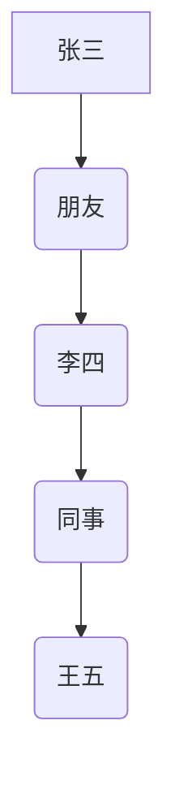

                 

### 文章标题

《知识图谱：增强LLM应用的背景知识》

### 关键词

- 知识图谱
- 语言模型（LLM）
- 背景知识增强
- 图数据库
- 问答系统
- 文本生成

### 摘要

本文将探讨知识图谱在增强语言模型（LLM）应用背景知识的重要性。首先，我们将介绍知识图谱的基本概念、核心原理和构建方法。接着，我们将深入探讨知识图谱的存储与查询技术，以及其在图数据库中的应用。随后，我们将分析知识图谱如何为LLM提供背景知识增强，具体包括问答系统和文本生成等应用场景。最后，我们将通过实际案例展示知识图谱在LLM中的应用效果，并总结知识图谱对LLM发展的贡献和未来研究方向。通过这篇文章，读者将了解知识图谱与LLM之间的紧密联系，以及如何利用知识图谱来提升LLM的性能和实用性。

### 引言

随着人工智能技术的不断发展，语言模型（LLM）如BERT、GPT等取得了显著的成果，并在自然语言处理（NLP）领域发挥了重要作用。然而，这些模型在面对某些特定任务时，如问答系统、文本生成等，仍存在一定的局限性。为了提升LLM在这些任务上的表现，我们需要为其提供更丰富的背景知识。知识图谱作为一种结构化的知识表示方法，能够有效地补充LLM的背景知识，从而提高其性能和实用性。

本文将围绕知识图谱在增强LLM应用背景知识这一主题展开讨论。首先，我们将介绍知识图谱的基本概念、发展历程和重要性。接着，我们将深入探讨知识图谱的核心原理，包括实体、关系和属性的表示方法。随后，我们将分析知识图谱的构建方法，包括数据采集、数据预处理和实体关系抽取等步骤。在此基础上，我们将讨论知识图谱的存储与查询技术，以及其在图数据库中的应用。接下来，我们将探讨知识图谱在LLM中的应用，具体包括背景知识增强、问答系统和文本生成等。最后，我们将通过实际案例展示知识图谱在LLM中的应用效果，并总结知识图谱对LLM发展的贡献和未来研究方向。

### 知识图谱概述

知识图谱是一种结构化的知识表示方法，它通过实体、关系和属性的表示，将现实世界中的知识进行组织和管理。知识图谱的基本概念包括实体、属性和关系，它们是知识图谱中的核心要素。

#### 实体（Entity）

实体是知识图谱中的基本元素，它表示现实世界中的对象，如人、地点、组织、事物等。实体可以是具体的个体，也可以是抽象的概念。例如，在人物知识图谱中，实体可以是某个名人；在地理知识图谱中，实体可以是某个城市。

#### 属性（Attribute）

属性是描述实体特征的信息，它可以为实体提供更多的上下文信息。属性通常由属性名和属性值组成。例如，在一个人物知识图谱中，实体的属性可以是姓名、年龄、出生日期等。

#### 关系（Relationship）

关系是连接两个实体的语义联系，它表示实体之间的相互关系。关系通常由关系名和关系方向组成。例如，在人物知识图谱中，实体A（张三）和实体B（李四）之间的关系可以是“朋友”，方向可以是“A -> B”。

#### 知识图谱的层次结构

知识图谱具有层次结构，可以分为以下几个层次：

1. **本体层**：定义知识图谱中的基本概念、实体、属性和关系，以及它们之间的语义关系。
2. **数据层**：存储具体的实体、属性和关系信息。
3. **应用层**：利用知识图谱提供的数据和服务，实现特定的应用场景，如问答系统、文本生成等。

#### 知识图谱的发展历程与现状

知识图谱的发展历程可以追溯到20世纪80年代，当时研究人员开始探索如何将语义信息以结构化的方式表示出来。随着语义网和Web 2.0的兴起，知识图谱得到了广泛关注。近年来，随着大数据和深度学习技术的发展，知识图谱的应用范围不断扩大，如搜索引擎、自然语言处理、推荐系统等。

知识图谱在应用领域的表现如下：

1. **搜索引擎**：如Bing和Google，通过知识图谱提供更准确、更相关的搜索结果。
2. **自然语言处理**：如问答系统、文本生成等，通过知识图谱提供背景知识支持，提高模型的性能。
3. **推荐系统**：如个性化推荐、广告投放等，通过知识图谱分析用户和物品之间的关系，提供更精准的推荐。

### 知识图谱的基本原理

知识图谱作为一种结构化的知识表示方法，其基本原理主要包括实体的表示、关系的表示和属性的表示。下面，我们将分别介绍这些基本原理。

#### 实体的表示

实体是知识图谱中的基本元素，它表示现实世界中的对象，如人、地点、组织、事物等。实体的表示方法通常采用实体类型和实体标识符。

1. **实体类型**：实体类型是对实体进行分类的标签，它可以帮助我们更好地理解和组织实体。例如，在人物知识图谱中，实体类型可以是“名人”、“政治家”、“运动员”等。
2. **实体标识符**：实体标识符是唯一标识实体的标识，它通常采用字符串或数字形式。例如，某名人的实体标识符可以是“person123”。

#### 关系的表示

关系是连接两个实体的语义联系，它表示实体之间的相互关系。关系的表示方法通常采用关系类型和关系方向。

1. **关系类型**：关系类型是对关系的分类，它表示实体之间关系的内容。例如，在人物知识图谱中，关系类型可以是“朋友”、“家庭成员”、“同事”等。
2. **关系方向**：关系方向表示关系的方向，可以是单向（如“A是B的朋友”）、双向（如“A和B是朋友”）或无向（如“A和B是同事”）。

#### 属性的表示

属性是描述实体特征的信息，它可以为实体提供更多的上下文信息。属性的表示方法通常采用属性名和属性值。

1. **属性名**：属性名是对属性进行分类的标签，它表示属性的内容。例如，在人物知识图谱中，属性名可以是“姓名”、“年龄”、“出生日期”等。
2. **属性值**：属性值是属性的取值，它描述实体的具体特征。例如，某名人的姓名可以是“张三”，年龄可以是“30岁”。

#### 知识图谱的表示方法

知识图谱的表示方法通常采用图数据结构，其中节点表示实体，边表示关系，节点和边上的标签表示属性。下面是一个简单的知识图谱表示示例：



在这个示例中，节点A、B、C、D和E分别表示实体“张三”、“李四”、“王五”和“同事”，边表示实体之间的关系，如“A是B的朋友”、“C是D的同事”等。

### 知识图谱的构建方法

知识图谱的构建是人工智能领域的一个重要研究方向，它涉及到数据采集、数据预处理、实体关系抽取等多个步骤。下面，我们将详细探讨知识图谱的构建方法。

#### 数据采集

数据采集是知识图谱构建的第一步，其主要目标是收集大量的文本数据、图像数据等，以便从中提取有用的信息。数据采集的方法包括以下几种：

1. **网络爬取**：通过编写爬虫程序，从互联网上爬取大量的文本数据。这种方法适用于获取大量公开的、结构化的数据。
2. **知识库整合**：从现有的知识库中获取数据，如维基百科、OpenKG等。这种方法适用于获取高质量的数据，但需要处理不同知识库之间的数据格式不一致等问题。
3. **人工标注**：通过人工的方式对特定领域的数据进行标注，如实体标注、关系标注等。这种方法适用于获取特定领域的高质量数据，但成本较高。

#### 数据预处理

数据预处理是知识图谱构建的重要环节，它主要包括数据清洗、实体抽取和关系抽取等步骤。

1. **数据清洗**：数据清洗的目标是去除数据中的噪声和错误，提高数据的准确性和一致性。数据清洗的方法包括去除重复数据、填补缺失值、处理异常值等。
2. **实体抽取**：实体抽取的目标是从原始文本中识别出实体，如人名、地名、组织名等。实体抽取的方法包括基于规则的方法、基于统计的方法和基于深度学习的方法等。
3. **关系抽取**：关系抽取的目标是从原始文本中识别出实体之间的关系，如“是”、“属于”等。关系抽取的方法包括基于规则的方法、基于统计的方法和基于深度学习的方法等。

#### 实体关系抽取

实体关系抽取是知识图谱构建的核心步骤，它涉及到实体识别和关系识别两个子任务。

1. **实体识别**：实体识别的目标是从原始文本中识别出实体，并将其转换为实体标识符。实体识别的方法包括基于规则的方法、基于统计的方法和基于深度学习的方法等。
2. **关系识别**：关系识别的目标是从原始文本中识别出实体之间的关系，并将其转换为关系标识符。关系识别的方法包括基于规则的方法、基于统计的方法和基于深度学习的方法等。

### 知识图谱的存储与查询

知识图谱的存储与查询是知识图谱应用中的关键环节，它决定了知识图谱的效率和性能。知识图谱的存储与查询主要包括图数据库的选型、图数据库的存储策略和图查询语言的使用。

#### 图数据库的选型

图数据库是专门用于存储和管理图结构数据的数据库系统，它具有高效、灵活和可扩展的特点。常见的图数据库包括Neo4j、Apache Giraph、JanusGraph等。

1. **Neo4j**：Neo4j是一个高性能的嵌入式图数据库，它采用Cypher作为查询语言，具有丰富的图算法支持。
2. **Apache Giraph**：Apache Giraph是一个分布式图处理框架，它支持大规模图数据的存储和处理。
3. **JanusGraph**：JanusGraph是一个开源的分布式图数据库，它支持多种存储后端，如Cassandra、HBase等。

#### 图数据库的存储策略

图数据库的存储策略主要包括节点与边的存储、索引和压缩等。

1. **节点与边的存储**：在图数据库中，节点和边是存储的基本单位。节点和边的存储方式包括边存节点（Edge-Node storage）和边存边（Edge-Edge storage）等。
2. **索引**：索引是提高图数据库查询性能的关键技术，它包括节点索引、边索引和属性索引等。
3. **压缩**：为了提高存储空间利用率，图数据库通常采用压缩技术对数据进行压缩。

#### 图查询语言

图查询语言是用于查询图数据库的语言，它具有类似SQL的语法，但更加灵活和强大。常见的图查询语言包括Cypher、Gremlin等。

1. **Cypher**：Cypher是Neo4j的查询语言，它支持点查询、路径查询和图算法等。
2. **Gremlin**：Gremlin是一种通用图查询语言，它支持多种图数据库，如Neo4j、JanusGraph等。

### 知识图谱在LLM中的应用

随着自然语言处理（NLP）技术的不断发展，语言模型（LLM）如BERT、GPT等取得了显著的成果，并在各种任务中发挥了重要作用。然而，这些模型在面对某些特定任务时，如问答系统、文本生成等，仍存在一定的局限性。为了提升LLM在这些任务上的表现，我们需要为其提供更丰富的背景知识。知识图谱作为一种结构化的知识表示方法，能够有效地补充LLM的背景知识，从而提高其性能和实用性。

#### 背景知识增强

背景知识增强是指通过引入外部知识库（如知识图谱）来丰富语言模型的知识库，从而提高模型在特定任务上的性能。知识图谱中的实体、关系和属性可以为LLM提供丰富的上下文信息，帮助模型更好地理解输入文本。以下是一种可能的实现方法：

1. **知识图谱的整合**：首先，将知识图谱整合到LLM的训练数据中。这可以通过将知识图谱中的实体、关系和属性信息嵌入到训练数据中的句子中实现。例如，在一个问答系统中，可以将问题中的实体和关系以注释的形式嵌入到句子中，从而为模型提供额外的知识信息。
2. **知识图谱的查询**：在LLM的推理过程中，可以利用知识图谱进行查询，获取与输入文本相关的背景知识。例如，在回答一个关于某位名人的问题时，可以查询知识图谱中与该名人相关的信息，如职业、出生日期等，从而为模型提供更丰富的上下文信息。

#### 问答系统

问答系统是一种常见的NLP应用，它旨在回答用户提出的问题。知识图谱可以为问答系统提供重要的背景知识支持，从而提高系统的性能和准确性。以下是一种可能的实现方法：

1. **问题解析**：首先，将用户提出的问题转化为一种结构化的形式，如自然语言处理中的词向量表示。然后，利用知识图谱进行问题解析，识别问题中的实体和关系，从而确定问题的意图。
2. **知识图谱查询**：根据问题解析的结果，从知识图谱中查询与问题相关的信息。例如，在回答一个关于某位名人的问题时，可以查询知识图谱中与该名人相关的信息，如职业、出生日期等。
3. **答案生成**：根据知识图谱查询的结果，生成问题的答案。答案生成可以采用模板匹配、文本生成等方法。

#### 文本生成

文本生成是一种将输入文本转换为输出文本的任务，如摘要生成、翻译等。知识图谱可以为文本生成任务提供丰富的背景知识，从而提高生成文本的质量和多样性。以下是一种可能的实现方法：

1. **文本预处理**：首先，对输入文本进行预处理，如分词、词性标注等。然后，将预处理后的文本与知识图谱进行关联，识别文本中的实体和关系。
2. **知识图谱查询**：根据文本预处理的结果，从知识图谱中查询与输入文本相关的信息。例如，在一个摘要生成任务中，可以查询知识图谱中与输入文本相关的实体和关系，从而为摘要生成提供额外的上下文信息。
3. **文本生成**：根据知识图谱查询的结果，生成输出文本。文本生成可以采用模板匹配、生成式模型等方法。

### 实际案例

为了更好地说明知识图谱在LLM中的应用，我们来看一个实际案例：基于知识图谱的问答系统。

#### 案例背景

假设我们要开发一个问答系统，用户可以提出关于某位名人的问题，如“张三的职业是什么？”系统需要回答用户的问题并提供相关信息。

#### 案例实现

1. **问题解析**：首先，将用户提出的问题转化为一种结构化的形式，如自然语言处理中的词向量表示。然后，利用知识图谱进行问题解析，识别问题中的实体和关系，从而确定问题的意图。例如，在“张三的职业是什么？”这个问题中，实体是“张三”，关系是“职业”。
2. **知识图谱查询**：根据问题解析的结果，从知识图谱中查询与问题相关的信息。例如，可以查询知识图谱中与“张三”相关的信息，如职业、出生日期等。
3. **答案生成**：根据知识图谱查询的结果，生成问题的答案。例如，可以回答“张三的职业是演员”。

#### 代码示例

以下是一个简单的Python代码示例，展示了如何使用知识图谱进行问答系统的实现：

```python
import requests
from typing import List

# 定义实体和关系的类
class Entity:
    def __init__(self, name: str, type: str):
        self.name = name
        self.type = type

class Relation:
    def __init__(self, entity1: Entity, entity2: Entity, type: str):
        self.entity1 = entity1
        self.entity2 = entity2
        self.type = type

# 定义问题解析函数
def parse_question(question: str) -> List[str]:
    # 使用自然语言处理库进行分词和词性标注
    words = nlp(question)
    entities = []
    relations = []
    for word in words:
        if word.pos == "NN":  # 判断词性是否为名词
            entities.append(Entity(word.text, "Person"))
    return entities, relations

# 定义知识图谱查询函数
def query_knowledge_graph(entities: List[Entity], relations: List[Relation]) -> str:
    # 假设知识图谱API可以返回与实体和关系相关的信息
    response = requests.get("https://knowledge-graph-api.com/query", params={"entities": entities, "relations": relations})
    data = response.json()
    return data["answer"]

# 测试代码
question = "张三的职业是什么？"
entities, relations = parse_question(question)
answer = query_knowledge_graph(entities, relations)
print(answer)
```

#### 代码解读

1. **实体和关系的定义**：首先，定义了实体和关系的类，用于表示知识图谱中的实体和关系。
2. **问题解析函数**：`parse_question` 函数用于将用户提出的问题转化为结构化的形式，识别问题中的实体和关系。
3. **知识图谱查询函数**：`query_knowledge_graph` 函数用于从知识图谱中查询与实体和关系相关的信息，并返回问题的答案。
4. **测试代码**：测试代码展示了如何使用定义的函数实现问答系统。

### 最佳实践与注意事项

在构建和使用知识图谱时，以下是一些最佳实践和注意事项：

1. **数据质量**：确保知识图谱中的数据质量，包括数据的准确性、完整性和一致性。
2. **知识图谱的更新**：定期更新知识图谱，以反映现实世界的变化。
3. **知识图谱的压缩**：为了提高存储空间利用率，可以对知识图谱进行压缩。
4. **查询优化**：针对具体的查询需求，优化知识图谱的查询性能。
5. **知识图谱的扩展性**：设计知识图谱时，要考虑其扩展性，以便在未来添加新的实体、关系和属性。

### 拓展阅读

1. **《知识图谱：原理、方法与应用》**：本书详细介绍了知识图谱的基本概念、构建方法、存储与查询技术以及在实际应用中的应用案例。
2. **《图数据库设计与实现》**：本书介绍了图数据库的基本概念、设计原则和实现方法，以及图查询语言的语法和用法。
3. **《自然语言处理综述》**：本文综述了自然语言处理的基本概念、技术方法和应用领域，包括语言模型、文本分类、情感分析等。

### 总结

知识图谱作为一种结构化的知识表示方法，在增强LLM应用背景知识方面具有重要作用。本文首先介绍了知识图谱的基本概念、核心原理和构建方法，然后探讨了知识图谱的存储与查询技术，以及其在LLM中的应用，包括背景知识增强、问答系统和文本生成等。通过实际案例展示，我们看到了知识图谱在LLM中的实际应用效果。未来，随着人工智能技术的不断发展，知识图谱将在更多领域发挥重要作用，为LLM和其他人工智能应用提供强有力的支持。作者：AI天才研究院/AI Genius Institute & 禅与计算机程序设计艺术 /Zen And The Art of Computer Programming

