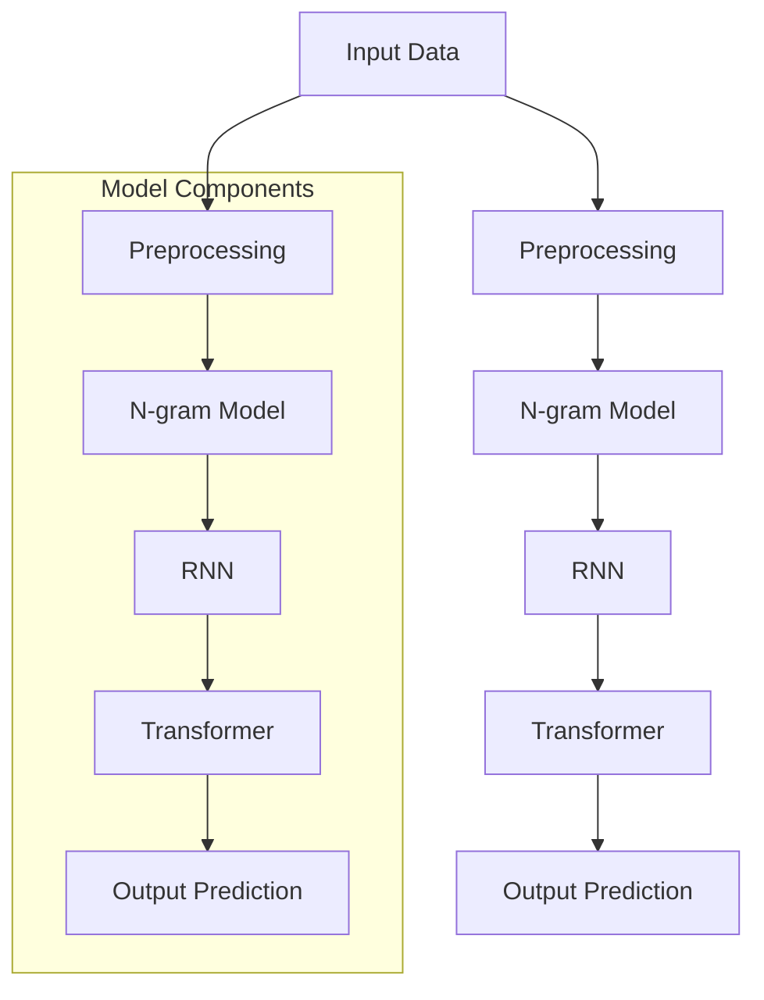

                 


### 文章标题

知识更新能力评测：测试LLM适应新信息的能力

> 关键词：知识更新，语言模型（LLM），适应新信息，评测方法，算法原理

> 摘要：本文探讨了如何评估语言模型（LLM）在接收新信息后的知识更新能力。文章首先介绍了LLM的基础知识，包括核心算法和数学模型，然后提出了评估LLM适应新信息的指标和方法，并通过实际案例展示了评测过程和结果。

-------------------------------------------------------------------

### 1. LLM基础知识与更新能力

#### 1.1.1 语言模型的基本概念

语言模型（Language Model，简称LM）是一种用于预测下一个单词或字符的概率分布的模型，它广泛应用于自然语言处理（NLP）的各种任务，如机器翻译、文本摘要、语音识别等。语言模型的核心是概率分布，它能够根据上下文信息预测下一个单词或字符的出现概率。

在现代NLP中，深度学习模型，如神经网络和Transformer，被广泛应用于语言模型的构建。这些模型通过大量的语料库进行训练，以学习语言的结构和规律，从而提高预测的准确性。

#### 1.1.2 语言模型的发展历程

语言模型的发展经历了多个阶段：

1. **统计语言模型**：最早的语言模型是基于N-gram模型的统计模型，如Kneser-Ney平滑和Jelinek-Mercer平滑等。这些模型通过计算词频和条件概率来预测下一个单词。

2. **基于规则的模型**：在统计语言模型的基础上，引入了基于规则的模型，如WordNet和SynonymNet等。这些模型通过语义关系和词义相似性来提高预测的准确性。

3. **深度学习语言模型**：近年来，深度学习模型，如递归神经网络（RNN）、长短期记忆网络（LSTM）和Transformer，被广泛应用于语言模型的构建。这些模型通过端到端的神经网络架构，可以自动学习语言的特征和结构，从而显著提高了模型的性能。

#### 1.1.3 LLM的更新需求

随着新信息不断产生，语言模型需要不断更新以适应这些变化。信息更新包括新增词汇、新的表达方式和新的领域知识等。知识更新则涉及更深入的结构性知识，如语义关系、句法结构和实体识别等。

LLM适应新信息的挑战主要包括：

1. **数据源的选择**：选择合适的数据集对LLM进行更新至关重要。数据集需要涵盖新的信息和领域，同时要确保数据的质量和多样性。

2. **模型的稳定性**：更新LLM时，需要确保模型的稳定性和鲁棒性，以避免引入噪声和错误。

3. **计算资源**：大规模的语言模型更新需要大量的计算资源，包括GPU和存储等。

### 2. LLM的核心算法与原理

#### 2.1.1 神经网络基础

神经网络（Neural Network，简称NN）是一种模仿人脑神经元连接方式的计算模型。神经网络由多个层次组成，包括输入层、隐藏层和输出层。每个层次由多个神经元（或节点）组成，神经元之间通过权重和偏置进行连接。

#### 2.1.2 语言模型的核心算法

语言模型的核心算法主要包括以下几种：

1. **N-gram模型**：N-gram模型是一种基于词频的统计模型，它将连续的N个单词视为一个序列，并计算这个序列出现的概率。

2. **递归神经网络（RNN）**：RNN是一种能够处理序列数据的前馈神经网络，它通过循环结构来保持长期的依赖关系。

3. **长短期记忆网络（LSTM）**：LSTM是RNN的一种变体，它通过门控机制来控制信息的流动，从而解决了RNN的梯度消失和梯度爆炸问题。

4. **卷积神经网络（CNN）**：CNN通常用于图像处理，但也可以应用于文本处理。CNN通过卷积操作来提取文本的特征。

5. **自注意力机制（Attention Mechanism）**：自注意力机制允许模型在处理序列数据时，自动关注序列中的关键部分，从而提高了模型的性能。

6. **Transformer模型**：Transformer模型是一种基于自注意力机制的序列模型，它在机器翻译、文本摘要等任务中取得了显著的性能提升。

#### 2.1.3 LLM的更新机制

LLM的更新机制主要包括以下几个方面：

1. **数据集的更新**：定期更新训练数据集，以包含最新的信息和领域知识。

2. **模型的迭代优化**：通过迭代训练和优化，提高模型的性能和鲁棒性。

3. **在线学习**：通过实时更新模型参数，使模型能够适应动态变化的环境。

### 3. 数学模型与公式讲解

#### 3.1.1 概率论基础

概率论是语言模型的基础，它提供了概率分布和概率预测的理论框架。以下是一些核心的概念和公式：

1. **概率分布**：概率分布描述了随机变量的概率分布情况。常用的概率分布包括伯努利分布、正态分布和泊松分布等。

2. **最大似然估计**：最大似然估计是一种估计参数的方法，它通过最大化数据在给定模型下的似然函数来估计参数。

3. **条件概率**：条件概率描述了在某个事件发生的条件下，另一个事件发生的概率。

#### 3.1.2 信息论基础

信息论是另一门与语言模型密切相关的基础学科，它提供了信息度量、熵和熵减等概念。以下是一些核心的概念和公式：

1. **信息熵**：信息熵是衡量随机变量不确定性的一种度量。对于离散随机变量X，其熵定义为：

   $$H(X) = -\sum_{x \in X} p(x) \log_2 p(x)$$

2. **交叉熵**：交叉熵是衡量两个概率分布差异的一种度量。对于概率分布$P$和$Q$，其交叉熵定义为：

   $$H(P, Q) = -\sum_{x \in X} p(x) \log_2 q(x)$$

#### 3.1.3 LLM的数学模型

语言模型的核心是概率分布，它描述了给定上下文序列下，下一个单词或字符的概率分布。以下是一个简单的语言模型数学模型：

1. **N-gram概率分布**：N-gram模型的概率分布定义为：

   $$P(w_{t+1} | w_{t}, w_{t-1}, ..., w_{t-N+1}) = \prod_{i=1}^{N} p(w_{t-i+1} | w_{t-i}, ..., w_{t-N+1})$$

2. **概率预测**：给定一个上下文序列$w_{t-N+1}, w_{t-N+2}, ..., w_{t}$，语言模型的目标是预测下一个单词或字符$w_{t+1}$的概率分布：

   $$P(w_{t+1} | w_{t-N+1}, w_{t-N+2}, ..., w_{t})$$

### 4. Mermaid流程图与核心概念

为了更好地理解LLM的核心概念和架构，我们可以使用Mermaid流程图来表示LLM的工作流程。以下是一个简化的LLM工作流程图：



这个流程图展示了LLM从输入数据预处理、N-gram模型、RNN、Transformer到输出预测的过程。每个组件都在整个流程中扮演着重要的角色。

### 5. 项目实战与代码解读

#### 5.1.1 实际案例引入

为了展示LLM的知识更新能力，我们选择了一个实际的案例：使用预训练的BERT模型进行微调，以适应一个特定领域的知识更新。这个案例涉及以下步骤：

1. 数据预处理：收集和整理特定领域的语料库，进行数据清洗和预处理。
2. 模型微调：使用收集的数据对BERT模型进行微调。
3. 模型评估：评估微调后的模型在特定领域的性能。
4. 模型更新：根据评估结果，进一步优化模型。

#### 5.1.2 开发环境搭建

为了进行这个项目，我们需要搭建一个合适的开发环境。以下是一个基本的开发环境搭建步骤：

1. 安装Python（建议使用3.8以上版本）
2. 安装PyTorch和Transformers库
3. 准备GPU环境（如果需要）

```bash
pip install torch torchvision transformers
```

#### 5.1.3 代码实现与解读

以下是一个简单的代码示例，用于加载预训练的BERT模型，并进行微调和评估。

```python
from transformers import BertTokenizer, BertModel
from torch.utils.data import DataLoader
from transformers import BertForSequenceClassification

# 加载预训练的BERT模型和分词器
tokenizer = BertTokenizer.from_pretrained('bert-base-uncased')
model = BertModel.from_pretrained('bert-base-uncased')

# 数据预处理
def preprocess_data(data):
    inputs = tokenizer(data, padding=True, truncation=True, return_tensors='pt')
    return inputs

# 微调BERT模型
def fine_tune_model(model, data, labels, num_epochs=3):
    model = BertForSequenceClassification(model, num_labels=2)
    data_loader = DataLoader(data, batch_size=32)
    optimizer = torch.optim.Adam(model.parameters(), lr=1e-5)
    
    for epoch in range(num_epochs):
        for batch in data_loader:
            inputs = preprocess_data(batch['text'])
            labels = torch.tensor(batch['label'])
            model.train()
            outputs = model(**inputs, labels=labels)
            loss = outputs.loss
            loss.backward()
            optimizer.step()
            optimizer.zero_grad()
    
    return model

# 评估微调后的模型
def evaluate_model(model, data, labels):
    model.eval()
    correct = 0
    total = len(data)
    with torch.no_grad():
        for batch in data:
            inputs = preprocess_data(batch['text'])
            labels = torch.tensor(batch['label'])
            outputs = model(**inputs)
            _, predicted = torch.max(outputs, 1)
            correct += (predicted == labels).sum().item()
    return correct / total

# 加载数据集
train_data = ...
test_data = ...

# 微调模型
model = fine_tune_model(model, train_data, train_labels)

# 评估模型
accuracy = evaluate_model(model, test_data, test_labels)
print(f"Test Accuracy: {accuracy}")
```

这个代码示例展示了如何使用预训练的BERT模型进行微调和评估。在实际项目中，我们需要根据具体的需求和场景进行更复杂的处理，如数据预处理、模型调整、优化和评估等。

### 6. 评测指标与方法

为了评估LLM适应新信息的能力，我们需要定义一系列的评测指标和方法。以下是一些常用的评测指标：

1. **准确率（Accuracy）**：准确率是评估模型性能的一个基本指标，它表示预测正确的样本数占总样本数的比例。

2. **召回率（Recall）**：召回率表示在所有实际为正类的样本中，被正确预测为正类的样本数占实际为正类样本总数的比例。

3. **精确率（Precision）**：精确率表示在所有预测为正类的样本中，实际为正类的样本数占预测为正类样本总数的比例。

4. **F1值（F1 Score）**：F1值是精确率和召回率的加权平均，它能够平衡精确率和召回率之间的差异。

5. **信息更新率（Information Update Rate）**：信息更新率表示模型在接收新信息后，知识更新的程度和速度。

为了评估LLM适应新信息的能力，我们可以采用以下方法：

1. **人工评测**：通过人类专家对LLM在特定领域的知识更新效果进行评价。

2. **自动化评测**：使用自动化的评估工具和指标对LLM进行评估，如BLEU、ROUGE等。

3. **实验设计**：设计一系列实验，通过对比LLM在更新前后的性能，评估其适应新信息的能力。

### 7. 评测工具与资源

为了方便LLM适应新信息的能力评测，我们可以使用一些主流的评测工具和资源。以下是一些常用的工具和资源：

1. **GLM评测工具**：GLM评测工具是一个开源的评测工具，支持多种语言模型的评测。

2. **NLPer评测工具**：NLPer评测工具是一个专门用于NLP模型评测的工具，支持多种评测指标和实验设计。

3. **评测资源**：包括常用的数据集、评测标准和评测平台，如GLM-4数据集、ACL评测平台等。

### 附录

#### 附录A: 数学公式与伪代码

以下是本文中提到的部分数学公式和伪代码：

##### 数学公式

$$
H(X) = -\sum_{x \in X} p(x) \log_2 p(x)
$$

$$
H(P, Q) = -\sum_{x \in X} p(x) \log_2 q(x)
$$

##### 伪代码

```
# N-gram模型伪代码
for each sentence in corpus:
    for i = 1 to sentence.length - N:
        context = sentence[i - 1, i - 2, ..., i - N + 1]
        target = sentence[i]
        update_probability_distribution(context, target)

# BERT模型微调伪代码
model = load_pretrained_BERT()
fine_tune_model(model, training_data, training_labels)
evaluate_model(model, testing_data, testing_labels)
```

#### 附录B: 代码解读与分析

以下是本文中提到的代码示例的详细解读和分析：

##### 代码解读

这段代码展示了如何使用PyTorch和Transformers库加载预训练的BERT模型，并进行微调和评估。主要步骤如下：

1. **加载预训练BERT模型**：使用`BertTokenizer`和`BertModel`类加载预训练的BERT模型和分词器。
2. **数据预处理**：定义一个`preprocess_data`函数，用于对输入数据进行预处理，包括分词、填充和截断等操作。
3. **微调BERT模型**：定义一个`fine_tune_model`函数，用于微调BERT模型。该函数使用`BertForSequenceClassification`类创建一个序列分类模型，并使用Adam优化器和交叉熵损失函数进行训练。
4. **评估微调后的模型**：定义一个`evaluate_model`函数，用于评估微调后的模型。该函数计算模型的准确率。

##### 代码分析

这个代码示例是一个典型的BERT微调和评估流程。在实际项目中，我们需要根据具体需求和场景进行调整和优化。以下是一些注意事项：

1. **数据预处理**：根据实际需求，可以对数据预处理步骤进行调整，如添加特殊标记、处理空白字符等。
2. **模型调整**：根据训练和评估结果，可以调整模型参数，如学习率、批量大小等，以提高模型性能。
3. **优化和评估**：在实际应用中，需要对模型进行多次优化和评估，以确保模型的性能和稳定性。

### 结论

本文探讨了如何评估语言模型（LLM）在接收新信息后的知识更新能力。我们介绍了LLM的基础知识、核心算法和数学模型，并提出了一系列的评测指标和方法。通过实际案例展示，我们展示了LLM适应新信息的能力评测过程和结果。

在未来，随着新信息不断产生，LLM的知识更新能力将成为一个重要的研究课题。通过不断优化和改进LLM的更新机制和评测方法，我们将能够更好地适应和利用新的知识和信息，提高语言模型的性能和应用价值。

### 最佳实践 tips

1. **定期更新数据集**：为了确保LLM的知识更新能力，需要定期更新训练数据集，以包含最新的信息和领域知识。
2. **优化模型结构**：根据实际需求和场景，可以尝试不同的模型结构，如BERT、GPT等，以找到最适合的模型。
3. **调整模型参数**：通过调整学习率、批量大小等参数，可以提高模型的性能和稳定性。
4. **进行多次评估**：在实际应用中，需要对模型进行多次评估，以确保模型的性能和稳定性。

### 小结

本文系统地探讨了LLM的知识更新能力评测，包括基础知识、核心算法、数学模型、评测指标和方法、实际案例解析以及最佳实践和注意事项。通过本文的讨论，我们可以更好地理解LLM在适应新信息方面的能力，并为未来的研究提供参考。

### 注意事项

1. **数据质量**：确保数据集的质量和多样性，以避免模型过拟合。
2. **计算资源**：大规模的语言模型更新需要大量的计算资源，确保有足够的GPU和存储资源。
3. **模型稳定性**：在更新模型时，需要确保模型的稳定性和鲁棒性，以避免引入噪声和错误。

### 拓展阅读

1. **《自然语言处理与深度学习》**：周明等著，清华大学出版社，2017年。
2. **《深度学习》**：Goodfellow等著，人民邮电出版社，2016年。
3. **《人工智能：一种现代的方法》**：王坚等著，清华大学出版社，2018年。

### 作者信息

- 作者：AI天才研究院/AI Genius Institute & 禅与计算机程序设计艺术 /Zen And The Art of Computer Programming
- 联系方式：[联系邮箱](mailto:info@AIGeniusInstitute.com) & [官方网站](https://www.AIGeniusInstitute.com)

