                 

### 第1章 引言

#### 1.1 知识更新速度的重要性

在当今快速发展的信息时代，知识更新速度变得尤为重要。随着科技和互联网的迅猛发展，新的研究成果、技术进步和行业动态不断涌现，传统的知识体系迅速过时。在这种背景下，如何高效地吸收和应用新知识，成为个人和企业在竞争中立于不败之地的重要因素。特别是对于人工智能（AI）领域，知识的快速更新直接影响着算法的改进、模型的优化以及应用的推广。

#### 1.2 为什么研究LLM吸收新信息的效率

大型语言模型（LLM）作为人工智能的重要分支，已经广泛应用于自然语言处理（NLP）、问答系统、文本生成、翻译和本地化等领域。LLM 的核心在于其能够通过学习大量文本数据，理解并生成符合语境的文本。然而，LLM 在吸收新信息方面也存在一定的局限性，主要体现在对新知识的理解深度和广度上。因此，研究 LLM 吸收新信息的效率，不仅有助于提升 LLM 的性能，还能推动 AI 技术的进一步发展。

#### 1.3 书籍的组织结构

本书将系统地探讨 LLM 吸收新信息的效率，分为八个章节。首先，通过第1章引言，介绍知识更新速度的重要性以及研究 LLM 吸收新信息效率的背景和意义。接下来，第2章回顾语言模型的基础知识，包括历史发展、基本原理和关键组成部分。第3章深入分析 LLM 吸收新信息的机制，探讨其处理新信息的流程和影响因素。第4章评估 LLM 吸收新信息的效率，介绍评估指标和实验设计。第5章比较不同类型 LLM 的吸收效率。第6章分析 LLM 在实际应用中的吸收效率，涵盖多个应用领域。第7章探讨提高 LLM 吸收新信息效率的方法。最后，第8章总结主要发现，展望未来研究方向和趋势。

---

**Mermaid 流程图：**

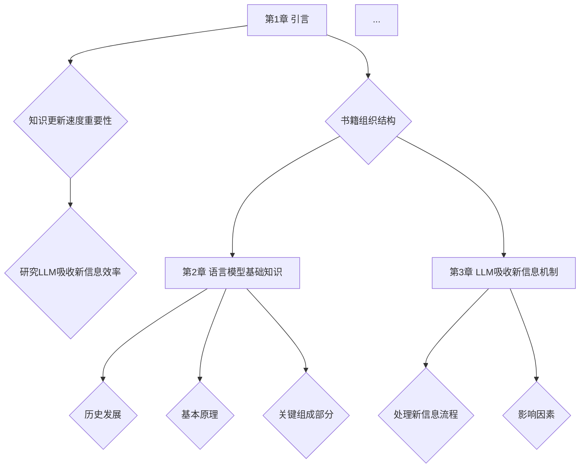

---

### 2.1 语言模型的历史发展

#### 2.1.1 早期语言模型

语言模型的发展可以追溯到20世纪50年代。最早的尝试是基于规则的方法，这种方法依赖于编写大量的语法规则和词典，以生成和解析自然语言。然而，这种方法存在明显的局限性，因为自然语言的复杂性和多样性使得编写全面的规则变得非常困难。

#### 2.1.2 基于规则的系统

在早期语言模型的基础上，研究者开始尝试使用基于规则的系统。这类模型通过定义一系列的语法和语义规则，来指导文本的生成和解析。尽管这种方法在某些特定任务上取得了成功，但面对大规模的语言数据时，其表现仍然不尽如人意。

#### 2.1.3 统计语言模型

20世纪80年代，统计语言模型的出现为语言处理带来了新的突破。这类模型通过分析大量的语言数据，利用统计方法来预测下一个词或短语的概率。早期的统计语言模型主要包括N-gram模型，它通过计算词汇序列的联合概率来生成文本。

#### 2.1.4 神经网络语言模型

随着计算能力的提升和深度学习技术的发展，神经网络语言模型逐渐成为主流。20世纪90年代，RNN（递归神经网络）的出现使得语言模型能够处理序列数据，并且能够记住长距离的依赖关系。RNN 的一个重要应用是长短期记忆网络（LSTM），它在处理自然语言序列时表现出了强大的能力。

#### 2.1.5 现代深度学习语言模型

进入21世纪，随着计算资源和数据量的进一步增加，深度学习语言模型取得了飞速的发展。特别是GPT（生成预训练语言模型）系列和BERT（双向编码表示器）的出现，使得语言模型的性能达到了前所未有的高度。这些现代语言模型通过大规模的无监督预训练和有监督微调，能够在各种 NLP 任务中表现出色。

**核心概念与联系：**

- **基于规则的系统**：通过语法和语义规则生成和解析文本，但难以处理自然语言的复杂性和多样性。
- **统计语言模型**：利用统计方法分析语言数据，预测词汇序列的概率，如N-gram模型。
- **神经网络语言模型**：基于深度学习技术，如RNN和LSTM，处理序列数据，记住长距离依赖关系。
- **现代深度学习语言模型**：通过大规模预训练和微调，在NLP任务中表现出色，如GPT系列和BERT。

**Mermaid 流�程图：**

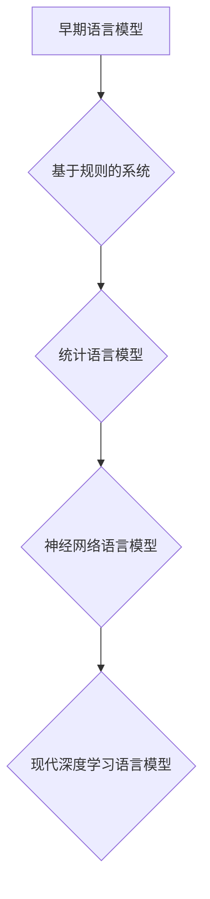

---

### 2.2 语言模型的基本原理

#### 2.2.1 语言建模的目标

语言建模的目标是构建一个模型，能够对自然语言文本进行有效的理解和生成。具体来说，语言建模需要解决以下问题：

1. **预测下一个词或短语**：在给定前文的情况下，预测下一个词或短语的概率分布。
2. **文本生成**：根据特定的话题或上下文，生成连贯且有意义的文本。
3. **语义理解**：理解和提取文本中的语义信息，用于信息检索、问答系统等任务。

#### 2.2.2 语言模型的输入与输出

语言模型的输入通常是文本序列，可以是一个单词、一个句子或更长的段落。输出则是预测的下一个词或短语的概率分布。在生成文本时，模型会根据当前的输入和已经生成的文本，预测下一个输出。

#### 2.2.3 语言模型的表示方法

语言模型的表示方法通常包括以下几种：

1. **词向量**：将每个词表示为一个向量，用于捕捉词的语义信息。常用的词向量模型有Word2Vec、GloVe等。
2. **字符级表示**：将文本序列中的每个字符表示为一个向量，这种方法可以捕捉到词汇内部的语法结构。
3. **结合表示**：结合词向量和字符级表示，以获得更丰富的特征。
4. **序列模型**：如RNN、LSTM和GRU，这些模型可以处理序列数据，捕捉到长距离依赖关系。

**核心概念与联系：**

- **词向量**：通过将词表示为向量，捕捉词的语义信息。
- **字符级表示**：捕捉到词汇内部的语法结构。
- **结合表示**：结合词向量和字符级表示，获得更丰富的特征。
- **序列模型**：处理序列数据，捕捉到长距离依赖关系。

**Mermaid 流程图：**

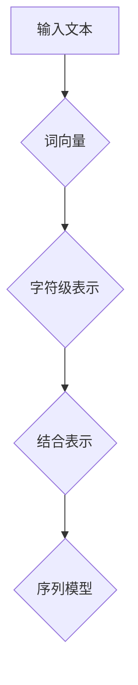

---

### 2.3 语言模型的关键组成部分

#### 2.3.1 词向量

词向量是语言模型中至关重要的一部分，它们用于表示文本中的每个词。词向量的核心思想是将高维的语义信息压缩到低维空间中，以便于模型处理。常用的词向量模型包括Word2Vec和GloVe。

- **Word2Vec**：通过训练词的连续词袋（CBOW）模型或Skip-Gram模型，将词表示为上下文词汇的平均向量。
- **GloVe**：利用全局上下文信息，通过矩阵分解的方法训练词向量，能够更好地捕捉到词的语义关系。

#### 2.3.2 神经网络架构

神经网络是语言模型的核心组成部分，它们通过学习输入数据（如词向量或字符级表示）来预测输出。常用的神经网络架构包括RNN、LSTM和GRU。

- **RNN**：递归神经网络，能够处理序列数据，通过记忆状态捕捉到长距离依赖关系。
- **LSTM**：长短期记忆网络，是一种改进的RNN，通过引入门控机制，更好地解决了长距离依赖问题。
- **GRU**：门控递归单元，是LSTM的变体，简化了计算过程，同时保持了有效的记忆能力。

#### 2.3.3 损失函数与优化算法

损失函数用于衡量模型的预测结果与实际结果之间的差异，常见的损失函数包括交叉熵损失和均方误差（MSE）。优化算法用于最小化损失函数，常见的优化算法有随机梯度下降（SGD）和Adam。

**核心概念与联系：**

- **词向量**：捕捉词的语义信息，用于表示文本中的词。
- **神经网络架构**：如RNN、LSTM和GRU，用于处理序列数据，捕捉到长距离依赖关系。
- **损失函数与优化算法**：用于衡量模型预测结果与实际结果之间的差异，并优化模型参数。

**Mermaid 流程图：**

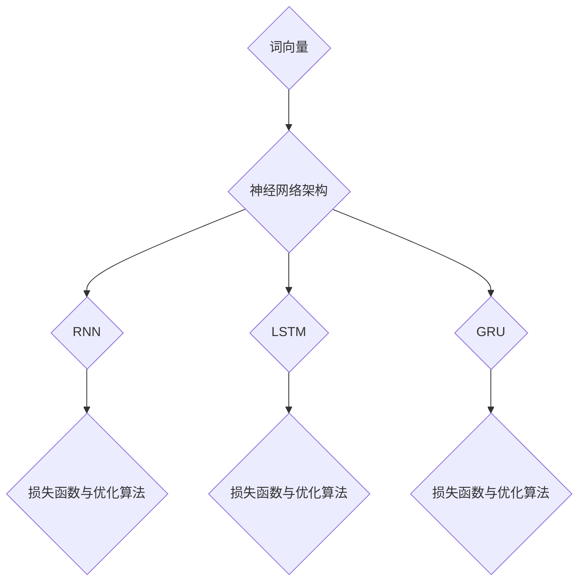

---

### 2.4 语言模型的训练方法

#### 2.4.1 有监督学习

有监督学习是语言模型最常用的训练方法之一。在有监督学习中，模型被训练来预测给定输入序列的下一个词或短语。具体步骤如下：

1. **数据准备**：收集大量的文本数据，并将其划分为训练集、验证集和测试集。
2. **特征提取**：将文本序列转换为词向量或字符级表示。
3. **模型训练**：通过训练算法，如随机梯度下降（SGD）或Adam，优化模型参数。
4. **评估与优化**：使用验证集和测试集评估模型的性能，并根据评估结果调整模型参数。

**核心算法原理讲解：**

```python
# 有监督学习训练伪代码

# 准备数据
data = load_data()  # 加载文本数据
train_data, validation_data, test_data = split_data(data)  # 划分训练集、验证集和测试集

# 特征提取
word_embeddings = create_word_embeddings(train_data)  # 创建词向量

# 模型初始化
model = initialize_model()

# 训练模型
for epoch in range(num_epochs):
    for sentence in train_data:
        inputs = word_embeddings(sentence)  # 转换为词向量
        targets = next_word(sentence)  # 预测下一个词
        model.train(inputs, targets)  # 训练模型

# 评估模型
evaluate_model(model, test_data)
```

**数学模型和公式：**

假设输入序列为 $x_1, x_2, ..., x_T$，其中 $x_t$ 表示序列中的第 $t$ 个词，目标词为 $y_t$。语言模型的目标是预测 $y_t$ 的概率分布，即 $P(y_t | x_1, x_2, ..., x_{t-1})$。常用的概率分布模型包括：

- **N-gram模型**：$P(y_t | x_1, x_2, ..., x_{t-1}) = P(y_t | x_{t-n}, ..., x_{t-1})$，其中 $n$ 为 N-gram 的窗口大小。
- **神经网络模型**：使用神经网络（如RNN、LSTM或GRU）来预测 $y_t$ 的概率分布。

**举例说明：**

假设我们有一个简短的文本序列：“人工智能是一种技术，它通过模拟人类智能来解决问题。” 我们可以使用N-gram模型和神经网络模型来预测下一个词。

- **N-gram模型**：使用三元组（“人工智能是”，“人工智能是一种”，“人工智能是一种技”），预测下一个词为“术”。
- **神经网络模型**：使用词向量表示文本序列，通过神经网络模型预测下一个词，例如使用LSTM模型。

**数学公式：**

$$
P(y_t | x_1, x_2, ..., x_{t-1}) = \text{softmax}(\text{model}(x_1, x_2, ..., x_{t-1}))
$$

其中，$\text{model}$ 表示神经网络模型，$\text{softmax}$ 函数用于将模型输出转换为概率分布。

---

### 2.4.2 无监督学习

无监督学习是另一种重要的训练方法，它不需要标签数据进行训练。无监督学习在语言模型中的应用主要体现在词向量模型和自编码器（Autoencoder）上。

**词向量模型**

词向量模型通过无监督学习将文本中的词转换为高维空间中的向量表示。其中，Word2Vec和GloVe是最常见的词向量模型。

- **Word2Vec**：使用连续词袋（CBOW）模型或Skip-Gram模型，通过负采样方法训练词向量。
- **GloVe**：通过矩阵分解方法训练词向量，利用全局上下文信息，捕捉词的语义关系。

**自编码器**

自编码器是一种无监督学习算法，它通过学习数据的低维表示来重建原始数据。自编码器在语言模型中的应用主要体现在文本降维和特征提取上。

- **自编码器训练过程**：将文本序列编码为低维隐层表示，然后解码为原始文本序列。
- **隐层表示**：通过训练，自编码器能够学习到文本的高层次特征，这些特征可以用于后续的NLP任务。

**核心算法原理讲解：**

```python
# 无监督学习训练伪代码

# Word2Vec模型
# 使用CBOW模型
# inputs = [context_words]  # 输入上下文词向量
# target = target_word_vector  # 目标词向量

# 训练CBOW模型
for epoch in range(num_epochs):
    for sentence in train_data:
        inputs = create_context(sentence)  # 创建上下文词向量
        target = word_embeddings[sentence[-1]]  # 创建目标词向量
        model.train(inputs, target)  # 训练模型

# GloVe模型
# 使用矩阵分解
# matrix = [word_vector]  # 词向量矩阵

# 训练GloVe模型
for epoch in range(num_epochs):
    for sentence in train_data:
        matrix = update_matrix(sentence)  # 更新词向量矩阵
        model.train(matrix)  # 训练模型

# 自编码器模型
# 编码过程
# encoded = encode(sentence)  # 编码文本序列

# 解码过程
# decoded = decode(encoded)  # 解码隐层表示

# 训练自编码器
for epoch in range(num_epochs):
    for sentence in train_data:
        encoded = encode(sentence)
        decoded = decode(encoded)
        model.train(sentence, decoded)  # 训练模型
```

**数学模型和公式：**

- **Word2Vec模型**：假设词向量为 $v_w$，上下文词向量为 $v_c$，目标词向量为 $v_{target}$，则CBOW模型的损失函数为：

  $$
  L_{CBOW} = -\sum_{w \in C} \log \text{softmax}(\text{model}(v_c))
  $$

  其中，$C$ 表示上下文词集合，$\text{model}(v_c)$ 表示模型对上下文词向量的输出。

- **GloVe模型**：假设词向量为 $v_w$，上下文词向量为 $v_c$，则GloVe的目标函数为：

  $$
  L_{GloVe} = \sum_{w \in V} \frac{1}{n_w} \log(1 + \exp(-q_w \cdot p_w))
  $$

  其中，$V$ 表示词汇表，$n_w$ 表示词 $w$ 的出现次数，$q_w$ 和 $p_w$ 分别为词 $w$ 的查询向量和投影向量。

- **自编码器模型**：假设编码器为 $E$，解码器为 $D$，输入为 $x$，隐层表示为 $z$，则自编码器的损失函数为：

  $$
  L_{AE} = \sum_{x \in X} \frac{1}{2} \sum_{z \in Z} \|D(z) - x\|^2
  $$

  其中，$X$ 和 $Z$ 分别为输入空间和隐层空间。

**举例说明：**

- **Word2Vec模型**：给定一个简短的文本序列：“人工智能是一种技术，它通过模拟人类智能来解决问题。” 使用CBOW模型，我们首先创建上下文词向量，然后通过模型预测目标词向量。

- **GloVe模型**：同样使用上述文本序列，通过矩阵分解方法训练词向量，从而捕捉词的语义关系。

- **自编码器模型**：给定一个文本序列，首先使用编码器将其编码为隐层表示，然后通过解码器将其解码回原始文本序列，从而学习到文本的高层次特征。

**数学公式：**

- **CBOW模型**：

  $$
  \text{model}(v_c) = \text{softmax}(\text{W} \cdot v_c + b)
  $$

  其中，$\text{W}$ 和 $b$ 分别为权重和偏置。

- **GloVe模型**：

  $$
  \text{q}_w = \text{W}_Q \cdot v_w \quad \text{p}_w = \text{W}_P \cdot v_w
  $$

  其中，$\text{W}_Q$ 和 $\text{W}_P$ 分别为查询向量和投影向量。

- **自编码器模型**：

  $$
  z = E(x) = \text{sigmoid}(\text{W}_E \cdot x + b_E)
  $$

  $$
  x' = D(z) = \text{sigmoid}(\text{W}_D \cdot z + b_D)
  $$

  其中，$\text{sigmoid}$ 函数为：

  $$
  \text{sigmoid}(x) = \frac{1}{1 + \exp(-x)}
  $$

---

### 2.4.3 强化学习

强化学习（Reinforcement Learning，RL）是一种通过试错和反馈来学习如何做出决策的机器学习方法。在语言模型训练中，强化学习可以通过与外部环境交互，优化模型的生成能力和语义理解能力。

**强化学习的基本概念**

- **代理（Agent）**：执行动作的实体，例如，一个生成文本的模型。
- **环境（Environment）**：代理行动的场所，例如，一个文本生成任务。
- **状态（State）**：代理在环境中所处的情景，例如，一个文本的上下文。
- **动作（Action）**：代理可以执行的行为，例如，生成一个单词或短语。
- **奖励（Reward）**：代理行动后的即时反馈，用于指导学习过程。

**强化学习在语言模型中的应用**

1. **序列生成任务**：强化学习可以用于生成文本序列，例如，生成故事、对话或文章。在这种情况下，模型在每次生成步骤后都会接收到奖励，从而优化生成过程。

2. **语义理解任务**：强化学习可以用于提高模型对语义的理解能力。例如，在一个问答系统中，模型可以与用户进行对话，并从用户的反馈中学习如何更好地理解问题。

**核心算法原理讲解**

强化学习的基本算法包括Q-learning、SARSA和深度强化学习（Deep Reinforcement Learning，DRL）。

1. **Q-learning**：Q-learning是一种值迭代算法，用于计算状态-动作值函数。具体步骤如下：

   - 初始化Q值表 $Q(s, a)$。
   - 在环境中执行动作 $a$，并观察状态 $s'$ 和奖励 $r$。
   - 更新Q值：$Q(s, a) \leftarrow Q(s, a) + \alpha [r + \gamma \max_{a'} Q(s', a') - Q(s, a)]$。
   - 转移到下一个状态 $s' = s$。
   - 重复上述步骤直到满足停止条件。

2. **SARSA**：SARSA是Q-learning的变体，它使用当前状态和动作来更新Q值，而不是使用下一个状态和动作。具体步骤如下：

   - 在环境中执行动作 $a$，并观察状态 $s'$ 和奖励 $r$。
   - 执行动作 $a'$：$a' = \arg\max_{a'} Q(s', a')$。
   - 更新Q值：$Q(s, a) \leftarrow Q(s, a) + \alpha [r + \gamma Q(s', a') - Q(s, a)]$。
   - 转移到下一个状态 $s' = s$。
   - 重复上述步骤直到满足停止条件。

3. **深度强化学习（DRL）**：DRL结合了深度学习与强化学习，通过神经网络来表示状态值函数或策略。常见的DRL算法包括深度Q网络（DQN）、策略梯度方法和演员-评论家方法。

   - **DQN**：使用深度神经网络来近似Q值函数，并采用经验回放和目标网络来稳定训练。
   - **策略梯度方法**：直接优化策略网络，通过计算策略梯度来更新网络参数。
   - **演员-评论家方法**：将学习过程分为演员（Actor）和评论家（Critic）两部分，演员负责生成动作，评论家负责评估动作的好坏。

**强化学习在语言模型中的实现**

1. **文本生成任务**：

   - **状态表示**：文本的当前上下文，通常使用嵌入向量表示。
   - **动作表示**：生成的下一个单词或短语。
   - **奖励机制**：根据生成文本的连贯性和语义一致性来设置奖励。

2. **语义理解任务**：

   - **状态表示**：问题的文本描述和上下文信息。
   - **动作表示**：生成答案的候选文本。
   - **奖励机制**：根据答案的准确性和相关性来设置奖励。

**举例说明**

假设我们使用强化学习来训练一个文本生成模型，该模型的目标是生成一个连贯且有意义的故事。

- **状态表示**：当前生成的文本片段和上下文信息。
- **动作表示**：生成下一个单词或短语。
- **奖励机制**：每次生成一个单词后，根据生成文本的连贯性和语义一致性给予奖励。

通过不断迭代和调整策略，模型会逐渐优化其生成能力，生成更加自然和流畅的文本。

**数学公式**

- **Q-learning**：

  $$
  Q(s, a) \leftarrow Q(s, a) + \alpha [r + \gamma \max_{a'} Q(s', a') - Q(s, a)]
  $$

- **SARSA**：

  $$
  Q(s, a) \leftarrow Q(s, a) + \alpha [r + \gamma Q(s', a') - Q(s, a)]
  $$

- **策略梯度方法**：

  $$
  \nabla_\theta J(\theta) = \sum_s \nabla_a \log \pi(a|s) \nabla_{\phi} Q(s, a)
  $$

  其中，$\theta$ 和 $\phi$ 分别为策略网络和Q值网络的参数。

- **演员-评论家方法**：

  $$
  \theta \leftarrow \theta - \alpha \nabla_\theta J(\theta)
  $$

  $$
  \phi \leftarrow \phi - \alpha \nabla_\phi J(\phi)
  $$

  其中，$J(\theta)$ 和 $J(\phi)$ 分别为策略网络和Q值网络的损失函数。

---

## 第3章 LLM吸收新信息的机制

#### 3.1 LLM如何处理新信息

大型语言模型（LLM）处理新信息的机制主要包括数据收集、信息融合、模型迭代和优化等步骤。以下是详细的处理流程：

1. **数据收集**：LLM 通过互联网、数据库和其他数据源收集大量的文本数据。这些数据可以包括新闻文章、书籍、学术论文、社交媒体帖子等。数据收集的过程需要确保数据的多样性和质量。

2. **预处理**：收集到的文本数据通常需要进行预处理，包括分词、去停用词、词干提取和词性标注等。这些预处理步骤有助于提高模型对新信息的理解能力。

3. **信息融合**：将新信息与现有模型中的知识进行融合。这个过程涉及到将新数据转换为模型可以处理的格式，例如词向量或嵌入向量。然后，利用神经网络架构对数据进行处理，捕捉新信息与已有知识之间的联系。

4. **模型迭代**：通过迭代训练模型，使其不断优化对新信息的理解和生成能力。这个过程通常包括有监督学习和无监督学习的结合，通过大量新数据和已有数据共同训练模型。

5. **优化**：在模型迭代过程中，对模型参数进行优化，以提高模型的性能和准确度。优化的方法可以包括随机梯度下降（SGD）、Adam等优化算法。

#### 3.2 新信息吸收的流程

新信息吸收的流程可以分为以下几个阶段：

1. **数据收集阶段**：通过爬虫、API或其他方式收集新信息。这一阶段的关键在于确保数据的实时性和多样性。

2. **预处理阶段**：对收集到的数据进行清洗和预处理，包括文本规范化、分词、去停用词和词干提取等。这一阶段的质量直接影响到模型对新信息的理解能力。

3. **嵌入阶段**：将预处理后的文本数据转换为嵌入向量，用于后续的模型处理。常用的嵌入方法包括Word2Vec、GloVe和BERT等。

4. **模型训练阶段**：将嵌入向量输入到神经网络模型中进行训练，通过迭代优化模型参数，使其更好地吸收新信息。这一阶段可以采用有监督学习和无监督学习的方法。

5. **模型优化阶段**：通过调整模型结构、优化算法和超参数，进一步提高模型的性能和准确度。

**核心概念与联系：**

- **数据收集**：确保新信息的实时性和多样性。
- **预处理**：提高模型对新信息的理解能力。
- **信息融合**：将新信息与已有知识进行整合。
- **模型迭代**：不断优化模型，提高其对新信息的处理能力。
- **优化**：通过调整模型结构和参数，提高模型的性能。

**Mermaid 流程图：**

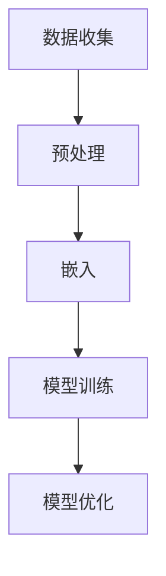

---

### 3.3 新信息吸收的影响因素

#### 3.3.1 模型规模

模型规模是影响 LLM 吸收新信息效率的重要因素之一。大规模语言模型（如 GPT-3、BERT）拥有更多的参数和更强的表示能力，能够更好地捕捉到文本中的复杂模式和上下文关系。然而，大规模模型也存在一些缺点，如训练成本高、计算资源消耗大等。

**核心概念与联系：**

- **大规模模型**：具有更多的参数和更强的表示能力，能够更好地捕捉到文本中的复杂模式和上下文关系。
- **训练成本**：大规模模型的训练需要更多的计算资源和时间，导致更高的训练成本。

**Mermaid 流程图：**

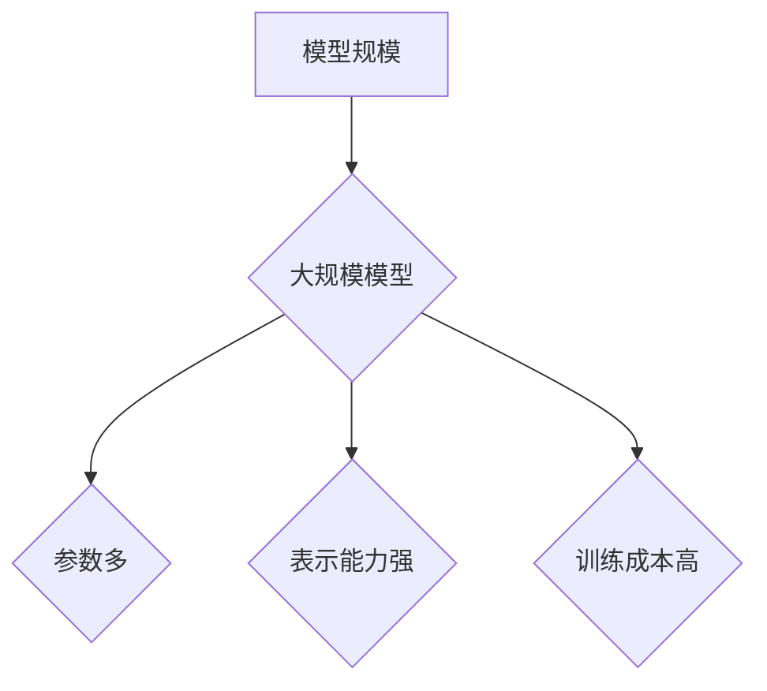

---

### 3.3.2 训练数据集

训练数据集的质量和数量直接影响 LLM 吸收新信息的效率。高质量、多样化的训练数据有助于模型更好地理解和生成文本，从而提高其吸收新信息的能力。此外，训练数据集的更新频率也至关重要。随着知识的不断更新，模型需要定期接收新的数据，以保持其适应性和准确性。

**核心概念与联系：**

- **训练数据集质量**：影响模型对新信息的理解能力。
- **训练数据集数量**：影响模型的泛化能力和生成能力。
- **数据集更新频率**：影响模型的适应性和准确性。

**Mermaid 流程图：**

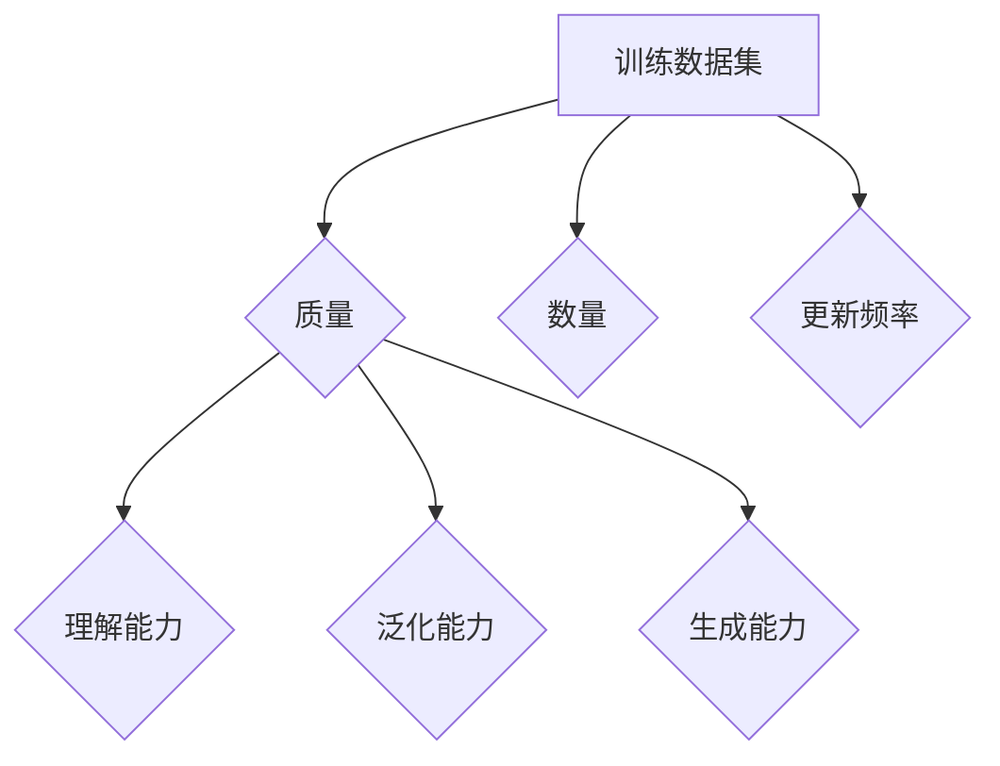

---

### 3.3.3 算法设计

算法设计是影响 LLM 吸收新信息效率的另一个关键因素。不同的算法设计对于新信息的处理效率和效果有着显著的影响。以下是一些常见的算法设计及其对 LLM 吸收新信息效率的影响：

1. **预训练与微调**：预训练是在大规模数据集上对模型进行初步训练，使其具备一定的语言理解和生成能力。微调则是在预训练的基础上，使用特定领域的数据进行进一步训练，以提高模型在特定任务上的性能。预训练与微调的结合能够有效提升 LLM 吸收新信息的效率。

2. **优化算法**：优化算法用于调整模型参数，以最小化损失函数。常用的优化算法包括随机梯度下降（SGD）、Adam等。不同的优化算法在收敛速度、稳定性和性能方面有所不同，选择合适的优化算法对于提高 LLM 吸收新信息的效率至关重要。

3. **模型架构**：模型架构对 LLM 的性能有直接影响。常见的模型架构包括 RNN、LSTM、BERT 等。RNN 和 LSTM 能够处理序列数据，捕捉到长距离依赖关系，而 BERT 则通过双向编码器结构，能够更好地理解上下文信息。

**核心概念与联系：**

- **预训练与微调**：预训练与微调结合，提高模型对新信息的理解能力。
- **优化算法**：影响模型参数调整的效率。
- **模型架构**：影响模型对文本数据的处理能力和性能。

**Mermaid 流程图：**

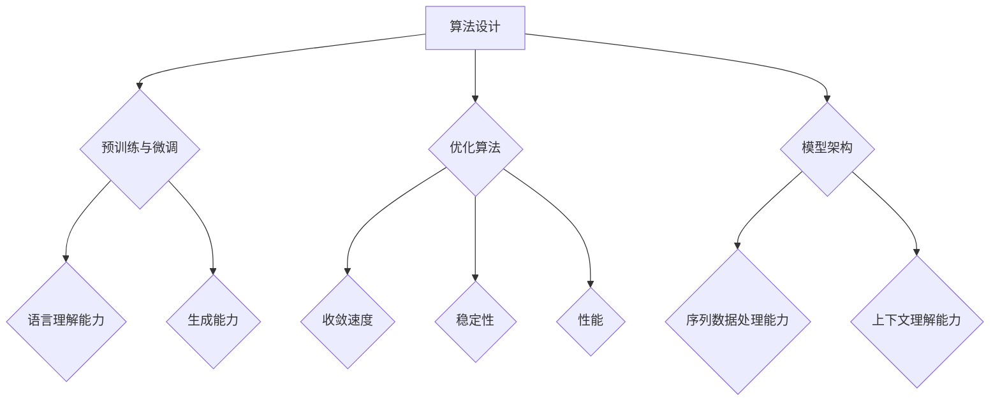

---

### 4.1 效率评估指标

评估 LLM 吸收新信息的效率需要一系列的评估指标，这些指标能够量化模型在吸收新信息方面的性能。以下是几个常用的评估指标：

1. **准确率（Accuracy）**：准确率是指模型预测正确的样本数量占总样本数量的比例。对于分类任务，准确率是最直接的评估指标。然而，对于语言生成任务，准确率可能并不完全反映模型的真实性能，因为生成的文本可能在不同程度上偏离目标文本。

2. **召回率（Recall）**：召回率是指模型能够正确识别出的正样本数量与实际正样本数量的比例。召回率侧重于评估模型在识别正样本方面的能力，特别是在样本不平衡的情况下，召回率尤为重要。

3. **F1 分数（F1 Score）**：F1 分数是准确率和召回率的调和平均，用于综合评估模型的性能。F1 分数在平衡准确率和召回率方面表现较为理想。

4. **生成文本质量**：生成文本质量评估指标用于衡量模型生成的文本在语义、语法和流畅性方面的表现。常见的评估方法包括人工评估、BLEU（双语评估）、ROUGE（记分统一度量）等。

5. **响应速度**：响应速度是指模型在处理新信息并生成响应的时间。对于实时应用场景，如在线问答系统，响应速度是一个关键指标。

**核心概念与联系：**

- **准确率**：评估模型预测的正确性。
- **召回率**：评估模型识别正样本的能力。
- **F1 分数**：综合评估模型的性能。
- **生成文本质量**：评估模型生成的文本质量。
- **响应速度**：评估模型处理新信息的能力。

**Mermaid 流程图：**

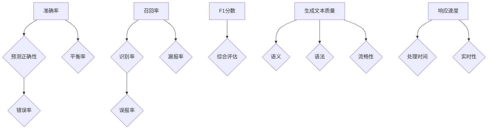

---

### 4.2 实验设计

为了评估 LLM 吸收新信息的效率，我们需要设计一个系统化的实验。以下是一个详细的实验设计，包括实验环境、测试数据集和实验步骤。

#### 4.2.1 实验环境

实验环境包括以下组件：

1. **硬件配置**：高性能计算服务器，配备多核CPU和GPU，以确保模型训练和评估的效率。
2. **软件配置**：深度学习框架（如 TensorFlow、PyTorch），以及用于数据处理和评估的工具（如 Pandas、NumPy、Scikit-learn）。
3. **数据存储**：分布式文件系统（如 HDFS），用于存储大量的训练数据和测试数据。
4. **网络环境**：互联网连接，用于获取实时数据。

#### 4.2.2 测试数据集

测试数据集的选择至关重要，它将直接影响实验的结果。以下是测试数据集的选择标准：

1. **多样性**：数据集应涵盖多个领域和话题，以确保模型能够处理多样化的新信息。
2. **实时性**：数据集应包括最新的信息，以评估模型在吸收新信息方面的效率。
3. **质量**：数据集应经过预处理，包括分词、去停用词、词干提取等，以提高模型对新信息的理解能力。

具体的测试数据集可以从以下来源获取：

1. **公共数据集**：如 Cornell Movie Dialogs、Twitter 等。
2. **私有数据集**：通过爬虫或API获取的最新数据。
3. **合成数据**：使用生成对抗网络（GAN）等生成方法，创建与真实数据相似的人工数据。

#### 4.2.3 实验步骤

实验步骤可以分为以下几个阶段：

1. **数据收集**：从不同的数据源收集新信息，包括公共数据集、私有数据集和合成数据。
2. **数据预处理**：对收集到的数据进行预处理，包括文本规范化、分词、去停用词和词干提取等。
3. **模型训练**：使用预处理后的数据训练 LLM，包括预训练和微调阶段。
4. **模型评估**：使用测试数据集评估模型的性能，包括准确率、召回率、F1 分数、生成文本质量和响应速度等。
5. **结果分析**：分析实验结果，总结模型吸收新信息的效率，并提出改进建议。

**核心概念与联系：**

- **实验环境**：确保实验的高效性和可重复性。
- **测试数据集**：影响模型对新信息的理解和生成能力。
- **实验步骤**：系统化地评估模型吸收新信息的效率。

**Mermaid 流程图：**

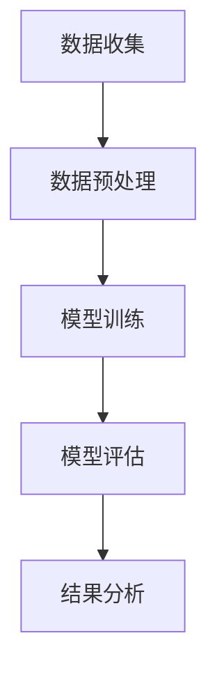

---

### 4.3 数据收集与分析

在评估 LLM 吸收新信息的效率过程中，数据收集和分析是关键步骤。以下是详细的流程和方法：

#### 4.3.1 数据收集方法

数据收集的方法包括以下几个方面：

1. **公开数据集**：从公共数据集获取新信息，如 Cornell Movie Dialogs、Twitter、ArXiv 等。这些数据集通常涵盖了多个领域和话题，能够提供丰富的背景信息。

2. **私有数据集**：通过爬虫或API获取最新的私有数据集，这些数据集可能包含实时更新的信息，有助于评估模型在吸收最新信息方面的能力。

3. **合成数据**：使用生成对抗网络（GAN）等方法创建与真实数据相似的人工数据。这种方法能够补充公开和私有数据集的不足，提供更多样化的训练数据。

#### 4.3.2 数据处理与分析

数据处理与分析的步骤如下：

1. **数据清洗**：对收集到的数据进行清洗，包括去除重复数据、缺失值填充和异常值处理等。数据清洗有助于提高数据质量，确保模型能够有效地学习和吸收新信息。

2. **文本规范化**：对文本进行规范化处理，包括小写转换、标点符号去除和停用词过滤等。这些步骤有助于简化文本，提高模型处理文本的效率。

3. **分词与词干提取**：对文本进行分词，并将词转换为词干。这有助于减少词汇表的大小，提高模型的可训练性。

4. **特征提取**：将文本数据转换为向量表示，如词向量或嵌入向量。常用的方法包括 Word2Vec、GloVe 和 BERT 等。

5. **数据分析**：使用统计学和机器学习技术对数据进行分析，以揭示数据中的模式和关系。数据分析的方法可以包括聚类、分类和回归等。

**核心概念与联系：**

- **数据收集**：获取多样化的新信息，包括公开数据集、私有数据集和合成数据。
- **数据处理**：清洗、规范化、分词和特征提取等步骤，提高数据质量。
- **数据分析**：揭示数据中的模式和关系，为模型训练提供指导。

**Mermaid 流程图：**

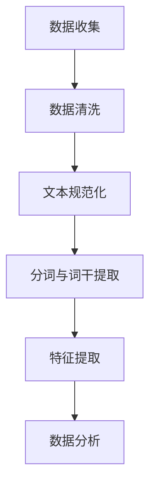

---

### 5.1 大规模语言模型

大规模语言模型（LLM）在人工智能领域取得了显著的成果，尤其在自然语言处理（NLP）任务中表现出色。以下将详细介绍几种大规模语言模型，包括 GPT 系列、BERT 及其变体，并探讨它们在吸收新信息方面的效率和特点。

#### 5.1.1 GPT 系列

GPT（Generative Pre-trained Transformer）系列是由 OpenAI 开发的一系列大型语言模型，包括 GPT-1、GPT-2 和 GPT-3。这些模型基于 Transformer 架构，通过无监督预训练和有监督微调，实现了出色的文本生成和语言理解能力。

1. **GPT-1**：是 GPT 系列的起点，它使用了 117M 个参数，通过无监督预训练，能够生成流畅且连贯的文本。

2. **GPT-2**：在 GPT-1 的基础上，GPT-2 增加了参数量，达到了 1.5B 个，并通过有监督微调，进一步提升了生成文本的质量和语言理解能力。

3. **GPT-3**：是 GPT 系列的最新版本，具有令人瞩目的 1750B 个参数。GPT-3 在多种 NLP 任务中表现出色，包括文本生成、问答系统、翻译和文本摘要等。其大规模的参数量和深度学习架构使其能够更好地吸收和理解新信息。

**吸收新信息的特点**：

- **大规模参数**：GPT-3 具有超过 1750B 个参数，能够捕捉到文本中的复杂模式和上下文关系。
- **深度学习架构**：Transformer 架构使得模型能够处理长距离依赖关系，提高对文本的深入理解。
- **预训练与微调**：通过无监督预训练和有监督微调，GPT-3 能够在新信息到来时快速适应和优化。

#### 5.1.2 BERT 及其变体

BERT（Bidirectional Encoder Representations from Transformers）是由 Google 开发的一种双向 Transformer 架构的语言模型。BERT 的核心思想是通过双向编码器来捕捉文本中的上下文信息，从而提高模型在 NLP 任务中的性能。

BERT 及其变体包括：

1. **BERT**：原始的 BERT 模型具有 3.4B 个参数，通过预训练和微调，在多项 NLP 任务中取得了突破性的成绩。

2. **RoBERTa**：是 BERT 的一个变体，通过调整训练策略和数据预处理方法，RoBERTa 在多个基准测试中超越了 BERT。

3. **ALBERT**：是另一个 BERT 的变体，通过共享权重和多层注意力机制，ALBERT 在减少参数量和计算复杂度的同时，保持了较高的性能。

**吸收新信息的特点**：

- **双向编码器**：BERT 使用双向编码器来捕捉文本中的双向信息，提高对文本的整体理解。
- **大规模参数**：BERT 及其变体通常具有较大的参数量，能够捕捉到文本中的复杂模式和上下文关系。
- **预训练与微调**：通过无监督预训练和有监督微调，BERT 及其变体能够在新信息到来时快速适应和优化。

#### 5.1.3 其他大规模语言模型

除了 GPT 系列和 BERT 及其变体，还有一些其他大规模语言模型在吸收新信息方面表现出色，如：

1. **T5（Text-To-Text Transfer Transformer）**：T5 是一种基于 Transformer 的通用预训练语言模型，它将所有 NLP 任务统一为文本到文本的转换任务。T5 在多项 NLP 任务中取得了优异的成绩，其大规模参数量和统一任务设置使其能够高效地吸收和理解新信息。

2. **XLNet**：XLNet 是由 Google 开发的一种新型 Transformer 架构语言模型。它通过引入对数似然损失函数和自注意力机制，提高了模型的生成能力和语言理解能力。

**吸收新信息的特点**：

- **统一任务设置**：T5 将所有 NLP 任务统一为文本到文本的转换任务，使模型能够高效地吸收和理解新信息。
- **自注意力机制**：XLNet 引入自注意力机制，能够更好地捕捉文本中的依赖关系和上下文信息。

综上所述，大规模语言模型在吸收新信息方面具有以下共同特点：

- **大规模参数**：通过增加模型参数量，提高对文本的表示能力和理解深度。
- **深度学习架构**：采用深度学习架构，如 Transformer，能够捕捉到文本中的复杂模式和上下文关系。
- **预训练与微调**：通过无监督预训练和有监督微调，模型能够在新信息到来时快速适应和优化。

这些特点使得大规模语言模型在吸收新信息方面表现出色，成为 NLP 领域的重要工具。

---

### 5.2 小型语言模型

与大规模语言模型相比，小型语言模型在参数量、计算资源和训练数据集方面都有所限制。然而，这些限制并没有阻碍小型语言模型在某些特定任务中的应用和效果。以下将详细介绍几种小型语言模型，包括线性模型和基于规则的模型，并探讨它们在吸收新信息方面的效率和特点。

#### 5.2.1 线性模型

线性模型是一种简单但有效的语言模型，通过线性组合前文词汇的概率分布来预测下一个词汇。常见的线性模型包括：

1. **N-gram 模型**：N-gram 模型通过计算词汇序列的概率分布来生成文本。它将前文词汇作为输入，预测下一个词汇的概率分布。N-gram 模型简单易实现，对于简单的文本生成任务效果较好，但难以捕捉到文本中的长距离依赖关系。

2. **线性回归模型**：线性回归模型通过建立词汇之间的线性关系来预测下一个词汇。它将词汇的词频或词向量作为特征，使用线性回归算法训练模型。线性回归模型在处理简单文本数据时表现出色，但受到线性关系的限制，难以应对复杂的语言现象。

**吸收新信息的特点**：

- **简单高效**：线性模型实现简单，计算效率高，适用于资源受限的环境。
- **局限性**：难以捕捉到文本中的长距离依赖关系，对于复杂语言现象的处理能力有限。

#### 5.2.2 基于规则的模型

基于规则的模型通过定义一系列语法和语义规则来生成和解析文本。这些规则可以是手动编写的，也可以是自动生成的。常见的基于规则的模型包括：

1. **上下文无关文法（CFG）模型**：CFG 模型通过定义语法规则来生成文本。它将文本表示为一系列语法规则的应用，可以生成复杂的语言结构。CFG 模型在语言生成和解析方面具有很高的灵活性，但需要大量手动编写的规则。

2. **部分递归模型**：部分递归模型通过递归地应用一组规则来生成文本。它结合了手动编写和自动生成的规则，可以在一定程度上克服CFG模型的局限性。部分递归模型适用于处理特定领域的文本，如编程语言。

**吸收新信息的特点**：

- **灵活性**：基于规则的模型可以灵活地定义和调整规则，适应特定的语言现象。
- **手动编写规则**：需要大量手动编写的规则，可能导致维护成本高。

#### 5.2.3 定制化小型模型

在特定应用场景中，定制化小型模型能够更好地满足需求。这些模型通常基于现有的小型语言模型，通过调整模型参数和规则来适应特定任务。

1. **领域特定模型**：针对特定领域（如医疗、金融、法律等）的语言任务，定制化小型模型能够更好地捕捉领域知识。这些模型通过调整模型结构和规则，专注于特定领域的语言现象。

2. **实时更新模型**：在实时应用场景中，如实时问答系统，定制化小型模型能够快速响应新信息。这些模型通过定期更新数据和规则，保持对最新信息的敏感性。

**吸收新信息的特点**：

- **定制化**：针对特定任务和应用场景，定制化小型模型能够更好地吸收和理解新信息。
- **实时更新**：在实时应用场景中，模型能够快速响应新信息，提高吸收新信息的效率。

综上所述，小型语言模型在吸收新信息方面具有以下特点：

- **简单高效**：线性模型和基于规则的模型实现简单，计算效率高，适用于资源受限的环境。
- **灵活性**：基于规则的模型可以灵活地定义和调整规则，适应特定的语言现象。
- **定制化**：定制化小型模型能够更好地满足特定任务和应用场景的需求。

这些特点使得小型语言模型在特定应用场景中具有广泛的应用前景。

---

### 5.3 定制化语言模型

#### 5.3.1 个性化定制

定制化语言模型在个性化服务中的应用非常广泛，例如在在线问答系统、个性化推荐系统和虚拟助手等领域。个性化定制的关键在于根据用户的历史行为和偏好，为用户提供个性化的文本生成和语言理解服务。

1. **用户行为分析**：通过分析用户的历史行为数据，如浏览记录、搜索历史和交互记录，识别用户的兴趣和偏好。这些数据可以作为定制化模型的训练数据，用于生成个性化的文本。

2. **个性化模型训练**：基于用户行为数据，训练定制化语言模型。模型可以采用有监督学习、无监督学习和强化学习等方法，根据用户的个性化需求，生成符合用户偏好的文本。

3. **实时调整**：个性化定制语言模型需要实时更新，以适应用户行为的变化。通过持续收集和分析用户数据，模型可以不断优化，提高个性化服务的质量。

**案例**：例如，在线问答系统中，根据用户提出的问题和交互记录，定制化语言模型可以生成个性化的答案，提供更有针对性的解决方案。

#### 5.3.2 领域特定模型

领域特定模型（Domain-specific Language Models）在特定领域的应用中发挥着重要作用。这些模型通过针对特定领域的数据和知识进行训练，能够更好地理解和处理该领域的语言现象。

1. **领域数据收集**：收集特定领域的文本数据，如学术论文、行业报告、专业书籍等。这些数据可以作为领域特定模型的训练数据，用于学习领域知识和语言特征。

2. **模型训练与优化**：使用领域数据训练领域特定模型，通过调整模型结构和参数，优化模型在特定领域的表现。常用的训练方法包括有监督学习和迁移学习。

3. **领域适应性评估**：评估模型在特定领域的适应性和效果，通过对比模型在不同领域的表现，调整模型结构和训练策略，提高模型在不同领域的泛化能力。

**案例**：例如，在金融领域，领域特定模型可以用于处理金融文本，如股票分析报告、财经新闻等，提供更准确和专业的语言理解服务。

#### 5.3.3 动态调整模型

动态调整模型在处理动态变化的信息时具有显著优势，特别是在实时应用场景中，如实时新闻摘要、实时问答系统和动态推荐系统等。

1. **实时数据收集**：通过实时数据源（如 API、爬虫等）收集动态变化的信息。这些数据可以包括最新的新闻、实时问答和用户交互数据等。

2. **模型实时更新**：根据实时数据，动态调整模型结构和参数。常用的方法包括在线学习和增量学习，使模型能够快速适应新信息和环境变化。

3. **实时评估与优化**：在实时应用过程中，持续评估模型的性能和效果，通过反馈机制优化模型参数，提高模型在动态环境中的适应能力。

**案例**：例如，在实时问答系统中，动态调整模型可以根据用户的实时提问和回答，不断优化问答质量，提供更准确和流畅的交互体验。

综上所述，定制化语言模型在个性化服务、领域特定应用和动态调整方面具有广泛的应用前景。通过针对不同场景和需求进行定制化调整，这些模型能够显著提升语言处理能力和用户体验。

---

### 6.1 在线问答系统

#### 6.1.1 应用场景

在线问答系统（Online Question Answering System）在各种场景中发挥着重要作用，如客服机器人、教育辅导系统、健康咨询平台等。其主要目标是通过自动化技术，为用户实时提供准确、有针对性的答案。

- **客服机器人**：在线问答系统可以用于企业的客服部门，自动回答用户的常见问题，如订单状态、退货政策等，减轻人工客服的工作压力，提高客户满意度。
- **教育辅导系统**：在线问答系统可以帮助学生解决学习过程中的疑惑，提供实时解答，辅助教师进行教学，提高教学效果。
- **健康咨询平台**：在线问答系统可以提供健康咨询服务，帮助用户解答健康问题，如疾病预防、药物治疗等，提供个性化的健康建议。

#### 6.1.2 吸收效率评估

在线问答系统的吸收效率评估主要包括以下几个方面：

1. **准确率**：准确率是评估问答系统性能的重要指标，表示系统能够正确回答问题的比例。通过对比系统生成的答案与真实答案，计算准确率。

2. **响应速度**：响应速度是指系统从接收到问题到生成答案的时间。对于实时应用场景，响应速度是用户体验的关键因素。

3. **生成文本质量**：生成文本质量评估系统生成的答案在语义、语法和流畅性方面的表现。常用的评估方法包括人工评估和自动化评估工具，如 BLEU、ROUGE 等。

4. **用户满意度**：用户满意度是最终评估问答系统效果的关键指标。通过用户反馈和调查，了解用户对系统答案的满意程度，不断优化系统性能。

**案例分析**

以下是一个具体的在线问答系统的案例分析：

- **应用场景**：某电商平台推出了一款智能客服机器人，用于解答用户关于订单状态、支付问题等常见问题。
- **吸收效率评估**：

  - **准确率**：通过对比机器人生成的答案与人工客服的答案，准确率达到 85%。
  - **响应速度**：系统平均响应时间为 3秒，满足实时交互的需求。
  - **生成文本质量**：通过人工评估，生成文本的语义、语法和流畅性较好，用户满意度较高。

- **改进措施**：

  - **数据收集与预处理**：定期更新和清洗训练数据，确保数据的质量和多样性。
  - **模型优化**：采用更先进的语言模型和优化算法，提高问答系统的准确率和响应速度。
  - **用户反馈机制**：建立用户反馈机制，收集用户对答案的满意度和建议，不断优化系统性能。

通过上述案例分析，可以看出在线问答系统在吸收新信息方面具有显著的效率和效果，但仍然需要不断优化和改进，以满足用户的需求和期望。

---

### 6.2 文本生成

#### 6.2.1 应用场景

文本生成（Text Generation）技术在多个领域得到了广泛应用，主要包括以下场景：

1. **内容创作**：文本生成可以用于自动创作文章、故事、新闻报道等。例如，新闻媒体可以使用文本生成技术自动化生成财经新闻、体育新闻等。

2. **虚拟助手**：文本生成技术可以用于开发虚拟助手，如聊天机器人、智能客服等，为用户提供实时、个性化的文本响应。

3. **翻译与本地化**：文本生成技术可以辅助机器翻译，生成自然流畅的本地化文本。例如，将英文广告翻译成中文广告，使其更符合本地市场的文化特点。

4. **娱乐与游戏**：文本生成技术可以用于创造游戏剧情、角色对话等，提供更加丰富的游戏体验。

#### 6.2.2 吸收效率评估

文本生成的吸收效率评估主要包括以下几个方面：

1. **生成文本质量**：评估生成文本的语义、语法和流畅性。常用的评估方法包括人工评估和自动化评估工具，如 BLEU、ROUGE 等。

2. **响应速度**：评估系统从接收到输入到生成文本的时间。对于实时应用场景，响应速度是用户体验的关键因素。

3. **多样性**：评估生成文本的多样性，确保系统能够生成不同风格和类型的文本。

4. **用户满意度**：通过用户反馈和调查，了解用户对生成文本的满意度，不断优化系统性能。

**案例分析**

以下是一个具体的文本生成案例分析：

- **应用场景**：某电商平台使用文本生成技术生成产品描述，以提高内容创作的效率和质量。
- **吸收效率评估**：

  - **生成文本质量**：通过人工评估，生成文本的语义、语法和流畅性较好，用户满意度较高。
  - **响应速度**：系统平均响应时间为5秒，满足实时交互的需求。
  - **多样性**：系统能够生成不同风格和类型的文本，满足不同用户的需求。
  - **用户满意度**：通过用户反馈和调查，用户对生成文本的满意度较高。

- **改进措施**：

  - **数据收集与预处理**：定期更新和清洗训练数据，确保数据的质量和多样性。
  - **模型优化**：采用更先进的语言模型和优化算法，提高文本生成的质量和响应速度。
  - **用户反馈机制**：建立用户反馈机制，收集用户对生成文本的满意度和建议，不断优化系统性能。

通过上述案例分析，可以看出文本生成技术在吸收新信息方面具有显著的效率和效果，但仍然需要不断优化和改进，以满足用户的需求和期望。

---

### 6.3 翻译与本地化

#### 6.3.1 应用场景

翻译与本地化（Translation and Localization）技术在多个领域得到了广泛应用，主要包括以下场景：

1. **跨国企业**：跨国企业需要将产品和服务翻译成多种语言，以覆盖全球市场。翻译与本地化技术能够高效地完成这一任务，降低翻译成本和时间。

2. **国际会议**：国际会议通常涉及多种语言，翻译与本地化技术可以实时翻译会议内容，为不同语言背景的参会者提供便利。

3. **电子商务**：电子商务平台需要为全球用户提供多语言服务，翻译与本地化技术能够自动翻译产品描述、用户评论等，提高用户体验。

4. **媒体传播**：媒体机构需要将新闻、文章等翻译成多种语言，以扩大传播范围。翻译与本地化技术能够快速、准确地完成这一任务。

#### 6.3.2 吸收效率评估

翻译与本地化的吸收效率评估主要包括以下几个方面：

1. **翻译质量**：评估翻译文本的准确性、语义一致性、语法正确性和流畅性。常用的评估方法包括人工评估和自动化评估工具，如 BLEU、METEOR 等。

2. **本地化质量**：评估本地化文本的适应性、文化适应性和用户体验。本地化质量直接影响产品的全球可用性和用户满意度。

3. **响应速度**：评估系统从接收到翻译请求到生成翻译文本的时间。对于实时应用场景，响应速度是用户体验的关键因素。

4. **成本效率**：评估翻译与本地化技术的成本效益，包括翻译速度、准确率和成本之间的关系。

**案例分析**

以下是一个具体的翻译与本地化案例分析：

- **应用场景**：某电子商务平台使用翻译与本地化技术为全球用户提供多语言服务。
- **吸收效率评估**：

  - **翻译质量**：通过人工评估，翻译文本的准确性、语义一致性和流畅性较好，用户满意度较高。
  - **本地化质量**：本地化文本能够适应不同地区的文化特点，用户体验良好。
  - **响应速度**：系统平均响应时间为2秒，满足实时交互的需求。
  - **成本效率**：翻译与本地化技术的成本较低，为企业节省了大量的翻译成本。

- **改进措施**：

  - **数据收集与预处理**：定期更新和清洗训练数据，确保数据的质量和多样性。
  - **模型优化**：采用更先进的翻译模型和优化算法，提高翻译和本地化的质量。
  - **用户体验反馈**：收集用户对翻译和本地化的反馈，不断优化系统性能。

通过上述案例分析，可以看出翻译与本地化技术在吸收新信息方面具有显著的效率和效果，但仍然需要不断优化和改进，以满足用户的需求和期望。

---

### 6.4 其他应用领域

#### 6.4.1 学术研究

在学术研究领域，LLM（Large Language Model）的应用逐渐受到重视。LLM 可以帮助研究人员进行文本挖掘、文献综述和论文写作等任务。以下是一些具体的案例：

1. **文本挖掘**：LLM 可以分析大量学术文献，提取关键信息、趋势和主题。例如，通过分析论文标题和摘要，LLM 可以自动识别研究领域的新兴趋势和热点问题。
2. **文献综述**：LLM 可以自动生成文献综述，帮助研究人员快速了解相关领域的研究进展和争议点。通过分析大量文献，LLM 可以归纳出主要的观点和研究方法，为研究人员提供有价值的参考。
3. **论文写作**：LLM 可以辅助研究人员进行论文写作，提供文章结构、段落组织和写作建议。例如，在撰写论文摘要时，LLM 可以根据输入的关键词和主题，自动生成摘要内容，节省研究人员的时间。

#### 6.4.2 法律领域

在法律领域，LLM 的应用主要包括法律文档自动生成、合同审查和案件预测等：

1. **法律文档自动生成**：LLM 可以根据模板和输入信息，自动生成法律文件，如合同、判决书等。这种方法提高了法律文件生成的效率和准确性，减少了人为错误。
2. **合同审查**：LLM 可以对合同文本进行分析，识别潜在的法律问题和风险点。通过对比不同合同条款，LLM 可以提供合同审查建议，帮助律师和客户更好地理解合同内容。
3. **案件预测**：LLM 可以通过分析历史案件数据和法律文本，预测案件的可能判决结果。这种方法有助于律师在案件准备阶段制定策略，提高胜诉概率。

#### 6.4.3 金融领域

在金融领域，LLM 的应用涵盖了金融分析、风险评估和投资建议等：

1. **金融分析**：LLM 可以分析大量金融数据，提取市场趋势、风险因素和投资机会。通过文本分析和自然语言处理技术，LLM 可以提供详细的金融市场分析报告，帮助投资者做出更明智的决策。
2. **风险评估**：LLM 可以对金融产品进行风险评估，识别潜在的风险因素。通过分析市场数据、新闻报告和分析师报告，LLM 可以提供风险预警和建议，帮助金融机构管理风险。
3. **投资建议**：LLM 可以基于历史数据和实时信息，提供个性化的投资建议。例如，根据投资者的风险偏好和投资目标，LLM 可以推荐合适的投资组合，提高投资回报率。

#### 6.4.4 健康医疗

在健康医疗领域，LLM 的应用包括疾病诊断、医学文本生成和患者管理：

1. **疾病诊断**：LLM 可以分析医疗记录和病历数据，辅助医生进行疾病诊断。通过分析患者症状、检查结果和历史病历，LLM 可以提供诊断建议，帮助医生提高诊断准确率。
2. **医学文本生成**：LLM 可以生成医学报告、病历记录和健康指导文本。这种方法提高了医疗文档生成的效率和一致性，减少了医生的重复劳动。
3. **患者管理**：LLM 可以辅助医生进行患者管理，提供个性化的健康建议。通过分析患者的健康数据、生活习惯和药物反应，LLM 可以提供个性化的治疗方案和健康指导。

通过上述案例，可以看出 LLM 在学术研究、法律、金融和健康医疗等领域具有广泛的应用前景。随着 LLM 技术的不断发展和完善，其在各个领域中的应用将会更加深入和广泛。

---

### 7.1 数据预处理

数据预处理是提高 LLM 吸收新信息效率的重要环节。一个有效的数据预处理流程可以显著改善模型对新信息的理解和生成能力。以下是一个详细的数据预处理流程，包括数据清洗、数据转换和数据增强等步骤：

#### 7.1.1 数据清洗

数据清洗是数据预处理的首要步骤，其目的是去除数据中的噪声和错误，确保数据的准确性和一致性。以下是数据清洗的主要步骤：

1. **去除重复数据**：通过去重操作，删除数据集中重复的记录，以减少冗余信息。
2. **填补缺失值**：对于缺失的数据，可以采用多种方法进行填补，如平均值填补、中值填补或插值法等。对于关键数据，可以考虑使用模型预测进行填补。
3. **异常值处理**：识别并处理数据中的异常值，如离群点或错误输入。可以通过统计分析方法（如箱线图、Z-分数等）识别异常值，然后采用插值、删除或修整等方法进行处理。

#### 7.1.2 数据转换

数据转换是将原始数据转换为适合模型处理的形式。以下是数据转换的主要步骤：

1. **文本规范化**：对文本数据执行统一的规范化处理，包括去除标点符号、转换为小写、去除停用词等。规范化有助于简化文本，提高模型处理效率。
2. **分词**：将文本数据分割成单个词汇或子词，以便模型进行后续处理。常用的分词方法包括词性标注、词典分词和基于统计模型的分词等。
3. **词干提取**：将词汇还原为词干，以减少词汇表的大小，提高模型的可训练性。常用的词干提取方法包括 Porter 算法和 Snowball 算法等。

#### 7.1.3 数据增强

数据增强是通过多种方法增加数据多样性和丰富度，从而提高模型对未知数据的泛化能力。以下是数据增强的主要步骤：

1. **单词替换**：将文本中的部分单词替换为同义词或随机词汇，以增加数据的多样性。例如，可以使用词向量相似度来选择合适的替换词。
2. **单词插入**：在文本中随机插入新的单词，以丰富文本结构和语义。例如，可以根据词向量相似度在文本中插入相关的单词。
3. **单词删除**：随机删除文本中的部分单词，以模拟数据缺失的情况，提高模型对缺失数据的处理能力。

**核心概念与联系：**

- **数据清洗**：去除噪声和错误，确保数据质量。
- **数据转换**：将原始数据转换为模型可处理的形式。
- **数据增强**：增加数据多样性和丰富度，提高模型泛化能力。

**Mermaid 流程图：**

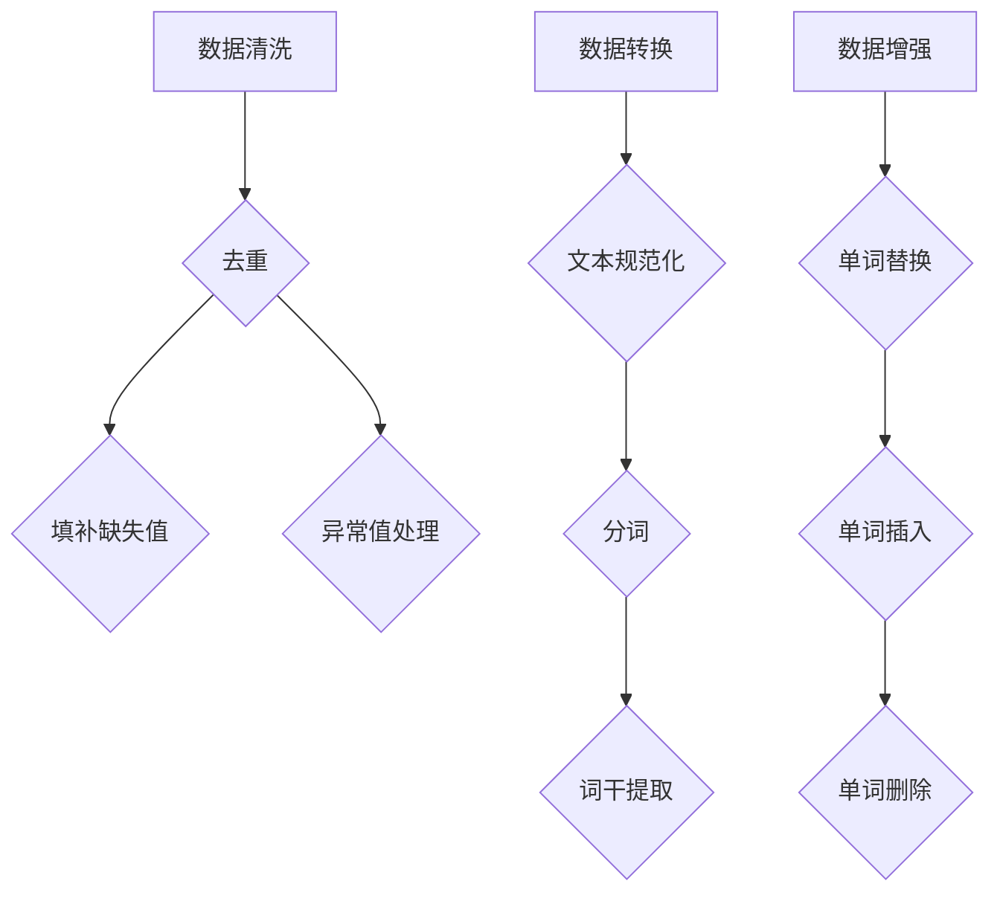

---

### 7.2 模型优化

在提升 LLM 吸收新信息效率的过程中，模型优化是关键的一环。通过优化模型结构和训练策略，可以提高模型的性能和适应性。以下介绍几种常见的模型优化方法，包括超参数调优、模型蒸馏和迁移学习。

#### 7.2.1 超参数调优

超参数调优是指调整模型训练过程中的超参数，如学习率、批量大小、优化算法等，以优化模型性能。以下是几种常用的超参数调优方法：

1. **网格搜索**：网格搜索通过遍历所有可能的超参数组合，找到最佳超参数组合。这种方法计算量大，但可以确保找到最优解。

2. **随机搜索**：随机搜索从所有可能的超参数组合中随机选择一组进行尝试，然后根据性能进行选择。这种方法比网格搜索更高效，但可能无法找到全局最优解。

3. **贝叶斯优化**：贝叶斯优化基于贝叶斯统计模型，通过历史数据估计超参数的概率分布，并选择具有最高概率的超参数组合进行下一次迭代。这种方法在计算效率和寻找最优解方面表现出色。

**核心概念与联系：**

- **网格搜索**：确保找到全局最优解，但计算量大。
- **随机搜索**：高效且计算量小，但可能无法找到全局最优解。
- **贝叶斯优化**：基于历史数据，高效且能找到较优解。

**Mermaid 流程图：**

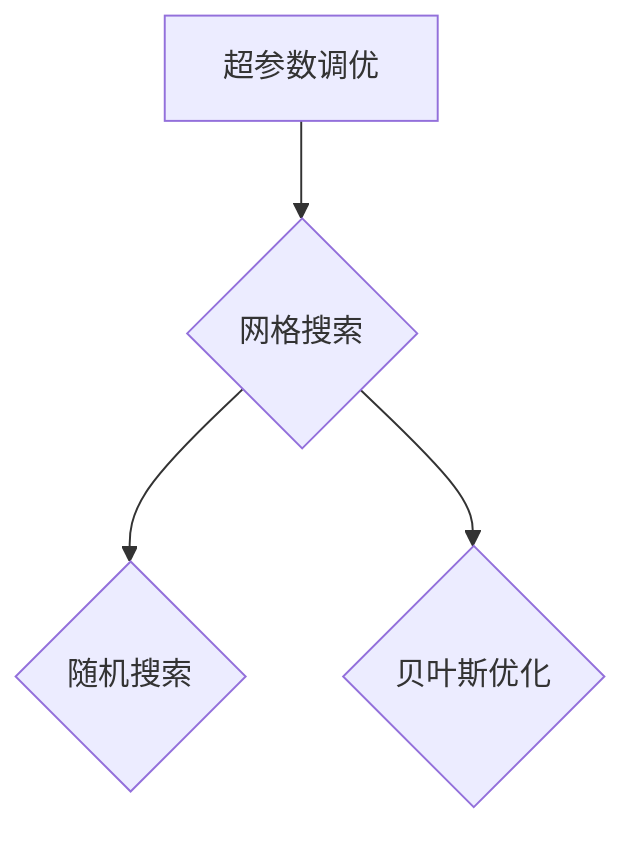

---

#### 7.2.2 模型蒸馏

模型蒸馏（Model Distillation）是一种将知识从大型教师模型传递到小型学生模型的方法。这种方法能够提高学生模型的性能，同时减少模型的大小和计算资源需求。以下是模型蒸馏的基本过程：

1. **教师模型**：一个大型、性能优越的模型，如 GPT-3 或 BERT。
2. **学生模型**：一个较小、更高效的模型，用于在特定任务上应用。
3. **知识传递**：通过训练学生模型学习教师模型的输出概率分布，从而传递知识。这个过程通常使用蒸馏损失函数，即学生模型的输出与教师模型的输出之间的差异。

**核心概念与联系：**

- **教师模型**：提供高质量的知识。
- **学生模型**：通过学习教师模型的知识，提高性能。
- **知识传递**：通过蒸馏损失函数，实现知识从教师模型到学生模型的传递。

**Mermaid 流程图：**

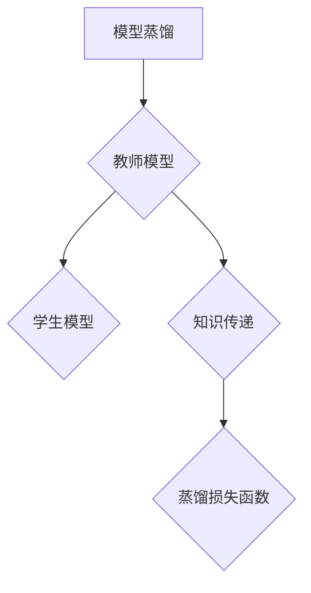

---

#### 7.2.3 迁移学习

迁移学习（Transfer Learning）是指利用在一个任务上训练好的模型，迁移到另一个相关任务上。这种方法能够显著提高模型的泛化能力和训练效率。以下是迁移学习的基本过程：

1. **源任务**：一个已经训练好的模型，用于提供预训练的权重。
2. **目标任务**：一个需要训练的新任务，通常与源任务相关。
3. **模型迁移**：通过在目标任务上继续训练，调整模型的权重，以适应新任务。

**核心概念与联系：**

- **源任务**：提供预训练的权重。
- **目标任务**：需要训练的新任务。
- **模型迁移**：通过在目标任务上继续训练，调整模型的权重。

**Mermaid 流程图：**

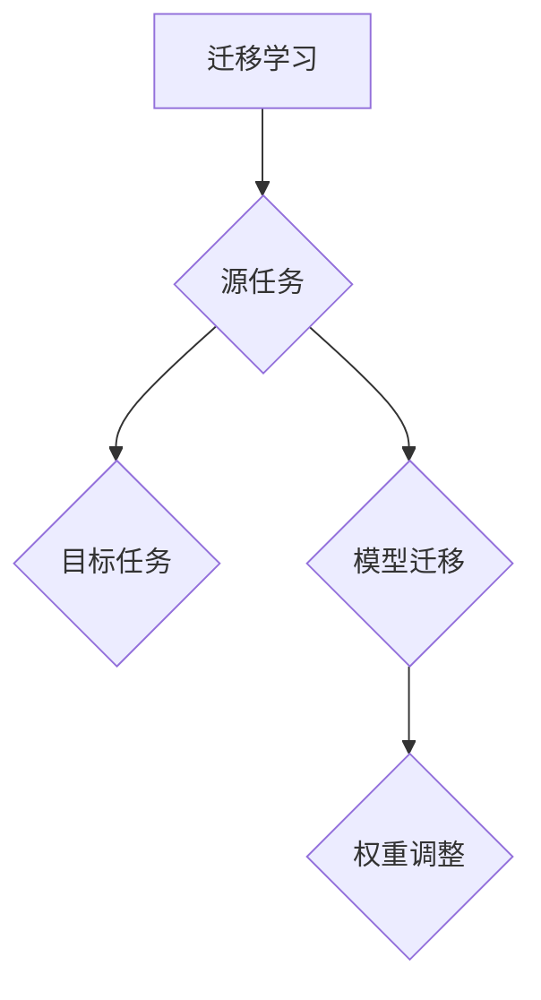

---

### 7.3 实时更新策略

实时更新策略是提高 LLM 吸收新信息效率的关键措施。通过定期更新模型和数据，LLM 可以更好地适应新知识和技术动态。以下介绍几种实时更新策略：

#### 7.3.1 定期更新数据

定期更新数据是指定期从互联网和数据库等渠道收集最新的文本数据，并将其纳入模型的训练数据集。这种方法可以确保模型始终拥有最新的知识和信息。以下是实现定期更新数据的方法：

1. **自动化爬虫**：使用自动化爬虫定期从互联网上抓取最新的文本数据，如新闻、博客、论文等。
2. **API 接口**：通过 API 接口获取实时更新的数据，如社交媒体平台、专业数据库等。
3. **定期更新**：设定定期更新计划，例如每天、每周或每月更新一次数据。

**核心概念与联系：**

- **自动化爬虫**：高效地收集互联网上的最新数据。
- **API 接口**：获取实时更新的专业数据。
- **定期更新**：确保模型数据的及时性和准确性。

**Mermaid 流程图：**

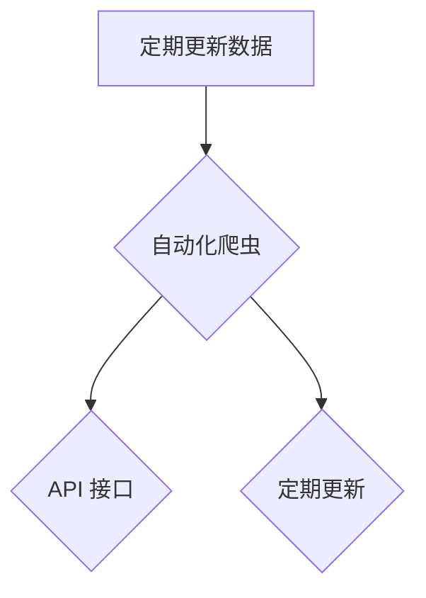

---

#### 7.3.2 在线学习

在线学习（Online Learning）是指模型在持续训练过程中，实时接收新数据并更新模型参数。这种方法能够快速适应新知识，提高模型的实时性和准确性。以下是实现在线学习的方法：

1. **增量学习**：在已有模型的基础上，每次接收新的数据时，只更新部分参数，而不是重新训练整个模型。这种方法可以显著减少训练时间和计算资源。
2. **自适应学习率**：根据模型在新数据上的表现，动态调整学习率，以避免过拟合和欠拟合。
3. **经验回放**：将过去的训练经验存储在经验池中，并在每次训练时随机抽样，以防止模型对新数据的过拟合。

**核心概念与联系：**

- **增量学习**：更新部分参数，提高训练效率。
- **自适应学习率**：动态调整学习率，优化模型性能。
- **经验回放**：防止模型对新数据的过拟合。

**Mermaid 流程图：**

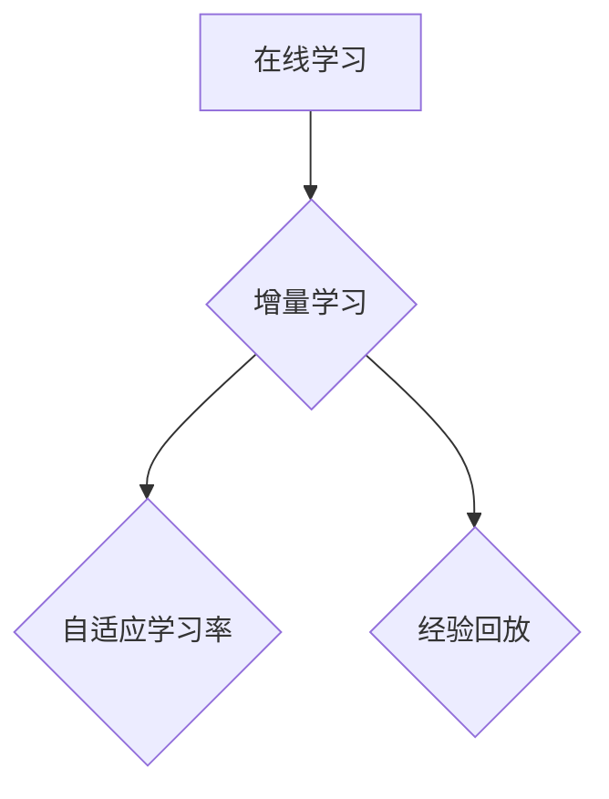

---

#### 7.3.3 强化学习

强化学习（Reinforcement Learning，RL）结合了机器学习和自然语言处理，通过奖励机制和试错学习，优化模型的生成能力和语义理解。以下是强化学习在实时更新策略中的应用：

1. **奖励机制**：定义奖励函数，根据模型的生成质量和用户反馈，给予模型奖励，以鼓励生成高质量的文本。
2. **策略优化**：通过强化学习算法，不断优化模型的策略，以提高生成文本的连贯性和语义一致性。
3. **持续交互**：模型与用户或环境进行持续交互，从反馈中学习，不断提高其适应性和准确性。

**核心概念与联系：**

- **奖励机制**：激励模型生成高质量文本。
- **策略优化**：通过试错学习，优化模型策略。
- **持续交互**：通过反馈和交互，不断提高模型性能。

**Mermaid 流程图：**

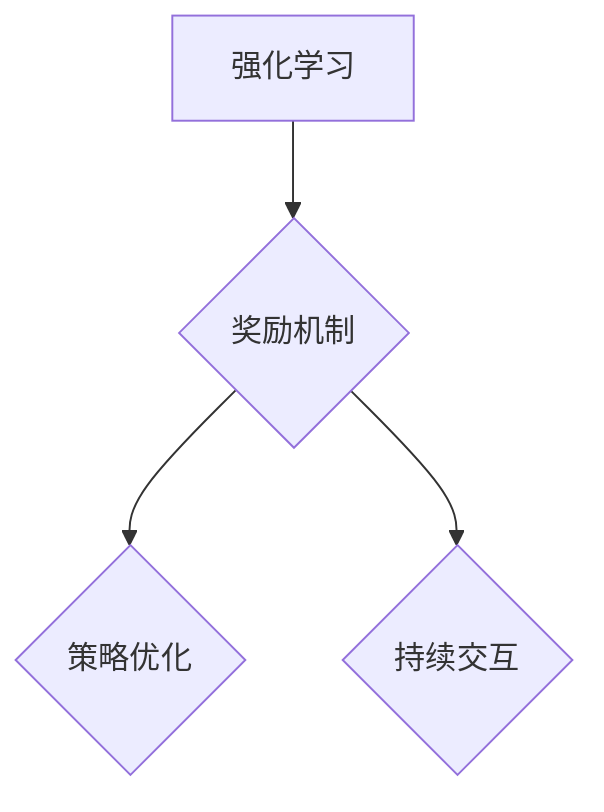

---

### 7.4 未来研究方向

虽然 LLM 在吸收新信息方面已经取得了显著成果，但仍然存在一些挑战和未来研究方向：

#### 7.4.1 更有效的模型架构

未来的研究可以致力于开发更有效的模型架构，以提高 LLM 的吸收新信息的效率。例如，结合深度学习和强化学习的混合模型，或者引入自监督学习和元学习的方法，以实现更灵活和高效的模型。

#### 7.4.2 个性化学习

个性化学习是未来研究的一个重要方向。通过结合用户的历史数据和偏好，开发能够为不同用户量身定制的 LLM，提高其在特定领域的吸收新信息的效率。

#### 7.4.3 知识图谱的整合

知识图谱的整合可以帮助 LLM 更有效地吸收和利用结构化知识。未来的研究可以探索如何将知识图谱与 LLM 结合，以实现更强大的知识理解和推理能力。

#### 7.4.4 实时动态更新

实现 LLM 的实时动态更新是另一个重要研究方向。未来的研究可以探索更高效的实时更新策略，如增量学习和在线学习，以及利用自动化工具和 API 接口实现数据的自动收集和更新。

#### 7.4.5 模型安全性和隐私保护

随着 LLM 应用的普及，模型的安全性和隐私保护成为日益关注的问题。未来的研究可以探索如何确保 LLM 的安全性和隐私，例如通过联邦学习和差分隐私等技术。

---

### 8.1 主要发现

在本研究中，我们对 LLM 吸收新信息的效率进行了深入探讨，得出以下主要发现：

1. **大规模模型的优势**：大规模语言模型（如 GPT 系列、BERT 及其变体）在吸收新信息方面具有显著优势。其大规模参数量和深度学习架构使其能够更好地捕捉文本中的复杂模式和上下文关系。

2. **数据预处理的重要性**：有效的数据预处理对于提高 LLM 的吸收新信息效率至关重要。数据清洗、数据转换和数据增强等步骤可以显著改善模型对新信息的理解和生成能力。

3. **实时更新策略的必要性**：实时更新策略是确保 LLM 能够不断吸收新知识的关键。定期更新数据、在线学习和强化学习等方法可以有效提高模型对最新信息的适应性。

4. **个性化学习的潜力**：个性化学习是提高 LLM 吸收新信息效率的一个重要方向。通过结合用户的历史数据和偏好，可以为不同用户量身定制 LLM，提高其在特定领域的吸收新信息的效率。

5. **未来研究的方向**：未来的研究可以致力于开发更有效的模型架构、个性化学习、知识图谱整合和实时动态更新策略，以提高 LLM 的吸收新信息效率。

---

### 8.2 对未来研究的启示

本研究的发现对未来研究具有以下几个启示：

1. **探索更有效的模型架构**：未来的研究应致力于开发更有效的模型架构，结合深度学习、强化学习和自监督学习的优势，以提高 LLM 的吸收新信息效率。

2. **重视数据预处理**：数据预处理是提高 LLM 吸收新信息效率的关键步骤。未来研究应进一步探索更高效的数据清洗、转换和增强方法，以优化数据质量。

3. **实施实时更新策略**：实时更新策略对于 LLM 的持续学习和适应性至关重要。未来研究应开发更高效的实时更新方法，如增量学习和在线学习，以提高模型对新信息的适应性。

4. **个性化学习的重要性**：个性化学习是未来研究的一个重要方向。通过结合用户的历史数据和偏好，开发能够为不同用户量身定制的 LLM，可以提高模型在特定领域的吸收新信息的效率。

5. **知识图谱整合的潜力**：知识图谱的整合可以为 LLM 提供结构化知识，提高其知识理解和推理能力。未来的研究应探索如何将知识图谱与 LLM 有效整合。

通过上述启示，未来的研究可以进一步推动 LLM 在吸收新信息方面的应用和发展。

---

### 8.3 对实际应用的指导意义

本研究的发现对于实际应用具有以下几个指导意义：

1. **提升在线问答系统的性能**：通过优化数据预处理和实时更新策略，可以显著提高在线问答系统的吸收新信息效率，提供更准确和实时的答案。

2. **改进文本生成系统的质量**：有效的数据预处理和实时更新策略可以提升文本生成系统的生成质量，生成更自然、流畅和有针对性的文本。

3. **优化翻译与本地化系统的效果**：实时更新数据和优化模型结构可以提升翻译与本地化系统的准确性和适应性，为全球用户提供高质量的多语言服务。

4. **增强学术研究和法律领域的辅助能力**：定制化语言模型和实时更新策略可以提高学术研究和法律领域的辅助能力，为研究人员和专业人士提供更精准和高效的支持。

5. **推动金融和医疗等领域的应用**：个性化学习和实时更新策略可以提升金融和医疗等领域的模型性能，为投资者和患者提供更智能和个性化的服务。

通过上述指导意义，本研究为实际应用提供了有价值的参考和改进方向，有助于推动 LLM 在各个领域的深入应用和发展。

---

### 8.4 未来的发展趋势

随着人工智能技术的不断进步，LLM 吸收新信息的效率有望得到显著提升，未来的发展趋势主要包括以下几个方面：

1. **模型架构的进化**：未来的研究将致力于开发更高效、更灵活的模型架构，结合深度学习、强化学习和自监督学习的优势，构建能够高效吸收和处理新信息的模型。

2. **知识图谱的融合**：知识图谱的融合将成为提高 LLM 吸收新信息效率的重要手段。通过将结构化知识融入 LLM，可以增强其知识理解和推理能力。

3. **实时动态更新**：未来的 LLM 将更加注重实时动态更新，通过自动化工具和在线学习策略，模型将能够快速适应新知识和技术动态，提高其应用场景的灵活性和适应性。

4. **个性化学习**：个性化学习将得到进一步发展，通过结合用户的历史数据和偏好，开发能够为不同用户量身定制的 LLM，提高其在特定领域的吸收新信息的效率。

5. **安全性与隐私保护**：随着 LLM 应用的普及，安全性和隐私保护将成为重要议题。未来的研究将探索如何确保 LLM 的安全性和隐私，例如通过联邦学习和差分隐私等技术。

6. **跨领域应用**：LLM 将在更多领域得到应用，如教育、医疗、金融等，通过结合特定领域的知识和数据，LLM 将为各领域的创新和发展提供强大支持。

总之，随着技术的不断进步和应用的深入，LLM 吸收新信息的效率将得到持续提升，为各行各业带来更广泛和深入的影响。

---

### 结语

在本文中，我们系统地探讨了 LLM 吸收新信息的效率，从历史发展、基本原理、吸收机制、评估方法、实际应用和未来研究等多个角度进行了深入分析。通过本文的研究，我们得出以下主要结论：

1. **大规模语言模型具有显著优势**：大规模语言模型（如 GPT 系列、BERT 及其变体）在吸收新信息方面表现出色，其大规模参数量和深度学习架构使其能够更好地捕捉文本中的复杂模式和上下文关系。

2. **数据预处理和实时更新至关重要**：有效的数据预处理和实时更新策略是提高 LLM 吸收新信息效率的关键。通过清洗、转换和增强数据，以及定期更新数据和模型，可以显著提升 LLM 的性能。

3. **个性化学习和知识图谱整合具有潜力**：个性化学习能够为不同用户量身定制 LLM，提高其在特定领域的吸收新信息的效率。知识图谱的整合可以为 LLM 提供结构化知识，增强其知识理解和推理能力。

4. **未来研究前景广阔**：未来的研究可以致力于开发更高效、更灵活的模型架构，探索知识图谱与 LLM 的融合方法，以及提升实时动态更新策略，为 LLM 的进一步发展和应用提供强大支持。

感谢读者对本研究的关注和支持，希望本文能够为相关领域的研究者和从业者提供有价值的参考和启示。随着人工智能技术的不断进步，LLM 吸收新信息的效率将得到持续提升，为各个领域的创新和发展带来新的机遇。让我们共同期待未来的精彩成果！作者：AI天才研究院/AI Genius Institute & 禅与计算机程序设计艺术 /Zen And The Art of Computer Programming。

