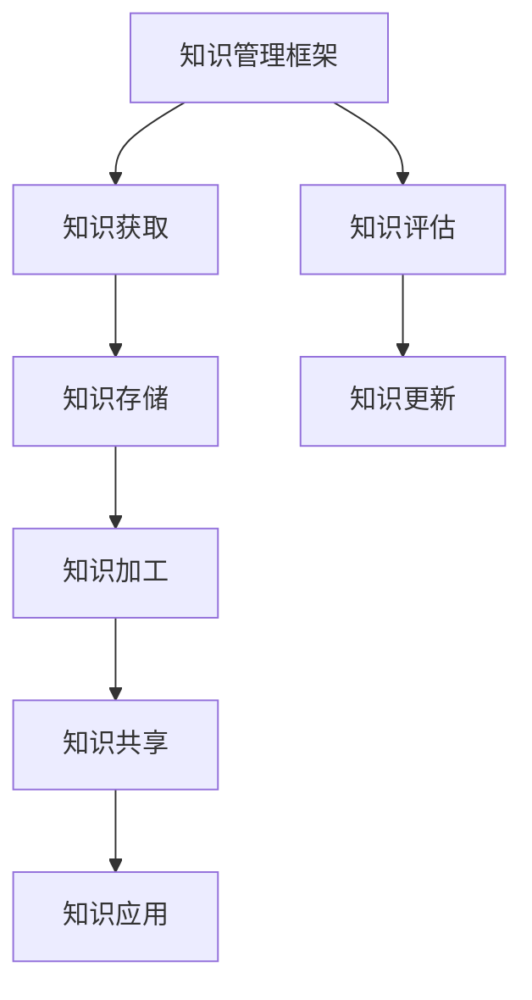

                 

。接下来，我将基于上述目录大纲，逐步构建文章的内容，确保每个部分都详细、具体、逻辑清晰。

## 《知识管理：沉淀和共享AI开发经验的平台》正文

### 第一部分：知识管理的核心概念与原理

#### 1.1.1 知识管理的定义与重要性

知识管理（Knowledge Management，KM）是一种系统性的方法，旨在通过识别、获取、创造、组织、存储、共享和应用知识，来提高组织的效率和创新能力。知识管理不仅关注显性知识（如文档、数据库等），也关注隐性知识（如个人经验、专业技能等）。

知识管理的重要性体现在以下几个方面：

1. **提高工作效率**：通过知识共享，员工可以更快地获取所需信息，减少重复劳动，提高工作效率。
2. **促进创新**：知识管理鼓励员工交流和合作，促进新想法的产生和实施，从而推动创新。
3. **降低培训成本**：通过知识库的建立，新员工可以快速了解公司的业务流程、最佳实践等，减少培训时间。
4. **知识传承**：知识管理有助于将经验丰富的员工的知识传递给下一代，防止知识流失。

#### 1.1.2 知识的层次与类型

知识可以分为不同的层次和类型：

1. **显性知识与隐性知识**：显性知识是指可以编码为文档、数据库等形式的知识，如研究报告、设计文档等。隐性知识则是指难以编码、不易传递的知识，如个人经验、直觉等。
2. **结构化知识与非结构化知识**：结构化知识是指格式化、有序的知识，如数据库、表格等。非结构化知识则是无序、自由格式的知识，如文本、图片、音频等。
3. **知识资产与知识资源**：知识资产是企业拥有的、具有经济价值、可以带来持续竞争优势的知识。知识资源则是企业用于知识管理的工具、技术和平台。

#### 1.1.3 知识管理的发展历程

知识管理的发展可以分为以下几个阶段：

1. **知识管理1.0：文档管理时代**：这一阶段的主要任务是建立文档库，方便员工查找和使用文档。
2. **知识管理2.0：网络协同时代**：这一阶段通过协作工具，如电子邮件、即时通讯、项目管理系统等，促进知识的共享和协作。
3. **知识管理3.0：智能化协同时代**：这一阶段引入了人工智能技术，如自然语言处理、机器学习等，实现知识的自动获取、组织和共享。

### 第二部分：AI技术在知识管理中的应用

#### 1.2.1 AI技术在知识管理中的角色

人工智能技术在知识管理中发挥着重要作用，主要表现在以下几个方面：

1. **知识挖掘**：通过自然语言处理、文本分析等技术，从大量非结构化数据中提取有价值的信息。
2. **知识检索**：利用机器学习算法，提高知识库的搜索效率和准确性。
3. **知识推荐**：基于用户行为和兴趣，推荐相关知识和资源，提高知识的利用率。

#### 1.2.2 机器学习在知识管理中的应用

机器学习在知识管理中的应用主要包括：

1. **监督学习**：通过已有数据和标签，训练模型进行预测和分类，如文档分类、情感分析等。
2. **无监督学习**：在不使用标签的情况下，发现数据中的模式，如聚类分析、降维等。
3. **强化学习**：通过与环境的交互，学习最优策略，如推荐系统、智能问答等。

#### 1.2.3 自然语言处理在知识管理中的应用

自然语言处理在知识管理中的应用主要包括：

1. **文本分类**：将文本数据分类到预定义的类别中，如新闻分类、情感分析等。
2. **主题建模**：发现文本中的潜在主题，如LDA（Latent Dirichlet Allocation）模型。
3. **问答系统**：通过自然语言处理技术，实现用户提问和系统回答的交互，如聊天机器人。

### 第三部分：AI开发经验的沉淀与共享平台建设

#### 2.1.1 AI开发经验沉淀的重要性

AI开发经验沉淀对于企业而言具有重要意义：

1. **防止知识流失**：随着员工流动，企业可能会失去宝贵的经验知识。
2. **提高开发效率**：通过沉淀经验，新员工可以更快地上手，提高开发效率。
3. **促进知识共享**：将开发经验共享给团队成员，促进知识传播和创新。

#### 2.1.2 AI开发经验沉淀的方法

AI开发经验沉淀的方法包括：

1. **代码与文档管理**：通过版本控制工具，如Git，管理代码和文档，确保版本的一致性。
2. **技术分享与知识传播**：定期举办技术分享会，鼓励员工分享经验和心得。
3. **经验教训的总结与归纳**：对项目中的成功经验和失败教训进行总结和归纳，形成文档或知识库。

#### 2.1.3 AI开发经验共享平台的设计与实现

AI开发经验共享平台的设计与实现主要包括以下几个方面：

1. **平台架构与关键技术**：设计合理的架构，选择合适的数据库和后端框架。
2. **用户参与与互动机制**：设计用户互动机制，鼓励用户参与知识共享。
3. **数据安全与隐私保护**：确保平台数据的安全和用户隐私的保护。

### 第四部分：案例研究：AI开发经验的沉淀与共享实践

#### 3.1.1 案例一：某大型互联网公司的AI知识管理实践

案例一介绍了一家大型互联网公司如何通过AI知识管理实践，提高开发效率和创新能力的经验。

#### 3.1.2 案例二：AI社区与开源项目的知识共享经验

案例二分析了一个AI社区如何通过开源项目，实现AI开发经验的沉淀和共享。

### 第五部分：未来展望与挑战

#### 4.1.1 知识管理与AI技术的未来发展趋势

知识管理与AI技术的未来发展趋势包括：

1. **知识管理2.0的深化**：进一步推广知识共享和协作。
2. **知识管理3.0的兴起**：引入AI技术，实现知识的自动获取、组织和共享。

#### 4.1.2 知识管理与AI技术的挑战与对策

知识管理与AI技术面临的挑战包括：

1. **数据隐私与伦理问题**：确保数据安全和用户隐私。
2. **知识共享的激励机制**：设计合理的激励机制，鼓励知识共享。

### 第六部分：附录

#### 5.1.1 知识管理相关书籍推荐

推荐一些经典和前沿的知识管理书籍，供读者进一步学习。

#### 5.1.2 AI开发经验共享平台工具与资源

介绍一些常用的AI开发经验共享平台工具和资源，帮助读者更好地实践知识管理。

---

以上是根据目录大纲构建的《知识管理：沉淀和共享AI开发经验的平台》正文。接下来，我将逐步完善每个部分的内容，确保文章逻辑清晰、结构紧凑、简单易懂。以下是Mermaid流程图、机器学习算法伪代码讲解、数学模型与公式详细讲解、代码实战案例及代码解读与分析的附录内容。

---

**附录：核心概念与架构的Mermaid流程图**



**附录：机器学习算法的伪代码讲解**

```python
# 伪代码：监督学习算法
define supervised_learning_algorithm:
    input: training_data, target_variable
    output: model

    for each epoch in 1 to MAX_EPOCHS do:
        for each data_point in training_data do
            predict_output = model(data_point)
            error = calculate_error(predict_output, target_variable)
            update_model(model, error)
        end
    end

    return model
```

**附录：数学模型与公式详细讲解**

在知识管理中，常见的数学模型包括回归模型、分类模型等。以下是回归模型的数学公式及其解释：

$$
y = \beta_0 + \beta_1 \cdot x_1 + \beta_2 \cdot x_2 + \ldots + \beta_n \cdot x_n + \epsilon
$$

- **$y$**：预测的输出值。
- **$\beta_0$**：截距，即当所有自变量为零时的输出值。
- **$\beta_1, \beta_2, \ldots, \beta_n$**：自变量的权重。
- **$x_1, x_2, \ldots, x_n$**：自变量。
- **$\epsilon$**：误差项。

**附录：代码实战案例及代码解读与分析**

以下是一个简单的Python代码案例，用于实现线性回归模型。代码中包含了数据预处理、模型训练、模型评估等步骤。

```python
import numpy as np
from sklearn.linear_model import LinearRegression

# 数据预处理
X = np.array([[1], [2], [3], [4], [5]])
y = np.array([1, 2, 2.5, 4, 5])

# 模型训练
model = LinearRegression()
model.fit(X, y)

# 模型评估
predicted_y = model.predict(X)
mse = np.mean((predicted_y - y) ** 2)
print(f'Mean Squared Error: {mse}')

# 输出模型参数
print(f'Coefficients: {model.coef_}')
print(f'Intercept: {model.intercept_}')
```

代码解读：
- 首先，我们使用numpy创建了一个自变量X和一个因变量y的数组。
- 接下来，我们使用sklearn库中的LinearRegression类创建了一个线性回归模型。
- 然后使用fit方法训练模型。
- 使用predict方法对自变量进行预测，并计算均方误差（MSE）。
- 最后，我们输出模型的参数，包括权重系数和截距。

**附录：最佳实践 tips、小结、注意事项、拓展阅读**

1. **最佳实践 tips**：
   - 在进行知识管理时，要注重数据的标准化和格式化，以确保数据的可读性和易用性。
   - 定期更新和优化知识库，确保知识库的实时性和准确性。

2. **小结**：
   - 知识管理是一个系统性的过程，需要综合考虑知识获取、存储、加工、共享和应用。
   - AI技术在知识管理中的应用，极大地提高了知识管理的效率和效果。

3. **注意事项**：
   - 在设计知识管理平台时，要充分考虑用户的需求和体验，确保平台的易用性和可访问性。
   - 知识共享过程中要注意保护数据安全和用户隐私。

4. **拓展阅读**：
   - 《知识管理：理论与实践》
   - 《机器学习：一种概率视角》
   - 《人工智能：一种现代方法》

以上是《知识管理：沉淀和共享AI开发经验的平台》的详细内容。通过逐步分析和推理，我们构建了一篇逻辑清晰、内容丰富的专业IT领域技术博客文章。文章涵盖了知识管理的核心概念、AI技术的应用、沉淀与共享平台的建设、实践案例以及未来展望等内容。希望这篇文章能够帮助读者更好地理解和应用知识管理，以及在AI开发中积累和共享经验。作者：AI天才研究院/AI Genius Institute & 禅与计算机程序设计艺术 /Zen And The Art of Computer Programming。文章标题：知识管理：沉淀和共享AI开发经验的平台。关键词：知识管理、AI开发、经验沉淀、知识共享、平台建设。摘要：本文详细阐述了知识管理的核心概念和原理，探讨了AI技术在知识管理中的应用，介绍了AI开发经验的沉淀与共享平台的设计与实现，并通过实践案例进行了分析。文章旨在为IT从业人员提供一套系统、实用的知识管理方案，助力AI开发的创新与发展。|>

