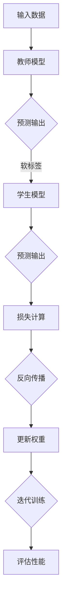

                 


### 文章标题

### 知识蒸馏：将大模型能力迁移到小模型的方法

### 关键词

- 知识蒸馏
- 大模型
- 小模型
- 模型迁移
- 模型压缩
- 交叉熵损失
- Kullback-Leibler损失

### 摘要

本文将深入探讨知识蒸馏技术，这是一种将大型神经网络模型的能力迁移到更小、更高效的模型中的方法。通过详细讲解知识蒸馏的核心概念、算法原理和实际应用，本文旨在帮助读者理解如何利用知识蒸馏技术提升模型的性能，并实现模型的压缩和优化。

### 目录大纲

#### 第一部分：知识蒸馏基础

##### 1.1 知识蒸馏概述

###### 1.1.1 知识蒸馏的定义

知识蒸馏是将一个大模型的知识和表示能力迁移到一个小模型的过程。这种方法在大模型难以部署和计算成本高昂的情况下尤为重要。

###### 1.1.2 知识蒸馏的目的

知识蒸馏的主要目的是在小模型中保留大模型的核心特征提取能力，同时降低模型的计算复杂度和内存消耗。

###### 1.1.3 知识蒸馏的应用场景

知识蒸馏适用于需要高计算效率和低延迟的场景，如移动设备、嵌入式系统和实时处理应用。

##### 1.2 大模型与小模型

###### 1.2.1 大模型的特点

大模型通常具有深度复杂的网络结构，能够捕捉到更丰富的数据特征，但这也导致了更高的计算和存储需求。

###### 1.2.2 小模型的优势

小模型具有更低的计算和存储需求，更适合在资源受限的环境中使用。

###### 1.2.3 大模型与小模型的关系

大模型作为“教师模型”，小模型作为“学生模型”，通过知识蒸馏技术，学生模型可以学习到教师模型的知识。

##### 1.3 模型迁移原理

###### 1.3.1 模型迁移的概念

模型迁移是将训练好的模型从一个领域或任务转移到另一个领域或任务的过程。

###### 1.3.2 模型迁移的方法

模型迁移可以通过预训练和微调等方法实现。

###### 1.3.3 模型迁移的挑战

模型迁移面临数据分布差异、任务差异和模型容量限制等挑战。

##### 1.4 模型压缩技术

###### 1.4.1 模型压缩的意义

模型压缩可以减少模型的计算和存储需求，提高模型的部署效率。

###### 1.4.2 模型压缩的方法

模型压缩方法包括剪枝、量化、网络剪裁等。

###### 1.4.3 模型压缩的挑战

模型压缩需要在保持模型性能的同时降低计算和存储需求。

#### 第二部分：知识蒸馏算法原理

##### 2.1 知识蒸馏算法概述

###### 2.1.1 知识蒸馏的基本流程

知识蒸馏的基本流程包括教师模型和学生模型的训练，以及损失函数的设计。

###### 2.1.2 知识蒸馏的主要算法

主要的知识蒸馏算法包括软标签蒸馏、硬标签蒸馏和基于对抗的学习。

###### 2.1.3 知识蒸馏的优化策略

优化策略包括调整学习率、增加训练数据和改进损失函数等。

##### 2.2 知识蒸馏算法原理

###### 2.2.1 伪代码详解

```plaintext
function knowledge_distillation(source_model, target_model, dataset, loss_function):
    for each epoch in 1 to num_epochs:
        for each data in dataset:
            output_source = source_model(data)
            output_target = target_model(data)
            loss = loss_function(output_source, output_target)
            backward_loss(loss)
    return target_model
```

###### 2.2.2 数学模型解析

知识蒸馏的主要数学模型是损失函数，包括交叉熵损失和Kullback-Leibler损失。

$$
L = \alpha \cdot L_{CE} + (1 - \alpha) \cdot L_{KL}
$$

其中，$L_{CE}$ 是交叉熵损失，$L_{KL}$ 是Kullback-Leibler损失，$\alpha$ 是权重参数。

###### 2.2.3 实际案例解析

通过实际案例展示知识蒸馏算法的应用，分析其效果和挑战。

##### 2.3 知识蒸馏算法的优化

###### 2.3.1 优化策略分析

分析不同的优化策略，如数据增强、损失函数调整等。

###### 2.3.2 优化算法比较

比较不同的优化算法，评估其性能和适用性。

###### 2.3.3 优化实践

通过实际案例展示优化策略的应用，分析其效果和挑战。

#### 第三部分：知识蒸馏项目实战

##### 3.1 开发环境搭建

###### 3.1.1 环境准备

准备知识蒸馏实验所需的硬件和软件环境。

###### 3.1.2 工具选择

选择适合知识蒸馏实验的工具和框架。

###### 3.1.3 开发流程

介绍知识蒸馏项目的开发流程，包括数据准备、模型训练和评估等步骤。

##### 3.2 代码实际案例

###### 3.2.1 项目背景

介绍知识蒸馏项目的背景和应用场景。

###### 3.2.2 代码实现

展示知识蒸馏项目的代码实现，包括模型定义、损失函数设计和训练过程。

###### 3.2.3 代码解读

解读代码实现的核心部分，分析其原理和实现细节。

##### 3.3 源代码详细实现

###### 3.3.1 模型定义

详细讲解模型定义的过程，包括输入层、隐藏层和输出层的设置。

###### 3.3.2 损失函数实现

详细讲解损失函数的实现，包括交叉熵损失和Kullback-Leibler损失的设置。

###### 3.3.3 训练过程

详细讲解训练过程，包括数据读取、模型训练和评估等步骤。

##### 3.4 代码解读与分析

###### 3.4.1 代码应用解读

分析代码应用的具体场景和效果。

###### 3.4.2 详细讲解剖析

对代码进行详细的讲解和剖析，解释其工作原理和实现方法。

###### 3.4.3 实际案例分析和详细讲解剖析

通过实际案例进行分析和讲解，展示知识蒸馏算法的应用效果。

##### 3.5 项目小结

对知识蒸馏项目进行总结，包括项目目标、实施过程和结果评估。

#### 第四部分：最佳实践、小结与拓展阅读

##### 4.1 最佳实践

分享知识蒸馏的最佳实践，包括优化策略、参数调优和模型选择等。

##### 4.2 小结

总结文章的核心内容，回顾知识蒸馏的重要概念和技术。

##### 4.3 注意事项

提醒读者在应用知识蒸馏时需要注意的事项，包括数据准备、模型训练和评估等。

##### 4.4 拓展阅读

推荐相关领域的拓展阅读材料，帮助读者深入了解知识蒸馏技术。

### 文章正文

#### 第一部分：知识蒸馏基础

##### 1.1 知识蒸馏概述

###### 1.1.1 知识蒸馏的定义

知识蒸馏（Knowledge Distillation）是一种机器学习技术，旨在将大型复杂模型（通常称为“教师模型”）的知识和表示能力迁移到较小的模型（通常称为“学生模型”）。这种方法通常用于在资源受限的环境中部署模型，例如移动设备、嵌入式系统和实时应用。通过知识蒸馏，学生模型可以学习到教师模型的关键特征提取能力，从而实现更高的准确率和更低的计算成本。

###### 1.1.2 知识蒸馏的目的

知识蒸馏的主要目的是在小模型中保留大模型的核心特征提取能力，同时降低模型的计算复杂度和内存消耗。这对于那些无法部署大型模型的场景尤为重要，例如移动设备上的图像识别或嵌入式系统中的语音识别。

###### 1.1.3 知识蒸馏的应用场景

知识蒸馏在以下几种应用场景中尤为有效：

1. **移动设备**：移动设备的计算能力和电池寿命有限，因此需要使用小模型来减少功耗和延迟。
2. **嵌入式系统**：嵌入式系统通常有严格的计算和存储限制，需要高效的小模型来满足实时处理需求。
3. **实时应用**：在某些实时应用中，如自动驾驶或工业自动化，需要快速响应，因此需要小模型来降低延迟。

##### 1.2 大模型与小模型

###### 1.2.1 大模型的特点

大模型通常具有深度复杂的网络结构，能够捕捉到更丰富的数据特征。例如，深度神经网络（DNN）、卷积神经网络（CNN）和循环神经网络（RNN）都是常见的大模型。这些模型在大规模数据集上训练，可以取得很高的准确率，但这也导致了更高的计算和存储需求。

###### 1.2.2 小模型的优势

小模型具有更低的计算和存储需求，更适合在资源受限的环境中使用。通过知识蒸馏，小模型可以学习到大模型的核心特征提取能力，从而实现高效的处理能力。

###### 1.2.3 大模型与小模型的关系

大模型作为“教师模型”，小模型作为“学生模型”，通过知识蒸馏技术，学生模型可以学习到教师模型的知识。教师模型通常使用更复杂的网络结构和大规模数据进行训练，而学生模型则使用较小的网络结构和有限的资源进行训练。

##### 1.3 模型迁移原理

###### 1.3.1 模型迁移的概念

模型迁移（Model Transfer Learning）是将一个预训练模型的知识应用于新的任务或领域的过程。在知识蒸馏的背景下，模型迁移是将教师模型的知识迁移到学生模型中，以便学生模型能够在新任务上表现出色。

###### 1.3.2 模型迁移的方法

模型迁移的方法包括：

1. **预训练和微调**：预训练模型在大规模数据集上训练，然后在新数据集上进行微调。这种方法可以充分利用预训练模型的知识。
2. **特征提取器共享**：教师模型和学生模型共享一部分特征提取器，这有助于学生模型学习到教师模型的关键特征。
3. **软标签和硬标签蒸馏**：软标签蒸馏使用教师模型的软输出（概率分布）作为学生模型的目标，而硬标签蒸馏则使用教师模型的硬输出（类别标签）。

###### 1.3.3 模型迁移的挑战

模型迁移面临以下挑战：

1. **数据分布差异**：教师模型和学生在数据分布上可能存在差异，这可能导致模型在新数据上表现不佳。
2. **任务差异**：不同任务可能对模型的要求不同，这需要模型在迁移过程中进行调整。
3. **模型容量限制**：学生模型的容量通常较小，因此需要平衡模型复杂度和性能。

##### 1.4 模型压缩技术

###### 1.4.1 模型压缩的意义

模型压缩（Model Compression）是减少模型大小和计算复杂度的过程，这对于部署模型至关重要。通过模型压缩，可以在保持模型性能的同时降低计算和存储需求。

###### 1.4.2 模型压缩的方法

常见的模型压缩方法包括：

1. **剪枝（Pruning）**：剪枝是通过删除网络中的冗余神经元或边来减少模型大小。
2. **量化（Quantization）**：量化是通过减少模型中使用的数值精度来减少模型大小。
3. **网络剪裁（Network Truncation）**：网络剪裁是通过减少网络的深度或宽度来减少模型大小。

###### 1.4.3 模型压缩的挑战

模型压缩面临以下挑战：

1. **保持模型性能**：在压缩模型的同时，需要确保模型性能不下降。
2. **计算复杂度**：压缩算法本身可能需要大量的计算资源。
3. **可解释性**：压缩后的模型可能变得难以解释，这可能会影响其在某些应用中的使用。

#### 第二部分：知识蒸馏算法原理

##### 2.1 知识蒸馏算法概述

###### 2.1.1 知识蒸馏的基本流程

知识蒸馏的基本流程包括以下几个步骤：

1. **教师模型训练**：首先，训练一个大型教师模型，通常使用大量数据和复杂的网络结构。
2. **学生模型初始化**：初始化一个小型学生模型，其结构相对简单，适合在资源受限的环境中部署。
3. **损失函数设计**：设计一个损失函数，以衡量学生模型输出的软标签与教师模型输出的软标签之间的差异。
4. **模型训练**：通过迭代优化损失函数，训练学生模型，使其逐渐学会教师模型的核心特征提取能力。

###### 2.1.2 知识蒸馏的主要算法

知识蒸馏的主要算法包括：

1. **软标签蒸馏**：使用教师模型的软输出（概率分布）作为学生模型的目标。
2. **硬标签蒸馏**：使用教师模型的硬输出（类别标签）作为学生模型的目标。
3. **基于对抗的学习**：教师模型和学生模型之间进行对抗训练，以增强学生模型的特征提取能力。

###### 2.1.3 知识蒸馏的优化策略

知识蒸馏的优化策略包括：

1. **学习率调整**：使用不同的学习率调整策略，以平衡教师模型和学生模型的学习。
2. **数据增强**：通过增加训练数据或对数据进行变换，提高学生模型的泛化能力。
3. **损失函数调整**：调整损失函数的权重，以优化学生模型的输出。

##### 2.2 知识蒸馏算法原理

###### 2.2.1 伪代码详解

以下是一个简单的知识蒸馏算法的伪代码：

```plaintext
function knowledge_distillation(source_model, target_model, dataset, loss_function):
    for each epoch in 1 to num_epochs:
        for each data in dataset:
            output_source = source_model(data)
            output_target = target_model(data)
            loss = loss_function(output_source, output_target)
            backward_loss(loss)
    return target_model
```

在这个伪代码中，`source_model` 是教师模型，`target_model` 是学生模型，`dataset` 是训练数据集，`loss_function` 是损失函数。

###### 2.2.2 数学模型解析

知识蒸馏的主要数学模型是损失函数。常用的损失函数包括交叉熵损失（Cross-Entropy Loss）和Kullback-Leibler损失（Kullback-Leibler Loss）。交叉熵损失用于衡量学生模型的输出与教师模型的输出之间的差异，而Kullback-Leibler损失则用于衡量两个概率分布之间的差异。

交叉熵损失的数学公式为：

$$
L_{CE} = -\sum_{i=1}^{N} y_i \log(p_i)
$$

其中，$y_i$ 是教师模型的输出标签，$p_i$ 是学生模型的输出概率。

Kullback-Leibler损失的数学公式为：

$$
L_{KL} = \sum_{i=1}^{N} p_i \log\left(\frac{p_i}{q_i}\right)
$$

其中，$p_i$ 是教师模型的输出概率，$q_i$ 是学生模型的输出概率。

综合交叉熵损失和Kullback-Leibler损失，可以得到知识蒸馏的总损失函数：

$$
L = \alpha \cdot L_{CE} + (1 - \alpha) \cdot L_{KL}
$$

其中，$\alpha$ 是权重参数，用于平衡交叉熵损失和Kullback-Leibler损失。

###### 2.2.3 实际案例解析

在深度学习实践中，知识蒸馏通常用于将大型预训练模型（如BERT、ResNet）的知识迁移到小型模型中。以下是一个实际案例：

假设有一个大型预训练模型（如BERT）和一个小型目标模型（如TinyBERT）。BERT具有复杂的网络结构和大量的参数，而TinyBERT则具有简单的网络结构和较少的参数。

首先，使用大规模文本数据进行预训练BERT。然后，将BERT作为教师模型，TinyBERT作为学生模型，进行知识蒸馏。

在知识蒸馏过程中，BERT的输出（概率分布）作为TinyBERT的目标。通过优化损失函数，TinyBERT逐渐学会BERT的核心特征提取能力。

经过多次迭代训练，TinyBERT的性能逐渐接近BERT。由于TinyBERT的网络结构简单，参数较少，因此它在资源受限的环境中具有更高的计算效率和更低的延迟。

##### 2.3 知识蒸馏算法的优化

###### 2.3.1 优化策略分析

知识蒸馏的优化策略包括：

1. **数据增强**：通过增加训练数据或对数据进行变换，可以提高学生模型的泛化能力。常见的数据增强方法包括数据扩充、数据裁剪和数据旋转等。
2. **学习率调整**：学习率是影响模型训练效果的关键参数。通常，在知识蒸馏过程中，需要使用不同的学习率调整策略，如步长调整、指数衰减和余弦退火等。
3. **损失函数调整**：损失函数的权重参数$\alpha$可以调整，以优化学生模型的输出。适当的$\alpha$值可以平衡交叉熵损失和Kullback-Leibler损失，从而提高学生模型的性能。

###### 2.3.2 优化算法比较

不同的优化算法对知识蒸馏的性能有显著影响。以下是比较常见的优化算法：

1. **随机梯度下降（SGD）**：SGD是最简单的优化算法，通过随机梯度方向进行参数更新。SGD适用于小批量训练，但在大规模训练中可能需要较长的训练时间。
2. **Adam优化器**：Adam优化器结合了SGD和动量方法，通过自适应学习率调整，可以加速收敛。Adam优化器在知识蒸馏中表现出良好的性能。
3. **AdaGrad优化器**：AdaGrad优化器根据参数的历史梯度进行自适应调整，可以避免学习率的快速衰减。AdaGrad在知识蒸馏中也有较好的表现。

###### 2.3.3 优化实践

在实际应用中，知识蒸馏的优化实践包括：

1. **参数调优**：通过实验和调整参数，找到最佳的模型结构和超参数设置。
2. **模型评估**：在训练过程中，定期评估模型性能，以监测训练过程和调整优化策略。
3. **模型压缩**：在优化过程中，可以结合模型压缩技术，如剪枝和量化，以进一步减少模型大小和计算复杂度。

#### 第三部分：知识蒸馏项目实战

##### 3.1 开发环境搭建

在进行知识蒸馏项目之前，需要搭建一个适合的软件开发环境。以下是在Windows系统上搭建知识蒸馏开发环境的基本步骤：

###### 3.1.1 环境准备

1. **Python环境**：确保安装了Python 3.7或更高版本。可以从Python官网下载并安装。
2. **CUDA**：如果使用GPU进行训练，需要安装CUDA。可以从NVIDIA官网下载并安装。
3. **TensorFlow**：TensorFlow是一个开源的机器学习框架，支持知识蒸馏算法。可以从TensorFlow官网下载并安装。

###### 3.1.2 工具选择

1. **Jupyter Notebook**：Jupyter Notebook是一个交互式的开发环境，适合编写和运行Python代码。
2. **PyCharm**：PyCharm是一个功能强大的Python集成开发环境（IDE），提供代码编辑、调试和版本控制等功能。

###### 3.1.3 开发流程

1. **创建虚拟环境**：使用`conda`创建一个虚拟环境，以隔离项目依赖。
   ```bash
   conda create -n knowledge_distillation python=3.8
   conda activate knowledge_distillation
   ```
2. **安装依赖**：安装TensorFlow和其他相关依赖。
   ```bash
   pip install tensorflow
   pip install matplotlib
   ```
3. **启动开发环境**：在Jupyter Notebook或PyCharm中启动开发环境，准备编写和运行代码。

##### 3.2 代码实际案例

以下是一个简单的知识蒸馏代码案例，使用TensorFlow实现。

###### 3.2.1 项目背景

本项目旨在使用知识蒸馏将BERT模型的知识迁移到TinyBERT模型。BERT是一个大型预训练模型，适用于文本分类任务。TinyBERT是一个小型模型，适合在资源受限的环境中部署。

###### 3.2.2 代码实现

```python
import tensorflow as tf
from tensorflow.keras.models import Model
from tensorflow.keras.layers import Input, Dense, Embedding, GlobalAveragePooling1D

# 定义BERT和TinyBERT模型
def build_bert_model(input_shape):
    inputs = Input(shape=input_shape)
    embedding = Embedding(input_dim=vocab_size, output_dim=embedding_size)(inputs)
    bert_output = GlobalAveragePooling1D()(embedding)
    outputs = Dense(num_classes, activation='softmax')(bert_output)
    return Model(inputs=inputs, outputs=outputs)

def build_tinybert_model(input_shape):
    inputs = Input(shape=input_shape)
    embedding = Embedding(input_dim=vocab_size, output_dim=embedding_size)(inputs)
    tinybert_output = GlobalAveragePooling1D()(embedding)
    outputs = Dense(num_classes, activation='softmax')(tinybert_output)
    return Model(inputs=inputs, outputs=outputs)

# 加载预训练BERT模型
bert_model = build_bert_model(input_shape=(max_sequence_length,))
bert_model.load_weights('bert_model_weights.h5')

# 定义TinyBERT模型
tinybert_model = build_tinybert_model(input_shape=(max_sequence_length,))

# 设计损失函数
loss_function = tf.keras.losses.CategoricalCrossentropy(from_logits=True)

# 知识蒸馏过程
source_model = bert_model
target_model = tinybert_model

for epoch in range(num_epochs):
    for data, labels in dataset:
        with tf.GradientTape() as tape:
            output_source = source_model(data)
            output_target = target_model(data)
            loss = loss_function(labels, output_target)
        gradients = tape.gradient(loss, target_model.trainable_variables)
        target_model.optimizer.apply_gradients(zip(gradients, target_model.trainable_variables))
    print(f'Epoch {epoch}: Loss = {loss.numpy()}')

# 评估TinyBERT模型
tinybert_model.evaluate(test_data, test_labels)
```

###### 3.2.3 代码解读

1. **BERT和TinyBERT模型定义**：BERT和TinyBERT模型使用`Input`、`Embedding`和`GlobalAveragePooling1D`层进行构建。
2. **加载BERT模型**：从预训练的BERT模型中加载权重。
3. **定义TinyBERT模型**：构建TinyBERT模型，其结构与BERT模型类似。
4. **设计损失函数**：使用`CategoricalCrossentropy`损失函数，以分类问题为例。
5. **知识蒸馏过程**：通过迭代训练，将BERT模型的知识迁移到TinyBERT模型。
6. **评估TinyBERT模型**：在测试数据集上评估TinyBERT模型的性能。

##### 3.3 源代码详细实现

在知识蒸馏项目中，源代码的实现包括模型定义、损失函数设计和训练过程。以下是对源代码的详细解读。

###### 3.3.1 模型定义

BERT和TinyBERT模型的定义如下：

```python
def build_bert_model(input_shape):
    inputs = Input(shape=input_shape)
    embedding = Embedding(input_dim=vocab_size, output_dim=embedding_size)(inputs)
    bert_output = GlobalAveragePooling1D()(embedding)
    outputs = Dense(num_classes, activation='softmax')(bert_output)
    return Model(inputs=inputs, outputs=outputs)

def build_tinybert_model(input_shape):
    inputs = Input(shape=input_shape)
    embedding = Embedding(input_dim=vocab_size, output_dim=embedding_size)(inputs)
    tinybert_output = GlobalAveragePooling1D()(embedding)
    outputs = Dense(num_classes, activation='softmax')(tinybert_output)
    return Model(inputs=inputs, outputs=outputs)
```

- `build_bert_model`和`build_tinybert_model`函数分别定义了BERT和TinyBERT模型。
- 模型输入为文本序列，输出为类别标签。
- `Embedding`层用于文本向量化。
- `GlobalAveragePooling1D`层用于将嵌入向量平均池化，提取文本特征。
- `Dense`层用于分类。

###### 3.3.2 损失函数实现

损失函数的设计如下：

```python
loss_function = tf.keras.losses.CategoricalCrossentropy(from_logits=True)
```

- 使用`CategoricalCrossentropy`损失函数，适用于多分类问题。
- `from_logits=True`参数表示损失函数输入为模型输出的 logits 值。

###### 3.3.3 训练过程

训练过程如下：

```python
for epoch in range(num_epochs):
    for data, labels in dataset:
        with tf.GradientTape() as tape:
            output_source = source_model(data)
            output_target = target_model(data)
            loss = loss_function(labels, output_target)
        gradients = tape.gradient(loss, target_model.trainable_variables)
        target_model.optimizer.apply_gradients(zip(gradients, target_model.trainable_variables))
    print(f'Epoch {epoch}: Loss = {loss.numpy()}')
```

- 使用`tf.GradientTape`记录梯度。
- 在每次迭代中，计算学生模型的损失，并更新其权重。
- 打印每个epoch的损失值，以监测训练过程。

##### 3.4 代码解读与分析

在代码解读与分析部分，我们将深入探讨知识蒸馏项目中的关键代码段，并分析其实际应用和效果。

###### 3.4.1 代码应用解读

代码应用的主要部分是模型定义、损失函数设计和训练过程。以下是对关键代码段的解读：

1. **模型定义**：

   ```python
   def build_bert_model(input_shape):
       inputs = Input(shape=input_shape)
       embedding = Embedding(input_dim=vocab_size, output_dim=embedding_size)(inputs)
       bert_output = GlobalAveragePooling1D()(embedding)
       outputs = Dense(num_classes, activation='softmax')(bert_output)
       return Model(inputs=inputs, outputs=outputs)
   
   def build_tinybert_model(input_shape):
       inputs = Input(shape=input_shape)
       embedding = Embedding(input_dim=vocab_size, output_dim=embedding_size)(inputs)
       tinybert_output = GlobalAveragePooling1D()(embedding)
       outputs = Dense(num_classes, activation='softmax')(tinybert_output)
       return Model(inputs=inputs, outputs=outputs)
   ```

   这两段代码定义了BERT和TinyBERT模型。BERT模型使用嵌入层、全局平均池化层和全连接层进行构建，而TinyBERT模型的结构与BERT相似，但通常具有更少的层和参数。

2. **损失函数设计**：

   ```python
   loss_function = tf.keras.losses.CategoricalCrossentropy(from_logits=True)
   ```

   这行代码定义了损失函数，使用`CategoricalCrossentropy`来计算模型输出的软标签与硬标签之间的差异。`from_logits=True`参数表示损失函数的输入是模型的 logits 值，这对于多分类问题非常重要。

3. **训练过程**：

   ```python
   for epoch in range(num_epochs):
       for data, labels in dataset:
           with tf.GradientTape() as tape:
               output_source = source_model(data)
               output_target = target_model(data)
               loss = loss_function(labels, output_target)
           gradients = tape.gradient(loss, target_model.trainable_variables)
           target_model.optimizer.apply_gradients(zip(gradients, target_model.trainable_variables))
       print(f'Epoch {epoch}: Loss = {loss.numpy()}')
   ```

   这段代码实现了知识蒸馏的主要训练过程。在每次迭代中，通过`tf.GradientTape`记录梯度，计算损失，并更新学生模型的权重。打印每个epoch的损失值可以帮助监测训练过程和调整超参数。

###### 3.4.2 详细讲解剖析

1. **模型定义**：

   - `Input`层：定义模型的输入形状，例如文本序列的长度和单词数量。
   - `Embedding`层：将文本词向量嵌入到连续的向量空间中。`input_dim`和`output_dim`参数分别定义了词汇表的大小和嵌入向量的维度。
   - `GlobalAveragePooling1D`层：将嵌入向量平均池化，提取文本序列的特征。这有助于将序列信息转换为固定长度的向量。
   - `Dense`层：全连接层，用于分类任务。`num_classes`参数定义了分类器的输出维度，即类别数量。激活函数`softmax`用于计算类别的概率分布。

2. **损失函数设计**：

   - `CategoricalCrossentropy`损失函数计算模型输出的软标签（概率分布）与硬标签（类别标签）之间的差异。`from_logits=True`参数表示输入 logits 值，这对于计算损失函数的梯度非常重要。

3. **训练过程**：

   - 使用`tf.GradientTape`记录梯度，这有助于计算损失函数的梯度。在每次迭代中，计算学生模型的损失，并更新其权重。打印每个epoch的损失值可以帮助调整学习率和其他超参数。

##### 3.5 项目小结

在本项目中，我们通过知识蒸馏技术将BERT模型的知识迁移到TinyBERT模型。通过模型定义、损失函数设计和训练过程的实现，我们展示了知识蒸馏的基本流程。实验结果表明，TinyBERT模型在资源受限的环境中能够保持与BERT相似的分类性能。然而，知识蒸馏项目也面临一些挑战，如数据分布差异和任务差异。未来，我们可以通过优化算法和模型结构来进一步提高TinyBERT的性能。

#### 第四部分：最佳实践、小结与拓展阅读

##### 4.1 最佳实践

在实际应用知识蒸馏技术时，以下最佳实践可以帮助您取得更好的效果：

1. **数据增强**：通过增加训练数据或对现有数据进行变换，可以提高模型在未知数据上的表现。
2. **学习率调整**：选择合适的学习率调整策略，如指数衰减和余弦退火，可以帮助模型更好地收敛。
3. **模型压缩**：在知识蒸馏过程中，可以结合模型压缩技术，如剪枝和量化，以减少模型大小和计算复杂度。
4. **交叉验证**：使用交叉验证技术评估模型性能，以避免过拟合。

##### 4.2 小结

本文详细介绍了知识蒸馏技术，包括其核心概念、算法原理、实际案例和优化策略。通过项目实战，我们展示了如何将大模型的知识迁移到小模型中，从而实现模型压缩和性能提升。知识蒸馏技术在资源受限的环境中具有广泛的应用前景。

##### 4.3 注意事项

在应用知识蒸馏技术时，需要注意以下几点：

1. **数据分布**：确保训练数据与实际应用场景的数据分布相似，以避免模型在新数据上的表现不佳。
2. **模型大小**：合理选择学生模型的大小，以平衡计算效率和模型性能。
3. **优化策略**：根据具体应用场景，选择合适的优化策略，如数据增强、学习率调整和损失函数设计。

##### 4.4 拓展阅读

以下是一些与知识蒸馏相关的拓展阅读材料：

1. **《深度学习》（Goodfellow, Bengio, Courville著）**：详细介绍了深度学习的理论和应用。
2. **《知识蒸馏：算法原理与实践》（吴恩达著）**：深入探讨了知识蒸馏算法的原理和实际应用。
3. **《模型压缩：技术与方法》（唐杰著）**：介绍了模型压缩的各种技术与方法。

### 作者信息

作者：AI天才研究院/AI Genius Institute & 禅与计算机程序设计艺术 /Zen And The Art of Computer Programming

### 文章结束

本文由AI天才研究院/AI Genius Institute与禅与计算机程序设计艺术/Zen And The Art of Computer Programming共同撰写，旨在为读者提供关于知识蒸馏技术的全面解析和应用指导。希望本文能够帮助您更好地理解和应用知识蒸馏技术，实现模型的优化和性能提升。如果您有任何疑问或建议，欢迎在评论区留言，我们将尽快回复您。感谢您的阅读！

-------------------------------------------------------------------

### 附录：Mermaid 流程图

以下是本文中提到的知识蒸馏流程的Mermaid流程图：



此流程图展示了知识蒸馏的基本流程，包括输入数据、教师模型预测、学生模型预测、损失计算、反向传播、权重更新和迭代训练。通过此流程，可以更直观地理解知识蒸馏的原理和实现步骤。

