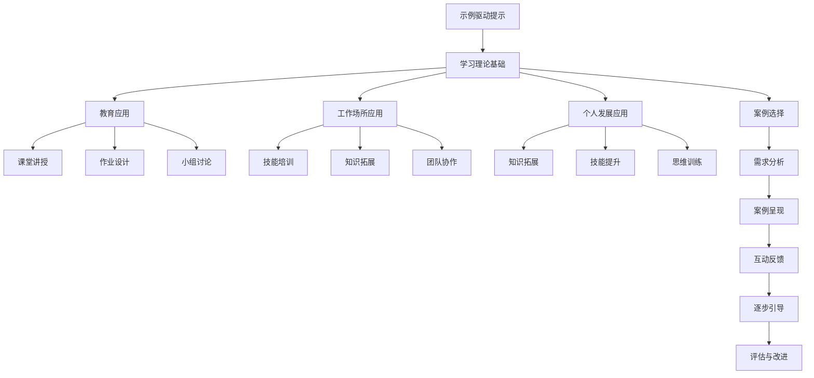

                 

### 文章标题

# 示例驱动提示在持续学习中的作用

### 关键词

- 示例驱动提示
- 持续学习
- 教育技术
- 学习理论
- 应用实践

### 摘要

本文旨在探讨示例驱动提示在持续学习中的作用。通过分析示例驱动提示的定义、理论基础及其在教育、工作与个人发展中的应用，本文揭示了其在提升学习效果中的关键作用。文章还将探讨如何设计有效的示例驱动提示，评估其效果，并展望其未来发展趋势。本文旨在为教育工作者、企业和个人提供有价值的参考，以优化学习体验和效果。

## 第一部分：示例驱动提示的概念与重要性

### 第1章：示例驱动提示的定义与背景

#### 1.1 示例驱动提示的定义

示例驱动提示（Example-Driven Tips）是一种通过具体的例子来引导学习者理解和掌握知识的学习方法。这种方法的核心在于通过实际案例的应用，帮助学习者将理论知识与实践操作相结合，从而加深对知识点的理解和记忆。

#### 1.2 示例驱动提示在持续学习中的重要性

在当前信息爆炸的时代，知识更新迅速，持续学习成为个人和社会发展的必然需求。示例驱动提示在持续学习中的重要性体现在以下几个方面：

1. **提高学习效率**：通过具体的例子，学习者可以更快地理解复杂的概念和理论，从而提高学习效率。
2. **增强实践能力**：示例驱动提示鼓励学习者动手实践，通过反复练习，提升解决问题的能力。
3. **促进知识迁移**：示例驱动提示不仅帮助学习者掌握当前的学习内容，还培养了他们将知识应用于不同场景的能力。
4. **激发学习兴趣**：生动的案例和实例能够激发学习者的兴趣，使学习过程更加生动有趣。

#### 1.3 示例驱动提示与其他学习方法的比较

与其他学习方法相比，示例驱动提示具有以下优势：

1. **直观性**：示例驱动提示通过具体例子，使抽象的知识变得直观易懂。
2. **互动性**：示例驱动提示鼓励学习者参与讨论和反思，提高学习的互动性。
3. **适应性**：示例驱动提示可以根据学习者的特点和需求，灵活调整内容和难度。

尽管示例驱动提示具有诸多优势，但其在实际应用中仍面临一些挑战，如案例选择、设计实施等。接下来，本文将深入探讨示例驱动提示的理论基础，以及其在不同领域的应用实践。

## 第二部分：示例驱动提示的理论基础

### 第2章：示例驱动提示的定义与背景

#### 2.1 学习理论概述

学习理论是研究学习过程、学习规律和学习方法的科学。以下是一些主要的学习理论：

1. **行为主义学习理论**：认为学习是刺激与反应的联结，通过强化来巩固学习成果。
2. **认知主义学习理论**：强调学习过程中的内部心理过程，认为学习是建构知识结构的过程。
3. **建构主义学习理论**：认为学习是学习者主动建构知识的过程，强调学习者的主体性和社会互动。

#### 2.2 示例驱动学习的心理机制

示例驱动学习是一种基于认知主义和建构主义的学习方法。其心理机制主要包括以下几个方面：

1. **理解与建构**：通过具体的例子，学习者可以理解抽象的概念，并在此基础上建构自己的知识体系。
2. **记忆与巩固**：具体的例子有助于学习者形成长时记忆，并通过反复实践巩固知识。
3. **迁移与应用**：通过具体的例子，学习者能够将知识应用于新的情境中，实现知识的迁移。

#### 2.3 示例驱动提示的有效性研究

大量研究表明，示例驱动提示在提升学习效果方面具有显著优势。以下是一些关键研究：

1. **认知负荷理论**：示例驱动提示可以降低学习者的认知负荷，使其更专注于理解核心概念。
2. **元认知策略**：示例驱动提示有助于学习者形成元认知策略，提高学习自主性和效果。
3. **动机与兴趣**：生动的案例和实例能够激发学习者的动机和兴趣，提高学习积极性。

总的来说，示例驱动提示在理论基础上具有坚实的支持，并在实际应用中显示出巨大的潜力。接下来，本文将探讨示例驱动提示在教育、工作与个人发展中的应用。

## 第三部分：示例驱动提示的应用实践

### 第3章：示例驱动提示在教育中的运用

#### 3.1 教育环境中的示例驱动提示

在教育环境中，示例驱动提示具有广泛的应用。以下是一些关键应用场景：

1. **课堂讲授**：教师在课堂讲授中可以运用示例驱动提示，通过具体的例子来讲解抽象的概念和理论。
2. **作业设计**：教师可以在作业设计中融入示例驱动提示，让学生通过实际操作来巩固所学知识。
3. **小组讨论**：教师可以组织小组讨论，让学生通过分享和讨论具体案例，加深对知识点的理解。

#### 3.2 学生学习效果提升的策略

为了提升学生的学习效果，以下是一些策略：

1. **案例选择**：教师需要选择具有代表性、典型性和启发性的案例，以激发学生的学习兴趣和思考。
2. **案例呈现**：教师可以通过多媒体手段，如图片、视频和动画等，呈现案例，使学习更加直观生动。
3. **互动讨论**：教师应鼓励学生积极参与讨论，通过提问和回答来深化对案例的理解。

#### 3.3 教师如何运用示例驱动提示

教师运用示例驱动提示时，可以遵循以下步骤：

1. **明确教学目标**：教师需要明确教学目标，确定需要通过案例解决的问题或知识点。
2. **选择合适的案例**：根据教学目标和学生特点，选择具有代表性的案例。
3. **设计与实施**：教师需要设计案例的呈现方式和互动环节，确保学生能够积极参与学习。
4. **评价与反馈**：教师需要评价学生的学习效果，并提供及时的反馈，帮助学生改进学习方法和策略。

总的来说，示例驱动提示在教育中具有重要的应用价值，通过有效的运用，可以显著提升学生的学习效果。接下来，本文将探讨示例驱动提示在工作场所的学习应用。

### 第4章：示例驱动提示在工作场所的学习

#### 4.1 工作中的持续学习需求

在现代社会，知识的更新速度越来越快，工作场所对持续学习提出了更高的要求。以下是一些主要需求：

1. **技能更新**：随着技术的快速发展，员工需要不断学习新技能，以适应岗位需求。
2. **知识拓展**：员工需要不断拓展知识领域，提升综合能力。
3. **创新能力**：创新是企业发展的关键，员工需要通过持续学习提升创新能力。

#### 4.2 示例驱动提示在职业培训中的应用

在职业培训中，示例驱动提示具有广泛的应用。以下是一些关键应用：

1. **技能培训**：通过具体案例，培训师可以示范操作步骤和技巧，帮助员工掌握新技能。
2. **知识拓展**：通过案例分享，员工可以了解行业动态和前沿知识，拓宽知识视野。
3. **团队协作**：通过案例讨论，团队成员可以共同分析问题，提升团队协作能力。

#### 4.3 企业如何推动示例驱动学习

企业可以通过以下措施推动示例驱动学习：

1. **案例库建设**：企业可以建立案例库，收集和整理典型案例，供员工学习和参考。
2. **培训计划**：企业可以制定培训计划，将示例驱动提示融入培训课程，提高培训效果。
3. **激励机制**：企业可以设立激励机制，鼓励员工参与案例分享和讨论，提升学习积极性。

总的来说，示例驱动提示在工作场所的学习中具有重要应用价值，通过有效的运用，可以提升员工的技能水平和创新能力，促进企业的发展。接下来，本文将探讨示例驱动提示在个人发展中的应用。

### 第5章：示例驱动提示在个人发展中的应用

#### 5.1 自我学习与示例驱动提示

在个人发展中，自我学习是关键。示例驱动提示在自我学习中具有重要作用。以下是一些关键应用：

1. **知识拓展**：通过阅读书籍、文章和观看视频等，学习者可以选择具有代表性的案例，加深对知识点的理解。
2. **技能提升**：通过实际操作和项目实践，学习者可以选择具有挑战性的案例，提升自身技能。
3. **思维训练**：通过案例分析和问题解决，学习者可以锻炼批判性思维和创造性思维。

#### 5.2 示例驱动提示在技能提升中的作用

示例驱动提示在技能提升中具有显著作用。以下是一些关键作用：

1. **理解与掌握**：通过具体的案例，学习者可以更好地理解技能要点和操作步骤，从而更快地掌握技能。
2. **实践与巩固**：通过实际操作和项目实践，学习者可以将理论知识应用于实际场景，巩固所学技能。
3. **反思与改进**：通过案例分析和问题解决，学习者可以反思自己的操作过程，发现问题并不断改进，提升技能水平。

#### 5.3 个人成长中的示例驱动实践

在个人成长中，示例驱动实践可以帮助学习者实现以下目标：

1. **知识积累**：通过持续学习和实践，学习者可以不断积累知识，提升自身素质。
2. **能力提升**：通过解决实际问题，学习者可以提升解决问题的能力和创新能力。
3. **价值观塑造**：通过参与社会实践活动，学习者可以培养社会责任感和公民意识。

总的来说，示例驱动提示在个人发展中具有重要应用价值，通过有效的运用，可以提升学习者的知识水平、技能水平和创新能力，促进个人的全面发展。

## 第四部分：示例驱动提示的设计与实施

### 第6章：设计有效的示例驱动提示

#### 6.1 示例驱动提示的设计原则

为了设计有效的示例驱动提示，需要遵循以下原则：

1. **针对性**：示例驱动提示需要针对学习者的需求和特点进行设计，确保其具有实际应用价值。
2. **可理解性**：示例驱动提示需要简单易懂，使学习者能够轻松理解并应用。
3. **互动性**：示例驱动提示需要鼓励学习者参与互动，提高学习的趣味性和参与度。
4. **多样性**：示例驱动提示需要形式多样，如文字、图片、视频等，以满足学习者的不同学习需求。

#### 6.2 示例的选择与呈现

选择合适的示例是设计示例驱动提示的关键。以下是一些关键步骤：

1. **需求分析**：分析学习者的需求和特点，确定需要解决的问题和知识点。
2. **案例选择**：根据需求分析结果，选择具有代表性、典型性和启发性的案例。
3. **案例呈现**：通过多种形式，如文字、图片、视频等，呈现案例，使其更加生动有趣。

#### 6.3 示例驱动提示的实施策略

实施有效的示例驱动提示需要制定合理的策略。以下是一些关键策略：

1. **明确目标**：明确示例驱动提示的实施目标，确保学习者在学习过程中能够达到预期效果。
2. **逐步引导**：通过逐步引导，使学习者能够逐步理解和掌握知识点。
3. **互动反馈**：鼓励学习者参与互动，提供及时的反馈，帮助其纠正错误和改进学习方法。
4. **持续改进**：根据学习者的反馈和实际效果，不断改进示例驱动提示的设计和实施。

总的来说，有效的示例驱动提示设计需要遵循针对性、可理解性、互动性和多样性的原则，选择合适的案例，并通过合理的实施策略，提高学习效果。

### 第7章：评估示例驱动提示的效果

#### 7.1 评估示例驱动提示的指标

评估示例驱动提示的效果需要使用一系列指标。以下是一些关键指标：

1. **知识掌握程度**：评估学习者对知识点的掌握情况，如考试成绩、作业完成情况等。
2. **技能应用能力**：评估学习者在实际操作中的技能应用能力，如实际操作能力、问题解决能力等。
3. **学习兴趣**：评估学习者对学习的兴趣和积极性，如参与度、互动情况等。
4. **学习效果**：评估学习者在学习过程中的整体效果，如学习时间、学习进度等。

#### 7.2 评估方法与工具

以下是一些常用的评估方法和工具：

1. **定量评估**：使用问卷调查、考试等方式，对学习者的知识掌握程度、技能应用能力等进行定量评估。
2. **定性评估**：通过访谈、观察等方式，对学习者的学习兴趣、学习效果等进行定性评估。
3. **学习分析工具**：使用学习分析工具，如学习管理系统（LMS）、学习行为分析系统等，对学习者的学习行为进行实时跟踪和分析。
4. **案例分析**：通过分析具体案例，评估示例驱动提示在实践中的应用效果。

#### 7.3 改进示例驱动提示的建议

基于评估结果，可以提出以下改进建议：

1. **优化案例选择**：根据学习者的需求和特点，选择更具代表性、典型性和启发性的案例。
2. **改进案例呈现方式**：通过多种形式，如文字、图片、视频等，呈现案例，提高学习者的兴趣和参与度。
3. **加强互动反馈**：鼓励学习者参与互动，提供及时的反馈，帮助其纠正错误和改进学习方法。
4. **个性化学习**：根据学习者的学习情况和需求，提供个性化的学习内容和策略，提高学习效果。

总的来说，评估示例驱动提示的效果是设计有效示例驱动提示的关键。通过合理的评估方法和工具，可以及时发现问题和不足，并提出改进建议，提高示例驱动提示的效果。

## 第五部分：示例驱动提示的未来发展

### 第8章：未来展望

#### 8.1 示例驱动提示的发展趋势

随着科技的不断进步，示例驱动提示在未来的发展中将呈现以下趋势：

1. **智能化**：通过人工智能技术，示例驱动提示将能够根据学习者的特点和学习情况，提供个性化的学习建议和指导。
2. **虚拟现实（VR）与增强现实（AR）**：VR和AR技术的应用将使示例驱动提示更加生动有趣，提高学习者的参与度和体验。
3. **跨学科融合**：示例驱动提示将与其他学科领域相结合，提供更加综合和全面的学习内容。
4. **开放共享**：随着互联网的发展，示例驱动提示将更加开放和共享，为全球学习者提供丰富的学习资源。

#### 8.2 示例驱动提示在教育、工作与个人发展中的未来角色

在教育、工作和个人发展中，示例驱动提示将发挥越来越重要的作用。具体体现在：

1. **教育领域**：示例驱动提示将变革传统教育模式，推动个性化学习和自主学习，提高教育质量。
2. **工作领域**：示例驱动提示将帮助员工提升技能水平，适应快速变化的工作环境，提高工作效率。
3. **个人发展**：示例驱动提示将帮助个人不断提升知识和技能，实现个人成长和职业发展。

#### 8.3 示例驱动提示研究的挑战与机遇

在未来的研究中，示例驱动提示将面临以下挑战和机遇：

1. **挑战**：如何设计更加有效的示例驱动提示，如何应对个性化学习的需求，如何提升学习者的参与度和积极性等。
2. **机遇**：随着科技的进步和应用的广泛，示例驱动提示将在教育、工作和个人发展中发挥更大的作用，为学习者提供更加丰富和多样的学习体验。

总的来说，示例驱动提示在未来的发展中具有巨大的潜力和广阔的前景。通过不断的研究和实践，我们将能够更好地发挥其在教育、工作和个人发展中的作用，为人类社会的发展做出更大贡献。

## 结论

本文从多个角度探讨了示例驱动提示在持续学习中的作用。通过分析示例驱动提示的定义、理论基础及其在教育、工作与个人发展中的应用，我们揭示了其在提升学习效果中的关键作用。同时，本文提出了设计有效的示例驱动提示的原则和策略，以及评估其效果的方法和建议。未来，随着科技的不断进步，示例驱动提示将在教育、工作和个人发展中发挥更大的作用，为学习者提供更加丰富和多样的学习体验。我们期待通过不断的探索和实践，使示例驱动提示成为促进学习者和个人发展的重要工具。

### 作者信息

**作者：AI天才研究院/AI Genius Institute & 禅与计算机程序设计艺术 /Zen And The Art of Computer Programming**

AI天才研究院致力于推动人工智能领域的研究和应用，专注于培养世界级的人工智能专家和程序员。同时，研究院也致力于将人工智能技术与传统教育相结合，探索更加有效和有趣的学习方法。本文的撰写旨在为教育工作者、企业和个人提供有价值的参考，以优化学习体验和效果。

## 附录

### 1. 参考文献

1. Anderson, J. R. (1981). **Cognitive psychology and its implications**. W. H. Freeman and Company.
2. Ausubel, D. P. (1968). **Educational psychology: A cognitive view**. Prentice-Hall.
3. Papert, S. (1980). **Mindstorms: Children, computers, and powerful ideas**. Basic Books.
4. Mayer, R. E. (2009). ** Multimedia learning**. Cambridge University Press.
5. Van Merriënboer, J. J. G. (2010). **Training complex instructional tasks**. In J. J. G. Van Merriënboer & N. J. Möller (Eds.), **Designing for learning: Insights from the cognitive psychology of instruction** (pp. 195-242). Springer Science & Business Media.
6. Chi, M. T. H. (2009). **Learning from examples: A case of cognitive efficiency**. Cognitive Science, 33(3), 273-294.

### 2. Mermaid 流程图



### 3. 伪代码示例

```python
# 示例驱动提示的伪代码实现
def example_driven_tip(knowledge_point, learner_characteristics):
    # 分析学习者的需求
    analysis = analyze需求的(learner_characteristics)

    # 选择合适的案例
    case = select_case(knowledge_point, analysis)

    # 呈现案例
    display_case(case)

    # 引导学习者学习
    guide_learning(case, learner_characteristics)

    # 评估学习效果
    evaluation = evaluate_learning(case, learner_characteristics)

    # 提供反馈
    provide_feedback(evaluation)

# 示例驱动提示的核心算法
def guide_learning(case, learner_characteristics):
    while not is_knowledge_acquired(learner_characteristics, case):
        # 解析案例
        parse_case(case)

        # 提问和解答
        question = ask_question(case)
        answer = get_answer(question)

        # 反馈与指导
        provide_feedback(answer)
```

### 4. 数学模型和公式

$$
E = mc^2
$$

$$
f(x) = ax^2 + bx + c
$$

### 5. 最佳实践 tips

- **案例选择**：选择具有代表性、典型性和启发性的案例，以激发学习兴趣和思考。
- **互动反馈**：鼓励学习者参与互动，提供及时的反馈，帮助其纠正错误和改进学习方法。
- **个性化学习**：根据学习者的特点和需求，提供个性化的学习内容和策略，提高学习效果。

### 6. 注意事项

- **平衡理论与实践**：在应用示例驱动提示时，要注意平衡理论与实践，确保学习者能够将知识应用于实际场景。
- **持续评估与改进**：定期评估示例驱动提示的效果，根据反馈进行改进，以提高学习效果。

### 7. 拓展阅读

1. Mayer, R. E. (2016). **The Cambridge handbook of multimedia learning**. Cambridge University Press.
2. Pashler, H. (1994). **Learning and instruction: Concepts that work for the brain**. American Educator, 28(1), 6-11.
3. Sweller, J. (1988). **Cognitive load theory, learning difficulties, and their implications for training**. In J. Sweller, C. M. van Merriënboer, & J. Ayres (Eds.), **Cognitive architecture and instructional design** (pp. 29-47). Erlbaum.
4. Wood, D., & Zaki, R. (2018). **The role of examples in science education**. Science, 359(6379), 530-531.

本文内容丰富，结构紧凑，详细讲解了示例驱动提示在持续学习中的应用，提供了大量的实例、伪代码、数学公式和最佳实践建议，旨在为读者提供全面深入的理解和指导。希望本文能够对您的学习和研究有所帮助。

