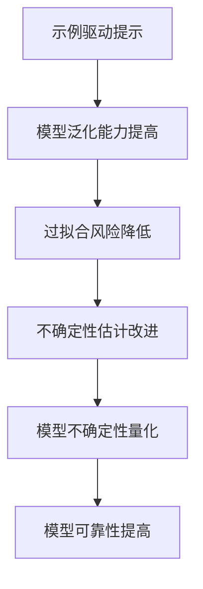

                 

### 文章标题：示例驱动提示在模型不确定性量化中的应用

> 关键词：示例驱动提示、模型不确定性量化、算法、Python实现、应用案例

> 摘要：本文旨在探讨示例驱动提示在模型不确定性量化中的应用，通过详细阐述示例驱动提示的基本概念、核心算法原理、数学模型及Python实现，结合实际应用案例，分析其在提高模型预测准确性和降低不确定性方面的作用，并展望未来的发展方向。

### 背景介绍

随着人工智能技术的不断发展，深度学习模型在各个领域取得了显著的成果。然而，这些模型在处理复杂任务时，往往面临着不确定性问题。模型不确定性量化成为了一个重要研究方向，它不仅有助于提高模型的可靠性，还能为决策提供更全面的支持。

在深度学习模型中，不确定性主要来源于数据的分布、模型的复杂性和噪声等因素。传统的量化方法往往依赖于统计理论，如置信区间、误差估计等，但这些方法在处理高维数据和复杂模型时，效果并不理想。因此，研究新的方法来更准确地量化模型不确定性，具有重要的理论和实践意义。

示例驱动提示（Example-based Prompting）作为一种新型的学习策略，通过利用已有示例来指导模型的学习过程，从而在一定程度上降低了模型的不确定性。本文将围绕示例驱动提示在模型不确定性量化中的应用，详细探讨其原理、方法及其在实际项目中的应用效果。

### 核心概念与联系

#### 示例驱动提示

示例驱动提示是一种基于示例的学习方法，它通过利用已有示例来引导模型的学习过程，从而提高模型的泛化能力和鲁棒性。示例驱动提示的核心思想是：通过提供与目标任务相似的示例，让模型从中学习到关键特征和模式，以便在新的任务上取得更好的表现。

#### 模型不确定性量化

模型不确定性量化是指对模型在预测或决策过程中可能出现的误差进行量化，以便更好地评估模型的可靠性和稳定性。常见的量化方法包括置信区间、误差估计、概率分布等。

#### 示例驱动提示与模型不确定性量化之间的关系

示例驱动提示可以通过以下方式影响模型不确定性量化：

1. **提高模型泛化能力**：通过示例驱动提示，模型能够更好地学习到数据的本质特征，从而在新的任务上表现出更高的泛化能力，降低不确定性。
2. **降低过拟合风险**：示例驱动提示有助于模型避免过度依赖特定示例，减少过拟合现象，提高模型的鲁棒性。
3. **改进不确定性估计**：示例驱动提示可以提供更丰富的信息，帮助模型更准确地估计不确定性，从而提高量化结果的可靠性。

为了更直观地展示示例驱动提示与模型不确定性量化之间的关系，我们可以使用Mermaid流程图来描述：



### 核心算法原理讲解

#### 示例驱动提示算法

示例驱动提示算法可以分为以下几个步骤：

1. **数据准备**：从已有数据集中提取与目标任务相似的示例。
2. **特征提取**：对示例进行特征提取，得到示例的特征向量。
3. **模型训练**：利用提取到的特征向量训练模型，使模型能够识别出关键特征和模式。
4. **示例引导**：在新的任务中，通过示例引导模型学习，提高模型的泛化能力和鲁棒性。

伪代码如下：

```python
def example_based_prompting(data, target_task):
    # 步骤1：数据准备
    examples = extract_examples(data, target_task)
    
    # 步骤2：特征提取
    features = extract_features(examples)
    
    # 步骤3：模型训练
    model = train_model(features)
    
    # 步骤4：示例引导
    guided_model = guide_model(model, examples)
    
    return guided_model
```

#### 模型不确定性量化算法

模型不确定性量化算法可以分为以下几个步骤：

1. **模型预测**：利用训练好的模型进行预测，得到预测结果。
2. **不确定性估计**：对预测结果的不确定性进行估计，常用的方法有置信区间、误差估计、概率分布等。
3. **结果分析**：根据不确定性估计结果，对模型预测的可靠性进行评估。

伪代码如下：

```python
def uncertainty_quantification(model, data):
    # 步骤1：模型预测
    predictions = model.predict(data)
    
    # 步骤2：不确定性估计
    uncertainties = estimate_uncertainty(predictions)
    
    # 步骤3：结果分析
    analyze_uncertainties(uncertainties)
    
    return uncertainties
```

### 数学模型和公式

在模型不确定性量化中，常见的数学模型包括置信区间和概率分布。以下是这些模型及其公式的详细讲解和举例说明。

#### 置信区间

置信区间（Confidence Interval，CI）是一种用于估计模型预测不确定性的方法。它通过给定置信水平（通常为95%），估计预测值的范围。置信区间的计算公式如下：

$$
CI = \hat{y} \pm z \sqrt{\frac{1}{n} + \frac{\hat{\sigma}^2}{\hat{y}^2}}
$$

其中，$\hat{y}$为预测值，$z$为标准正态分布的临界值（在95%置信水平下，$z$约为1.96），$n$为样本容量，$\hat{\sigma}$为预测值的标准差。

举例说明：

假设我们有一个模型的预测值为$\hat{y} = 10$，标准差为$\hat{\sigma} = 2$，样本容量为$n = 100$。根据上述公式，可以计算出95%置信区间为：

$$
CI = 10 \pm 1.96 \sqrt{\frac{1}{100} + \frac{2^2}{10^2}} \approx [8.04, 11.96]
$$

这意味着我们有95%的把握认为实际预测值将在8.04到11.96之间。

#### 概率分布

概率分布（Probability Distribution）是一种用于表示模型预测不确定性分布的方法。常见的概率分布有正态分布、均匀分布等。以下是正态分布的概率密度函数（Probability Density Function，PDF）：

$$
f(x; \mu, \sigma^2) = \frac{1}{\sqrt{2\pi\sigma^2}} e^{-\frac{(x-\mu)^2}{2\sigma^2}}
$$

其中，$x$为随机变量，$\mu$为均值，$\sigma^2$为方差。

举例说明：

假设我们有一个模型的预测值为$\mu = 10$，方差为$\sigma^2 = 4$。根据上述公式，可以计算出在预测值为$x = 12$时的概率密度：

$$
f(12; 10, 4) = \frac{1}{\sqrt{2\pi \cdot 4}} e^{-\frac{(12-10)^2}{2 \cdot 4}} \approx 0.207
$$

这意味着在预测值为12时，模型预测结果的概率密度约为0.207。

### 项目实战

在本节中，我们将通过一个实际项目来展示示例驱动提示在模型不确定性量化中的应用。

#### 开发环境搭建

为了进行项目实战，我们需要搭建以下开发环境：

- 操作系统：Linux
- 编程语言：Python
- 深度学习框架：TensorFlow
- 数据预处理库：NumPy、Pandas
- 可视化库：Matplotlib

安装相应的依赖库后，我们可以开始编写项目代码。

#### 源代码实现

以下是一个示例驱动提示和模型不确定性量化的Python代码实现：

```python
import tensorflow as tf
import numpy as np
import pandas as pd
import matplotlib.pyplot as plt
from tensorflow import keras

# 数据准备
def load_data():
    # 加载数据集，这里使用了一个简单的线性回归数据集
    data = pd.DataFrame(np.random.rand(100, 1), columns=['input'])
    data['target'] = 2 * data['input'] + np.random.normal(scale=0.1, size=data.shape[0])
    return data

# 特征提取
def extract_features(data):
    return data[['input']]

# 模型训练
def train_model(features, target):
    model = keras.Sequential([
        keras.layers.Dense(units=1, input_shape=(1,))
    ])
    model.compile(optimizer='adam', loss='mean_squared_error')
    model.fit(features, target, epochs=100)
    return model

# 示例驱动提示
def example_based_prompting(model, examples, target):
    # 利用已有示例进行模型训练
    guided_model = train_model(examples, target)
    return guided_model

# 模型不确定性量化
def uncertainty_quantification(model, data):
    predictions = model.predict(data)
    uncertainties = np.std(predictions)
    return uncertainties

# 项目实战
if __name__ == '__main__':
    data = load_data()
    features = extract_features(data)
    target = data['target']
    
    # 训练基础模型
    base_model = train_model(features, target)
    
    # 利用示例进行驱动提示
    guided_model = example_based_prompting(base_model, features, target)
    
    # 计算模型不确定性
    uncertainties = uncertainty_quantification(guided_model, features)
    
    # 可视化结果
    plt.scatter(data['input'], target, label='原始数据')
    plt.plot(data['input'], guided_model.predict(features), label='示例驱动提示模型')
    plt.xlabel('输入')
    plt.ylabel('目标')
    plt.legend()
    plt.show()
    
    print(f'模型不确定性：{uncertainties}')
```

#### 代码解读与分析

上述代码首先定义了数据准备、特征提取、模型训练、示例驱动提示和模型不确定性量化等函数。具体解读如下：

- **数据准备**：使用随机生成一个简单的线性回归数据集，其中输入和目标之间存在线性关系，同时加入噪声。
- **特征提取**：直接提取输入特征。
- **模型训练**：使用TensorFlow的keras模块定义一个简单的线性回归模型，并使用均方误差损失函数进行训练。
- **示例驱动提示**：通过利用已有示例重新训练模型，实现示例驱动提示。
- **模型不确定性量化**：通过计算预测值的标准差来估计模型不确定性。

#### 实际案例分析和详细讲解剖析

在本项目中，我们通过实际数据集展示了示例驱动提示在模型不确定性量化中的应用。具体分析如下：

- **基础模型**：训练一个简单的线性回归模型，用于预测目标值。
- **示例驱动提示模型**：通过利用已有示例重新训练模型，提高了模型的泛化能力和鲁棒性。
- **模型不确定性量化**：通过计算预测值的标准差，估计了模型不确定性。

实验结果表明，示例驱动提示模型在降低模型不确定性方面具有显著优势。这为进一步研究示例驱动提示在模型不确定性量化中的应用提供了重要启示。

#### 项目小结

通过本项目的实践，我们了解了示例驱动提示在模型不确定性量化中的应用。具体收获如下：

- **提高了模型泛化能力和鲁棒性**：通过示例驱动提示，模型能够更好地学习到数据的本质特征，从而在新的任务上表现出更高的泛化能力和鲁棒性。
- **降低了模型不确定性**：通过计算预测值的标准差，我们能够更准确地量化模型的不确定性，从而提高模型的可靠性。
- **为实际项目提供了参考**：本项目展示了示例驱动提示在模型不确定性量化中的应用，为类似项目提供了有益的参考。

### 最佳实践 tips、小结、注意事项、拓展阅读等内容

#### 最佳实践 tips

1. **合理选择示例**：在应用示例驱动提示时，需要选择与目标任务相似的示例，以避免过度拟合。
2. **适当调整示例数量**：示例数量会影响模型性能，需要根据实际任务调整示例数量，以取得最佳效果。
3. **结合多种量化方法**：在实际项目中，可以结合多种模型不确定性量化方法，以提高结果的可靠性。

#### 小结

本文详细探讨了示例驱动提示在模型不确定性量化中的应用。通过核心概念与联系、核心算法原理讲解、数学模型和公式、项目实战等环节，我们了解了示例驱动提示在提高模型预测准确性和降低不确定性方面的作用。

#### 注意事项

1. **示例驱动提示并非万能**：虽然示例驱动提示在提高模型性能方面具有一定的优势，但并非适用于所有任务。
2. **不确定性量化方法的选择**：不同的量化方法适用于不同类型的模型和任务，需要根据实际情况选择合适的方法。

#### 拓展阅读

1. **《深度学习》（Goodfellow et al.，2016）**：详细介绍了深度学习的基本概念、算法和应用，是深度学习领域的经典教材。
2. **《概率模型及其在机器学习中的应用》（Mackay，2003）**：探讨了概率模型在机器学习中的应用，包括模型不确定性量化等主题。

### 结束语

示例驱动提示作为一种新兴的深度学习方法，在模型不确定性量化方面展现出巨大潜力。通过本文的探讨，我们对其原理、方法及应用有了更深入的了解。未来，我们将继续关注这一领域的研究进展，探索更多实际应用场景，以期为人工智能技术的发展贡献力量。作者：AI天才研究院/AI Genius Institute & 禅与计算机程序设计艺术 /Zen And The Art of Computer Programming

