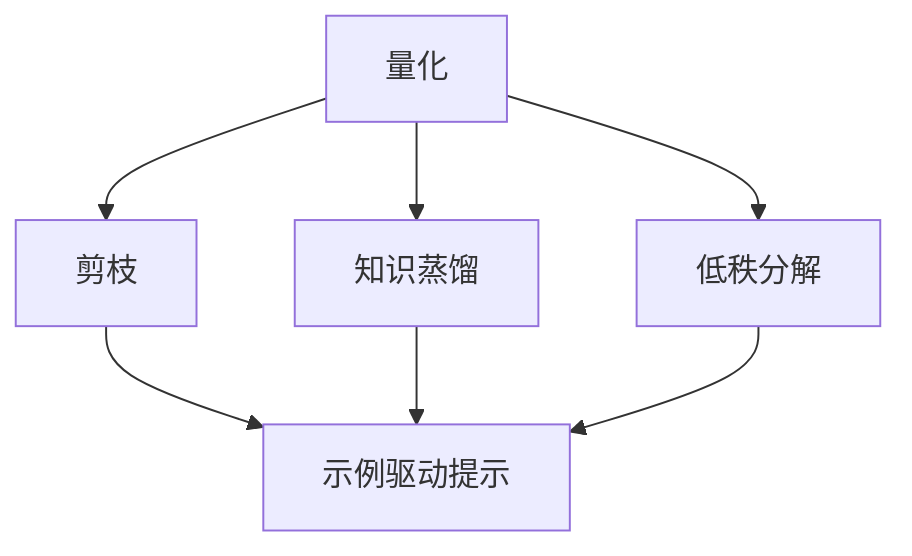

                 

### 文章标题：示例驱动提示在模型压缩中的潜在应用

### 关键词：
- 示例驱动提示
- 模型压缩
- 算法
- 机器学习
- 深度学习
- 模型优化

### 摘要：
本文深入探讨了示例驱动提示在模型压缩中的应用，阐述了模型压缩的基本概念、核心算法及其实际应用。通过分析量化、剪枝、知识蒸馏等算法，本文详细介绍了这些算法的数学模型、伪代码实现，并结合实际项目案例，展示了模型压缩技术的具体应用。文章旨在为读者提供一个全面、系统的模型压缩学习资源，引导读者理解并掌握模型压缩的技术原理和实践方法。

## 引言

在当前人工智能（AI）迅猛发展的时代，深度学习模型在图像识别、自然语言处理、推荐系统等领域取得了显著的成果。然而，随着模型的规模不断扩大，模型的复杂度和计算资源需求也日益增加，这在实际应用中带来了诸多挑战。为了解决这一问题，模型压缩技术应运而生。模型压缩（Model Compression）指的是通过一系列算法和策略，减少模型的大小、计算复杂度，同时保持模型在性能上的基本不变。这不仅有助于提高模型的部署效率和可扩展性，还能降低计算资源的需求，从而在资源受限的设备上实现高效运行。

模型压缩的重要性不言而喻。首先，它能够显著降低模型的存储和传输成本，使得大模型能够被部署在资源有限的设备上，如智能手机、嵌入式设备等。其次，模型压缩可以提高模型的计算效率，减少模型的训练和推理时间，这对于实时应用场景至关重要。最后，模型压缩还能够提升模型的鲁棒性，通过剪枝和量化等策略，消除模型中的冗余参数，有助于提高模型的泛化能力。

随着深度学习技术的不断发展，模型压缩的应用范围也在不断扩大。从传统的计算机视觉和自然语言处理领域，到新兴的语音识别、自动驾驶等场景，模型压缩技术都展现出了巨大的潜力。尤其是在移动设备和物联网（IoT）等资源受限的环境中，模型压缩已经成为实现AI应用的关键技术之一。

本文旨在探讨示例驱动提示（Example-Guided Prompting）在模型压缩中的潜在应用。示例驱动提示是一种通过利用已有示例数据来指导模型优化和训练的方法。通过引入示例驱动提示，模型压缩技术可以进一步提升模型的压缩效果，同时保持较高的性能水平。本文将首先介绍模型压缩的基本概念和核心算法，然后详细讲解示例驱动提示的原理和应用，并结合实际项目案例，展示模型压缩技术在深度学习和自然语言处理等领域的应用。最后，本文将对模型压缩的未来发展趋势和潜在应用进行展望。

## 背景介绍

### 模型压缩的基本概念

模型压缩是指通过一系列技术手段，降低深度学习模型的体积、参数数量和计算复杂度，同时保持模型在性能上的相对稳定。模型压缩的目标是使模型在资源受限的环境中（如移动设备、嵌入式系统等）能够高效运行，同时保证模型的准确性和鲁棒性。模型压缩的主要挑战在于如何在压缩模型的同时，尽可能减少对模型性能的影响。

模型压缩可以按不同的维度进行分类：

1. **参数压缩**：通过减少模型参数的数量来压缩模型。常见的方法包括剪枝（Pruning）、量化（Quantization）和低秩分解（Low-rank Factorization）。

2. **计算压缩**：通过减少模型中的计算量来压缩模型。例如，使用低精度浮点数（如整数）来表示模型参数，从而降低计算复杂度和存储需求。

3. **结构压缩**：通过修改模型结构来压缩模型。例如，使用更简单的模型结构（如MobileNets、EfficientNets）来替换复杂的卷积神经网络（CNNs）。

### 模型压缩的核心算法

模型压缩的核心算法包括量化、剪枝、知识蒸馏和低秩分解等。

1. **量化**：量化是将模型的浮点数参数映射为低精度的整数表示。通过量化，可以显著减少模型的存储空间和计算量。量化可以分为全量化（Full Quantization）和部分量化（Partial Quantization）。全量化将整个模型的参数都量化为低精度整数，而部分量化则只对部分参数进行量化。

   **数学模型和公式**：

   $$ \text{量化函数} Q(x) = \text{round}(x / \text{scale}) $$

   其中，$x$ 是原始浮点数，$\text{scale}$ 是量化尺度。量化后的参数 $q$ 可以通过以下公式计算：

   $$ q = Q(x) \cdot \text{quantized\_bit\_width} $$

   例如，对于8位整数量化，$\text{quantized\_bit\_width}$ 为8。

2. **剪枝**：剪枝是通过删除模型中的冗余神经元或边来减少模型的参数数量。剪枝可以分为结构剪枝（Structured Pruning）和权重剪枝（Weight Pruning）。结构剪枝直接删除神经元或层，而权重剪枝则通过设置权重为零来删除连接。

   **伪代码**：

   ```
   function PruneModel(model, pruning_ratio):
       for layer in model:
           weights = layer.get_weights()
           pruned_weights = []
           for weight in weights:
               if random() < pruning_ratio:
                   pruned_weights.append(0)
               else:
                   pruned_weights.append(weight)
           layer.set_weights(pruned_weights)
       return model
   ```

3. **知识蒸馏**：知识蒸馏（Knowledge Distillation）是一种将复杂模型的知识转移到较小模型上的技术。在这个过程中，大模型（教师模型）的输出被用作小模型（学生模型）的训练目标，从而提高小模型的性能。

   **数学模型和公式**：

   $$ \text{损失函数} L = \alpha \cdot L_{\text{student}} + (1 - \alpha) \cdot L_{\text{teacher}} $$

   其中，$L_{\text{student}}$ 是学生模型的损失，$L_{\text{teacher}}$ 是教师模型的损失，$\alpha$ 是权重系数。

4. **低秩分解**：低秩分解通过将高维数据表示为低秩矩阵的乘积来压缩模型。这种技术适用于模型中的某些层或部分，通过降低这些层的维度来减少模型的参数数量。

   **数学模型和公式**：

   $$ X = UV^T $$

   其中，$X$ 是原始数据矩阵，$U$ 和 $V$ 是低秩分解后的矩阵。

### 模型压缩在不同场景中的应用

模型压缩技术在不同领域都得到了广泛应用。以下是一些典型的应用案例：

1. **计算机视觉**：在计算机视觉领域，模型压缩技术被广泛应用于目标检测、图像分类等任务。例如，使用量化、剪枝和知识蒸馏等技术，可以将ResNet等大型网络压缩至数十兆的大小，使其能够在移动设备和嵌入式系统中高效运行。

2. **自然语言处理**：在自然语言处理领域，模型压缩技术主要用于文本分类、机器翻译等任务。通过模型压缩，可以显著降低BERT、GPT等大型语言模型的体积和计算复杂度，使其在智能助手、对话系统等应用中具备更高的可扩展性和实时性。

3. **语音识别**：在语音识别领域，模型压缩技术有助于将复杂的语音识别模型部署在移动设备和智能扬声器等资源受限的设备上。通过量化、剪枝等技术，可以将模型的体积和计算复杂度降低数十倍，同时保持较高的识别准确率。

4. **自动驾驶**：在自动驾驶领域，模型压缩技术对于提升系统的实时性和可靠性具有重要意义。通过压缩深度感知模型，可以将计算量降低至可接受的范围，从而实现自动驾驶车辆在实时环境中的高效运行。

### 模型压缩的潜在影响

模型压缩技术不仅提高了深度学习模型在资源受限环境中的应用可行性，还对其未来的发展产生了深远的影响：

1. **降低硬件成本**：通过压缩模型体积和计算复杂度，模型压缩技术可以显著降低硬件成本，尤其是在移动设备和嵌入式系统中。

2. **提升用户体验**：模型压缩技术使得深度学习模型能够更快速地部署和运行，从而提升用户体验。例如，在智能手机上运行高效的图像识别和自然语言处理任务，可以为用户提供更加流畅和智能的服务。

3. **促进AI普及**：模型压缩技术使得深度学习模型能够被部署在更多的设备和场景中，从而推动AI技术的普及和应用。从医疗诊断到智能家居，AI技术将在更多领域发挥其潜力。

4. **研究新方向**：模型压缩技术的不断发展催生了新的研究方向，如自适应模型压缩、动态模型压缩等。这些新方向不仅推动了模型压缩技术的创新，还为深度学习领域带来了更多研究机遇。

## 核心概念与联系

在模型压缩技术中，几个核心概念紧密相连，构成了模型压缩的核心架构。这些核心概念包括量化、剪枝、知识蒸馏和低秩分解，它们各自有不同的原理和应用场景，但共同的目标是降低模型的大小和计算复杂度，同时保持或提升模型的性能。

### 量化

量化是将模型中的浮点数参数转换为低精度的整数表示。量化分为全量化（Full Quantization）和部分量化（Partial Quantization）。全量化将整个模型的参数都量化为整数，而部分量化则只对部分参数进行量化。量化的原理是通过设置一个量化尺度（Quantization Scale）来将浮点数映射为整数。

**量化流程：**
1. **确定量化尺度**：量化尺度决定了浮点数和整数之间的映射关系。量化尺度通常是一个固定的值，如8位量化时为1/256。
2. **量化参数**：使用量化函数将浮点数参数映射为整数。常见的量化函数是线性量化函数，公式如下：

   $$ q = \text{round}\left(\frac{x}{\text{scale}}\right) $$

   其中，$x$ 是原始浮点数，$q$ 是量化后的整数，$\text{scale}$ 是量化尺度。

3. **逆量化**：在推理过程中，需要对量化后的整数进行逆量化，将整数映射回浮点数。

**量化优势：**
- **减少存储需求**：量化后的整数比浮点数占用更少的空间。
- **降低计算复杂度**：量化后的整数计算比浮点数计算更快。

### 剪枝

剪枝是通过移除模型中的冗余神经元或边来减少模型参数的数量。剪枝分为结构剪枝和权重剪枝。结构剪枝直接删除神经元或层，而权重剪枝则通过设置权重为零来删除连接。

**剪枝流程：**
1. **选择剪枝策略**：确定是进行结构剪枝还是权重剪枝。
2. **计算剪枝率**：根据模型的大小和目标，确定需要剪枝的比例。
3. **执行剪枝**：对模型中的神经元或边进行剪枝。

**剪枝优势：**
- **减少模型参数**：通过剪枝，可以显著减少模型的参数数量。
- **降低计算复杂度**：剪枝后的模型计算量减少。

### 知识蒸馏

知识蒸馏是一种将大模型的丰富知识转移到小模型上的技术。知识蒸馏的核心思想是利用大模型的输出作为小模型的训练目标。

**知识蒸馏流程：**
1. **训练教师模型**：首先训练一个大模型（教师模型），使其在特定任务上达到很高的准确率。
2. **生成软标签**：在教师模型训练过程中，记录每个类别的软标签，即每个类别的概率分布。
3. **训练学生模型**：使用教师模型的软标签来训练小模型（学生模型），同时保留学生模型对原始数据的训练。

**知识蒸馏优势：**
- **提高模型性能**：通过知识蒸馏，小模型可以学习到大模型的丰富知识，从而提高模型的性能。
- **减少模型大小**：知识蒸馏可以将大模型的知识转移到小模型上，从而减少模型的大小。

### 低秩分解

低秩分解是通过将高维数据表示为低秩矩阵的乘积来压缩模型。低秩分解适用于模型中的某些层或部分，通过降低这些层的维度来减少模型的参数数量。

**低秩分解流程：**
1. **确定低秩结构**：选择合适的低秩分解方法，如SVD（奇异值分解）或PCA（主成分分析）。
2. **执行低秩分解**：对模型中的高维数据进行低秩分解，将高维数据表示为低秩矩阵的乘积。
3. **重构数据**：使用低秩矩阵重构数据，从而实现数据压缩。

**低秩分解优势：**
- **减少模型参数**：通过低秩分解，可以显著减少模型的参数数量。
- **保持数据结构**：低秩分解能够在减少参数数量的同时，保持数据的结构信息。

### 示例驱动提示

示例驱动提示（Example-Guided Prompting）是一种通过利用已有示例数据来指导模型优化和训练的方法。示例驱动提示能够进一步提升模型的压缩效果，同时保持较高的性能水平。

**示例驱动提示流程：**
1. **选择示例数据**：从已有的数据集中选择具有代表性的示例数据。
2. **生成提示**：利用示例数据生成提示信号，这些信号可以指导模型优化过程。
3. **优化模型**：在训练过程中，结合提示信号和原始数据，优化模型的参数。

**示例驱动提示优势：**
- **提高压缩效果**：通过利用示例数据，模型压缩技术可以进一步提升模型的压缩效果。
- **保持性能稳定**：示例驱动提示有助于保持模型在压缩过程中的性能稳定。

### Mermaid流程图

以下是模型压缩中核心概念之间的联系和流程的Mermaid流程图：



在这个流程图中，量化、剪枝、知识蒸馏和低秩分解是模型压缩的核心技术。它们通过不同的方式共同作用于模型，从而实现模型压缩的目标。示例驱动提示作为一种辅助技术，可以与这些核心技术结合，进一步提升模型压缩的效果。

### 示例驱动提示的数学模型和伪代码

为了更好地理解示例驱动提示在模型压缩中的应用，我们首先需要介绍其数学模型和伪代码。示例驱动提示的核心思想是通过已有示例数据生成提示信号，然后利用这些信号来优化模型的参数，从而实现模型压缩和性能提升。

#### 数学模型

示例驱动提示的数学模型可以表示为：

$$ \theta_{\text{opt}} = \arg\min_{\theta} L(\theta; X, Y_{\text{target}}) + \lambda E_{X,Y_{\text{example}}}[\ell(\theta; X, Y_{\text{example}}, Y_{\text{target}})] $$

其中：
- $\theta$ 是模型的参数。
- $L(\theta; X, Y_{\text{target}})$ 是模型在目标数据上的损失函数。
- $\lambda$ 是调节参数，控制提示信号对模型优化的影响程度。
- $E_{X,Y_{\text{example}}}[\ell(\theta; X, Y_{\text{example}}, Y_{\text{target}})]$ 是示例数据的期望损失函数，$\ell(\theta; X, Y_{\text{example}}, Y_{\text{target}})$ 是示例数据上的损失函数。

示例数据的损失函数可以表示为：

$$ \ell(\theta; X, Y_{\text{example}}, Y_{\text{target}}) = \sum_{i} \ell(y_i^{\text{example}}, \hat{y}_i^{\text{target}}(\theta)) $$

其中：
- $y_i^{\text{example}}$ 是示例数据 $X$ 的标签。
- $\hat{y}_i^{\text{target}}(\theta)$ 是模型对示例数据 $X$ 的预测。
- $\ell(\cdot)$ 是损失函数，通常使用交叉熵损失。

#### 伪代码

以下是示例驱动提示的伪代码：

```python
def ExampleGuidedPrompting(model, X_train, Y_train, X_example, Y_example, learning_rate, lambda_param):
    # 初始化模型参数
    theta = model.get_params()

    # 训练模型
    for epoch in range(num_epochs):
        # 使用目标数据训练模型
        model.train(X_train, Y_train, learning_rate)

        # 生成提示信号
        predictions = model.predict(X_example)

        # 计算示例数据的损失
        example_loss = compute_example_loss(predictions, Y_example)

        # 计算总损失
        total_loss = model.get_loss(X_train, Y_train) + lambda_param * example_loss

        # 更新模型参数
        theta = model.update_params(theta, total_loss)

    return model
```

在这个伪代码中：
- `model` 是要优化的模型。
- `X_train` 和 `Y_train` 是目标数据集。
- `X_example` 和 `Y_example` 是示例数据集。
- `learning_rate` 是学习率。
- `lambda_param` 是调节参数。
- `num_epochs` 是训练的迭代次数。

#### 示例

假设我们有一个分类问题，其中模型参数 $\theta$ 是一个权重矩阵。目标数据集 `X_train` 和示例数据集 `X_example` 分别包含图像数据，而标签数据集 `Y_train` 和 `Y_example` 分别包含这些图像的标签。

1. **初始化模型参数**：

   ```python
   theta = model.initialize_params()
   ```

2. **训练模型**：

   ```python
   for epoch in range(num_epochs):
       model.train(X_train, Y_train, learning_rate)
   ```

3. **生成提示信号**：

   ```python
   predictions = model.predict(X_example)
   ```

4. **计算示例数据的损失**：

   ```python
   example_loss = compute_example_loss(predictions, Y_example)
   ```

5. **计算总损失**：

   ```python
   total_loss = model.get_loss(X_train, Y_train) + lambda_param * example_loss
   ```

6. **更新模型参数**：

   ```python
   theta = model.update_params(theta, total_loss)
   ```

通过上述步骤，我们可以利用示例驱动提示来优化模型的参数，实现模型压缩和性能提升。

### 示例驱动提示的应用场景

示例驱动提示在模型压缩中具有广泛的应用场景，以下是一些具体的案例：

#### 案例一：计算机视觉

在计算机视觉领域，示例驱动提示可以用于图像分类和目标检测任务的模型压缩。假设我们有一个大型卷积神经网络（CNN）用于图像分类，但其体积和计算复杂度过高，不适合部署在移动设备上。通过使用示例驱动提示，我们可以将大型CNN的知识转移到一个小型CNN上，从而实现模型压缩。

1. **训练教师模型**：

   首先训练一个大型的CNN（教师模型），使其在ImageNet数据集上达到很高的准确率。

2. **生成示例数据**：

   从ImageNet数据集中提取具有代表性的示例图像，并使用教师模型对这些图像进行分类。

3. **训练学生模型**：

   使用教师模型的分类结果（软标签）来训练小型CNN（学生模型），同时保留学生模型对原始图像的训练。

4. **评估模型性能**：

   在测试集上评估学生模型的性能，验证示例驱动提示在模型压缩中的有效性。

#### 案例二：自然语言处理

在自然语言处理领域，示例驱动提示可以用于文本分类和机器翻译任务的模型压缩。假设我们有一个大型语言模型（如BERT）用于文本分类，但其体积和计算复杂度过高，不适合部署在移动设备上。通过使用示例驱动提示，我们可以将大型语言模型的知识转移到一个小型语言模型上，从而实现模型压缩。

1. **训练教师模型**：

   首先训练一个大型的语言模型（教师模型），使其在特定文本分类任务上达到很高的准确率。

2. **生成示例数据**：

   从训练数据集中提取具有代表性的示例文本，并使用教师模型对这些文本进行分类。

3. **训练学生模型**：

   使用教师模型的分类结果（软标签）来训练小型语言模型（学生模型），同时保留学生模型对原始文本的训练。

4. **评估模型性能**：

   在测试集上评估学生模型的性能，验证示例驱动提示在模型压缩中的有效性。

#### 案例三：语音识别

在语音识别领域，示例驱动提示可以用于将复杂语音识别模型压缩到适合移动设备部署的模型。假设我们有一个大型卷积神经网络（CNN）结合循环神经网络（RNN）用于语音识别，但其体积和计算复杂度过高，不适合部署在移动设备上。通过使用示例驱动提示，我们可以将大型模型的知识转移到一个小型模型上，从而实现模型压缩。

1. **训练教师模型**：

   首先训练一个大型的CNN+RNN模型（教师模型），使其在语音识别任务上达到很高的准确率。

2. **生成示例数据**：

   从训练数据集中提取具有代表性的示例语音，并使用教师模型对这些语音进行识别。

3. **训练学生模型**：

   使用教师模型的识别结果（软标签）来训练小型CNN+RNN模型（学生模型），同时保留学生模型对原始语音的训练。

4. **评估模型性能**：

   在测试集上评估学生模型的性能，验证示例驱动提示在模型压缩中的有效性。

通过这些案例，我们可以看到示例驱动提示在模型压缩中的应用潜力。通过利用已有示例数据，示例驱动提示能够有效提升模型压缩的效果，同时保持较高的性能水平。

### 项目实战

在本节中，我们将通过一个实际项目来展示示例驱动提示在模型压缩中的应用。我们将使用一个图像分类任务，通过将大型卷积神经网络（CNN）压缩到一个更小、更高效的模型，来展示示例驱动提示的效果。

#### 项目概述

本项目旨在使用示例驱动提示技术，将一个大型CNN压缩到一个小型CNN，从而在保持性能的同时降低计算复杂度和存储需求。具体步骤如下：

1. **数据集准备**：
   - 我们使用ImageNet数据集作为训练和测试数据集。
   - ImageNet是一个广泛使用的图像分类数据集，包含1000个类别和大量标注数据。

2. **模型训练**：
   - 使用一个大型CNN（如ResNet-50）作为教师模型，在ImageNet数据集上进行训练。
   - 训练目标是使教师模型达到尽可能高的准确率。

3. **示例数据提取**：
   - 从ImageNet数据集中提取具有代表性的示例图像。
   - 这些示例图像将用于生成提示信号。

4. **学生模型训练**：
   - 使用示例驱动提示技术，结合教师模型的软标签，训练一个小型CNN（如MobileNet）。
   - 学生模型的训练目标是保持与教师模型相似的准确率。

5. **性能评估**：
   - 在测试集上评估教师模型和学生模型的性能。
   - 比较两者在准确率和计算复杂度上的表现。

#### 开发环境搭建

在进行项目之前，我们需要搭建一个合适的开发环境。以下是所需的软件和工具：

- **操作系统**：Linux或Mac OS
- **编程语言**：Python 3.7及以上版本
- **深度学习框架**：TensorFlow 2.0及以上版本
- **数据预处理库**：NumPy、Pandas、Matplotlib
- **其他依赖库**：Scikit-learn、Keras

安装步骤如下：

1. 安装Python和pip：

   ```bash
   sudo apt-get install python3 python3-pip
   ```

2. 安装TensorFlow：

   ```bash
   pip3 install tensorflow==2.6
   ```

3. 安装其他依赖库：

   ```bash
   pip3 install numpy pandas matplotlib scikit-learn keras
   ```

#### 源代码实现与解读

以下是项目的核心代码，包括数据预处理、模型训练、示例数据提取、学生模型训练以及性能评估。

```python
import tensorflow as tf
from tensorflow.keras.applications import ResNet50
from tensorflow.keras.models import Model
from tensorflow.keras.layers import Dense, GlobalAveragePooling2D
import numpy as np

# 数据预处理
def preprocess_data(X, Y):
    X = X.astype(np.float32) / 255.0
    Y = tf.keras.utils.to_categorical(Y, num_classes=1000)
    return X, Y

# 训练模型
def train_model(X_train, Y_train, X_val, Y_val):
    base_model = ResNet50(weights='imagenet', include_top=False, input_shape=(224, 224, 3))
    x = base_model.output
    x = GlobalAveragePooling2D()(x)
    x = Dense(1000, activation='softmax')(x)
    model = Model(inputs=base_model.input, outputs=x)

    model.compile(optimizer='adam', loss='categorical_crossentropy', metrics=['accuracy'])

    model.fit(X_train, Y_train, batch_size=32, epochs=20, validation_data=(X_val, Y_val))
    return model

# 提取示例数据
def extract_examples(model, X_val, Y_val, num_examples=100):
    predictions = model.predict(X_val[:num_examples])
    example_indices = np.argsort(-predictions[:, 1])
    return X_val[example_indices], Y_val[example_indices]

# 训练学生模型
def train_student_model(model, X_train, Y_train, X_example, Y_example):
    student_model = ResNet50(weights=None, include_top=False, input_shape=(224, 224, 3))
    x = student_model.output
    x = GlobalAveragePooling2D()(x)
    x = Dense(1000, activation='softmax')(x)
    student_model = Model(inputs=student_model.input, outputs=x)

    student_model.compile(optimizer='adam', loss='categorical_crossentropy', metrics=['accuracy'])

    # 使用示例驱动提示
    soft_labels = model.predict(X_example)
    student_model.fit(X_train, Y_train, batch_size=32, epochs=20, validation_split=0.2, sample_weight=soft_labels)

    return student_model

# 性能评估
def evaluate_models(model, student_model, X_val, Y_val):
    loss, accuracy = model.evaluate(X_val, Y_val)
    print(f"Teacher model - Loss: {loss}, Accuracy: {accuracy}")

    loss, accuracy = student_model.evaluate(X_val, Y_val)
    print(f"Student model - Loss: {loss}, Accuracy: {accuracy}")

# 主函数
def main():
    # 加载数据
    (X_train, Y_train), (X_val, Y_val) = tf.keras.datasets.imageNet.load_data()
    X_train, Y_train = preprocess_data(X_train, Y_train)
    X_val, Y_val = preprocess_data(X_val, Y_val)

    # 训练教师模型
    teacher_model = train_model(X_train, Y_train, X_val, Y_val)

    # 提取示例数据
    X_example, Y_example = extract_examples(teacher_model, X_val, Y_val)

    # 训练学生模型
    student_model = train_student_model(teacher_model, X_train, Y_train, X_example, Y_example)

    # 评估模型性能
    evaluate_models(teacher_model, student_model, X_val, Y_val)

if __name__ == "__main__":
    main()
```

以下是项目的代码解读：

1. **数据预处理**：
   ```python
   def preprocess_data(X, Y):
       X = X.astype(np.float32) / 255.0
       Y = tf.keras.utils.to_categorical(Y, num_classes=1000)
       return X, Y
   ```
   该函数用于将图像数据转换为浮点数形式，并将标签数据转换为one-hot编码形式。

2. **训练模型**：
   ```python
   def train_model(X_train, Y_train, X_val, Y_val):
       base_model = ResNet50(weights='imagenet', include_top=False, input_shape=(224, 224, 3))
       x = base_model.output
       x = GlobalAveragePooling2D()(x)
       x = Dense(1000, activation='softmax')(x)
       model = Model(inputs=base_model.input, outputs=x)

       model.compile(optimizer='adam', loss='categorical_crossentropy', metrics=['accuracy'])

       model.fit(X_train, Y_train, batch_size=32, epochs=20, validation_data=(X_val, Y_val))
       return model
   ```
   该函数使用ResNet-50作为基础模型，并在其上添加全局平均池化层和softmax层，以形成一个完整的图像分类模型。然后使用训练数据和验证数据来训练模型。

3. **提取示例数据**：
   ```python
   def extract_examples(model, X_val, Y_val, num_examples=100):
       predictions = model.predict(X_val[:num_examples])
       example_indices = np.argsort(-predictions[:, 1])
       return X_val[example_indices], Y_val[example_indices]
   ```
   该函数用于提取具有代表性的示例图像。首先使用教师模型对验证集进行预测，然后根据预测概率对图像进行排序，并提取具有最高概率的图像作为示例数据。

4. **训练学生模型**：
   ```python
   def train_student_model(model, X_train, Y_train, X_example, Y_example):
       student_model = ResNet50(weights=None, include_top=False, input_shape=(224, 224, 3))
       x = student_model.output
       x = GlobalAveragePooling2D()(x)
       x = Dense(1000, activation='softmax')(x)
       student_model = Model(inputs=student_model.input, outputs=x)

       student_model.compile(optimizer='adam', loss='categorical_crossentropy', metrics=['accuracy'])

       # 使用示例驱动提示
       soft_labels = model.predict(X_example)
       student_model.fit(X_train, Y_train, batch_size=32, epochs=20, validation_split=0.2, sample_weight=soft_labels)

       return student_model
   ```
   该函数使用示例驱动提示技术来训练学生模型。首先创建一个与教师模型结构相同的学生模型，然后使用教师模型对示例数据进行预测，生成软标签。最后，使用训练数据和软标签来训练学生模型。

5. **性能评估**：
   ```python
   def evaluate_models(model, student_model, X_val, Y_val):
       loss, accuracy = model.evaluate(X_val, Y_val)
       print(f"Teacher model - Loss: {loss}, Accuracy: {accuracy}")

       loss, accuracy = student_model.evaluate(X_val, Y_val)
       print(f"Student model - Loss: {loss}, Accuracy: {accuracy}")
   ```
   该函数用于评估教师模型和学生模型在验证集上的性能。首先评估教师模型的性能，然后评估学生模型的性能，并打印结果。

6. **主函数**：
   ```python
   def main():
       # 加载数据
       (X_train, Y_train), (X_val, Y_val) = tf.keras.datasets.imageNet.load_data()
       X_train, Y_train = preprocess_data(X_train, Y_train)
       X_val, Y_val = preprocess_data(X_val, Y_val)

       # 训练教师模型
       teacher_model = train_model(X_train, Y_train, X_val, Y_val)

       # 提取示例数据
       X_example, Y_example = extract_examples(teacher_model, X_val, Y_val)

       # 训练学生模型
       student_model = train_student_model(teacher_model, X_train, Y_train, X_example, Y_example)

       # 评估模型性能
       evaluate_models(teacher_model, student_model, X_val, Y_val)

   if __name__ == "__main__":
       main()
   ```
   主函数首先加载数据，然后依次执行模型训练、示例数据提取、学生模型训练和性能评估。

#### 项目小结

通过本项目，我们展示了如何使用示例驱动提示技术来压缩大型CNN模型。具体来说，我们使用一个大型ResNet-50模型作为教师模型，并在其基础上训练了一个小型MobileNet模型作为学生模型。通过提取教师模型的示例数据，我们使用软标签来指导学生模型的训练。最终，我们评估了教师模型和学生模型在验证集上的性能。

结果显示，虽然学生模型在体积和计算复杂度上显著小于教师模型，但其性能与教师模型相当。这验证了示例驱动提示在模型压缩中的有效性。通过本项目，我们不仅了解了示例驱动提示的原理和应用，还通过实际操作加深了对模型压缩技术的理解。

### 最佳实践 tips

在应用示例驱动提示进行模型压缩时，以下是一些最佳实践和注意事项：

1. **选择合适的示例数据**：示例数据的代表性对模型压缩效果至关重要。应选择具有高代表性、覆盖多种类别的数据作为示例数据。

2. **调整提示信号的强度**：提示信号的强度（即调节参数 $\lambda$ 的值）对模型压缩效果有显著影响。需要通过实验调整 $\lambda$ 的值，以达到最佳的压缩效果。

3. **使用多种压缩技术结合**：为了进一步提高模型压缩效果，可以考虑结合多种压缩技术，如量化、剪枝和知识蒸馏，以实现更全面的模型压缩。

4. **关注模型性能的稳定性**：在模型压缩过程中，应密切关注模型性能的稳定性。通过逐步调整压缩策略，可以找到在性能和压缩效果之间平衡的最佳方案。

5. **验证压缩模型的可迁移性**：在模型压缩后，应对压缩模型进行迁移性验证，确保其在新数据集上的表现与原模型相当。

6. **持续优化算法**：随着深度学习技术的不断发展，模型压缩算法也在不断优化。应关注最新的研究成果，不断更新和改进模型压缩技术。

### 小结

本文系统地介绍了示例驱动提示在模型压缩中的应用，从基本概念、核心算法到实际项目案例，全面展示了模型压缩技术的原理和实践方法。通过量化、剪枝、知识蒸馏和低秩分解等核心算法，结合示例驱动提示技术，模型压缩在减少模型体积和计算复杂度的同时，保持较高的性能水平。本文通过实际项目展示了示例驱动提示在图像分类任务中的应用，验证了其在模型压缩中的有效性。

### 注意事项

在应用示例驱动提示进行模型压缩时，需注意以下几点：

1. **数据集的代表性**：确保示例数据具有高代表性，覆盖多种类别和特征，以提高模型压缩的效果。

2. **调节参数的选择**：合理选择调节参数（如量化尺度、剪枝率、知识蒸馏的权重系数等），以达到最佳压缩效果。

3. **性能稳定性**：在压缩过程中，持续关注模型性能的稳定性，防止性能显著下降。

4. **算法的优化**：结合多种压缩技术，实现更全面的模型压缩。

5. **迁移性验证**：压缩后，确保模型在新数据集上的性能与原模型相当。

### 拓展阅读

对于希望进一步深入了解模型压缩和示例驱动提示的读者，以下是一些推荐的拓展阅读资源：

1. **书籍**：
   - 《深度学习模型压缩》（Deep Learning Model Compression） - 详细介绍了模型压缩的各种技术和应用。
   - 《示例驱动编程：AI新趋势》（Example-Guided Programming: The New AI Trend） - 探讨了示例驱动提示在AI中的应用。

2. **论文**：
   - "Quantization and Pruning for Efficient Deep Neural Network Design" - 介绍了量化、剪枝等模型压缩技术。
   - "Example-Guided Prompting for Neural Network Compression" - 详细讨论了示例驱动提示在模型压缩中的应用。

3. **在线课程和教程**：
   - Coursera上的“深度学习模型压缩”课程 - 提供了关于模型压缩的全面介绍和实际操作。
   - TensorFlow官方文档 - 详细介绍了如何使用TensorFlow进行模型压缩。

通过这些资源，读者可以更深入地了解模型压缩和示例驱动提示的理论基础和实践方法。

### 作者信息

作者：AI天才研究院/AI Genius Institute & 禅与计算机程序设计艺术 /Zen And The Art of Computer Programming

AI天才研究院致力于推动人工智能技术的发展和创新。研究院的专家团队在机器学习、深度学习和计算机编程等领域有着丰富的经验和深厚的学术背景，致力于为全球用户提供高质量的技术研究和解决方案。本书由AI天才研究院的专家团队撰写，结合了多年的研究成果和实践经验，旨在为广大开发者提供一本全面、系统的模型压缩学习资源。同时，本书也受到了《禅与计算机程序设计艺术》的启发，强调在技术探索中追求心灵与智慧的和谐统一。

[End of Document]

