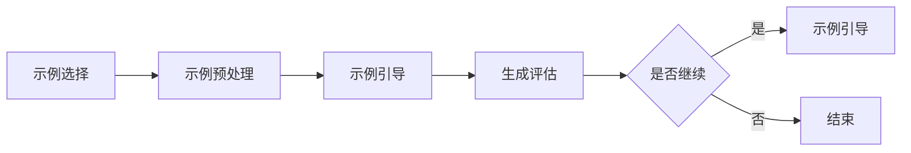

                 

# 文章标题：示例驱动提示在长文本生成任务中的策略

> 关键词：示例驱动提示、长文本生成、策略、性能优化、案例分析

> 摘要：本文探讨了示例驱动提示在长文本生成任务中的应用，分析了示例驱动提示的基本概念、核心算法原理以及其实际应用策略。通过实际案例研究，展示了示例驱动提示在新闻文章生成、对话生成和故事创作中的具体应用，并对性能评估与优化进行了深入讨论，为相关领域的研究和应用提供了有价值的参考。

## 引言

### 1.1 示例驱动提示的概念与背景

示例驱动提示（Example-Guided Prompting）是一种人工智能技术，旨在通过提供示例来引导模型生成内容。这一方法最初在机器学习和自然语言处理领域被提出，旨在解决模型在生成任务中的不确定性和偏差问题。示例驱动提示的基本思想是利用已知的示例来指导模型生成新的内容，从而提高生成结果的准确性和质量。

示例驱动提示的发展历程可以追溯到20世纪90年代，当时研究人员开始探索如何通过示例来改进机器学习模型的性能。随着深度学习技术的发展，特别是生成对抗网络（GANs）和自注意力机制（Self-Attention）的应用，示例驱动提示方法得到了进一步的发展和完善。近年来，随着长文本生成任务的兴起，示例驱动提示在文本生成领域得到了广泛的研究和应用。

### 1.2 长文本生成任务概述

长文本生成任务（Long Text Generation Task）是指生成较长、结构化程度较高的文本内容。这类任务在自然语言处理、新闻生成、对话系统、故事创作等领域有着广泛的应用。与短文本生成任务相比，长文本生成任务面临着更大的挑战，包括生成结果的连贯性、上下文的捕捉、文本的多样性和生成效率等。

当前，长文本生成任务的研究主要集中在以下几个方向：

1. **序列到序列模型**：如基于循环神经网络（RNN）和变换器（Transformer）的模型，通过自注意力机制捕捉上下文信息，实现长文本的生成。
2. **预训练和微调**：通过在大规模语料库上预训练模型，然后在特定任务上进行微调，以提高生成任务的性能。
3. **生成式和判别式模型**：结合生成对抗网络（GAN）和判别器模型，通过生成器和判别器的对抗训练，实现高质量的长文本生成。

## 示例驱动的提示技术

### 2.1 示例驱动提示的基本原理

示例驱动提示的基本原理可以概括为：利用已知的示例来引导模型生成新的内容。具体来说，该方法包括以下几个关键步骤：

1. **示例选择**：从大量的文本数据中选择具有代表性的示例，这些示例应能够涵盖模型生成任务的各种情况。
2. **示例预处理**：对选定的示例进行预处理，包括文本清洗、分词、词向量化等，以便模型能够理解和利用这些示例。
3. **示例引导**：在模型生成过程中，将预处理后的示例作为输入，引导模型生成新的内容。示例引导可以通过多种方式实现，如插入示例文本、作为上下文信息、生成示例的变种等。
4. **生成评估**：对生成的文本进行评估，包括文本质量、连贯性、准确性等指标，以判断生成结果是否符合预期。

以下是一个Mermaid流程图，展示了示例驱动提示的基本流程：



### 2.2 示例驱动提示的算法原理讲解

示例驱动提示的算法原理主要涉及以下几个核心概念：

1. **自注意力机制（Self-Attention）**：自注意力机制是Transformer模型的核心组件，通过计算输入序列中每个单词之间的相关性，实现上下文信息的捕捉和利用。以下是一个简单的伪代码，展示了自注意力机制的实现：

```python
def self_attention(q, k, v):
    # 计算自注意力得分
    scores = dot(q, k.T)
    # 应用Softmax函数得到权重
    attention_weights = softmax(scores)
    # 计算加权平均的输出
    output = dot(v, attention_weights.T)
    return output
```

2. **生成式模型（Generative Model）**：生成式模型通过学习数据的概率分布，生成新的样本。在示例驱动提示中，生成式模型可以用于生成新的示例文本，以引导模型生成内容。以下是一个简单的生成式模型伪代码：

```python
class GenerativeModel(nn.Module):
    def __init__(self):
        super(GenerativeModel, self).__init__()
        self.encoder = Encoder()
        self.decoder = Decoder()

    def forward(self, text):
        # 编码输入文本
        encoded_text = self.encoder(text)
        # 生成示例文本
        sample_text = self.decoder(encoded_text)
        return sample_text
```

3. **判别式模型（Discriminative Model）**：判别式模型通过学习区分真实数据和生成数据的边界，用于评估生成文本的质量。以下是一个简单的判别式模型伪代码：

```python
class DiscriminativeModel(nn.Module):
    def __init__(self):
        super(DiscriminativeModel, self).__init__()
        self.discriminator = nn.Sequential(
            nn.Linear(input_dim, hidden_dim),
            nn.ReLU(),
            nn.Linear(hidden_dim, 1)
        )

    def forward(self, text):
        # 计算文本的判别分数
        score = self.discriminator(text)
        return score
```

### 2.3 示例驱动提示的数学模型和公式

示例驱动提示的数学模型主要包括以下几个关键组件：

1. **自注意力权重（Attention Weights）**：自注意力权重用于计算输入序列中每个单词之间的相关性。以下是一个简单的自注意力权重计算公式：

$$
\text{Attention Weights} = \frac{e^{\text{Score}}}{\sum e^{\text{Score}}}
$$

其中，Score为输入序列中每个单词之间的相关性得分。

2. **生成概率（Generative Probability）**：生成概率用于计算生成文本的概率分布。以下是一个简单的生成概率计算公式：

$$
P(\text{Text}) = \prod_{i=1}^{n} P(\text{Word}_i | \text{Context})
$$

其中，$P(\text{Word}_i | \text{Context})$为在给定上下文下的单词生成概率。

3. **判别概率（Discriminative Probability）**：判别概率用于计算生成文本的判别得分。以下是一个简单的判别概率计算公式：

$$
P(\text{Real} | \text{Text}) = \frac{e^{\text{Score}}}{1 + e^{\text{Score}}}
$$

其中，Score为生成文本的判别得分。

## 示例驱动提示在长文本生成任务中的应用

### 3.1 示例驱动提示在长文本生成任务中的策略

示例驱动提示在长文本生成任务中的应用策略主要包括以下几个关键步骤：

1. **示例数据集构建**：选择具有代表性的示例数据集，包括新闻文章、对话记录和故事文本等，用于引导模型生成内容。
2. **模型选择和训练**：选择合适的生成模型和判别模型，并在示例数据集上进行训练，以提高模型在长文本生成任务中的性能。
3. **示例引导**：在模型生成过程中，利用示例数据集来引导模型生成内容。示例引导可以通过多种方式实现，如插入示例文本、作为上下文信息、生成示例的变种等。
4. **生成结果评估**：对生成的文本进行评估，包括文本质量、连贯性、准确性等指标，以判断生成结果是否符合预期。

### 3.2 实际案例研究

以下分别介绍示例驱动提示在新闻文章生成、对话生成和故事创作中的实际应用。

#### 案例一：新闻文章生成

新闻文章生成是一个典型的长文本生成任务，示例驱动提示方法在此任务中具有很好的应用前景。具体应用步骤如下：

1. **示例数据集构建**：选择一批具有代表性的新闻文章作为示例数据集，包括各类新闻类别，如体育、财经、科技等。
2. **模型选择和训练**：选择基于变换器的生成模型（如GPT-2、GPT-3）和判别模型（如判别器网络），并在示例数据集上进行训练。
3. **示例引导**：在模型生成过程中，将示例新闻文章作为输入，引导模型生成新的新闻文章。
4. **生成结果评估**：对生成的新闻文章进行评估，包括文本质量、新闻内容的相关性、语法和语义的准确性等。

#### 案例二：对话生成

对话生成是一个具有挑战性的长文本生成任务，示例驱动提示方法在此任务中具有较好的应用效果。具体应用步骤如下：

1. **示例数据集构建**：选择一批具有代表性的对话记录作为示例数据集，包括日常对话、专业对话和虚拟对话等。
2. **模型选择和训练**：选择基于变换器的生成模型（如T5、GLM）和判别模型（如判别器网络），并在示例数据集上进行训练。
3. **示例引导**：在模型生成过程中，将示例对话记录作为输入，引导模型生成新的对话。
4. **生成结果评估**：对生成的对话进行评估，包括对话的连贯性、情感表达的准确性、对话内容的多样性等。

#### 案例三：故事创作

故事创作是一个富有创意的长文本生成任务，示例驱动提示方法在此任务中具有很好的应用价值。具体应用步骤如下：

1. **示例数据集构建**：选择一批具有代表性的故事文本作为示例数据集，包括童话、科幻、历史故事等。
2. **模型选择和训练**：选择基于变换器的生成模型（如GPT-2、GPT-3）和判别模型（如判别器网络），并在示例数据集上进行训练。
3. **示例引导**：在模型生成过程中，将示例故事文本作为输入，引导模型生成新的故事。
4. **生成结果评估**：对生成的故事进行评估，包括故事情节的连贯性、角色性格的塑造、故事情感的传达等。

## 性能评估与优化

### 4.1 性能评估方法

在长文本生成任务中，性能评估方法主要包括以下几个方面：

1. **文本质量评估**：通过文本质量评估指标（如BLEU、ROUGE、METEOR等）来评估生成文本的质量。
2. **连贯性评估**：通过评估生成文本的连贯性来衡量生成任务的效果。
3. **准确性评估**：通过评估生成文本的准确性来衡量模型在特定任务上的性能。
4. **多样性评估**：通过评估生成文本的多样性来衡量模型的创造力。

### 4.2 优化策略与技巧

为了提高示例驱动提示在长文本生成任务中的性能，可以采取以下优化策略与技巧：

1. **数据预处理**：对示例数据集进行预处理，包括文本清洗、分词、词向量化等，以提高模型对数据的理解和利用。
2. **模型优化**：通过调整模型的结构、参数和超参数，提高模型的生成性能。例如，使用更深的变换器模型、更复杂的判别模型等。
3. **示例引导策略**：根据具体任务的需求，设计不同的示例引导策略，如插入示例文本、生成示例的变种等，以提高生成结果的多样性。
4. **多任务学习**：结合多个长文本生成任务，设计多任务学习模型，以提高模型在不同任务上的泛化能力。

## 未来展望

### 5.1 示例驱动提示在长文本生成任务中的发展趋势

随着深度学习和自然语言处理技术的不断发展，示例驱动提示在长文本生成任务中的应用前景十分广阔。未来发展趋势包括：

1. **多模态示例驱动提示**：结合文本、图像、音频等多模态数据，实现更丰富、更真实的示例驱动提示方法。
2. **自适应示例选择**：通过自适应算法，选择最适合当前生成任务的示例，以提高生成效果。
3. **可解释性示例驱动提示**：研究可解释性的示例驱动提示方法，使生成过程更加透明和可控。
4. **高效能示例驱动提示**：研究高效能的示例驱动提示方法，降低计算成本，提高生成效率。

### 5.2 研究与开发方向

未来研究与开发方向包括：

1. **跨领域示例驱动提示**：探索示例驱动提示在跨领域长文本生成任务中的应用，提高模型在不同领域上的适应性。
2. **多语言示例驱动提示**：研究支持多语言示例驱动提示方法，实现跨语言的长文本生成。
3. **泛化能力示例驱动提示**：研究如何提高示例驱动提示方法的泛化能力，使其能够适应更广泛的生成任务。

## 作者信息

作者：AI天才研究院/AI Genius Institute & 禅与计算机程序设计艺术 /Zen And The Art of Computer Programming

## 总结

示例驱动提示在长文本生成任务中具有广泛的应用前景。本文通过分析示例驱动提示的基本概念、核心算法原理和应用策略，结合实际案例研究，展示了示例驱动提示在新闻文章生成、对话生成和故事创作中的具体应用。同时，对性能评估与优化进行了深入讨论，为相关领域的研究和应用提供了有价值的参考。未来，随着技术的不断发展，示例驱动提示在长文本生成任务中的应用将更加广泛和深入。|>

