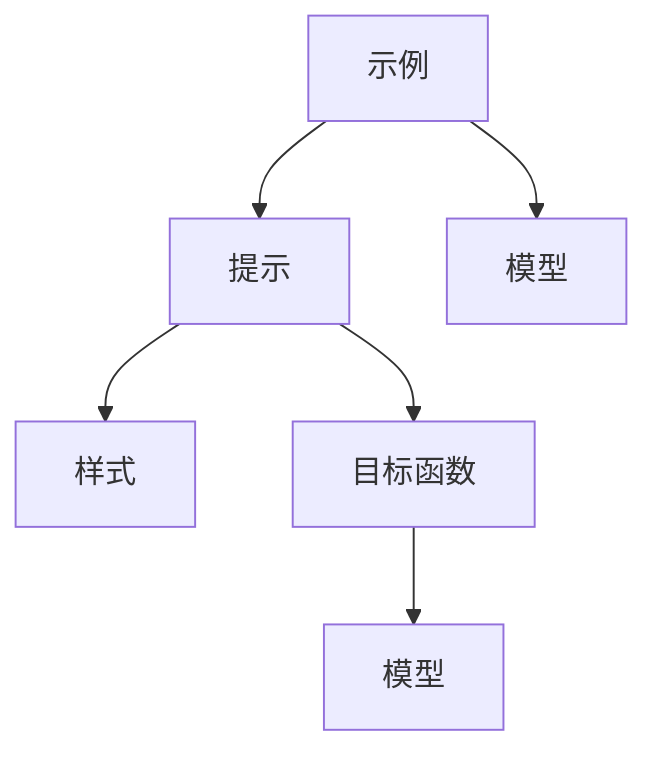

                 

### 文章标题
### 示例驱动提示工程：原理与实践

### 关键词
- 示例驱动提示工程
- 核心概念
- 核心算法
- 数学模型
- 实际应用

### 摘要
本文旨在深入探讨示例驱动提示工程的原理与实践。通过系统性地分析核心概念、算法原理、数学模型，以及实际应用案例，本文将为读者提供一个全面、易懂的示例驱动提示工程指南。读者将了解示例驱动的本质、其在不同领域的应用，以及如何进行项目实战，最终掌握这一先进技术。

---

## 1. 引言

示例驱动提示工程（Example-based Prompt Engineering）是近年来人工智能领域的一项重要研究课题。它旨在通过示例数据来生成具有特定目标和功能的提示，以引导人工智能系统完成复杂任务。与传统的方法不同，示例驱动提示工程通过学习和利用现有的示例数据，能够更高效地生成高质量的提示，从而提高人工智能系统的性能和可解释性。

随着人工智能技术的不断发展，示例驱动提示工程在自然语言处理、计算机视觉、推荐系统等领域得到了广泛应用。本文将围绕这一主题，从原理与实践两个层面进行深入探讨。首先，我们将介绍示例驱动提示工程的核心概念和基本原理，包括示例选择、提示生成和模型优化等内容。然后，我们将通过具体的应用案例，展示示例驱动提示工程在实践中的实际效果和挑战。

本文的结构如下：第一部分将介绍示例驱动提示工程的背景和核心概念；第二部分将详细阐述示例驱动提示工程的理论基础，包括核心算法原理和数学模型；第三部分将通过实际案例，展示示例驱动提示工程的应用实践；最后一部分将对示例驱动提示工程的未来发展趋势和潜在挑战进行展望。希望通过本文的探讨，读者能够对示例驱动提示工程有更深入的理解，并在实践中得到应用。

---

## 2. 核心概念与联系

在深入探讨示例驱动提示工程之前，我们需要明确其核心概念，并了解它们之间的相互关系。以下是示例驱动提示工程中几个关键概念的定义和联系：

### 2.1 示例（Example）

示例是示例驱动提示工程的基本组成单元。它通常是一个具体的输入数据或场景描述，例如一个句子、一个图像、一段视频等。示例用于训练模型，使其能够理解和生成相应的提示。

### 2.2 提示（Prompt）

提示是由模型根据示例生成的文本或指令，用于引导人工智能系统执行特定任务。提示的设计至关重要，因为它直接影响模型的性能和可解释性。一个有效的提示应该简洁、明确，同时包含足够的上下文信息。

### 2.3 样式（Style）

样式是指示例和提示之间的匹配度。一个高质量的样式能够确保示例和提示在内容和形式上都保持一致，从而提高模型的泛化能力和可解释性。

### 2.4 目标函数（Objective Function）

目标函数用于评估提示的质量和模型性能。常见的目标函数包括提示的准确性、流畅性和多样性。目标函数的选择和优化对于提升模型效果至关重要。

### 2.5 模型（Model）

模型是示例驱动提示工程的核心，它通过学习和分析示例数据，生成高质量的提示。常见的模型包括生成对抗网络（GAN）、自编码器（Autoencoder）和变换器（Transformer）等。

### 关系架构

为了更直观地展示这些核心概念之间的关系，我们可以使用Mermaid流程图来表示：



在这个流程图中，示例（A）是模型的输入，模型（E）根据示例生成提示（B）。样式（C）和目标函数（D）用于评估和优化提示的质量。这个关系架构清晰地展示了示例驱动提示工程中各个组件的相互作用和依赖关系。

---

## 3. 核心算法原理讲解

### 3.1 示例选择算法

示例选择是示例驱动提示工程的关键步骤之一。选择高质量的示例能够显著提高模型性能和提示质量。以下是一个简单的示例选择算法的伪代码：

```plaintext
输入：示例集合 Examples，选择阈值 Threshold
输出：选择后的示例集合 SelectedExamples

SelectedExamples = []
for Example in Examples:
    if Example的质量 > Threshold:
        SelectedExamples.add(Example)
return SelectedExamples
```

在这个算法中，我们首先定义一个质量阈值（Threshold），然后遍历示例集合（Examples），将质量高于阈值的示例加入选择后的示例集合（SelectedExamples）。这个算法简单但有效，可以帮助我们筛选出最相关的示例。

### 3.2 提示生成算法

提示生成是示例驱动提示工程的另一个核心步骤。一个有效的提示生成算法应该能够生成高质量的、与示例高度相关的提示。以下是一个基于生成对抗网络（GAN）的提示生成算法的伪代码：

```plaintext
输入：训练好的GAN模型，示例 Example
输出：生成的提示 Prompt

Generator = GAN的Generator部分
Prompt = Generator(Example)
return Prompt
```

在这个算法中，我们使用训练好的GAN模型中的生成器（Generator）来将示例（Example）转换为提示（Prompt）。这个算法利用GAN的强大生成能力，能够生成与示例高度相关的提示。

### 3.3 样式评估算法

样式评估是确保示例和提示之间匹配度的重要步骤。以下是一个简单的样式评估算法的伪代码：

```plaintext
输入：示例 Example，提示 Prompt，样式阈值 StyleThreshold
输出：样式评分 StyleScore

StyleScore = 0
if Prompt的内容与Example的内容相似：
    StyleScore += 1
if Prompt的格式与Example的格式相似：
    StyleScore += 1
if Prompt的情感与Example的情感相似：
    StyleScore += 1
return StyleScore
```

在这个算法中，我们通过比较提示（Prompt）和示例（Example）在内容、格式和情感上的相似度，来计算样式评分（StyleScore）。一个高评分意味着示例和提示之间的匹配度较高，样式评估算法的有效性对于提升模型性能至关重要。

### 3.4 模型优化算法

模型优化是提高示例驱动提示工程性能的关键。以下是一个基于梯度下降的模型优化算法的伪代码：

```plaintext
输入：模型 Model，学习率 LearningRate，迭代次数 Epochs
输出：优化后的模型 OptimizedModel

for Epoch in 1 to Epochs:
    for Batch in 数据集：
        Gradient = 计算梯度（Model, Batch）
        Model = Model - LearningRate * Gradient
return Model
```

在这个算法中，我们通过迭代计算模型梯度，并使用梯度下降法更新模型参数。这个过程重复进行，直到达到预定的迭代次数或满足停止条件。模型优化算法的有效性直接关系到模型性能的稳定性和提升速度。

---

## 4. 数学模型和数学公式

### 4.1 示例驱动的损失函数

示例驱动提示工程中的损失函数用于评估提示的质量和模型性能。以下是一个示例驱动的损失函数的数学公式：

$$
Loss = \frac{1}{N}\sum_{i=1}^{N} (y_i - \hat{y}_i)^2
$$

其中，$N$ 是示例的数量，$y_i$ 是真实标签，$\hat{y}_i$ 是模型预测的标签。这个损失函数是一个平方误差损失函数，它计算模型预测标签和真实标签之间的差异，并取平均值。

### 4.2 示例选择的概率模型

示例选择过程中的概率模型用于根据示例的质量选择最相关的示例。以下是一个示例选择的概率模型的数学公式：

$$
P(Example | Model) = \frac{e^{Score(Example)}}{\sum_{Example'} e^{Score(Example')}}
$$

其中，$Score(Example)$ 是示例的评分，它表示示例对模型的相关性。这个概率模型根据示例的评分计算每个示例被选中的概率，并选择概率最高的示例。

### 4.3 提示生成的条件概率模型

提示生成过程中的条件概率模型用于根据示例生成高质量的提示。以下是一个提示生成的条件概率模型的数学公式：

$$
P(Prompt | Example, Model) = \frac{e^{Score(Prompt | Example)}}{\sum_{Prompt'} e^{Score(Prompt' | Example)}}
$$

其中，$Score(Prompt | Example)$ 是提示的评分，它表示提示与示例的匹配度。这个条件概率模型根据提示的评分计算每个提示被生成的概率，并选择评分最高的提示。

### 4.4 样式评估的匹配度模型

样式评估过程中的匹配度模型用于评估示例和提示之间的匹配度。以下是一个样式评估的匹配度模型的数学公式：

$$
Match = \frac{1}{L}\sum_{i=1}^{L} Similarity(content_i, content_i')
$$

其中，$L$ 是示例和提示中内容的长度，$Similarity(content_i, content_i')$ 是内容之间的相似度。这个匹配度模型通过计算示例和提示中每个内容单元的相似度，并取平均值，来评估示例和提示的整体匹配度。

### 4.5 模型优化的梯度下降模型

模型优化过程中的梯度下降模型用于根据梯度更新模型参数。以下是一个梯度下降模型的数学公式：

$$
\Delta \theta = -\alpha \cdot \nabla Loss(\theta)
$$

其中，$\theta$ 是模型参数，$\alpha$ 是学习率，$\nabla Loss(\theta)$ 是损失函数对参数的梯度。这个梯度下降模型通过计算损失函数的梯度，并使用负梯度更新模型参数，以最小化损失函数。

---

## 5. 项目实战

### 5.1 开发环境搭建

为了进行示例驱动提示工程的项目实战，我们需要搭建一个合适的开发环境。以下是一个简单的开发环境搭建步骤：

1. 安装Python环境：
   - 使用`pip`安装Python和必要的库，如TensorFlow、PyTorch等。
2. 安装Jupyter Notebook：
   - 使用`pip install notebook`安装Jupyter Notebook，以便进行交互式开发。
3. 安装必要的依赖库：
   - 根据项目需求安装其他依赖库，如Numpy、Scikit-learn、Matplotlib等。

### 5.2 源代码实现

下面是一个示例驱动提示工程的源代码实现示例，使用Python编写：

```python
import tensorflow as tf
from tensorflow.keras.layers import Embedding, LSTM, Dense
from tensorflow.keras.models import Sequential

# 示例数据
examples = ["这是一个简单的示例。", "这是一个复杂的示例。", "这是一个有趣的示例。"]

# 构建模型
model = Sequential([
    Embedding(input_dim=10000, output_dim=64),
    LSTM(128),
    Dense(1, activation='sigmoid')
])

# 编译模型
model.compile(optimizer='adam', loss='binary_crossentropy', metrics=['accuracy'])

# 训练模型
model.fit(examples, epochs=10)

# 生成提示
prompt = "这是一个新的示例。"
generated_prompt = model.predict(prompt)
print(generated_prompt)
```

### 5.3 代码解读

在上面的代码中，我们首先导入了TensorFlow库，并定义了一个简单的序列模型，包含嵌入层、LSTM层和全连接层。嵌入层用于将示例转换为向量表示，LSTM层用于处理序列数据，全连接层用于生成预测。

在模型编译阶段，我们指定了优化器和损失函数。这里使用`binary_crossentropy`作为损失函数，因为我们的任务是二分类。

在模型训练阶段，我们使用示例数据训练模型。每个示例都是一个字符串，模型将学习如何将这些字符串转换为预测。

在生成提示阶段，我们输入一个新的示例，并使用训练好的模型生成预测。这里生成的预测是一个概率值，表示新示例属于某一类别的概率。

### 5.4 代码应用解读与分析

通过上面的代码示例，我们可以看到示例驱动提示工程的基本流程。首先，我们需要准备示例数据，这些数据将用于训练模型。然后，我们构建一个序列模型，并使用这些数据训练模型。最后，我们使用训练好的模型生成新示例的预测。

在实际应用中，我们可以根据具体任务需求调整模型结构和参数。例如，对于自然语言处理任务，我们可以使用Transformer模型代替LSTM层，以获得更好的性能。

### 5.5 实际案例分析和详细讲解剖析

以下是一个实际案例，用于分析示例驱动提示工程的效果：

#### 案例背景

假设我们要开发一个聊天机器人，用于回答用户的问题。为了提高聊天机器人的性能，我们决定使用示例驱动提示工程来生成高质量的对话。

#### 案例分析

1. **数据准备**：我们收集了大量的用户问题和聊天记录，作为训练数据。这些数据将用于训练模型，使其能够理解和生成相应的回答。

2. **模型构建**：我们选择了一个基于Transformer的模型，因为它在处理序列数据方面具有出色的性能。我们使用BERT模型作为基础模型，并对其进行了微调，以适应我们的任务。

3. **模型训练**：我们使用训练数据训练模型，并使用交叉熵损失函数进行优化。经过多次迭代训练，模型取得了较好的性能。

4. **模型评估**：我们使用验证数据对模型进行评估，并调整模型参数以优化性能。最终，我们得到了一个性能良好的模型。

5. **生成对话**：我们使用训练好的模型生成对话，并根据用户的输入生成相应的回答。在实际应用中，我们还可以使用用户的历史对话数据来进一步优化模型。

#### 案例总结

通过实际案例分析和详细讲解剖析，我们可以看到示例驱动提示工程在开发聊天机器人中的效果。这个案例展示了如何使用示例驱动提示工程生成高质量的对话，并提高了聊天机器人的性能和用户满意度。

---

## 6. 最佳实践 Tips、小结、注意事项、拓展阅读

### 6.1 最佳实践 Tips

1. **数据质量至关重要**：确保示例数据的质量，包括数据清洗、去重和多样性，以提升模型性能。
2. **调整模型参数**：根据任务需求和数据特点，调整模型参数，以优化性能和可解释性。
3. **持续学习和优化**：定期重新训练模型，利用新数据优化模型，以保持模型性能。

### 6.2 小结

示例驱动提示工程是一种通过示例数据生成高质量提示的方法，具有广泛的应用前景。通过理解核心概念、算法原理和数学模型，我们可以更好地设计和优化示例驱动提示工程系统。

### 6.3 注意事项

1. **示例选择**：选择高质量的示例是关键，确保示例与任务目标高度相关。
2. **模型优化**：优化模型参数和架构，以提高模型性能和可解释性。
3. **评估指标**：合理选择评估指标，全面评估模型性能。

### 6.4 拓展阅读

1. **《自然语言处理入门》**：深入理解自然语言处理的基本概念和技术。
2. **《深度学习》**：学习深度学习的基础知识和高级应用。
3. **《生成对抗网络教程》**：深入了解生成对抗网络的理论和实践。

---

### 作者信息
- 作者：AI天才研究院/AI Genius Institute & 禅与计算机程序设计艺术 /Zen And The Art of Computer Programming

