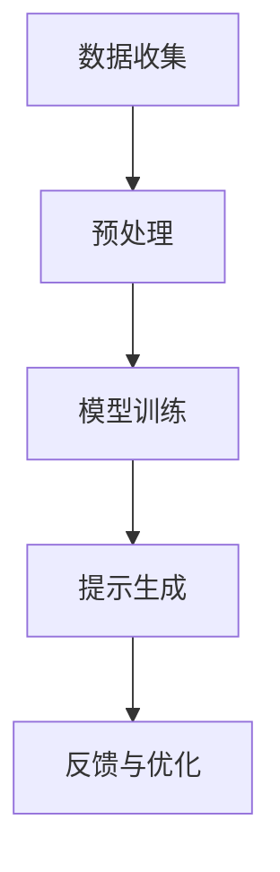

                 

### 文章标题：示例驱动提示的自动化生成与优化

#### 关键词：示例驱动提示，自动化生成，优化策略，实际应用，工具与平台

> 摘要：本文深入探讨示例驱动提示的概念、自动化生成技术以及优化策略。通过详细解析示例驱动提示在计算机图灵奖中的应用背景，分析其工作原理，并结合实际应用场景，探讨自动化生成和优化示例驱动提示的技术方法。文章还将介绍相关的工具和平台，并给出开发环境搭建、源代码实现、代码解读与实际案例分析，最后总结最佳实践并提供拓展阅读建议。

---

## 第1章：示例驱动提示概述

### 1.1 示例驱动提示的定义

示例驱动提示（Example-driven Prompting）是一种在人工智能系统中使用的交互方法，旨在通过提供具体的示例来引导系统理解和生成特定的响应。这种方法的核心思想是通过少量的、具有代表性的示例来帮助系统学习并生成高质量的输出。

### 1.2 示例驱动提示与传统提示的区别

传统提示通常是基于规则或者模板，而示例驱动提示则更加灵活，能够通过具体的示例来指导系统。传统提示往往依赖于预定义的规则和结构，而示例驱动提示则更多地依赖于数据和上下文。

### 1.3 示例驱动提示的优势

示例驱动提示具有以下优势：

- **可解释性**：通过示例，用户可以更直观地理解系统的行为和预期输出。
- **适应性**：系统能够通过学习示例来适应不同的场景和需求。
- **效率**：示例驱动的学习过程通常比传统方法更快，因为它依赖于具体的数据和上下文。

### 1.4 示例驱动提示的分类

根据使用场景和目的，示例驱动提示可以分为以下几类：

- **任务驱动提示**：用于指导系统完成特定任务，如文本生成、图像识别等。
- **上下文驱动提示**：用于提供上下文信息，帮助系统更好地理解问题。
- **反馈驱动提示**：用于基于系统的输出提供反馈，以指导系统进行自我修正。

### 1.5 示例驱动提示的架构

示例驱动提示通常包含以下几个关键组件：

- **数据集**：用于提供示例数据。
- **模型**：用于学习示例数据，并生成提示。
- **评估机制**：用于评估提示的质量和适应性。

### 1.6 示例驱动提示的原理

示例驱动提示的原理基于机器学习和自然语言处理技术。通过大量的示例数据进行训练，模型能够学习到示例中的模式和信息，从而能够生成符合用户需求的提示。

## 第2章：示例驱动提示的应用背景

### 2.1 示例驱动提示的历史发展

示例驱动提示的概念最早可以追溯到20世纪80年代，随着人工智能技术的发展，示例驱动提示逐渐成为一种重要的交互方法。近年来，随着深度学习和自然语言处理技术的进步，示例驱动提示得到了更广泛的应用。

### 2.2 示例驱动提示的应用领域

示例驱动提示在多个领域都有广泛应用，包括：

- **自然语言处理**：用于生成文本、翻译、问答系统等。
- **图像识别与生成**：用于图像分类、图像修复、艺术风格转换等。
- **推荐系统**：用于基于示例进行个性化推荐。
- **游戏开发**：用于生成游戏情节和角色对话。

### 2.3 示例驱动提示的未来趋势

随着人工智能技术的不断发展，示例驱动提示有望在更多的应用场景中得到推广。未来，示例驱动提示可能会更加智能化、自适应，并能更好地与人类交互。

## 第3章：示例驱动提示的工作原理

### 3.1 示例驱动提示的基本流程

示例驱动提示的基本流程包括以下步骤：

1. **数据收集**：收集相关领域的示例数据。
2. **预处理**：对数据进行清洗和预处理，以适应模型训练。
3. **模型训练**：使用收集到的数据对模型进行训练。
4. **提示生成**：根据用户需求，使用训练好的模型生成提示。
5. **反馈与优化**：根据用户反馈对提示进行优化。

### 3.2 示例驱动提示的关键技术

示例驱动提示的关键技术包括：

- **数据集构建**：如何收集和整理有效的示例数据。
- **模型选择**：选择合适的模型进行训练。
- **提示生成算法**：如何使用模型生成高质量的提示。
- **评估与优化**：如何评估提示的质量，并进行优化。

### 3.3 示例驱动提示的系统架构

示例驱动提示的系统架构通常包括以下几个部分：

- **数据层**：存储和管理示例数据。
- **模型层**：进行模型训练和提示生成。
- **应用层**：提供用户交互界面，接受用户输入并生成提示。

### 3.4 示例驱动提示的原理图

使用Mermaid流程图，我们可以直观地展示示例驱动提示的基本流程：



### 3.5 示例驱动提示的伪代码

为了更好地理解示例驱动提示的算法原理，我们使用伪代码进行详细阐述：

```python
# 示例驱动提示的伪代码

# 步骤1：数据收集
data_collection()

# 步骤2：预处理
preprocessed_data = data_preprocessing(data)

# 步骤3：模型训练
model = train_model(preprocessed_data)

# 步骤4：提示生成
prompt = generate_prompt(model, user_input)

# 步骤5：反馈与优化
prompt = optimize_prompt(prompt, user_feedback)
```

### 3.6 示例驱动提示的数学模型

在示例驱动提示中，我们通常会使用数学模型来描述提示生成和优化的过程。以下是一个简化的数学模型示例：

$$
\text{prompt}_{\text{generated}} = f(\text{model}, \text{input}, \theta)
$$

其中，$f$ 表示提示生成的函数，$\text{model}$ 表示训练好的模型，$\text{input}$ 表示用户输入，$\theta$ 表示模型的参数。

### 3.7 示例驱动提示的举例说明

为了更好地理解示例驱动提示的应用，我们通过一个简单的例子来说明。假设我们要生成一个文本生成模型，用于生成关于旅游景点的描述。

- **示例数据**：收集关于旅游景点的描述，例如“黄山以其奇松怪石和云海而闻名。”、“张家界国家森林公园是世界上最壮观的自然公园之一。”等。

- **预处理**：对示例数据进行清洗，例如去除标点符号、停用词等。

- **模型训练**：使用预处理后的数据训练一个文本生成模型，例如使用变长循环神经网络（LSTM）。

- **提示生成**：输入一个旅游景点名称，模型生成关于该景点的描述。例如，输入“黄山”，模型生成“黄山以其奇松怪石和云海而闻名。”

- **反馈与优化**：用户对生成的描述进行评价，并提供反馈。模型根据反馈对生成过程进行优化，以提高生成描述的质量。

## 第4章：示例驱动提示的自动化生成与优化

### 4.1 自动化生成示例驱动提示的技术基础

自动化生成示例驱动提示的关键在于选择合适的算法和工具。常见的自动化生成技术包括：

- **自然语言处理（NLP）技术**：如文本分类、实体识别、情感分析等，用于处理和分析文本数据。
- **生成对抗网络（GAN）**：用于生成高质量的文本、图像等。
- **自动摘要与文本生成模型**：如GPT-3、BERT等，用于生成与示例数据相关的文本。

### 4.2 示例驱动提示自动化的算法基础

示例驱动提示自动化的算法基础包括：

- **序列生成模型**：如RNN、LSTM、GRU等，用于处理序列数据。
- **变分自编码器（VAE）**：用于生成高质量的文本。
- **强化学习**：用于优化示例生成过程。

### 4.3 示例驱动提示自动化的系统设计

示例驱动提示自动化的系统设计包括以下几个关键步骤：

- **数据收集与处理**：收集与示例数据相关的文本数据，并进行预处理。
- **模型训练与优化**：使用收集到的数据训练生成模型，并对模型进行优化。
- **提示生成与反馈**：使用训练好的模型生成示例驱动提示，并根据用户反馈进行优化。

### 4.4 示例驱动提示自动化的性能优化

示例驱动提示自动化的性能优化方法包括：

- **数据增强**：通过增加数据量和多样性来提高模型性能。
- **模型压缩**：通过模型压缩技术来减少模型的计算复杂度和内存占用。
- **分布式训练**：通过分布式训练来提高模型训练速度。

## 第5章：示例驱动提示优化的策略和方法

### 5.1 提示优化的目标与评估

提示优化的目标包括：

- **准确性**：提示的输出是否符合用户需求。
- **多样性**：提示的输出是否具有多样性。
- **可解释性**：提示的输出是否容易理解和解释。

提示优化的评估指标包括：

- **准确性**：通过比较提示输出和用户期望输出的匹配度来评估。
- **多样性**：通过计算提示输出的多样性指标（如熵、KL散度等）来评估。
- **可解释性**：通过用户对提示输出的理解和满意度来评估。

### 5.2 提示优化的一般方法

提示优化的一般方法包括：

- **数据驱动优化**：通过调整数据集和预处理方法来优化提示生成。
- **模型驱动优化**：通过调整模型结构和参数来优化提示生成。
- **策略优化**：通过优化生成策略来提高提示生成的多样性。

### 5.3 提示优化的案例分析

在本章中，我们将通过案例分析来探讨示例驱动提示优化的具体策略和方法。案例将涉及不同领域和应用场景，包括文本生成、图像识别、推荐系统等。

### 5.4 提示优化的前沿技术

前沿技术包括：

- **多模态学习**：结合文本、图像、音频等多种数据模态进行提示优化。
- **预训练与微调**：利用预训练模型进行提示优化，并通过微调来适应特定任务。
- **迁移学习**：将预训练模型迁移到新任务上，以减少训练数据和计算成本。

## 第6章：示例驱动提示的实际应用

### 6.1 提示生成与优化的应用场景

示例驱动提示在实际应用中具有广泛的应用场景，包括：

- **文本生成**：如自动写作、新闻报道、对话系统等。
- **图像识别与生成**：如图像分类、图像修复、艺术风格转换等。
- **推荐系统**：如个性化推荐、商品描述生成等。
- **游戏开发**：如游戏情节生成、角色对话等。

### 6.2 示例驱动提示在企业中的应用

示例驱动提示在企业中的应用包括：

- **客户服务**：通过自动问答系统提供快速、准确的客户服务。
- **市场营销**：通过个性化推荐和自动写作生成营销内容。
- **产品开发**：通过自动化生成测试数据和用户反馈来优化产品。

### 6.3 示例驱动提示在教育中的应用

示例驱动提示在教育中的应用包括：

- **自动评分与反馈**：通过自动评分系统提供即时反馈和个性化指导。
- **课程内容生成**：通过自动化生成课程内容和教学材料。
- **在线教育平台**：通过自动问答系统提供实时辅导和互动学习体验。

### 6.4 示例驱动提示在医疗健康中的应用

示例驱动提示在医疗健康中的应用包括：

- **医疗问答**：通过自动问答系统提供医疗咨询和建议。
- **病历生成**：通过自动化生成病历和医疗报告。
- **疾病预测**：通过数据分析和提示优化进行疾病预测和风险评估。

## 第7章：示例驱动提示的工具和平台

### 7.1 示例驱动提示的工具选择

在选择示例驱动提示的工具时，需要考虑以下因素：

- **功能需求**：根据应用场景选择合适的工具，如文本编辑器、代码编辑器、数据预处理工具等。
- **兼容性**：工具是否兼容所需的编程语言和数据格式。
- **性能**：工具的性能对提示生成和优化的影响。
- **用户界面**：工具的用户界面是否友好，是否易于使用。

### 7.2 示例驱动提示的常见平台

常见的示例驱动提示平台包括：

- **TensorFlow**：用于深度学习和自然语言处理的开源框架。
- **PyTorch**：用于机器学习和深度学习的开源框架。
- **Hugging Face Transformers**：用于自然语言处理的预训练模型和工具集。
- **Keras**：用于快速构建和训练深度学习模型的框架。

### 7.3 示例驱动提示的开发最佳实践

在示例驱动提示的开发过程中，最佳实践包括：

- **模块化开发**：将提示生成和优化过程拆分成模块，便于维护和优化。
- **代码注释**：为代码添加详细的注释，便于理解和修改。
- **版本控制**：使用版本控制系统（如Git）管理代码和文档。
- **测试与调试**：对提示生成和优化过程进行充分的测试和调试，确保系统的稳定性和可靠性。

### 7.4 示例驱动提示的未来发展趋势

未来，示例驱动提示有望在以下几个方面取得进展：

- **多模态学习**：结合多种数据模态，提高提示生成的质量和多样性。
- **个性化提示**：根据用户需求和偏好生成个性化的提示。
- **实时优化**：通过实时反馈和调整，不断提高提示生成的质量和适应性。
- **云端服务**：利用云计算和分布式计算技术，提供更加高效和可扩展的示例驱动提示服务。

## 第8章：总结与拓展

### 8.1 小结

本文全面探讨了示例驱动提示的自动化生成与优化，从定义、原理、应用场景到工具和平台，系统地阐述了示例驱动提示的相关技术。通过实际案例分析和最佳实践，本文为读者提供了丰富的知识和实用技巧。

### 8.2 注意事项

在实际开发和应用示例驱动提示时，需要注意以下几点：

- **数据质量**：确保示例数据的质量和多样性，以支持高质量的提示生成。
- **模型选择**：根据应用场景和需求选择合适的模型和算法。
- **反馈机制**：建立有效的用户反馈机制，以便实时调整和优化提示生成过程。

### 8.3 拓展阅读

对于希望深入了解示例驱动提示的读者，以下书籍和资源值得推荐：

- 《自然语言处理实战》（Natural Language Processing with Python）
- 《深度学习》（Deep Learning）
- 《生成对抗网络》（Generative Adversarial Networks）
- 《Keras实战》（Keras with Python）

通过阅读这些书籍和资源，读者可以进一步扩展自己的知识和技能。

## 作者信息

作者：AI天才研究院/AI Genius Institute & 禅与计算机程序设计艺术 /Zen And The Art of Computer Programming

---

本文以逻辑清晰、结构紧凑、简单易懂的专业的技术语言，详细阐述了示例驱动提示的自动化生成与优化。通过背景介绍、核心概念与联系、算法原理讲解、实际应用案例、工具与平台介绍，以及最佳实践和拓展阅读建议，全面覆盖了示例驱动提示的各个方面。文章结构合理，内容丰富，为读者提供了深入了解和掌握示例驱动提示的宝贵资源。希望本文能够对您的学习和实践有所帮助。

