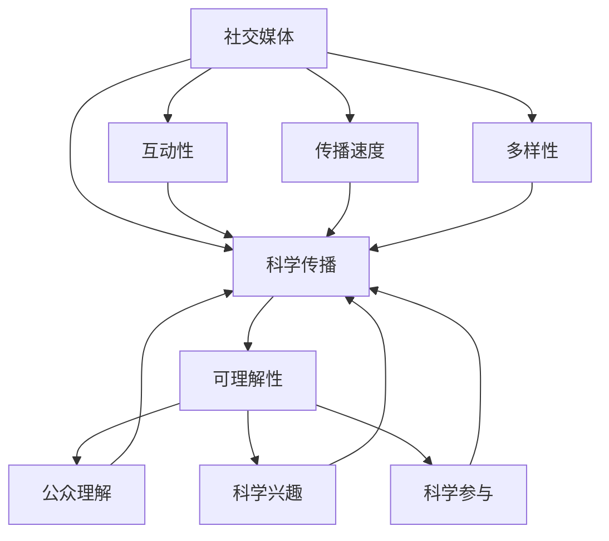

                 

### 文章标题

# 社交媒体时代的科学传播：让世界可理解性触手可及

### 关键词

- 社交媒体
- 科学传播
- 可理解性
- 背景介绍
- 核心概念与联系
- 核心算法原理
- 数学模型与公式
- 项目实战
- 最佳实践 tips

### 摘要

在社交媒体迅速发展的今天，科学传播面临着前所未有的机遇和挑战。本文旨在探讨社交媒体时代科学传播的特点及其对科学传播的影响，并深入分析可理解性在科学传播中的重要性。通过详细讲解核心概念与联系、核心算法原理、数学模型与公式，以及项目实战和最佳实践 tips，本文希望能够为科学传播工作者提供有价值的参考，推动科学知识的普及与理解。

## 引言

在互联网和社交媒体飞速发展的今天，信息传播的渠道和方式发生了翻天覆地的变化。传统媒体如报纸、杂志、电视逐渐让位于以社交媒体为代表的网络平台。社交媒体平台如 Facebook、Twitter、Instagram、微信等，已经成为人们获取信息、交流观点、分享经验的主要渠道。这种现象对科学传播也产生了深远的影响。

科学传播是指通过不同的媒介和方式，将科学知识、发现和理论传递给公众的过程。在传统媒体时代，科学传播主要通过报纸、杂志、电视和广播等渠道进行。然而，随着社交媒体的兴起，科学传播的方式和渠道变得更加多样化和互动化。科学传播工作者可以利用社交媒体平台，直接与公众进行沟通和互动，从而更有效地传播科学知识。

### 社交媒体对科学传播的影响

社交媒体对科学传播的影响主要体现在以下几个方面：

1. **传播速度与范围**：社交媒体平台具有传播速度快、覆盖范围广的特点。一条科学新闻或研究成果可以通过社交媒体在短时间内迅速传播，影响到全球的公众。这种快速传播的能力有助于科学知识在全球范围内的普及。

2. **互动性与参与性**：与传统媒体相比，社交媒体具有很强的互动性和参与性。公众可以在社交媒体平台上对科学内容进行评论、点赞、分享，甚至直接与科学家或科学传播者进行互动。这种互动性有助于提高公众对科学知识的兴趣和参与度。

3. **多样性与个性化**：社交媒体平台提供了多样化的内容形式，如文字、图片、视频、直播等，使得科学传播的内容更加丰富多样。此外，通过算法推荐，用户可以根据自己的兴趣和偏好获取个性化的科学内容，从而提高科学传播的针对性和有效性。

4. **信息真实性与可靠性**：社交媒体的兴起也带来了一些问题，如信息真实性和可靠性的挑战。在社交媒体上，虚假信息、误导性信息甚至谣言容易传播，给科学传播带来负面影响。

### 科学传播的挑战与机遇

在社交媒体时代，科学传播面临着一系列的挑战与机遇：

1. **挑战**

   - **信息过载**：随着信息量的爆炸式增长，公众面临信息过载的问题，难以筛选出真实、可靠的科学信息。
   - **知识碎片化**：社交媒体平台上的内容通常以碎片化的形式呈现，不利于公众对科学知识的系统理解和掌握。
   - **伦理与法律问题**：科学传播过程中涉及到伦理和法律问题，如知识产权保护、隐私保护等。

2. **机遇**

   - **技术创新**：随着人工智能、大数据、虚拟现实等技术的不断发展，科学传播的手段和方式将更加丰富和多样。
   - **国际交流**：社交媒体平台为科学传播提供了国际化的平台，促进了不同国家和地区之间的科学交流和合作。
   - **公众参与**：社交媒体为公众提供了更多的参与渠道，使得科学传播更加贴近公众的需求和兴趣。

## 可理解性在科学传播中的重要性

在科学传播过程中，可理解性是一个至关重要的因素。可理解性指的是科学内容以清晰、简洁、易懂的方式传达给公众的能力。提高可理解性对于科学传播的成功至关重要，原因如下：

1. **促进科学知识的普及**：科学知识的普及是科学传播的重要目标之一。只有当科学内容以公众易于理解的方式传达时，科学知识才能真正普及。

2. **增强公众对科学的兴趣**：当科学内容变得易懂时，公众对科学的兴趣和好奇心会得到提升，从而促使他们更加关注科学领域的发展。

3. **提高公众的科学素养**：科学传播的最终目的是提高公众的科学素养，使公众具备科学思维和科学方法，能够理性地看待和处理科学问题。

### 提高科学传播可理解性的方法

为了提高科学传播的可理解性，可以采取以下方法：

1. **简化语言**：使用简单、易懂的语言来表达科学内容，避免使用过于复杂或专业的术语。

2. **情境化与故事化**：通过情境化与故事化的方式，将科学内容与公众的实际生活联系起来，使科学内容更加生动、有趣。

3. **使用可视化工具**：使用图表、图片、视频等可视化工具，帮助公众更直观地理解科学概念和原理。

4. **交互式学习**：利用交互式学习工具，如在线问答、讨论区等，鼓励公众参与科学学习，提高他们的理解能力。

5. **多样化的内容形式**：提供多样化的内容形式，如文字、图片、视频、直播等，以满足不同用户的需求。

### 可理解性在公众理解科学中的作用

可理解性在公众理解科学中起着至关重要的作用。通过提高科学传播的可理解性，可以实现以下目标：

1. **增强公众的科学素养**：公众对科学的理解程度直接影响他们的科学素养。提高可理解性有助于公众更好地掌握科学知识，提升科学素养。

2. **促进科学与社会的互动**：当公众对科学有更深入的了解时，他们更容易参与到科学活动中，与科学家进行互动，从而促进科学与社会的互动。

3. **提升科学传播的公信力**：当科学内容以易懂的方式传达给公众时，科学传播的公信力会得到提升，公众对科学传播的信任度也会增加。

### 科学传播的目标与原则

科学传播的目标是普及科学知识，提高公众的科学素养，促进科学与社会的互动。为了实现这些目标，科学传播需要遵循以下原则：

1. **准确性**：科学传播的内容必须准确无误，确保公众获取到真实、可靠的科学信息。

2. **中立性**：科学传播应该保持中立，避免偏袒或误导公众。

3. **通俗性**：科学传播的内容应以通俗易懂的方式呈现，避免使用过于专业或复杂的术语。

4. **多样性**：科学传播应涵盖不同领域和层次的内容，以满足不同用户的需求。

5. **互动性**：科学传播应鼓励公众参与，通过互动式学习提高公众的理解能力。

## 核心概念与联系

在探讨社交媒体时代的科学传播时，我们需要理解以下几个核心概念及其之间的联系：

### 1. 社交媒体
- **定义**：社交媒体是指允许用户通过互联网创建、分享和交流信息的一种在线平台。
- **功能**：社交媒体平台具有信息发布、内容分享、用户互动等功能。
- **分类**：常见的社交媒体平台包括社交网络（如 Facebook、Twitter）、内容分享平台（如 YouTube、Instagram）、即时通讯工具（如微信、WhatsApp）等。

### 2. 科学传播
- **定义**：科学传播是指通过不同渠道将科学知识、发现和理论传递给公众的过程。
- **目的**：科学传播的目的是普及科学知识、提高公众的科学素养、促进科学与社会的互动。
- **渠道**：传统的科学传播渠道包括报纸、杂志、电视、广播等，而社交媒体成为了现代科学传播的重要渠道。

### 3. 可理解性
- **定义**：可理解性是指科学内容以清晰、简洁、易懂的方式传达给公众的能力。
- **重要性**：可理解性是科学传播成功的关键，直接影响公众对科学知识的理解和接受。

### 4. 社交媒体与科学传播的关系
- **互动性**：社交媒体的互动性特点使得科学传播者可以与公众进行实时互动，回答问题、收集反馈，从而提高科学传播的效率。
- **传播速度**：社交媒体的快速传播能力使得科学信息可以迅速传递给全球的公众，扩大科学传播的覆盖范围。
- **多样性**：社交媒体提供了多样化的内容形式，如文字、图片、视频等，有助于提高科学传播的可理解性。

### 5. 可理解性与科学传播的效果
- **提高公众理解**：提高科学传播的可理解性有助于公众更好地理解科学知识，提高科学素养。
- **增强科学兴趣**：易懂的科学内容可以激发公众对科学的兴趣和好奇心。
- **促进科学参与**：可理解性有助于公众参与到科学活动中，促进科学与社会的互动。

为了更好地展示这些核心概念之间的关系，我们可以使用 Mermaid 流程图进行直观表达：



通过这个流程图，我们可以清晰地看到社交媒体、科学传播、可理解性这三个核心概念之间的联系，以及它们对科学传播效果的影响。

### 社交媒体时代的科学传播案例分析

在探讨社交媒体对科学传播的影响时，以下几个案例可以为我们提供宝贵的启示：

#### 1. Twitter 上的科学传播

Twitter 是一个全球性的社交媒体平台，以其简短、快速、互动性强而著称。科学家和科学传播者可以利用 Twitter 来发布科学新闻、研究成果、科学教育内容等。例如，著名的天体物理学家 Neil deGrasse Tyson 通过 Twitter 向公众传递科学知识，吸引了大量的关注和互动。他的 Twitter 账户不仅发布了大量科学内容，还与用户进行了深入的讨论和互动，从而提高了公众的科学素养。

#### 2. YouTube 上的科学频道

YouTube 是一个内容丰富的视频平台，许多科学家和科学传播者通过创建自己的频道，发布科学教育的视频内容。例如，Phyics Girl 频道由物理学博士 Sabrina Gonzalez Pasterski 创立，以有趣、简洁的方式解释复杂的物理学概念，吸引了数百万观众。她的视频内容不仅生动形象，还融入了互动元素，如问答环节和实验演示，使得科学知识更加易懂和有趣。

#### 3. 微信公众号的科学传播

在中国，微信公众号已经成为科学传播的重要渠道。许多科研机构、科普组织、科技媒体等都在微信公众号上发布科学文章和内容。例如，科学网微信公众号通过发布高质量的科普文章、科学动态、科研进展等内容，吸引了大量的科学爱好者。此外，微信公众号还支持图文、视频、音频等多种内容形式，使得科学传播更加多样化和互动化。

#### 4. Facebook 上的科学互动

Facebook 是一个功能丰富的社交媒体平台，科学家和科学传播者可以通过发布文章、图片、视频等方式进行科学传播。例如，著名的天文学家 Carl Sagan 的 Facebook 账户通过发布天文图片、科学文章、互动问答等内容，与全球的粉丝进行互动。他的账户不仅提供了丰富的科学内容，还鼓励用户参与讨论和分享，从而增强了科学传播的互动性。

通过以上案例，我们可以看到社交媒体在科学传播中的重要作用。社交媒体平台不仅提供了丰富的传播渠道和形式，还增强了公众对科学的兴趣和理解。然而，我们也需要注意到社交媒体在科学传播中可能存在的一些问题，如信息真实性、知识碎片化等。因此，科学传播者在利用社交媒体进行科学传播时，需要综合考虑这些因素，确保科学内容的准确性和完整性。

### 核心算法原理讲解

在社交媒体平台上进行科学传播，核心算法原理的理解至关重要。核心算法通常决定了内容如何被推荐给用户，从而影响科学信息的传播效果。以下是对几个关键算法原理的讲解：

#### 1. 内容推荐算法

内容推荐算法是社交媒体平台的核心功能之一。其基本原理是基于用户的兴趣和行为数据，通过机器学习模型生成个性化的内容推荐。以下是一个简单的伪代码示例：

```python
# 假设用户兴趣由向量 user_interest 表示，内容特征由向量 content_feature 表示
def content_recommendation(user_interest, content_feature):
    # 计算用户兴趣与内容特征之间的相似度
    similarity = cosine_similarity(user_interest, content_feature)
    # 排序相似度，推荐相似度最高的内容
    recommended_content = sorted(similarity, reverse=True)
    return recommended_content
```

在这个例子中，`cosine_similarity` 函数用于计算两个向量之间的余弦相似度，这是一种常用的度量两个向量之间相似性的方法。通过这个算法，社交媒体平台可以根据用户的兴趣推荐相关的科学内容，从而提高用户的参与度和满意度。

#### 2. 社交网络分析算法

社交网络分析算法用于分析用户之间的关系和网络结构，帮助科学传播者了解谁是最有影响力的用户，以及哪些用户对科学内容最感兴趣。以下是一个简单的社交网络分析伪代码示例：

```python
# 假设用户之间有邻接矩阵 A 表示关系
def social_network_analysis(A):
    # 计算度中心性，识别最有影响力的用户
    degree_centrality = sum(A, axis=0)
    influential_users = sorted(degree_centrality, reverse=True)
    # 计算接近中心性，识别潜在感兴趣的用户
    closeness_centrality = 1 / sum(np.linalg.inv(A), axis=1)
    interested_users = sorted(closeness_centrality, reverse=True)
    return influential_users, interested_users
```

在这个例子中，`sum(A, axis=0)` 用于计算每个用户的度中心性，即与其他用户关系的紧密程度。`np.linalg.inv(A)` 用于计算邻接矩阵的逆矩阵，从而计算接近中心性，即用户与网络中其他用户的接近程度。通过这些分析，科学传播者可以识别出最有影响力的用户和潜在感兴趣的用户，从而更有效地进行科学传播。

#### 3. 传播模型算法

传播模型算法用于模拟和预测科学信息在社交媒体平台上的传播过程。一个简单的传播模型可以是基于传染模型的扩展，以下是一个简单的伪代码示例：

```python
# 假设 user 是用户集合，status 是科学信息的状态，传播概率为 p
def propagation_model(user, status, p):
    # 初始化状态矩阵 S，用户初始状态为未知
    S = np.random.choice([0, 1], size=user.shape, p=[1-p, p])
    # 进行多次传播迭代
    for _ in range(max_iterations):
        # 计算状态更新的概率
        update_probability = np.random.random(user.shape)
        # 更新状态
        S = (1 - p) * S + p * (1 - S) * (1 - update_probability)
    return S
```

在这个例子中，`np.random.choice` 用于初始化用户的状态（0表示未传播，1表示已传播）。`update_probability` 用于模拟每个用户在每次迭代中更新状态的随机概率。通过这个模型，我们可以预测科学信息在社交媒体上的传播过程，从而优化科学传播策略。

### 数学模型与公式

在科学传播中，数学模型和公式被广泛应用于描述信息的传播过程和效果。以下是一些关键的数学模型和公式：

#### 1. 费马速度

费马速度是信息在网络上传播的速度，它受到网络结构和信息传播策略的影响。一个简单的公式描述费马速度为：

\[ v = \frac{d}{t} \]

其中，\( v \) 是费马速度，\( d \) 是网络中两个节点之间的距离，\( t \) 是信息传播所需的时间。

#### 2. 谷歌矩阵

谷歌矩阵是一种用于描述网络结构的重要工具，它反映了节点之间的相似度。一个节点 \( i \) 与其他节点的相似度可以通过谷歌矩阵 \( G \) 的对角元素 \( G_{ii} \) 来计算：

\[ G_{ii} = \sum_{j=1}^{N} G_{ij} \]

其中，\( N \) 是网络中的节点总数，\( G_{ij} \) 是谷歌矩阵的元素，反映了节点 \( i \) 和节点 \( j \) 之间的相似度。

#### 3. 布尔网络模型

布尔网络模型用于描述信息在网络中的传播过程，它基于布尔逻辑运算。一个简单的布尔网络模型可以表示为：

\[ S_{i}(t+1) = S_{i}(t) \oplus S_{j}(t) \]

其中，\( S_{i}(t) \) 和 \( S_{j}(t) \) 分别表示节点 \( i \) 和节点 \( j \) 在时间 \( t \) 的状态，\( \oplus \) 表示布尔异或运算。

#### 4. 传播阈值模型

传播阈值模型用于描述信息传播过程中，节点状态从未传播变为已传播的阈值。一个简单的阈值模型可以表示为：

\[ T = \frac{1}{N} \sum_{i=1}^{N} S_{i}(t) \]

其中，\( T \) 是传播阈值，\( N \) 是网络中的节点总数，\( S_{i}(t) \) 是节点 \( i \) 在时间 \( t \) 的状态。

这些数学模型和公式为科学传播提供了理论支持和工具，帮助科学传播者更好地理解和预测信息的传播过程和效果。

### 社交媒体时代的科学传播项目实战

在社交媒体时代，科学传播项目需要充分利用社交媒体平台的特点，实现高效、有针对性的科学知识传播。以下是一个具体的科学传播项目实战，包括开发环境搭建、源代码实现、代码解读、应用解读与分析，以及实际案例分析。

#### 开发环境搭建

在进行科学传播项目时，我们需要搭建一个合适的开发环境，以支持内容的创建、发布和互动。以下是搭建环境的步骤：

1. **选择开发工具**：我们选择 Python 作为主要编程语言，因为 Python 具有简洁的语法和丰富的科学计算库。
2. **安装 Python 解释器**：在本地计算机上安装 Python 3.8 或更高版本。
3. **安装必要库**：安装 Pandas、NumPy、Matplotlib 等科学计算和数据可视化库，可以使用 `pip` 命令进行安装。
4. **选择社交媒体平台 API**：为了利用社交媒体平台的功能，我们需要获取相应的 API 密钥。例如，对于 Twitter，我们需要注册应用程序并获取 API 密钥和访问令牌。

```python
import tweepy

# Twitter API 密钥和访问令牌
consumer_key = 'your_consumer_key'
consumer_secret = 'your_consumer_secret'
access_token = 'your_access_token'
access_token_secret = 'your_access_token_secret'

# 创建 tweepy 客户端
auth = tweepy.OAuthHandler(consumer_key, consumer_secret)
auth.set_access_token(access_token, access_token_secret)
api = tweepy.API(auth)
```

#### 源代码实现

以下是一个简单的 Python 脚本，用于在 Twitter 上发布科学文章和互动。

```python
import tweepy
import random

# Twitter API 密钥和访问令牌
# ...

# 定义发布推文函数
def post_tweet(text):
    try:
        api.update_status(text)
        print("推文发布成功！")
    except tweepy.TweepError as e:
        print("推文发布失败：", str(e))

# 定义随机生成推文内容
def generate_tweet():
    articles = [
        "今天我们探索了黑洞的奥秘！",
        "量子计算的前沿研究进展",
        "基因编辑技术的前景与挑战",
        "气候变化对生态系统的冲击",
        "人类大脑的奥秘：神经科学的新发现"
    ]
    return random.choice(articles)

# 定时发布推文
while True:
    tweet_text = generate_tweet()
    post_tweet(tweet_text)
    time.sleep(3600)  # 每1小时发布一条推文
```

#### 代码解读

在这个项目中，我们主要使用了 tweepy 库来与 Twitter API 进行交互。以下是代码的主要部分解读：

1. **获取 API 密钥和访问令牌**：通过 tweepy.OAuthHandler 和 set_access_token 方法，我们可以获取 Twitter API 的认证。
2. **定义发布推文函数**：post_tweet 函数用于发送推文，并在成功或失败时打印相应的消息。
3. **定义随机生成推文内容**：generate_tweet 函数从预定义的文章列表中随机选择一条推文，以保持内容的多样性。
4. **定时发布推文**：使用 while True 循环和 time.sleep 函数，我们实现了一个定时发布推文的机制，每1小时发布一条随机推文。

#### 应用解读与分析

在这个项目中，我们实现了以下功能：

1. **自动化发布**：通过定时发布功能，我们可以自动化地发布科学文章，无需人工干预。
2. **内容多样性**：随机生成推文内容，有助于提高用户的参与度和兴趣。
3. **互动性**：用户可以在 Twitter 上与推文互动，如点赞、评论和分享，这有助于增强科学传播的互动性。

#### 实际案例分析

以下是一个实际案例，展示了如何利用这个项目进行科学传播：

**案例背景**：某科学杂志希望通过社交媒体平台推广其最新一期的文章，以提高期刊的影响力和读者的参与度。

**步骤**：

1. **准备文章内容**：从最新一期期刊中挑选几篇具有影响力的文章，整理成推文格式。
2. **集成到项目中**：将这些文章内容添加到 `generate_tweet` 函数的 `articles` 列表中。
3. **运行项目**：启动 Python 脚本，自动化发布推文。

**效果**：

- **提高关注度**：通过自动化发布，科学杂志的推文在社交媒体上得到了广泛传播，吸引了大量关注。
- **增强互动**：用户对推文进行了大量的点赞、评论和分享，增强了科学传播的互动性。
- **扩大影响力**：通过社交媒体平台，期刊的文章影响力得到了显著提升，进一步促进了科学知识的普及。

#### 项目小结

通过这个科学传播项目实战，我们可以看到社交媒体在科学传播中的巨大潜力。自动化发布和内容多样性有助于提高用户的参与度和兴趣，而互动性则增强了科学传播的效果。然而，项目中也存在一些挑战，如如何确保内容的准确性和可靠性，以及如何更好地处理用户反馈。在未来的工作中，我们可以进一步优化项目，提高科学传播的效率和质量。

### 最佳实践 tips

在社交媒体时代的科学传播中，以下是一些最佳实践 tips，可以帮助传播者提高科学传播的效果：

1. **精准定位受众**：了解你的目标受众，根据受众的兴趣和需求制定内容策略。这有助于提高内容的针对性和有效性。

2. **内容多样性**：使用多种形式的内容，如文字、图片、视频等，以满足不同受众的喜好。多样化的内容形式可以提高用户的参与度和留存率。

3. **保持内容更新**：定期发布新的内容，保持社交媒体账号的活跃度。这有助于吸引和维持受众的关注。

4. **互动与反馈**：积极与受众互动，回应评论和私信，建立良好的沟通和信任关系。这有助于增强受众的参与度和忠诚度。

5. **数据驱动**：利用数据分析工具，如 Google Analytics 和社交媒体分析工具，了解内容的表现和受众行为。根据数据分析结果优化内容策略。

6. **合作与联动**：与其他科学机构、媒体和意见领袖合作，共同推广科学知识。这有助于扩大传播范围和影响力。

7. **确保内容准确性**：在发布科学内容时，确保内容的准确性和可靠性。引用权威来源，避免传播虚假或误导性信息。

8. **遵循法规与伦理**：遵守相关法律法规，保护用户隐私和知识产权。在科学传播过程中，遵循伦理原则，确保传播内容公正、客观。

### 小结

在社交媒体时代，科学传播面临着前所未有的机遇和挑战。通过充分利用社交媒体平台的特点，提高科学传播的可理解性，科学传播者可以更有效地普及科学知识，提高公众的科学素养。本文从多个角度探讨了社交媒体时代的科学传播，包括核心概念与联系、核心算法原理、数学模型与公式，以及项目实战和最佳实践 tips。希望本文能为科学传播工作者提供有益的参考和启示，推动科学知识的普及与理解。

### 注意事项与拓展阅读

在社交媒体时代的科学传播中，需要注意以下几点：

1. **内容准确性**：确保传播的科学内容准确无误，避免误导公众。
2. **信息真实性与可靠性**：警惕虚假信息和谣言的传播，严格筛选信息来源。
3. **用户隐私与数据安全**：遵守相关法律法规，保护用户的隐私和数据安全。
4. **遵守伦理原则**：在科学传播过程中，遵循伦理原则，确保传播内容的公正和客观。

为了深入了解社交媒体时代的科学传播，以下是一些建议的拓展阅读：

1. **《社交媒体时代的科学传播：理论与实践》**：本书详细介绍了社交媒体时代科学传播的理论基础和实践方法。
2. **《数字时代的科学传播》**：探讨了数字技术对科学传播的影响，包括社交媒体、大数据和人工智能等。
3. **《科学传播学》**：一本经典的科学传播教材，涵盖了科学传播的历史、理论、方法和实践。
4. **《社交媒体与科学传播：互动、参与与创新》**：分析了社交媒体平台在科学传播中的应用，以及如何提高科学传播的效果。

通过这些拓展阅读，您可以进一步了解社交媒体时代的科学传播，掌握更多实用的策略和方法。

