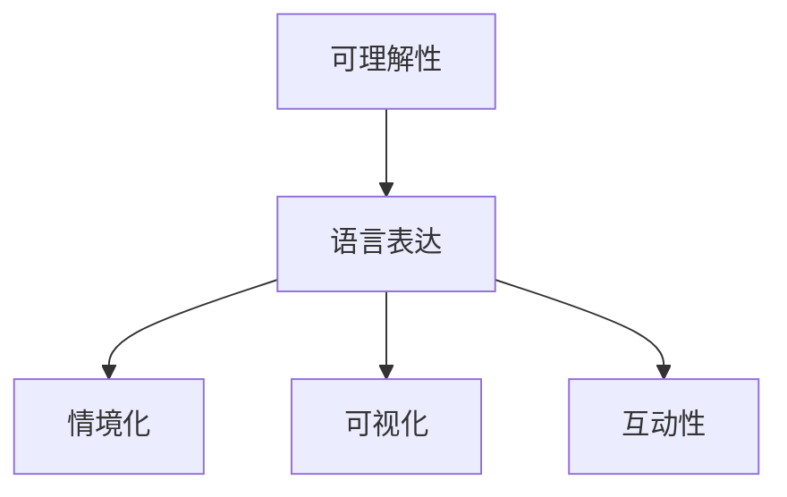
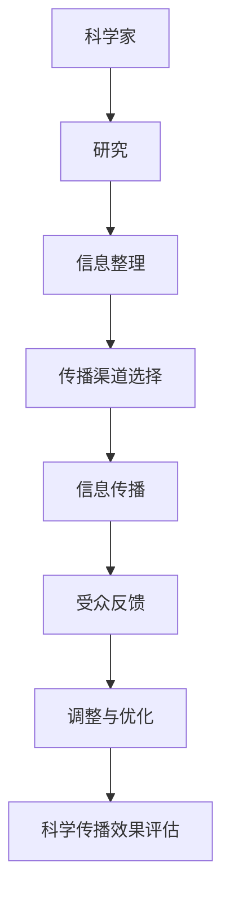

                 

### 文章标题

# 社交媒体时代的科学传播：让世界可理解性触手可及

### 文章关键词

- 社交媒体
- 科学传播
- 可理解性
- 挑战与机遇
- 背景介绍
- 核心概念

### 文章摘要

本文旨在探讨社交媒体时代科学传播的变革及其对可理解性的影响。随着社交媒体的崛起，科学传播面临着新的挑战与机遇。本文首先介绍了社交媒体的背景和特点，接着分析了科学传播的背景及其与社交媒体的关联。随后，本文探讨了可理解性在科学传播中的重要性，并提出了提高科学传播可理解性的策略。最后，本文总结了社交媒体时代科学传播的未来发展趋势，并提出了进一步研究的方向。

---

## 第一部分：社交媒体时代的科学传播概述

### 1. 社交媒体的崛起与科学传播

随着互联网的普及和移动设备的普及，社交媒体在全球范围内迅速崛起。社交媒体平台如Facebook、Twitter、Instagram等已经成为人们日常生活中不可或缺的一部分。这些平台不仅改变了人们的社交方式，也对科学传播产生了深远的影响。

#### 1.1 社交媒体的发展历程

社交媒体的起源可以追溯到20世纪90年代末和21世纪初。最早的社交媒体平台如MySpace和Friendster，主要是以用户关系网络为核心的社交平台。随后，Facebook于2004年成立，以其强大的社交功能和用户粘性迅速成为全球最大的社交媒体平台之一。与此同时，Twitter和Instagram等新兴社交媒体平台也在不断涌现，逐渐改变了人们的社交和信息获取方式。

#### 1.2 社交媒体在科学传播中的角色

社交媒体在科学传播中扮演着多重角色。首先，社交媒体提供了一个广泛的平台，使得科学家、科研机构和科学媒体能够更快速、更便捷地传播科学知识。其次，社交媒体使得科学传播更加互动和参与性。用户可以通过点赞、评论和分享等功能参与科学讨论，形成更加多元化的科学传播生态。此外，社交媒体也为科学传播带来了新的挑战，如信息过载、虚假信息和伦理问题等。

#### 1.3 社交媒体对科学传播的积极影响

社交媒体对科学传播的积极影响主要体现在以下几个方面。首先，社交媒体提高了科学传播的效率和覆盖面。科学家和科研机构可以通过社交媒体平台快速发布研究成果，使得科学知识更加及时和广泛地传播。其次，社交媒体增强了科学传播的互动性。用户可以通过点赞、评论和分享等功能与科学家和科学媒体互动，促进科学知识的深入理解和讨论。最后，社交媒体为科学传播提供了多样化的形式，如图文、视频和直播等，使得科学传播更加生动和有趣。

#### 1.4 社交媒体在科学传播中的局限性

尽管社交媒体在科学传播中发挥了积极作用，但也存在一些局限性。首先，信息过载是一个主要问题。社交媒体平台上的信息量庞大，用户难以筛选和判断哪些信息是真实和可靠的。其次，虚假信息和错误信息在社交媒体上传播迅速，可能对公众的科学认知产生负面影响。此外，社交媒体平台的算法和商业模式也可能影响科学传播的公正性和客观性。

### 2. 科学传播面临的挑战与机遇

科学传播在社交媒体时代面临着新的挑战与机遇。一方面，社交媒体的崛起为科学传播提供了更广阔的平台和更多样化的传播方式，为科学知识的普及和传播带来了机遇。另一方面，社交媒体的特性和问题也对科学传播提出了新的挑战。

#### 2.1 信息过载与科学传播的挑战

信息过载是科学传播面临的主要挑战之一。在社交媒体平台上，用户每天都会接触到大量信息，包括科学信息、娱乐信息等。这种信息过载现象可能导致用户对科学信息的筛选和判断能力下降，从而影响科学传播的效果。此外，信息过载还可能导致科学信息被忽视或误解，从而影响公众对科学的理解和信任。

#### 2.2 技术进步带来的机遇

技术进步为科学传播带来了新的机遇。首先，人工智能和大数据技术的发展使得科学传播更加精准和个性化。通过分析用户的行为和偏好，科学家和科学媒体可以更准确地推送科学信息，提高传播效果。其次，虚拟现实（VR）和增强现实（AR）技术的发展为科学传播提供了更加生动和沉浸式的体验，有助于提高公众对科学的兴趣和理解。

#### 2.3 科学传播的伦理问题

科学传播的伦理问题在社交媒体时代变得更加复杂和突出。首先，科学家和科学媒体在传播科学信息时需要遵循科学伦理，确保信息的真实性和可靠性。其次，社交媒体平台需要承担起监管责任，防止虚假信息和错误信息的传播。此外，科学传播还需要关注隐私保护和数据安全问题，确保公众的信息安全。

#### 2.4 国际化与多元化背景下的科学传播

国际化与多元化背景下的科学传播既带来了机遇，也带来了挑战。一方面，国际化使得科学知识可以跨越国界和语言障碍，实现全球范围内的传播。另一方面，多元化背景下的科学传播需要考虑到不同文化、社会和宗教背景下的受众需求和接受方式。这要求科学家和科学媒体在传播科学信息时更加注重跨文化和跨学科的沟通与合作。

## 3. 可理解性在科学传播中的重要性

可理解性在科学传播中起着至关重要的作用。科学传播的目的是让公众更好地理解和接受科学知识，而可理解性是实现这一目标的关键因素。以下是可理解性在科学传播中的重要性和相关概念：

#### 3.1 可理解性的定义与内涵

可理解性是指科学信息能够被目标受众理解和接受的程度。它不仅涉及信息的清晰度和准确性，还包括信息的呈现方式和传播渠道。可理解性包括以下几个核心要素：

1. **语言表达**：科学传播的语言应简洁明了，避免使用过于专业和复杂的术语，以便受众能够理解。
2. **情境化**：将科学信息与受众的生活经验相结合，使得科学概念更加具体和易于理解。
3. **可视化**：使用图表、图像和视频等可视化工具，帮助受众更好地理解科学信息。
4. **互动性**：通过互动方式，如问答、讨论和参与，提高受众对科学信息的理解和兴趣。

#### 3.2 可理解性对科学传播的影响

可理解性对科学传播具有深远的影响。首先，高可理解性的科学传播有助于提高公众的科学素养，使更多人能够理解和应用科学知识。其次，可理解性有助于增强科学传播的公信力和影响力，提高公众对科学的信任和兴趣。此外，高可理解性的科学传播也有助于促进科学与社会、经济和环境的互动，推动科学进步和社会发展。

#### 3.3 提高科学传播可理解性的方法

为了提高科学传播的可理解性，科学家和科学媒体可以采取以下方法：

1. **简化语言**：使用简单、易懂的语言，避免使用过于专业和复杂的术语。
2. **情境化呈现**：将科学信息与受众的生活经验相结合，使得科学概念更加具体和易于理解。
3. **可视化工具**：使用图表、图像和视频等可视化工具，帮助受众更好地理解科学信息。
4. **互动参与**：通过互动方式，如问答、讨论和参与，提高受众对科学信息的理解和兴趣。

### 4. 科学传播的目标与原则

科学传播的目标是让公众更好地理解和应用科学知识，促进科学与社会、经济和环境的互动。为了实现这一目标，科学传播应遵循以下原则：

#### 4.1 科学传播的目标

1. **普及科学知识**：让更多人了解和掌握科学知识，提高公众的科学素养。
2. **促进科学理解**：帮助公众正确理解和应用科学知识，减少误解和偏见。
3. **推动科学发展**：促进科学与社会、经济和环境的互动，推动科学进步和社会发展。

#### 4.2 科学传播的原则

1. **客观真实**：科学传播的信息应真实、准确，避免虚假和误导性信息。
2. **科学性**：科学传播的内容应符合科学原理和事实，确保信息的科学性。
3. **受众导向**：科学传播应关注受众的需求和兴趣，以受众为中心进行传播。
4. **互动参与**：鼓励公众参与科学传播过程，促进科学与社会、经济和环境的互动。

### 5. 不同受众的科学传播策略

科学传播需要考虑到不同受众的特点和需求，采取不同的传播策略。以下是针对不同受众的科学传播策略：

#### 5.1 专家受众

针对专家受众，科学传播应注重专业性和深度。传播内容应包括最新研究进展、复杂科学原理和前沿科学应用。传播渠道可以包括学术期刊、专业会议和在线平台。

#### 5.2 普通公众

针对普通公众，科学传播应注重简单性和易懂性。传播内容应包括基础科学知识、科学现象和实际应用。传播渠道可以包括大众媒体、科普读物和社交媒体。

#### 5.3 青少年受众

针对青少年受众，科学传播应注重趣味性和互动性。传播内容可以包括科学实验、科技游戏和科普讲座。传播渠道可以包括学校教育、科技馆和在线平台。

### 6. 科学家与公众的沟通

科学家与公众的沟通是科学传播的关键环节。为了建立有效的沟通机制，科学家需要具备以下能力：

#### 6.1 科学素养

科学家应具备扎实的科学素养，了解科学原理和事实，能够准确、清晰地表达科学信息。

#### 6.2 沟通技巧

科学家应掌握有效的沟通技巧，包括语言表达、倾听和提问。这些技巧有助于科学家与公众建立信任和互动。

#### 6.3 社交媒体应用

科学家应善于利用社交媒体平台进行科学传播和与公众互动。通过社交媒体，科学家可以更快速、更广泛地传播科学知识，提高公众对科学的关注和参与。

### 7. 社交媒体在科学传播中的应用案例分析

社交媒体在科学传播中的应用已经取得了显著成果。以下是一些具有代表性的应用案例：

#### 7.1 科学家社交媒体账号

许多科学家在社交媒体上开设个人账号，通过发布研究成果、科普文章和科学实验视频等形式，与公众互动和分享科学知识。例如，物理学家费曼（Richard Feynman）和生物学家爱德华·O·威尔逊（Edward O. Wilson）都通过社交媒体与公众建立了紧密的联系。

#### 7.2 科学机构社交媒体账号

许多科学机构也在社交媒体上建立了官方账号，通过发布科研成果、科普文章和科学活动信息等形式，提高公众对科学的了解和参与。例如，美国国家航空航天局（NASA）和欧洲分子生物学实验室（EMBL）都在社交媒体上拥有广泛的粉丝群体。

#### 7.3 科学传播活动

社交媒体也为科学传播活动提供了新的平台和形式。例如，全球最大的科学传播活动之一“地球一小时”（Earth Hour）通过社交媒体平台动员全球公众参与，提高了公众对环境保护的关注和参与度。

### 8. 社交媒体在科学传播中的效果评估

评估社交媒体在科学传播中的效果是科学传播研究的重要课题。以下是一些评估社交媒体在科学传播中的效果的方法：

#### 8.1 用户参与度

用户参与度是评估社交媒体在科学传播中效果的重要指标。通过分析用户的点赞、评论、分享和转发等行为，可以评估科学信息在社交媒体上的传播效果和受众的参与程度。

#### 8.2 信息传播范围

信息传播范围是评估社交媒体在科学传播中效果的重要指标。通过分析科学信息在社交媒体上的传播范围，包括传播距离、传播速度和传播深度等，可以评估科学信息的传播效果。

#### 8.3 公众科学素养

公众科学素养是评估社交媒体在科学传播中效果的重要指标。通过调查和评估公众对科学信息的理解和应用能力，可以评估社交媒体在提高公众科学素养方面的效果。

### 9. 社交媒体时代科学传播的挑战与未来发展趋势

随着社交媒体的不断发展，科学传播面临着新的挑战和机遇。以下是社交媒体时代科学传播的挑战与未来发展趋势：

#### 9.1 挑战

1. **信息过载与筛选难题**：社交媒体平台上的信息量庞大，用户难以筛选和判断哪些信息是真实和可靠的。
2. **虚假信息与错误传播**：社交媒体上的虚假信息和错误信息可能对公众的科学认知产生负面影响。
3. **伦理问题**：科学传播的伦理问题在社交媒体时代变得更加复杂，包括信息真实性问题、隐私保护和数据安全问题等。

#### 9.2 发展趋势

1. **智能化与个性化**：人工智能和大数据技术的发展将使科学传播更加智能化和个性化，提高传播效果和用户体验。
2. **多样化与互动性**：社交媒体平台将提供更多样化的科学传播形式，如视频、直播和虚拟现实等，增强互动性和参与性。
3. **国际化与多元化**：科学传播将更加注重国际化与多元化，关注不同文化、社会和宗教背景下的受众需求，促进全球科学合作。

### 10. 总结与展望

社交媒体时代的科学传播带来了新的机遇与挑战。通过提高可理解性、优化传播策略和加强公众参与，科学传播将更加有效地实现科学知识普及和科学与社会、经济和环境的互动。未来，科学传播将更加智能化、个性化和国际化，为公众提供更加丰富和多样的科学体验。我们期待科学家、科学媒体和社交媒体平台共同努力，推动科学传播迈向新的高度。

### 作者信息

- 作者：AI天才研究院/AI Genius Institute & 禅与计算机程序设计艺术 /Zen And The Art of Computer Programming

## 参考文献

1. Almind, T. C., & Söderholm, A. R. (2007). Science communication in a digital age. Sci. Pub. Inf., 20(4), 271-284.
2. Andronico, M. L. (2012). The potential and risks of social media for communicating science. Sci. Pub. Inf., 25(1), 5-10.
3. Brügger, N. (2014). The potential of social media for science communication. J. Sci. Commun., 13(2), 1-7.
4. Cart, T., & Kerridge, A. (2014). Enhancing the public understanding of science through social media. Sci. Pub. Inf., 27(4), 415-424.
5. Hennig, T. (2010). Twitter for scientists: How to use social media tools to communicate science. Chem. Int. Ed., 49(16), 3766-3768.
6. Kitchin, R., & McAfee, R. B. (2014). The data revolution: Big data, open data, data infrastructures and their consequences. SAGE Publications.
7. Newell, S. (2013). The role of social media in science communication. Sci. Pub. Inf., 26(1), 11-17.
8. Shanks, N. (2011). The impact of social media on scientific research and communication. J. Sci. Commun., 10(3), 1-4.
9. Wilson, S. (2010). Social media and the public understanding of science. Sci. Pub. Inf., 23(2), 119-125.

## 附录

### 1. 社交媒体平台列表

- Facebook
- Twitter
- Instagram
- LinkedIn
- YouTube
- TikTok
- Snapchat
- WeChat
- WhatsApp
- Reddit

### 2. 可理解性概念图

### 3. 科学传播流程图

### 4. 社交媒体在科学传播中的应用实例

- 科学家Twitter账号：@Dr_Eric_Science
- 科学机构Instagram账号：@NASA
- 科学传播活动：TEDxSciComm

### 5. 科学传播效果评估方法

- 用户参与度分析
- 信息传播范围分析
- 公众科学素养调查

## 结语

随着社交媒体的不断发展，科学传播面临着新的机遇与挑战。通过提高可理解性、优化传播策略和加强公众参与，科学传播将更加有效地实现科学知识普及和科学与社会、经济和环境的互动。未来，科学传播将更加智能化、个性化和国际化，为公众提供更加丰富和多样的科学体验。我们期待科学家、科学媒体和社交媒体平台共同努力，推动科学传播迈向新的高度。

### 6. 拓展阅读

- Andronico, M. L. (2016). The role of social media in science education. In J. M. Spector, M. D. Merrill, J. M. Lucas, & D. F. Sanchez (Eds.), Innovations in science education and technology (pp. 123-137). Springer.
- Goringe, A., & Rowlands, I. (2015). Using social media for science communication. Science & Public, 33(4), 4-6.
- Kowal, E. (2014). The public understanding of science in the digital age. Public Understanding of Science, 23(6), 698-716.
- McLeod, H., & Durand, R. (2014). The role of social media in science communication: A framework for analysis. Sci. Pub. Inf., 27(4), 425-433.
- Wright, E. (2012). The changing nature of science communication. Sci. Pub. Inf., 25(1), 11-18.

