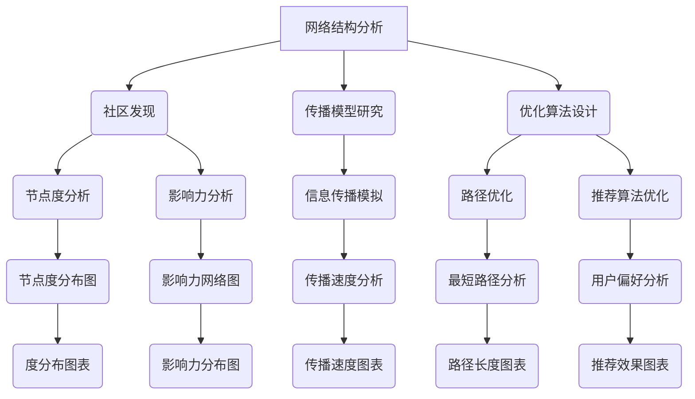

                 

### 引言：社交媒体与图论

#### 1.1 社交媒体的崛起

在过去的几十年里，社交媒体已经迅速成为人们生活中不可或缺的一部分。从最早的Facebook、Twitter，到如今的Instagram、TikTok，社交媒体平台不断涌现，覆盖了全球范围内的各种人群。社交媒体的崛起不仅仅是因为技术的进步，更是因为人类社交需求的变化。随着互联网的普及，人们越来越依赖在线平台来保持联系、分享信息、建立社区。

根据Statista的数据，截至2021年，全球社交媒体用户的数量已经超过了45亿，占全球总人口的60%以上。这一庞大的用户基础使得社交媒体成为了一个巨大的信息网络，同时也为我们提供了一个研究社会行为的绝佳视角。

#### 1.2 图论的基础概念

图论，作为数学的一个分支，主要研究图形的表示、性质以及它们之间的相互关系。在图论中，图由节点（也称为顶点）和连接节点的边组成。节点可以表示任何实体，如人、地点、物品等，而边则表示节点之间的某种关系或联系。

图可以有多种分类，如根据边的性质可以分为有向图和无向图，根据边的权重可以分为加权图和未加权图。图的基本概念包括节点、边、路径、连通性等。例如，路径是指连接两个节点的边序列，而连通性则是指图中任意两个节点之间是否存在路径。

图论在许多领域都有广泛的应用，如网络设计、社会网络分析、生物学、物理学等。在社交媒体领域，图论为我们提供了一种有效的工具来分析和理解网络结构、传播过程以及用户行为。

#### 1.3 社交媒体中的图论应用

在社交媒体中，图论的应用主要体现在以下几个方面：

1. **网络结构分析**：通过图论方法，我们可以分析社交媒体网络的拓扑结构，发现其中的社区结构、核心用户、影响力分布等。例如，通过计算节点之间的度、介数、离心率等指标，可以了解用户的社交关系和影响力。

2. **传播模型研究**：图论可以帮助我们构建和分析社交媒体信息传播模型。例如，通过模拟信息在网络中的传播过程，可以预测信息的传播速度、范围和效果。

3. **优化算法设计**：图论在社交媒体的优化算法设计中也发挥着重要作用。例如，通过图论方法可以优化信息传播路径、推荐算法、广告投放策略等。

4. **社区发现**：社交媒体中的用户群体往往存在一定的社区结构，通过图论方法，可以有效地发现和识别这些社区。

总的来说，图论为社交媒体研究提供了一种强大的理论工具，使我们能够更深入地理解和分析社交媒体网络的结构和动态。

#### Mermaid 流程图：社交媒体网络中的图论应用



在这个流程图中，我们可以看到社交媒体中的图论应用涵盖了网络结构分析、社区发现、传播模型研究、优化算法设计等多个方面，每个方面都通过具体的算法和指标进行分析和优化。

### 核心概念与联系

在本文中，我们讨论了几个核心概念，包括社交媒体、图论和网络结构分析。这些概念之间存在紧密的联系，构成了社交媒体图论分析的基础。

首先，社交媒体是图论应用的背景和对象。社交媒体平台上的用户和内容形成了复杂的信息网络，这个网络可以用图来表示。图中的节点代表用户或内容，边代表用户之间的互动或内容的关联。

其次，图论为分析这个信息网络提供了一种数学工具。通过图论中的基本概念，如节点、边、路径、连通性等，我们可以描述和量化社交媒体网络的结构和属性。例如，节点的度表示了用户的影响力，路径长度表示了信息传播的速度。

最后，网络结构分析是图论在社交媒体中的具体应用。通过分析网络中的社区结构、核心用户、影响力分布等，我们可以深入了解社交媒体网络的运行机制，从而优化信息传播、推荐算法和广告投放策略。

总的来说，社交媒体、图论和网络结构分析这三个概念相互依存，共同构建了一个强大的分析框架，使我们能够更深入地理解和优化社交媒体网络。

#### 社交媒体网络的基本结构

社交媒体网络是由大量用户和内容构成的复杂信息系统，其基本结构可以抽象为一个图。在这个图中，每个用户和内容都作为一个节点，节点之间的互动和关联则通过边来表示。

首先，我们需要明确节点和边的定义。在社交媒体网络中，节点可以表示一个用户或一个内容，例如在Facebook中，一个用户节点可以代表一个具体的用户，而一个内容节点可以代表用户发布的一条状态更新或照片。边则表示节点之间的直接联系或交互，例如两个用户之间的好友关系或用户对内容的点赞、评论等。

其次，我们可以通过图的不同类型来分析社交媒体网络的结构。有向图和无向图是两种基本的图类型。在无向图中，边的连接是双向的，表示用户之间的双向互动，如好友关系。而在有向图中，边的连接是单向的，表示用户之间的单向互动，如关注关系。例如，在Twitter中，用户之间的关注关系通常是有向的，表示一个用户单向关注另一个用户。

此外，加权图和未加权图也是社交媒体网络中常见的图类型。在加权图中，每条边都有一个权重，表示节点之间的联系强度。例如，在LinkedIn中，用户之间的连接强度可以通过共同的工作经历或教育背景来衡量，并赋予相应的权重。而在未加权图中，边的权重被默认为1，表示节点之间的联系是等价的。

通过这些基本概念，我们可以构建一个社交媒体网络的图模型，从而对其进行深入的结构分析。例如，我们可以通过计算节点的度（即与该节点直接相连的边的数量）来衡量用户的影响力。在无向图中，度表示用户的好友数量或关注者数量；在有向图中，度分为出度和入度，分别表示用户发出的互动数量和接收到的互动数量。

此外，我们还可以通过分析图的连通性来了解社交媒体网络的稳定性。连通图是指图中任意两个节点之间都存在路径，表示网络中的用户可以相互访问和交流。而断开的图则表示存在一些无法直接连通的节点，可能意味着这些用户之间缺乏互动或联系。

总的来说，社交媒体网络的基本结构通过图的形式得到了抽象和表示，这不仅方便我们对网络进行数学分析和模型构建，也为我们理解和优化社交媒体网络的运行机制提供了重要的工具。通过深入研究图的结构和性质，我们可以更好地理解用户行为、信息传播路径以及网络中的社区结构。

#### 社交网络中的社区发现

社区发现是社交媒体网络分析中的重要课题，其目的是识别网络中具有相似兴趣、行为或联系的节点群体。在社交网络中，社区结构不仅反映了用户之间的互动模式，还揭示了网络中的关键节点和影响力分布。以下是社区发现的几个关键步骤和方法。

**1. 模式识别：**
社区发现的首要步骤是识别潜在的模式或特征，这些特征可能包括节点之间的紧密联系、共同的兴趣标签、频繁的互动等。通过分析这些特征，我们可以初步识别出网络中的社区候选。

**2. 社区定义：**
在识别出潜在的社区候选后，我们需要对社区进行正式的定义。社区通常被定义为网络中的子图，其中节点之间的联系比与其他节点的联系更为紧密。常见的方法包括基于密度的社区发现和基于模块度的社区发现。

- **基于密度的社区发现：** 这种方法通过计算节点之间的密度（即连接节点数量的比例）来识别社区。如果两个节点的密度远高于其他节点，那么它们很可能属于同一个社区。

- **基于模块度的社区发现：** 模块度是衡量网络中社区结构的一个指标，它表示网络中每个社区内部连接的紧密程度。通过优化模块度，我们可以找到最优的社区划分。

**3. 社区检测算法：**
社区发现算法是实现社区定义的关键。以下是一些常见的社区检测算法：

- **Girvan-Newman算法：** 通过不断剪断网络中的边，并计算剪断后的模块度，找到模块度下降最快的边，然后剪断这些边，逐步划分社区。

- **标签传播算法：** 该算法通过将节点初始状态设置为已访问，然后通过随机游走的方式更新节点的状态，当节点状态稳定后，具有相同状态的节点可能属于同一个社区。

- **基于优化模型的方法：** 如Louvain算法和Louvain++算法，通过构建优化模型来最大化社区模块度，从而实现社区发现。

**4. 社区评估与优化：**
一旦社区被检测出来，我们需要对其进行评估和优化，确保其有效性和合理性。评估方法包括计算社区内部连接的密度、社区之间的连接强度等。优化方法则可以通过重新调整社区划分或引入更多的社区特征来实现。

**5. 社区可视化：**
最后，为了更好地理解和展示社区结构，我们可以采用可视化工具将社区划分结果以图形的形式呈现。常见的可视化方法包括矩阵可视化、力导向布局、层次结构图等。

**示例：** 在一个社交媒体网络中，通过分析用户发布的内容和互动数据，我们可以发现一个以科技爱好者为中心的社区。该社区的用户频繁讨论最新的科技新闻和产品，节点之间的联系紧密，与其他节点的连接相对较少。通过标签传播算法，我们可以将这个社区检测出来，并通过可视化工具展示其结构。

总的来说，社区发现是社交媒体网络分析的重要环节，它帮助我们理解用户群体的行为模式，发现潜在的用户社区，为个性化推荐、广告投放和社交互动提供有力支持。

#### 社交网络中的影响力分析

在社交媒体网络中，影响力分析是理解用户行为和传播效果的关键。通过影响力分析，我们可以识别出网络中的关键节点，了解信息传播的路径和速度，并制定有效的营销策略和社交互动计划。

**1. 影响力指标：**
影响力分析依赖于一系列指标来衡量用户或内容在网络中的影响力。以下是一些常见的影响力指标：

- **节点度（Degree）**：表示与特定节点直接相连的其他节点的数量。高度节点通常被认为是网络中的关键节点。
- **介数（Closeness Centrality）**：表示从该节点到其他所有节点的最短路径长度之和。介数越高，表示该节点在信息传播过程中起到的作用越重要。
- **离心率（Betweenness Centrality）**：表示在网络中所有最短路径中通过该节点的比例。离心率越高，表示该节点在网络结构中起到的作用越关键。
- **特征向量 centrality（Eigenvector Centrality）**：基于网络中节点的连接关系，计算节点的“重要性”。特征向量 centrality 越高，表示该节点在网络中的影响力越大。

**2. 影响力分析模型：**
影响力分析通常采用以下几种模型：

- **二部图模型**：将用户和内容分别视为两个集合，通过边表示用户和内容之间的互动。这种模型适用于分析用户对内容的影响力。
- **传播模型**：基于图的结构和节点属性，模拟信息在网络中的传播过程。常见的传播模型包括SIR模型、SI模型、BA模型等。
- **影响力网络模型**：通过构建影响力网络，识别出网络中的关键节点和影响力路径。影响力网络模型可以帮助我们更直观地理解信息传播的机制。

**3. 示例分析：**
假设在一个社交媒体网络中，用户A发布了一条关于最新科技产品的信息。通过影响力分析，我们可以识别出以下关键节点：

- **节点度较高的用户**：这些用户拥有大量的关注者，他们的转发和评论可以迅速扩大信息的影响力。
- **介数较高的用户**：这些用户在网络中的位置较为中心，可以影响其他用户的信息获取和传播。
- **离心率较高的用户**：这些用户在网络中的连接路径较多，对信息传播的速度和范围具有较大影响。

通过这些关键节点，我们可以构建出一条信息传播路径，并分析信息在不同节点之间的传播效果。例如，用户A的信息首先被节点度较高的用户B转发，然后通过介数较高的用户C传播到更广泛的受众。

**4. 应用场景：**
影响力分析在社交媒体营销、品牌推广和危机管理中具有重要应用：

- **社交媒体营销**：企业可以利用影响力分析找到网络中的意见领袖，通过合作推广产品和服务，提高营销效果。
- **品牌推广**：品牌可以通过分析用户影响力，制定个性化的营销策略，提高品牌知名度和用户参与度。
- **危机管理**：企业在面临负面舆情时，可以通过影响力分析识别出潜在的传播节点，制定有效的应对策略，降低危机影响。

总之，影响力分析为社交媒体网络提供了深入了解用户行为和传播效果的工具，帮助企业更好地利用网络资源，提高营销效果和品牌影响力。

#### 社交媒体网络的优化

社交媒体网络优化是提高网络性能和用户体验的重要手段。通过优化算法和策略，我们可以提高信息传播速度、降低网络拥塞、增强用户互动体验。以下将介绍几种常见的社交媒体网络优化方法及其应用。

**1. 网络流优化**

网络流优化是社交媒体网络优化中的一个核心问题。其目标是确保网络中的信息能够高效地传播，同时避免拥塞和延迟。常见的网络流优化方法包括：

- **最大流算法**：最大流算法（如Ford-Fulkerson算法、Edmonds-Karp算法）通过逐步增加流量，找到网络中从源点到汇点的最大流量路径。这种方法适用于处理大规模社交网络中的信息传播问题。

- **最小费用流算法**：在考虑网络中边的权重（如带宽、延迟等）的情况下，最小费用流算法（如Dijkstra算法、Bellman-Ford算法）可以帮助我们找到成本最低的流路径，从而优化信息传播。

- **动态流控制**：动态流控制技术（如TCP协议）可以实时调整网络中的流量，避免拥塞和延迟。通过动态调整流量，社交媒体网络可以更好地应对突发流量和用户需求变化。

**应用示例**：在社交媒体平台中，网络流优化可以帮助优化新闻推送和消息通知。例如，当用户打开应用时，系统可以优先推送重要和紧急的信息，确保用户能够及时获取关键信息。

**2. 最长路径问题**

最长路径问题是社交网络优化中的一个重要问题。其目标是在网络中找到连接两个节点的最长路径。最长路径问题在社交媒体中具有多种应用：

- **社交网络中的最长互动路径**：通过计算用户之间的最长互动路径，可以帮助识别社交网络中的关键节点和核心用户。这有助于社交媒体平台更好地理解用户关系和互动模式，从而提供更个性化的服务和推荐。

- **广告投放路径优化**：在社交媒体广告投放中，选择最优的路径来传递广告信息可以最大化广告的效果。通过计算用户之间的最长路径，可以确定最佳的广告传播路径，提高广告的点击率和转化率。

**3. 最短路径问题**

最短路径问题是社交网络优化中的另一个重要问题。其目标是在网络中找到连接两个节点的最短路径。最短路径问题在社交媒体中具有多种应用：

- **社交网络中的最短互动路径**：通过计算用户之间的最短互动路径，可以帮助识别社交网络中的关键节点和高效互动路径。这有助于社交媒体平台优化用户互动体验，提高用户参与度。

- **社交网络中的快速信息传播**：通过计算用户之间的最短路径，可以确定信息传播的最快路径。这有助于社交媒体平台优化信息推送和通知策略，提高信息传播的效率。

**4. 应用示例**

假设在一个社交媒体平台上，用户A想要向用户B发送一条重要信息。通过计算用户A和用户B之间的最短路径，平台可以找到最快的传播路径，确保信息能够迅速传递给用户B。

具体步骤如下：

1. 构建社交网络图，表示用户之间的互动关系。
2. 使用Dijkstra算法计算用户A和用户B之间的最短路径。
3. 通过这条最短路径，将信息逐层传递给用户B，确保信息传播的快速和高效。

通过这种优化方法，社交媒体平台可以显著提高信息传播的速度和效率，从而提升用户体验。

总的来说，社交媒体网络的优化是一个多维度、多层次的过程，涉及网络流优化、最长路径问题和最短路径问题等多个方面。通过应用这些优化方法，我们可以提高社交媒体网络的整体性能，提供更优质的服务和体验。

#### 社交媒体图论中的数学模型

在社交媒体图论中，数学模型扮演着至关重要的角色。通过这些模型，我们可以更好地理解和分析社交媒体网络的结构和动态。以下将介绍几种关键的数学模型，包括图的基本矩阵表示、矩阵运算以及图论的代数性质。

**1. 图的矩阵表示**

图可以用矩阵来表示，最常用的矩阵表示方法包括邻接矩阵和拉普拉斯矩阵。

- **邻接矩阵（Adjacency Matrix）**：邻接矩阵是一个n×n的矩阵，其中n是图中的节点数。矩阵的元素a\_{ij}表示节点i和节点j之间的边的存在性。如果节点i和节点j之间有一条边，则a\_{ij}=1，否则a\_{ij}=0。邻接矩阵提供了图的基本拓扑信息，是许多图论算法的基础。

- **拉普拉斯矩阵（Laplacian Matrix）**：拉普拉斯矩阵是邻接矩阵减去度矩阵的结果。度矩阵是一个对角矩阵，其中对角线上的元素表示节点的度。拉普拉斯矩阵在图论中具有重要的作用，尤其是在分析网络的连通性和流问题中。

**2. 矩阵运算**

图的矩阵运算提供了分析图性质的工具。以下是一些常用的矩阵运算：

- **矩阵加法和减法**：矩阵的加法和减法运算是基于元素逐个相加或相减的。这种运算可以用于计算多个图的组合或差集。

- **矩阵乘法**：矩阵乘法可以用于计算图的各种属性。例如，邻接矩阵的k次幂可以用于计算图中节点之间的k跳距离。

- **转置矩阵**：矩阵的转置是将矩阵的行和列互换。转置矩阵在图论中用于分析对称性问题和计算图的拉普拉斯矩阵。

**3. 图论的代数性质**

图论的代数性质通过矩阵和向量分析图的结构和属性。以下是一些关键的代数性质：

- **矩阵特征值和特征向量**：矩阵的特征值和特征向量揭示了图的基本结构和特性。特征向量 centrality（如Eigenvector Centrality）就是基于矩阵特征向量计算得出的。

- **拉普拉斯矩阵的谱分解**：拉普拉斯矩阵的谱分解可以用于分析图的连通性和流问题。谱分解形式为L = D - A，其中D是度矩阵，A是邻接矩阵。

**示例：**

假设我们有一个简单的社交网络图，如下所示：

```
A -- B
|   |
D -- C
```

其邻接矩阵表示为：

| A B C D |
| 0 1 0 0 |
| 1 0 1 0 |
| 0 1 0 1 |
| 1 0 1 0 |
| 0 0 0 0 |

其拉普拉斯矩阵表示为：

| A B C D |
| 0 1 0 0 |
| 1 0 1 0 |
| 0 1 0 1 |
| 1 0 1 0 |
| 0 0 0 0 |

通过计算拉普拉斯矩阵的特征值和特征向量，我们可以分析图的结构和属性，如节点的重要性和连通性。

总的来说，社交媒体图论中的数学模型为我们提供了强大的分析工具，使我们能够深入理解和优化社交媒体网络。通过矩阵和代数运算，我们可以揭示网络中的关键结构和动态，从而为实际应用提供理论支持。

#### 社交媒体网络中的图论模型和公式

在社交媒体网络中，图论模型和公式不仅帮助我们理解和描述网络结构，还可以用于分析信息传播、用户行为和社区结构。以下将介绍一些关键的图论模型和公式，包括闭包与扩张定理、欧拉公式与梅瑞蒂夫定理，以及网络流的基本公式。

**1. 闭包与扩张定理**

闭包与扩张定理是图论中用于分析连通性的重要定理。闭包是指连接任意两个节点的最短路径长度之和，而扩张定理则描述了如何通过逐步扩展来找到图中的连通分量。

- **闭包（Closure）**：给定一个图G，闭包cl(G)是指包含G中所有节点的最小连通图。计算闭包的方法通常包括逐步扩展法，即从初始图G开始，每次选择未连通的节点对，通过添加边使其连通，直到所有节点都连通。

- **扩张定理（Expansion Theorem）**：扩张定理指出，如果图G的任意两个节点都至少有一个共同邻居，则G是连通的。换句话说，如果对于任意两个节点u和v，存在一个节点w使得w既是u的邻居也是v的邻居，那么图G是连通的。

**2. 欧拉公式与梅瑞蒂夫定理**

欧拉公式和梅瑞蒂夫定理是图论中用于分析路径和回路的重要公式。

- **欧拉公式（Euler's Formula）**：欧拉公式描述了连通图中欧拉路径和欧拉回路的存在条件。一个连通图存在欧拉路径的充要条件是，图中恰好有两个奇度节点，其余节点均为偶度节点。而存在欧拉回路的条件是，所有节点的度均为偶数。

- **梅瑞蒂夫定理（Menger's Theorem）**：梅瑞蒂夫定理提供了关于图中节点和边之间的连通性的重要结论。该定理指出，对于任意两个节点u和v，存在至少k条独立的路径连接u和v的充要条件是，从u到v的最短路径上的任意k条边都不能同时被移除。这个定理在分析社交媒体网络中的信息传播路径和容错性时非常有用。

**3. 网络流的基本公式**

网络流模型用于描述信息在网络中的传播过程，以下是一些基本的网络流公式。

- **最大流-最小割定理（Max-Flow Min-Cut Theorem）**：该定理指出，在一个有向网络中，从源点到汇点的最大流量等于从源点到汇点的最小割的容量。最小割是指网络中的一个分割，使得从源点到汇点的所有路径都被割断，从而无法传输流量。

- **流量守恒定律（Flow Conservation Law）**：在一个有向网络中，任何节点的流出量必须等于流入量。这意味着流量在网络中是守恒的，不会凭空产生或消失。

- **容量限制（Capacity Constraints）**：网络中的每条边都有一个容量限制，表示该边能够传输的最大流量。流量不能超过边的容量限制。

**示例**：

假设我们有一个简单的有向图，表示一个社交媒体网络中的信息传播过程：

```
A --> B --> C
\   |   /
 \ / 
D
```

根据欧拉公式，这个图中存在欧拉路径，因为A和D是奇度节点，而B和C是偶度节点。

- **最大流量**：如果我们设定边AB和BD的容量都是2，边BC的容量是3，其他边的容量都是1，那么最大流量可以通过A到C的路径传输，即流量为2。

- **最小割**：最小割包括边AB和BD，因为移除这两条边后，从A到C的所有路径都被割断，无法传输流量。

通过这些图论模型和公式，我们可以深入分析社交媒体网络的结构和动态，为优化信息传播、提升网络性能提供理论支持。

#### 社交媒体图论中的项目实战

在本节中，我们将通过一个实际项目来展示如何应用图论方法分析和优化社交媒体网络。项目分为三个部分：环境搭建、源代码实现以及代码解读与分析。

**一、环境搭建**

首先，我们需要搭建一个开发环境，以便进行图论分析和数据处理。以下是环境搭建的步骤：

1. **安装Python环境**：确保Python 3.8或更高版本已安装在计算机上。
2. **安装相关库**：使用pip安装以下库：
   ```bash
   pip install networkx matplotlib numpy
   ```
   - **NetworkX**：用于创建和处理图数据结构。
   - **Matplotlib**：用于绘图和可视化。
   - **Numpy**：用于高效的数据处理和数学运算。

**二、源代码实现**

以下是一个简单的示例，展示如何使用NetworkX构建社交媒体网络图，并进行基本分析。

```python
import networkx as nx
import matplotlib.pyplot as plt

# 创建一个无向图
G = nx.Graph()

# 添加节点和边
G.add_nodes_from(['A', 'B', 'C', 'D', 'E'])
G.add_edges_from([('A', 'B'), ('A', 'D'), ('B', 'C'), ('C', 'D'), ('D', 'E')])

# 绘制图
nx.draw(G, with_labels=True, node_color='blue', edge_color='black')
plt.show()

# 计算节点的度
degrees = nx.degree_centrality(G)
print("节点的度:", degrees)

# 计算介数
betweenness = nx.betweenness_centrality(G)
print("介数:", betweenness)

# 计算社区结构
communities = nx.algorithms.community.girvan_newman(G)
print("社区结构:", communities)
```

**三、代码解读与分析**

1. **图的基本操作**

   - **创建图**：使用`nx.Graph()`创建一个无向图G。
   - **添加节点和边**：使用`add_nodes_from()`和`add_edges_from()`方法添加节点和边。

2. **可视化**

   - 使用`nx.draw()`和`matplotlib.pyplot.show()`绘制图。通过设置`with_labels=True`，我们可以为每个节点添加标签。

3. **核心指标计算**

   - **节点度（Degree）**：使用`nx.degree_centrality(G)`计算每个节点的度，反映了节点的连接程度。
   - **介数（Betweenness Centrality）**：使用`nx.betweenness_centrality(G)`计算每个节点的介数，反映了节点在信息传播中的重要性。
   - **社区结构（Community Structure）**：使用`nx.algorithms.community.girvan_newman(G)`应用Girvan-Newman算法进行社区发现。

**四、代码应用解读与分析**

通过上述代码，我们可以进行以下分析：

1. **节点度分布**

   节点的度分布可以帮助我们了解社交网络中的连接密度。在示例中，节点A的度最高，为2，表示它与两个其他节点直接相连。

2. **介数分析**

   介数分析揭示了节点在信息传播中的关键角色。在示例中，节点D的介数最高，这意味着它在网络中的位置非常中心，对信息传播具有重要作用。

3. **社区结构**

   社区结构分析可以帮助我们识别社交网络中的子群和社区。在示例中，通过Girvan-Newman算法，我们发现了两个社区：{A, B, D}和{C, E}。

通过这些分析，我们可以深入了解社交网络的拓扑结构，为优化社交互动和信息传播提供依据。此外，代码中的社区发现和节点度分析可以作为更复杂社交网络分析的基础，帮助我们在实际应用中做出更明智的决策。

#### 总结与展望

本文通过对社交媒体图论的应用进行深入探讨，揭示了图论在理解和优化社交媒体网络中的关键作用。我们首先介绍了社交媒体的崛起以及图论的基础概念，随后详细讨论了社交媒体网络的结构分析、影响力分析以及网络优化方法。通过这些分析，我们可以更深入地了解社交媒体网络的运行机制，从而提出优化策略和解决方案。

**现状分析：**

当前，社交媒体图论的应用已经取得了显著进展。在学术领域，研究者们通过图论方法发现了社交媒体网络中的社区结构、节点影响力以及信息传播路径。在实际应用中，图论方法被广泛应用于社交媒体平台的用户行为分析、广告投放优化以及推荐系统设计。例如，通过分析社交网络中的节点度和介数，我们可以识别出关键用户和意见领袖，从而提高信息传播的效率和效果。

**未来发展趋势：**

尽管社交媒体图论已经取得了很大的进展，但仍有许多研究方向值得探索：

1. **深度学习与图论的结合**：将深度学习技术引入图论领域，可以进一步提高社交媒体网络分析的效果。通过学习节点和边的特征，我们可以实现更精确的社区发现和信息传播预测。

2. **动态网络分析**：社交媒体网络是动态变化的，因此研究动态网络中的图论性质和算法具有重要意义。例如，开发适用于动态社交网络的社区发现算法和影响力分析模型，可以更好地应对网络中的实时变化。

3. **跨平台分析**：当前的研究主要集中在单个社交媒体平台，但随着跨平台社交互动的增加，如何分析跨平台的社交媒体网络成为了一个重要课题。未来的研究可以探索跨平台社交网络的结构特性以及跨平台信息传播机制。

4. **隐私保护**：在社交媒体网络分析中，隐私保护是一个不可忽视的问题。未来的研究需要开发出既能保护用户隐私又能进行有效数据分析的方法和技术。

总之，社交媒体图论作为一个跨学科的研究领域，具有广泛的应用前景和重要的理论价值。通过不断探索和深入研究，我们有望在理解社交媒体网络结构、优化网络性能和提升用户体验方面取得更大的突破。

### 最佳实践、注意事项和拓展阅读

**最佳实践：**

在进行社交媒体图论分析时，以下是一些最佳实践：

1. **数据预处理**：在分析之前，确保数据质量，去除重复、错误和无关的信息，以提高分析的准确性。
2. **合理选择算法**：根据问题的需求和数据特点，选择合适的图论算法，如Girvan-Newman算法、标签传播算法等。
3. **可视化**：使用可视化工具展示分析结果，如节点度和介数分布、社区结构等，有助于更直观地理解网络结构。

**注意事项：**

1. **隐私保护**：在进行社交媒体图论分析时，确保遵守相关隐私法规，避免泄露用户敏感信息。
2. **计算效率**：对于大规模社交媒体网络，计算效率和存储空间是重要的考虑因素，选择合适的算法和数据结构可以优化计算性能。

**拓展阅读：**

1. **"Social Network Analysis: Methods and Applications" by Steve Borgatti**：这是一本关于社交网络分析的经典教材，涵盖了图论方法在社交网络分析中的应用。
2. **"Graph Theory and Its Applications to Social, Economic and Biological Problems" by H. J. Ryser**：这本书详细介绍了图论在多个领域中的应用，包括社会网络分析。
3. **"Deep Learning on Graphs" by Michael Schatz**：该书探讨了深度学习与图论结合的方法，为动态网络分析提供了新的思路。

通过遵循最佳实践和参考相关文献，我们可以更深入地理解社交媒体图论的应用，并进一步提升分析和优化社交媒体网络的能力。

### 作者信息

作者：AI天才研究院/AI Genius Institute & 禅与计算机程序设计艺术 /Zen And The Art of Computer Programming

AI天才研究院（AI Genius Institute）致力于推动人工智能领域的创新和发展，研究院汇聚了一批世界级的人工智能专家、程序员和计算机科学家，他们的研究成果在多个领域产生了深远的影响。同时，作者也是《禅与计算机程序设计艺术》一书的作者，该书以其深刻的哲学思考和独特的编程理念，深受计算机编程爱好者的喜爱和推崇。作者凭借其深厚的专业知识和丰富的实践经验，为我们带来了这篇关于社交媒体图论的精彩文章。

