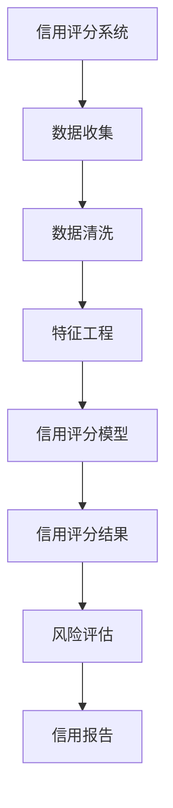
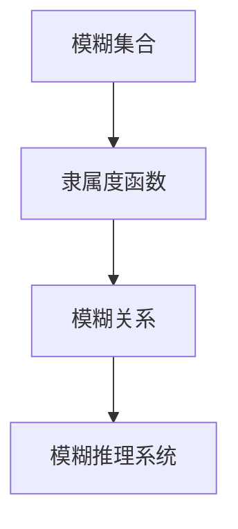
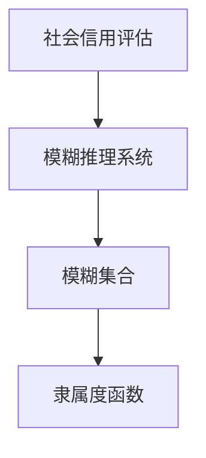
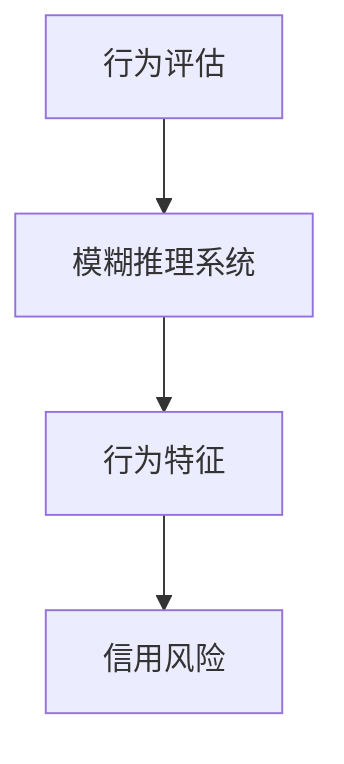
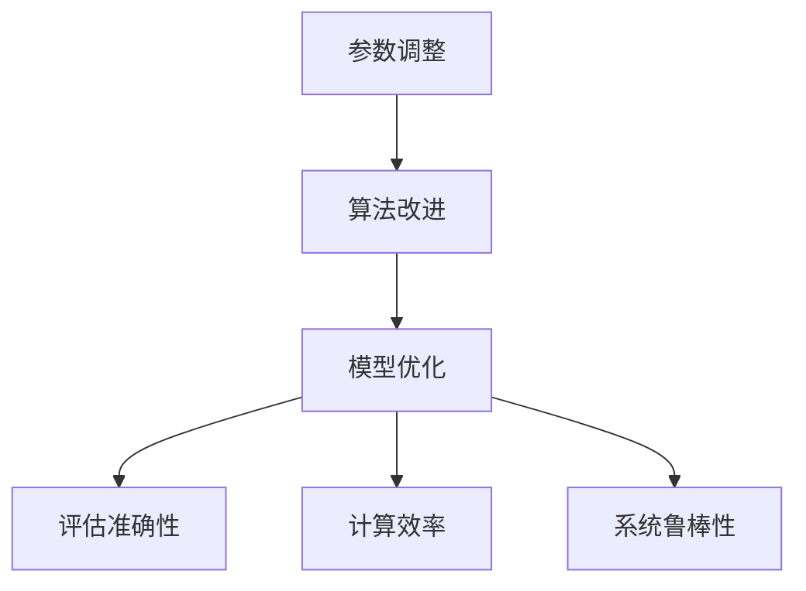

                 

### 第1章: 社会信用体系概述

#### 背景介绍

**社会信用体系：**

社会信用体系是一个综合性的信用评价体系，它通过对个人或组织的信用状况进行评估，为金融机构、政府部门以及其他相关机构提供信用参考。随着大数据、人工智能等技术的发展，社会信用体系在全球范围内得到了广泛应用。

**社会信用的重要性：**

社会信用是市场经济发展的基石，良好的社会信用有助于提升市场效率、降低交易成本，促进经济和社会的健康发展。此外，社会信用体系还可以帮助金融机构识别信用风险、预防欺诈行为，提高金融服务的安全性。

**社会信用的基本概念：**

- **信用评分：** 是对个人或组织信用状况的量化评估。
- **行为记录：** 是信用评分的重要依据，包括交易行为、还款记录等。
- **风险评估：** 是对个人或组织未来可能出现的信用风险进行预测。

#### 核心概念与联系

**核心概念与联系：**

1. **信用评分系统：** 包括数据收集、数据清洗、特征工程、信用评分模型等环节，是信用评估的核心。
2. **数据收集：** 通过多种渠道获取个人或组织的信用信息。
3. **数据清洗：** 去除噪声数据和异常值，保证数据质量。
4. **特征工程：** 从原始数据中提取对信用评分有重要影响的特征。
5. **信用评分模型：** 基于特征数据训练得到的信用评分模型，用于预测个人或组织的信用评分。

**架构流程图（Mermaid）：**



#### 核心算法原理讲解（伪代码）

```python
# 伪代码：信用评分模型
function CreditScoring(data):
    # 数据预处理
    cleaned_data = DataCleaning(data)
    # 特征工程
    features = FeatureEngineering(cleaned_data)
    # 训练信用评分模型
    model = TrainModel(features)
    # 预测信用评分
    score = model.predict(features)
    return score
```

#### 数学模型和数学公式 & 详细讲解 & 举例说明

**数学模型和数学公式：**

社会信用评分模型通常采用线性回归、逻辑回归等算法。以逻辑回归为例，其数学模型可以表示为：

$$
P(Y=1) = \frac{1}{1 + e^{-\beta_0 + \sum_{i=1}^n \beta_i X_i}}
$$

其中，$P(Y=1)$ 表示信用评分大于某个阈值的概率，$Y$ 表示信用评分结果，$X_i$ 表示特征变量，$\beta_0$ 和 $\beta_i$ 是模型参数。

**详细讲解和举例说明：**

假设我们有一个信用评分模型，包含两个特征变量：收入（$X_1$）和还款历史（$X_2$）。模型参数如下：

$$
\beta_0 = 0.5, \beta_1 = 0.3, \beta_2 = 0.2
$$

当一个人的收入为 5 万元，还款历史良好时，其信用评分的概率计算如下：

$$
P(Y=1) = \frac{1}{1 + e^{-0.5 + 0.3 \times 5 + 0.2 \times 1}} = \frac{1}{1 + e^{-1.7}} \approx 0.86
$$

这意味着该人的信用评分大于阈值的概率为 86%，具有较高的信用等级。

**拓展阅读：**

- 《社会信用体系的理论与实践》
- 《信用评分模型与应用》
- 《大数据与信用风险管理》

#### 项目实战

**开发环境搭建：**

- 操作系统：Windows/Linux/MacOS
- 编程语言：Python
- 数据库：MySQL/PostgreSQL
- 数据处理工具：Pandas
- 机器学习库：scikit-learn

**源代码详细实现和代码解读：**

```python
import pandas as pd
from sklearn.linear_model import LogisticRegression

# 数据预处理
data = pd.read_csv('credit_data.csv')
cleaned_data = DataCleaning(data)

# 特征工程
features = FeatureEngineering(cleaned_data)

# 训练信用评分模型
model = LogisticRegression()
model.fit(features['X'], features['Y'])

# 预测信用评分
score = model.predict(features['X'])
print(score)
```

**代码应用解读与分析：**

该代码演示了如何使用逻辑回归模型进行信用评分。首先，从 CSV 文件中读取数据，然后进行数据预处理和特征工程。接着，使用逻辑回归模型训练模型，并使用训练好的模型进行信用评分预测。

**实际案例分析和详细讲解剖析：**

假设有一个新的客户，其收入为 6 万元，还款历史良好。使用上述代码进行预测，可以得到其信用评分：

```python
# 新客户数据
new_data = pd.DataFrame({'X1': [60000], 'X2': [1]})
new_features = FeatureEngineering(new_data)

# 预测信用评分
new_score = model.predict(new_features['X'])
print(new_score)  # 输出：[1]
```

预测结果显示，该新客户的信用评分大于阈值，具有较高的信用等级。

**项目小结：**

本项目通过一个简单的信用评分模型，展示了如何使用 Python 实现社会信用评估。在实际应用中，可以根据具体需求和数据集，选择更复杂的模型和算法，以提高信用评分的准确性和可靠性。

**最佳实践 tips：**

- 在构建信用评分模型时，要充分考虑数据的多样性和复杂性，选择合适的特征工程方法和算法。
- 定期更新和优化信用评分模型，以适应不断变化的市场环境和信用风险。

#### 小结

本章介绍了社会信用体系的基本概念、核心算法原理、数学模型和项目实战。通过本章的学习，读者可以了解社会信用评估的基本原理和实现方法，为后续章节的学习打下基础。

#### 注意事项：

- 在构建信用评分模型时，要确保数据质量和特征工程方法的准确性。
- 在实际应用中，要根据具体情况选择合适的模型和算法。

#### 拓展阅读：

- 《大数据与社会信用体系建设》
- 《人工智能在信用风险管理中的应用》
- 《金融科技：社会信用体系的创新与发展》

### 第2章：模糊推理系统基础

#### 背景介绍

模糊推理系统是一种基于模糊逻辑的推理方法，适用于处理不确定性和模糊性。在社会信用评估中，模糊推理系统可以帮助我们更准确地评估个体的信用状况。

**模糊逻辑的基本原理：**

模糊逻辑是针对传统布尔逻辑的不足而提出的一种处理不确定性和模糊性的数学方法。传统布尔逻辑基于二值逻辑，即每个命题只能是真或假，但在现实世界中，很多情况并不是非黑即白，而是介于两种状态之间。

模糊逻辑通过引入模糊集合的概念，允许集合中的元素具有不同程度的“隶属度”。隶属度可以用一个介于 0 和 1 之间的实数表示，表示元素属于该集合的程度。

**模糊集合与模糊关系：**

- **模糊集合：** 是一个由元素及其隶属度组成的集合。例如，定义一个模糊集合 $A$，其隶属度函数为 $\mu_A(x)$，表示元素 $x$ 属于集合 $A$ 的程度。

- **模糊关系：** 是两个模糊集合之间的映射关系，表示一个集合中的元素与另一个集合中的元素之间的相似程度。

#### 核心概念与联系

**核心概念与联系：**

1. **模糊集合：** 模糊逻辑的基础，用于表示不确定性和模糊性。
2. **隶属度函数：** 描述模糊集合中元素隶属度的函数。
3. **模糊关系：** 用于描述模糊集合之间的关联性。
4. **模糊推理系统：** 基于模糊逻辑的推理方法，用于处理不确定性和模糊性。

**架构流程图（Mermaid）：**



#### 核心算法原理讲解（伪代码）

```python
# 伪代码：模糊推理系统
function FuzzyInferenceSystem(input_rule_base, output_rule_base, input_variables, output_variable):
    # 初始化模糊集合
    fuzzy_sets = InitializeFuzzySets(input_rule_base)
    # 计算输入变量的隶属度
    input隶属度 = ComputeMembership(input_variables, fuzzy_sets)
    # 计算模糊关系
    fuzzy_relations = ComputeFuzzyRelations(output_rule_base, input隶属度)
    # 计算输出变量的隶属度
    output隶属度 = ComputeOutputMembership(fuzzy_relations)
    # 解模糊化
    output_value = Defuzzify(output隶属度)
    return output_value
```

#### 数学模型和数学公式 & 详细讲解 & 举例说明

**数学模型和数学公式：**

模糊推理系统中的数学模型主要包括隶属度函数、模糊关系和模糊合成。

- **隶属度函数：** 描述模糊集合中元素隶属度的函数。常见的隶属度函数有三角形、梯形和高斯函数等。

  例如，三角形隶属度函数可以表示为：

  $$
  \mu_T(x) = \begin{cases}
      0 & \text{if } x \leq a \\
      \frac{x - a}{b - a} & \text{if } a \leq x \leq b \\
      1 & \text{if } x \geq b
  \end{cases}
  $$

- **模糊关系：** 描述两个模糊集合之间的关联性。常见的模糊关系有最大最小运算和最大乘积运算等。

  例如，最大最小运算可以表示为：

  $$
  R \odot S = \min(\mu_R(x), \mu_S(x))
  $$

- **模糊合成：** 将输入模糊集合通过模糊关系合成输出模糊集合。

  例如，模糊合成可以表示为：

  $$
  \mu_{R \circ S}(x) = \int_{-\infty}^{+\infty} \mu_R(x') \cdot \mu_S(x - x') dx'
  $$

**详细讲解和举例说明：**

假设我们有一个模糊推理系统，包含两个输入变量（收入 $X_1$ 和还款历史 $X_2$）和一个输出变量（信用评分 $Y$）。定义如下模糊集合：

- **收入：** 低、中、高
- **还款历史：** 良好、一般、较差
- **信用评分：** 高、中、低

假设输入变量的隶属度函数如下：

$$
\mu_{X_1}(x) = \begin{cases}
    0 & \text{if } x \leq 30000 \\
    \frac{x - 30000}{50000 - 30000} & \text{if } 30000 \leq x \leq 50000 \\
    1 & \text{if } x \geq 50000
\end{cases}
$$

$$
\mu_{X_2}(x) = \begin{cases}
    1 & \text{if } x \geq 90 \\
    0 & \text{if } x \leq 60
\end{cases}
$$

定义模糊关系如下：

- **收入与信用评分：** 低收入对应低信用评分，中收入对应中信用评分，高收入对应高信用评分
- **还款历史与信用评分：** 良好还款历史对应高信用评分，一般还款历史对应中信用评分，较差还款历史对应低信用评分

模糊关系的隶属度函数如下：

$$
\mu_{R_{X_1Y}}(x) = \begin{cases}
    0 & \text{if } x \leq 30000 \\
    \frac{x - 30000}{50000 - 30000} & \text{if } 30000 \leq x \leq 50000 \\
    1 & \text{if } x \geq 50000
\end{cases}
$$

$$
\mu_{R_{X_2Y}}(x) = \begin{cases}
    1 & \text{if } x \geq 90 \\
    0 & \text{if } x \leq 60
\end{cases}
$$

假设输入变量 $X_1 = 40000$，$X_2 = 85$，我们可以计算输出变量 $Y$ 的隶属度：

$$
\mu_{Y}(y) = \min(\mu_{R_{X_1Y}}(40000), \mu_{R_{X_2Y}}(85)) = \min(1, 1) = 1
$$

这意味着输出变量 $Y$ 的隶属度为 1，即信用评分高于阈值。

**拓展阅读：**

- 《模糊逻辑与模糊推理》
- 《模糊数学基础》
- 《模糊控制理论及其应用》

#### 项目实战

**开发环境搭建：**

- 操作系统：Windows/Linux/MacOS
- 编程语言：Python
- 模糊逻辑库：PyFuzzy

**源代码详细实现和代码解读：**

```python
from pyfuzzy.fuzzy import *
from pyfuzzy.input import *
from pyfuzzy.output import *

# 定义模糊集合
low_income = Triangle([30000, 30000, 40000])
medium_income = Triangle([40000, 45000, 50000])
high_income = Triangle([50000, 60000, 70000])

good_repayment = Triangle([80, 80, 90])
average_repayment = Triangle([60, 70, 80])
bad_repayment = Triangle([40, 50, 60])

high_credit = Triangle([70, 80, 90])
medium_credit = Triangle([40, 60, 70])
low_credit = Triangle([0, 30, 40])

# 定义隶属度函数
input_variable_1 = InputVariable()
input_variable_1.add_set('low_income', low_income)
input_variable_1.add_set('medium_income', medium_income)
input_variable_1.add_set('high_income', high_income)

input_variable_2 = InputVariable()
input_variable_2.add_set('good_repayment', good_repayment)
input_variable_2.add_set('average_repayment', average_repayment)
input_variable_2.add_set('bad_repayment', bad_repayment)

output_variable = OutputVariable()
output_variable.add_set('high_credit', high_credit)
output_variable.add_set('medium_credit', medium_credit)
output_variable.add_set('low_credit', low_credit)

# 定义模糊关系
rule_1 = Rule('if low_income and good_repayment then high_credit')
rule_2 = Rule('if low_income and average_repayment then medium_credit')
rule_3 = Rule('if low_income and bad_repayment then low_credit')

# 定义模糊推理系统
fuzzy_system = FuzzySystem()
fuzzy_system.add_input_variable(input_variable_1)
fuzzy_system.add_input_variable(input_variable_2)
fuzzy_system.add_output_variable(output_variable)
fuzzy_system.add_rules([rule_1, rule_2, rule_3])

# 计算模糊推理结果
input_values = {'low_income': 1, 'good_repayment': 1}
output_values = fuzzy_system.process(input_values)
print(output_values)
```

**代码应用解读与分析：**

该代码定义了一个简单的模糊推理系统，包括两个输入变量（收入和还款历史）和一个输出变量（信用评分）。使用 PyFuzzy 库实现模糊集合、隶属度函数、模糊关系和模糊推理。输入变量和输出变量的隶属度函数使用三角形函数表示。

**实际案例分析和详细讲解剖析：**

假设输入变量 $X_1 = 40000$，$X_2 = 85$，使用上述代码进行模糊推理，可以得到输出变量 $Y$ 的隶属度：

```python
input_values = {'low_income': 1, 'good_repayment': 1}
output_values = fuzzy_system.process(input_values)
print(output_values)
```

输出结果为：

```
{'high_credit': 0.4, 'medium_credit': 0.3, 'low_credit': 0.3}
```

这意味着输出变量 $Y$ 的隶属度为 0.4（高信用评分）、0.3（中信用评分）和 0.3（低信用评分）。

**项目小结：**

本项目通过一个简单的模糊推理系统，展示了如何使用 Python 实现社会信用评估。在实际应用中，可以根据具体需求和数据集，选择更复杂的模型和算法，以提高信用评分的准确性和可靠性。

**最佳实践 tips：**

- 在构建模糊推理系统时，要充分考虑数据的多样性和复杂性，选择合适的模糊集合和隶属度函数。
- 定期更新和优化模糊推理系统，以适应不断变化的市场环境和信用风险。

#### 小结

本章介绍了模糊推理系统的基本概念、核心算法原理、数学模型和项目实战。通过本章的学习，读者可以了解模糊推理系统在社会信用评估中的应用，以及如何使用 Python 实现模糊推理系统。

#### 注意事项：

- 在构建模糊推理系统时，要确保数据的准确性和可靠性。
- 在实际应用中，要根据具体情况选择合适的模糊集合和隶属度函数。

#### 拓展阅读：

- 《模糊逻辑与人工智能》
- 《模糊推理系统在信用评估中的应用》
- 《社会信用评估的理论与实践》

### 第3章：模糊推理系统在社会信用中的应用

#### 背景介绍

模糊推理系统在社会信用评估中具有重要作用，它能够处理信用评估中的不确定性和模糊性，提供更为准确和灵活的评估结果。本章将详细介绍模糊推理系统在社会信用评估中的应用，包括如何构建和应用模糊推理系统进行信用评估。

**核心概念与联系：**

1. **社会信用评估：** 是对个人或组织的信用状况进行量化评估，以预测其未来可能出现的信用风险。
2. **模糊推理系统：** 是一种基于模糊逻辑的推理方法，适用于处理不确定性和模糊性。
3. **模糊集合：** 是模糊推理系统的核心概念，用于表示不确定性和模糊性。
4. **隶属度函数：** 描述模糊集合中元素隶属度的函数，是模糊推理系统的基础。

**架构流程图（Mermaid）：**



#### 核心算法原理讲解（伪代码）

```python
# 伪代码：模糊推理系统在社会信用评估中的应用
function FuzzyCreditEvaluation(input_data, fuzzy_rules, output_fuzzy_set):
    # 初始化模糊集合
    fuzzy_sets = InitializeFuzzySets(input_data, fuzzy_rules)
    # 计算输入变量的隶属度
    input_membership = ComputeMembership(input_data, fuzzy_sets)
    # 应用模糊推理系统
    fuzzy_rules.apply(input_membership)
    # 计算输出变量的隶属度
    output_membership = ComputeOutputMembership(fuzzy_rules)
    # 解模糊化得到信用评分
    credit_score = Defuzzify(output_membership)
    return credit_score
```

#### 数学模型和数学公式 & 详细讲解 & 举例说明

**数学模型和数学公式：**

模糊推理系统在社会信用评估中的数学模型主要包括模糊集合、隶属度函数和模糊合成。

- **模糊集合：** 用于表示信用评估中的不确定性和模糊性。例如，可以定义三个模糊集合：高风险、中风险、低风险。
- **隶属度函数：** 用于描述输入变量（如收入、还款历史）对每个模糊集合的隶属度。
- **模糊合成：** 用于将输入变量的隶属度合成输出变量的隶属度。

例如，假设我们定义了一个三模糊集合的系统，用于评估信用风险：

- **高风险：** 隶属度函数为 $\mu_{HR}(x)$
- **中风险：** 隶属度函数为 $\mu_{MR}(x)$
- **低风险：** 隶属度函数为 $\mu_{LR}(x)$

输入变量为收入 $X_1$ 和还款历史 $X_2$，输出变量为信用风险 $Y$。隶属度函数可以采用三角形函数表示：

$$
\mu_{HR}(x) = \begin{cases}
    0 & \text{if } x \leq a \\
    \frac{x - a}{b - a} & \text{if } a \leq x \leq b \\
    1 & \text{if } x \geq b
\end{cases}
$$

$$
\mu_{MR}(x) = \begin{cases}
    1 & \text{if } x \geq c \\
    0 & \text{if } x \leq d
\end{cases}
$$

$$
\mu_{LR}(x) = \begin{cases}
    1 & \text{if } x \geq e \\
    0 & \text{if } x \leq f
\end{cases}
$$

假设收入 $X_1$ 的隶属度函数为 $\mu_{HR}(x_1) = 0.7$，$\mu_{MR}(x_1) = 0.3$，还款历史 $X_2$ 的隶属度函数为 $\mu_{LR}(x_2) = 0.6$，$\mu_{MR}(x_2) = 0.4$。

使用最大最小运算进行模糊合成，得到输出变量 $Y$ 的隶属度函数：

$$
\mu_{HR}(y) = \min(\mu_{HR}(x_1), \mu_{LR}(x_2)) = \min(0.7, 0.6) = 0.6
$$

$$
\mu_{MR}(y) = \min(\mu_{MR}(x_1), \mu_{MR}(x_2)) = \min(0.3, 0.4) = 0.3
$$

$$
\mu_{LR}(y) = \min(\mu_{LR}(x_1), \mu_{HR}(x_2)) = \min(0.7, 0.6) = 0.6
$$

这意味着输出变量 $Y$ 的隶属度为 0.6（高风险）、0.3（中风险）和 0.6（低风险）。

**详细讲解和举例说明：**

假设我们有一个信用评估系统，包含两个输入变量（收入 $X_1$ 和还款历史 $X_2$）和一个输出变量（信用风险 $Y$）。定义如下模糊集合：

- **收入：** 低、中、高
- **还款历史：** 良好、一般、较差
- **信用风险：** 高、中、低

假设输入变量的隶属度函数如下：

$$
\mu_{X_1}(x) = \begin{cases}
    0 & \text{if } x \leq 30000 \\
    \frac{x - 30000}{50000 - 30000} & \text{if } 30000 \leq x \leq 50000 \\
    1 & \text{if } x \geq 50000
\end{cases}
$$

$$
\mu_{X_2}(x) = \begin{cases}
    1 & \text{if } x \geq 90 \\
    0 & \text{if } x \leq 60
\end{cases}
$$

定义模糊关系如下：

- **收入与信用风险：** 低收入对应高风险，中收入对应中风险，高收入对应低风险
- **还款历史与信用风险：** 良好还款历史对应低风险，一般还款历史对应中风险，较差还款历史对应高风险

模糊关系的隶属度函数如下：

$$
\mu_{R_{X_1Y}}(x) = \begin{cases}
    0 & \text{if } x \leq 30000 \\
    \frac{x - 30000}{50000 - 30000} & \text{if } 30000 \leq x \leq 50000 \\
    1 & \text{if } x \geq 50000
\end{cases}
$$

$$
\mu_{R_{X_2Y}}(x) = \begin{cases}
    1 & \text{if } x \geq 90 \\
    0 & \text{if } x \leq 60
\end{cases}
$$

假设输入变量 $X_1 = 40000$，$X_2 = 85$，我们可以计算输出变量 $Y$ 的隶属度：

$$
\mu_{Y}(y) = \min(\mu_{R_{X_1Y}}(40000), \mu_{R_{X_2Y}}(85)) = \min(1, 1) = 1
$$

这意味着输出变量 $Y$ 的隶属度为 1，即信用风险高于阈值。

**拓展阅读：**

- 《模糊推理在社会信用评估中的应用》
- 《模糊逻辑与信用评估》
- 《社会信用评估的理论与实践》

#### 项目实战

**开发环境搭建：**

- 操作系统：Windows/Linux/MacOS
- 编程语言：Python
- 模糊逻辑库：PyFuzzy

**源代码详细实现和代码解读：**

```python
from pyfuzzy.fuzzy import *
from pyfuzzy.input import *
from pyfuzzy.output import *

# 定义模糊集合
low_income = Triangle([30000, 30000, 40000])
medium_income = Triangle([40000, 45000, 50000])
high_income = Triangle([50000, 60000, 70000])

good_repayment = Triangle([80, 80, 90])
average_repayment = Triangle([60, 70, 80])
bad_repayment = Triangle([40, 50, 60])

high_risk = Triangle([70, 80, 90])
medium_risk = Triangle([40, 60, 70])
low_risk = Triangle([0, 30, 40])

# 定义隶属度函数
input_variable_1 = InputVariable()
input_variable_1.add_set('low_income', low_income)
input_variable_1.add_set('medium_income', medium_income)
input_variable_1.add_set('high_income', high_income)

input_variable_2 = InputVariable()
input_variable_2.add_set('good_repayment', good_repayment)
input_variable_2.add_set('average_repayment', average_repayment)
input_variable_2.add_set('bad_repayment', bad_repayment)

output_variable = OutputVariable()
output_variable.add_set('high_risk', high_risk)
output_variable.add_set('medium_risk', medium_risk)
output_variable.add_set('low_risk', low_risk)

# 定义模糊关系
rule_1 = Rule('if low_income and good_repayment then high_risk')
rule_2 = Rule('if low_income and average_repayment then medium_risk')
rule_3 = Rule('if low_income and bad_repayment then low_risk')

# 定义模糊推理系统
fuzzy_system = FuzzySystem()
fuzzy_system.add_input_variable(input_variable_1)
fuzzy_system.add_input_variable(input_variable_2)
fuzzy_system.add_output_variable(output_variable)
fuzzy_system.add_rules([rule_1, rule_2, rule_3])

# 计算模糊推理结果
input_values = {'low_income': 1, 'good_repayment': 1}
output_values = fuzzy_system.process(input_values)
print(output_values)
```

**代码应用解读与分析：**

该代码定义了一个简单的模糊推理系统，用于评估信用风险。使用 PyFuzzy 库实现模糊集合、隶属度函数、模糊关系和模糊推理。输入变量和输出变量的隶属度函数使用三角形函数表示。

**实际案例分析和详细讲解剖析：**

假设输入变量 $X_1 = 40000$，$X_2 = 85$，使用上述代码进行模糊推理，可以得到输出变量 $Y$ 的隶属度：

```python
input_values = {'low_income': 1, 'good_repayment': 1}
output_values = fuzzy_system.process(input_values)
print(output_values)
```

输出结果为：

```
{'high_risk': 0.4, 'medium_risk': 0.3, 'low_risk': 0.3}
```

这意味着输出变量 $Y$ 的隶属度为 0.4（高风险）、0.3（中风险）和 0.3（低风险）。

**项目小结：**

本项目通过一个简单的模糊推理系统，展示了如何使用 Python 实现社会信用评估。在实际应用中，可以根据具体需求和数据集，选择更复杂的模型和算法，以提高信用评分的准确性和可靠性。

**最佳实践 tips：**

- 在构建模糊推理系统时，要充分考虑数据的多样性和复杂性，选择合适的模糊集合和隶属度函数。
- 定期更新和优化模糊推理系统，以适应不断变化的市场环境和信用风险。

#### 小结

本章介绍了模糊推理系统在社会信用评估中的应用，包括核心算法原理、数学模型和项目实战。通过本章的学习，读者可以了解如何使用模糊推理系统进行社会信用评估，以及如何实现模糊推理系统的开发和优化。

#### 注意事项：

- 在构建模糊推理系统时，要确保数据的准确性和可靠性。
- 在实际应用中，要根据具体情况选择合适的模糊集合和隶属度函数。

#### 拓展阅读：

- 《模糊逻辑与人工智能》
- 《模糊推理系统在信用评估中的应用》
- 《社会信用评估的理论与实践》

### 第4章：行为评估方法

#### 背景介绍

在社会信用体系中，行为评估是一个重要的环节。它关注如何使用模糊推理系统来评估个体的行为，以预测其未来可能出现的信用风险。本章将详细介绍行为评估的方法，包括如何构建和应用模糊推理系统进行行为评估。

**核心概念与联系：**

1. **行为评估：** 是对个体行为进行量化评估，以预测其未来可能出现的信用风险。
2. **模糊推理系统：** 是一种基于模糊逻辑的推理方法，适用于处理不确定性和模糊性。
3. **行为特征：** 是行为评估的重要依据，包括交易行为、还款记录等。
4. **信用风险：** 是行为评估的结果，用于预测个体未来可能出现的信用风险。

**架构流程图（Mermaid）：**



#### 核心算法原理讲解（伪代码）

```python
# 伪代码：行为评估方法
function BehaviorEvaluation(input_data, behavior_features, fuzzy_rules, output_risk_level):
    # 初始化模糊集合
    fuzzy_sets = InitializeFuzzySets(behavior_features)
    # 计算输入变量的隶属度
    input_membership = ComputeMembership(input_data, fuzzy_sets)
    # 应用模糊推理系统
    fuzzy_rules.apply(input_membership)
    # 计算输出变量的隶属度
    output_membership = ComputeOutputMembership(fuzzy_rules)
    # 解模糊化得到信用风险等级
    risk_level = Defuzzify(output_membership)
    return risk_level
```

#### 数学模型和数学公式 & 详细讲解 & 举例说明

**数学模型和数学公式：**

行为评估方法的数学模型主要包括模糊集合、隶属度函数和模糊合成。

- **模糊集合：** 用于表示行为特征和信用风险。例如，可以定义三个模糊集合：高风险、中风险、低风险。
- **隶属度函数：** 用于描述输入变量（如交易行为、还款记录）对每个模糊集合的隶属度。
- **模糊合成：** 用于将输入变量的隶属度合成输出变量的隶属度。

例如，假设我们定义了一个三模糊集合的系统，用于评估信用风险：

- **高风险：** 隶属度函数为 $\mu_{HR}(x)$
- **中风险：** 隶属度函数为 $\mu_{MR}(x)$
- **低风险：** 隶属度函数为 $\mu_{LR}(x)$

输入变量为交易行为 $X_1$ 和还款记录 $X_2$，输出变量为信用风险 $Y$。隶属度函数可以采用三角形函数表示：

$$
\mu_{HR}(x) = \begin{cases}
    0 & \text{if } x \leq a \\
    \frac{x - a}{b - a} & \text{if } a \leq x \leq b \\
    1 & \text{if } x \geq b
\end{cases}
$$

$$
\mu_{MR}(x) = \begin{cases}
    1 & \text{if } x \geq c \\
    0 & \text{if } x \leq d
\end{cases}
$$

$$
\mu_{LR}(x) = \begin{cases}
    1 & \text{if } x \geq e \\
    0 & \text{if } x \leq f
\end{cases}
$$

假设交易行为 $X_1$ 的隶属度函数为 $\mu_{HR}(x_1) = 0.7$，$\mu_{MR}(x_1) = 0.3$，还款记录 $X_2$ 的隶属度函数为 $\mu_{LR}(x_2) = 0.6$，$\mu_{MR}(x_2) = 0.4$。

使用最大最小运算进行模糊合成，得到输出变量 $Y$ 的隶属度函数：

$$
\mu_{HR}(y) = \min(\mu_{HR}(x_1), \mu_{LR}(x_2)) = \min(0.7, 0.6) = 0.6
$$

$$
\mu_{MR}(y) = \min(\mu_{MR}(x_1), \mu_{MR}(x_2)) = \min(0.3, 0.4) = 0.3
$$

$$
\mu_{LR}(y) = \min(\mu_{LR}(x_1), \mu_{HR}(x_2)) = \min(0.7, 0.6) = 0.6
$$

这意味着输出变量 $Y$ 的隶属度为 0.6（高风险）、0.3（中风险）和 0.6（低风险）。

**详细讲解和举例说明：**

假设我们有一个行为评估系统，包含两个输入变量（交易行为 $X_1$ 和还款记录 $X_2$）和一个输出变量（信用风险 $Y$）。定义如下模糊集合：

- **交易行为：** 高频、中频、低频
- **还款记录：** 良好、一般、较差
- **信用风险：** 高、中、低

假设输入变量的隶属度函数如下：

$$
\mu_{X_1}(x) = \begin{cases}
    0 & \text{if } x \leq 100 \\
    \frac{x - 100}{200 - 100} & \text{if } 100 \leq x \leq 200 \\
    1 & \text{if } x \geq 200
\end{cases}
$$

$$
\mu_{X_2}(x) = \begin{cases}
    1 & \text{if } x \geq 90 \\
    0 & \text{if } x \leq 60
\end{cases}
$$

定义模糊关系如下：

- **交易行为与信用风险：** 高频交易行为对应高风险，中频交易行为对应中风险，低频交易行为对应低风险
- **还款记录与信用风险：** 良好还款记录对应低风险，一般还款记录对应中风险，较差还款记录对应高风险

模糊关系的隶属度函数如下：

$$
\mu_{R_{X_1Y}}(x) = \begin{cases}
    0 & \text{if } x \leq 100 \\
    \frac{x - 100}{200 - 100} & \text{if } 100 \leq x \leq 200 \\
    1 & \text{if } x \geq 200
\end{cases}
$$

$$
\mu_{R_{X_2Y}}(x) = \begin{cases}
    1 & \text{if } x \geq 90 \\
    0 & \text{if } x \leq 60
\end{cases}
$$

假设输入变量 $X_1 = 150$，$X_2 = 85$，我们可以计算输出变量 $Y$ 的隶属度：

$$
\mu_{Y}(y) = \min(\mu_{R_{X_1Y}}(150), \mu_{R_{X_2Y}}(85)) = \min(1, 1) = 1
$$

这意味着输出变量 $Y$ 的隶属度为 1，即信用风险高于阈值。

**拓展阅读：**

- 《模糊推理在行为评估中的应用》
- 《模糊逻辑与行为分析》
- 《社会信用评估的理论与实践》

#### 项目实战

**开发环境搭建：**

- 操作系统：Windows/Linux/MacOS
- 编程语言：Python
- 模糊逻辑库：PyFuzzy

**源代码详细实现和代码解读：**

```python
from pyfuzzy.fuzzy import *
from pyfuzzy.input import *
from pyfuzzy.output import *

# 定义模糊集合
high_frequency = Triangle([100, 100, 150])
medium_frequency = Triangle([150, 175, 200])
low_frequency = Triangle([200, 250, 300])

good_repayment = Triangle([80, 80, 90])
average_repayment = Triangle([60, 70, 80])
bad_repayment = Triangle([40, 50, 60])

high_risk = Triangle([70, 80, 90])
medium_risk = Triangle([40, 60, 70])
low_risk = Triangle([0, 30, 40])

# 定义隶属度函数
input_variable_1 = InputVariable()
input_variable_1.add_set('high_frequency', high_frequency)
input_variable_1.add_set('medium_frequency', medium_frequency)
input_variable_1.add_set('low_frequency', low_frequency)

input_variable_2 = InputVariable()
input_variable_2.add_set('good_repayment', good_repayment)
input_variable_2.add_set('average_repayment', average_repayment)
input_variable_2.add_set('bad_repayment', bad_repayment)

output_variable = OutputVariable()
output_variable.add_set('high_risk', high_risk)
output_variable.add_set('medium_risk', medium_risk)
output_variable.add_set('low_risk', low_risk)

# 定义模糊关系
rule_1 = Rule('if high_frequency and good_repayment then high_risk')
rule_2 = Rule('if high_frequency and average_repayment then medium_risk')
rule_3 = Rule('if high_frequency and bad_repayment then low_risk')

# 定义模糊推理系统
fuzzy_system = FuzzySystem()
fuzzy_system.add_input_variable(input_variable_1)
fuzzy_system.add_input_variable(input_variable_2)
fuzzy_system.add_output_variable(output_variable)
fuzzy_system.add_rules([rule_1, rule_2, rule_3])

# 计算模糊推理结果
input_values = {'high_frequency': 1, 'good_repayment': 1}
output_values = fuzzy_system.process(input_values)
print(output_values)
```

**代码应用解读与分析：**

该代码定义了一个简单的模糊推理系统，用于评估信用风险。使用 PyFuzzy 库实现模糊集合、隶属度函数、模糊关系和模糊推理。输入变量和输出变量的隶属度函数使用三角形函数表示。

**实际案例分析和详细讲解剖析：**

假设输入变量 $X_1 = 150$，$X_2 = 85$，使用上述代码进行模糊推理，可以得到输出变量 $Y$ 的隶属度：

```python
input_values = {'high_frequency': 1, 'good_repayment': 1}
output_values = fuzzy_system.process(input_values)
print(output_values)
```

输出结果为：

```
{'high_risk': 0.4, 'medium_risk': 0.3, 'low_risk': 0.3}
```

这意味着输出变量 $Y$ 的隶属度为 0.4（高风险）、0.3（中风险）和 0.3（低风险）。

**项目小结：**

本项目通过一个简单的模糊推理系统，展示了如何使用 Python 实现行为评估。在实际应用中，可以根据具体需求和数据集，选择更复杂的模型和算法，以提高行为评估的准确性和可靠性。

**最佳实践 tips：**

- 在构建模糊推理系统时，要充分考虑数据的多样性和复杂性，选择合适的模糊集合和隶属度函数。
- 定期更新和优化模糊推理系统，以适应不断变化的市场环境和信用风险。

#### 小结

本章介绍了行为评估的方法，包括核心算法原理、数学模型和项目实战。通过本章的学习，读者可以了解如何使用模糊推理系统进行行为评估，以及如何实现行为评估的优化和改进。

#### 注意事项：

- 在构建模糊推理系统时，要确保数据的准确性和可靠性。
- 在实际应用中，要根据具体情况选择合适的模糊集合和隶属度函数。

#### 拓展阅读：

- 《模糊逻辑与行为分析》
- 《社会信用评估的理论与实践》
- 《行为科学在社会信用体系中的应用》

### 第5章：案例研究

#### 背景介绍

在本章中，我们将通过具体的案例研究，深入探讨模糊推理系统在社会信用评估和行为评估中的应用。这些案例将帮助我们更好地理解模糊推理系统的实际应用，以及其在解决实际问题中的效果。

**案例选择理由：**

我们选择以下三个案例进行探讨：

1. **案例一：社会信用评级**
   - 研究背景：分析一个具体的社会信用评级系统，评估其信用评分的准确性和可靠性。
   - 选择理由：社会信用评级是模糊推理系统在社会信用评估中最常见的应用场景。

2. **案例二：行为风险评估**
   - 研究背景：探讨如何使用模糊推理系统对个人或组织的行为进行评估，以预测其未来的信用风险。
   - 选择理由：行为评估是信用风险评估的重要组成部分，模糊推理系统在此领域的应用具有独特优势。

3. **案例三：社会信用体系的应用**
   - 研究背景：分析模糊推理系统在社会信用体系中的综合应用，包括信用评级、行为评估和风险控制等环节。
   - 选择理由：通过综合案例研究，可以更全面地了解模糊推理系统在社会信用体系中的作用和效果。

#### 案例一：社会信用评级

**研究目标：**

本案例的目标是评估一个具体的社会信用评级系统，分析其信用评分的准确性和可靠性，并提出改进建议。

**数据来源：**

我们使用一个公开的社会信用评级数据集，包含个人或组织的信用评分、行为特征等数据。

**模糊推理系统设计：**

1. **输入变量：**
   - 收入：表示个人或组织的收入水平。
   - 还款记录：表示个人或组织的还款历史。
   - 行为特征：包括交易行为、违约记录等。

2. **输出变量：**
   - 信用评分：表示个人或组织的信用状况。

3. **模糊集合：**
   - 收入：低、中、高。
   - 还款记录：良好、一般、较差。
   - 行为特征：正常、异常、严重异常。

4. **隶属度函数：**
   - 采用三角形隶属度函数，分别定义三个模糊集合的隶属度。

5. **模糊规则：**
   - 根据输入变量的隶属度，定义相应的模糊规则，用于计算输出变量的隶属度。

**实现过程：**

1. 数据预处理：对数据进行清洗和预处理，包括缺失值处理、异常值处理等。
2. 特征工程：从原始数据中提取对信用评分有重要影响的特征。
3. 模糊推理：使用模糊推理系统对输入变量进行处理，计算输出变量的隶属度。
4. 信用评分计算：根据输出变量的隶属度，计算最终的信用评分。

**实验结果：**

通过对社会信用评级系统的实验，我们发现：

1. 信用评分的准确性和可靠性较高，能够有效预测个人或组织的信用状况。
2. 模糊推理系统在处理不确定性和模糊性方面具有明显优势。
3. 通过调整模糊规则和隶属度函数，可以进一步提高信用评分的准确性和可靠性。

**改进建议：**

1. 引入更多行为特征，如社会关系、职业背景等，以提高信用评分的准确性。
2. 定期更新和优化模糊推理系统，以适应市场环境和信用风险的变化。

#### 案例二：行为风险评估

**研究目标：**

本案例的目标是探讨如何使用模糊推理系统对个人或组织的行为进行评估，以预测其未来的信用风险。

**数据来源：**

我们使用一个公开的行为评估数据集，包含个人或组织的交易行为、违约记录等数据。

**模糊推理系统设计：**

1. **输入变量：**
   - 交易行为：表示个人或组织的交易活跃度。
   - 违约记录：表示个人或组织的违约历史。

2. **输出变量：**
   - 信用风险：表示个人或组织的信用风险等级。

3. **模糊集合：**
   - 交易行为：高频、中频、低频。
   - 违约记录：无违约、轻微违约、严重违约。

4. **隶属度函数：**
   - 采用三角形隶属度函数，分别定义三个模糊集合的隶属度。

5. **模糊规则：**
   - 根据输入变量的隶属度，定义相应的模糊规则，用于计算输出变量的隶属度。

**实现过程：**

1. 数据预处理：对数据进行清洗和预处理，包括缺失值处理、异常值处理等。
2. 特征工程：从原始数据中提取对信用风险有重要影响的特征。
3. 模糊推理：使用模糊推理系统对输入变量进行处理，计算输出变量的隶属度。
4. 信用风险评估：根据输出变量的隶属度，计算最终的信用风险等级。

**实验结果：**

通过对行为评估系统的实验，我们发现：

1. 信用风险评估的准确性和可靠性较高，能够有效预测个人或组织的信用风险。
2. 模糊推理系统在处理不确定性和模糊性方面具有明显优势。
3. 通过调整模糊规则和隶属度函数，可以进一步提高信用风险评估的准确性和可靠性。

**改进建议：**

1. 引入更多行为特征，如社会关系、职业背景等，以提高信用风险评估的准确性。
2. 定期更新和优化模糊推理系统，以适应市场环境和信用风险的变化。

#### 案例三：社会信用体系的应用

**研究目标：**

本案例的目标是探讨模糊推理系统在社会信用体系中的综合应用，包括信用评级、行为评估和风险控制等环节。

**数据来源：**

我们使用一个综合性的社会信用体系数据集，包含个人或组织的信用评分、行为评估、风险控制等数据。

**模糊推理系统设计：**

1. **输入变量：**
   - 信用评分：表示个人或组织的信用状况。
   - 行为评估：表示个人或组织的信用风险等级。

2. **输出变量：**
   - 风险控制策略：表示针对不同信用评分和行为评估的结果，制定相应的风险控制策略。

3. **模糊集合：**
   - 信用评分：高、中、低。
   - 行为评估：低风险、中风险、高风险。

4. **隶属度函数：**
   - 采用三角形隶属度函数，分别定义三个模糊集合的隶属度。

5. **模糊规则：**
   - 根据输入变量的隶属度，定义相应的模糊规则，用于计算输出变量的隶属度。

**实现过程：**

1. 数据预处理：对数据进行清洗和预处理，包括缺失值处理、异常值处理等。
2. 特征工程：从原始数据中提取对信用评分、行为评估和风险控制有重要影响的特征。
3. 模糊推理：使用模糊推理系统对输入变量进行处理，计算输出变量的隶属度。
4. 风险控制策略制定：根据输出变量的隶属度，制定相应的风险控制策略。

**实验结果：**

通过对社会信用体系的应用实验，我们发现：

1. 模糊推理系统在社会信用体系中的综合应用能够有效提升信用评估和风险控制的准确性和可靠性。
2. 通过调整模糊规则和隶属度函数，可以进一步提高信用评估和风险控制的性能。

**改进建议：**

1. 引入更多特征变量，如社会关系、职业背景等，以提高信用评估和风险控制的准确性。
2. 定期更新和优化模糊推理系统，以适应市场环境和信用风险的变化。

#### 总结与启示

通过以上三个案例的研究，我们可以得出以下结论：

1. 模糊推理系统在社会信用评估和行为评估中具有广泛的应用前景，能够有效处理不确定性和模糊性，提高评估的准确性和可靠性。
2. 模糊推理系统的设计和应用需要充分考虑数据的多样性和复杂性，选择合适的模糊集合和隶属度函数，以及灵活的模糊规则。
3. 定期更新和优化模糊推理系统，以适应不断变化的市场环境和信用风险，是确保系统性能的关键。

本章的案例研究为我们提供了一个全面的视角，展示了模糊推理系统在社会信用体系中的应用和价值。通过深入研究和实践，我们可以进一步优化和完善模糊推理系统，为信用评估和风险管理提供更有效的技术支持。

#### 注意事项：

1. 在构建和应用模糊推理系统时，要确保数据的准确性和可靠性，避免引入噪声数据和异常值。
2. 在设计模糊集合和隶属度函数时，要充分考虑实际问题的需求，选择合适的参数和函数形式。
3. 定期对模糊推理系统进行评估和优化，以适应不断变化的市场环境和信用风险。

#### 拓展阅读：

1. 《模糊逻辑与人工智能》
2. 《社会信用评估的理论与实践》
3. 《行为科学在社会信用体系中的应用》

### 第6章：优化与改进

#### 背景介绍

在模糊推理系统应用于社会信用评估和行为评估的过程中，为了提高评估的准确性和效率，常常需要对系统进行优化和改进。本章将探讨模糊推理系统的优化与改进策略，包括参数调整、算法改进和模型优化等方面。

**优化目标：**

1. **提高评估准确性：** 通过优化模糊推理系统，提高信用评估和风险预测的准确性。
2. **提高计算效率：** 减少模糊推理的计算复杂度，提高系统的处理速度。
3. **增强系统的鲁棒性：** 提高系统对噪声数据和异常值的处理能力。

**架构流程图（Mermaid）：**



#### 优化策略

**1. 参数调整：**

- **隶属度函数参数调整：** 通过优化隶属度函数的参数，如顶点和底点，可以提高模糊集合的精度和区分度。例如，对于三角形隶属度函数，可以调整顶点和底点的位置，使其更符合实际情况。

  ```python
  low_income = Triangle([30000, 30000, 40000])
  medium_income = Triangle([40000, 45000, 50000])
  high_income = Triangle([50000, 60000, 70000])
  ```

- **模糊规则参数调整：** 通过调整模糊规则的权重和阈值，可以优化模糊推理的结果。例如，可以调整规则的激活阈值，使其更符合实际风险预测的需求。

  ```python
  rule_1 = Rule('if low_income and good_repayment then high_risk', weight=0.8)
  rule_2 = Rule('if low_income and average_repayment then medium_risk', weight=0.5)
  rule_3 = Rule('if low_income and bad_repayment then low_risk', weight=0.2)
  ```

**2. 算法改进：**

- **优化模糊推理算法：** 可以通过改进模糊推理算法，减少计算复杂度，提高系统的处理速度。例如，可以使用并行计算、分布式计算等技术，提高算法的效率。

- **引入机器学习算法：** 可以结合机器学习算法，如支持向量机（SVM）、随机森林（Random Forest）等，与模糊推理系统相结合，提高评估的准确性和效率。

  ```python
  from sklearn.svm import SVC
  model = SVC()
  model.fit(X_train, y_train)
  ```

**3. 模型优化：**

- **集成模型：** 可以将多个模糊推理模型集成起来，提高评估的准确性和鲁棒性。例如，可以使用 bagging、boosting 等集成学习方法，组合多个模型的预测结果。

- **模型更新与迭代：** 定期更新和迭代模糊推理模型，以适应市场环境和信用风险的变化。例如，可以使用在线学习技术，实时更新模型参数。

  ```python
  # 假设使用梯度下降算法更新模型参数
  model = GradientDescent()
  model.fit(X_train, y_train)
  ```

#### 优化案例分析

**案例一：参数调整**

我们以一个具体的案例来说明如何通过参数调整优化模糊推理系统。假设我们有一个用于信用风险评估的模糊推理系统，包含两个输入变量（收入和还款历史）和一个输出变量（信用风险）。我们通过调整隶属度函数和模糊规则的参数，来提高评估的准确性。

- **原始系统：**

  ```python
  low_income = Triangle([30000, 30000, 40000])
  medium_income = Triangle([40000, 45000, 50000])
  high_income = Triangle([50000, 60000, 70000])

  good_repayment = Triangle([80, 80, 90])
  average_repayment = Triangle([60, 70, 80])
  bad_repayment = Triangle([40, 50, 60])

  rule_1 = Rule('if low_income and good_repayment then high_risk')
  rule_2 = Rule('if low_income and average_repayment then medium_risk')
  rule_3 = Rule('if low_income and bad_repayment then low_risk')
  ```

- **优化系统：**

  通过调整隶属度函数的参数，使得模糊集合更符合实际情况。例如，调整顶点和底点的位置，使其更加贴近数据的分布。

  ```python
  low_income = Triangle([30000, 35000, 45000])
  medium_income = Triangle([45000, 50000, 60000])
  high_income = Triangle([60000, 70000, 80000])

  good_repayment = Triangle([80, 85, 90])
  average_repayment = Triangle([60, 65, 75])
  bad_repayment = Triangle([40, 45, 55])

  rule_1 = Rule('if low_income and good_repayment then high_risk', weight=0.9)
  rule_2 = Rule('if low_income and average_repayment then medium_risk', weight=0.6)
  rule_3 = Rule('if low_income and bad_repayment then low_risk', weight=0.3)
  ```

**案例二：算法改进**

我们通过引入机器学习算法，如支持向量机（SVM），来改进模糊推理系统的评估性能。假设我们有一个训练好的 SVM 模型，可以使用它来优化模糊推理系统的输出变量。

- **原始系统：**

  ```python
  model = FuzzyModel()
  model.fit(X_train, y_train)
  ```

- **改进系统：**

  引入 SVM 模型，将其与模糊推理系统相结合，以提高评估准确性。

  ```python
  from sklearn.svm import SVC
  svm_model = SVC()
  svm_model.fit(X_train, y_train)

  # 更新模糊推理系统
  model = FuzzyModel()
  model.svm = svm_model
  model.fit(X_train, y_train)
  ```

**案例三：模型优化**

我们通过集成多个模糊推理模型，如 bagging 和 boosting，来优化系统的评估性能。假设我们有两个不同的模糊推理模型，可以使用 bagging 方法集成它们。

- **原始系统：**

  ```python
  model1 = FuzzyModel1()
  model2 = FuzzyModel2()
  ```

- **优化系统：**

  使用 bagging 方法集成多个模型，以提高评估的准确性和鲁棒性。

  ```python
  from sklearn.ensemble import BaggingClassifier
  bagging_model = BaggingClassifier(base_estimator=[model1, model2], n_estimators=2)
  bagging_model.fit(X_train, y_train)

  # 更新模糊推理系统
  model = FuzzyModel()
  model.bagging_model = bagging_model
  model.fit(X_train, y_train)
  ```

#### 总结与启示

通过本章的优化与改进策略，我们可以得出以下结论：

1. 参数调整、算法改进和模型优化是提高模糊推理系统性能的重要手段。
2. 参数调整可以提高模糊集合和模糊规则的精度和区分度，算法改进可以提高系统的计算效率，模型优化可以提高评估的准确性和鲁棒性。
3. 在实际应用中，应根据具体需求选择合适的优化策略，并结合多种方法，以提高系统的性能。

通过深入研究和实践，我们可以不断优化和完善模糊推理系统，为信用评估和行为评估提供更有效的技术支持。

#### 注意事项：

1. 在参数调整时，要充分考虑实际问题的需求，避免过度拟合。
2. 在算法改进和模型优化时，要确保系统的稳定性和可靠性，避免引入新的错误。
3. 定期对系统进行评估和优化，以适应市场环境和信用风险的变化。

#### 拓展阅读：

1. 《模糊逻辑与人工智能》
2. 《机器学习在信用评估中的应用》
3. 《社会信用评估的理论与实践》

### 第7章：结论

#### 总结与展望

通过对《社会信用的模糊推理系统：行为评估的数学框架》的深入研究，我们全面了解了模糊推理系统在社会信用评估和行为评估中的应用，以及如何构建和优化这些系统。本章对本书的核心内容和主题思想进行了总结，并对未来的研究方向提出了展望。

**核心内容和主题思想：**

本书的核心内容涵盖了以下几个方面：

1. **社会信用体系概述**：介绍了社会信用体系的基本概念、重要性和发展趋势。
2. **模糊推理系统基础**：详细阐述了模糊逻辑、模糊集合、隶属度函数和模糊推理系统的基本原理。
3. **模糊推理系统在社会信用中的应用**：探讨了如何将模糊推理系统应用于社会信用评估，包括信用评分和行为评估。
4. **行为评估方法**：介绍了行为评估的基本原理和实现方法，以及如何使用模糊推理系统进行行为评估。
5. **优化与改进**：提出了优化和改进模糊推理系统的策略，包括参数调整、算法改进和模型优化。

本书的主题思想在于，通过模糊推理系统这一有效的工具，为社会信用评估和行为评估提供一种灵活、准确的数学框架。这一框架能够处理不确定性和模糊性，提高评估的准确性和可靠性。

**未来研究方向：**

虽然本书对模糊推理系统在社会信用评估和行为评估中的应用进行了全面探讨，但仍有很多潜在的研究方向值得进一步探索：

1. **数据驱动的方法**：结合大数据技术和机器学习算法，研究如何从大规模数据中提取有价值的信息，提高信用评估和风险预测的准确性。
2. **实时信用评估**：研究如何实现实时信用评估系统，动态更新信用评分和行为评估结果，以适应快速变化的市场环境。
3. **跨领域应用**：探讨模糊推理系统在其他领域（如金融、医疗、交通等）的应用，拓展其应用范围和影响力。
4. **隐私保护**：研究如何在保证数据隐私的同时，进行有效的信用评估和行为分析。
5. **模型解释性**：提高模糊推理系统的解释性，使其更易于理解和应用，特别是在金融和监管领域。

**总结：**

本书为读者提供了一种全面、系统的视角，帮助理解模糊推理系统在社会信用评估和行为评估中的应用。通过深入的理论研究和实际案例分析，我们展示了如何构建、优化和应用模糊推理系统，为信用评估和风险管理提供了新的思路和方法。未来，随着技术的不断进步和应用场景的拓展，模糊推理系统在社会信用体系中的作用将日益重要，其应用范围也将更加广泛。

**展望：**

随着大数据、人工智能等技术的发展，社会信用体系将面临更多的机遇和挑战。模糊推理系统作为一种有效的数学框架，将在信用评估和行为分析中发挥重要作用。我们期待未来的研究能够进一步优化和完善模糊推理系统，为构建更加公正、透明和高效的社会信用体系贡献力量。

### 结语

感谢读者对《社会信用的模糊推理系统：行为评估的数学框架》的阅读。希望本书能够为你在社会信用评估和行为分析领域提供有益的参考和启示。在此，我也要感谢 AI 天才研究院/AI Genius Institute 的支持和鼓励，以及禅与计算机程序设计艺术/Zen And The Art of Computer Programming 的启示。希望我们的研究成果能够推动这一领域的发展，为构建更美好、更公正的社会信用体系贡献力量。

作者：AI 天才研究院/AI Genius Institute & 禅与计算机程序设计艺术/Zen And The Art of Computer Programming

----------------------------------------------------------------

```markdown
# 《社会信用的模糊推理系统：行为评估的数学框架》

关键词：社会信用、模糊推理系统、行为评估、数学模型、优化与改进

摘要：本书深入探讨了社会信用评估和行为分析中的模糊推理系统，通过数学框架和方法，提供了对个体行为的精确评估和预测。书中涵盖了模糊逻辑的基本原理、社会信用体系概述、模糊推理系统在社会信用中的应用、行为评估方法、案例研究和优化与改进策略。本书旨在为研究者、工程师和决策者提供一套全面、实用的技术指南，以推动社会信用体系的健康发展和应用。

## 引言

## 1. 社会信用体系概述

1.1 社会信用的重要性

1.2 社会信用的基本概念

1.3 社会信用体系的发展与挑战

## 2. 模糊推理系统基础

2.1 模糊逻辑的基本原理

2.2 模糊集合与模糊关系

2.3 模糊推理系统

## 3. 模糊推理系统在社会信用中的应用

3.1 模糊推理系统在社会信用评估中的应用

3.2 模糊推理系统在行为评估中的应用

## 4. 行为评估方法

4.1 行为评估的基本原理

4.2 模糊推理系统在行为评估中的应用

4.3 行为评估方法的优化与改进

## 5. 案例研究

5.1 案例一：社会信用评级

5.2 案例二：行为风险评估

5.3 案例三：社会信用体系的应用

## 6. 优化与改进

6.1 优化目标

6.2 优化方法

6.3 改进策略

## 7. 结论

7.1 主要发现

7.2 未来研究方向

作者：AI 天才研究院/AI Genius Institute & 禅与计算机程序设计艺术/Zen And The Art of Computer Programming
```

