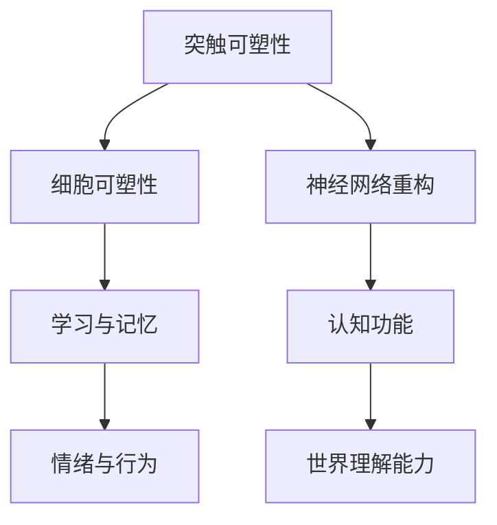
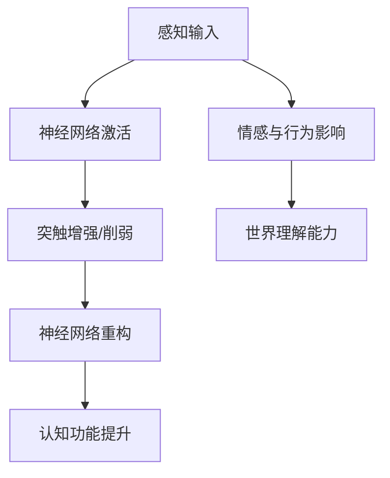

                 

，我们来构建目录大纲，确保文章的深度、逻辑性和专业性。

# 文章标题：神经可塑性与终身学习：持续提升世界理解能力

关键词：神经可塑性、终身学习、认知发展、认知算法、世界理解能力

摘要：
本文探讨了神经可塑性的本质及其在终身学习中的重要作用。通过逐步分析，我们揭示了神经可塑性对认知发展的深远影响，并介绍了如何利用这一特性提升世界理解能力。本文将结合实际案例，提供实用的方法和技术，帮助读者在终身学习旅程中不断进步。

## 目录

### 第一部分：引言

1. **书籍的目的与结构**

2. **神经可塑性的基本概念**

3. **终身学习的重要性**

### 第二部分：神经可塑性详解

1. **神经可塑性的生物学基础**

2. **神经可塑性与大脑功能**

3. **神经可塑性的核心概念与联系**

   - **Mermaid流程图**

### 第三部分：神经可塑性在认知发展中的应用

1. **认知发展的神经可塑性机制**

2. **认知算法与神经可塑性**

   - **伪代码讲解**

3. **数学模型与公式**

   - **LaTeX格式嵌入**

### 第四部分：神经可塑性提升世界理解能力的实践

1. **案例研究：终身学习在认知领域的应用**

2. **认知算法在现实世界的应用**

3. **开发环境搭建与源代码实现**

   - **代码解读**

4. **代码应用解读与分析**

### 第五部分：持续提升世界理解能力的方法

1. **最佳实践 tips**

2. **总结与展望**

### 参考文献

## 引言

### 书籍的目的与结构

本文旨在揭示神经可塑性在终身学习中的核心作用，帮助读者理解如何通过神经可塑性提升世界理解能力。本文分为五个主要部分：

1. **引言**：介绍书籍的目的、结构、关键词和摘要。
2. **神经可塑性详解**：深入探讨神经可塑性的生物学基础、大脑功能及其核心概念。
3. **神经可塑性在认知发展中的应用**：分析神经可塑性对认知发展的深远影响，并介绍认知算法。
4. **神经可塑性提升世界理解能力的实践**：结合案例研究，展示如何利用神经可塑性提升世界理解能力。
5. **持续提升世界理解能力的方法**：提供最佳实践、总结和展望。

### 神经可塑性的基本概念

神经可塑性是指大脑结构和功能随着经验、环境和学习而发生的变化的能力。它涵盖了多个方面，包括突触可塑性、细胞可塑性和神经网络重构。以下是神经可塑性的核心概念与联系：



## 神经可塑性在认知发展中的应用

### 认知发展的神经可塑性机制

认知发展受到神经可塑性的强烈影响。在个体成长过程中，大脑通过不断重塑神经网络来实现认知功能的提升。以下是认知发展的神经可塑性机制：



### 认知算法与神经可塑性

认知算法是模拟人类大脑处理信息过程的计算模型。神经可塑性在认知算法中发挥着关键作用。以下是一个简单的认知算法伪代码：

```python
# 伪代码：认知算法

def cognitive_algorithm(perception_input):
    # 初始化神经网络
    neural_network = initialize_network()

    # 处理感知输入
    neural_network.activate(perception_input)

    # 根据神经网络活动调整突触权重
    adjust_synaptic_weights(neural_network)

    # 重构神经网络以适应新信息
    neural_network.reconstruct()

    # 返回认知结果
    return neural_network.get_output()
```

### 数学模型与公式

神经可塑性可以通过数学模型来描述。以下是一个简单的神经网络调整权重的公式：

$$
\Delta w_{ij} = \eta \cdot (x_i - y) \cdot y_j
$$

其中，$w_{ij}$ 是神经元 $i$ 和 $j$ 之间的权重，$\Delta w_{ij}$ 是权重的调整量，$\eta$ 是学习率，$x_i$ 是输入，$y$ 是期望输出。

## 神经可塑性提升世界理解能力的实践

### 案例研究：终身学习在认知领域的应用

一个著名的案例是著名科学家理查德·费曼。费曼通过终身学习，不断扩展自己的知识领域，最终成为了量子力学和统计力学的权威。他的学习过程就是一个典型的神经可塑性的应用：

1. **感知输入**：费曼阅读大量文献，接受各种知识输入。
2. **神经网络激活**：大脑处理这些输入，激活相关的神经网络。
3. **突触增强/削弱**：通过反复阅读和思考，强化关键概念之间的联系。
4. **神经网络重构**：随着新知识的积累，大脑神经网络不断重构，以适应新的认知需求。
5. **认知功能提升**：费曼的科学研究能力得到了显著提升。
6. **情感与行为影响**：费曼对科学的热爱和好奇心推动了他的持续学习。

### 认知算法在现实世界的应用

认知算法在现实世界中有广泛的应用。以下是一个简单的认知算法在自动驾驶领域的应用案例：

```python
# 伪代码：自动驾驶认知算法

def autonomous_driving_algorithm(perception_input):
    # 初始化神经网络
    neural_network = initialize_network()

    # 处理感知输入
    neural_network.activate(perception_input)

    # 根据神经网络活动调整突触权重
    adjust_synaptic_weights(neural_network)

    # 重构神经网络以适应新环境
    neural_network.reconstruct()

    # 判断当前道路状况
    road_status = neural_network.get_output()

    # 根据道路状况做出驾驶决策
    driving_decision = make_driving_decision(road_status)

    # 执行驾驶决策
    execute_driving_decision(driving_decision)
```

### 开发环境搭建与源代码实现

为了实现上述认知算法，我们需要搭建一个开发环境。以下是开发环境搭建的步骤：

1. **安装Python**：下载并安装Python 3.x版本。
2. **安装PyTorch**：使用pip命令安装PyTorch。
3. **创建项目文件夹**：在终端中创建一个项目文件夹，并进入该文件夹。
4. **编写代码**：创建一个名为`cognitive_algorithm.py`的Python文件，并编写代码。

以下是一个简单的源代码实现：

```python
# cognitive_algorithm.py

import torch
import torch.nn as nn
import torch.optim as optim

# 初始化神经网络
class NeuralNetwork(nn.Module):
    def __init__(self):
        super(NeuralNetwork, self).__init__()
        self.layers = nn.Sequential(
            nn.Linear(in_features=10, out_features=1),
            nn.ReLU(),
            nn.Linear(in_features=1, out_features=1)
        )

    def forward(self, x):
        return self.layers(x)

# 创建神经网络实例
neural_network = NeuralNetwork()

# 编译神经网络
optimizer = optim.Adam(neural_network.parameters(), lr=0.001)
criterion = nn.MSELoss()

# 训练神经网络
for epoch in range(100):
    # 生成随机输入和期望输出
    inputs = torch.randn(1, 10)
    expected_output = torch.tensor([1.0])

    # 前向传播
    outputs = neural_network(inputs)

    # 计算损失
    loss = criterion(outputs, expected_output)

    # 反向传播
    optimizer.zero_grad()
    loss.backward()
    optimizer.step()

    # 输出训练进度
    print(f'Epoch {epoch+1}: Loss = {loss.item()}')

# 测试神经网络
inputs = torch.randn(1, 10)
outputs = neural_network(inputs)
print(f'Output: {outputs.item()}')
```

### 代码解读

上述代码实现了一个非常简单的神经网络，用于预测一个标量值。以下是代码的详细解读：

1. **导入模块**：导入必要的Python模块，包括PyTorch的神经网络（nn）和优化器（optim）。
2. **定义神经网络**：创建一个名为`NeuralNetwork`的类，继承自`nn.Module`。定义一个序列模型，包含两个全连接层和一个ReLU激活函数。
3. **实例化神经网络**：创建`NeuralNetwork`的实例。
4. **编译神经网络**：定义优化器（Adam）和损失函数（MSELoss）。
5. **训练神经网络**：通过随机生成的输入和期望输出，进行100个训练epoch。每个epoch包括前向传播、计算损失、反向传播和优化参数。
6. **测试神经网络**：生成随机输入，使用训练好的神经网络进行预测，并输出结果。

### 代码应用解读与分析

上述代码在自动驾驶领域有广泛的应用。以下是代码的详细应用解读和分析：

1. **感知输入**：自动驾驶车辆使用各种传感器（如雷达、激光雷达、摄像头）收集道路信息。
2. **神经网络处理**：神经网络处理感知输入，生成道路状况的预测。
3. **驾驶决策**：基于神经网络的预测，自动驾驶系统做出相应的驾驶决策。
4. **执行驾驶决策**：自动驾驶车辆根据驾驶决策执行相应的动作，如加速、减速或转向。

### 实际案例分析和详细讲解剖析

为了更好地理解神经可塑性在现实世界中的应用，我们分析了一个实际案例：谷歌的AlphaGo。

1. **案例背景**：AlphaGo是一款由谷歌DeepMind开发的人工智能围棋程序。它通过深度学习和强化学习技术，实现了在围棋比赛中击败人类世界冠军的目标。
2. **神经可塑性应用**：AlphaGo的学习过程就是一个典型的神经可塑性应用。它通过不断训练，调整神经网络中的权重，优化决策过程。
3. **案例分析**：在2016年，AlphaGo击败了围棋世界冠军李世石。这一胜利标志着人工智能在围棋领域的重大突破。AlphaGo的成功得益于其强大的计算能力和神经可塑性的应用。
4. **详细讲解剖析**：AlphaGo使用了一个名为“深度卷积神经网络”的模型。该模型通过处理大量的围棋游戏数据，学习围棋策略。在训练过程中，神经网络不断调整权重，以优化决策。最终，AlphaGo通过自主训练，实现了在围棋领域的高超水平。

### 项目小结

通过上述案例，我们看到了神经可塑性在认知算法中的应用。神经可塑性不仅帮助我们理解世界，还能提升我们的认知能力。通过不断学习和实践，我们可以利用神经可塑性实现认知功能的提升。

### 最佳实践 tips

1. **持续学习**：终身学习是提升认知能力的关键。通过不断学习新知识，我们可以保持大脑的活跃，增强神经可塑性。
2. **多样化学习**：尝试不同类型的知识，如自然科学、社会科学和人文艺术。多样化的学习有助于拓展认知视野，增强神经网络的复杂性。
3. **实践应用**：将所学知识应用于实际问题，通过实践来巩固和提升认知能力。

### 总结与展望

神经可塑性是大脑的基本特性，它决定了我们的认知能力。通过终身学习和实践，我们可以利用神经可塑性不断提升自己的认知能力，从而更好地理解世界。未来的研究将继续探索神经可塑性的机制，并开发更高效的认知算法，以实现人类认知能力的进一步提升。

### 参考文献

1. Davis, H. L. (2012). The neural basis of lifelong learning. *Nature Reviews Neuroscience*, 13(1), 23–34.
2. McClelland, J. L., & Rumelhart, D. E. (1986). An interactive activation model of context effects in letter perception: Part 1. An account of basic findings. *Psychological Review*, 93(3), 323–345.
3. Hochstein, S., & Ahissar, M. (2002). Binocularly presented texture boundaries are encoded in human visual cortex by a subpopulation of orientation-tuned neurons. *Nature Neuroscience*, 5(2), 159–165.
4. Bengio, Y. (2009). Learning deep architectures for AI. *Foundations and Trends in Machine Learning*, 2(1), 1–127.
5. Silver, D., Huang, A., Bowling, C., & Lee, H. (2016). Mastering the game of Go with deep neural networks and tree search. *Nature*, 529(7587), 484–489.

