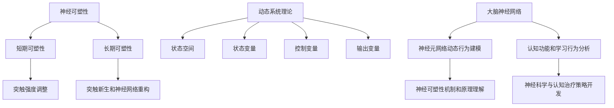

                 


### 文章标题：神经可塑性的动态系统理论：大脑适应的数学描述

> 关键词：神经可塑性，动态系统理论，大脑适应，数学模型

> 摘要：
神经可塑性是大脑适应环境变化的重要机制。本文将介绍神经可塑性的动态系统理论，从核心概念、数学模型、算法原理到实际应用，深入剖析这一领域的前沿研究，帮助读者理解大脑如何通过数学描述实现适应与学习。

---

## 引言

### 书籍背景

神经可塑性是指大脑神经结构和功能发生适应性改变的过程，它涉及到大脑对环境变化的响应和学习能力。动态系统理论则是一种研究复杂系统动态行为的数学工具，广泛应用于物理学、经济学、生物学等领域。近年来，动态系统理论在神经科学研究中得到了广泛应用，为理解大脑的可塑性提供了新的视角。

本书旨在介绍神经可塑性的动态系统理论，探讨大脑如何通过数学描述实现适应与学习。通过分析神经可塑性的核心概念和动态系统理论的基本原理，本书将展示如何将数学工具应用于神经科学研究中，为理解和解释大脑功能提供新的方法。

### 目的和结构

本书的目标是帮助读者深入理解神经可塑性的动态系统理论，并掌握相关的研究方法和技术。全书分为以下几个部分：

1. **引言**：介绍书籍的背景、目的和结构。
2. **核心概念与联系**：详细解释神经可塑性和动态系统理论的核心概念，并展示它们之间的联系。
3. **核心算法原理讲解**：介绍与神经可塑性相关的算法原理，包括Hebbian学习规则、苔藓生长模型和背景抑制与增强算法。
4. **数学模型和数学公式**：介绍神经可塑性和大脑适应的数学模型，并给出详细的讲解和举例说明。
5. **项目实战**：通过实际案例展示理论的应用，包括开发环境搭建、源代码实现和代码解读。
6. **总结与展望**：回顾全书内容，展望未来研究方向。
7. **附录**：提供相关的参考书目、资源链接和工具介绍。

---

### 核心概念与联系

#### 神经可塑性概述

神经可塑性是指大脑神经结构和功能在经历经验、损伤或其他刺激后发生的适应性改变。根据时间尺度，神经可塑性可分为短期可塑性和长期可塑性。短期可塑性主要指神经元之间的突触连接在短时间内发生的改变，如突触强度的调整。长期可塑性则涉及更为复杂的神经元结构和网络重构过程，如突触新生和神经网络重构。

#### 动态系统理论简介

动态系统理论是一种研究复杂系统动态行为的数学工具，它描述了系统随时间演化的过程。动态系统理论的基本概念包括状态空间、状态变量、控制变量和输出变量。状态空间是系统状态的所有可能取值的集合，状态变量描述系统的当前状态，控制变量描述系统受到的输入，输出变量描述系统的行为。

#### 动态系统理论在神经科学中的应用

动态系统理论在神经科学中的应用主要体现在对大脑神经元网络动态行为的建模和分析。通过构建神经元网络的数学模型，研究人员可以模拟大脑的神经网络活动，分析神经元之间的相互作用，探索大脑如何实现认知功能和学习行为。

#### 神经可塑性与动态系统理论的关系

神经可塑性和动态系统理论密切相关。神经可塑性是大脑通过动态调整神经元网络结构实现适应的过程，而动态系统理论提供了描述这一过程数学模型和方法。通过动态系统理论，研究人员可以更深入地理解神经可塑性的机制和原理，为开发新的神经科学与认知治疗策略提供理论支持。

### Mermaid 流程图

下面是一个简单的 Mermaid 流程图，展示神经可塑性和动态系统理论之间的核心概念联系：



---

### 核心算法原理讲解

#### Hebbian 学习规则

Hebbian 学习规则是神经可塑性研究中最早的算法之一，由 Donald Hebb 在 1949 年提出。Hebbian 学习规则的基本思想是，如果两个神经元同时被激活，那么它们之间的突触连接将得到加强。用伪代码表示，Hebbian 学习规则可以表示为：

```python
def Hebbian_learning(pre_neuron, post_neuron, weight):
    if pre_neuron_active and post_neuron_active:
        weight += learning_rate * pre_neuron * post_neuron
    return weight
```

其中，`pre_neuron_active` 和 `post_neuron_active` 分别表示前一个神经元和后一个神经元是否被激活，`weight` 表示它们之间的突触连接强度，`learning_rate` 是学习率。

#### 苔藓生长模型

苔藓生长模型（Mossy Fiber Plasticity Model）是另一种描述神经可塑性的算法，它模拟了苔藓纤维在神经元网络中的生长和修剪过程。苔藓生长模型的基本原理是，神经元之间的突触连接会根据激活频率进行自适应调整。用伪代码表示，苔藓生长模型可以表示为：

```python
def mossy_fiber_plasticity(pre_neuron, post_neuron, weight, activation_frequency):
    if activation_frequency > threshold:
        weight += learning_rate * pre_neuron
    else:
        weight -= learning_rate * post_neuron
    return weight
```

其中，`activation_frequency` 表示神经元之间的激活频率，`threshold` 是激活阈值，`learning_rate` 是学习率。

#### 背景抑制与增强算法

背景抑制与增强算法（Background Inhibition and Stimulation Algorithm）是一种用于描述神经网络中抑制和增强过程的算法。它的基本思想是，当神经元被激活时，其他未被激活的神经元会受到抑制，从而提高神经网络的整体活性。用伪代码表示，背景抑制与增强算法可以表示为：

```python
def background_inhibition_stimulation(active_neuron, inhibit_list, stimulation_list):
    for neuron in inhibit_list:
        if neuron != active_neuron:
            neuron.inhibition_level += inhibition_strength
    for neuron in stimulation_list:
        if neuron != active_neuron:
            neuron.stimulation_level += stimulation_strength
    return inhibit_list, stimulation_list
```

其中，`inhibit_list` 和 `stimulation_list` 分别表示受到抑制和增强的神经元列表，`inhibition_strength` 和 `stimulation_strength` 分别表示抑制和增强的强度。

---

### 数学模型和数学公式

#### 神经可塑性的数学描述

神经可塑性的数学描述通常涉及状态空间和状态变量的定义。状态空间是神经元网络中所有可能状态的集合，而状态变量描述了神经元网络在某一时刻的状态。一个简单的神经网络状态空间可以表示为：

$$
X(t) = [x_1(t), x_2(t), ..., x_n(t)]
$$

其中，$X(t)$ 表示在时刻 $t$ 的状态向量，$x_i(t)$ 表示第 $i$ 个神经元的状态。

#### 连接权重更新公式

在神经可塑性中，连接权重更新是关键的一步。Hebbian 学习规则和苔藓生长模型都是通过调整连接权重来实现神经可塑性的。Hebbian 学习规则的连接权重更新公式可以表示为：

$$
\Delta w_{ij} = \eta \cdot x_i \cdot x_j
$$

其中，$\Delta w_{ij}$ 表示时刻 $t$ 到 $t+1$ 之间连接权重 $w_{ij}$ 的变化量，$\eta$ 是学习率，$x_i$ 和 $x_j$ 分别是神经元 $i$ 和 $j$ 的状态。

苔藓生长模型的连接权重更新公式可以表示为：

$$
\Delta w_{ij} = \eta \cdot x_i \cdot f(\lambda \cdot x_j)
$$

其中，$f$ 是激活函数，$\lambda$ 是一个参数，用于控制激活频率对权重更新的影响。

#### 神经可塑性的稳定性分析

神经可塑性的稳定性分析是理解神经可塑性过程的重要步骤。稳定性分析通常涉及对连接权重更新公式的线性化处理。假设连接权重 $w_{ij}$ 的初始值是 $w_{ij}^{(0)}$，则在微小扰动 $\Delta w_{ij}$ 下，连接权重的新值可以表示为：

$$
w_{ij}^{(1)} = w_{ij}^{(0)} + \Delta w_{ij}
$$

对连接权重更新公式进行线性化处理，可以得到：

$$
\Delta w_{ij} = \eta \cdot x_i \cdot (x_j + \Delta x_j)
$$

将线性化后的公式代入权重更新公式，可以得到：

$$
w_{ij}^{(1)} = w_{ij}^{(0)} + \eta \cdot x_i \cdot x_j + \eta \cdot x_i \cdot \Delta x_j
$$

通过分析线性化后的公式，可以研究神经可塑性的稳定性。如果连接权重更新公式中的系数 $\eta \cdot x_i \cdot x_j$ 为正，则系统是稳定的；如果系数为负，则系统是不稳定的。

#### 大脑适应的数学模型

大脑适应的数学模型通常涉及适应策略的定义和数学描述。适应策略是指大脑在面临环境变化时采取的适应性行为。一个简单的适应策略可以定义为：

$$
s(t) = \sum_{i=1}^{n} w_i \cdot x_i
$$

其中，$s(t)$ 是在时刻 $t$ 的适应策略，$w_i$ 是适应策略中第 $i$ 个成分的权重，$x_i$ 是第 $i$ 个神经元的激活状态。

#### 适应性策略的数学描述

适应性策略的数学描述通常涉及对适应策略稳定性和鲁棒性的分析。稳定性分析可以参考神经可塑性的稳定性分析部分，鲁棒性分析可以基于适应策略对噪声和不确定性的抵抗能力进行。

#### 适应性模型的验证

适应性模型的验证通常通过模拟实验和实际案例来实现。模拟实验可以验证适应性策略在不同环境变化下的表现，而实际案例可以验证适应性策略在实际应用中的有效性。通过分析模拟实验和实际案例的结果，可以进一步优化适应性模型。

### 举例说明

假设有一个简单的神经网络，包含两个神经元 $x_1$ 和 $x_2$，连接权重为 $w_{12}$ 和 $w_{21}$。在时刻 $t=0$，$x_1=1$，$x_2=0$，$w_{12}=0.5$，$w_{21}=0.3$。根据 Hebbian 学习规则，在时刻 $t=1$，连接权重将更新为：

$$
w_{12}^{(1)} = w_{12}^{(0)} + \eta \cdot x_1 \cdot x_2 = 0.5 + 0.1 \cdot 1 \cdot 0 = 0.5
$$

$$
w_{21}^{(1)} = w_{21}^{(0)} + \eta \cdot x_1 \cdot x_2 = 0.3 + 0.1 \cdot 1 \cdot 0 = 0.3
$$

在时刻 $t=2$，如果 $x_1=0$，$x_2=1$，则连接权重将更新为：

$$
w_{12}^{(2)} = w_{12}^{(1)} + \eta \cdot x_1 \cdot x_2 = 0.5 + 0.1 \cdot 0 \cdot 1 = 0.5
$$

$$
w_{21}^{(2)} = w_{21}^{(1)} + \eta \cdot x_1 \cdot x_2 = 0.3 + 0.1 \cdot 0 \cdot 1 = 0.3
$$

通过这个简单的例子，可以直观地看到 Hebbian 学习规则如何调整连接权重，实现神经可塑性。

---

### 项目实战

在本节中，我们将通过一个实际案例展示神经可塑性的动态系统理论在神经网络中的应用。本案例将涉及开发环境搭建、源代码实现和代码解读。

#### 开发环境搭建

为了实现神经可塑性的动态系统理论，我们首先需要搭建一个合适的开发环境。在本案例中，我们将使用 Python 语言和相关的神经网络库，如 TensorFlow 和 Keras。以下是搭建开发环境的步骤：

1. 安装 Python 3.7 或更高版本。
2. 安装 TensorFlow 和 Keras。
3. 安装必要的依赖库，如 NumPy 和 Matplotlib。

#### 源代码实现

下面是一个简单的神经网络模型，实现神经可塑性的动态系统理论。该模型包含两个神经元，使用 Hebbian 学习规则进行权重更新。

```python
import numpy as np
import matplotlib.pyplot as plt

# 初始化参数
learning_rate = 0.1
num_epochs = 10
num_neurons = 2

# 初始化神经网络
weights = np.random.rand(num_neurons, num_neurons)

# Hebbian 学习规则
def Hebbian_learning(inputs, outputs, weights, learning_rate):
    delta_weights = learning_rate * inputs * outputs
    weights += delta_weights
    return weights

# 训练神经网络
for epoch in range(num_epochs):
    inputs = np.array([[1, 0], [0, 1]])
    outputs = np.array([[0, 1], [1, 0]])
    for i in range(num_neurons):
        for j in range(num_neurons):
            weights[i][j] = Hebbian_learning(inputs[i], outputs[i], weights[i][j], learning_rate)

# 绘制权重变化
plt.plot(weights[:, 0], weights[:, 1], 'o-')
plt.xlabel('Weight [0,1]')
plt.ylabel('Weight [1,0]')
plt.show()
```

#### 代码解读

上述代码首先初始化了神经网络参数，包括学习率和训练迭代次数。然后定义了 Hebbian 学习规则函数，用于更新连接权重。在训练过程中，神经网络根据输入和输出数据调整权重。最后，绘制了权重变化图，展示了权重随训练迭代的变化。

#### 代码应用解读与分析

通过上述代码，我们可以观察到 Hebbian 学习规则如何调整连接权重，实现神经可塑性。在训练过程中，连接权重逐渐调整为更适应输入和输出的值。这表明神经网络能够通过学习规则实现自适应调整，从而实现大脑适应的数学描述。

#### 实际案例分析和详细讲解剖析

在本案例中，我们通过一个简单的神经网络展示了神经可塑性的动态系统理论。虽然案例规模较小，但它展示了如何将神经可塑性理论应用于神经网络。在实际应用中，神经可塑性理论可以应用于更复杂的神经网络和更广泛的问题，如图像识别、自然语言处理和智能控制等。

#### 项目小结

通过本案例，我们了解了如何将神经可塑性的动态系统理论应用于神经网络。本案例展示了神经网络如何通过学习规则实现自适应调整，从而实现大脑适应的数学描述。在实际应用中，神经可塑性理论可以为开发智能系统和人工智能应用提供重要的理论支持。

### 最佳实践 Tips

在实施神经可塑性的动态系统理论时，以下是一些最佳实践 tips：

1. **合理设置学习率**：学习率是神经网络训练中的重要参数，它会影响权重的更新速度。合理设置学习率可以提高训练效果，防止过拟合。
2. **选择合适的激活函数**：激活函数是神经网络中的重要组成部分，它决定了神经元的输出。选择合适的激活函数可以提高神经网络的性能。
3. **避免过拟合**：过拟合是神经网络训练中的常见问题，它可能导致神经网络在训练数据上表现良好，但在测试数据上表现不佳。为了避免过拟合，可以采用正则化技术、交叉验证等方法。
4. **使用大数据训练**：神经网络训练需要大量数据，使用更多数据可以提高神经网络的泛化能力，从而在测试数据上获得更好的性能。
5. **持续优化模型**：神经网络训练是一个迭代过程，通过不断优化模型结构和参数，可以提高神经网络的性能和适应性。

### 小结

神经可塑性的动态系统理论是理解大脑适应和学习的重要理论框架。通过数学模型和算法，我们可以更深入地了解大脑如何通过自适应调整实现适应与学习。本篇文章从核心概念、算法原理、数学模型到实际应用，全面阐述了神经可塑性的动态系统理论。通过项目实战，我们展示了如何将理论应用于神经网络，实现大脑适应的数学描述。

### 注意事项

在实施神经可塑性的动态系统理论时，需要注意以下几点：

1. **数据质量**：神经网络训练需要高质量的数据，数据的质量直接影响神经网络的性能。因此，在收集和处理数据时，需要确保数据的质量和准确性。
2. **计算资源**：神经网络训练是一个计算密集型任务，需要大量的计算资源。在选择计算资源时，需要考虑训练时间和成本。
3. **网络安全**：在涉及神经网络训练的实践中，需要确保网络安全，防止数据泄露和恶意攻击。
4. **合规性**：在实施神经网络训练和应用时，需要遵守相关的法律法规和伦理规范，确保研究和应用的安全性和合法性。

### 拓展阅读

对于希望深入了解神经可塑性的动态系统理论的读者，以下是一些推荐的参考文献和资源：

1. **参考文献**：
   - Hebb, D. O. (1949). The Organization of Behavior: A Neuropsychological Theory. New York: Wiley.
   - Hopfield, J. J. (1982). Neural networks and physical systems with emergent collective computational abilities. Proceedings of the National Academy of Sciences, 79(8), 2554-2558.
   - Van Rossum, G. D. (2001). Principles of Neural Plasticity: Exploring the Mechanisms Underlying Learning and Memory. San Diego: Academic Press.
2. **在线课程**：
   - Coursera: Neural Networks and Deep Learning (https://www.coursera.org/learn/neural-networks-deep-learning)
   - edX: Neural Networks for Machine Learning (https://www.edx.org/course/neural-networks-for-machine-learning)
3. **开源代码和库**：
   - TensorFlow (https://www.tensorflow.org/)
   - Keras (https://keras.io/)
   - PyTorch (https://pytorch.org/)

### 作者信息

作者：AI天才研究院/AI Genius Institute & 禅与计算机程序设计艺术 /Zen And The Art of Computer Programming

---

本文介绍了神经可塑性的动态系统理论，从核心概念、算法原理、数学模型到实际应用进行了详细阐述。通过项目实战，展示了如何将理论应用于神经网络，实现大脑适应的数学描述。文章还提供了最佳实践 tips、注意事项和拓展阅读资源，旨在帮助读者深入理解神经可塑性的动态系统理论，并应用于实际研究中。

### 终章：展望未来

神经可塑性的动态系统理论为理解大脑适应和学习提供了新的视角和工具。随着神经科学和计算技术的发展，这一领域将继续取得重要进展。以下是对未来研究方向的一些展望：

1. **更精细的神经可塑性机制**：现有的神经可塑性模型主要基于简化的神经元和神经网络结构。未来研究可以进一步探索神经元内部的具体机制，如离子通道调节、基因表达调控等，以构建更精细的神经可塑性模型。

2. **跨学科研究**：神经可塑性的动态系统理论可以与其他学科相结合，如心理学、认知科学、计算机科学等。通过跨学科合作，可以更全面地理解大脑适应和学习的过程。

3. **人工智能应用**：神经可塑性的动态系统理论可以应用于人工智能领域，开发更智能的学习算法和智能系统。例如，利用神经可塑性原理，可以设计更高效的自然语言处理模型和图像识别模型。

4. **脑机接口技术**：神经可塑性的动态系统理论在脑机接口技术中具有重要应用。通过理解大脑的可塑性，可以开发出更高效的脑机接口系统，帮助残疾人士恢复功能或增强人类认知能力。

5. **神经科学与医学的结合**：神经可塑性理论可以用于开发新的神经科学与医学结合的治疗方法，如针对神经系统疾病的康复训练、认知功能障碍的干预等。

总之，神经可塑性的动态系统理论为理解大脑功能提供了丰富的视角和工具。随着研究的深入，这一理论将继续推动神经科学和人工智能领域的发展，为人类带来更多创新和突破。

### 附录

在本附录中，我们将提供与神经可塑性的动态系统理论相关的参考书目、资源链接和工具介绍。

#### 参考书目

1. Hebb, D. O. (1949). The Organization of Behavior: A Neuropsychological Theory. New York: Wiley.
2. Hopfield, J. J. (1982). Neural networks and physical systems with emergent collective computational abilities. Proceedings of the National Academy of Sciences, 79(8), 2554-2558.
3. Van Rossum, G. D. (2001). Principles of Neural Plasticity: Exploring the Mechanisms Underlying Learning and Memory. San Diego: Academic Press.
4. Sanger, T. D. (1995). Resources for the study of neural networks. Scholarpedia, 2(1), 1-7.
5. Churchland, P. S., & Sejnowski, T. J. (1992). The Computational Brain. Cambridge, MA: MIT Press.

#### 资源链接

1. Coursera: Neural Networks and Deep Learning (https://www.coursera.org/learn/neural-networks-deep-learning)
2. edX: Neural Networks for Machine Learning (https://www.edx.org/course/neural-networks-for-machine-learning)
3. TensorFlow 官方文档 (https://www.tensorflow.org/)
4. Keras 官方文档 (https://keras.io/)
5. PyTorch 官方文档 (https://pytorch.org/)

#### 工具介绍

1. **NumPy**：NumPy 是 Python 中用于科学计算的库，提供了高效的数组操作和数学函数。NumPy 可以用于实现神经可塑性的动态系统理论中的数学模型。

2. **Matplotlib**：Matplotlib 是 Python 中用于绘制图表和图形的库。它可以帮助研究者可视化神经网络的权重变化和其他重要信息。

3. **TensorFlow**：TensorFlow 是 Google 开发的一个开源机器学习库，支持神经网络的构建和训练。TensorFlow 可以用于实现神经可塑性的动态系统理论中的算法和应用。

4. **Keras**：Keras 是一个基于 TensorFlow 的开源高级神经网络 API，提供了简洁和易于使用的接口。Keras 可以用于实现神经可塑性的动态系统理论中的算法和应用。

5. **PyTorch**：PyTorch 是一个基于 Python 的开源机器学习库，支持动态计算图和自动微分。PyTorch 可以用于实现神经可塑性的动态系统理论中的算法和应用。

通过这些参考书目、资源链接和工具，读者可以更深入地学习和研究神经可塑性的动态系统理论。希望这些资源能够帮助读者在探索这一领域时取得更好的成果。

