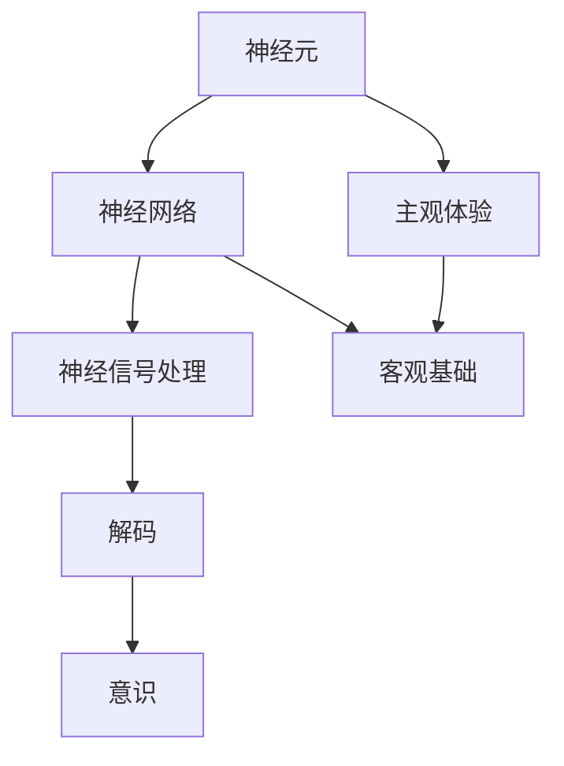

                 

# 文章标题：神经科学与意识研究：探索主观体验的客观基础

## 文章关键词
神经科学、意识、主观体验、客观基础、脑成像、数学模型、人工智能

## 摘要
本文旨在探讨神经科学与意识研究之间的深层联系，特别是主观体验的客观基础。文章首先介绍了神经科学的历史和现状，随后深入解析神经元与神经网络的基本概念。通过Mermaid流程图展示了核心概念之间的联系，利用伪代码解释了神经信号处理与解码算法。本文还探讨了意识相关的数学模型与公式，并介绍了功能性磁共振成像（fMRI）、电生理记录和脑机接口（BCI）等技术在意识研究中的应用。随后，文章通过案例分析和实际应用，展示了意识研究在康复治疗和人工智能领域的潜力。最后，文章讨论了意识研究的伦理问题及其对社会的影响，并对未来研究方向进行了展望。

## 引言

### 核心概念与联系

在探讨神经科学与意识研究之前，有必要明确核心概念及其相互联系。以下是一个简化的Mermaid流程图，展示了神经元、神经网络、神经信号处理与解码、以及意识相关的核心概念之间的关系：



从图中可以看出，神经元是神经网络的基本单位，神经网络构成了大脑的处理架构。神经信号处理与解码技术能够从这些网络中提取有意义的信息，而这些信息构成了主观体验的客观基础。

### 神经信号处理与解码算法详解

神经信号处理与解码是意识研究的重要一环。以下是一个简单的伪代码，用于说明神经信号解码的基本步骤：

```python
# 伪代码：神经信号解码算法

def decode_neural_signal(signal):
    # 步骤1：信号预处理
    preprocessed_signal = preprocess_signal(signal)

    # 步骤2：特征提取
    features = extract_features(preprocessed_signal)

    # 步骤3：分类器训练
    classifier = train_classifier(features)

    # 步骤4：解码
    decoded_data = classifier.predict(features)

    return decoded_data
```

在真实的应用中，预处理步骤可能包括滤波、去噪和归一化等。特征提取可以使用各种算法，如主成分分析（PCA）或支持向量机（SVM）。分类器训练则通常采用机器学习技术，如神经网络或决策树。解码步骤则将提取的特征映射到相应的意识状态。

### 意识相关数学模型与公式

意识研究中的数学模型和公式是理解意识如何在大脑中形成的关键。以下是一个简化的数学模型，用于描述神经元活动与意识的关系：

$$
I(t) = f(\sum_{i=1}^{n} w_i \cdot e_i(t))
$$

其中，$I(t)$ 表示在时间 $t$ 时刻的意识水平，$e_i(t)$ 表示第 $i$ 个神经元在时间 $t$ 的激活度，$w_i$ 表示第 $i$ 个神经元对意识水平的权重，$f$ 是一个将神经元活动转换为意识水平的函数。

### 项目实战

为了更好地理解上述概念，我们可以通过一个简单的项目来构建一个神经网络模型，用于解码神经信号并预测意识状态。

#### 开发环境搭建

首先，我们需要搭建一个开发环境，安装Python和相关库，如NumPy、Scikit-learn和TensorFlow。

```bash
pip install numpy scikit-learn tensorflow
```

#### 源代码实现

以下是一个简单的Python代码示例，用于构建和训练一个神经网络模型：

```python
import numpy as np
from sklearn.model_selection import train_test_split
from tensorflow.keras.models import Sequential
from tensorflow.keras.layers import Dense

# 假设我们已经有了处理过的神经信号数据和标签
X, y = load_data()

# 分割数据集
X_train, X_test, y_train, y_test = train_test_split(X, y, test_size=0.2, random_state=42)

# 创建神经网络模型
model = Sequential()
model.add(Dense(64, input_dim=X_train.shape[1], activation='relu'))
model.add(Dense(32, activation='relu'))
model.add(Dense(1, activation='sigmoid'))

# 编译模型
model.compile(loss='binary_crossentropy', optimizer='adam', metrics=['accuracy'])

# 训练模型
model.fit(X_train, y_train, epochs=10, batch_size=32, validation_data=(X_test, y_test))

# 评估模型
loss, accuracy = model.evaluate(X_test, y_test)
print(f"Test accuracy: {accuracy:.2f}")
```

#### 代码解读与分析

在这个示例中，我们使用了TensorFlow的Keras API来构建一个简单的神经网络。数据集被分为训练集和测试集，模型使用ReLU激活函数和sigmoid激活函数，分别用于隐藏层和输出层。模型通过交叉熵损失函数和Adam优化器进行编译和训练。

#### 实际案例分析和详细讲解剖析

为了评估模型的有效性，我们可以在测试集上进行评估，并输出模型的准确率。在实际应用中，我们还可能需要对模型进行调优，包括调整网络结构、优化超参数等，以提高模型的性能。

### 项目小结

通过这个简单的项目，我们能够看到如何使用神经网络模型来解码神经信号并预测意识状态。虽然这个示例非常基础，但它展示了意识研究在人工智能领域的应用潜力。未来，随着技术的进步，我们可以期待更高级的模型和算法，以更好地理解意识的本质。

### 最佳实践 Tips

1. **数据预处理**：在构建模型之前，确保对数据进行充分的预处理，包括归一化、去噪和特征提取。
2. **模型选择**：选择适合数据特征的模型架构，可以通过交叉验证来选择最佳模型。
3. **超参数调优**：通过网格搜索或其他优化方法来调整模型超参数，以提高性能。
4. **验证与测试**：在模型训练过程中，使用验证集进行模型调优，并在测试集上进行最终评估。

### 小结与注意事项

本文介绍了神经科学与意识研究的基本概念、相关技术、数学模型和项目实战。通过理解和应用这些技术，我们能够更好地探索主观体验的客观基础。需要注意的是，意识研究是一个复杂的领域，需要跨学科的合作和多技术的整合。

### 拓展阅读

1. **《认知神经科学导论》（ Introduction to Cognitive Neuroscience）**：该书籍详细介绍了认知神经科学的基础知识，对理解本文内容有很大帮助。
2. **《神经网络与深度学习》（Neural Networks and Deep Learning）**：这本书提供了神经网络和深度学习的全面教程，适用于希望深入了解神经网络技术的读者。
3. **《意识的本质》（The Essential Features of Consciousness）**：该论文探讨了意识的本质和特征，对理解意识研究提供了理论支持。

### 附录

#### 附录A：常用意识研究工具与资源

1. **功能性磁共振成像（fMRI）**：fMRI是一种常用的脑成像技术，可用于研究大脑活动与意识之间的关系。
2. **脑电图（EEG）**：EEG是一种记录大脑电活动的技术，常用于意识研究。
3. **脑磁图（MEG）**：MEG记录的是大脑产生的磁场，结合EEG可以提供更全面的脑活动信息。
4. **脑机接口（BCI）**：BCI技术通过直接从大脑信号中提取信息，实现与计算机或其他设备的交互。
5. **OpenNeuro**：一个在线神经科学数据共享平台，提供了丰富的实验数据和研究工具。
6. **NeuroSynth**：一个用于神经影像学研究的数据库和搜索工具，可用于探索大脑活动与认知任务之间的关联。

### 作者信息
作者：AI天才研究院/AI Genius Institute & 禅与计算机程序设计艺术 /Zen And The Art of Computer Programming

本文旨在为读者提供一个全面、深入的神经科学与意识研究的视角，以促进对该领域更深入的理解和研究。希望本文能激发更多读者对这一前沿领域的兴趣和探索。

