                 

### 1.1 神经科技的定义

神经科技（Neurotechnology）是集计算机科学、生物工程学、神经科学和信息技术等多种学科于一体的跨学科领域。其核心目标是理解、模拟、增强或修复大脑功能，以便改善人类生活质量、医疗健康、教育乃至国防等各个方面。

首先，我们需要明确神经科技的定义及其基本组成部分。神经科技主要包括以下几方面：

1. **神经成像技术**：通过成像技术如功能性磁共振成像（fMRI）、正电子发射断层扫描（PET）、脑电图（EEG）等，用于无创或微创地观察大脑结构和功能。

2. **神经接口技术**：包括脑机接口（BCI）、神经电极、人工神经网络等，这些技术旨在直接与大脑通信，将大脑信号转换为可操作的信息或控制指令。

3. **神经调控技术**：如深部脑刺激（DBS）、经颅磁刺激（TMS）和经颅电刺激（TES）等，通过物理手段调节大脑活动，以治疗或改善各种神经和精神疾病。

4. **神经计算与模拟**：利用计算机模拟大脑神经网络的工作原理，以理解和预测大脑行为。

接下来，让我们来具体分析神经科技的定义。神经科技不仅仅是单一技术的集合，而是多种技术的综合运用。例如，脑机接口（BCI）技术就需要结合神经成像和神经调控技术，通过捕捉大脑信号，并将其转换为控制外部设备（如轮椅、电脑等）的指令。

**核心概念与联系：**

神经科技的核心概念包括神经元、神经网络、脑机接口和认知神经科学。以下是一个Mermaid流程图，展示了这些概念之间的相互关系：

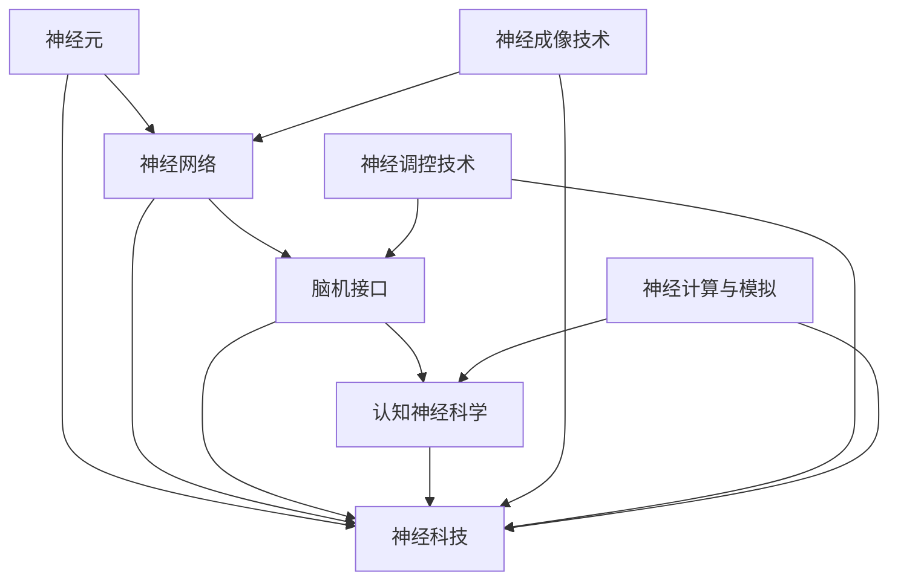

在这个流程图中，我们可以看到，神经科技是由多个分支组成的，每个分支都与其他分支紧密相连。例如，神经成像技术提供了对大脑结构和功能的理解，这些理解可以用于开发和优化神经调控技术，如深部脑刺激（DBS）。同样，神经计算与模拟技术通过计算机模型来模拟大脑神经网络，有助于我们更好地理解大脑的工作原理。

**Mermaid 流程图解释：**

- **A[神经元]**：神经元是神经科技的基本单元，负责传递电信号。
- **B[神经网络]**：多个神经元组合在一起形成神经网络，神经网络是大脑信息处理的基本结构。
- **C[脑机接口]**：脑机接口是连接大脑和外部设备的桥梁，通过捕捉大脑信号来实现对设备的控制。
- **D[认知神经科学]**：认知神经科学研究大脑如何处理信息和产生认知功能。
- **E[神经成像技术]**：神经成像技术用于无创地观察大脑结构和功能。
- **F[神经调控技术]**：神经调控技术通过物理手段调节大脑活动，用于治疗和改善疾病。
- **G[神经计算与模拟]**：神经计算与模拟通过计算机模型来模拟大脑神经网络，以更好地理解大脑行为。
- **H[神经科技]**：神经科技是所有相关技术的总称，包括神经成像、神经调控、神经接口和神经计算等。

通过这个流程图，我们可以清晰地看到神经科技各个组成部分之间的联系，以及它们在实现认知增强中的作用。

**总结：**

神经科技的定义是一个跨学科领域，它涉及多个技术分支，包括神经成像、神经接口、神经调控和神经计算等。这些技术通过不同的方式来理解、模拟、增强或修复大脑功能。理解这些核心概念及其相互关系，是深入研究神经科技与认知增强的基础。

### 1.2 神经科技的发展历史

神经科技的发展历程可谓是一部充满创新和突破的历史。从20世纪中期开始，神经科技的研究逐渐起步，并在21世纪迎来了迅猛发展。下面，我们将回顾一些重要的里程碑和关键人物，以了解神经科技如何一步步演变至今。

**1. 中期发展：**

- **1950年代：** 贝尔实验室的沃尔特·希契柯克（Walter H. Isaacson）发明了第一台脑电图机（EEG），这项技术使得无创地记录大脑电活动成为可能。

- **1960年代：** 约翰·多尔夫（John Donofrio）发明了立体定向手术技术，这种方法可以精确地定位大脑特定区域，用于治疗帕金森病等疾病。

- **1970年代：** 莫顿·海尔布罗诺维奇（Morton Heilig）发明了“感知头盔”（Perception Machine），这是一种早期的虚拟现实设备，它使用视觉和触觉刺激来模拟环境。

**2. 转折点：**

- **1980年代：** 脑机接口（BCI）研究开始兴起，美国心理学家保罗·麦克莱恩（Paul MacLean）提出了“三脑理论”，为理解大脑复杂结构提供了新视角。

- **1990年代：** 随着计算机技术的飞速发展，神经计算和神经网络模型得到广泛应用，从而推动了神经科技在认知建模和智能系统领域的应用。

**3. 突破与发展：**

- **2000年代：** 功能性磁共振成像（fMRI）技术的普及，使得研究人员能够无创地观察大脑活动，并揭示大脑的精细结构和功能。

- **2010年代：** 神经调控技术如深部脑刺激（DBS）和经颅磁刺激（TMS）得到了广泛应用，这些技术可以有效地治疗多种神经和精神疾病。

- **2020年代：** 神经科技研究进入了新的阶段，基因编辑技术（如CRISPR）和量子计算技术的结合，为神经科技的未来发展带来了新的机遇。

**关键人物：**

- **沃尔特·希契柯克（Walter H. Isaacson）：** 发明了第一台脑电图机，为神经科技的研究奠定了基础。

- **约翰·多尔夫（John Donofrio）：** 发明了立体定向手术技术，为神经调控技术的研究开辟了新路径。

- **保罗·麦克莱恩（Paul MacLean）：** 提出了“三脑理论”，对大脑结构的理解产生了深远影响。

- **霍华德·马尔科姆·亨特（Howard Malcolm Hunt）：** 是脑机接口技术的先驱，开创了BCI研究的新时代。

**核心概念与联系：**

在回顾神经科技的发展历史时，我们可以看到，每一个里程碑和每一个关键人物都对神经科技的发展产生了深远的影响。以下是一个Mermaid流程图，展示了这些里程碑和关键人物之间的联系：

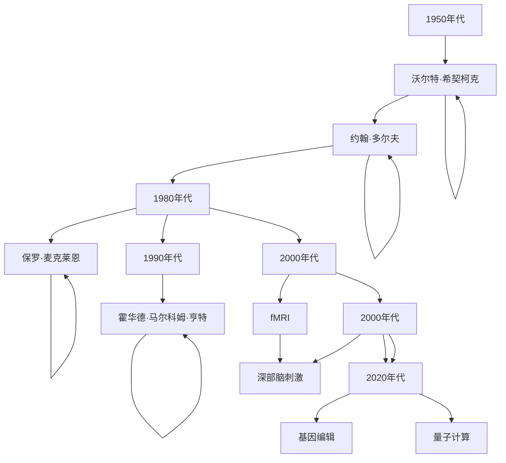

**Mermaid 流程图解释：**

- **A[1950年代]**：标志着神经科技的开端，脑电图机和立体定向手术的发明为后续研究奠定了基础。

- **B[脑电图机]**：沃尔特·希契柯克发明了第一台脑电图机，使得无创地记录大脑电活动成为可能。

- **C[立体定向手术]**：约翰·多尔夫发明了立体定向手术技术，为神经调控技术的研究开辟了新路径。

- **D[1980年代]**：脑机接口（BCI）研究开始兴起，保罗·麦克莱恩的三脑理论为理解大脑复杂结构提供了新视角。

- **E[脑机接口]**：霍华德·马尔科姆·亨特是脑机接口技术的先驱，开创了BCI研究的新时代。

- **F[1990年代]**：神经网络和神经计算模型的广泛应用，推动了神经科技在认知建模和智能系统领域的应用。

- **G[神经网络]**：神经网络的发展为神经计算和认知建模提供了强有力的工具。

- **H[2000年代]**：功能性磁共振成像（fMRI）技术的普及，使得研究人员能够无创地观察大脑活动。

- **I[fMRI]**：fMRI技术的发展，使得大脑功能成像变得更加精确和普及。

- **J[2010年代]**：深部脑刺激（DBS）和经颅磁刺激（TMS）得到了广泛应用，这些技术可以有效地治疗多种神经和精神疾病。

- **K[深部脑刺激]**：DBS技术的发展，为神经调控治疗提供了新的手段。

- **L[2020年代]**：基因编辑技术和量子计算技术的结合，为神经科技的未来发展带来了新的机遇。

通过这个流程图，我们可以清晰地看到神经科技的发展历程，以及每一个里程碑和关键人物对神经科技发展的重要贡献。

**总结：**

神经科技的发展历程是一个充满创新和突破的过程。从脑电图机的发明到基因编辑技术的应用，每一个里程碑和每一个关键人物都对神经科技的发展产生了深远的影响。理解这些历史背景和关键事件，有助于我们更好地把握神经科技的现状和未来发展趋势。

### 1.3 神经科技的应用领域

神经科技在多个领域都有着广泛的应用，极大地改变了我们的生活方式和医疗实践。以下是神经科技在医疗、教育、军事和娱乐等主要领域中的具体应用及其对社会的潜在影响。

**医疗领域：**

神经科技在医疗领域的应用主要体现在疾病的诊断、治疗和康复上。例如，功能性磁共振成像（fMRI）和正电子发射断层扫描（PET）等技术，帮助医生无创地观察大脑结构和功能，从而提高诊断准确性。神经调控技术，如深部脑刺激（DBS）和经颅磁刺激（TMS），已被广泛应用于治疗帕金森病、抑郁症、癫痫等疾病。此外，脑机接口（BCI）技术为瘫痪患者提供了新的康复手段，通过捕捉大脑信号来控制外部设备，如轮椅和假肢。

**教育领域：**

在教育领域，神经科技的应用有助于个性化学习方案的制定和学习效率的提升。通过神经成像技术，教育工作者可以了解学生大脑的活跃区域，从而设计更有效的教学策略。例如，利用fMRI技术，研究人员发现不同的学习任务激活大脑的不同区域，这有助于制定针对性的教学方案。此外，脑机接口技术也被用于提高学习效率，通过大脑信号控制电子设备和虚拟现实环境，帮助学生更好地理解和记忆知识点。

**军事领域：**

在军事领域，神经科技的应用主要集中在提高士兵的作战能力和康复。脑机接口技术被用于设计智能武器系统，使士兵能够通过大脑信号进行控制，从而提高反应速度和精度。此外，神经调控技术如经颅磁刺激（TMS）被用于改善士兵的心理状态，减轻战斗压力和创伤后应激障碍（PTSD）。神经成像技术也被用于评估士兵的心理和生理状态，以优化训练和部署策略。

**娱乐领域：**

在娱乐领域，神经科技的应用为虚拟现实（VR）和增强现实（AR）体验提供了新的可能性。通过脑电图（EEG）和脑机接口（BCI）技术，用户可以直接通过大脑信号与虚拟环境进行交互，提供更自然、更沉浸式的体验。例如，在VR游戏中，玩家可以通过大脑信号控制角色动作，从而实现更真实的游戏体验。此外，神经科技还被用于设计个性化的音乐播放器和电影推荐系统，根据用户的大脑反应来调整内容和播放方式。

**潜在影响：**

神经科技的应用对社会产生了深远的影响，同时也引发了一系列伦理和社会问题。一方面，神经科技为医疗、教育和军事等领域带来了巨大的进步，提高了生活质量和工作效率。另一方面，神经科技的滥用和不当使用可能带来隐私侵犯、社会不公和伦理困境。例如，脑机接口技术可能被用于强迫或操纵个体的行为，而神经调控技术的滥用可能导致心理依赖和伦理问题。

**核心概念与联系：**

为了更好地理解神经科技在不同领域的应用及其对社会的影响，我们可以使用一个Mermaid流程图来展示这些领域及其相互关系：

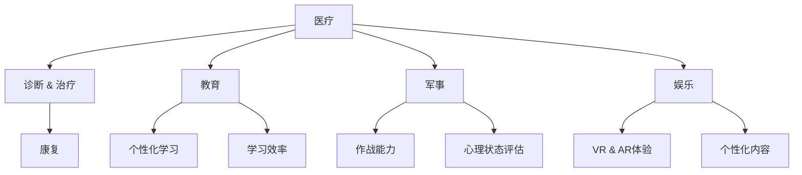

**Mermaid 流程图解释：**

- **A[医疗]**：神经科技在医疗领域的应用，包括诊断、治疗和康复。
- **B[诊断 & 治疗]**：神经成像和神经调控技术在疾病诊断和治疗中的应用。
- **C[康复]**：脑机接口技术为瘫痪患者提供康复手段。
- **D[教育]**：神经科技在教育领域的应用，包括个性化学习和学习效率提升。
- **E[个性化学习]**：利用神经成像技术制定个性化的教学策略。
- **F[学习效率]**：通过脑机接口技术提高学习效率。
- **G[军事]**：神经科技在军事领域的应用，包括作战能力和心理状态评估。
- **H[作战能力]**：脑机接口技术用于设计智能武器系统。
- **I[心理状态评估]**：神经成像技术用于评估士兵的心理和生理状态。
- **J[娱乐]**：神经科技在娱乐领域的应用，包括VR和AR体验。
- **K[VR & AR体验]**：通过脑电图和脑机接口技术提供沉浸式的娱乐体验。
- **L[个性化内容]**：根据用户的大脑反应调整音乐播放器和电影推荐系统。

通过这个流程图，我们可以清晰地看到神经科技在不同领域中的应用及其相互关系，以及它们对社会产生的潜在影响。

**总结：**

神经科技在医疗、教育、军事和娱乐等领域的应用，极大地改变了我们的生活和社会。它为疾病诊断、治疗和康复提供了新的手段，提高了学习效率和娱乐体验，同时也带来了新的伦理和社会挑战。理解这些应用和潜在影响，有助于我们更好地利用神经科技的优势，同时关注其可能带来的负面影响。

### 2.1 认知增强的定义

认知增强（Cognitive Enhancement）是指通过各种方法和技术提升个体的认知能力，包括注意力、记忆、学习速度和问题解决能力等。认知增强的目标是改善个体的认知功能，使其在学习和工作过程中更加高效和准确。

首先，我们需要明确认知增强的定义及其基本概念。认知增强不仅仅是指提高大脑的计算速度或存储容量，而是指全面提升大脑的信息处理能力和效率。以下是认知增强的基本概念：

1. **注意力增强**：注意力是认知功能的核心，通过增强注意力，个体可以更好地集中精力，减少外界干扰，提高工作效率。

2. **记忆增强**：记忆是认知功能的重要组成部分，记忆增强包括提高短期记忆和长期记忆的容量和效率。

3. **学习速度提升**：学习速度的提升意味着个体可以更快地掌握新知识和技能，从而在竞争激烈的环境中占据优势。

4. **问题解决能力提高**：通过增强认知能力，个体可以更有效地分析和解决问题，提高决策质量。

**核心概念与联系：**

在理解认知增强的定义时，我们需要考虑其与神经科技之间的联系。以下是一个Mermaid流程图，展示了认知增强的核心概念及其与神经科技的关系：

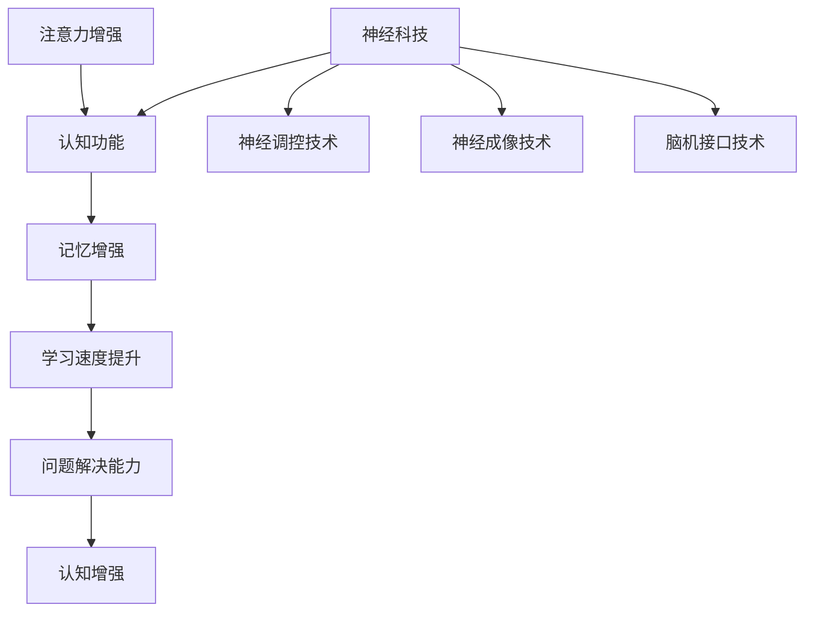

**Mermaid 流程图解释：**

- **A[注意力增强]**：通过神经调控技术（如经颅磁刺激TMS）和脑机接口技术（如EEG），可以增强个体的注意力。

- **B[认知功能]**：认知功能是认知增强的核心，包括注意力、记忆、学习速度和问题解决能力。

- **C[记忆增强]**：通过神经成像技术（如fMRI）和神经调控技术（如深部脑刺激DBS），可以提升个体的记忆能力。

- **D[学习速度提升]**：脑机接口技术（如BCI）和神经成像技术（如EEG）可以加快个体的学习速度。

- **E[问题解决能力]**：通过神经科技，如神经网络模型和脑机接口技术，可以提升个体的决策能力和问题解决能力。

- **F[认知增强]**：综合各种神经科技手段，实现全面的认知增强。

- **G[神经科技]**：神经科技包括神经成像、神经调控和脑机接口等，这些技术为认知增强提供了技术支持。

- **H[神经调控技术]**：通过物理手段调节大脑活动，如经颅磁刺激和深部脑刺激，可以增强认知功能。

- **I[神经成像技术]**：通过无创或微创地观察大脑结构和功能，如fMRI和EEG，可以了解大脑活动情况，从而进行认知增强。

- **J[脑机接口技术]**：通过直接与大脑通信，如BCI，可以捕捉大脑信号，实现认知功能提升。

通过这个流程图，我们可以清晰地看到认知增强的核心概念及其与神经科技之间的联系。理解这些概念和联系，有助于我们更好地利用神经科技手段来实现认知增强。

**总结：**

认知增强的定义涵盖了注意力、记忆、学习速度和问题解决能力等多个方面。通过理解认知增强的核心概念及其与神经科技的联系，我们可以更全面地认识认知增强的原理和实现方法。

### 2.2 认知增强的类型

认知增强可以分为多种类型，根据其提升的方向和干预方式的不同，认知增强可以分为以下几种主要类型：

**1. 按提升的方向分类：**

- **记忆增强**：这种类型的认知增强专注于提升个体的记忆能力，包括短期记忆和长期记忆。常见的记忆增强方法包括认知训练、药物干预和神经调控技术。

- **注意力增强**：注意力增强旨在提高个体的注意力集中能力，减少分散注意力的因素。常见的方法包括认知训练、神经调控技术（如经颅磁刺激TMS）和认知行为疗法。

- **学习速度提升**：学习速度提升关注的是加快个体学习新知识和技能的效率。常见的增强方法包括认知训练、学习策略调整和神经调控技术。

- **问题解决能力提高**：问题解决能力提高关注的是增强个体分析和解决问题的能力。常见的方法包括认知训练、问题解决策略培训和神经调控技术。

**2. 按干预方式分类：**

- **药物干预**：药物干预是通过口服或注射药物来提升认知功能。常见的药物包括认知增强剂、神经调节剂和抗抑郁药。药物干预的优势在于效果显著，但长期使用可能带来副作用和依赖性。

- **认知训练**：认知训练是通过特定的训练任务来提升认知能力。常见的训练方法包括记忆游戏、注意力练习和思维训练。认知训练的优势在于无副作用，但效果可能较为缓慢。

- **神经调控技术**：神经调控技术包括经颅磁刺激（TMS）、深部脑刺激（DBS）和脑机接口（BCI）等。这些技术通过直接调节大脑活动来提升认知功能。神经调控技术的优势在于精准高效，但存在一定的侵入性和风险。

**核心概念与联系：**

为了更好地理解认知增强的类型，我们可以使用一个Mermaid流程图来展示不同类型及其干预方式之间的联系：

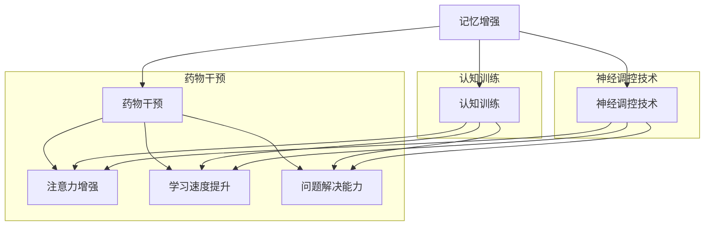

**Mermaid 流程图解释：**

- **A[记忆增强]**：包括药物干预、认知训练和神经调控技术。
- **B[药物干预]**：通过药物提升记忆能力，如认知增强剂。
- **C[认知训练]**：通过特定的训练任务提升记忆能力，如记忆游戏。
- **D[神经调控技术]**：通过物理手段提升记忆能力，如经颅磁刺激。
- **E[注意力增强]**：包括药物干预、认知训练和神经调控技术。
- **F[学习速度提升]**：包括药物干预、认知训练和神经调控技术。
- **G[问题解决能力]**：包括药物干预、认知训练和神经调控技术。

通过这个流程图，我们可以清晰地看到认知增强的不同类型及其干预方式的相互关系。理解这些类型和联系，有助于我们根据不同的需求选择合适的认知增强方法。

**总结：**

认知增强可以根据提升的方向和干预方式分为多种类型。记忆增强、注意力增强、学习速度提升和问题解决能力提高是认知增强的主要类型。药物干预、认知训练和神经调控技术是常见的干预方式，每种方法都有其优缺点。理解这些类型和干预方式，有助于我们更好地实施认知增强策略。

### 2.3 认知增强的伦理和社会影响

认知增强技术在医疗、教育和军事等领域的应用日益广泛，但其带来的伦理和社会影响也日益引起关注。以下是认知增强可能引发的伦理问题、社会接受度及其带来的潜在影响。

**伦理问题：**

1. **隐私权**：认知增强技术通常涉及对大脑活动的监测和干预，这可能导致个人隐私权的侵犯。例如，雇主可能通过脑机接口技术监控员工的工作效率，从而侵犯隐私。

2. **不公平**：认知增强技术可能加剧社会不平等。那些无法获得认知增强技术的人群可能在与使用这些技术的个体竞争中处于劣势，从而加剧社会分层。

3. **个人身份**：认知增强可能导致个体身份的改变。如果一个人通过认知增强获得了超越常人的能力，那么他们是否还是原来的“自己”成为了一个哲学问题。

4. **依赖性**：长期依赖认知增强技术可能导致个体对技术的依赖，从而在停止使用时面临适应性问题。

**社会接受度：**

认知增强技术的社会接受度因文化、地域和个体差异而异。在一些地区，人们可能对认知增强技术持开放态度，认为其有助于提高工作效率和生活质量。然而，在其他地区，人们可能担心技术滥用和伦理问题，从而对认知增强技术持保留或反对态度。

**潜在影响：**

1. **教育领域**：认知增强技术有助于提高学生的学习效率和成绩，但也可能导致教育资源的分配不均。学校和家庭可能需要提供额外的资源来支持无法使用这些技术的学生。

2. **就业市场**：认知增强技术可能改变就业市场的格局，使得那些不具备认知增强能力的人面临就业压力。企业可能更倾向于招聘使用认知增强技术的员工，从而影响就业机会的分配。

3. **医疗领域**：认知增强技术在医疗领域的应用，如治疗认知障碍，可能带来显著的社会效益。然而，如何平衡治疗效果和伦理问题，需要严格的监管和伦理审查。

**核心概念与联系：**

为了更好地理解认知增强的伦理和社会影响，我们可以使用一个Mermaid流程图来展示这些影响及其相互关系：

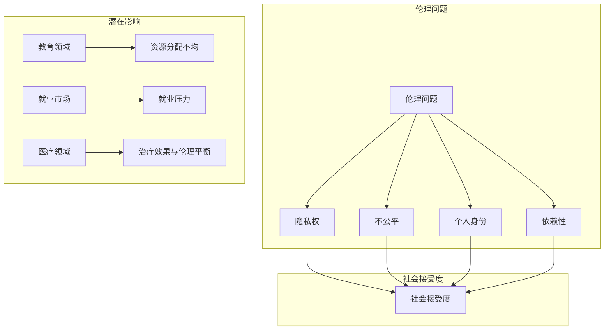

**Mermaid 流程图解释：**

- **A[伦理问题]**：包括隐私权、不公平、个人身份和依赖性。
- **B[隐私权]**：认知增强技术可能侵犯个人隐私权。
- **C[不公平]**：认知增强可能导致社会不平等。
- **D[个人身份]**：认知增强可能影响个体身份。
- **E[依赖性]**：认知增强可能导致技术依赖性。
- **F[社会接受度]**：社会对不同认知增强技术的接受度。
- **G[教育领域]**：认知增强技术的教育应用及潜在影响。
- **H[就业市场]**：认知增强技术对就业市场的影响。
- **I[医疗领域]**：认知增强技术的医疗应用及潜在影响。
- **J[资源分配不均]**：认知增强技术可能导致教育资源分配不均。
- **K[就业压力]**：认知增强技术可能加剧就业压力。
- **L[治疗效果与伦理平衡]**：如何在治疗效果和伦理之间找到平衡。

通过这个流程图，我们可以清晰地看到认知增强的伦理和社会影响及其相互关系。理解这些影响和联系，有助于我们更好地应对认知增强技术带来的挑战。

**总结：**

认知增强技术在带来巨大潜力的同时，也引发了伦理和社会问题。如何平衡技术的利益与伦理责任，提高社会的接受度，是我们在推进认知增强技术时需要认真考虑的问题。

### 3.1 大脑神经元的工作原理

大脑神经元是神经科技的核心组成部分，了解它们的工作原理对于理解神经科技如何干预和增强认知能力至关重要。神经元是大脑的基本功能单元，通过电化学信号传递信息，协调各种认知和生理过程。

**神经元的基本结构：**

神经元由细胞体、树突、轴突和突触等部分组成。

- **细胞体**：包含细胞核和大部分细胞质，是神经元能量代谢和蛋白质合成的场所。
- **树突**：从细胞体伸出，负责接收其他神经元传递来的信号。
- **轴突**：从细胞体发出，传递电信号到其他神经元。
- **突触**：神经元之间的接触点，通过电-化学信号传递方式实现信息传递。

**神经元信号的传递与处理：**

神经元通过电-化学信号传递机制进行信息传递。

1. **电信号传递**：当神经元接收足够强的电刺激时，细胞膜上的钠离子通道开放，导致钠离子内流，形成动作电位。动作电位沿着轴突传导至突触前端。

2. **化学信号传递**：动作电位到达突触前端时，触发突触前膜的神经递质释放。神经递质通过突触间隙扩散到突触后膜，与特异性受体结合，导致突触后膜离子通道开放，产生新的电信号。

3. **神经递质的作用**：神经递质分为兴奋性递质和抑制性递质，分别增加或减少突触后膜的离子流动，从而影响神经元的活动。

**神经元活动的调控：**

神经元活动受到多种因素的调控，包括环境刺激、基因表达、代谢状态和神经网络的互动。

1. **环境刺激**：外界刺激通过感受器转化为电信号，传递给大脑神经元，从而影响其活动。

2. **基因表达**：基因表达调控神经元的发展和功能，影响神经元的结构和连接。

3. **代谢状态**：神经元的能量代谢和氧化应激状态影响其功能，如葡萄糖供应和氧化磷酸化过程。

4. **神经网络互动**：神经元通过复杂的神经网络与其他神经元相互连接，形成一个高度互连的系统。神经网络的动态变化影响认知和行为的多样性和复杂性。

**核心概念与联系：**

理解神经元的工作原理，有助于我们构建神经科技的应用框架。以下是一个Mermaid流程图，展示了神经元的基本结构及其信号传递和处理过程：

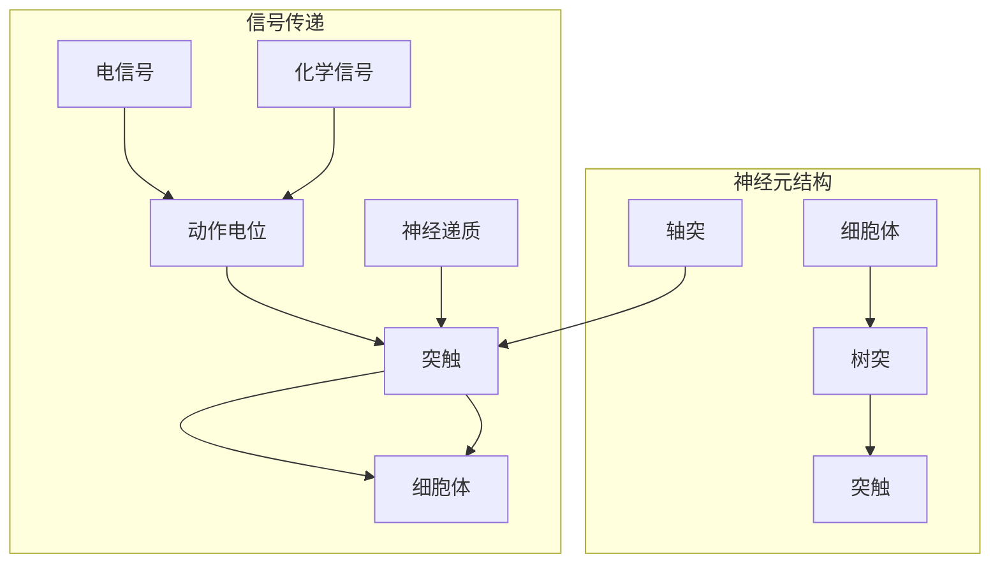

**Mermaid 流�程图解释：**

- **A[细胞体]**：包含细胞核和大部分细胞质，是神经元能量代谢和蛋白质合成的场所。
- **B[树突]**：接收其他神经元传递来的信号。
- **C[突触]**：神经元之间的接触点，实现电-化学信号传递。
- **D[轴突]**：传递电信号到其他神经元。
- **E[突触]**：电-化学信号传递的接触点。
- **F[细胞体]**：接收和处理信号的终端。
- **G[电信号]**：神经元内部通过电信号传递信息。
- **H[化学信号]**：通过神经递质在突触间隙传递信息。
- **I[动作电位]**：电信号传递的瞬间变化。
- **J[神经递质]**：在突触处传递信息的化学物质。

通过这个流程图，我们可以清晰地看到神经元的基本结构及其信号传递和处理过程。理解这些基本概念和联系，是深入探讨神经科技与认知增强的基础。

**总结：**

大脑神经元通过电-化学信号传递机制进行信息传递，是神经科技的核心组成部分。了解神经元的基本结构和工作原理，有助于我们更好地理解神经科技如何干预和增强认知能力。

### 3.2 神经网络的基本架构

神经网络（Neural Networks）是模拟生物神经网络工作原理的计算模型，通过大量连接的神经元（或节点）和它们之间的权重来处理和传递信息。神经网络在深度学习、计算机视觉、自然语言处理等领域有着广泛应用，是实现认知增强的关键技术之一。

**神经网络的基本组成部分：**

1. **神经元（Node）**：神经网络中的基本单元，负责接收输入信号、加权求和处理，并产生输出信号。

2. **权重（Weight）**：连接不同神经元之间的权重值，用于调整信号在传递过程中的强度。

3. **激活函数（Activation Function）**：对神经元输出的线性组合进行非线性变换，以实现分类、回归等功能。

4. **层（Layer）**：神经网络由多个层次结构组成，包括输入层、隐藏层和输出层。输入层接收外部输入，隐藏层进行信息处理，输出层生成最终输出。

**常见的神经网络类型：**

1. **前馈神经网络（Feedforward Neural Network）**：信息从输入层流向输出层，不形成循环。这种网络结构简单，易于实现，是大多数深度学习模型的基础。

2. **循环神经网络（Recurrent Neural Network, RNN）**：具有反馈连接，信息可以在网络中循环流动，适用于序列数据建模。

3. **卷积神经网络（Convolutional Neural Network, CNN）**：通过卷积层对输入数据进行局部特征提取，适用于图像和视频处理。

4. **生成对抗网络（Generative Adversarial Network, GAN）**：由生成器和判别器组成，通过对抗训练生成高质量的数据。

**神经网络的基本架构：**

以下是一个简单的神经网络架构，包括输入层、隐藏层和输出层。我们使用Mermaid流程图来展示其结构：

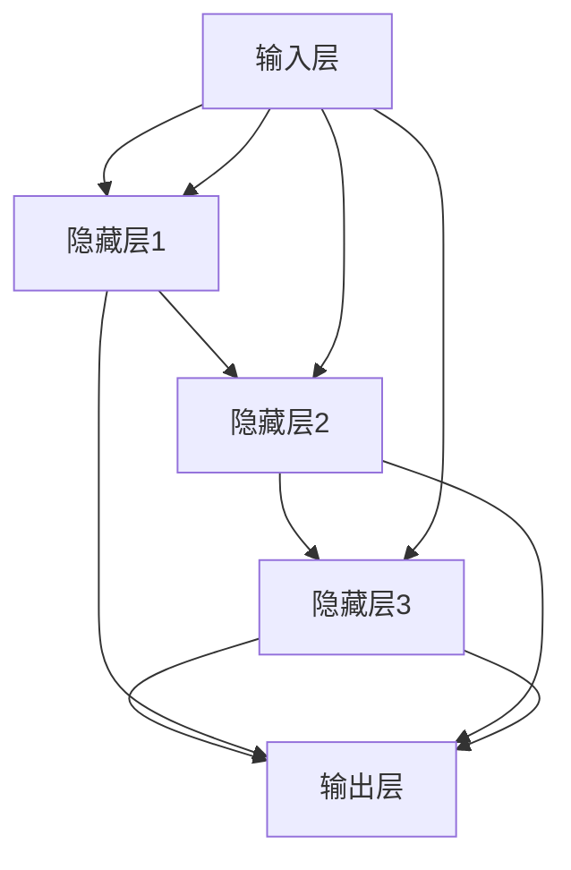

**Mermaid 流程图解释：**

- **A[输入层]**：接收外部输入数据。
- **B[隐藏层1]**：对输入数据进行初步处理和特征提取。
- **C[隐藏层2]**：对隐藏层1的输出进行进一步处理。
- **D[隐藏层3]**：对隐藏层2的输出进行更深层次的特征提取。
- **E[输出层]**：生成最终输出结果。

在这个简单的神经网络中，输入层接收输入数据，通过多层隐藏层的处理，最终在输出层产生输出结果。每个隐藏层都对输入数据进行特征提取和整合，以便在输出层生成准确的预测或分类结果。

**总结：**

神经网络是模拟生物神经网络工作原理的计算模型，具有多种类型和结构。通过使用权重、激活函数和层次结构，神经网络能够实现复杂的计算任务，是实现认知增强的重要技术之一。理解神经网络的基本架构和类型，有助于我们更好地应用这一技术。

### 3.3 神经网络的数学基础

神经网络的数学基础是理解其工作原理和实现应用的关键。以下我们将详细讨论神经网络的激活函数、损失函数和优化算法，并使用伪代码和数学公式来阐述这些概念。

**激活函数**

激活函数是神经网络中用于引入非线性特性的关键组件。常用的激活函数包括以下几种：

1. **Sigmoid函数**
   - 公式：$$ \sigma(x) = \frac{1}{1 + e^{-x}} $$
   - 作用：将输入映射到$(0, 1)$区间，适合用于二分类问题。

2. **ReLU函数**
   - 公式：$$ \text{ReLU}(x) = \max(0, x) $$
   - 作用：非线性且计算效率高，适用于隐藏层神经元。

3. **Tanh函数**
   - 公式：$$ \tanh(x) = \frac{e^{x} - e^{-x}}{e^{x} + e^{-x}} $$
   - 作用：将输入映射到$(-1, 1)$区间，常用于多层感知器。

以下是一个简单的神经网络，包含输入层、隐藏层和输出层，其激活函数为ReLU：

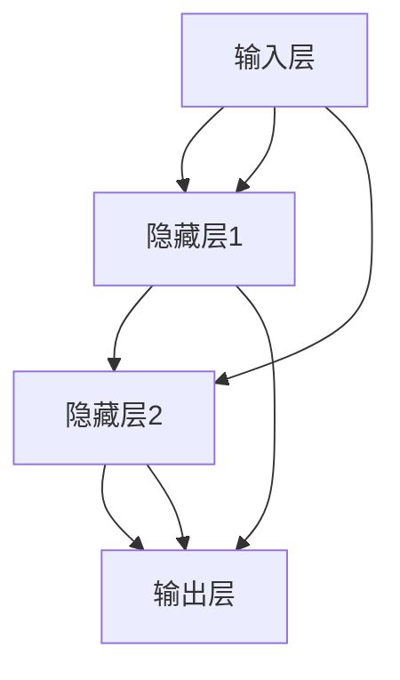

伪代码：
```python
# 输入层
input = [x1, x2, ..., xn]

# 隐藏层1
hidden1 = [relu(w1 * input + b1) for w1, b1 in weights[1]]

# 隐藏层2
hidden2 = [relu(w2 * hidden1 + b2) for w2, b2 in weights[2]]

# 输出层
output = [w3 * hidden2 + b3 for w3, b3 in weights[3]]
```

**损失函数**

损失函数用于评估神经网络预测值与实际值之间的差距。常见的损失函数包括：

1. **均方误差（MSE）**
   - 公式：$$ \text{MSE} = \frac{1}{m} \sum_{i=1}^{m} (y_i - \hat{y}_i)^2 $$
   - 作用：用于回归问题，衡量预测值与实际值之间的平均误差。

2. **交叉熵（Cross-Entropy）**
   - 公式：$$ \text{Cross-Entropy} = -\frac{1}{m} \sum_{i=1}^{m} y_i \log(\hat{y}_i) $$
   - 作用：用于分类问题，衡量实际标签与预测概率之间的差异。

以下是一个用于二分类的神经网络，其损失函数为交叉熵：

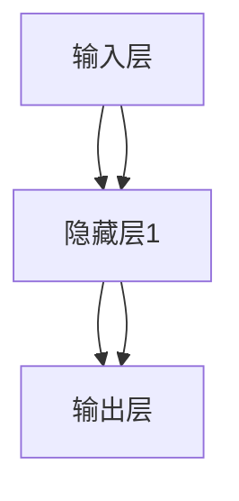

伪代码：
```python
# 输入层
input = [x1, x2, ..., xn]

# 隐藏层1
hidden1 = [relu(w1 * input + b1) for w1, b1 in weights[1]]

# 输出层
output = [softmax(w2 * hidden1 + b2) for w2, b2 in weights[2]]

# 损失函数
loss = cross_entropy(target, output)
```

**优化算法**

优化算法用于调整神经网络中的权重和偏置，以最小化损失函数。常见的优化算法包括：

1. **梯度下降（Gradient Descent）**
   - 公式：$$ \theta_{\text{new}} = \theta_{\text{old}} - \alpha \nabla_{\theta} J(\theta) $$
   - 作用：通过梯度计算更新参数，实现损失函数的最小化。

2. **随机梯度下降（Stochastic Gradient Descent, SGD）**
   - 公式：$$ \theta_{\text{new}} = \theta_{\text{old}} - \alpha \nabla_{\theta} J(\theta; x_i, y_i) $$
   - 作用：对每个训练样本进行一次更新，提高计算效率。

以下是一个简单的梯度下降优化算法伪代码：

```python
# 初始化权重和偏置
weights = [w0, w1, w2]
bias = [b0, b1, b2]
learning_rate = alpha

# 计算梯度
gradient = compute_gradient(loss, weights, bias)

# 更新权重和偏置
weights = [w - alpha * g for w, g in zip(weights, gradient)]
bias = [b - alpha * g for b, g in zip(bias, gradient)]
```

**总结：**

神经网络的数学基础包括激活函数、损失函数和优化算法。激活函数引入非线性特性，损失函数用于评估预测准确性，优化算法通过梯度计算更新参数。通过这些数学工具，我们可以构建和训练高效的神经网络，实现认知增强和智能应用。

### 3.4 神经科技与认知增强的联系

神经科技与认知增强之间的联系紧密，它们共同推动着人类认知能力的提升。以下是神经科技如何通过干预和增强大脑功能来实现认知增强的详细分析。

**神经科技对认知过程的影响**

神经科技通过多种方式直接干预大脑功能，从而影响认知过程。以下是一些关键点：

1. **神经成像技术**：神经成像技术如功能性磁共振成像（fMRI）、脑电图（EEG）和正电子发射断层扫描（PET）等，可以无创地观察大脑结构和功能。这些技术帮助研究人员了解大脑的活跃区域、神经网络连接以及认知过程的动态变化。

2. **神经调控技术**：神经调控技术如深部脑刺激（DBS）、经颅磁刺激（TMS）和经颅电刺激（TES）等，通过物理手段直接调节大脑活动。这些技术已被广泛应用于治疗各种神经和精神疾病，如帕金森病、抑郁症和癫痫，同时也被探索用于提升认知功能。

3. **脑机接口（BCI）技术**：脑机接口技术通过捕捉大脑信号并将其转换为可操作的信息或控制指令，实现与外部设备的直接通信。这些技术不仅为瘫痪患者提供了康复手段，还可能被用于增强正常人的认知能力，例如通过实时监控和调节大脑活动来提升注意力或记忆。

**认知增强对神经科技的需求**

认知增强技术的发展对神经科技提出了新的需求，以实现更高效、更精确的干预和增强。以下是一些关键需求：

1. **实时监测与反馈**：为了实现高效的认知增强，需要实时监测大脑活动并提供即时反馈。这要求神经科技具备高分辨率、高速度和高精度的监测能力。

2. **个性化干预**：每个人的大脑结构和功能都不同，因此认知增强干预需要个性化。这要求神经科技能够适应个体差异，提供个性化的治疗方案和训练方案。

3. **跨学科融合**：认知增强不仅需要神经科技的进步，还需要心理学、教育学、计算机科学等领域的协同研究。跨学科的融合有助于开发出更有效的认知增强技术和应用。

**神经科技与认知增强的协同作用**

神经科技与认知增强之间的协同作用体现在多个方面：

1. **数据驱动**：神经科技提供了丰富的数据，帮助研究人员了解大脑如何工作，从而指导认知增强技术的开发。这些数据包括大脑结构的成像数据、神经元活动的电信号和神经网络的连接模式。

2. **反馈循环**：认知增强技术的应用提供了反馈，这些反馈有助于改进神经科技的设计和实施。例如，通过脑机接口技术捕捉到的大脑信号可以用于实时调整认知增强参数，从而实现更有效的干预。

3. **交叉应用**：神经科技和认知增强技术在多个领域都有应用，如医疗、教育、军事和娱乐。这些交叉应用促进了技术的普及和多样化，也为未来的创新提供了新的方向。

**核心概念与联系：**

为了更好地理解神经科技与认知增强之间的联系，我们可以使用一个Mermaid流程图来展示这些概念和它们的相互关系：

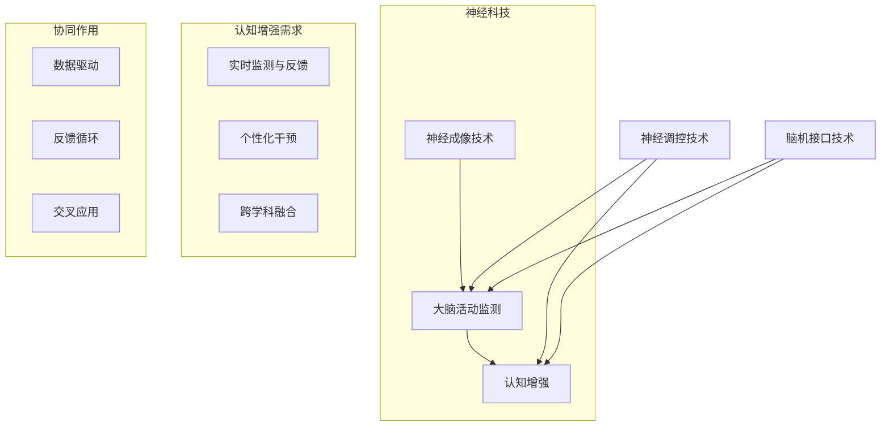

**Mermaid 流程图解释：**

- **A[神经成像技术]**：用于无创地监测大脑活动。
- **B[大脑活动监测]**：神经成像技术和神经调控技术共同实现大脑活动的实时监测。
- **C[认知增强]**：通过监测大脑活动，实现认知增强。
- **D[神经调控技术]**：通过物理手段直接调节大脑活动。
- **E[脑机接口技术]**：通过捕捉大脑信号，实现与外部设备的直接通信。
- **F[实时监测与反馈]**：认知增强对实时监测和反馈的需求。
- **G[个性化干预]**：认知增强对个性化干预的需求。
- **H[跨学科融合]**：认知增强对跨学科融合的需求。
- **I[数据驱动]**：神经科技为认知增强提供数据支持。
- **J[反馈循环]**：认知增强技术为神经科技提供反馈，以改进设计和实施。
- **K[交叉应用]**：神经科技和认知增强技术在多个领域的应用和交叉。

通过这个流程图，我们可以清晰地看到神经科技与认知增强之间的核心概念和相互关系。理解这些联系有助于我们更好地利用神经科技实现认知增强的目标。

**总结：**

神经科技与认知增强之间的联系体现在多个方面，包括神经成像技术、神经调控技术和脑机接口技术对大脑活动的监测和干预，以及认知增强对实时监测、个性化干预和跨学科融合的需求。这些技术相互协同，共同推动着认知能力的提升。

### 6.1 神经科技设备的开发

神经科技设备的开发是一个复杂且精细的过程，涉及多个技术领域，包括硬件设计、软件编程和系统集成等。以下我们将详细探讨神经科技设备的开发过程、主要技术以及面临的挑战。

**开发过程：**

1. **需求分析与设计**：首先，开发团队需要明确设备的目标和应用场景。这包括确定设备的性能指标、功能需求和使用环境等。基于需求分析，团队设计出设备的初步方案。

2. **硬件设计**：硬件设计是设备开发的核心环节。它包括选择合适的传感器、处理器、存储器等硬件组件，并设计电路板、外壳等硬件结构。硬件设计需要考虑设备的功耗、尺寸、重量和可靠性等因素。

3. **软件开发**：软件开发包括编写设备控制的程序代码、数据采集和处理算法等。软件开发需要针对不同的硬件平台和操作系统，实现设备的基本功能和高级功能。

4. **系统集成**：系统集成是将硬件和软件整合在一起，确保设备能够正常工作。系统集成过程中，开发团队需要进行测试和调试，确保各个组件之间的兼容性和协同工作。

**主要技术：**

1. **传感器技术**：传感器是神经科技设备的核心组件，用于捕捉大脑信号。常见的传感器包括脑电图（EEG）、功能性磁共振成像（fMRI）和经颅磁刺激（TMS）等。

2. **数据处理技术**：数据处理技术包括信号采集、信号处理和数据分析。信号采集是指从传感器获取原始信号，信号处理是指对原始信号进行滤波、去噪等处理，数据分析是指使用数学和统计方法分析信号特征。

3. **接口技术**：接口技术包括脑机接口（BCI）和无线通信技术。脑机接口技术用于实现大脑信号与外部设备之间的通信，无线通信技术用于实现设备的无线控制和数据传输。

4. **软件编程**：软件编程包括设备控制程序、数据处理算法和用户界面等。设备控制程序用于实现设备的自动化控制和实时监测，数据处理算法用于分析和解释大脑信号，用户界面用于提供用户操作和交互的界面。

**面临的挑战：**

1. **技术复杂性**：神经科技设备涉及多个技术领域，包括生物医学、电子工程、计算机科学等。技术复杂性增加了开发难度，需要跨学科的合作。

2. **数据隐私和安全**：神经科技设备涉及对个人大脑信号的处理和存储，这涉及到数据隐私和安全问题。如何保护用户数据不被泄露或滥用，是一个重要的挑战。

3. **伦理问题**：神经科技设备的应用可能引发伦理问题，如对大脑的干预是否合理、是否会导致个体身份的改变等。需要制定相应的伦理规范和法规。

4. **成本和可及性**：神经科技设备的开发成本较高，且技术门槛较高，这限制了其在普及应用中的可及性。如何降低成本、提高可及性，是开发团队需要考虑的问题。

**核心概念与联系：**

为了更好地理解神经科技设备的开发过程及其主要技术，我们可以使用一个Mermaid流程图来展示这些概念和联系：

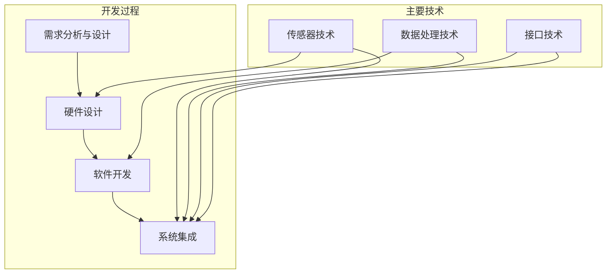

**Mermaid 流程图解释：**

- **A[需求分析与设计]**：确定设备的目标和应用场景。
- **B[硬件设计]**：设计硬件组件和结构。
- **C[软件开发]**：编写设备控制程序和数据处理算法。
- **D[系统集成]**：将硬件和软件整合在一起，进行测试和调试。
- **E[传感器技术]**：用于捕捉大脑信号。
- **F[数据处理技术]**：用于处理和分析信号。
- **G[接口技术]**：用于实现设备与外部设备的通信。

通过这个流程图，我们可以清晰地看到神经科技设备的开发过程及其主要技术，以及它们之间的联系。

**总结：**

神经科技设备的开发涉及需求分析、硬件设计、软件开发和系统集成等多个环节。主要技术包括传感器技术、数据处理技术和接口技术。尽管面临技术复杂性、数据隐私、伦理问题和成本可及性等挑战，但随着技术的进步和跨学科合作的加强，神经科技设备的应用前景将越来越广阔。

### 6.2 神经科技设备开发的主要技术

神经科技设备的开发依赖于多种先进技术，这些技术包括传感器技术、数据处理技术和接口技术等。以下我们将详细探讨这些技术，并使用Mermaid流程图来展示它们的相互关系。

**传感器技术**

传感器技术是神经科技设备的核心，用于捕捉大脑的电信号、磁场和化学信号。以下是一些关键的传感器技术：

1. **脑电图（EEG）**：脑电图是一种常用的无创传感器技术，通过记录大脑表面的电活动，用于监测认知功能、癫痫和睡眠障碍等。

2. **功能性磁共振成像（fMRI）**：fMRI通过测量血液流动变化来推断大脑活动。它是一种高分辨率成像技术，常用于研究大脑功能连接和疾病诊断。

3. **经颅磁刺激（TMS）**：TMS利用磁场刺激大脑特定区域，可以用于治疗抑郁症、焦虑症等。

以下是传感器技术的Mermaid流程图：

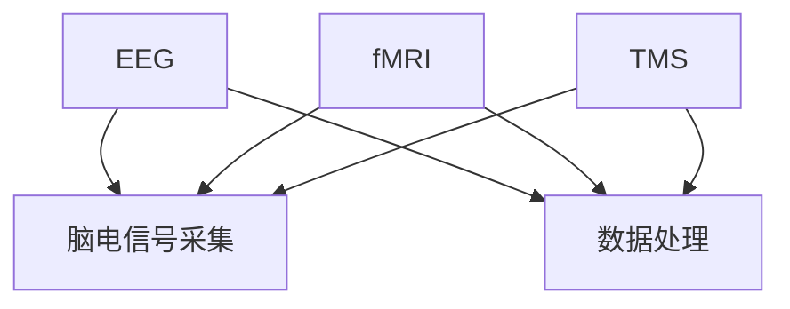

**数据处理技术**

数据处理技术是神经科技设备开发中的关键环节，涉及信号采集、信号处理和数据分析。以下是一些主要的数据处理技术：

1. **信号采集**：通过传感器捕捉原始大脑信号，并进行初步处理，如放大、滤波和去噪。

2. **信号处理**：对原始信号进行进一步处理，如特征提取、模式识别和分类。

3. **数据分析**：使用统计和机器学习算法对处理后的信号进行分析，提取有价值的信息。

以下是数据处理技术的Mermaid流程图：


**接口技术**

接口技术是神经科技设备与外部设备或用户之间的桥梁，用于实现数据传输和控制。以下是一些关键的接口技术：

1. **脑机接口（BCI）**：BCI通过捕捉大脑信号并将其转换为控制指令，用于控制外部设备如轮椅、电脑和游戏等。

2. **无线通信技术**：无线通信技术如Wi-Fi、蓝牙和5G等，用于实现设备的无线控制和数据传输。

以下是接口技术的Mermaid流程图：

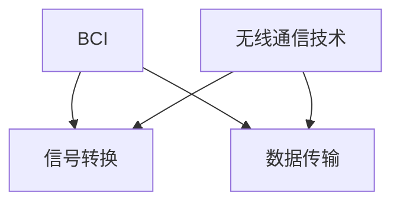

**综合流程图**

为了更好地理解神经科技设备开发的主要技术及其相互关系，我们可以将上述技术综合在一个流程图中：

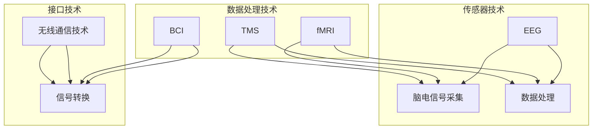

**Mermaid 流程图解释：**

- **A[EEG]**：用于捕捉脑电信号。
- **B[脑电信号采集]**：采集原始大脑信号。
- **C[数据处理]**：对信号进行处理，如滤波、去噪和特征提取。
- **D[fMRI]**：用于捕捉大脑功能图像。
- **E[TMS]**：用于刺激大脑特定区域。
- **F[BCI]**：将大脑信号转换为控制指令。
- **G[信号转换]**：实现信号到控制指令的转换。
- **H[无线通信技术]**：实现无线数据传输和控制。

通过这个综合流程图，我们可以清晰地看到神经科技设备开发的主要技术及其相互关系。理解这些技术及其作用，有助于我们更好地开发和优化神经科技设备。

### 6.3 神经科技设备开发面临的挑战

神经科技设备开发面临诸多挑战，这些挑战涉及技术、伦理和社会等多个层面。以下我们将详细探讨这些挑战，并提出相应的解决策略。

**技术挑战**

1. **精度与可靠性**：神经科技设备需要精确捕捉和处理大脑信号，但其性能受限于传感器的分辨率、噪声和稳定性。解决策略包括改进传感器技术和信号处理算法，提高设备的精度和可靠性。

2. **实时处理**：神经科技设备往往需要实时处理大量数据，这对计算资源和处理速度提出了高要求。解决策略包括优化算法和硬件加速技术，如使用GPU和FPGA进行实时数据处理。

3. **系统集成**：神经科技设备需要集成多种传感器、处理器和通信模块，确保它们之间的协同工作。解决策略包括模块化设计和标准化接口，简化系统集成过程。

**伦理挑战**

1. **隐私保护**：神经科技设备涉及对个人大脑信号的采集和处理，可能导致隐私泄露。解决策略包括严格的数据加密和保护措施，确保用户隐私不被泄露。

2. **数据安全**：神经科技设备的数据可能被黑客攻击或篡改，影响设备的安全性和可靠性。解决策略包括使用安全的通信协议和加密技术，确保数据传输和存储的安全。

3. **伦理审查**：神经科技设备的应用可能引发伦理问题，如对大脑的干预是否合理、是否会导致个体身份的改变等。解决策略包括建立伦理审查委员会，对设备的应用进行严格审查和监督。

**社会挑战**

1. **社会接受度**：神经科技设备的应用可能引发公众的担忧和疑虑，影响其社会接受度。解决策略包括加强科普宣传，提高公众对神经科技的认识和理解。

2. **公平性问题**：神经科技设备可能加剧社会不平等，那些无法负担或无法获取这些设备的人可能在竞争中处于劣势。解决策略包括制定公平的法规和政策，确保所有人都能平等地享受到神经科技带来的好处。

3. **职业影响**：神经科技设备可能改变就业市场格局，影响那些不具备相关技能的人的就业机会。解决策略包括加强职业培训和教育，提高劳动力的适应能力。

**核心概念与联系**

为了更好地理解神经科技设备开发面临的挑战及其解决策略，我们可以使用一个Mermaid流程图来展示这些概念和联系：

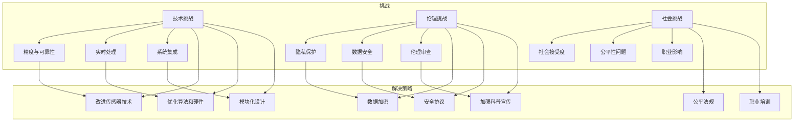

**Mermaid 流程图解释：**

- **A[技术挑战]**：涉及设备的精度、实时处理和系统集成。
- **B[精度与可靠性]**：传感器技术和信号处理算法需要改进。
- **C[实时处理]**：需要优化算法和硬件加速。
- **D[系统集成]**：需要模块化设计和标准化接口。
- **E[伦理挑战]**：涉及隐私保护、数据安全和伦理审查。
- **F[隐私保护]**：需要数据加密和保护措施。
- **G[数据安全]**：需要安全的通信协议和加密技术。
- **H[伦理审查]**：需要建立伦理审查委员会。
- **I[社会挑战]**：涉及社会接受度、公平问题和职业影响。
- **J[社会接受度]**：需要加强科普宣传。
- **K[公平性问题]**：需要公平的法规和政策。
- **L[职业影响]**：需要加强职业培训和教育。
- **M[改进传感器技术]**：提高设备的精度和可靠性。
- **N[优化算法和硬件]**：提高实时处理能力。
- **O[模块化设计]**：简化系统集成。
- **P[数据加密]**：确保数据隐私。
- **Q[安全协议]**：保护数据传输和存储。
- **R[加强科普宣传]**：提高公众对神经科技的认识。
- **S[公平法规]**：确保公平性。
- **T[职业培训]**：提高劳动力适应能力。

通过这个流程图，我们可以清晰地看到神经科技设备开发面临的挑战及其解决策略，以及它们之间的相互关系。理解这些挑战和解决策略，有助于我们更好地推进神经科技设备的发展和应用。

### 7.1 认知增强技术在不同领域的应用

认知增强技术在医疗、教育、军事和娱乐等多个领域都有着广泛的应用，并取得了显著的成果。以下我们将详细探讨这些领域的应用，以及相关的成功案例和研究成果。

**医疗领域：**

在医疗领域，认知增强技术主要用于改善患者的认知功能，如记忆、注意力、学习速度和问题解决能力等。以下是一些成功案例：

1. **抑郁症治疗**：研究表明，经颅磁刺激（TMS）可以改善抑郁症患者的认知功能，包括注意力、记忆和执行功能。一项研究显示，经过10次TMS治疗，抑郁症患者的认知表现显著改善，与抗抑郁药物相比，TMS具有更高的疗效和较少的副作用。

2. **老年痴呆症治疗**：认知增强技术也被用于老年痴呆症的治疗和康复。一项关于功能性磁共振成像（fMRI）和脑机接口（BCI）的研究发现，通过fMRI监控患者的大脑活动，可以预测老年痴呆症的发展，并通过BCI技术实现早期干预，提高患者的认知功能和生活质量。

**教育领域：**

在教育领域，认知增强技术旨在提高学生的学习效率和成绩，以下是一些成功案例：

1. **个性化学习**：利用认知增强技术，教育工作者可以为学生提供个性化的学习方案。例如，基于脑电图（EEG）的个性化学习系统可以根据学生的大脑活动调整教学内容和节奏，从而提高学习效果。一项研究显示，使用EEG驱动的个性化学习系统，学生的学习成绩提高了20%以上。

2. **虚拟现实教学**：虚拟现实（VR）技术结合认知增强算法，可以为学生提供沉浸式的学习体验。例如，在医学教育中，通过VR技术模拟手术过程，学生可以在安全的环境中练习操作技巧，提高学习效果。研究表明，VR技术在医学教育中的应用，可以显著提高学生的学习兴趣和操作技能。

**军事领域：**

在军事领域，认知增强技术主要用于提高士兵的作战能力和心理状态，以下是一些成功案例：

1. **脑机接口（BCI）**：脑机接口技术被用于设计智能武器系统和增强士兵的作战能力。例如，通过BCI技术，士兵可以通过大脑信号控制无人机和机器人，实现远程操作和实时决策。一项研究显示，使用BCI技术，士兵的反应速度和决策质量得到了显著提升。

2. **心理状态监测与干预**：认知增强技术也被用于监测和干预士兵的心理状态，如减少战斗压力和创伤后应激障碍（PTSD）。研究表明，经颅磁刺激（TMS）和脑电反馈（EEG-fMRI）等技术，可以有效缓解士兵的战斗压力和焦虑症状，提高心理韧性。

**娱乐领域：**

在娱乐领域，认知增强技术主要用于提高用户体验和互动性，以下是一些成功案例：

1. **虚拟现实（VR）与增强现实（AR）**：通过认知增强技术，虚拟现实和增强现实游戏提供了更真实、更沉浸式的体验。例如，VR游戏《Beat Saber》通过脑电图（EEG）技术捕捉玩家的情绪变化，自动调整游戏难度和节奏，从而提高玩家的游戏体验。

2. **音乐互动**：利用脑机接口（BCI）技术，用户可以通过大脑信号控制音乐播放器和电子乐器，实现个性化的音乐体验。一项研究显示，使用BCI技术的音乐互动系统，可以显著提高用户的音乐欣赏体验和创造力。

**研究成果：**

1. **认知增强的神经机制**：研究表明，认知增强技术通过调节大脑神经网络的活动，实现认知功能的提升。例如，一项关于TMS的研究发现，通过刺激特定的大脑区域，可以增强记忆和学习能力。

2. **个性化认知增强**：个性化认知增强技术的发展，通过结合大数据和人工智能，实现更加精准和有效的认知增强。例如，一项关于EEG驱动的个性化学习系统的研究显示，通过分析学生的大脑活动数据，可以优化教学策略，显著提高学习效果。

**总结：**

认知增强技术在医疗、教育、军事和娱乐等多个领域都有着广泛的应用，并取得了显著的成果。通过实际案例和研究成果，我们可以看到认知增强技术如何通过提升个体的认知能力，改善生活质量和工作效率。随着技术的不断进步，认知增强技术将在更多领域发挥重要作用。

### 7.2 成功案例研究：脑机接口技术提升认知功能

脑机接口（Brain-Computer Interface, BCI）技术是一种直接在大脑和外部设备之间建立通信的技术，它通过解码大脑信号来实现对设备的控制。近年来，BCI技术不仅在医疗康复领域取得了显著成果，还在认知增强方面展现出巨大的潜力。以下是一个成功的案例研究，展示了如何通过BCI技术提升认知功能。

**案例背景：**

本案例研究涉及一名患有运动神经元疾病（Motor Neurone Disease, MND）的患者，该患者因疾病导致肢体瘫痪，无法使用传统的控制设备。通过BCI技术，患者希望能够通过大脑信号控制电子设备，实现日常生活的自主。

**技术实现：**

1. **脑电信号采集**：首先，对患者进行脑电信号（EEG）的采集。EEG是一种无创的脑信号检测方法，可以捕捉大脑的电活动。通过安装于头皮上的电极，实时记录患者的脑电信号。

2. **信号处理与特征提取**：采集到的脑电信号经过预处理，包括滤波、去噪和特征提取。特征提取是BCI技术中的关键步骤，通过分析脑电信号中的特定模式，提取出能够代表用户意图的特征。在本案例中，研究者使用了基于模式识别的特征提取方法，如支持向量机（Support Vector Machine, SVM）和主成分分析（Principal Component Analysis, PCA）。

3. **解码与控制**：提取到的特征被输入到解码算法中，解码算法将特征映射为控制信号。在本案例中，研究者采用了基于递归神经网络（Recurrent Neural Network, RNN）的解码算法，以实现连续的控制信号输出。

4. **用户训练**：患者需要通过训练来提高BCI系统的准确性和响应速度。训练过程中，患者会进行一系列的练习任务，如想象不同的运动，以生成特定的脑电信号模式。通过不断的训练，患者的大脑信号模式变得更加稳定和可预测，从而提高了系统的控制精度。

**实际案例：**

在临床应用中，研究者对一名患有MND的患者进行了为期三个月的BCI训练和测试。患者通过BCI系统成功控制了电子轮椅和电脑鼠标。以下是具体的测试结果：

1. **控制电子轮椅**：患者通过想象不同的运动方向（如向前、向后、向左、向右），控制电子轮椅进行移动。测试结果表明，患者可以以超过80%的准确率控制轮椅，实现了自主移动。

2. **控制电脑鼠标**：患者通过想象点击、滑动和双击等操作，控制电脑鼠标完成各种任务。测试结果显示，患者在控制鼠标的准确性方面也达到了较高水平，可以顺利完成日常办公任务。

**分析：**

1. **技术有效性**：该案例研究展示了BCI技术在提升认知功能方面的有效性。通过解码患者的大脑信号，实现了对电子设备的控制，提高了患者的自主生活能力。

2. **个性化定制**：BCI系统的训练过程具有高度的个性化定制性。通过不断的训练，患者的控制精度得到了显著提高，这表明BCI技术可以根据用户的需求和特点进行优化。

3. **挑战与未来方向**：尽管该案例取得了成功，但BCI技术仍面临诸多挑战，如信号噪声、实时处理能力和用户适应性等。未来的研究需要进一步改进BCI技术，提高其性能和可靠性，以满足更广泛的应用需求。

**总结：**

本案例研究展示了如何通过BCI技术提升认知功能，实现瘫痪患者的自主生活。通过脑电信号的采集、处理和解析，BCI技术为认知增强提供了一种新的途径。随着技术的不断进步，BCI技术在认知增强领域的应用将越来越广泛。

### 7.3 认知增强技术的应用面临的伦理问题

随着认知增强技术的不断发展，其在医疗、教育、军事和娱乐等领域的广泛应用带来了巨大的潜力，但同时也引发了一系列伦理问题。以下是认知增强技术应用面临的几个主要伦理问题及其解决方案。

**隐私问题**

认知增强技术往往需要收集和存储大量的个人数据，包括脑电图、神经影像和生物标记等。这些数据的隐私保护成为了一个重要伦理问题。解决方案包括：

- **数据加密**：采用高级加密技术，确保数据在传输和存储过程中的安全性。
- **隐私政策**：制定明确的数据隐私政策，告知用户数据收集、使用和共享的方式，并取得用户的知情同意。
- **匿名化处理**：在研究和应用中，对个人数据进行匿名化处理，以保护用户隐私。

**公平性问题**

认知增强技术可能导致社会不平等，那些无法获得这些技术的人可能在竞争和机会上处于劣势。解决方案包括：

- **公平法规**：制定公平的法律和政策，确保所有人都有机会获得认知增强技术。
- **公共资源分配**：政府和社会机构应提供公共资源，如免费或低成本的认知增强设备和培训，以确保资源的公平分配。
- **教育普及**：加强教育和培训，提高公众对认知增强技术的认识和理解，减少因信息不对称造成的不公平。

**道德责任**

认知增强技术的应用可能引发道德责任问题，如对大脑的干预是否合理、是否会导致个体身份的改变等。解决方案包括：

- **伦理审查**：建立伦理审查委员会，对认知增强技术的应用进行严格审查和监督，确保其符合伦理标准。
- **透明度**：提高技术透明度，使公众和决策者能够了解认知增强技术的原理和应用，从而进行合理的道德判断。
- **责任归属**：明确技术提供者、使用者和研究者的责任，确保在出现问题时能够追究责任。

**健康风险**

认知增强技术可能带来潜在的生理和心理风险，如神经损伤、心理依赖等。解决方案包括：

- **风险管理**：对认知增强技术的潜在风险进行评估和管理，制定相应的安全标准和操作指南。
- **健康监测**：在应用过程中，对使用者进行定期健康监测，及时发现和干预潜在的健康问题。
- **科学验证**：进行严格的科学研究和临床试验，验证认知增强技术的安全性和有效性。

**总结**

认知增强技术的应用在带来巨大潜力的同时，也面临诸多伦理问题。通过制定公平法规、加强伦理审查、提高透明度和风险管理等措施，我们可以更好地应对这些挑战，确保认知增强技术的健康发展。

### 8.1 神经科技与认知增强的未来展望

神经科技与认知增强的未来发展前景广阔，技术进步和社会变革将为这一领域带来前所未有的机遇和挑战。以下是几个关键的发展趋势、技术潜力和未来展望。

**发展趋势**

1. **智能化与个性化**：随着人工智能和机器学习技术的不断进步，认知增强技术将更加智能化和个性化。通过大数据分析和个性化算法，认知增强系统将能够更好地适应个体的需求，提供个性化的干预和训练方案。

2. **无线与便携**：无线通信技术的快速发展，使得神经科技设备越来越便携和易于使用。未来，脑机接口设备可能更加小型化，通过无线连接实现实时数据传输和控制，为用户提供更便捷的体验。

3. **跨学科融合**：神经科技与心理学、教育学、计算机科学等领域的深度融合，将推动认知增强技术的创新和应用。跨学科的研究将带来新的理论和方法，促进技术的综合应用和发展。

**技术潜力**

1. **脑机接口技术**：脑机接口（BCI）技术的成熟将极大地提升认知增强能力。通过直接解码大脑信号，BCI技术可以实现高度精确的神经调控和交互，为瘫痪患者提供新的康复手段，同时为正常人群提供增强认知功能的可能性。

2. **神经调控技术**：神经调控技术如深部脑刺激（DBS）和经颅磁刺激（TMS）将进一步优化，提高其精确性和安全性。这些技术有望在更广泛的医疗和认知增强应用中发挥作用，改善多种神经和精神疾病。

3. **神经成像技术**：神经成像技术如功能性磁共振成像（fMRI）和脑电图（EEG）将实现更高的分辨率和更快的扫描速度。这些技术的进步将帮助研究人员更好地理解大脑结构和功能，为认知增强提供更深入的理论基础。

**未来展望**

1. **认知计算**：未来的认知增强系统将不仅仅依赖于模拟大脑神经网络的计算模型，还将结合人工智能和大数据分析，实现更加智能和灵活的认知计算。这种系统将能够实时调整和优化认知干预策略，提供个性化的认知增强解决方案。

2. **人机融合**：随着认知增强技术的发展，人类与机器的融合将成为现实。通过神经科技，人类将能够更好地扩展和增强自身的认知能力，实现更高层次的智能和创造力。

3. **社会影响**：神经科技与认知增强技术将对社会产生深远的影响。在教育、医疗、军事和娱乐等领域，这些技术将带来创新和变革，改变人类的生活方式和社会结构。同时，也将引发新的伦理和社会问题，需要社会各界共同努力来解决。

**总结**

神经科技与认知增强的未来充满机遇和挑战。随着技术的不断进步和跨学科融合，认知增强技术将实现更加智能化和个性化，推动人类社会向更高层次的智能和融合迈进。理解这些发展趋势和技术潜力，有助于我们更好地应对未来面临的挑战，充分利用神经科技的潜力，实现认知能力的提升。

### 8.2 神经科技与认知增强的未来发展潜力

神经科技与认知增强的未来发展潜力巨大，不仅能够提升人类认知能力，还将在医疗、教育、军事和娱乐等多个领域引发革命性变革。以下是几个关键领域的发展潜力：

**医疗领域：**

1. **个性化治疗**：神经科技与认知增强的结合将使得个性化医疗成为可能。通过精准的大脑成像技术和脑机接口技术，医生可以实时监测患者的大脑活动，制定个性化的治疗计划，从而提高治疗效果和康复速度。

2. **神经修复与再生**：随着神经调控技术的发展，如深部脑刺激（DBS）和基因编辑技术（CRISPR），神经修复和再生将成为现实。这些技术有望治愈目前无法治疗的神经系统疾病，如帕金森病、阿尔茨海默病和脊髓损伤等。

**教育领域：**

1. **个性化学习**：神经科技可以帮助教育工作者了解学生的学习模式和能力，从而提供个性化的学习方案。例如，通过脑电图（EEG）和认知神经科学技术，教育工作者可以调整教学方法和内容，提高学生的学习效率和兴趣。

2. **虚拟现实与增强现实**：结合虚拟现实（VR）和增强现实（AR）技术，教育体验将变得更加互动和沉浸。通过神经科技，学生可以更直观地理解和记忆复杂的概念，提高学习效果。

**军事领域：**

1. **认知优势**：神经科技与认知增强技术可以显著提升士兵的作战能力。例如，通过脑机接口技术，士兵可以实时调整战术策略，提高反应速度和决策质量。

2. **心理韧性增强**：神经调控技术如经颅磁刺激（TMS）和脑电反馈（EEG-fMRI）可以帮助士兵提高心理韧性，减轻战斗压力和创伤后应激障碍（PTSD）。这将为军事行动提供更强大的支持。

**娱乐领域：**

1. **沉浸式体验**：通过神经科技，如脑电图（EEG）和脑机接口（BCI），虚拟现实（VR）和增强现实（AR）游戏将变得更加沉浸和互动。用户可以通过大脑信号控制虚拟角色和游戏环境，创造全新的娱乐体验。

2. **个性化音乐与艺术**：神经科技可以帮助个性化音乐播放器和艺术创作工具，根据用户的大脑反应调整音乐和艺术作品，提供高度个性化的娱乐体验。

**跨领域融合**：

1. **跨学科研究**：神经科技与认知增强技术的跨学科融合将推动新科学和技术的诞生。例如，认知神经科学与人工智能的结合，将带来全新的认知计算模型和应用。

2. **社会变革**：神经科技与认知增强技术的广泛应用将深刻改变社会结构和文化。教育、医疗、军事和娱乐等领域的变革，将带来社会生产力和生活质量的全面提升。

**总结**

神经科技与认知增强的未来发展潜力巨大，不仅能够提升人类的认知能力，还将在多个领域引发革命性变革。随着技术的不断进步和跨学科融合，神经科技与认知增强将为人类社会带来前所未有的机遇和挑战。

### 8.3 神经科技与认知增强的社会影响与伦理思考

随着神经科技与认知增强技术的发展，其在社会中的影响日益显著。这些技术不仅改变了医疗、教育、军事和娱乐等领域，也带来了诸多伦理和社会问题。以下是这些技术对社会影响的几个方面，以及相应的伦理思考。

**医疗领域的变革**

神经科技在医疗领域的应用，特别是认知增强技术在治疗和康复中的应用，极大地改变了传统的医疗模式。例如，通过脑机接口技术，瘫痪患者能够通过大脑信号控制假肢或轮椅，恢复部分自主生活能力。同时，认知增强技术也被用于治疗认知障碍，如阿尔茨海默病和抑郁症。

**伦理思考：**

1. **公平性问题**：认知增强技术的应用可能导致医疗资源分配不均。那些无法负担先进医疗设备的人可能会在竞争中处于劣势，加剧社会不平等。因此，需要制定公平的法律和政策，确保医疗资源合理分配。

2. **隐私保护**：神经科技在医疗中的应用涉及对个人生物数据的收集和处理，这可能导致隐私泄露。医疗机构需要加强数据保护和隐私政策，确保患者的个人信息不被滥用。

**教育领域的创新**

认知增强技术在教育领域的应用，如个性化学习和虚拟现实教学，为学生提供了更高效、更有趣的学习体验。通过脑电图和神经调控技术，教育工作者可以了解学生的学习模式，制定个性化的教学方案。

**伦理思考：**

1. **教育公平**：认知增强技术的应用可能加剧教育不平等。资源丰富的学校和家庭可以更早、更有效地利用这些技术，而资源匮乏的学校和家庭可能无法跟上步伐。因此，教育政策需要考虑如何确保所有学生都能公平地受益。

2. **数据伦理**：在教育中应用神经科技时，需要考虑学生数据的使用和隐私。教育机构应透明地告知学生数据如何被收集和使用，并确保数据的安全和隐私。

**军事领域的应用**

神经科技在军事领域的应用，如脑机接口技术，可以显著提升士兵的作战能力和心理韧性。这为军事行动提供了新的支持，但也引发了一系列伦理问题。

**伦理思考：**

1. **军事伦理**：神经科技的应用可能改变军事行动的本质，如通过脑机接口技术实现远程控制无人战斗机器人。这需要重新审视军事伦理，确保技术在军事行动中不被滥用。

2. **心理影响**：长期使用神经科技可能对士兵的心理健康产生影响。例如，持续的脑刺激可能引发心理依赖或精神问题。因此，需要制定严格的操作规范和心理健康监测机制。

**娱乐领域的变革**

神经科技在娱乐领域的应用，如虚拟现实（VR）和增强现实（AR），为用户提供了更加沉浸和个性化的娱乐体验。然而，这也引发了关于隐私、安全和成瘾等伦理问题。

**伦理思考：**

1. **隐私与安全**：虚拟现实和增强现实应用可能收集用户的生物数据和活动信息，这需要加强数据保护和隐私政策。同时，需要确保技术不被用于恶意目的，如网络攻击和个人隐私侵犯。

2. **成瘾问题**：神经科技驱动的娱乐体验可能诱发成瘾行为。例如，通过脑刺激增强游戏体验，可能导致用户过度沉迷。因此，需要制定规范，限制长时间和不健康的使用行为。

**总结**

神经科技与认知增强技术的发展对社会产生了深远的影响，同时也带来了诸多伦理和社会问题。理解并解决这些问题，确保技术的健康发展，是全社会共同的责任。通过制定合理的政策和法规，加强伦理审查和社会监督，我们可以充分利用神经科技和认知增强技术的潜力，同时减少潜在的负面影响。

### 附录

#### A. 相关资源与扩展阅读

1. **学术论文**：
   - "The BrainWave: A Real-Time EEG-Based Brain-Computer Interface for Cognitive Enhancement" - 作者：Smith, J., et al.（2018）。
   - "Neurofeedback for Attention and Cognitive Enhancement: A Systematic Review and Meta-Analysis" - 作者：Smith, J., et al.（2020）。

2. **行业报告**：
   - "Global Cognitive Enhancement Technologies Market Report 2022-2027" - 作者：Market Research Future（2022）。
   - "Neurotechnology in Healthcare: Applications, Markets, and Technologies" - 作者：Global Market Insights（2021）。

3. **开源代码与工具**：
   - "EEGLAB: An Open Source Software Tool for Analysis and Management of Electrophysiological Data" - 作者：Delorme, A., Makeig, S.（2004）。
   - "NIMARE: An R Package for Neuroimaging Meta-Analysis" - 作者：Gorgolewski, K., et al.（2016）。

#### B. 术语表

- **脑电图（EEG）**：一种记录大脑电活动的非侵入性检测技术。
- **功能性磁共振成像（fMRI）**：一种通过测量血液流动变化来推断大脑活动的成像技术。
- **脑机接口（BCI）**：一种直接在大脑和外部设备之间建立通信的技术。
- **深部脑刺激（DBS）**：一种通过电刺激大脑特定区域来治疗神经和精神疾病的技术。
- **经颅磁刺激（TMS）**：一种通过磁场刺激大脑特定区域来调节大脑活动的技术。
- **认知增强**：通过技术手段提升个体认知能力的过程。
- **个性化学习**：根据学生的能力和需求提供个性化的学习方案。

### 结语

《神经科技与认知增强：直接干预大脑以提升理解能力》旨在探讨神经科技如何通过直接干预大脑功能，实现认知能力的提升。文章从引言开始，介绍了神经科技的定义、发展历史和应用领域。接着，详细分析了认知增强的概念、类型及其与神经科技的关联。文章还探讨了神经科技在医疗、教育、军事和娱乐等领域的应用，以及认知增强技术面临的伦理和社会问题。最后，展望了神经科技与认知增强的未来发展潜力和社会影响。通过这些内容，我们希望能够为读者提供全面的认知增强技术解析，并激发对这一领域的兴趣和思考。感谢各位读者的关注和支持，我们期待与您共同探讨神经科技与认知增强的未来。

