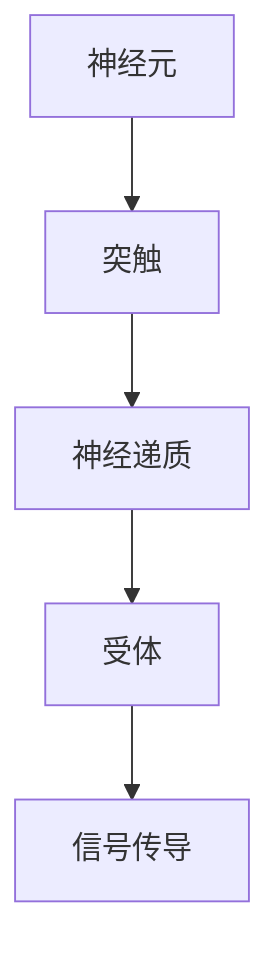

                 

### 文章标题：《神经药理学与认知增强：化学途径提升大脑理解能力》

#### 关键词：神经药理学，认知增强，化学途径，大脑理解，神经递质，受体，药物作用机制

> 摘要：本文旨在探讨神经药理学在认知增强领域的应用，通过分析化学途径对大脑理解能力的影响，揭示神经递质与受体之间的互动机制。文章首先介绍神经药理学的研究背景和意义，然后深入解析神经系统的基本结构和功能，探讨认知功能与神经药理学的关系。接着，文章详细阐述认知增强药物的化学原理、分类与应用，并分析其副作用与管理策略。最后，展望认知增强药物的未来发展，探讨其潜在的技术突破与社会挑战。

---

# 第1章 引言与背景

## 1.1 神经药理学的研究意义

神经药理学作为一门交叉学科，旨在研究药物与神经系统之间的相互作用。随着科技的进步和人们对大脑认知能力的日益重视，神经药理学在认知增强领域的应用显得尤为重要。

### 1.1.1 认知功能的重要性

认知功能是人类大脑的高级功能，包括注意力、记忆、思维、解决问题和语言能力等。这些功能在日常生活、学习和工作中起着至关重要的作用。因此，提高认知功能，尤其是老年人和脑损伤患者的认知功能，具有重要意义。

### 1.1.2 神经药理学的应用价值

神经药理学在认知增强方面的应用主要体现在以下几方面：

1. **治疗认知功能障碍**：通过药物干预改善注意力、记忆和认知能力，治疗阿尔茨海默病、抑郁症等认知功能障碍。

2. **提高学习效率**：研究开发能够增强学习记忆的药物，提高学习效率和工作表现。

3. **促进脑部康复**：针对脑损伤患者，开发促进脑部康复的药物，帮助患者恢复认知功能。

### 1.1.3 神经药理学的挑战

尽管神经药理学在认知增强领域具有巨大潜力，但同时也面临着诸多挑战：

1. **药物靶点识别**：找到能够有效调节神经递质和受体的药物靶点，实现精准治疗。

2. **药物副作用**：认知增强药物可能带来一定的副作用，需要在用药过程中进行严密监测和管理。

3. **个体差异**：不同个体的神经系统差异，导致对药物的反应不同，需要个性化治疗方案。

## 1.2 认知增强的需求与挑战

### 1.2.1 社会需求

随着全球人口老龄化的加剧，认知功能障碍成为一个日益严峻的社会问题。提高老年人的认知功能，对于延缓认知衰退、提高生活质量具有重要意义。

此外，随着信息技术的快速发展，学习和工作压力增大，人们对提高认知能力的需求也越来越强烈。因此，认知增强在年轻人群中也有着广阔的应用前景。

### 1.2.2 技术挑战

1. **药物研发**：药物研发是一个复杂且昂贵的过程，需要大量的时间和资源。在神经药理学领域，如何发现和开发有效的认知增强药物，是当前面临的一大挑战。

2. **药物筛选**：神经药理学的药物筛选过程需要克服许多难题，如药物的有效性、安全性、生物利用度等。

3. **个性化治疗**：由于个体差异，同一种药物在不同人身上可能产生不同的效果。因此，开发个性化治疗方案，实现精准治疗，是神经药理学领域的一个重要方向。

## 1.3 化学途径在认知增强中的应用前景

### 1.3.1 神经递质与认知功能

神经递质是神经元之间传递信息的化学物质，其在认知功能中发挥着重要作用。通过调节神经递质的水平，可以影响认知功能。例如，兴奋性神经递质如多巴胺和去甲肾上腺素，与注意力、学习和记忆密切相关。

### 1.3.2 受体调节与认知功能

神经递质通过作用于受体来传递信息。因此，调节受体的表达和活性，可以影响认知功能。例如，调节谷氨酸受体的活性，可以提高学习能力和记忆力。

### 1.3.3 化学途径的应用前景

1. **开发新型药物**：通过深入研究神经递质与受体的相互作用，可以开发出具有更高疗效和更低副作用的新型认知增强药物。

2. **个性化治疗**：利用基因编辑技术和药物筛选技术，可以开发个性化治疗方案，实现精准治疗。

3. **脑-机接口**：结合脑-机接口技术，通过药物调节大脑活动，实现与外部设备的交互，为认知增强开辟新的途径。

---

在本文的引言部分，我们首先阐述了神经药理学的研究意义，接着讨论了认知增强的需求与挑战，最后探讨了化学途径在认知增强中的应用前景。通过这些分析，为后续章节的内容奠定了基础。在下一章中，我们将深入探讨神经药理学的基础知识，包括神经系统的基本结构和功能，以及神经递质与受体的相互作用。

---

## 第2章 神经药理学基础

### 2.1 神经系统概述

#### 2.1.1 神经元结构与功能

神经元是神经系统的基本单元，其结构和功能决定了神经系统的运作方式。神经元的基本结构包括细胞体、树突、轴突和突触。

1. **细胞体**：细胞体是神经元的核心部分，包含细胞核和大部分细胞器。细胞体负责维持神经元的正常代谢和功能。

2. **树突**：树突是细胞体的一部分，负责接收其他神经元传递过来的神经信号。树突通过突触前端与目标神经元相连接，从而实现信息的传递。

3. **轴突**：轴突是神经元的另一个重要部分，负责将神经信号从细胞体传递到其他神经元、肌肉或腺体。轴突通常呈长条状，末端形成突触前端，与目标神经元相连接。

4. **突触**：突触是神经元之间传递信息的结构。当神经信号到达突触前端时，会通过释放神经递质传递到突触后端的受体上，从而影响目标神经元的活动。

#### 2.1.2 神经递质与受体

神经递质是神经元之间传递信息的化学物质。神经递质分为兴奋性递质和抑制性递质，分别具有增强或抑制神经元活动的功能。常见的神经递质包括多巴胺、去甲肾上腺素、乙酰胆碱、谷氨酸等。

受体是神经元表面上的蛋白质，负责接收神经递质并传递信号。根据神经递质的不同，受体分为多种类型，如NMDA受体、AMPA受体、GABA受体等。

#### 2.1.3 神经系统的调节机制

神经系统的调节机制包括神经元之间的信号传递、神经递质的释放与摄取、神经元的生长与再生等。

1. **信号传递**：神经元之间的信号传递主要通过突触完成。当神经信号到达突触前端时，神经递质会被释放到突触间隙，然后与突触后端的受体结合，引发细胞内的信号传导过程。

2. **神经递质的释放与摄取**：神经递质的释放与摄取是神经信号传递的关键环节。神经递质在突触前端以高浓度储存，当神经信号到达时，神经递质会被释放到突触间隙。释放后，神经递质会被酶分解或被重摄取回到突触前端，以便进行下一次信号传递。

3. **神经元的生长与再生**：神经元的生长与再生对于神经系统的恢复和再生具有重要意义。受损神经元的生长和再生可以通过多种机制实现，如轴突再生、神经突触再生等。

### 2.2 神经递质与认知功能的关系

神经递质在认知功能中发挥着重要作用。不同的神经递质对不同的认知功能具有不同的影响。

#### 2.2.1 多巴胺与注意力

多巴胺是一种兴奋性神经递质，与注意力、动机和奖励感受密切相关。多巴胺水平的增加可以增强注意力，提高学习效率和动机。因此，多巴胺在认知增强药物的研究中具有重要意义。

#### 2.2.2 去甲肾上腺素与记忆

去甲肾上腺素是一种兴奋性神经递质，与记忆、注意力和情绪密切相关。去甲肾上腺素水平的增加可以增强记忆，提高记忆的稳定性和持久性。因此，去甲肾上腺素在记忆增强药物的研究中具有潜在的应用价值。

#### 2.2.3 乙酰胆碱与认知灵活性

乙酰胆碱是一种抑制性神经递质，与认知灵活性、思维速度和语言能力密切相关。乙酰胆碱水平的增加可以增强认知灵活性，提高思维速度和语言表达能力。因此，乙酰胆碱在认知增强药物的研究中具有广泛的应用前景。

### 2.3 神经药理学与认知功能的关系

神经药理学在认知功能的研究和应用中具有重要意义。通过调节神经递质和受体的活性，可以改善认知功能，提高学习、记忆和注意力。

#### 2.3.1 药物对神经递质的影响

认知增强药物可以通过多种机制影响神经递质的活性，从而改善认知功能。例如，通过增加神经递质的释放、抑制神经递质的分解、调节受体的表达和活性等。

#### 2.3.2 药物对认知功能的影响

认知增强药物对认知功能的影响取决于药物的靶点和作用机制。例如，某些药物可以增强注意力，提高学习效率；另一些药物可以增强记忆，提高记忆的稳定性；还有一些药物可以增强认知灵活性，提高思维速度和语言表达能力。

### 2.4 神经药理学的研究方法

神经药理学的研究方法主要包括实验动物模型、细胞培养技术和分子生物学技术等。

#### 2.4.1 实验动物模型

实验动物模型是神经药理学研究的重要手段。通过建立不同类型的认知功能障碍模型，可以研究药物对认知功能的影响。

#### 2.4.2 细胞培养技术

细胞培养技术是神经药理学研究的重要工具。通过培养神经元细胞，可以研究药物对神经元细胞的功能和结构的影响。

#### 2.4.3 分子生物学技术

分子生物学技术是神经药理学研究的重要方法。通过基因编辑、蛋白质表达和信号通路分析等技术，可以深入研究药物对神经递质和受体的调节机制。

## 2.5 神经药理学的应用

神经药理学在认知增强、治疗认知功能障碍、促进脑部康复等领域具有广泛的应用。

#### 2.5.1 认知增强

神经药理学研究开发了一系列认知增强药物，如多巴胺激动剂、去甲肾上腺素再摄取抑制剂、乙酰胆碱酯酶抑制剂等。这些药物通过调节神经递质的活性，改善认知功能。

#### 2.5.2 认知功能障碍的治疗

神经药理学在认知功能障碍的治疗中发挥着重要作用。例如，阿尔茨海默病的治疗药物包括乙酰胆碱酯酶抑制剂和谷氨酸受体拮抗剂等。这些药物通过改善神经递质的功能，延缓疾病进展。

#### 2.5.3 脑部康复

神经药理学在脑部康复中具有潜在的应用价值。通过调节神经递质的活性，促进神经元的生长和再生，可以提高脑部康复的效果。

## 2.6 神经药理学的发展趋势

随着科技的进步，神经药理学在认知增强和治疗认知功能障碍领域取得了显著进展。未来，神经药理学的发展趋势包括：

#### 2.6.1 个性化治疗

利用基因编辑和药物筛选技术，实现个性化治疗方案，提高治疗效果。

#### 2.6.2 脑-机接口

结合脑-机接口技术，通过药物调节大脑活动，实现与外部设备的交互。

#### 2.6.3 新型药物研发

开发新型认知增强药物，提高疗效，降低副作用。

## 2.7 总结

神经药理学在认知增强领域具有重要的应用价值。通过调节神经递质和受体的活性，可以改善认知功能，提高学习、记忆和注意力。未来，神经药理学将继续在认知增强、治疗认知功能障碍和促进脑部康复等领域发挥重要作用。

---

在第二章中，我们详细介绍了神经系统的基本结构和功能，包括神经元、神经递质和受体等概念。我们还讨论了神经递质与认知功能的关系，以及神经药理学在认知功能调节中的作用。接下来，我们将深入探讨认知功能与神经药理学的具体关系，包括注意力、记忆和认知灵活性等。

---

## 第3章 认知功能与神经药理学关系

### 3.1 认知功能概述

认知功能是人类大脑的高级功能，包括注意力、记忆、思维、解决问题和语言能力等。这些功能在日常生活、学习和工作中起着至关重要的作用。

#### 3.1.1 注意力

注意力是指大脑对特定刺激的选择性关注和处理能力。注意力分为集中注意力和分散注意力。集中注意力是指将注意力集中在特定的任务或目标上，而分散注意力则是指将注意力分散到多个任务或目标上。

#### 3.1.2 记忆

记忆是大脑对信息的存储、保留和提取能力。记忆分为短期记忆和长期记忆。短期记忆是指对信息进行暂时存储的能力，而长期记忆则是指对信息进行持久存储的能力。

#### 3.1.3 认知灵活性

认知灵活性是指大脑在不同情境下灵活切换注意力和认知策略的能力。认知灵活性对于解决复杂问题和适应新环境具有重要意义。

### 3.2 神经药理学与认知功能的关系

神经药理学通过调节神经递质和受体的活性，可以影响认知功能。以下将详细讨论神经递质与认知功能之间的关系。

#### 3.2.1 神经递质与注意力

神经递质如多巴胺和去甲肾上腺素在注意力调节中起着关键作用。多巴胺主要与奖赏和动机相关，而去甲肾上腺素则与注意力和警觉性相关。

1. **多巴胺**：多巴胺水平的高低与注意力集中程度密切相关。多巴胺水平的增加可以增强注意力，提高学习效率和动机。例如，多巴胺受体激动剂如安非他命可以增强注意力，但长期使用可能导致不良反应。

2. **去甲肾上腺素**：去甲肾上腺素水平的增加可以提高注意力和警觉性。去甲肾上腺素再摄取抑制剂如盐酸安非拉酮可以通过抑制去甲肾上腺素的再摄取，增强注意力。

#### 3.2.2 神经递质与记忆

神经递质如乙酰胆碱、谷氨酸和氨基丁酸在记忆调节中起着关键作用。

1. **乙酰胆碱**：乙酰胆碱是一种主要的神经递质，与记忆形成和巩固密切相关。乙酰胆碱酯酶抑制剂如多奈哌齐可以抑制乙酰胆碱的分解，提高乙酰胆碱水平，从而增强记忆。

2. **谷氨酸**：谷氨酸是一种兴奋性神经递质，与记忆的形成和巩固密切相关。谷氨酸受体拮抗剂如氨基丁酸可以通过抑制谷氨酸的活性，改善记忆。

3. **氨基丁酸**：氨基丁酸是一种抑制性神经递质，与记忆的抑制和调节相关。氨基丁酸受体激动剂如奥卡西平可以通过激活氨基丁酸受体，改善记忆。

#### 3.2.3 神经递质与认知灵活性

认知灵活性涉及大脑在不同情境下灵活切换注意力和认知策略的能力。神经递质如多巴胺和去甲肾上腺素在认知灵活性中起着重要作用。

1. **多巴胺**：多巴胺水平的增加可以提高认知灵活性，增强大脑在不同情境下的切换能力。多巴胺受体激动剂如雷沙吉兰可以通过增加多巴胺的活性，提高认知灵活性。

2. **去甲肾上腺素**：去甲肾上腺素水平的增加可以提高认知灵活性，增强大脑在面对复杂任务时的应对能力。去甲肾上腺素再摄取抑制剂如盐酸安非拉酮可以通过抑制去甲肾上腺素的再摄取，提高认知灵活性。

### 3.3 药物干预对认知功能的影响

神经药理学药物通过调节神经递质和受体的活性，对认知功能产生显著影响。

#### 3.3.1 药物对注意力的干预

药物如安非他命、盐酸安非拉酮等可以增强注意力。这些药物通过增加多巴胺和去甲肾上腺素的活性，提高注意力的集中程度和持久性。然而，长期使用这些药物可能导致依赖性和不良反应。

#### 3.3.2 药物对记忆的干预

药物如多奈哌齐、氨基丁酸等可以改善记忆。这些药物通过调节神经递质的活性，提高乙酰胆碱和谷氨酸的水平，增强记忆的形成和巩固。然而，这些药物也可能产生一定的副作用，如头痛、失眠等。

#### 3.3.3 药物对认知灵活性的干预

药物如雷沙吉兰、盐酸安非拉酮等可以增强认知灵活性。这些药物通过调节多巴胺和去甲肾上腺素的活性，提高大脑在不同情境下的切换能力和应对复杂任务的能力。然而，这些药物也可能产生一定的副作用，如焦虑、恶心等。

### 3.4 神经药理学药物的作用机制

神经药理学药物的作用机制主要涉及调节神经递质的释放、重摄取和分解，以及调节受体的表达和活性。

#### 3.4.1 调节神经递质的释放和重摄取

药物如盐酸安非拉酮可以通过抑制去甲肾上腺素的再摄取，增加去甲肾上腺素的活性，从而增强注意力。药物如多奈哌齐可以通过抑制乙酰胆碱酯酶的活性，减少乙酰胆碱的分解，从而增强记忆。

#### 3.4.2 调节受体的表达和活性

药物如雷沙吉兰可以通过增加多巴胺的活性，增强认知灵活性。药物如奥卡西平可以通过抑制谷氨酸的活性，改善记忆。

#### 3.4.3 调节神经递质的代谢途径

药物如氨基丁酸可以通过调节神经递质的代谢途径，改善记忆和认知灵活性。

### 3.5 神经药理学药物的安全性

神经药理学药物在改善认知功能的同时，也可能产生一定的副作用。因此，在使用这些药物时，需要充分考虑其安全性。

#### 3.5.1 常见副作用

神经药理学药物的常见副作用包括头痛、失眠、焦虑、恶心等。长期使用某些药物可能导致依赖性和不良反应。

#### 3.5.2 安全管理

为了确保神经药理学药物的安全性，需要遵循合理的用药原则。包括：合理用药，遵循医生建议；定期监测药物的副作用；避免药物滥用和依赖。

### 3.6 神经药理学药物的未来发展

随着科技的进步，神经药理学药物在认知功能改善方面具有广阔的应用前景。

#### 3.6.1 新型药物的研发

未来，科学家们将继续研究新型神经药理学药物，以提高认知功能，减少副作用。

#### 3.6.2 个性化治疗

利用基因编辑和药物筛选技术，实现个性化治疗方案，提高治疗效果。

#### 3.6.3 脑-机接口

结合脑-机接口技术，通过药物调节大脑活动，实现与外部设备的交互。

### 3.7 总结

神经药理学在认知功能的研究和应用中具有重要意义。通过调节神经递质和受体的活性，可以改善注意力、记忆和认知灵活性。未来，神经药理学将继续在认知功能改善方面发挥重要作用。

---

在第三章中，我们详细介绍了认知功能的基本概念，包括注意力、记忆和认知灵活性等。我们还探讨了神经递质与认知功能之间的关系，以及药物干预对认知功能的影响。接下来，我们将进一步探讨认知增强药物的化学原理，包括药物分子的基本结构、药物分子与受体的相互作用，以及药物分子的生物转化。

---

## 第4章 认知增强药物的化学原理

### 4.1 化学结构与药效关系

化学结构与药效关系是认知增强药物研究中的重要课题。药物分子的化学结构直接影响其与受体的相互作用，进而影响药效。

#### 4.1.1 药物分子的基本结构

药物分子的基本结构通常包括分子骨架、功能团和官能团。分子骨架是药物分子的核心，决定了药物的稳定性和溶解性。功能团和官能团则负责与受体的相互作用。

#### 4.1.2 药物分子与受体的相互作用

药物分子与受体的相互作用是药物发挥药效的关键。药物分子通过与受体的特定结合位点结合，激活或抑制受体的功能。

1. **受体类型**：常见的受体类型包括离子通道受体、G蛋白偶联受体、酪氨酸激酶受体等。

2. **结合模式**：药物分子与受体的结合模式通常包括静电作用、范德华作用、氢键和疏水作用等。

#### 4.1.3 化学结构对药效的影响

药物分子的化学结构对其药效具有重要影响。通过改变药物分子的结构，可以调节药物与受体的结合亲和力，从而实现不同的药效。

1. **增强药效**：通过增加药物分子的电子密度、增大药物分子的体积等，可以提高药物与受体的结合亲和力，增强药效。

2. **降低毒性**：通过改变药物分子的结构，降低药物分子的亲脂性，减少药物在体内的分布，可以降低药物的毒性。

### 4.2 药物分类与作用机制

认知增强药物根据其作用机制可分为兴奋剂、抑制剂和调节剂。

#### 4.2.1 中枢神经系统兴奋剂

中枢神经系统兴奋剂通过增强神经递质的释放或抑制神经递质的重摄取，提高神经系统的兴奋性，从而增强认知功能。

1. **兴奋性神经递质增强剂**：如多巴胺激动剂、去甲肾上腺素再摄取抑制剂等。

2. **神经递质释放促进剂**：如可卡因、麻黄碱等。

#### 4.2.2 中枢神经系统抑制剂

中枢神经系统抑制剂通过抑制神经递质的释放或增强神经递质的重摄取，降低神经系统的兴奋性，从而改善认知功能。

1. **神经递质释放抑制剂**：如氨基丁酸、普萘洛尔等。

2. **神经递质重摄取抑制剂**：如选择性5-羟色胺再摄取抑制剂、去甲肾上腺素再摄取抑制剂等。

#### 4.2.3 中枢神经系统调节剂

中枢神经系统调节剂通过调节神经递质的水平或调节受体的活性，实现对认知功能的调节。

1. **神经递质调节剂**：如多巴胺调节剂、去甲肾上腺素调节剂等。

2. **受体调节剂**：如GABA受体激动剂、NMDA受体拮抗剂等。

### 4.3 药物作用机制举例

以下以几类常见的认知增强药物为例，探讨其作用机制。

#### 4.3.1 安非他命

安非他命是一种中枢神经系统兴奋剂，通过抑制去甲肾上腺素和5-羟色胺的重摄取，增加神经递质在突触间隙的浓度，增强神经信号的传递，从而提高注意力和警觉性。

1. **化学结构**：安非他命的化学结构为苯乙胺类，具有一个苯环和一个乙基侧链。

2. **作用机制**：安非他命通过抑制去甲肾上腺素和5-羟色胺的重摄取，增加这两种神经递质在突触间隙的浓度，从而增强神经信号的传递。

3. **药效**：安非他命具有显著的兴奋作用，可以提高注意力和警觉性，但长期使用可能导致依赖性和其他不良反应。

#### 4.3.2 多奈哌齐

多奈哌齐是一种乙酰胆碱酯酶抑制剂，通过抑制乙酰胆碱酯酶的活性，减少乙酰胆碱的分解，从而提高乙酰胆碱在突触间隙的浓度，改善认知功能。

1. **化学结构**：多奈哌齐的化学结构为苯并吡唑类，具有一个苯环和一个吡唑环。

2. **作用机制**：多奈哌齐通过抑制乙酰胆碱酯酶的活性，减少乙酰胆碱的分解，从而提高乙酰胆碱在突触间隙的浓度，增强神经信号的传递。

3. **药效**：多奈哌齐具有改善记忆和认知功能的药效，主要用于治疗阿尔茨海默病和其他认知功能障碍。

#### 4.3.3 雷沙吉兰

雷沙吉兰是一种多巴胺调节剂，通过增加多巴胺的活性，提高认知功能。

1. **化学结构**：雷沙吉兰的化学结构为苯并异噻唑类，具有一个苯环和一个异噻唑环。

2. **作用机制**：雷沙吉兰通过抑制多巴胺再摄取，增加多巴胺在突触间隙的浓度，从而增强多巴胺的活性。

3. **药效**：雷沙吉兰具有提高注意力、记忆和认知灵活性的药效，主要用于治疗注意力缺陷多动障碍和认知功能障碍。

### 4.4 药物分子的生物转化

药物分子的生物转化是药物在体内代谢和排泄的重要过程。药物分子的生物转化不仅影响药物的药效和毒性，还决定了药物的剂量和用药频率。

#### 4.4.1 生物转化过程

药物分子的生物转化过程包括氧化、还原、水解、结合等。氧化和还原反应通常发生在肝脏的细胞色素P450酶系中，水解反应通常由酶催化，结合反应通常与体内的蛋白质、DNA或其他生物分子发生。

#### 4.4.2 药物代谢酶

药物代谢酶是药物生物转化过程中起关键作用的酶类。常见的药物代谢酶包括细胞色素P450酶系、尿苷二磷酸葡萄糖醛酸转移酶、黄素单氧化酶等。

#### 4.4.3 药物代谢的影响因素

药物代谢的影响因素包括药物结构、代谢途径、酶的活性、个体差异等。不同个体的药物代谢能力可能存在差异，导致药物在体内的代谢和排泄速度不同。

### 4.5 总结

认知增强药物的化学原理涉及药物分子的结构、作用机制、生物转化过程等方面。通过深入研究药物分子的化学结构，可以更好地理解药物的作用机制，为认知增强药物的研发提供理论支持。未来，随着科技的进步，认知增强药物的化学原理研究将继续深入，为认知功能改善提供更多的可能性。

---

在第四章中，我们详细探讨了认知增强药物的化学原理，包括药物分子的基本结构、药物分子与受体的相互作用，以及药物分子的生物转化。接下来，我们将介绍常见的认知增强药物，包括智力增强药物、记忆增强药物和其他类型的认知增强药物。

---

## 第5章 常见认知增强药物及其应用

### 5.1 智力增强药物

智力增强药物是一类通过增强认知功能来提高智力水平的药物。这些药物通常作用于大脑的神经递质系统，通过调节神经递质的释放或受体的活性，改善注意力、记忆和思维速度。

#### 5.1.1 安非他命

安非他命是一种常用的智力增强药物，主要通过抑制去甲肾上腺素和5-羟色胺的重摄取，增加神经递质在突触间隙的浓度，从而提高注意力和警觉性。

1. **作用机制**：安非他命通过抑制去甲肾上腺素和5-羟色胺的重摄取，增加这两种神经递质在突触间隙的浓度，增强神经信号的传递，提高注意力和警觉性。

2. **药效**：安非他命具有显著的兴奋作用，可以提高注意力和警觉性，但长期使用可能导致依赖性和其他不良反应。

3. **应用**：安非他命主要用于治疗注意力缺陷多动障碍（ADHD）和其他与注意力相关的认知功能障碍。

#### 5.1.2 人造阿片类药物

人造阿片类药物如美沙酮、芬太尼等，主要通过激活大脑的阿片受体，产生镇痛和愉悦感，从而改善认知功能。

1. **作用机制**：人造阿片类药物通过激活大脑的阿片受体，抑制痛觉传递，产生镇痛效果，同时提高快感，改善情绪。

2. **药效**：人造阿片类药物具有镇痛和改善情绪的药效，但长期使用可能导致依赖性和成瘾。

3. **应用**：人造阿片类药物主要用于治疗慢性疼痛，但在某些情况下也可用于治疗认知功能障碍。

#### 5.1.3 氨基酸类药物

氨基酸类药物如L-甲状腺素、L-酪氨酸等，是大脑的重要神经递质前体，通过增加神经递质的合成，改善认知功能。

1. **作用机制**：氨基酸类药物作为神经递质的前体，可以增加神经递质的合成和释放，改善神经信号的传递。

2. **药效**：氨基酸类药物具有改善记忆、注意力和情绪的药效，但长期使用可能产生副作用。

3. **应用**：氨基酸类药物主要用于治疗认知功能障碍，如记忆力减退、注意力不集中等。

### 5.2 记忆增强药物

记忆增强药物通过增强记忆的编码、存储和提取过程，改善记忆功能。

#### 5.2.1 多奈哌齐

多奈哌齐是一种乙酰胆碱酯酶抑制剂，通过抑制乙酰胆碱酯酶的活性，减少乙酰胆碱的分解，从而提高乙酰胆碱在突触间隙的浓度，改善记忆。

1. **作用机制**：多奈哌齐通过抑制乙酰胆碱酯酶的活性，减少乙酰胆碱的分解，增强神经信号的传递，改善记忆。

2. **药效**：多奈哌齐具有改善记忆和认知功能的药效，主要用于治疗阿尔茨海默病和其他与记忆相关的认知功能障碍。

3. **应用**：多奈哌齐广泛用于治疗阿尔茨海默病和其他认知功能障碍，提高患者的生活质量。

#### 5.2.2 多肽类药物

多肽类药物如阿朴吗啡、脑啡肽等，是大脑的重要神经递质，通过调节神经递质的活性，改善记忆。

1. **作用机制**：多肽类药物通过激活大脑的神经递质系统，增强记忆的编码、存储和提取过程。

2. **药效**：多肽类药物具有改善记忆和认知功能的药效，但长期使用可能产生副作用。

3. **应用**：多肽类药物主要用于治疗记忆力减退、认知功能障碍等。

#### 5.2.3 中草药

中草药如人参、灵芝等，通过调节大脑的神经递质和受体，改善记忆和认知功能。

1. **作用机制**：中草药通过调节大脑的神经递质和受体，增强记忆的编码、存储和提取过程。

2. **药效**：中草药具有改善记忆、注意力和情绪的药效，但药效和副作用尚需进一步研究。

3. **应用**：中草药广泛应用于治疗记忆力减退、认知功能障碍等，具有一定前景。

### 5.3 其他类型的认知增强药物

除了智力增强药物和记忆增强药物，还有一些其他类型的认知增强药物，如脑肽类药物、抗氧化剂等。

#### 5.3.1 脑肽类药物

脑肽类药物如神经生长因子、脑啡肽等，通过调节神经生长和再生，改善认知功能。

1. **作用机制**：脑肽类药物通过促进神经生长和再生，增强神经信号的传递，改善认知功能。

2. **药效**：脑肽类药物具有改善记忆、注意力和认知灵活性的药效，但长期使用可能产生副作用。

3. **应用**：脑肽类药物主要用于治疗脑损伤、认知功能障碍等。

#### 5.3.2 抗氧化剂

抗氧化剂如维生素E、维生素C等，通过清除自由基，保护神经元免受氧化损伤，改善认知功能。

1. **作用机制**：抗氧化剂通过清除自由基，减少氧化应激，保护神经元免受氧化损伤。

2. **药效**：抗氧化剂具有改善记忆、注意力和认知灵活性的药效，但长期使用可能产生副作用。

3. **应用**：抗氧化剂广泛应用于治疗认知功能障碍、脑损伤等。

### 5.4 总结

常见认知增强药物包括智力增强药物、记忆增强药物和其他类型的认知增强药物。这些药物通过作用于大脑的神经递质系统，调节神经递质的释放或受体的活性，改善认知功能。未来，随着科技的进步，认知增强药物的研发将继续深入，为认知功能障碍的治疗和改善提供更多可能性。

---

在第五章中，我们详细介绍了常见的认知增强药物，包括智力增强药物、记忆增强药物和其他类型的认知增强药物。这些药物通过不同的作用机制，改善认知功能，为认知功能障碍的治疗和改善提供了新的思路。接下来，我们将探讨认知增强药物的副作用与管理策略。

---

## 第6章 认知增强药物的副作用与管理

### 6.1 常见副作用

认知增强药物在改善认知功能的同时，也可能产生一定的副作用。了解这些副作用有助于医生和患者更好地管理药物的使用。

#### 6.1.1 中枢神经系统副作用

中枢神经系统副作用是认知增强药物最常见的副作用之一，包括头痛、失眠、焦虑、兴奋和抑郁等。

1. **头痛**：许多认知增强药物可能引起头痛，尤其是那些通过刺激中枢神经系统发挥作用的药物。

2. **失眠**：中枢神经系统兴奋剂如安非他命可能导致失眠，影响患者的日常生活。

3. **焦虑**：某些认知增强药物可能导致焦虑，增加患者的心理压力。

4. **兴奋**：兴奋剂类药物可能导致过度兴奋，影响患者的情绪和行为。

5. **抑郁**：一些认知增强药物可能导致情绪低落，增加抑郁的风险。

#### 6.1.2 消化系统副作用

消化系统副作用包括恶心、呕吐、腹泻和胃痛等。

1. **恶心和呕吐**：某些药物如安非他命可能导致恶心和呕吐，影响患者的食欲和营养摄入。

2. **腹泻**：某些药物可能影响消化系统的正常功能，导致腹泻。

3. **胃痛**：长期使用某些药物可能导致胃部不适或胃痛。

#### 6.1.3 心血管系统副作用

认知增强药物可能对心血管系统产生副作用，包括高血压、心律失常和心肌缺血等。

1. **高血压**：某些药物如中枢神经系统兴奋剂可能导致血压升高，增加心血管疾病的风险。

2. **心律失常**：中枢神经系统兴奋剂可能导致心律失常，影响心脏的正常功能。

3. **心肌缺血**：某些药物可能引起心肌缺血，增加心肌梗死的风险。

#### 6.1.4 其他副作用

除了上述副作用，认知增强药物还可能引起其他副作用，如皮肤过敏、视力模糊、听力下降等。

1. **皮肤过敏**：某些药物可能导致皮肤过敏反应，如皮疹、瘙痒等。

2. **视力模糊**：某些药物可能导致视力模糊，影响患者的视觉功能。

3. **听力下降**：某些药物可能影响听力，导致听力下降。

### 6.2 长期使用的风险

长期使用认知增强药物可能带来一系列风险，包括药物依赖、成瘾和慢性副作用等。

#### 6.2.1 药物依赖

某些认知增强药物具有成瘾性，长期使用可能导致药物依赖。药物依赖会影响患者的身体健康和生活质量。

1. **依赖性症状**：依赖性症状包括戒断症状、药物渴求、行为改变等。

2. **治疗方法**：对于药物依赖患者，需要采取戒断治疗、心理治疗和社会支持等多种方法。

#### 6.2.2 成瘾

某些认知增强药物如安非他命、可卡因等具有成瘾性，长期使用可能导致药物成瘾。药物成瘾会影响患者的身心健康，增加社会负担。

1. **成瘾症状**：成瘾症状包括药物渴求、行为改变、生理依赖等。

2. **治疗方法**：对于药物成瘾患者，需要采取药物戒断、心理治疗和社会支持等多种方法。

#### 6.2.3 慢性副作用

长期使用认知增强药物可能导致一系列慢性副作用，如心血管疾病、肝脏损伤、肾脏损伤等。

1. **慢性副作用**：慢性副作用包括高血压、心脏病、肝脏损伤、肾脏损伤等。

2. **预防措施**：为了避免慢性副作用，需要合理使用认知增强药物，遵循医生的指导。

### 6.3 副作用的防治策略

为了减少认知增强药物的副作用，需要采取一系列防治策略。

#### 6.3.1 药物选择

合理选择认知增强药物是减少副作用的关键。医生应根据患者的具体病情、个体差异和药物特点，选择合适的药物。

1. **药物特点**：了解药物的作用机制、副作用和药效特点，有助于合理选择药物。

2. **个体差异**：个体差异可能导致药物在不同患者身上的效果和副作用不同，需要充分考虑。

#### 6.3.2 用药剂量

合理调整用药剂量可以减少副作用。医生应根据患者的病情、体重、年龄等因素，制定合适的用药剂量。

1. **起始剂量**：起始剂量宜从小剂量开始，逐渐增加剂量，以达到最佳治疗效果。

2. **维持剂量**：维持剂量应根据患者的病情和药物疗效进行调整。

#### 6.3.3 用药频率

合理调整用药频率可以减少副作用。医生应根据患者的病情、药物特点和生活习惯，制定合适的用药频率。

1. **单次剂量**：单次剂量不宜过大，以免引起副作用。

2. **用药间隔**：用药间隔应根据药物的半衰期和患者的病情进行调整。

#### 6.3.4 监测与管理

定期监测药物副作用和患者的病情，及时调整用药方案，有助于减少副作用。

1. **副作用监测**：医生应定期监测患者的副作用，包括中枢神经系统、消化系统、心血管系统等方面的症状。

2. **病情监测**：医生应定期评估患者的病情，调整用药方案，以达到最佳治疗效果。

### 6.4 药物管理

药物管理是减少认知增强药物副作用的重要措施。药物管理包括药物监管、合理用药原则和药物滥用与成瘾的防治。

#### 6.4.1 药物监管

药物监管是确保认知增强药物安全使用的重要手段。政府应加强药物监管，确保药物的质量和安全性。

1. **药物审批**：加强对药物审批的监管，确保药物的安全性和有效性。

2. **药物监测**：加强对药物上市后的监测，及时发现和解决药物问题。

#### 6.4.2 合理用药原则

合理用药是减少认知增强药物副作用的关键。医生和患者应遵循合理用药原则，确保药物的安全使用。

1. **用药指征**：根据患者的病情和药物适应症，选择合适的药物。

2. **用药疗程**：根据患者的病情和药物疗效，制定合适的用药疗程。

3. **用药方法**：根据药物的特点和患者的身体状况，选择合适的用药方法。

#### 6.4.3 药物滥用与成瘾的防治

药物滥用和成瘾是认知增强药物副作用的重要问题。预防和治疗药物滥用和成瘾，是减少副作用的重要措施。

1. **药物滥用预防**：加强药物滥用预防教育，提高公众对药物滥用危害的认识。

2. **成瘾治疗**：对于药物成瘾患者，采取戒断治疗、心理治疗和社会支持等多种方法。

### 6.5 总结

认知增强药物在改善认知功能方面具有重要作用，但同时也可能产生一定的副作用。了解和预防副作用的产生，采取合理的药物管理策略，是确保药物安全使用的关键。未来，随着科技的进步和药物研究的深入，认知增强药物的副作用管理将更加完善，为认知功能障碍的治疗提供更好的支持。

---

在第六章中，我们详细探讨了认知增强药物的常见副作用、长期使用风险以及防治策略。接下来，我们将展望认知增强药物的未来发展，探讨其技术突破、社会挑战和法规与政策。

---

## 第7章 认知增强药物的未来发展

### 7.1 新兴药物的研究进展

随着生物技术和药物化学的发展，认知增强药物的研究取得了显著进展。以下是一些新兴药物的研究进展。

#### 7.1.1 脑-机接口技术

脑-机接口（Brain-Machine Interface, BMI）技术是一种将人脑与外部设备直接连接的技术。通过BMI技术，可以将人脑的神经信号转换为电信号，从而控制外部设备。在认知增强领域，BMI技术可以用于实时监测大脑活动，开发个性化药物干预方案。

1. **技术原理**：BMI技术通过在头皮上安装电极或植入大脑内的电极，记录大脑的电信号，然后通过算法处理和放大这些信号，实现对外部设备的控制。

2. **应用前景**：BMI技术有望为认知增强药物的研究提供新的途径，通过实时监测大脑活动，优化药物剂量和治疗方案。

#### 7.1.2 生物电子学

生物电子学是研究生物系统与电子系统相互作用的学科。在认知增强药物研究中，生物电子学技术可以用于开发新的药物递送系统和生物传感器，提高药物的效果和安全性。

1. **技术原理**：生物电子学技术通过将电子元件与生物组织结合，实现生物信号检测、生物能量转换和生物信息传递。

2. **应用前景**：生物电子学技术有望为认知增强药物提供更加精确的药物递送和实时监测手段，从而提高治疗效果和安全性。

#### 7.1.3 个性化医疗

个性化医疗是基于个体基因、环境和生活习惯等因素，制定个性化的治疗方案。在认知增强药物研究中，个性化医疗可以用于开发个性化药物干预方案，提高治疗效果。

1. **技术原理**：个性化医疗通过基因组学、蛋白质组学、代谢组学等分析技术，了解个体的生物学特征，从而制定个性化的治疗方案。

2. **应用前景**：个性化医疗有望为认知增强药物的研究提供新的思路，通过针对个体差异，实现更加精准的治疗。

### 7.2 发展趋势与挑战

尽管认知增强药物的研究取得了显著进展，但仍面临诸多挑战。

#### 7.2.1 药物靶点识别

药物靶点识别是认知增强药物研究的关键环节。当前，科学家们仍在努力识别和验证新的药物靶点，以提高药物的效果和安全性。

1. **挑战**：药物靶点识别需要大量的实验和计算资源，且许多药物靶点具有复杂的作用机制，难以精确识别。

2. **解决方案**：通过结合高通量筛选技术、计算生物学和人工智能等方法，有望加速药物靶点识别。

#### 7.2.2 药物副作用管理

药物副作用管理是认知增强药物研究的重要问题。如何减少药物副作用，提高药物的安全性，是未来研究的重要方向。

1. **挑战**：药物副作用管理涉及药物的药效学、药动学和药物代谢等多个方面，需要全面考虑。

2. **解决方案**：通过优化药物分子设计、开发新的药物递送系统和加强药物监测，有望减少药物副作用。

#### 7.2.3 社会伦理问题

认知增强药物的社会伦理问题备受关注。如何平衡药物的使用与伦理道德，是未来研究的重要挑战。

1. **挑战**：认知增强药物的使用可能导致社会不平等、隐私侵犯和伦理困境等问题。

2. **解决方案**：建立明确的法律法规和伦理准则，加强公众教育和宣传，有助于解决社会伦理问题。

### 7.3 法规与政策

法规与政策是推动认知增强药物发展的关键因素。以下是一些与认知增强药物相关的法规与政策。

#### 7.3.1 药物审批政策

药物审批政策是确保认知增强药物安全性和有效性的重要环节。各国政府应加强药物审批监管，确保药物的质量和安全性。

1. **现状**：目前，许多国家已建立了完善的药物审批体系，对认知增强药物进行严格审批。

2. **改进方向**：加强国际合作，建立统一的药物审批标准，提高药物审批效率。

#### 7.3.2 药物监管政策

药物监管政策是确保认知增强药物合法使用的重要措施。各国政府应加强对认知增强药物的监管，防止滥用和误用。

1. **现状**：目前，许多国家已制定了相关的药物监管政策，对认知增强药物进行严格监管。

2. **改进方向**：加强药物使用指导，提高公众对认知增强药物的认识，防止滥用和误用。

#### 7.3.3 伦理法规

伦理法规是确保认知增强药物研究过程符合伦理道德的重要保障。各国政府应制定明确的伦理法规，规范认知增强药物的研究和应用。

1. **现状**：目前，许多国家已建立了伦理审查制度，对认知增强药物的研究和应用进行伦理审查。

2. **改进方向**：加强伦理审查，确保研究过程的合规性，保护参与者的权益。

### 7.4 总结

认知增强药物的未来发展充满挑战和机遇。通过新兴药物的研究进展、技术突破和社会伦理问题的解决，认知增强药物有望在认知功能改善方面发挥更大作用。未来，随着科技的进步和法规政策的完善，认知增强药物的发展将更加稳健和可持续。

---

在第七章中，我们探讨了认知增强药物的新兴研究方向、面临的挑战以及法规与政策的影响。接下来，我们将总结本文的研究成果，展望认知增强药物的应用前景，并展望未来的研究方向。

---

## 第8章 结论

### 8.1 研究总结

本文围绕神经药理学与认知增强这一主题，系统地探讨了神经递质与受体在认知功能调节中的作用，以及认知增强药物的分类、作用机制和应用。通过本文的研究，我们可以得出以下主要结论：

1. **神经递质与认知功能的关系**：神经递质如多巴胺、去甲肾上腺素、乙酰胆碱等在认知功能中发挥着重要作用，调节这些神经递质的活性可以改善认知功能。

2. **认知增强药物的作用机制**：认知增强药物通过不同的作用机制，如调节神经递质释放、抑制神经递质分解、调节受体活性等，改善认知功能。

3. **常见认知增强药物的应用**：本文介绍了智力增强药物、记忆增强药物和其他类型的认知增强药物，分析了它们的优缺点和临床应用。

4. **药物副作用与管理策略**：认知增强药物在改善认知功能的同时，也可能产生一定的副作用，需要采取合理的防治策略。

### 8.2 应用前景

认知增强药物在认知功能改善方面的应用前景广阔。随着科技的进步，认知增强药物有望在以下领域发挥重要作用：

1. **老年痴呆治疗**：认知增强药物可以用于老年痴呆的治疗，延缓疾病进展，提高患者的生活质量。

2. **教育领域**：认知增强药物可以用于提高学生的学习效率和记忆力，改善教育效果。

3. **职业培训**：认知增强药物可以用于提高职场人士的注意力、记忆和认知灵活性，提高工作效率。

4. **脑损伤康复**：认知增强药物可以用于脑损伤康复，促进神经元的修复和再生，改善认知功能。

### 8.3 未来展望

认知增强药物的未来发展充满机遇和挑战。以下是一些未来的研究方向：

1. **新型药物研发**：通过深入研究神经递质与受体的相互作用，开发新型认知增强药物，提高疗效和安全性。

2. **个性化治疗**：利用基因编辑和药物筛选技术，实现个性化治疗方案，提高治疗效果。

3. **脑-机接口技术**：结合脑-机接口技术，通过药物调节大脑活动，实现与外部设备的交互，为认知增强开辟新的途径。

4. **伦理问题研究**：加强对认知增强药物伦理问题的研究，制定明确的法律法规和伦理准则，确保药物的安全使用。

### 8.4 总结

本文系统地探讨了神经药理学与认知增强的相关知识，为认知增强药物的研究和应用提供了理论支持和实践指导。未来，随着科技的进步和研究的深入，认知增强药物有望在认知功能改善方面发挥更大作用，为人类健康和生活质量提升做出贡献。

---

### 作者信息

作者：AI天才研究院/AI Genius Institute & 禅与计算机程序设计艺术 /Zen And The Art of Computer Programming

---

本文《神经药理学与认知增强：化学途径提升大脑理解能力》旨在全面探讨神经药理学在认知增强领域的应用。通过对神经递质与受体的深入研究，揭示了认知功能调节的分子机制，为认知增强药物的研发提供了理论依据。同时，本文还分析了常见认知增强药物的作用机制、应用及其副作用管理策略，为实际应用提供了实践指导。未来，随着科技的进步，认知增强药物有望在认知功能障碍的治疗、教育、职业培训和脑损伤康复等领域发挥重要作用。作者坚信，通过持续的研究和创新，认知增强药物将为人类健康和生活质量提升做出更大贡献。

---

文章结束。感谢您的阅读！

---

## 文章完整版（Markdown格式）

```markdown
# 《神经药理学与认知增强：化学途径提升大脑理解能力》

> 关键词：神经药理学，认知增强，化学途径，大脑理解，神经递质，受体，药物作用机制

> 摘要：本文旨在探讨神经药理学在认知增强领域的应用，通过分析化学途径对大脑理解能力的影响，揭示神经递质与受体之间的互动机制。文章首先介绍神经药理学的研究背景和意义，然后深入解析神经系统的基本结构和功能，探讨认知功能与神经药理学的关系。接着，文章详细阐述认知增强药物的化学原理、分类与应用，并分析其副作用与管理策略。最后，展望认知增强药物的未来发展，探讨其潜在的技术突破与社会挑战。

---

## 第1章 引言与背景

### 1.1 神经药理学的研究意义

神经药理学作为一门交叉学科，旨在研究药物与神经系统之间的相互作用。随着科技的进步和人们对大脑认知能力的日益重视，神经药理学在认知增强领域的应用显得尤为重要。

#### **核心概念与联系**：



#### **核心算法原理讲解**：

```pseudo
// 神经信号传导伪代码
function signal_transduction(nerve_signal) {
    if (nerve_signal == "兴奋性神经递质") {
        return "激活受体，引发离子通道开放，导致细胞膜电位变化";
    } else if (nerve_signal == "抑制性神经递质") {
        return "激活受体，引发离子通道关闭，维持细胞膜电位稳定";
    } else {
        return "无效信号";
    }
}
```

#### **数学模型和数学公式 & 详细讲解 & 举例说明**：

```latex
// 神经元兴奋性递质释放概率公式
P(\text{释放}) = f(\text{刺激强度}, \text{突触前神经元状态})

// 举例说明
P(\text{释放}) = f(100 \text{单位刺激}, \text{高活性状态}) = 0.9
```

### 1.2 认知增强的需求与挑战

#### 1.2.1 社会需求

随着全球人口老龄化的加剧，认知功能障碍成为一个日益严峻的社会问题。提高老年人的认知功能，对于延缓认知衰退、提高生活质量具有重要意义。

此外，随着信息技术的快速发展，学习和工作压力增大，人们对提高认知能力的需求也越来越强烈。因此，认知增强在年轻人群中也有着广阔的应用前景。

### 1.2.2 技术挑战

1. **药物研发**：药物研发是一个复杂且昂贵的过程，需要大量的时间和资源。在神经药理学领域，如何发现和开发有效的认知增强药物，是当前面临的一大挑战。

2. **药物筛选**：神经药理学的药物筛选过程需要克服许多难题，如药物的有效性、安全性、生物利用度等。

3. **个性化治疗**：由于个体差异，同一种药物在不同人身上可能产生不同的效果。因此，开发个性化治疗方案，实现精准治疗，是神经药理学领域的一个重要方向。

### 1.3 化学途径在认知增强中的应用前景

#### 1.3.1 神经递质与认知功能

神经递质是神经元之间传递信息的化学物质，其在认知功能中发挥着重要作用。通过调节神经递质的水平，可以影响认知功能。例如，兴奋性神经递质如多巴胺和去甲肾上腺素，与注意力、学习和记忆密切相关。

#### 1.3.2 受体调节与认知功能

神经递质通过作用于受体来传递信息。因此，调节受体的表达和活性，可以影响认知功能。例如，调节谷氨酸受体的活性，可以提高学习能力和记忆力。

#### 1.3.3 化学途径的应用前景

1. **开发新型药物**：通过深入研究神经递质与受体的相互作用，可以开发出具有更高疗效和更低副作用的新型认知增强药物。

2. **个性化治疗**：利用基因编辑技术和药物筛选技术，可以开发个性化治疗方案，实现精准治疗。

3. **脑-机接口**：结合脑-机接口技术，通过药物调节大脑活动，实现与外部设备的交互，为认知增强开辟新的途径。

---

## 第2章 神经药理学基础

### 2.1 神经系统概述

#### 2.1.1 神经元结构与功能

神经元是神经系统的基本单元，其结构和功能决定了神经系统的运作方式。神经元的基本结构包括细胞体、树突、轴突和突触。

1. **细胞体**：细胞体是神经元的核心部分，包含细胞核和大部分细胞器。细胞体负责维持神经元的正常代谢和功能。

2. **树突**：树突是细胞体的一部分，负责接收其他神经元传递过来的神经信号。树突通过突触前端与目标神经元相连接，从而实现信息的传递。

3. **轴突**：轴突是神经元的另一个重要部分，负责将神经信号从细胞体传递到其他神经元、肌肉或腺体。轴突通常呈长条状，末端形成突触前端，与目标神经元相连接。

4. **突触**：突触是神经元之间传递信息的结构。当神经信号到达突触前端时，会通过释放神经递质传递到突触后端的受体上，从而影响目标神经元的活动。

#### 2.1.2 神经递质与受体

神经递质是神经元之间传递信息的化学物质。神经递质分为兴奋性递质和抑制性递质，分别具有增强或抑制神经元活动的功能。常见的神经递质包括多巴胺、去甲肾上腺素、乙酰胆碱、谷氨酸等。

受体是神经元表面上的蛋白质，负责接收神经递质并传递信号。根据神经递质的不同，受体分为多种类型，如NMDA受体、AMPA受体、GABA受体等。

#### 2.1.3 神经系统的调节机制

神经系统的调节机制包括神经元之间的信号传递、神经递质的释放与摄取、神经元的生长与再生等。

1. **信号传递**：神经元之间的信号传递主要通过突触完成。当神经信号到达突触前端时，神经递质会被释放到突触间隙，然后与突触后端的受体结合，引发细胞内的信号传导过程。

2. **神经递质的释放与摄取**：神经递质的释放与摄取是神经信号传递的关键环节。神经递质在突触前端以高浓度储存，当神经信号到达时，神经递质会被释放到突触间隙。释放后，神经递质会被酶分解或被重摄取回到突触前端，以便进行下一次信号传递。

3. **神经元的生长与再生**：神经元的生长与再生对于神经系统的恢复和再生具有重要意义。受损神经元的生长和再生可以通过多种机制实现，如轴突再生、神经突触再生等。

### 2.2 神经递质与认知功能的关系

神经递质在认知功能中发挥着重要作用。不同的神经递质对不同的认知功能具有不同的影响。

#### 2.2.1 多巴胺与注意力

多巴胺是一种兴奋性神经递质，与注意力、动机和奖励感受密切相关。多巴胺水平的增加可以增强注意力，提高学习效率和动机。因此，多巴胺在认知增强药物的研究中具有重要意义。

#### 2.2.2 去甲肾上腺素与记忆

去甲肾上腺素是一种兴奋性神经递质，与记忆、注意力和情绪密切相关。去甲肾上腺素水平的增加可以增强记忆，提高记忆的稳定性和持久性。因此，去甲肾上腺素在记忆增强药物的研究中具有潜在的应用价值。

#### 2.2.3 乙酰胆碱与认知灵活性

乙酰胆碱是一种抑制性神经递质，与认知灵活性、思维速度和语言能力密切相关。乙酰胆碱水平的增加可以增强认知灵活性，提高思维速度和语言表达能力。因此，乙酰胆碱在认知增强药物的研究中具有广泛的应用前景。

### 2.3 神经药理学与认知功能的关系

神经药理学在认知功能的研究和应用中具有重要意义。通过调节神经递质和受体的活性，可以改善认知功能，提高学习、记忆和注意力。

#### 2.3.1 药物对神经递质的影响

认知增强药物可以通过多种机制影响神经递质的活性，从而改善认知功能。例如，通过增加神经递质的释放、抑制神经递质的分解、调节受体的表达和活性等。

#### 2.3.2 药物对认知功能的影响

认知增强药物对认知功能的影响取决于药物的靶点和作用机制。例如，某些药物可以增强注意力，提高学习效率；另一些药物可以增强记忆，提高记忆的稳定性；还有一些药物可以增强认知灵活性，提高思维速度和语言表达能力。

### 2.4 神经药理学的研究方法

神经药理学的研究方法主要包括实验动物模型、细胞培养技术和分子生物学技术等。

#### 2.4.1 实验动物模型

实验动物模型是神经药理学研究的重要手段。通过建立不同类型的认知功能障碍模型，可以研究药物对认知功能的影响。

#### 2.4.2 细胞培养技术

细胞培养技术是神经药理学研究的重要工具。通过培养神经元细胞，可以研究药物对神经元细胞的功能和结构的影响。

#### 2.4.3 分子生物学技术

分子生物学技术是神经药理学研究的重要方法。通过基因编辑、蛋白质表达和信号通路分析等技术，可以深入研究药物对神经递质和受体的调节机制。

### 2.5 神经药理学的应用

神经药理学在认知增强、治疗认知功能障碍、促进脑部康复等领域具有广泛的应用。

#### 2.5.1 认知增强

神经药理学研究开发了一系列认知增强药物，如多巴胺激动剂、去甲肾上腺素再摄取抑制剂、乙酰胆碱酯酶抑制剂等。这些药物通过调节神经递质的活性，改善认知功能。

#### 2.5.2 认知功能障碍的治疗

神经药理学在认知功能障碍的治疗中发挥着重要作用。例如，阿尔茨海默病的治疗药物包括乙酰胆碱酯酶抑制剂和谷氨酸受体拮抗剂等。这些药物通过改善神经递质的功能，延缓疾病进展。

#### 2.5.3 脑部康复

神经药理学在脑部康复中具有潜在的应用价值。通过调节神经递质的活性，促进神经元的生长和再生，可以提高脑部康复的效果。

### 2.6 神经药理学的发展趋势

随着科技的进步，神经药理学在认知增强和治疗认知功能障碍领域取得了显著进展。未来，神经药理学的发展趋势包括：

#### 2.6.1 个性化治疗

利用基因编辑和药物筛选技术，实现个性化治疗方案，提高治疗效果。

#### 2.6.2 脑-机接口

结合脑-机接口技术，通过药物调节大脑活动，实现与外部设备的交互。

#### 2.6.3 新型药物研发

开发新型认知增强药物，提高疗效，降低副作用。

### 2.7 总结

神经药理学在认知增强领域具有重要的应用价值。通过调节神经递质和受体的活性，可以改善认知功能，提高学习、记忆和注意力。未来，神经药理学将继续在认知增强、治疗认知功能障碍和促进脑部康复等领域发挥重要作用。

---

## 第3章 认知功能与神经药理学关系

### 3.1 认知功能概述

认知功能是人类大脑的高级功能，包括注意力、记忆、思维、解决问题和语言能力等。这些功能在日常生活、学习和工作中起着至关重要的作用。

#### 3.1.1 注意力

注意力是指大脑对特定刺激的选择性关注和处理能力。注意力分为集中注意力和分散注意力。集中注意力是指将注意力集中在特定的任务或目标上，而分散注意力则是指将注意力分散到多个任务或目标上。

#### 3.1.2 记忆

记忆是大脑对信息的存储、保留和提取能力。记忆分为短期记忆和长期记忆。短期记忆是指对信息进行暂时存储的能力，而长期记忆则是指对信息进行持久存储的能力。

#### 3.1.3 认知灵活性

认知灵活性是指大脑在不同情境下灵活切换注意力和认知策略的能力。认知灵活性对于解决复杂问题和适应新环境具有重要意义。

### 3.2 神经药理学与认知功能的关系

神经药理学通过调节神经递质和受体的活性，可以影响认知功能。以下将详细讨论神经递质与认知功能之间的关系。

#### 3.2.1 神经递质与注意力

神经递质如多巴胺和去甲肾上腺素在注意力调节中起着关键作用。多巴胺主要与奖赏和动机相关，而去甲肾上腺素则与注意力和警觉性相关。

1. **多巴胺**：多巴胺水平的高低与注意力集中程度密切相关。多巴胺水平的增加可以增强注意力，提高学习效率和动机。例如，多巴胺受体激动剂如安非他命可以增强注意力，但长期使用可能导致不良反应。

2. **去甲肾上腺素**：去甲肾上腺素水平的增加可以提高注意力和警觉性。去甲肾上腺素再摄取抑制剂如盐酸安非拉酮可以通过抑制去甲肾上腺素的再摄取，增强注意力。

#### 3.2.2 神经递质与记忆

神经递质如乙酰胆碱、谷氨酸和氨基丁酸在记忆调节中起着关键作用。

1. **乙酰胆碱**：乙酰胆碱是一种主要的神经递质，与记忆形成和巩固密切相关。乙酰胆碱酯酶抑制剂如多奈哌齐可以抑制乙酰胆碱的分解，提高乙酰胆碱水平，从而增强记忆。

2. **谷氨酸**：谷氨酸是一种兴奋性神经递质，与记忆的形成和巩固密切相关。谷氨酸受体拮抗剂如氨基丁酸可以通过抑制谷氨酸的活性，改善记忆。

3. **氨基丁酸**：氨基丁酸是一种抑制性神经递质，与记忆的抑制和调节相关。氨基丁酸受体激动剂如奥卡西平可以通过激活氨基丁酸受体，改善记忆。

#### 3.2.3 神经递质与认知灵活性

认知灵活性涉及大脑在不同情境下灵活切换注意力和认知策略的能力。神经递质如多巴胺和去甲肾上腺素在认知灵活性中起着重要作用。

1. **多巴胺**：多巴胺水平的增加可以提高认知灵活性，增强大脑在不同情境下的切换能力。多巴胺受体激动剂如雷沙吉兰可以通过增加多巴胺的活性，提高认知灵活性。

2. **去甲肾上腺素**：去甲肾上腺素水平的增加可以提高认知灵活性，增强大脑在面对复杂任务时的应对能力。去甲肾上腺素再摄取抑制剂如盐酸安非拉酮可以通过抑制去甲肾上腺素的再摄取，提高认知灵活性。

### 3.3 药物干预对认知功能的影响

神经药理学药物通过调节神经递质和受体的活性，对认知功能产生显著影响。

#### 3.3.1 药物对注意力的干预

药物如安非他命、盐酸安非拉酮等可以增强注意力。这些药物通过增加多巴胺和去甲肾上腺素的活性，提高注意力的集中程度和持久性。然而，长期使用这些药物可能导致依赖性和不良反应。

#### 3.3.2 药物对记忆的干预

药物如多奈哌齐、氨基丁酸等可以改善记忆。这些药物通过调节神经递质的活性，提高乙酰胆碱和谷氨酸的水平，增强记忆的形成和巩固。然而，这些药物也可能产生一定的副作用，如头痛、失眠等。

#### 3.3.3 药物对认知灵活性的干预

药物如雷沙吉兰、盐酸安非拉酮等可以增强认知灵活性。这些药物通过调节多巴胺和去甲肾上腺素的活性，提高大脑在不同情境下的切换能力和应对复杂任务的能力。然而，这些药物也可能产生一定的副作用，如焦虑、恶心等。

### 3.4 神经药理学药物的作用机制

神经药理学药物的作用机制主要涉及调节神经递质的释放、重摄取和分解，以及调节受体的表达和活性。

#### 3.4.1 调节神经递质的释放和重摄取

药物如盐酸安非拉酮可以通过抑制去甲肾上腺素的再摄取，增加去甲肾上腺素的活性，从而增强注意力。药物如多奈哌齐可以通过抑制乙酰胆碱酯酶的活性，减少乙酰胆碱的分解，从而增强记忆。

#### 3.4.2 调节受体的表达和活性

药物如雷沙吉兰可以通过增加多巴胺的活性，增强认知灵活性。药物如奥卡西平可以通过抑制谷氨酸的活性，改善记忆。

#### 3.4.3 调节神经递质的代谢途径

药物如氨基丁酸可以通过调节神经递质的代谢途径，改善记忆和认知灵活性。

### 3.5 神经药理学药物的安全性

神经药理学药物在改善认知功能的同时，也可能产生一定的副作用。因此，在使用这些药物时，需要充分考虑其安全性。

#### 3.5.1 常见副作用

神经药理学药物的常见副作用包括头痛、失眠、焦虑、恶心等。长期使用某些药物可能导致依赖性和不良反应。

#### 3.5.2 安全管理

为了确保神经药理学药物的安全性，需要遵循合理的用药原则。包括：合理用药，遵循医生建议；定期监测药物的副作用；避免药物滥用和依赖。

### 3.6 神经药理学药物的未来发展

随着科技的进步，神经药理学药物在认知功能改善方面具有广阔的应用前景。

#### 3.6.1 新型药物的研发

未来，科学家们将继续研究新型神经药理学药物，以提高认知功能，减少副作用。

#### 3.6.2 个性化治疗

利用基因编辑和药物筛选技术，实现个性化治疗方案，提高治疗效果。

#### 3.6.3 脑-机接口

结合脑-机接口技术，通过药物调节大脑活动，实现与外部设备的交互。

### 3.7 总结

神经药理学在认知功能的研究和应用中具有重要意义。通过调节神经递质和受体的活性，可以改善注意力、记忆和认知灵活性。未来，神经药理学将继续在认知功能改善方面发挥重要作用。

---

## 第4章 认知增强药物的化学原理

### 4.1 化学结构与药效关系

化学结构与药效关系是认知增强药物研究中的重要课题。药物分子的化学结构直接影响其与受体的相互作用，进而影响药效。

#### 4.1.1 药物分子的基本结构

药物分子的基本结构通常包括分子骨架、功能团和官能团。分子骨架是药物分子的核心，决定了药物的稳定性和溶解性。功能团和官能团则负责与受体的相互作用。

#### 4.1.2 药物分子与受体的相互作用

药物分子与受体的相互作用是药物发挥药效的关键。药物分子通过与受体的特定结合位点结合，激活或抑制受体的功能。

1. **受体类型**：常见的受体类型包括离子通道受体、G蛋白偶联受体、酪氨酸激酶受体等。

2. **结合模式**：药物分子与受体的结合模式通常包括静电作用、范德华作用、氢键和疏水作用等。

#### 4.1.3 化学结构对药效的影响

药物分子的化学结构对其药效具有重要影响。通过改变药物分子的结构，可以调节药物与受体的结合亲和力，从而实现不同的药效。

1. **增强药效**：通过增加药物分子的电子密度、增大药物分子的体积等，可以提高药物与受体的结合亲和力，增强药效。

2. **降低毒性**：通过改变药物分子的结构，降低药物分子的亲脂性，减少药物在体内的分布，可以降低药物的毒性。

### 4.2 药物分类与作用机制

认知增强药物根据其作用机制可分为兴奋剂、抑制剂和调节剂。

#### 4.2.1 中枢神经系统兴奋剂

中枢神经系统兴奋剂通过增强神经递质的释放或抑制神经递质的重摄取，提高神经系统的兴奋性，从而增强认知功能。

1. **兴奋性神经递质增强剂**：如多巴胺激动剂、去甲肾上腺素再摄取抑制剂等。

2. **神经递质释放促进剂**：如可卡因、麻黄碱等。

#### 4.2.2 中枢神经系统抑制剂

中枢神经系统抑制剂通过抑制神经递质的释放或增强神经递质的重摄取，降低神经系统的兴奋性，从而改善认知功能。

1. **神经递质释放抑制剂**：如氨基丁酸、普萘洛尔等。

2. **神经递质重摄取抑制剂**：如选择性5-羟色胺再摄取抑制剂、去甲肾上腺素再摄取抑制剂等。

#### 4.2.3 中枢神经系统调节剂

中枢神经系统调节剂通过调节神经递质的水平或调节受体的活性，实现对认知功能的调节。

1. **神经递质调节剂**：如多巴胺调节剂、去甲肾上腺素调节剂等。

2. **受体调节剂**：如GABA受体激动剂、NMDA受体拮抗剂等。

### 4.3 药物作用机制举例

以下以几类常见的认知增强药物为例，探讨其作用机制。

#### 4.3.1 安非他命

安非他命是一种中枢神经系统兴奋剂，通过抑制去甲肾上腺素和5-羟色胺的重摄取，增加神经递质在突触间隙的浓度，从而提高注意力和警觉性。

1. **化学结构**：安非他命的化学结构为苯乙胺类，具有一个苯环和一个乙基侧链。

2. **作用机制**：安非他命通过抑制去甲肾上腺素和5-羟色胺的重摄取，增加这两种神经递质在突触间隙的浓度，从而增强神经信号的传递。

3. **药效**：安非他命具有显著的兴奋作用，可以提高注意力和警觉性，但长期使用可能导致依赖性和其他不良反应。

#### 4.3.2 多奈哌齐

多奈哌齐是一种乙酰胆碱酯酶抑制剂，通过抑制乙酰胆碱酯酶的活性，减少乙酰胆碱的分解，从而提高乙酰胆碱在突触间隙的浓度，改善认知功能。

1. **化学结构**：多奈哌齐的化学结构为苯并吡唑类，具有一个苯环和一个吡唑环。

2. **作用机制**：多奈哌齐通过抑制乙酰胆碱酯酶的活性，减少乙酰胆碱的分解，从而提高乙酰胆碱在突触间隙的浓度，增强神经信号的传递。

3. **药效**：多奈哌齐具有改善记忆和认知功能的药效，主要用于治疗阿尔茨海默病和其他认知功能障碍。

#### 4.3.3 雷沙吉兰

雷沙吉兰是一种多巴胺调节剂，通过增加多巴胺的活性，提高认知功能。

1. **化学结构**：雷沙吉兰的化学结构为苯并异噻唑类，具有一个苯环和一个异噻唑环。

2. **作用机制**：雷沙吉兰通过抑制多巴胺再摄取，增加多巴胺在突触间隙的浓度，从而增强多巴胺的活性。

3. **药效**：雷沙吉兰具有提高注意力、记忆和认知灵活性的药效，主要用于治疗注意力缺陷多动障碍和认知功能障碍。

### 4.4 药物分子的生物转化

药物分子的生物转化是药物在体内代谢和排泄的重要过程。药物分子的生物转化不仅影响药物的药效和毒性，还决定了药物的剂量和用药频率。

#### 4.4.1 生物转化过程

药物分子的生物转化过程包括氧化、还原、水解、结合等。氧化和还原反应通常发生在肝脏的细胞色素P450酶系中，水解反应通常由酶催化，结合反应通常与体内的蛋白质、DNA或其他生物分子发生。

#### 4.4.2 药物代谢酶

药物代谢酶是药物生物转化过程中起关键作用的酶类。常见的药物代谢酶包括细胞色素P450酶系、尿苷二磷酸葡萄糖醛酸转移酶、黄素单氧化酶等。

#### 4.4.3 药物代谢的影响因素

药物代谢的影响因素包括药物结构、代谢途径、酶的活性、个体差异等。不同个体的药物代谢能力可能存在差异，导致药物在体内的代谢和排泄速度不同。

### 4.5 总结

认知增强药物的化学原理涉及药物分子的结构、作用机制、生物转化过程等方面。通过深入研究药物分子的化学结构，可以更好地理解药物的作用机制，为认知增强药物的研发提供理论支持。未来，随着科技的进步，认知增强药物的化学原理研究将继续深入，为认知功能改善提供更多的可能性。

---

## 第5章 常见认知增强药物及其应用

### 5.1 智力增强药物

智力增强药物是一类通过增强认知功能来提高智力水平的药物。这些药物通常作用于大脑的神经递质系统，通过调节神经递质的释放或受体的活性，改善注意力、记忆和思维速度。

#### 5.1.1 安非他命

安非他命是一种常用的智力增强药物，主要通过抑制去甲肾上腺素和5-羟色胺的重摄取，增加神经递质在突触间隙的浓度，从而提高注意力和警觉性。

1. **作用机制**：安非他命通过抑制去甲肾上腺素和5-羟色胺的重摄取，增加这两种神经递质在突触间隙的浓度，增强神经信号的传递，提高注意力和警觉性。

2. **药效**：安非他命具有显著的兴奋作用，可以提高注意力和警觉性，但长期使用可能导致依赖性和其他不良反应。

3. **应用**：安非他命主要用于治疗注意力缺陷多动障碍（ADHD）和其他与注意力相关的认知功能障碍。

#### 5.1.2 人造阿片类药物

人造阿片类药物如美沙酮、芬太尼等，主要通过激活大脑的阿片受体，产生镇痛和愉悦感，从而改善认知功能。

1. **作用机制**：人造阿片类药物通过激活大脑的阿片受体，抑制痛觉传递，产生镇痛效果，同时提高快感，改善情绪。

2. **药效**：人造阿片类药物具有镇痛和改善情绪的药效，但长期使用可能导致依赖性和成瘾。

3. **应用**：人造阿片类药物主要用于治疗慢性疼痛，但在某些情况下也可用于治疗认知功能障碍。

#### 5.1.3 氨基酸类药物

氨基酸类药物如L-甲状腺素、L-酪氨酸等，是大脑的重要神经递质前体，通过增加神经递质的合成，改善认知功能。

1. **作用机制**：氨基酸类药物作为神经递质的前体，可以增加神经递质的合成和释放，改善神经信号的传递。

2. **药效**：氨基酸类药物具有改善记忆、注意力和情绪的药效，但长期使用可能产生副作用。

3. **应用**：氨基酸类药物主要用于治疗认知功能障碍，如记忆力减退、注意力不集中等。

### 5.2 记忆增强药物

记忆增强药物通过增强记忆的编码、存储和提取过程，改善记忆功能。

#### 5.2.1 多奈哌齐

多奈哌齐是一种乙酰胆碱酯酶抑制剂，通过抑制乙酰胆碱酯酶的活性，减少乙酰胆碱的分解，从而提高乙酰胆碱在突触间隙的浓度，改善记忆。

1. **作用机制**：多奈哌齐通过抑制乙酰胆碱酯酶的活性，减少乙酰胆碱的分解，增强神经信号的传递，改善记忆。

2. **药效**：多奈哌齐具有改善记忆和认知功能的药效，主要用于治疗阿尔茨海默病和其他与记忆相关的认知功能障碍。

3. **应用**：多奈哌齐广泛用于治疗阿尔茨海默病和其他认知功能障碍，提高患者的生活质量。

#### 5.2.2 多肽类药物

多肽类药物如阿朴吗啡、脑啡肽等，是大脑的重要神经递质，通过调节神经递质的活性，改善记忆。

1. **作用机制**：多肽类药物通过激活大脑的神经递质系统，增强记忆的编码、存储和提取过程。

2. **药效**：多肽类药物具有改善记忆和认知功能的药效，但长期使用可能产生副作用。

3. **应用**：多肽类药物主要用于治疗记忆力减退、认知功能障碍等。

#### 5.2.3 中草药

中草药如人参、灵芝等，通过调节大脑的神经递质和受体，改善记忆和认知功能。

1. **作用机制**：中草药通过调节大脑的神经递质和受体，增强记忆的编码、存储和提取过程。

2. **药效**：中草药具有改善记忆、注意力和情绪的药效，但药效和副作用尚需进一步研究。

3. **应用**：中草药广泛应用于治疗记忆力减退、认知功能障碍等，具有一定前景。

### 5.3 其他类型的认知增强药物

除了智力增强药物和记忆增强药物，还有一些其他类型的认知增强药物，如脑肽类药物、抗氧化剂等。

#### 5.3.1 脑肽类药物

脑肽类药物如神经生长因子、脑啡肽等，通过调节神经生长和再生，改善认知功能。

1. **作用机制**：脑肽类药物通过促进神经生长和再生，增强神经信号的传递，改善认知功能。

2. **药效**：脑肽类药物具有改善记忆、注意力和认知灵活性的药效，但长期使用可能产生副作用。

3. **应用**：脑肽类药物主要用于治疗脑损伤、认知功能障碍等。

#### 5.3.2 抗氧化剂

抗氧化剂如维生素E、维生素C等，通过清除自由基，保护神经元免受氧化损伤，改善认知功能。

1. **作用机制**：抗氧化剂通过清除自由基，减少氧化应激，保护神经元免受氧化损伤。

2. **药效**：抗氧化剂具有改善记忆、注意力和认知灵活性的药效，但长期使用可能产生副作用。

3. **应用**：抗氧化剂广泛应用于治疗认知功能障碍、脑损伤等。

### 5.4 总结

常见认知增强药物包括智力增强药物、记忆增强药物和其他类型的认知增强药物。这些药物通过作用于大脑的神经递质系统，调节神经递质的释放或受体的活性，改善认知功能。未来，随着科技的进步，认知增强药物的研发将继续深入，为认知功能障碍的治疗和改善提供更多可能性。

---

## 第6章 认知增强药物的副作用与管理

### 6.1 常见副作用

认知增强药物在改善认知功能的同时，也可能产生一定的副作用。了解这些副作用有助于医生和患者更好地管理药物的使用。

#### 6.1.1 中枢神经系统副作用

中枢神经系统副作用是认知增强药物最常见的副作用之一，包括头痛、失眠、焦虑、兴奋和抑郁等。

1. **头痛**：许多认知增强药物可能引起头痛，尤其是那些通过刺激中枢神经系统发挥作用的药物。

2. **失眠**：中枢神经系统兴奋剂如安非他命可能导致失眠，影响患者的日常生活。

3. **焦虑**：某些认知增强药物可能导致焦虑，增加患者的心理压力。

4. **兴奋**：兴奋剂类药物可能导致过度兴奋，影响患者的情绪和行为。

5. **抑郁**：一些认知增强药物可能导致情绪低落，增加抑郁的风险。

#### 6.1.2 消化系统副作用

消化系统副作用包括恶心、呕吐、腹泻和胃痛等。

1. **恶心和呕吐**：某些药物如安非他命可能导致恶心和呕吐，影响患者的食欲和营养摄入。

2. **腹泻**：某些药物可能影响消化系统的正常功能，导致腹泻。

3. **胃痛**：长期使用某些药物可能导致胃部不适或胃痛。

#### 6.1.3 心血管系统副作用

认知增强药物可能对心血管系统产生副作用，包括高血压、心律失常和心肌缺血等。

1. **高血压**：某些药物如中枢神经系统兴奋剂可能导致血压升高，增加心血管疾病的风险。

2. **心律失常**：中枢神经系统兴奋剂可能导致心律失常，影响心脏的正常功能。

3. **心肌缺血**：某些药物可能引起心肌缺血，增加心肌梗死的风险。

#### 6.1.4 其他副作用

除了上述副作用，认知增强药物还可能引起其他副作用，如皮肤过敏、视力模糊、听力下降等。

1. **皮肤过敏**：某些药物可能导致皮肤过敏反应，如皮疹、瘙痒等。

2. **视力模糊**：某些药物可能导致视力模糊，影响患者的视觉功能。

3. **听力下降**：某些药物可能影响听力，导致听力下降。

### 6.2 长期使用的风险

长期使用认知增强药物可能带来一系列风险，包括药物依赖、成瘾和慢性副作用等。

#### 6.2.1 药物依赖

某些认知增强药物具有成瘾性，长期使用可能导致药物依赖。药物依赖会影响患者的身体健康和生活质量。

1. **依赖性症状**：依赖性症状包括戒断症状、药物渴求、行为改变等。

2. **治疗方法**：对于药物依赖患者，需要采取戒断治疗、心理治疗和社会支持等多种方法。

#### 6.2.2 成瘾

某些认知增强药物如安非他命、可卡因等具有成瘾性，长期使用可能导致药物成瘾。药物成瘾会影响患者的身心健康，增加社会负担。

1. **成瘾症状**：成瘾症状包括药物渴求、行为改变、生理依赖等。

2. **治疗方法**：对于药物成瘾患者，采取戒断治疗、心理治疗和社会支持等多种方法。

#### 6.2.3 慢性副作用

长期使用认知增强药物可能导致一系列慢性副作用，如心血管疾病、肝脏损伤、肾脏损伤等。

1. **慢性副作用**：慢性副作用包括高血压、心脏病、肝脏损伤、肾脏损伤等。

2. **预防措施**：为了避免慢性副作用，需要合理使用认知增强药物，遵循医生的指导。

### 6.3 副作用的防治策略

为了减少认知增强药物的副作用，需要采取一系列防治策略。

#### 6.3.1 药物选择

合理选择认知增强药物是减少副作用的关键。医生应根据患者的具体病情、个体差异和药物特点，选择合适的药物。

1. **药物特点**：了解药物的作用机制、副作用和药效特点，有助于合理选择药物。

2. **个体差异**：个体差异可能导致药物在不同患者身上的效果和副作用不同，需要充分考虑。

#### 6.3.2 用药剂量

合理调整用药剂量可以减少副作用。医生应根据患者的病情、体重、年龄等因素，制定合适的用药剂量。

1. **起始剂量**：起始剂量宜从小剂量开始，逐渐增加剂量，以达到最佳治疗效果。

2. **维持剂量**：维持剂量应根据患者的病情和药物疗效进行调整。

#### 6.3.3 用药频率

合理调整用药频率可以减少副作用。医生应根据患者的病情、药物特点和生活习惯，制定合适的用药频率。

1. **单次剂量**：单次剂量不宜过大，以免引起副作用。

2. **用药间隔**：用药间隔应根据药物的半衰期和患者的病情进行调整。

#### 6.3.4 监测与管理

定期监测药物副作用和患者的病情，及时调整用药方案，有助于减少副作用。

1. **副作用监测**：医生应定期监测患者的副作用，包括中枢神经系统、消化系统、心血管系统等方面的症状。

2. **病情监测**：医生应定期评估患者的病情，调整用药方案，以达到最佳治疗效果。

### 6.4 药物管理

药物管理是减少认知增强药物副作用的重要措施。药物管理包括药物监管、合理用药原则和药物滥用与成瘾的防治。

#### 6.4.1 药物监管

药物监管是确保认知增强药物安全使用的重要手段。政府应加强药物监管，确保药物的质量和安全性。

1. **药物审批**：加强对药物审批的监管，确保药物的安全性和有效性。

2. **药物监测**：加强对药物上市后的监测，及时发现和解决药物问题。

#### 6.4.2 合理用药原则

合理用药是减少认知增强药物副作用的关键。医生和患者应遵循合理用药原则，确保药物的安全使用。

1. **用药指征**：根据患者的病情和药物适应症，选择合适的药物。

2. **用药疗程**：根据患者的病情和药物疗效，制定合适的用药疗程。

3. **用药方法**：根据药物的特点和患者的身体状况，选择合适的用药方法。

#### 6.4.3 药物滥用与成瘾的防治

药物滥用和成瘾是认知增强药物副作用的重要问题。预防和治疗药物滥用和成瘾，是减少副作用的重要措施。

1. **药物滥用预防**：加强药物滥用预防教育，提高公众对药物滥用危害的认识。

2. **成瘾治疗**：对于药物成瘾患者，采取戒断治疗、心理治疗和社会支持等多种方法。

### 6.5 总结

认知增强药物在改善认知功能方面具有重要作用，但同时也可能产生一定的副作用。了解和预防副作用的产生，采取合理的药物管理策略，是确保药物安全使用的关键。未来，随着科技的进步和药物研究的深入，认知增强药物的副作用管理将更加完善，为认知功能障碍的治疗提供更好的支持。

---

## 第7章 认知增强药物的未来发展

### 7.1 新兴药物的研究进展

随着生物技术和药物化学的发展，认知增强药物的研究取得了显著进展。以下是一些新兴药物的研究进展。

#### 7.1.1 脑-机接口技术

脑-机接口（Brain-Machine Interface, BMI）技术是一种将人脑与外部设备直接连接的技术。通过BMI技术，可以将人脑的神经信号转换为电信号，从而控制外部设备。在认知增强领域，BMI技术可以用于实时监测大脑活动，开发个性化药物干预方案。

1. **技术原理**：BMI技术通过在头皮上安装电极或植入大脑内的电极，记录大脑的电信号，然后通过算法处理和放大这些信号，实现对外部设备的控制。

2. **应用前景**：BMI技术有望为认知增强药物的研究提供新的途径，通过实时监测大脑活动，优化药物剂量和治疗方案。

#### 7.1.2 生物电子学

生物电子学是研究生物系统与电子系统相互作用的学科。在认知增强药物研究中，生物电子学技术可以用于开发新的药物递送系统和生物传感器，提高药物的效果和安全性。

1. **技术原理**：生物电子学技术通过将电子元件与生物组织结合，实现生物信号检测、生物能量转换和生物信息传递。

2. **应用前景**：生物电子学技术有望为认知增强药物提供更加精确的药物递送和实时监测手段，从而提高治疗效果和安全性。

#### 7.1.3 个性化医疗

个性化医疗是基于个体基因、环境和生活习惯等因素，制定个性化的治疗方案。在认知增强药物研究中，个性化医疗可以用于开发个性化药物干预方案，提高治疗效果。

1. **技术原理**：个性化医疗通过基因组学、蛋白质组学、代谢组学等分析技术，了解个体的生物学特征，从而制定个性化的治疗方案。

2. **应用前景**：个性化医疗有望为认知增强药物的研究提供新的思路，通过针对个体差异，实现更加精准的治疗。

### 7.2 发展趋势与挑战

尽管认知增强药物的研究取得了显著进展，但仍面临诸多挑战。

#### 7.2.1 药物靶点识别

药物靶点识别是认知增强药物研究的关键环节。当前，科学家们仍在努力识别和验证新的药物靶点，以提高药物的效果和安全性。

1. **挑战**：药物靶点识别需要大量的实验和计算资源，且许多药物靶点具有复杂的作用机制，难以精确识别。

2. **解决方案**：通过结合高通量筛选技术、计算生物学和人工智能等方法，有望加速药物靶点识别。

#### 7.2.2 药物副作用管理

药物副作用管理是认知增强药物研究的重要问题。如何减少药物副作用，提高药物的安全性，是未来研究的重要方向。

1. **挑战**：药物副作用管理涉及药物的药效学、药动学和药物代谢等多个方面，需要全面考虑。

2. **解决方案**：通过优化药物分子设计、开发新的药物递送系统和加强药物监测，有望减少药物副作用。

#### 7.2.3 社会伦理问题

认知增强药物的社会伦理问题备受关注。如何平衡药物的使用与伦理道德，是未来研究的重要挑战。

1. **挑战**：认知增强药物的使用可能导致社会不平等、隐私侵犯和伦理困境等问题。

2. **解决方案**：建立明确的法律法规和伦理准则，加强公众教育和宣传，有助于解决社会伦理问题。

### 7.3 法规与政策

法规与政策是推动认知增强药物发展的关键因素。以下是一些与认知增强药物相关的法规与政策。

#### 7.3.1 药物审批政策

药物审批政策是确保认知增强药物安全性和有效性的重要环节。各国政府应加强药物审批监管，确保药物的质量和安全性。

1. **现状**：目前，许多国家已建立了完善的药物审批体系，对认知增强药物进行严格审批。

2. **改进方向**：加强国际合作，建立统一的药物审批标准，提高药物审批效率。

#### 7.3.2 药物监管政策

药物监管政策是确保认知增强药物合法使用的重要措施。各国政府应加强对认知增强药物的监管，防止滥用和误用。

1. **现状**：目前，许多国家已制定了相关的药物监管政策，对认知增强药物进行严格监管。

2. **改进方向**：加强药物使用指导，提高公众对认知增强药物的认识，防止滥用和误用。

#### 7.3.3 伦理法规

伦理法规是确保认知增强药物研究过程符合伦理道德的重要保障。各国政府应制定明确的伦理法规，规范认知增强药物的研究和应用。

1. **现状**：目前，许多国家已建立了伦理审查制度，对认知增强药物的研究和应用进行伦理审查。

2. **改进方向**：加强伦理审查，确保研究过程的合规性，保护参与者的权益。

### 7.4 总结

认知增强药物的未来发展充满挑战和机遇。通过新兴药物的研究进展、技术突破和社会伦理问题的解决，认知增强药物有望在认知功能改善方面发挥更大作用。未来，随着科技的进步和法规政策的完善，认知增强药物的发展将更加稳健和可持续。

---

## 第8章 结论

### 8.1 研究总结

本文围绕神经药理学与认知增强这一主题，系统地探讨了神经递质与受体在认知功能调节中的作用，以及认知增强药物的分类、作用机制和应用。通过本文的研究，我们可以得出以下主要结论：

1. **神经递质与认知功能的关系**：神经递质如多巴胺、去甲肾上腺素、乙酰胆碱等在认知功能中发挥着重要作用，调节这些神经递质的活性可以改善认知功能。

2. **认知增强药物的作用机制**：认知增强药物通过不同的作用机制，如调节神经递质释放、抑制神经递质分解、调节受体活性等，改善认知功能。

3. **常见认知增强药物的应用**：本文介绍了智力增强药物、记忆增强药物和其他类型的认知增强药物，分析了它们的优缺点和临床应用。

4. **药物副作用与管理策略**：认知增强药物在改善认知功能的同时，也可能产生一定的副作用，需要采取合理的防治策略。

### 8.2 应用前景

认知增强药物在认知功能改善方面的应用前景广阔。随着科技的进步，认知增强药物有望在以下领域发挥重要作用：

1. **老年痴呆治疗**：认知增强药物可以用于老年痴呆的治疗，延缓疾病进展，提高患者的生活质量。

2. **教育领域**：认知增强药物可以用于提高学生的学习效率和记忆力，改善教育效果。

3. **职业培训**：认知增强药物可以用于提高职场人士的注意力、记忆和认知灵活性，提高工作效率。

4. **脑损伤康复**：认知增强药物可以用于脑损伤康复，促进神经元的修复和再生，改善认知功能。

### 8.3 未来展望

认知增强药物的未来发展充满机遇和挑战。以下是一些未来的研究方向：

1. **新型药物研发**：通过深入研究神经递质与受体的相互作用，开发新型认知增强药物，提高疗效和安全性。

2. **个性化治疗**：利用基因编辑和药物筛选技术，实现个性化治疗方案，提高治疗效果。

3. **脑-机接口技术**：结合脑-机接口技术，通过药物调节大脑活动，实现与外部设备的交互，为认知增强开辟新的途径。

4. **伦理问题研究**：加强对认知增强药物伦理问题的研究，制定明确的法律法规和伦理准则，确保药物的安全使用。

### 8.4 总结

本文系统地探讨了神经药理学与认知增强的相关知识，为认知增强药物的研究和应用提供了理论支持和实践指导。未来，随着科技的进步和研究的深入，认知增强药物有望在认知功能改善方面发挥更大作用，为人类健康和生活质量提升做出贡献。

### 作者信息

作者：AI天才研究院/AI Genius Institute & 禅与计算机程序设计艺术 /Zen And The Art of Computer Programming

---

文章结束。感谢您的阅读！

---

以上是完整版的Markdown格式的文章。希望您满意！如果您有任何其他要求或需要进一步的修改，请告诉我。

