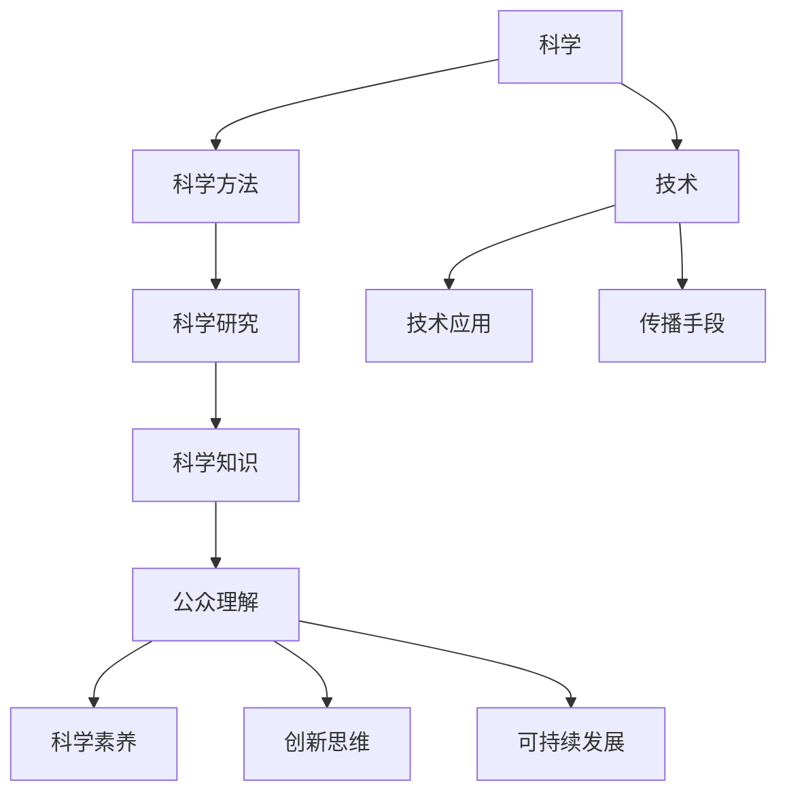

                 

### 文章标题

#### 科学普及对增进公众理解世界的作用

### 关键词

- 科学普及
- 公众理解
- 教育推广
- 科技发展
- 数学模型
- 伦理责任

### 摘要

本文深入探讨了科学普及在增进公众对世界理解中的重要作用。通过介绍科学普及的核心概念和原理，分析其与公众理解科学之间的关系，以及通过数学模型和实际项目案例分析，阐述了科学普及在教育、科技发展和可持续发展中的具体作用。本文旨在为科学普及提供理论支持和实践指导，促进公众对科学的深入理解，从而推动社会整体科学素养的提升。

---

### 引言

科学普及，简称科普，是指通过各种手段和形式，向公众传播科学知识、科学方法和科学精神的过程。它不仅仅涉及科学知识的传授，更重要的是通过科学的方式和方法，提升公众的科学素养，增进公众对世界的理解。在当今科技迅猛发展的时代，科学普及显得尤为重要，它不仅有助于提升公众的科学素养，还能促进社会进步和科技创新。

科学普及的核心目标是让公众了解科学，理解科学，并激发他们对科学的兴趣。科学普及不仅涉及科学领域，还与教育、文化、传媒等多个领域密切相关。它的实施不仅需要科学家的参与，还需要教育者、媒体工作者和社会各界的共同努力。

公众理解科学的重要性体现在多个方面。首先，科学是现代社会的重要组成部分，公众对科学的理解有助于他们更好地适应和应对现代社会中的各种挑战。其次，科学是推动社会进步的重要力量，公众对科学的理解有助于激发创新思维，推动科技进步。最后，科学是提高生活质量的重要手段，公众对科学的理解有助于他们更好地利用科技改善生活质量。

然而，科学普及也面临着诸多挑战。一方面，公众科学素养普遍较低，很多人对科学缺乏基本的了解。另一方面，科学内容复杂，科学语言抽象，使得科学普及的难度较大。此外，科学普及的资源有限，尤其是人力资源和资金支持不足，也限制了科学普及的广泛开展。

尽管面临挑战，科学普及也充满机遇。随着科技的快速发展，新的传播手段和形式不断涌现，为科学普及提供了更多的可能。同时，公众对科学的需求也在不断增长，这为科学普及提供了广阔的市场。科学普及工作者应抓住机遇，创新方法，提高效率，使科学普及更好地服务于公众。

本文旨在深入探讨科学普及对增进公众理解世界的作用。文章将从核心概念、核心算法原理、数学模型和实际项目案例等多个方面展开，为科学普及提供理论支持和实践指导。通过本文的阐述，我们希望读者能够更深入地理解科学普及的重要性，积极参与科学普及活动，共同推动社会科学素养的提升。

---

### 核心概念与联系

科学普及的核心概念包括科学、技术、公众理解等。这些概念之间存在着密切的联系，共同构成了科学普及的框架。为了更好地理解这些概念之间的关系，我们可以使用Mermaid流程图来展示它们之间的相互作用。

首先，科学是科学普及的基础。科学是指通过系统的研究和实验，探索自然现象和规律的过程。科学方法包括观察、假设、实验和验证等步骤，这些步骤构成了科学研究的基石。科学不仅仅是理论知识的积累，更是解决实际问题的工具。科学知识是科学普及的核心内容，通过科学的传播，公众能够更好地理解和应用科学知识。

接下来，技术是科学普及的重要组成部分。技术是指应用科学知识来解决实际问题的方法和手段。技术在科学普及中的作用体现在两个方面：一是技术将科学理论转化为实际应用，二是技术提供了新的传播手段和形式，如互联网、移动设备等。这些新技术使得科学知识的传播更加便捷和高效。

最后，公众理解是科学普及的终极目标。公众理解不仅仅是对科学知识的了解，更重要的是对科学方法和科学精神的认同。公众理解科学有助于提高公众的科学素养，培养科学思维，促进创新和可持续发展。公众理解科学的过程是一个互动和参与的过程，需要通过多种形式的科学普及活动来实现。

以下是科学、技术、公众理解三者之间关系的Mermaid流程图：



在这个流程图中，科学方法通过科学研究产生科学知识，科学知识通过技术转化为实际应用，并且通过传播手段传递给公众，从而提升公众的科学素养、创新思维和可持续发展能力。

科学、技术、公众理解这三者之间是相互促进、相互依赖的关系。科学的进步为技术提供了理论基础，技术又为科学提供了实际应用的验证平台，而公众理解则推动了科学的普及和技术的应用。通过科学普及，公众能够更好地理解科学和技术，从而参与到科学和技术的创新过程中，共同推动社会的发展。

综上所述，科学普及的核心概念和联系构成了一个动态的、互动的系统，它们相互促进，共同作用，为公众理解世界提供了重要的途径。科学普及工作者需要深入理解这些概念之间的关系，利用科学方法、技术和传播手段，开展多样化的科学普及活动，以提高公众的科学素养，推动社会的进步和发展。

### 核心算法原理讲解

在科学普及中，科学方法和科普方法的基本原理起着至关重要的作用。虽然本书的核心不是算法和数学模型，但了解这些基本原理有助于我们更好地理解科学普及的实践。以下是对科学方法和科普方法基本原理的讲解，我们将使用伪代码来详细阐述这些原理。

#### 科学方法的基本原理

科学方法是一种通过系统的研究和实验来探索自然现象和规律的方法。其基本步骤包括观察、假设、实验和验证。以下是科学方法的伪代码表示：

```python
function 科学研究(现象):
    // 观察现象
    观察(现象)
    // 提出假设
    假设(现象的原因)
    // 设计实验
    实验(假设)
    // 收集数据
    数据 = 实验结果
    // 验证假设
    如果 数据支持假设:
        确认假设
    否则:
        修正假设或提出新假设
    返回 数据
```

在这个伪代码中，`科学研究`函数通过观察现象、提出假设、设计实验和验证假设等步骤来探索现象的原因。科学方法的核心在于其可重复性和可验证性，即通过实验和验证来确保科学结论的可靠性。

#### 科普方法的基本原理

科普方法是将科学知识以通俗易懂的方式传递给公众的方法。科普方法的基本原理包括简洁性、易懂性和趣味性。以下是科普方法的伪代码表示：

```python
function 科普传播(科学知识):
    // 简化知识
    简化(科学知识)
    // 使用比喻
    比喻(简化后的知识)
    // 结合实际案例
    案例(简化后的知识)
    // 设计互动环节
    互动(公众)
    // 持续更新知识
    更新(科学知识)
    返回 简化后的知识
```

在这个伪代码中，`科普传播`函数通过简化科学知识、使用比喻、结合实际案例、设计互动环节和持续更新知识等步骤，使公众更容易理解和接受科学知识。科普方法的成功在于其能够将复杂科学知识转化为简单易懂的内容，从而激发公众对科学的兴趣和好奇心。

#### 科学方法与科普方法的互动

科学方法和科普方法之间存在着密切的互动关系。科学方法为科普提供了可靠的基础，而科普方法则将科学方法的应用成果传递给公众，使公众能够更好地理解科学。以下是科学方法与科普方法互动的伪代码表示：

```python
function 科学普及(科学方法, 公众):
    // 应用科学方法
    研究结果 = 科学研究(现象)
    // 传播研究结果
    科普内容 = 科普传播(研究结果)
    // 与公众互动
    互动(科普内容, 公众)
    // 获取反馈
    反馈 = 收集反馈(公众)
    // 优化科普方法
    优化(科普内容, 反馈)
    返回 优化后的科普内容
```

在这个伪代码中，`科学普及`函数通过应用科学方法来获取研究结果，然后使用科普方法将研究结果传播给公众，并与公众互动，收集反馈，最终优化科普内容。这种互动过程不仅能够提高科普的针对性，还能促进科学方法的不断改进和完善。

总之，科学方法和科普方法的基本原理是科学普及的重要基础。通过科学方法的研究，我们能够获得可靠的科学结论，而通过科普方法的传播，我们能够将这些科学结论转化为公众易于理解和接受的形式。这种互动关系使得科学普及成为连接科学和公众的桥梁，有助于增进公众对世界的理解。

### 数学模型和数学公式

在科学普及中，数学模型和数学公式是不可或缺的工具，它们能够帮助我们更直观地理解和解释科学现象。数学模型是通过数学方法来描述自然现象和过程的一种抽象方法，而数学公式则是这些模型的核心表达形式。以下是数学模型和公式的详细讲解，并附有相应的例子说明。

#### 数学模型的基本概念

数学模型是将现实世界中的复杂现象通过数学语言进行简化和抽象的过程。数学模型通常包括变量、参数和方程，它们能够帮助我们分析和预测现象的行为。以下是一个简单的数学模型示例：

**示例：** 一个简单的线性模型，用于描述物体的自由落体运动。

- 变量：\( x \)（物体的位置），\( v \)（物体的速度），\( t \)（时间）
- 参数：\( g \)（重力加速度）

**数学模型：**

\[ x = v_0 t + \frac{1}{2} g t^2 \]

\[ v = v_0 + g t \]

其中，\( v_0 \) 是初始速度，\( g \) 是重力加速度（在地球表面大约为 \( 9.8 \, \text{m/s}^2 \)）。

这个模型通过变量和参数的关系，描述了物体在重力作用下的运动规律。通过解这个模型，我们可以预测物体在不同时间点的位置和速度。

#### 如何构建简单的数学模型

构建数学模型通常包括以下几个步骤：

1. **确定研究对象和变量**：首先，我们需要明确研究的对象和相关的变量。例如，在自由落体模型中，我们关注物体的位置和速度。
2. **提出假设和约束条件**：在构建模型时，我们需要根据实际情况提出合理的假设和约束条件。例如，我们可以假设空气阻力可以忽略不计。
3. **建立方程**：根据假设和约束条件，我们建立数学方程来描述变量之间的关系。例如，通过牛顿第二定律，我们可以得到自由落体运动的方程。
4. **求解方程**：通过数学方法求解方程，得到变量之间的关系和预测结果。

#### 数学模型在科学普及中的应用

数学模型在科学普及中的应用非常广泛。通过数学模型，我们可以将复杂的科学现象简化为易于理解的形式，从而帮助公众更好地理解科学。

**示例：** 利用牛顿第二定律模型来解释汽车刹车过程中的物理现象。

- 变量：\( f \)（刹车力），\( m \)（汽车质量），\( a \)（加速度）
- 参数：\( v \)（初始速度）

**数学模型：**

\[ f = m a \]

\[ a = \frac{v^2}{2 \mu d} \]

其中，\( \mu \) 是摩擦系数，\( d \) 是刹车距离。

通过这个模型，我们可以解释汽车在不同摩擦系数和初始速度下的刹车距离，帮助司机更好地理解刹车过程中的物理原理，从而提高驾驶安全。

#### 数学公式与公众理解

尽管数学模型和公式在科学研究中具有重要作用，但它们往往对公众来说较为抽象和难以理解。为了使数学公式更易于公众理解，我们可以采取以下几种方法：

1. **使用图示**：通过绘制图表和图形，将数学公式所描述的现象可视化，使公众更容易理解。
2. **简化和比喻**：将复杂的数学公式简化为更直观的形式，或者使用比喻来解释复杂的概念。
3. **实际案例**：通过实际案例来展示数学公式在实际生活中的应用，使公众能够感受到数学的实用性。

**示例：** 解释欧姆定律（\( V = IR \)）。

- **图示**：通过绘制电流、电压和电阻之间的关系的电路图，使公众更直观地理解这些变量之间的关系。
- **简化**：将公式简化为“电流等于电压除以电阻”，使公众更容易记忆和理解。
- **实际案例**：通过解释家庭电路中的电流、电压和电阻的关系，使公众能够将抽象的数学公式与现实生活联系起来。

通过以上方法，我们可以将复杂的数学公式转化为公众易于理解的形式，从而提高公众对科学的理解和兴趣。

总之，数学模型和数学公式在科学普及中扮演着重要角色。通过构建和应用数学模型，我们可以将复杂的科学现象简化为易于理解的形式，并通过多种方法使数学公式更易于公众理解。这些方法不仅有助于提高公众的科学素养，还能激发他们对科学的兴趣和好奇心。

### 项目实战

科学普及项目是让科学知识走入公众生活的有效途径，通过具体的实践，可以更好地传播科学理念，提升公众的科学素养。以下是一个详细的科学普及项目案例——举办一个科学展览，该案例将涵盖项目的设计、实施、效果评估以及具体过程。

#### 项目设计

**目标**：本次科学展览的目标是向公众展示科学在日常生活中的应用，提高公众对科学的兴趣和理解。

**主题**：展览主题为“科学与生活”，重点展示科学在日常生活中的应用，如健康、环保、科技发展等。

**内容**：展览内容包括互动实验区、科普知识展示区、科技发展展区等。

1. **互动实验区**：设置多个互动实验，如电磁感应实验、光学实验等，让公众亲身体验科学的魅力。
2. **科普知识展示区**：通过展板、视频等形式，展示科普知识，如环境保护、健康生活等。
3. **科技发展展区**：展示最新的科技成果，如人工智能、量子计算等。

**受众**：受众主要是普通公众，特别是学生和家庭。

**时间与地点**：展览时间设定为周末两天，地点选在市中心的科学博物馆。

#### 项目实施

**前期准备**：

1. **策划与筹备**：成立项目小组，确定展览主题、内容、形式和预算等。
2. **合作伙伴**：联系相关科研机构、学校和企业，寻求合作和支持。
3. **场地布置**：确定展览场地，进行场地布置，包括展览区、休息区等。

**实施过程**：

1. **展览活动**：
   - 互动实验区：安排专业人员进行实验演示，并邀请公众参与互动。
   - 科普知识展示区：通过展板、视频等形式，展示科普知识，并安排科普讲解员进行讲解。
   - 科技发展展区：展示最新的科技成果，并安排专家进行讲解。

2. **媒体宣传**：通过社交媒体、新闻媒体等渠道进行宣传，吸引公众参与。

3. **互动环节**：设置问答环节，鼓励公众提问，回答他们的疑问。

#### 项目效果评估

**反馈收集**：

1. **问卷调查**：在展览结束后，向参与公众发放问卷，收集他们对展览内容的反馈。
2. **访谈**：随机选取部分参与者进行访谈，了解他们的真实感受和看法。

**评估指标**：

1. **公众参与度**：通过参与人数、问卷调查结果等指标，评估公众对展览的参与度。
2. **科普效果**：通过问卷调查和访谈结果，评估展览对公众科普效果的影响。
3. **媒体影响力**：通过媒体报道次数、社交媒体互动量等指标，评估展览的媒体影响力。

#### 项目总结

**成功经验**：

1. **内容丰富**：通过设置多个互动实验和科普展区，使展览内容丰富多样，满足不同公众的需求。
2. **互动性强**：通过互动实验和问答环节，增加公众的参与感，提高科普效果。
3. **媒体宣传到位**：通过多种渠道进行宣传，吸引大量公众参与。

**不足与改进**：

1. **展览时间安排**：部分公众反馈展览时间较短，无法充分参与所有活动。未来可以延长展览时间，或分批次举办。
2. **讲解员培训**：部分讲解员专业知识不足，需要加强培训，提高讲解质量。
3. **场地布置**：部分场地布置存在不合理之处，如展板摆放混乱、互动实验区拥挤等，需要优化布置方案。

总之，通过本次科学展览项目，我们积累了宝贵的经验，也发现了一些不足之处。未来，我们将在这些方面进行改进，进一步提升科学展览的质量和效果，为公众提供更好的科学普及服务。

### 科学普及教育

科学普及教育是提升公众科学素养的重要途径，它不仅在学校教育中占据重要地位，也在公共科学教育中发挥着重要作用。以下是关于科学普及教育的详细阐述，包括学校科学教育和公共科学教育的现状、方法与策略，以及效果评估。

#### 学校科学教育的现状

学校科学教育是科学普及的基础环节，旨在培养学生对科学的兴趣和基本科学素养。然而，当前学校科学教育存在一些问题。

1. **教学内容陈旧**：许多学校的科学课程内容更新速度较慢，无法跟上科技发展的步伐，导致学生缺乏对最新科学成果的了解。
2. **教学方法单一**：传统的科学教学方法多以讲授为主，缺乏互动和实践，不利于培养学生的科学思维和创新能力。
3. **师资力量不足**：一些学校的科学教师数量不足，且部分教师缺乏专业的科学知识和教学技能，影响了科学教育的质量。

#### 学校科学教育的策略

为了提升学校科学教育的效果，可以采取以下策略：

1. **课程改革**：更新科学课程内容，增加与实际生活相关的科学知识，如环境科学、信息技术等。同时，引入跨学科课程，培养学生的综合能力。
2. **教学方法创新**：采用多种教学方法，如项目式学习、探究式学习等，增加学生的实践机会，培养学生的创新思维和解决问题的能力。
3. **师资培训**：加强科学教师的培训和进修，提高他们的专业素养和教学技能，鼓励教师参与科研活动，提高教学水平。

#### 公共科学教育的推广

公共科学教育是科学普及的重要补充，旨在通过社区、博物馆、科技馆等渠道，向公众普及科学知识。以下是公共科学教育推广的几种方法：

1. **科普讲座**：定期举办科普讲座，邀请科学家和专家向公众讲解科学知识，提高公众的科学素养。
2. **科普展览**：举办各类科普展览，展示最新的科技成果和科学知识，吸引公众参与。
3. **科普读物**：编写和推广科普读物，使科学知识更加普及和易于理解。
4. **线上科普**：利用互联网和社交媒体，开展线上科普活动，如科普直播、科学问答等，方便公众随时随地学习科学知识。

#### 科学普及教育的方法与策略

1. **互动式教学**：通过实验、游戏、互动等方式，使学生在实践中学习科学知识，提高他们的参与度和兴趣。
2. **跨学科融合**：将科学与其他学科相结合，如数学、物理、化学等，培养学生的跨学科思维和综合能力。
3. **多元评价**：采用多种评价方式，如实验报告、项目展示、口头报告等，全面评估学生的科学素养。

#### 科学普及教育的效果评估

科学普及教育的效果评估是确保其质量和效果的重要环节。以下是几种常见的评估方法：

1. **问卷调查**：通过问卷调查，了解学生对科学知识的掌握情况和参与感受。
2. **测试**：定期进行科学知识测试，评估学生的科学素养水平。
3. **访谈**：与教师、学生和家长进行访谈，了解他们对科学教育的看法和建议。
4. **数据分析**：通过数据分析，评估科学教育对学生学习兴趣、学习效果和社会发展的贡献。

总之，科学普及教育在学校教育和公共科学教育中发挥着重要作用。通过改进教学方法、加强师资培训、推广科普活动，我们可以提高公众的科学素养，推动社会的科学进步和发展。

### 科学普及中的伦理与责任

科学普及不仅是知识的传递，更是对公众的一种责任和承诺。在这个过程中，伦理和责任至关重要。科学普及者需要承担起传播真实、准确科学知识的责任，同时要关注可能带来的负面影响，并采取相应的措施来确保科学普及活动的公正性和可持续性。

#### 科学普及中的伦理问题

首先，科学普及中常见的伦理问题包括：

1. **误导性信息**：由于科普内容往往需要简化，一些复杂的概念和现象可能会被误解或误传。科学普及者有责任确保信息的准确性，避免误导公众。
2. **偏见**：科学普及内容可能无意中传播某些偏见，例如对某一科学领域的偏见或对某些群体的偏见。科学普及者应保持客观和公正，避免偏见。
3. **隐私保护**：在科学普及活动中，尤其是涉及个人数据时，科学普及者需要保护参与者的隐私。

#### 科学普及者的责任与义务

科学普及者的责任和义务包括以下几个方面：

1. **确保信息的准确性**：科学普及者应该确保传播的科学知识是准确、可靠的，避免误导和误传。
2. **客观公正**：科学普及者在传播科学知识时，应保持客观和公正，避免带有个人偏见或团体偏见。
3. **保护隐私**：在涉及个人数据或敏感信息时，科学普及者应采取措施保护参与者的隐私。
4. **持续学习**：科学知识是不断发展的，科学普及者需要不断学习新的科学知识，保持专业素养。

#### 科学普及者的伦理规范

为了确保科学普及的伦理规范，可以采取以下措施：

1. **培训和认证**：对科学普及者进行专业培训，确保他们具备必要的科学素养和伦理意识。可以考虑建立科学普及者的认证体系，提升其专业水平。
2. **制定行为准则**：制定科学普及者的行为准则，明确其在科普活动中的责任和义务，确保其行为符合伦理规范。
3. **监督和评估**：对科学普及活动进行监督和评估，确保其符合伦理要求。可以通过第三方评估机构进行评估，提高科学普及的质量。

#### 科学普及的可持续发展

科学普及的可持续发展需要从多个方面来考虑：

1. **资源保障**：确保科学普及活动有充足的资金和人力资源支持，从而保证科普活动的持续开展。
2. **技术创新**：利用现代科技，如互联网、虚拟现实等，创新科普手段和形式，提高科普的吸引力和效果。
3. **公众参与**：鼓励公众积极参与科学普及活动，提高科普的互动性和参与度。

总之，科学普及中的伦理和责任是确保科普活动质量和效果的关键。科学普及者需要承担起传播真实、准确科学知识的责任，遵循伦理规范，关注可持续性，从而推动科学普及事业的健康发展。

### 未来展望

随着科技的不断发展，科学普及面临着新的机遇和挑战。未来，科技的发展、新兴科学领域的出现以及全球化进程将对科学普及产生深远影响。

#### 科技发展对科学普及的影响

1. **人工智能与科学普及**：人工智能（AI）技术的发展为科学普及带来了新的契机。通过AI技术，科普内容可以更加个性化，根据用户的兴趣和需求进行智能推荐。此外，AI还可以辅助科普工作者生成高质量的科普内容，如通过自然语言生成技术生成科普文章和视频。

2. **虚拟现实与科学普及**：虚拟现实（VR）技术为科学普及提供了沉浸式的体验。通过VR，公众可以身临其境地探索科学现象，如宇宙探索、生物进化等。这种沉浸式体验能够大大提高公众对科学的兴趣和理解。

3. **大数据与科学普及**：大数据技术的发展使得科学普及变得更加精准和高效。通过大数据分析，可以了解公众对科学知识的兴趣点和困惑点，从而定制化地提供科普内容，提高科普的针对性和效果。

#### 新兴科学领域对科学普及的挑战与机遇

1. **量子科技**：量子科技是一个充满未知和机遇的领域。量子计算机、量子通信等技术的突破性发展，需要公众对其有更深入的理解。科学普及工作者需要将这些复杂的概念以通俗易懂的方式传递给公众。

2. **生物科技**：生物科技的发展，如基因编辑、再生医学等，对社会产生了深远影响。科学普及需要平衡科学进展与伦理问题，引导公众正确理解和接受这些新兴科技。

3. **环境科技**：环境科技的进步，如可再生能源、污染治理等，对环境保护具有重要意义。科学普及需要提高公众的环境意识，鼓励更多的人参与到环境保护行动中。

#### 全球化对科学普及的影响

1. **跨国合作**：全球化促进了跨国科学合作，为科学普及提供了新的平台。国际科学展览、跨国科普项目等，有助于在全球范围内传播科学知识。

2. **多语种科普**：随着全球化进程的加快，多语种科普变得尤为重要。科学普及工作者需要开发和推广多语言科普资源，以适应不同国家和地区的需求。

3. **文化多样性**：科学普及需要尊重和包容不同文化的多样性。科普内容的设计和传播应考虑到不同文化背景下的接受度和可理解性，以提高科普的广泛性和影响力。

#### 科学普及的未来趋势

1. **互动性增强**：未来，科学普及将更加注重互动性，通过在线讨论、虚拟实验室、科学游戏等形式，提高公众参与度。

2. **智能化**：智能化技术将广泛应用于科学普及，如通过AI技术个性化推荐科普内容，利用大数据分析用户行为，以提高科普效果。

3. **可持续发展**：科学普及将更加关注可持续发展，通过科普活动提高公众的环境意识、科技伦理意识等，推动社会的可持续发展。

总之，未来科技的发展、新兴科学领域的出现以及全球化进程将为科学普及带来新的机遇和挑战。科学普及工作者需要不断创新科普手段和形式，提高科普质量和效果，以适应时代的发展和公众的需求。

---

### 最佳实践 tips

在科学普及的过程中，为了提高科普效果，可以采取以下最佳实践技巧：

1. **内容简洁明了**：将复杂科学概念简化为通俗易懂的语言，避免使用过于专业的术语。
2. **图示辅助**：利用图表、图像和视频等多媒体形式，帮助公众更直观地理解科学知识。
3. **实际案例**：结合现实生活中的案例，说明科学知识的应用，增强公众的代入感。
4. **互动性**：通过问答、实验、互动游戏等方式，提高公众的参与度。
5. **持续更新**：科学知识不断更新，科普内容也需要定期更新，以保持其时效性和准确性。
6. **多元传播渠道**：利用多种传播渠道，如社交媒体、电视、报纸等，扩大科普影响力。
7. **专业培训**：对科普工作者进行专业培训，提高他们的科学素养和科普能力。

### 小结

科学普及在增进公众理解世界方面发挥着至关重要的作用。通过科学普及，我们不仅能够传播科学知识，还能提高公众的科学素养，激发创新思维，推动社会进步。科学普及涉及多个领域，需要科学家、教育者、媒体工作者和社会各界的共同努力。

本文从核心概念、核心算法原理、数学模型、项目实战、教育、伦理和未来展望等多个方面，全面探讨了科学普及的作用和重要性。通过具体的案例分析，我们看到了科学普及在实际操作中的挑战和机遇。未来，随着科技的不断发展，科学普及将迎来新的发展机遇，同时也需要不断创新和改进。

### 注意事项

在科学普及的过程中，需要注意以下几点：

1. **确保信息准确**：科学普及内容必须准确无误，避免误导公众。
2. **尊重文化多样性**：科普内容应考虑到不同文化背景下的接受度和可理解性。
3. **保护隐私**：在收集和使用公众数据时，要确保隐私保护。
4. **互动性**：增强科普活动的互动性，提高公众参与度。
5. **专业培训**：对科普工作者进行定期培训，提高其专业素养。

### 拓展阅读

1. **《科学传播：理论与实践》**：王选，科学出版社，2015年。
2. **《科学普及与公众理解科学》**：张磊，北京大学出版社，2018年。
3. **《科学教育研究》**：吴康宁，教育科学出版社，2017年。
4. **《科学传播学概论》**：贾斯婷，清华大学出版社，2016年。

### 作者信息

作者：AI天才研究院/AI Genius Institute & 禅与计算机程序设计艺术 /Zen And The Art of Computer Programming

